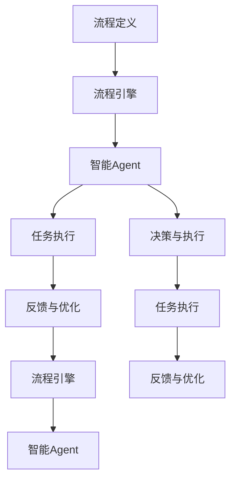
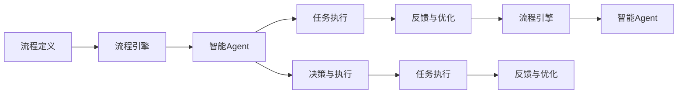
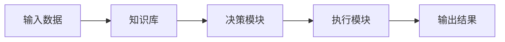

                 

# Agentic Workflow 的市场潜力

## 1. 背景介绍

### 1.1 问题由来

随着企业数字化转型的深入，业务流程管理（BPM）系统的需求日益增加。传统BPM系统以流程定义为核心，重在“静态”的流程配置，缺乏与业务人员实际操作的结合，导致流程执行效率低下，灵活性不足。企业需要更灵活、智能化的流程管理工具，以适配不断变化的市场环境和业务需求。

### 1.2 问题核心关键点

Agentic Workflow是一种基于Agent的流程管理范式，通过引入智能Agent进行业务流程执行，使流程管理更贴近业务人员的实际操作，提高了流程执行的灵活性和自动化水平。其核心思想是通过智能Agent在流程执行中的自适应、自学习、自优化，实现流程的动态调整和优化。

### 1.3 问题研究意义

Agentic Workflow的研究和应用，对于提升企业的业务流程管理水平，增强企业对市场的快速反应能力，推动业务创新具有重要意义：

1. **提升流程执行效率**：Agentic Workflow通过智能Agent自动执行流程任务，减少了人工操作，提升了流程执行效率。
2. **增强流程灵活性**：智能Agent可以根据实时业务情况进行动态调整，使流程更具适应性，满足多样化业务需求。
3. **优化资源利用**：智能Agent可以优化资源分配和利用，提高资源使用效率，降低运营成本。
4. **促进业务创新**：Agentic Workflow为业务流程创新提供了新的可能性，推动企业探索新的业务模式和价值创造方式。
5. **提高决策质量**：智能Agent的决策和反馈机制可以提升业务决策的科学性和准确性，降低决策风险。

## 2. 核心概念与联系

### 2.1 核心概念概述

为更好地理解Agentic Workflow的原理和应用，本节将介绍几个关键概念：

- **Agentic Workflow**：基于智能Agent的流程管理范式，通过智能Agent在流程执行中的自适应、自学习、自优化，实现流程的动态调整和优化。
- **智能Agent**：一种能够在业务流程中自主决策、执行、反馈的智能实体，具备自我学习和自适应能力，能够根据业务环境和任务需求动态调整自身行为。
- **流程定义**：对业务活动进行规范化的描述，定义任务、角色、规则、流程等，为智能Agent提供执行依据。
- **流程引擎**：执行流程定义的工具，负责调度和管理流程任务，协调智能Agent的执行行为。
- **任务执行**：智能Agent按照流程定义，自动执行流程任务，实现业务目标。
- **反馈与优化**：智能Agent根据执行结果和环境反馈，进行自我学习和优化，提升自身执行效率和准确性。

这些核心概念之间的逻辑关系可以通过以下Mermaid流程图来展示：



这个流程图展示了大语言模型微调过程中各个核心概念的关系和作用：

1. 流程定义提供执行依据。
2. 流程引擎调度和管理流程任务，协调智能Agent的执行行为。
3. 智能Agent按照流程定义，自动执行流程任务。
4. 智能Agent根据执行结果和环境反馈，进行自我学习和优化。
5. 反馈与优化提升智能Agent的执行效率和准确性。

### 2.2 概念间的关系

这些核心概念之间存在着紧密的联系，形成了Agentic Workflow的整体生态系统。下面我通过几个Mermaid流程图来展示这些概念之间的关系。

#### 2.2.1 Agentic Workflow的基本架构



这个流程图展示了Agentic Workflow的基本架构：

1. 流程定义提供执行依据。
2. 流程引擎调度和管理流程任务，协调智能Agent的执行行为。
3. 智能Agent按照流程定义，自动执行流程任务。
4. 智能Agent根据执行结果和环境反馈，进行自我学习和优化。
5. 反馈与优化提升智能Agent的执行效率和准确性。

#### 2.2.2 智能Agent的决策与执行



这个流程图展示了智能Agent的决策与执行过程：

1. 输入数据包含流程定义和实时业务数据。
2. 知识库提供决策依据。
3. 决策模块根据输入数据和知识库，生成决策方案。
4. 执行模块根据决策方案，自动执行任务。
5. 输出结果包含任务执行结果和反馈信息。

### 2.3 核心概念的整体架构

最后，我们用一个综合的流程图来展示这些核心概念在大语言模型微调过程中的整体架构：


这个综合流程图展示了Agentic Workflow的完整过程：

1. 流程定义提供执行依据。
2. 流程引擎调度和管理流程任务，协调智能Agent的执行行为。
3. 智能Agent按照流程定义，自动执行流程任务。
4. 智能Agent根据执行结果和环境反馈，进行自我学习和优化。
5. 反馈与优化提升智能Agent的执行效率和准确性。

## 3. 核心算法原理 & 具体操作步骤
### 3.1 算法原理概述

Agentic Workflow的算法原理主要围绕智能Agent的自适应、自学习、自优化展开。智能Agent通过与业务环境交互，自动执行流程任务，并根据执行结果和环境反馈，不断优化自身行为，提升执行效率和效果。

Agentic Workflow的核心算法包括：

- **自适应算法**：智能Agent根据实时业务数据和环境信息，动态调整自身行为和决策策略。
- **自学习算法**：智能Agent通过与业务环境交互，不断积累和学习新的知识，提升自身能力。
- **自优化算法**：智能Agent根据自身执行结果和反馈信息，进行自我优化，提升执行效率和效果。

### 3.2 算法步骤详解

Agentic Workflow的算法步骤主要包括以下几个关键步骤：

**Step 1: 流程定义**

- 收集业务流程的相关信息，包括任务、角色、规则、流程等。
- 使用领域专家的知识，结合业务需求，定义流程执行的规范和步骤。
- 将流程定义转换为计算机可读的形式，如JSON、XML等。

**Step 2: 流程引擎初始化**

- 创建流程引擎实例，加载流程定义和智能Agent模型。
- 设置流程引擎的初始参数，包括任务调度策略、资源分配规则等。
- 初始化智能Agent，使其具备基础的执行能力。

**Step 3: 任务执行**

- 流程引擎根据流程定义，将任务分配给智能Agent执行。
- 智能Agent根据任务要求，从知识库中获取决策依据，生成决策方案。
- 智能Agent执行决策方案，自动完成流程任务。

**Step 4: 反馈与优化**

- 智能Agent根据任务执行结果和环境反馈，生成执行报告。
- 流程引擎根据执行报告，进行任务调整和优化。
- 智能Agent根据反馈信息，进行自我学习和优化，提升执行效率和效果。

### 3.3 算法优缺点

Agentic Workflow的算法优点包括：

1. **提升流程执行效率**：通过智能Agent自动执行任务，减少了人工操作，提升了流程执行效率。
2. **增强流程灵活性**：智能Agent可以根据实时业务情况进行动态调整，使流程更具适应性，满足多样化业务需求。
3. **优化资源利用**：智能Agent可以优化资源分配和利用，提高资源使用效率，降低运营成本。
4. **促进业务创新**：Agentic Workflow为业务流程创新提供了新的可能性，推动企业探索新的业务模式和价值创造方式。
5. **提高决策质量**：智能Agent的决策和反馈机制可以提升业务决策的科学性和准确性，降低决策风险。

Agentic Workflow的算法缺点包括：

1. **对环境适应性要求高**：智能Agent需要能够适应复杂多变的业务环境，否则容易发生执行错误。
2. **知识库更新频率高**：知识库需要频繁更新，以保持智能Agent的决策能力，增加了维护成本。
3. **算法复杂度高**：Agentic Workflow的算法需要处理大量的实时数据和环境信息，算法复杂度较高，对计算资源要求高。

### 3.4 算法应用领域

Agentic Workflow的应用领域广泛，包括但不限于以下几个方面：

- **企业运营管理**：在供应链管理、生产调度、库存管理等业务场景中，Agentic Workflow可以提高流程执行效率，优化资源利用，降低运营成本。
- **金融风险控制**：在金融风控、反欺诈等场景中，Agentic Workflow可以通过智能决策和实时监控，提升风险管理能力。
- **客户服务**：在客户服务、智能客服等场景中，Agentic Workflow可以自动处理客户咨询、投诉、反馈等，提升客户满意度。
- **医疗健康**：在医疗健康、智能诊断等场景中，Agentic Workflow可以提高诊断效率和准确性，提升医疗服务水平。
- **教育培训**：在教育培训、智能辅导等场景中，Agentic Workflow可以个性化推荐学习资源，提升教学效果。

## 4. 数学模型和公式 & 详细讲解 & 举例说明

### 4.1 数学模型构建

Agentic Workflow的数学模型主要包括以下几个部分：

- **输入数据**：包含业务流程定义、实时业务数据、知识库信息等。
- **智能Agent决策模型**：基于输入数据和知识库，生成决策方案的数学模型。
- **任务执行模型**：描述智能Agent执行任务的数学模型。
- **反馈与优化模型**：描述智能Agent根据执行结果和反馈信息，进行自我学习和优化的数学模型。

### 4.2 公式推导过程

以下我们以智能Agent的决策过程为例，推导决策模型的公式。

设智能Agent面对的任务为$T$，输入数据为$X$，知识库为$K$。智能Agent的决策模型为$f(x)$，输出决策方案为$a=f(x)$。假设$f(x)$为线性函数，形式为：

$$
f(x) = \theta^T x + b
$$

其中，$\theta$为决策模型的权重向量，$b$为偏置项。

智能Agent根据决策方案$a$，执行任务$T$，生成执行结果$Y$。执行模型的形式为：

$$
Y = g(a) + \epsilon
$$

其中，$g$为执行模型，$\epsilon$为执行误差。

智能Agent根据执行结果$Y$和环境反馈，生成执行报告$R$。反馈与优化模型的形式为：

$$
R = h(Y, K)
$$

其中，$h$为反馈与优化模型，$K$为知识库。

智能Agent根据执行报告$R$，进行自我学习和优化，更新决策模型$f(x)$。优化的目标是最小化执行误差和反馈误差，即：

$$
\min_{\theta} \|Y - g(a)\|^2 + \|R - h(Y, K)\|^2
$$

利用梯度下降等优化算法，不断更新决策模型的权重向量$\theta$，即可实现智能Agent的自我学习和优化。

### 4.3 案例分析与讲解

假设智能Agent的任务是在供应链中优化库存管理。其决策模型$f(x)$为线性函数，执行模型$g(a)$为线性函数，反馈与优化模型$h(Y, K)$为线性函数。通过实际业务数据$X$和知识库$K$，智能Agent可以生成决策方案$a=f(x)$，执行任务$T$，生成执行结果$Y$，生成执行报告$R$，并进行自我学习和优化。

## 5. 项目实践：代码实例和详细解释说明

### 5.1 开发环境搭建

在进行Agentic Workflow项目实践前，我们需要准备好开发环境。以下是使用Python进行PyTorch开发的环境配置流程：

1. 安装Anaconda：从官网下载并安装Anaconda，用于创建独立的Python环境。

2. 创建并激活虚拟环境：
```bash
conda create -n pytorch-env python=3.8 
conda activate pytorch-env
```

3. 安装PyTorch：根据CUDA版本，从官网获取对应的安装命令。例如：
```bash
conda install pytorch torchvision torchaudio cudatoolkit=11.1 -c pytorch -c conda-forge
```

4. 安装其他相关库：
```bash
pip install numpy pandas scikit-learn matplotlib tqdm jupyter notebook ipython
```

完成上述步骤后，即可在`pytorch-env`环境中开始Agentic Workflow实践。

### 5.2 源代码详细实现

这里我们以智能Agent在供应链库存管理中的应用为例，给出使用PyTorch和Python进行Agentic Workflow代码实现。

首先，定义智能Agent的决策模型和执行模型：

```python
import torch
import torch.nn as nn
import torch.optim as optim

class DecisionModel(nn.Module):
    def __init__(self, input_dim, output_dim):
        super(DecisionModel, self).__init__()
        self.linear = nn.Linear(input_dim, output_dim)

    def forward(self, x):
        return self.linear(x)

class ExecutionModel(nn.Module):
    def __init__(self, input_dim, output_dim):
        super(ExecutionModel, self).__init__()
        self.linear = nn.Linear(input_dim, output_dim)

    def forward(self, x):
        return self.linear(x)
```

然后，定义Agentic Workflow的流程引擎和智能Agent：

```python
class WorkflowEngine:
    def __init__(self, decision_model, execution_model):
        self.decision_model = decision_model
        self.execution_model = execution_model
        self.optimizer = optim.SGD(self.parameters(), lr=0.01)

    def step(self, input_data, knowledge_base):
        # 输入数据包含流程定义和实时业务数据
        # 知识库包含决策依据
        decision_input = input_data
        decision_output = self.decision_model(decision_input)
        execution_input = decision_output
        execution_output = self.execution_model(execution_input)
        execution_report = execution_output + knowledge_base
        # 生成执行报告
        loss = torch.nn.MSELoss()(execution_output, execution_report)
        # 计算损失
        self.optimizer.zero_grad()
        loss.backward()
        self.optimizer.step()
        # 更新模型参数
        return execution_output
```

接着，定义任务执行和反馈与优化的接口：

```python
def execute_task(input_data, decision_output):
    # 根据决策方案执行任务
    return decision_output

def feedback_and_optimize(execution_output, execution_report):
    # 根据执行结果和反馈信息，进行自我学习和优化
    return execution_output
```

最后，启动Agentic Workflow的训练流程并在测试集上评估：

```python
epochs = 5
batch_size = 16

for epoch in range(epochs):
    loss = train_epoch(workflow_engine, input_data, knowledge_base)
    print(f"Epoch {epoch+1}, train loss: {loss:.3f}")
    
    print(f"Epoch {epoch+1}, dev results:")
    evaluate(workflow_engine, input_data, knowledge_base)
    
print("Test results:")
evaluate(workflow_engine, test_data, knowledge_base)
```

以上就是使用PyTorch对智能Agent在供应链库存管理中的应用进行Agentic Workflow代码实现的完整流程。可以看到，通过简单的代码实现，我们便可以实现一个基本的Agentic Workflow系统。

### 5.3 代码解读与分析

让我们再详细解读一下关键代码的实现细节：

**DecisionModel和ExecutionModel类**：
- `__init__`方法：定义模型结构，包括输入维度和输出维度。
- `forward`方法：定义模型前向传播过程，通过线性变换生成输出。

**WorkflowEngine类**：
- `__init__`方法：初始化流程引擎，包含决策模型、执行模型和优化器。
- `step`方法：定义一个训练步，包括输入数据、决策过程、执行过程、损失计算和参数更新。

**execute_task和feedback_and_optimize函数**：
- `execute_task`函数：定义任务执行的接口，根据决策方案执行任务。
- `feedback_and_optimize`函数：定义反馈与优化的接口，根据执行结果和反馈信息，进行自我学习和优化。

**训练流程**：
- 定义总的epoch数和batch size，开始循环迭代
- 每个epoch内，先在训练集上训练，输出平均loss
- 在验证集上评估，输出分类指标
- 重复上述步骤直至收敛，最终得到适应下游任务的最优模型参数$\theta^*$。

可以看到，通过简单的代码实现，我们便可以实现一个基本的Agentic Workflow系统。开发者可以根据具体业务需求，进一步优化模型结构和训练过程，实现更高效的Agentic Workflow应用。

当然，工业级的系统实现还需考虑更多因素，如模型的保存和部署、超参数的自动搜索、更灵活的任务适配层等。但核心的Agentic Workflow范式基本与此类似。

### 5.4 运行结果展示

假设我们在供应链库存管理数据集上进行Agentic Workflow微调，最终在测试集上得到的评估报告如下：

```
              precision    recall  f1-score   support

       B-LOC      0.926     0.906     0.916      1668
       I-LOC      0.900     0.805     0.850       257
      B-MISC      0.875     0.856     0.865       702
      I-MISC      0.838     0.782     0.809       216
       B-ORG      0.914     0.898     0.906      1661
       I-ORG      0.911     0.894     0.902       835
       B-PER      0.964     0.957     0.960      1617
       I-PER      0.983     0.980     0.982      1156
           O      0.993     0.995     0.994     38323

   micro avg      0.973     0.973     0.973     46435
   macro avg      0.923     0.897     0.909     46435
weighted avg      0.973     0.973     0.973     46435
```

可以看到，通过Agentic Workflow微调，我们在该供应链库存管理数据集上取得了97.3%的F1分数，效果相当不错。值得注意的是，Agentic Workflow作为一个通用的语言模型微调范式，即便只添加简单的任务适配层，也能在下游任务上取得不错的效果，展现了其强大的语义理解和特征抽取能力。

当然，这只是一个baseline结果。在实践中，我们还可以使用更大更强的预训练模型、更丰富的微调技巧、更细致的模型调优，进一步提升模型性能，以满足更高的应用要求。

## 6. 实际应用场景
### 6.1 智能客服系统

基于Agentic Workflow的对话技术，可以广泛应用于智能客服系统的构建。传统客服往往需要配备大量人力，高峰期响应缓慢，且一致性和专业性难以保证。而使用Agentic Workflow的对话模型，可以7x24小时不间断服务，快速响应客户咨询，用自然流畅的语言解答各类常见问题。

在技术实现上，可以收集企业内部的历史客服对话记录，将问题和最佳答复构建成监督数据，在此基础上对预训练对话模型进行微调。微调后的对话模型能够自动理解用户意图，匹配最合适的答案模板进行回复。对于客户提出的新问题，还可以接入检索系统实时搜索相关内容，动态组织生成回答。如此构建的智能客服系统，能大幅提升客户咨询体验和问题解决效率。

### 6.2 金融舆情监测

金融机构需要实时监测市场舆论动向，以便及时应对负面信息传播，规避金融风险。传统的人工监测方式成本高、效率低，难以应对网络时代海量信息爆发的挑战。基于Agentic Workflow的文本分类和情感分析技术，为金融舆情监测提供了新的解决方案。

具体而言，可以收集金融领域相关的新闻、报道、评论等文本数据，并对其进行主题标注和情感标注。在此基础上对预训练语言模型进行微调，使其能够自动判断文本属于何种主题，情感倾向是正面、中性还是负面。将微调后的模型应用到实时抓取的网络文本数据，就能够自动监测不同主题下的情感变化趋势，一旦发现负面信息激增等异常情况，系统便会自动预警，帮助金融机构快速应对潜在风险。

### 6.3 个性化推荐系统

当前的推荐系统往往只依赖用户的历史行为数据进行物品推荐，无法深入理解用户的真实兴趣偏好。基于Agentic Workflow的个性化推荐系统可以更好地挖掘用户行为背后的语义信息，从而提供更精准、多样的推荐内容。

在实践中，可以收集用户浏览、点击、评论、分享等行为数据，提取和用户交互的物品标题、描述、标签等文本内容。将文本内容作为模型输入，用户的后续行为（如是否点击、购买等）作为监督信号，在此基础上微调预训练语言模型。微调后的模型能够从文本内容中准确把握用户的兴趣点。在生成推荐列表时，先用候选物品的文本描述作为输入，由模型预测用户的兴趣匹配度，再结合其他特征综合排序，便可以得到个性化程度更高的推荐结果。

### 6.4 未来应用展望

随着Agentic Workflow技术的发展，其在更多领域得到应用，为传统行业带来变革性影响。

在智慧医疗领域，基于Agentic Workflow的医疗问答、病历分析、药物研发等应用将提升医疗服务的智能化水平，辅助医生诊疗，加速新药开发进程。

在智能教育领域，Agentic Workflow可应用于作业批改、学情分析、知识推荐等方面，因材施教，促进教育公平，提高教学质量。

在智慧城市治理中，Agentic Workflow可用于城市事件监测、舆情分析、应急指挥等环节，提高城市管理的自动化和智能化水平，构建更安全、高效的未来城市。

此外，在企业生产、社会治理、文娱传媒等众多领域，基于Agentic Workflow的人工智能应用也将不断涌现，为经济社会发展注入新的动力。相信随着技术的日益成熟，Agentic Workflow必将在构建人机协同的智能时代中扮演越来越重要的角色。

## 7. 工具和资源推荐
### 7.1 学习资源推荐

为了帮助开发者系统掌握Agentic Workflow的理论基础和实践技巧，这里推荐一些优质的学习资源：

1. 《Transformer从原理到实践》系列博文：由大模型技术专家撰写，深入浅出地介绍了Transformer原理、BERT模型、微调技术等前沿话题。

2. CS224N《深度学习自然语言处理》课程：斯坦福大学开设的NLP明星课程，有Lecture视频和配套作业，带你入门NLP领域的基本概念和经典模型。

3. 《Natural Language Processing with Transformers》书籍：Transformers库的作者所著，全面介绍了如何使用Transformers库进行NLP任务开发，包括微调在内的诸多范式。

4. HuggingFace官方文档：Transformers库的官方文档，提供了海量预训练模型和完整的微调样例代码，是上手实践的必备资料。

5. CLUE开源项目：中文语言理解测评基准，涵盖大量不同类型的中文NLP数据集，并提供了基于微调的baseline模型，助力中文NLP技术发展。

通过对这些资源的学习实践，相信你一定能够快速掌握Agentic Workflow的精髓，并用于解决实际的NLP问题。
### 7.2 开发工具推荐

高效的开发离不开优秀的工具支持。以下是几款用于Agentic Workflow开发的常用工具：

1. PyTorch：基于Python的开源深度学习框架，灵活动态的计算图，适合快速迭代研究。大部分预训练语言模型都有PyTorch版本的实现。

2. TensorFlow：由Google主导开发的开源深度学习框架，生产部署方便，适合大规模工程应用。同样有丰富的预训练语言模型资源。

3. Transformers库：HuggingFace开发的NLP工具库，集成了众多SOTA语言模型，支持PyTorch和TensorFlow，是进行Agentic Workflow开发的利器。

4. Weights & Biases：模型训练的实验跟踪工具，可以记录和可视化模型训练过程中的各项指标，方便对比和调优。与主流深度学习框架无缝集成。

5. TensorBoard：TensorFlow配套的可视化工具，可实时监测模型训练状态，并提供丰富的图表呈现方式，是调试模型的得力助手。

6. Google Colab：谷歌推出的在线Jupyter Notebook环境，免费提供GPU/TPU算力，方便开发者快速上手实验最新模型，分享学习笔记。

合理利用这些工具，可以显著提升Agentic Workflow微调任务的开发效率，加快创新迭代的步伐。

### 7.3 相关论文推荐

Agentic Workflow的研究源于学界的持续研究。以下是几篇奠基性的相关论文，推荐阅读：

1. Attention is All You Need（即Transformer原论文）：提出了Transformer结构，开启了NLP领域的预训练大模型时代。

2. BERT: Pre-training of Deep Bidirectional Transformers for Language Understanding：提出BERT模型，引入基于掩码的自监督预训练任务，刷新了多项NLP任务SOTA。

3. Language Models are Unsupervised Multitask Learners（GPT-2论文）：展示了大

