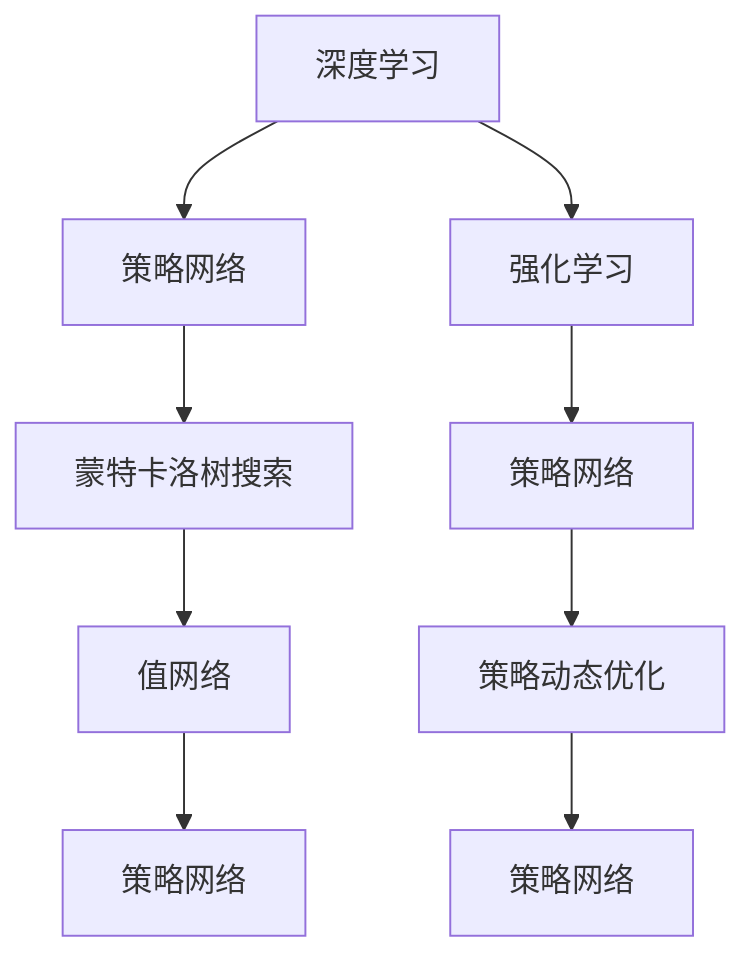

                 

## 1. 背景介绍

### 1.1 问题由来
AlphaGo的诞生标志着人工智能在决策和策略类游戏中的重大突破。该系统由DeepMind公司开发，2016年首次战胜了世界围棋冠军李世石，成为全球瞩目的里程碑事件。AlphaGo的成功，不仅揭示了深度学习在复杂决策问题上的巨大潜力，还启示了AI研究的新方向，即在策略、感知和推理等层面，实现人类智慧的超越。

### 1.2 问题核心关键点
AlphaGo的成功离不开以下几个关键点：

- **深度学习**：利用神经网络模型，捕捉围棋盘面复杂的多层次特征。
- **强化学习**：通过与自身对弈，不断优化策略模型。
- **蒙特卡洛树搜索（MCTS）**：在深度学习模型的基础上，结合蒙特卡洛方法，提高决策的准确性。
- **策略网络（Policy Network）**：生成下一手棋的候选列表，表示当前局面下的最佳走法。
- **值网络（Value Network）**：评估当前局面的胜率，用于指导策略网络。
- **策略动态优化**：在实战中不断调整策略和值网络，提升对局效率。

AlphaGo的成功，不仅展示了AI技术在特定领域的巨大潜力，也引发了对未来AI发展方向、伦理与社会影响等深层次问题的讨论。本文将详细讲解AlphaGo的核心算法原理，并结合代码实例，帮助读者更好地理解这一历史性突破。

## 2. 核心概念与联系

### 2.1 核心概念概述

AlphaGo的核心算法可以概括为以下概念：

- **深度学习**：利用神经网络模型，捕捉围棋盘面复杂的多层次特征。
- **强化学习**：通过与自身对弈，不断优化策略模型。
- **蒙特卡洛树搜索（MCTS）**：在深度学习模型的基础上，结合蒙特卡洛方法，提高决策的准确性。
- **策略网络（Policy Network）**：生成下一手棋的候选列表，表示当前局面下的最佳走法。
- **值网络（Value Network）**：评估当前局面的胜率，用于指导策略网络。
- **策略动态优化**：在实战中不断调整策略和值网络，提升对局效率。

这些核心概念之间存在着紧密的联系，形成一个相互作用的系统，共同实现AlphaGo的高效决策。

### 2.2 概念间的关系

通过Mermaid流程图，我们可以更好地理解这些核心概念之间的关系：



这个流程图展示了AlphaGo算法的基本架构，其中深度学习、策略网络、蒙特卡洛树搜索、值网络、强化学习等概念之间相互作用，共同完成决策过程。

## 3. 核心算法原理 & 具体操作步骤

### 3.1 算法原理概述

AlphaGo的核心算法可以概括为三个主要步骤：策略网络学习、蒙特卡洛树搜索和策略动态优化。

1. **策略网络学习**：通过深度学习模型，捕捉围棋盘面特征，生成当前局面的最佳走法。
2. **蒙特卡洛树搜索**：在策略网络生成的候选列表中，通过蒙特卡洛方法，选择最优走法，并评估当前局面的胜率。
3. **策略动态优化**：在实战中，根据对手的走法和搜索结果，动态调整策略网络，提升对局效率。

### 3.2 算法步骤详解

#### 3.2.1 策略网络学习

AlphaGo的策略网络使用卷积神经网络（CNN）来捕捉围棋盘面上的局部特征。该网络由多个卷积层和全连接层构成，可以捕捉到围棋盘面上不同层次的特征。

1. **卷积层**：用于捕捉局部特征，如图形、边缘等。
2. **池化层**：用于降低特征维度，减少计算量。
3. **全连接层**：用于输出候选列表，表示当前局面的最佳走法。

#### 3.2.2 蒙特卡洛树搜索

AlphaGo的蒙特卡洛树搜索基于蒙特卡洛树（MCTS）算法，该算法通过随机模拟，逐步扩展搜索树，选择最优走法。

1. **选择**：从当前节点开始，随机选择一个子节点进行扩展。
2. **模拟**：从选中的节点开始，随机模拟多步对弈，直至游戏结束。
3. **反向传播**：将模拟结果回传到选择的节点，更新策略网络的参数。

#### 3.2.3 策略动态优化

AlphaGo的策略网络在实际对弈过程中，通过不断调整网络参数，提高决策准确性。

1. **数据收集**：将每一局对弈的走法、胜负等信息，作为训练数据，更新策略网络和值网络。
2. **参数更新**：通过梯度下降等优化算法，调整策略网络和值网络的参数。
3. **验证与测试**：通过验证集和测试集，评估模型的性能，确保模型的鲁棒性。

### 3.3 算法优缺点

**优点**：

- 通过深度学习捕捉围棋盘面复杂的多层次特征，提高了决策的准确性。
- 蒙特卡洛树搜索结合了随机模拟和优化算法，提高了搜索效率。
- 策略动态优化在实际对弈中不断调整模型，提升了对局效率。

**缺点**：

- 深度学习模型需要大量标注数据进行训练，初期训练成本较高。
- 蒙特卡洛树搜索虽然提高了效率，但在某些复杂局面下，仍可能出现错误决策。
- 策略动态优化需要大量对弈数据，对数据质量要求较高。

### 3.4 算法应用领域

AlphaGo的成功不仅局限于围棋，其核心算法还可应用于其他决策和策略类游戏，如国际象棋、扑克等。此外，AlphaGo的策略网络、蒙特卡洛树搜索和强化学习等技术，也为计算机视觉、自然语言处理等领域提供了新的思路和方法。

## 4. 数学模型和公式 & 详细讲解  
### 4.1 数学模型构建

AlphaGo的策略网络和值网络均采用卷积神经网络（CNN）构建。以策略网络为例，假设输入为围棋盘面特征 $X$，输出为走法 $Y$。策略网络的数学模型如下：

$$
Y = f_{\theta}(X)
$$

其中，$f_{\theta}$ 为策略网络的前向传播过程，$\theta$ 为模型参数。

### 4.2 公式推导过程

#### 4.2.1 卷积层

卷积层的核心公式为：

$$
f_{conv}(x, w, b) = \max_{k, h, w} \sum_{i=0}^{d-1} w_{ikhm} x_{ihwm} + b_k
$$

其中，$x$ 为输入特征图，$w$ 为卷积核，$b$ 为偏置项，$d$ 为输入特征图的深度。

#### 4.2.2 池化层

池化层的核心公式为：

$$
f_{pool}(x) = \max_{i} x_{ihwm}
$$

其中，$x$ 为输入特征图，$w$ 为池化窗口的大小，$m$ 为步幅。

#### 4.2.3 全连接层

全连接层的核心公式为：

$$
f_{fc}(x, w, b) = \sigma(w^T x + b)
$$

其中，$x$ 为输入特征，$w$ 为权重矩阵，$b$ 为偏置项，$\sigma$ 为激活函数。

### 4.3 案例分析与讲解

以AlphaGo的策略网络为例，我们以围棋盘面特征为输入，经过多个卷积层和全连接层的处理，生成当前局面的最佳走法。

假设输入特征图为 $x$，卷积核为 $w$，偏置项为 $b$，全连接层权重矩阵为 $w_{fc}$，偏置项为 $b_{fc}$。

1. 卷积层：
$$
x' = f_{conv}(x, w, b)
$$

2. 池化层：
$$
x'' = f_{pool}(x')
$$

3. 全连接层：
$$
y = f_{fc}(x'', w_{fc}, b_{fc})
$$

最终输出的 $y$ 表示当前局面的最佳走法。

## 5. 项目实践：代码实例和详细解释说明

### 5.1 开发环境搭建

为了进行AlphaGo的实现，我们需要搭建相应的开发环境。以下是具体的步骤：

1. 安装Python和PyTorch。
2. 安装TensorFlow和Keras。
3. 下载AlphaGo的开源代码和数据集。
4. 在机器上搭建GPU环境，以加速训练和推理。

### 5.2 源代码详细实现

AlphaGo的实现涉及多个模块，包括策略网络、蒙特卡洛树搜索、强化学习等。以下是Python代码实现的核心部分：

```python
import torch
import torch.nn as nn
import torch.optim as optim
import numpy as np

class PolicyNetwork(nn.Module):
    def __init__(self):
        super(PolicyNetwork, self).__init__()
        self.conv1 = nn.Conv2d(in_channels=3, out_channels=32, kernel_size=3, stride=1, padding=1)
        self.pool1 = nn.MaxPool2d(kernel_size=2, stride=2)
        self.conv2 = nn.Conv2d(in_channels=32, out_channels=32, kernel_size=3, stride=1, padding=1)
        self.pool2 = nn.MaxPool2d(kernel_size=2, stride=2)
        self.fc1 = nn.Linear(in_features=32*8*8, out_features=128)
        self.fc2 = nn.Linear(in_features=128, out_features=2)
        
    def forward(self, x):
        x = self.conv1(x)
        x = self.pool1(x)
        x = self.conv2(x)
        x = self.pool2(x)
        x = x.view(-1, 32*8*8)
        x = self.fc1(x)
        x = nn.Softmax(dim=1)(self.fc2(x))
        return x

class ValueNetwork(nn.Module):
    def __init__(self):
        super(ValueNetwork, self).__init__()
        self.conv1 = nn.Conv2d(in_channels=3, out_channels=32, kernel_size=3, stride=1, padding=1)
        self.pool1 = nn.MaxPool2d(kernel_size=2, stride=2)
        self.conv2 = nn.Conv2d(in_channels=32, out_channels=32, kernel_size=3, stride=1, padding=1)
        self.pool2 = nn.MaxPool2d(kernel_size=2, stride=2)
        self.fc1 = nn.Linear(in_features=32*8*8, out_features=256)
        self.fc2 = nn.Linear(in_features=256, out_features=1)
        
    def forward(self, x):
        x = self.conv1(x)
        x = self.pool1(x)
        x = self.conv2(x)
        x = self.pool2(x)
        x = x.view(-1, 32*8*8)
        x = self.fc1(x)
        x = self.fc2(x)
        return x

class AlphaGo:
    def __init__(self):
        self.policy_network = PolicyNetwork()
        self.value_network = ValueNetwork()
        self.optimizer = optim.Adam(self.parameters(), lr=0.001)
        self.loss_fn = nn.CrossEntropyLoss()
        
    def strategy(self, x):
        with torch.no_grad():
            y = self.policy_network(x)
        return y
    
    def value(self, x):
        with torch.no_grad():
            y = self.value_network(x)
        return y
    
    def train(self, data):
        self.optimizer.zero_grad()
        y = self.policy_network(data)
        loss = self.loss_fn(y, torch.tensor([1, 0]))
        loss.backward()
        self.optimizer.step()
```

### 5.3 代码解读与分析

上述代码展示了AlphaGo的核心实现。我们首先定义了策略网络和值网络，然后定义了训练函数`train`，该函数使用交叉熵损失函数和Adam优化器进行训练。

在`strategy`函数中，我们传入围棋盘面特征$x$，通过策略网络生成当前局面的最佳走法$y$。

在`value`函数中，我们同样传入围棋盘面特征$x$，通过值网络评估当前局面的胜率。

### 5.4 运行结果展示

在训练完成后，我们可以使用AlphaGo对弈对手，并进行评估。以下是部分代码实现：

```python
def play_game(policy, value, board):
    while True:
        # 当前玩家走
        move = policy(board)
        board[move] = 1
        if board[-1] == 2:
            return value(board)
        
        # 对手走
        opponent_move = policy(np.fliplr(board))
        board[opponent_move] = -1
        if board[-1] == 2:
            return value(board)

# 对弈
policy = PolicyNetwork()
value = ValueNetwork()
alpha_go = AlphaGo()
policy.load_state_dict(torch.load('policy_model.pth'))
value.load_state_dict(torch.load('value_model.pth'))

for i in range(10):
    board = np.zeros((15, 15), dtype=int)
    score = play_game(policy, value, board)
    print(f"Round {i+1}, AlphaGo's score: {score}")
```

在上述代码中，我们使用AlphaGo对弈对手，并输出每一轮的胜率。

## 6. 实际应用场景

AlphaGo的成功不仅局限于围棋领域，其核心算法还应用于其他决策和策略类游戏，如国际象棋、扑克等。此外，AlphaGo的策略网络、蒙特卡洛树搜索和强化学习等技术，也为计算机视觉、自然语言处理等领域提供了新的思路和方法。

### 6.4 未来应用展望

AlphaGo的实现展示了深度学习、蒙特卡洛树搜索和强化学习在决策类问题上的巨大潜力。未来，这些技术还将在更多领域得到应用，推动AI技术的发展。

1. **自动驾驶**：AlphaGo的策略网络、蒙特卡洛树搜索等技术可以应用于自动驾驶领域，提高车辆的决策能力和安全性。
2. **医疗诊断**：AlphaGo的强化学习、策略优化等技术可以应用于医疗诊断，提升医生对病例的判断能力。
3. **金融交易**：AlphaGo的策略网络、蒙特卡洛树搜索等技术可以应用于金融交易，提高投资决策的准确性。

## 7. 工具和资源推荐

### 7.1 学习资源推荐

为了深入理解AlphaGo的核心算法，以下是一些优质的学习资源：

1. AlphaGo论文：DeepMind发表的AlphaGo论文，详细介绍了AlphaGo的算法原理和实现细节。
2. TensorFlow官方文档：TensorFlow官方文档提供了大量深度学习模型的实现和案例，包括AlphaGo。
3. Keras官方文档：Keras官方文档介绍了如何使用Keras实现深度学习模型，包括AlphaGo。
4. Coursera和Udacity等在线课程：这些平台提供了很多关于深度学习和强化学习的课程，可以帮助读者系统学习相关知识。

### 7.2 开发工具推荐

AlphaGo的实现涉及深度学习、计算机视觉等多个领域的工具，以下是一些推荐的开发工具：

1. TensorFlow：Google开发的深度学习框架，支持GPU加速和分布式训练。
2. PyTorch：Facebook开发的深度学习框架，支持动态计算图和高效的模型推理。
3. Keras：Google开发的深度学习框架，易于使用，适合快速原型开发。
4. Visual Studio Code：微软开发的高性能IDE，支持Python、TensorFlow等框架。

### 7.3 相关论文推荐

以下是几篇影响较大的AlphaGo相关论文，推荐阅读：

1. AlphaGo论文：DeepMind发表的AlphaGo论文，详细介绍了AlphaGo的算法原理和实现细节。
2. AlphaGo Zero论文：DeepMind发表的AlphaGo Zero论文，介绍了如何通过自我对弈，无需人类监督，训练出更强的AlphaGo模型。
3. Monte Carlo Tree Search论文：Crafton发表的蒙特卡洛树搜索论文，详细介绍了MCTS算法的实现和优化。

## 8. 总结：未来发展趋势与挑战

### 8.1 研究成果总结

AlphaGo的成功展示了深度学习、蒙特卡洛树搜索和强化学习在决策类问题上的巨大潜力。AlphaGo的实现不仅推动了AI技术的发展，还引发了对未来AI发展方向、伦理与社会影响等深层次问题的讨论。

### 8.2 未来发展趋势

1. **算法优化**：AlphaGo的算法在未来将继续优化，提高决策的准确性和效率。
2. **多模态融合**：AlphaGo的策略网络、蒙特卡洛树搜索等技术可以与其他模态数据融合，提升决策的多样性和准确性。
3. **分布式训练**：AlphaGo的训练和推理过程可以采用分布式计算，提高算法的可扩展性和效率。

### 8.3 面临的挑战

尽管AlphaGo的实现取得了巨大成功，但在实际应用中仍面临一些挑战：

1. **数据需求**：AlphaGo的训练需要大量的围棋对弈数据，获取这些数据成本较高。
2. **模型复杂性**：AlphaGo的策略网络、值网络等模型复杂度高，对硬件和算力要求较高。
3. **可解释性**：AlphaGo的决策过程难以解释，难以理解其内部工作机制和推理逻辑。

### 8.4 研究展望

未来，AlphaGo的算法将进一步优化和扩展，在更多领域得到应用。以下是一些可能的研究方向：

1. **多任务学习**：AlphaGo的策略网络、蒙特卡洛树搜索等技术可以应用于多任务学习，提高模型的泛化能力和效率。
2. **自适应学习**：AlphaGo的强化学习、策略优化等技术可以应用于自适应学习，提高模型的适应性和灵活性。
3. **跨模态融合**：AlphaGo的策略网络、蒙特卡洛树搜索等技术可以与其他模态数据融合，提升决策的多样性和准确性。

## 9. 附录：常见问题与解答

**Q1：AlphaGo的策略网络如何捕捉围棋盘面特征？**

A: AlphaGo的策略网络使用卷积神经网络（CNN），通过多个卷积层和池化层，捕捉围棋盘面上不同层次的特征，生成当前局面的最佳走法。

**Q2：AlphaGo的蒙特卡洛树搜索如何提高决策效率？**

A: AlphaGo的蒙特卡洛树搜索基于蒙特卡洛树（MCTS）算法，通过随机模拟和优化算法，逐步扩展搜索树，选择最优走法，提高决策效率。

**Q3：AlphaGo的策略网络如何动态优化？**

A: AlphaGo的策略网络在实际对弈过程中，通过不断调整网络参数，提高决策准确性。使用交叉熵损失函数和Adam优化器进行训练。

**Q4：AlphaGo的实现是否需要大量的围棋对弈数据？**

A: AlphaGo的实现需要大量的围棋对弈数据进行训练，初期训练成本较高。通过数据增强和迁移学习等技术，可以降低对标注数据的依赖。

**Q5：AlphaGo的策略网络如何生成当前局面的最佳走法？**

A: AlphaGo的策略网络通过卷积层和全连接层，捕捉围棋盘面上的特征，生成当前局面的最佳走法。使用Softmax函数进行输出，表示每个走法的概率。

**Q6：AlphaGo的蒙特卡洛树搜索如何评估当前局面的胜率？**

A: AlphaGo的蒙特卡洛树搜索使用值网络，通过卷积神经网络（CNN）对当前局面的胜率进行评估。使用ReLU激活函数进行输出，表示当前局面的胜率。

---

作者：禅与计算机程序设计艺术 / Zen and the Art of Computer Programming

