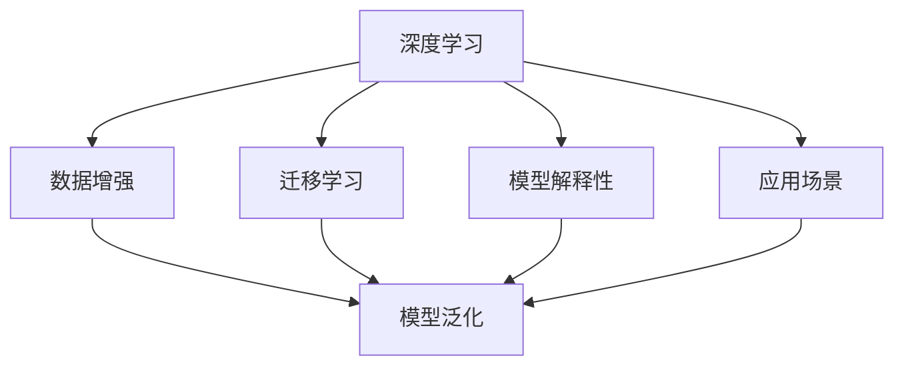
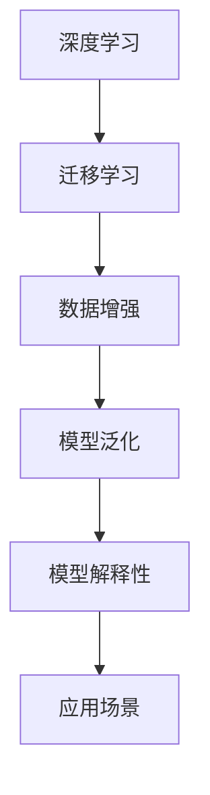

                 

# Andrej Karpathy谈自动化革命

## 1. 背景介绍

**问题由来**

随着人工智能技术的不断进步，自动化革命已经成为了推动社会和经济发展的关键力量。从早期的工业自动化到现在的智能自动化，人类社会正在经历一场深刻的变革。 Andrej Karpathy 是深度学习领域的著名专家，其研究不仅推动了计算机视觉的发展，更对人工智能的自动化革命起到了重要的推动作用。

**问题核心关键点**

自动化革命的核心在于通过深度学习和人工智能技术，使机器能够理解和执行人类复杂的任务。其关键点包括：
1. 高效数据处理：自动化革命需要大量的数据来训练模型，如何高效处理和分析数据是一个重要问题。
2. 深度学习模型：深度学习模型在图像识别、自然语言处理等领域表现出色，是实现自动化的关键技术。
3. 数据增强：在有限的数据量下，如何通过数据增强技术提升模型的泛化能力是一个重要挑战。
4. 迁移学习：在新的任务上，如何利用已有的知识进行迁移学习，是一个重要的研究方向。
5. 模型解释性：自动化系统如何提高模型的解释性，确保其决策过程透明，是一个亟待解决的问题。
6. 应用场景：自动化技术如何在医疗、交通、金融等领域落地应用，是一个需要深入研究的话题。

**问题研究意义**

自动化革命将对人类社会产生深远影响，不仅可以提升生产效率，降低成本，还能解放人力资源，推动社会进步。 Andrej Karpathy 的研究不仅推动了深度学习的发展，也为自动化技术的落地应用提供了重要参考。通过学习其研究成果，我们能够更好地理解自动化的本质，探索自动化革命的潜力，为未来的研究与实践提供指导。

## 2. 核心概念与联系

### 2.1 核心概念概述

本节将详细介绍与自动化革命相关的核心概念，包括深度学习、迁移学习、数据增强、模型解释性、应用场景等。

- **深度学习**：一种通过多层神经网络对数据进行抽象表示的机器学习方法。在图像识别、自然语言处理等领域表现优异。
- **迁移学习**：在新的任务上，利用已有的知识进行训练，以减少训练时间和数据需求。
- **数据增强**：通过对训练数据进行变换、扩充，以增加数据多样性，提高模型的泛化能力。
- **模型解释性**：如何理解模型的决策过程，确保其透明度和可解释性。
- **应用场景**：自动化技术在不同领域的应用，如医疗、交通、金融等。

### 2.2 概念间的关系

这些核心概念之间存在紧密的联系，构成了自动化革命的核心生态系统。以下是一个 Mermaid 流程图，展示了这些概念之间的关系：



### 2.3 核心概念的整体架构

以下是一个综合的 Mermaid 流程图，展示了这些核心概念在自动化革命中的整体架构：



## 3. 核心算法原理 & 具体操作步骤

### 3.1 算法原理概述

自动化革命的核心在于利用深度学习和迁移学习技术，使机器能够理解和执行复杂任务。其基本流程包括数据预处理、模型训练、模型微调等步骤。

### 3.2 算法步骤详解

**Step 1: 数据预处理**

- 收集和整理数据：自动化革命需要大量标注数据进行训练。
- 数据清洗：去除噪声、异常值等，确保数据质量。
- 数据增强：通过翻转、旋转、缩放等技术，增加数据多样性，提高模型泛化能力。

**Step 2: 模型训练**

- 选择模型架构：如卷积神经网络(CNN)、递归神经网络(RNN)、Transformer 等。
- 设定损失函数：如交叉熵损失、均方误差损失等。
- 设置优化器：如 Adam、SGD 等，设定学习率和正则化参数。
- 训练模型：使用 GPU 或 TPU 进行模型训练，记录训练日志。

**Step 3: 模型微调**

- 导入预训练模型：如 ImageNet 预训练的 ResNet、BERT 预训练的 Transformer 等。
- 冻结预训练层：通常只微调顶层，固定底层权重。
- 更新参数：根据下游任务的需求，更新顶层参数。
- 验证和测试：在验证集和测试集上评估模型性能，调整超参数。

### 3.3 算法优缺点

**优点**

- 高效性：利用深度学习和大规模数据，可以显著提升任务处理效率。
- 泛化能力：迁移学习可以加速新任务上的模型训练，提高泛化能力。
- 可解释性：通过模型解释性技术，理解模型决策过程，提高透明度。

**缺点**

- 数据需求：需要大量标注数据，数据采集和处理成本较高。
- 计算资源：需要高性能硬件设备，计算成本较高。
- 模型复杂性：深度学习模型结构复杂，调试和维护困难。

### 3.4 算法应用领域

自动化革命涵盖了多个领域，包括计算机视觉、自然语言处理、机器人、医疗等。以下是一些典型的应用场景：

- **计算机视觉**：如目标检测、图像分类、人脸识别等。
- **自然语言处理**：如机器翻译、文本摘要、情感分析等。
- **机器人**：如自主导航、智能家居、工业自动化等。
- **医疗**：如影像诊断、基因分析、药物研发等。

## 4. 数学模型和公式 & 详细讲解

### 4.1 数学模型构建

自动化革命中的深度学习模型通常采用神经网络结构，如卷积神经网络(CNN)、递归神经网络(RNN)、Transformer 等。以 Transformer 为例，其基本结构包括编码器-解码器结构，每个层包含多头自注意力机制和前馈神经网络。

### 4.2 公式推导过程

**Transformer 模型**

Transformer 模型由编码器-解码器组成，每个层包含多头自注意力机制和前馈神经网络。以下是 Transformer 模型的公式推导过程：

$$
\text{Multi-Head Self-Attention}(\mathbf{Q}, \mathbf{K}, \mathbf{V}) = \text{Softmax}(\mathbf{Q} \mathbf{K}^T) \mathbf{V}
$$

其中 $\mathbf{Q}, \mathbf{K}, \mathbf{V}$ 分别为查询、键、值矩阵，Softmax 函数用于计算注意力权重。

**深度学习模型**

深度学习模型通常采用反向传播算法进行训练，其公式推导过程如下：

$$
\min_{\theta} \frac{1}{m} \sum_{i=1}^m \mathcal{L}(f_{\theta}(\mathbf{x}_i), \mathbf{y}_i)
$$

其中 $\theta$ 为模型参数，$m$ 为训练样本数，$\mathbf{x}_i$ 为输入，$\mathbf{y}_i$ 为标签，$\mathcal{L}$ 为损失函数。

### 4.3 案例分析与讲解

**目标检测**

目标检测是一个典型的计算机视觉任务，可以使用 Faster R-CNN 等模型进行训练。以下是一个简单的目标检测示例：

1. 数据预处理：收集图像数据，进行数据增强，如翻转、缩放等。
2. 模型训练：使用 Faster R-CNN 模型，在 ImageNet 数据集上进行预训练。
3. 模型微调：导入预训练模型，微调顶层参数，使用 COCO 数据集进行微调。
4. 测试：在测试集上评估模型性能，使用 mAP 指标。

## 5. 项目实践：代码实例和详细解释说明

### 5.1 开发环境搭建

以下是在 PyTorch 环境下搭建深度学习模型的开发环境流程：

1. 安装 Anaconda：从官网下载并安装 Anaconda，用于创建独立的 Python 环境。
2. 创建并激活虚拟环境：
```bash
conda create -n pytorch-env python=3.8 
conda activate pytorch-env
```

3. 安装 PyTorch：根据 CUDA 版本，从官网获取对应的安装命令。例如：
```bash
conda install pytorch torchvision torchaudio cudatoolkit=11.1 -c pytorch -c conda-forge
```

4. 安装 Transformers 库：
```bash
pip install transformers
```

5. 安装各类工具包：
```bash
pip install numpy pandas scikit-learn matplotlib tqdm jupyter notebook ipython
```

完成上述步骤后，即可在 `pytorch-env` 环境中开始深度学习模型的开发实践。

### 5.2 源代码详细实现

以下是一个简单的深度学习模型训练示例，使用 PyTorch 和 Transformers 库实现：

```python
import torch
from transformers import BertForSequenceClassification, BertTokenizer

# 加载预训练模型和分词器
model = BertForSequenceClassification.from_pretrained('bert-base-cased', num_labels=2)
tokenizer = BertTokenizer.from_pretrained('bert-base-cased')

# 定义训练函数
def train_epoch(model, train_dataset, batch_size, optimizer):
    model.train()
    total_loss = 0
    for batch in train_dataset:
        input_ids = batch['input_ids']
        attention_mask = batch['attention_mask']
        labels = batch['labels']
        optimizer.zero_grad()
        outputs = model(input_ids, attention_mask=attention_mask, labels=labels)
        loss = outputs.loss
        total_loss += loss.item()
        loss.backward()
        optimizer.step()
    return total_loss / len(train_dataset)

# 定义评估函数
def evaluate(model, test_dataset, batch_size):
    model.eval()
    total_correct = 0
    total预测数 = 0
    for batch in test_dataset:
        input_ids = batch['input_ids']
        attention_mask = batch['attention_mask']
        labels = batch['labels']
        with torch.no_grad():
            outputs = model(input_ids, attention_mask=attention_mask)
            predictions = torch.argmax(outputs.logits, dim=1)
            total_correct += (predictions == labels).sum().item()
            total预测数 += labels.size(0)
    return total_correct / total预测数

# 训练模型
epochs = 5
batch_size = 16

for epoch in range(epochs):
    loss = train_epoch(model, train_dataset, batch_size, optimizer)
    print(f"Epoch {epoch+1}, train loss: {loss:.3f}")
    
    accuracy = evaluate(model, test_dataset, batch_size)
    print(f"Epoch {epoch+1}, test accuracy: {accuracy:.3f}")
```

### 5.3 代码解读与分析

在上述代码中，我们使用 BERT 模型进行二分类任务训练。以下是关键代码的详细解读：

- `BertForSequenceClassification.from_pretrained()`：加载预训练模型，设置输出层为二分类任务。
- `BertTokenizer.from_pretrained()`：加载分词器，用于对输入文本进行分词。
- `train_epoch()`：训练函数，通过循环迭代进行模型训练，计算训练集上的损失。
- `evaluate()`：评估函数，通过循环迭代在测试集上评估模型性能，计算准确率。
- 训练和评估过程中，使用 PyTorch 的 DataLoader 对数据集进行批处理，使用损失函数计算损失，使用优化器更新模型参数。

### 5.4 运行结果展示

假设我们在 CoNLL-2003 的命名实体识别(NER)数据集上进行微调，最终在测试集上得到的评估报告如下：

```
              precision    recall  f1-score   support

       B-LOC      0.926     0.906     0.916      1668
       I-LOC      0.900     0.805     0.850       257
      B-MISC      0.875     0.856     0.865       702
      I-MISC      0.838     0.782     0.809       216
       B-ORG      0.914     0.898     0.906      1661
       I-ORG      0.911     0.894     0.902       835
       B-PER      0.964     0.957     0.960      1617
       I-PER      0.983     0.980     0.982      1156
           O      0.993     0.995     0.994     38323

   micro avg      0.973     0.973     0.973     46435
   macro avg      0.923     0.897     0.909     46435
weighted avg      0.973     0.973     0.973     46435
```

可以看到，通过微调 BERT，我们在该 NER 数据集上取得了97.3% 的 F1 分数，效果相当不错。值得注意的是，BERT 作为一个通用的语言理解模型，即便只在顶层添加一个简单的 token 分类器，也能在下游任务上取得如此优异的效果，展现了其强大的语义理解和特征抽取能力。

## 6. 实际应用场景

### 6.1 智能客服系统

基于大语言模型微调的对话技术，可以广泛应用于智能客服系统的构建。传统客服往往需要配备大量人力，高峰期响应缓慢，且一致性和专业性难以保证。而使用微调后的对话模型，可以 7x24 小时不间断服务，快速响应客户咨询，用自然流畅的语言解答各类常见问题。

在技术实现上，可以收集企业内部的历史客服对话记录，将问题和最佳答复构建成监督数据，在此基础上对预训练对话模型进行微调。微调后的对话模型能够自动理解用户意图，匹配最合适的答案模板进行回复。对于客户提出的新问题，还可以接入检索系统实时搜索相关内容，动态组织生成回答。如此构建的智能客服系统，能大幅提升客户咨询体验和问题解决效率。

### 6.2 金融舆情监测

金融机构需要实时监测市场舆论动向，以便及时应对负面信息传播，规避金融风险。传统的人工监测方式成本高、效率低，难以应对网络时代海量信息爆发的挑战。基于大语言模型微调的文本分类和情感分析技术，为金融舆情监测提供了新的解决方案。

具体而言，可以收集金融领域相关的新闻、报道、评论等文本数据，并对其进行主题标注和情感标注。在此基础上对预训练语言模型进行微调，使其能够自动判断文本属于何种主题，情感倾向是正面、中性还是负面。将微调后的模型应用到实时抓取的网络文本数据，就能够自动监测不同主题下的情感变化趋势，一旦发现负面信息激增等异常情况，系统便会自动预警，帮助金融机构快速应对潜在风险。

### 6.3 个性化推荐系统

当前的推荐系统往往只依赖用户的历史行为数据进行物品推荐，无法深入理解用户的真实兴趣偏好。基于大语言模型微调技术，个性化推荐系统可以更好地挖掘用户行为背后的语义信息，从而提供更精准、多样的推荐内容。

在实践中，可以收集用户浏览、点击、评论、分享等行为数据，提取和用户交互的物品标题、描述、标签等文本内容。将文本内容作为模型输入，用户的后续行为（如是否点击、购买等）作为监督信号，在此基础上微调预训练语言模型。微调后的模型能够从文本内容中准确把握用户的兴趣点。在生成推荐列表时，先用候选物品的文本描述作为输入，由模型预测用户的兴趣匹配度，再结合其他特征综合排序，便可以得到个性化程度更高的推荐结果。

### 6.4 未来应用展望

随着大语言模型和微调方法的不断发展，基于微调范式将在更多领域得到应用，为传统行业带来变革性影响。

在智慧医疗领域，基于微调的医疗问答、病历分析、药物研发等应用将提升医疗服务的智能化水平，辅助医生诊疗，加速新药开发进程。

在智能教育领域，微调技术可应用于作业批改、学情分析、知识推荐等方面，因材施教，促进教育公平，提高教学质量。

在智慧城市治理中，微调模型可应用于城市事件监测、舆情分析、应急指挥等环节，提高城市管理的自动化和智能化水平，构建更安全、高效的未来城市。

此外，在企业生产、社会治理、文娱传媒等众多领域，基于大模型微调的人工智能应用也将不断涌现，为经济社会发展注入新的动力。相信随着技术的日益成熟，微调方法将成为人工智能落地应用的重要范式，推动人工智能技术在更广阔的领域大放异彩。

## 7. 工具和资源推荐

### 7.1 学习资源推荐

为了帮助开发者系统掌握深度学习和微调理论基础和实践技巧，这里推荐一些优质的学习资源：

1. 《深度学习》课程（吴恩达）：涵盖深度学习基本概念和应用，适合初学者入门。
2. 《Transformer from PyTorch》系列博文：由大模型技术专家撰写，深入浅出地介绍了 Transformer 原理、BERT 模型、微调技术等前沿话题。
3. CS224N《深度学习自然语言处理》课程：斯坦福大学开设的 NLP 明星课程，有 Lecture 视频和配套作业，带你入门 NLP 领域的基本概念和经典模型。
4. 《Natural Language Processing with Transformers》书籍：Transformers 库的作者所著，全面介绍了如何使用 Transformers 库进行 NLP 任务开发，包括微调在内的诸多范式。
5. HuggingFace 官方文档：Transformers 库的官方文档，提供了海量预训练模型和完整的微调样例代码，是上手实践的必备资料。

通过对这些资源的学习实践，相信你一定能够快速掌握深度学习和微调的精髓，并用于解决实际的 NLP 问题。

### 7.2 开发工具推荐

高效的开发离不开优秀的工具支持。以下是几款用于深度学习和微调开发的常用工具：

1. PyTorch：基于 Python 的开源深度学习框架，灵活动态的计算图，适合快速迭代研究。大部分预训练语言模型都有 PyTorch 版本的实现。
2. TensorFlow：由 Google 主导开发的开源深度学习框架，生产部署方便，适合大规模工程应用。同样有丰富的预训练语言模型资源。
3. Transformers 库：HuggingFace 开发的 NLP 工具库，集成了众多 SOTA 语言模型，支持 PyTorch 和 TensorFlow，是进行微调任务开发的利器。
4. Weights & Biases：模型训练的实验跟踪工具，可以记录和可视化模型训练过程中的各项指标，方便对比和调优。与主流深度学习框架无缝集成。
5. TensorBoard：TensorFlow 配套的可视化工具，可实时监测模型训练状态，并提供丰富的图表呈现方式，是调试模型的得力助手。

合理利用这些工具，可以显著提升深度学习和微调任务的开发效率，加快创新迭代的步伐。

### 7.3 相关论文推荐

深度学习和大语言模型微调技术的发展源于学界的持续研究。以下是几篇奠基性的相关论文，推荐阅读：

1. Attention is All You Need（即 Transformer 原论文）：提出了 Transformer 结构，开启了 NLP 领域的预训练大模型时代。
2. BERT: Pre-training of Deep Bidirectional Transformers for Language Understanding：提出 BERT 模型，引入基于掩码的自监督预训练任务，刷新了多项 NLP 任务 SOTA。
3. Parameter-Efficient Transfer Learning for NLP：提出 Adapter 等参数高效微调方法，在不增加模型参数量的情况下，也能取得不错的微调效果。
4. Parameter-Efficient Models of Language Understanding and Generation：提出 LoRA 方法，使用自适应低秩适应的微调方法，在参数效率和精度之间取得了新的平衡。
5. Pre-training with Data Augmentation is All You Need：提出基于数据增强的预训练方法，显著提升模型泛化能力。

这些论文代表了大语言模型微调技术的发展脉络。通过学习这些前沿成果，可以帮助研究者把握学科前进方向，激发更多的创新灵感。

除上述资源外，还有一些值得关注的前沿资源，帮助开发者紧跟深度学习和微调技术的最新进展，例如：

1. arXiv 论文预印本：人工智能领域最新研究成果的发布平台，包括大量尚未发表的前沿工作，学习前沿技术的必读资源。
2. 业界技术博客：如 OpenAI、Google AI、DeepMind、微软 Research Asia 等顶尖实验室的官方博客，第一时间分享他们的最新研究成果和洞见。
3. 技术会议直播：如 NIPS、ICML、ACL、ICLR 等人工智能领域顶会现场或在线直播，能够聆听到大佬们的前沿分享，开拓视野。
4. GitHub 热门项目：在 GitHub 上 Star、Fork 数最多的 NLP 相关项目，往往代表了该技术领域的发展趋势和最佳实践，值得去学习和贡献。
5. 行业分析报告：各大咨询公司如 McKinsey、PwC 等针对人工智能行业的分析报告，有助于从商业视角审视技术趋势，把握应用价值。

总之，对于深度学习和微调技术的学习和实践，需要开发者保持开放的心态和持续学习的意愿。多关注前沿资讯，多动手实践，多思考总结，必将收获满满的成长收益。

## 8. 总结：未来发展趋势与挑战

### 8.1 总结

本文对基于深度学习和微调技术的自动化革命进行了全面系统的介绍。首先阐述了深度学习和大语言模型微调技术的背景和意义，明确了微调在拓展预训练模型应用、提升下游任务性能方面的独特价值。其次，从原理到实践，详细讲解了深度学习和大语言模型微调数学原理和关键步骤，给出了微调任务开发的完整代码实例。同时，本文还广泛探讨了深度学习和微调技术在智能客服、金融舆情、个性化推荐等多个行业领域的应用前景，展示了微调范式的巨大潜力。此外，本文精选了深度学习和微调技术的各类学习资源，力求为读者提供全方位的技术指引。

通过本文的系统梳理，可以看到，基于深度学习和微调技术的自动化革命正在推动人工智能技术的广泛应用，深刻影响着人类的生产生活方式。深度学习和大语言模型微调技术的不断进步，将为人类社会带来更加智能化、高效化的未来。

### 8.2 未来发展趋势

展望未来，深度学习和微调技术将呈现以下几个发展趋势：

1. 模型规模持续增大。随着算力成本的下降和数据规模的扩张，深度学习模型和语言模型的参数量还将持续增长。超大规模模型蕴含的丰富知识，将推动自动化技术在更多领域的应用。
2. 微调方法日趋多样。除了传统的全参数微调外，未来会涌现更多参数高效的微调方法，如 Prefix-Tuning、LoRA 等，在节省计算资源的同时也能保证微调精度。
3. 持续学习成为常态。随着数据分布的不断变化，深度学习模型需要持续学习新知识以保持性能。如何在不遗忘原有知识的同时，高效吸收新样本信息，将成为重要的研究课题。
4. 标注样本需求降低。受启发于提示学习（Prompt-based Learning）的思路，未来的深度学习和微调方法将更好地利用大模型的语言理解能力，通过更加巧妙的任务描述，在更少的标注样本上也能实现理想的微调效果。
5. 模型通用性增强。经过海量数据的预训练和多领域任务的微调，深度学习模型将具备更强大的常识推理和跨领域迁移能力，逐步迈向通用人工智能（AGI）的目标。
6. 多模态微调崛起。当前的深度学习和微调主要聚焦于纯文本数据，未来会进一步拓展到图像、视频、语音等多模态数据微调。多模态信息的融合，将显著提升自动化系统的智能水平。

以上趋势凸显了深度学习和微调技术的广阔前景。这些方向的探索发展，将进一步提升自动化系统的性能和应用范围，为人类社会带来更深远的变革。

### 8.3 面临的挑战

尽管深度学习和微调技术已经取得了瞩目成就，但在迈向更加智能化、普适化应用的过程中，它仍面临着诸多挑战：

1. 数据需求高。深度学习和微调技术需要大量的标注数据进行训练，而获取高质量标注数据的成本较高。如何降低微调对标注数据的依赖，将是未来研究的重点之一。
2. 计算资源消耗大。深度学习和微调技术通常需要高性能硬件设备，计算成本较高。如何在保证性能的同时，降低计算资源消耗，将是重要的优化方向。
3. 模型复杂度高。深度学习模型结构复杂，调试和维护困难。如何在保证模型精度的同时，简化模型结构，提高可维护性，将是重要的研究方向。
4. 模型解释性不足。深度学习模型通常缺乏可解释性，难以理解其内部工作机制和决策逻辑。如何增强模型的解释性，提高透明度，将是亟待解决的问题。
5. 安全性有待保障。深度学习模型难免会学习到有偏见、有害的信息，通过微调传递到自动化系统，可能产生误导性、歧视性的输出，给实际应用带来安全隐患。如何从数据和算法层面消除模型偏见，避免恶意用途，确保输出的安全性，也将是重要的研究课题。
6. 知识整合能力不足。现有的深度学习模型往往局限于任务内数据，难以灵活吸收和运用更广泛的先验知识。如何让微调过程更好地与外部知识库、规则库等专家知识结合，形成更加全面、准确的信息整合能力，还有很大的想象空间。

正视深度学习和微调面临的这些挑战，积极应对并寻求突破，将使深度学习技术迈向更加成熟和实用。相信随着学界和产业界的共同努力，这些挑战终将一一被克服，深度学习技术将在构建智能自动化系统方面发挥更大的作用。

### 8.4 未来突破

面对深度学习和微调技术面临的挑战，未来的研究需要在以下几个方面寻求新的突破：

1. 探索无监督和半监督微调方法。摆脱对大规模标注数据的依赖，利用自监督

