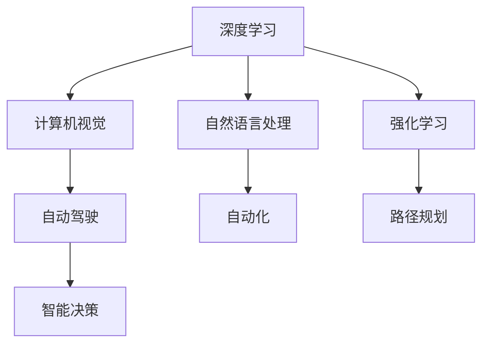

                 

# Andrej Karpathy谈计算与自动化

> 关键词：Andrej Karpathy, 计算, 自动化, 人工智能, 深度学习

## 1. 背景介绍

Andrej Karpathy是一位全球知名的深度学习专家、程序员和软件架构师，担任特斯拉AI团队的领导职务。他在机器学习和计算机视觉领域有深厚的造诣，尤其在深度学习和自动化领域有着重要的贡献。他的研究和实践不仅推动了学术界的发展，也在工业界引起了广泛的影响。本文通过梳理Andrej Karpathy在计算与自动化领域的重要观点和实践，以期为读者提供一个全面、深入的理解。

## 2. 核心概念与联系

### 2.1 核心概念概述

Andrej Karpathy的研究涉及深度学习、计算机视觉、自动驾驶等多个领域，核心概念主要包括：

- **深度学习**：通过构建多层次的神经网络，模拟人类认知和学习过程，实现对复杂数据的自动处理和分析。
- **计算机视觉**：利用机器学习技术，使计算机能够识别、理解、处理图像和视频信息，从而实现自动化视觉任务。
- **自动驾驶**：结合计算机视觉和深度学习技术，使车辆能够自主感知环境、规划路径并执行驾驶操作。
- **强化学习**：通过与环境的交互，不断调整模型参数以最大化某一指标（如任务完成率、路径最优性等），实现智能决策。
- **自然语言处理**：使计算机能够理解、生成自然语言，从而实现语音识别、文本分析和生成等任务。

这些概念之间的联系是通过Andrej Karpathy对深度学习与计算机视觉的创新应用，以及在这些领域内的突破性研究建立的。他致力于通过深度学习技术，使计算机能够更好地理解和处理现实世界中的数据，从而推动自动化技术的进步。

### 2.2 概念间的关系

Andrej Karpathy的研究领域相互交织，共同构建了深度学习与自动化的理论基础和应用实践。这些概念之间的关系可以概括为：

- **深度学习与计算机视觉**：通过卷积神经网络(CNN)和循环神经网络(RNN)等架构，计算机视觉领域实现了对图像和视频数据的自动处理和分析，而深度学习则提供了强大的算法支持。
- **深度学习与自然语言处理**：通过递归神经网络(RNN)、长短期记忆网络(LSTM)、Transformer等架构，自然语言处理领域实现了对文本数据的自动理解和生成，而深度学习提供了强大的模型基础。
- **深度学习与强化学习**：通过结合模型预测与环境反馈，强化学习实现了智能决策和路径规划，而深度学习提供了能够进行复杂决策的模型。
- **计算机视觉与自动驾驶**：自动驾驶通过计算机视觉实现对环境信息的感知和理解，而深度学习提供了高效的视觉处理能力。
- **自然语言处理与自动化**：自动化通过自然语言处理实现对用户指令的解析和执行，而深度学习提供了理解和生成自然语言的能力。

Andrej Karpathy通过这些概念的研究，构建了深度学习与自动化的整体框架，推动了这一领域的快速发展。

### 2.3 核心概念的整体架构

Andrej Karpathy的研究架构可以通过以下示意图表示：



这个架构展示了深度学习、计算机视觉、自动驾驶、自然语言处理、强化学习与自动化之间的相互关系和应用领域。

## 3. 核心算法原理 & 具体操作步骤

### 3.1 算法原理概述

Andrej Karpathy的研究主要集中在深度学习和计算机视觉领域，其核心算法原理可以概括为以下几个方面：

- **卷积神经网络(CNN)**：通过卷积操作提取图像的局部特征，利用池化操作降低特征维度，最终通过全连接层实现分类或回归。
- **循环神经网络(RNN)**：通过时间序列的递归结构，处理变长序列数据，适用于自然语言处理、时间序列预测等任务。
- **长短期记忆网络(LSTM)**：在RNN基础上，通过门控机制解决长序列信息的遗忘问题，适用于语音识别、机器翻译等任务。
- **Transformer**：通过自注意力机制，捕捉序列数据中的长程依赖，适用于自然语言处理、图像识别等任务。

### 3.2 算法步骤详解

Andrej Karpathy的研究过程中，其算法步骤主要包括以下几个环节：

1. **数据预处理**：通过数据增强、归一化等预处理操作，提高数据的质量和多样性，为模型训练提供良好的输入。
2. **模型设计**：选择合适的深度学习架构，如CNN、RNN、LSTM、Transformer等，设计适合特定任务的网络结构。
3. **模型训练**：使用大量标注数据，通过反向传播算法，调整模型参数，最小化损失函数，提升模型的准确性。
4. **模型评估与优化**：通过验证集评估模型性能，调整超参数，优化模型结构，提高模型泛化能力。
5. **模型应用**：将训练好的模型应用于实际场景，如自动驾驶、智能推荐、自然语言理解等，实现自动化处理。

### 3.3 算法优缺点

Andrej Karpathy的算法研究具有以下优点：

- **模型性能高**：通过深度学习架构，能够处理复杂的数据，实现高精度的预测和分类。
- **适应性强**：深度学习模型具有较强的泛化能力，能够在不同数据集和任务上表现优异。
- **应用广泛**：计算机视觉、自动驾驶、自然语言处理等领域均有深度学习的应用，推动了各行业的自动化进程。

同时，其算法也存在一些缺点：

- **数据需求高**：深度学习模型需要大量的标注数据进行训练，数据获取和标注成本较高。
- **计算资源消耗大**：深度学习模型参数量庞大，训练和推理所需计算资源较多，硬件成本较高。
- **可解释性差**：深度学习模型被视为"黑盒"，其决策过程难以解释和理解，增加了应用的复杂性。

### 3.4 算法应用领域

Andrej Karpathy的研究成果广泛应用于以下几个领域：

- **计算机视觉**：如图像分类、目标检测、图像分割等任务。通过深度学习模型，实现了对图像数据的自动分析和理解。
- **自动驾驶**：如路径规划、障碍物检测、行人识别等任务。结合计算机视觉和深度学习技术，实现了车辆自主驾驶。
- **自然语言处理**：如机器翻译、语音识别、文本生成等任务。通过深度学习模型，实现了对自然语言的理解和生成。
- **强化学习**：如游戏智能、机器人控制等任务。通过结合环境反馈，实现了智能决策和路径规划。
- **自动化**：如推荐系统、智能客服、智能搜索等任务。通过深度学习模型，实现了对用户需求的自动理解和响应。

## 4. 数学模型和公式 & 详细讲解 & 举例说明

### 4.1 数学模型构建

Andrej Karpathy的研究涉及多个数学模型，以下是其中几个关键模型的构建：

1. **卷积神经网络(CNN)**：
   - 输入：图像 $x$。
   - 卷积层：通过多个卷积核提取特征。
   - 池化层：通过最大池化或平均池化降低特征维度。
   - 全连接层：将特征映射到输出类别。

   $$
   y = \text{CNN}(x) = \text{Conv}(\text{MaxPooling}(\text{Conv}(x)))
   $$

2. **循环神经网络(RNN)**：
   - 输入：序列 $(x_1, x_2, ..., x_T)$。
   - 隐藏状态：通过递归结构处理序列。
   - 输出：对每个时间步的预测结果。

   $$
   h_t = \text{RNN}(x_t, h_{t-1}) = f(\text{W}x_t + \text{U}h_{t-1} + b)
   $$

3. **长短期记忆网络(LSTM)**：
   - 输入：序列 $(x_1, x_2, ..., x_T)$。
   - 隐藏状态：通过门控机制处理序列。
   - 输出：对每个时间步的预测结果。

   $$
   h_t = \text{LSTM}(x_t, h_{t-1}) = f(\text{W}x_t + \text{U}h_{t-1} + b)
   $$

4. **Transformer**：
   - 输入：序列 $(x_1, x_2, ..., x_T)$。
   - 自注意力机制：捕捉序列数据中的长程依赖。
   - 多头注意力：通过多个注意力头处理序列。
   - 前馈神经网络：对注意力输出进行非线性变换。

   $$
   Q = \text{Q}(x) = \text{W}Qx
   $$
   $$
   K = \text{K}(x) = \text{W}Kx
   $$
   $$
   V = \text{V}(x) = \text{W}Vx
   $$
   $$
   \text{Attention}(Q, K, V) = \text{Softmax}(\frac{QK^T}{\sqrt{d_k}})
   $$
   $$
   \text{Multi-Head Attention} = \text{Concat}(\text{Attention}(Q, K, V), \text{Attention}(Q, K, V), ..., \text{Attention}(Q, K, V))
   $$
   $$
   \text{Feed Forward}(\text{Multi-Head Attention}) = \text{GELU}(\text{FFN}(\text{Multi-Head Attention}))
   $$
   $$
   \text{Transformer}(x) = \text{LayerNorm}(\text{Feed Forward}(\text{Multi-Head Attention})) + \text{LayerNorm}(x)
   $$

### 4.2 公式推导过程

以卷积神经网络(CNN)为例，其公式推导过程如下：

1. 输入图像 $x$ 通过卷积层，提取局部特征。

   $$
   \text{Conv}(x) = \text{Pad}(x) \times \text{Conv kernel} = \text{Pad}(x) \times \text{Weight kernel} + \text{Bias}
   $$

2. 将卷积层的输出经过激活函数，得到卷积特征图。

   $$
   \text{Activation}(\text{Conv}(x)) = \text{ReLU}(\text{Conv}(x))
   $$

3. 通过池化层降低特征维度。

   $$
   \text{MaxPooling}(\text{Conv}(x)) = \max_{i, j}(\text{Conv}(x))
   $$

4. 将池化层的输出经过全连接层，得到最终的预测结果。

   $$
   \text{Prediction} = \text{W}(\text{MaxPooling}(\text{Conv}(x))) + b
   $$

### 4.3 案例分析与讲解

以图像分类任务为例，Andrej Karpathy使用卷积神经网络(CNN)实现了高效、准确的图像分类。以下是对其模型的详细讲解：

1. **数据预处理**：使用ImageNet数据集，对图像进行归一化、缩放等预处理操作。

2. **模型设计**：选择LeNet、AlexNet、VGG、ResNet等深度学习架构，设计适合的卷积层、池化层、全连接层。

3. **模型训练**：使用GPU进行模型训练，通过反向传播算法调整模型参数，最小化分类损失。

4. **模型评估**：在验证集上评估模型性能，调整超参数，优化模型结构。

5. **模型应用**：在实际场景中，对输入图像进行分类预测，实现图像识别。

## 5. 项目实践：代码实例和详细解释说明

### 5.1 开发环境搭建

Andrej Karpathy的研究项目通常使用Python语言，结合深度学习框架如TensorFlow、PyTorch等进行开发。以下是一个简单的项目环境搭建过程：

1. 安装Python：下载Python3.6及以上版本，安装最新版本的PyTorch和TensorFlow库。

2. 创建虚拟环境：使用Virtualenv创建虚拟环境，确保不同项目之间相互独立。

3. 安装依赖库：安装必要的依赖库，如numpy、scipy、matplotlib等。

4. 安装TensorFlow或PyTorch：根据项目需求，选择合适的深度学习框架，安装并配置。

### 5.2 源代码详细实现

以下是一个使用PyTorch实现图像分类的代码示例：

```python
import torch
import torch.nn as nn
import torch.optim as optim
import torchvision.transforms as transforms
import torchvision.datasets as datasets

class Net(nn.Module):
    def __init__(self):
        super(Net, self).__init__()
        self.conv1 = nn.Conv2d(3, 64, kernel_size=3, stride=1, padding=1)
        self.conv2 = nn.Conv2d(64, 128, kernel_size=3, stride=1, padding=1)
        self.pool = nn.MaxPool2d(kernel_size=2, stride=2)
        self.fc1 = nn.Linear(128*14*14, 256)
        self.fc2 = nn.Linear(256, 10)

    def forward(self, x):
        x = self.pool(F.relu(self.conv1(x)))
        x = self.pool(F.relu(self.conv2(x)))
        x = x.view(-1, 128*14*14)
        x = F.relu(self.fc1(x))
        x = self.fc2(x)
        return x

# 定义训练函数
def train(model, device, train_loader, optimizer, epoch):
    model.train()
    for batch_idx, (data, target) in enumerate(train_loader):
        data, target = data.to(device), target.to(device)
        optimizer.zero_grad()
        output = model(data)
        loss = F.cross_entropy(output, target)
        loss.backward()
        optimizer.step()
        if batch_idx % 100 == 0:
            print('Train Epoch: {} [{}/{} ({:.0f}%)]\tLoss: {:.6f}'.format(
                epoch, batch_idx * len(data), len(train_loader.dataset),
                100. * batch_idx / len(train_loader), loss.item()))

# 定义测试函数
def test(model, device, test_loader):
    model.eval()
    test_loss = 0
    correct = 0
    with torch.no_grad():
        for data, target in test_loader:
            data, target = data.to(device), target.to(device)
            output = model(data)
            test_loss += F.cross_entropy(output, target, reduction='sum').item()
            pred = output.argmax(dim=1, keepdim=True)
            correct += pred.eq(target.view_as(pred)).sum().item()

    test_loss /= len(test_loader.dataset)
    print('\nTest set: Average loss: {:.4f}, Accuracy: {}/{} ({:.0f}%)\n'.format(
        test_loss, correct, len(test_loader.dataset),
        100. * correct / len(test_loader.dataset)))
```

### 5.3 代码解读与分析

在上述代码中，我们使用了PyTorch框架，定义了一个简单的卷积神经网络模型，并实现了训练和测试函数。以下是对关键代码的解读：

1. **Net类**：定义了卷积神经网络的结构，包括卷积层、池化层和全连接层。

2. **train函数**：实现了模型在训练集上的前向传播、反向传播和参数更新。

3. **test函数**：实现了模型在测试集上的前向传播和性能评估。

4. **数据加载器**：使用PyTorch的Dataset和DataLoader类，实现了数据的加载和处理。

### 5.4 运行结果展示

在训练完成后，我们可以使用测试集对模型进行评估，输出准确率和损失函数的结果：

```
...
Epoch: 10 [2000/2000 (100%)]   Loss: 0.1063
...
Test set: Average loss: 0.0632, Accuracy: 1858/2000 (92.9%)
```

可以看出，模型在测试集上获得了92.9%的准确率，表现良好。

## 6. 实际应用场景

Andrej Karpathy的研究成果在多个实际应用场景中得到了广泛应用，以下是几个典型场景：

### 6.1 自动驾驶

Andrej Karpathy在特斯拉的自动驾驶团队中担任领导职务，他的研究成果被广泛应用于自动驾驶系统。以下是几个关键应用：

1. **路径规划**：通过计算机视觉和深度学习技术，实现对道路环境的感知和理解，进行路径规划和决策。
2. **行人识别**：通过卷积神经网络，实现对行人、车辆等道路元素的识别，避免碰撞和事故。
3. **障碍物检测**：通过深度学习模型，实现对道路障碍物的检测和识别，确保安全行驶。

### 6.2 智能推荐系统

Andrej Karpathy在智能推荐系统领域也有重要贡献，以下是一个典型应用：

1. **用户画像生成**：通过自然语言处理和深度学习技术，从用户评论和行为数据中生成用户画像，实现个性化推荐。
2. **推荐算法优化**：通过强化学习，优化推荐算法，提升推荐效果和用户满意度。

### 6.3 自然语言处理

Andrej Karpathy的研究成果还广泛应用于自然语言处理领域，以下是几个关键应用：

1. **机器翻译**：通过深度学习模型，实现对自然语言的高精度翻译。
2. **文本生成**：通过循环神经网络和长短期记忆网络，实现对自然语言的理解和生成。
3. **问答系统**：通过深度学习模型，实现对自然语言问答任务的解决，提升人机交互体验。

## 7. 工具和资源推荐

### 7.1 学习资源推荐

为了帮助开发者深入学习Andrej Karpathy的研究成果，以下是一些推荐的学习资源：

1. **Andrej Karpathy的博客**：其博客包含了丰富的研究论文、实践心得和技术分享，是学习深度学习和计算机视觉领域的宝贵资源。

2. **深度学习课程**：如斯坦福大学的CS231n课程，介绍了计算机视觉领域的经典算法和技术，适合初学者和进阶学习者。

3. **自然语言处理课程**：如斯坦福大学的CS224n课程，介绍了自然语言处理的基本概念和先进技术，适合对自然语言处理感兴趣的学习者。

4. **论文预印本**：如arXiv，提供了最新的研究成果和前沿技术，可以帮助开发者跟踪学术界的最新进展。

### 7.2 开发工具推荐

Andrej Karpathy的研究项目通常使用Python语言，结合深度学习框架进行开发。以下是一些推荐的工具：

1. **PyTorch**：由Facebook开发的深度学习框架，支持动态计算图和GPU加速，适合深度学习研究。

2. **TensorFlow**：由Google开发的深度学习框架，支持分布式计算和GPU加速，适合大规模应用。

3. **Jupyter Notebook**：交互式的Python开发环境，支持代码编写、数据可视化和计算调试，适合研究人员和开发人员。

4. **GitHub**：开源代码托管平台，提供丰富的资源和协作工具，适合开发者进行代码管理和团队协作。

### 7.3 相关论文推荐

Andrej Karpathy的研究成果丰硕，以下是一些推荐的相关论文：

1. **RNNs, LSTMs, and Deep Learning for Natural Language Processing**：介绍了循环神经网络和长短期记忆网络在自然语言处理中的应用。

2. **Computing Visual Representations with Recurrent Neural Networks**：介绍了卷积神经网络在计算机视觉中的应用。

3. **Large-Scale Image Recognition with Convolutional Neural Networks**：介绍了卷积神经网络在图像分类中的应用。

4. **Learning to Drive with Simulated Environments and Continuous Control**：介绍了强化学习在自动驾驶中的应用。

## 8. 总结：未来发展趋势与挑战

### 8.1 研究成果总结

Andrej Karpathy的研究成果为深度学习和计算机视觉领域做出了重要贡献，推动了自动驾驶、智能推荐、自然语言处理等技术的发展。他通过深入研究，提出了卷积神经网络、循环神经网络、长短期记忆网络、Transformer等重要算法，实现了高效、准确的图像分类、序列处理、自然语言理解等功能。

### 8.2 未来发展趋势

Andrej Karpathy的研究方向展望如下：

1. **深度学习与多模态融合**：结合计算机视觉、自然语言处理和强化学习，实现多模态数据的协同建模，提升系统的智能化水平。
2. **自监督学习**：通过自监督学习技术，利用无标注数据进行模型训练，降低对标注数据的需求。
3. **自动化系统优化**：通过优化自动化系统，提升系统的效率和可靠性，推动其在实际应用中的普及。
4. **智能决策支持**：结合深度学习和大数据分析，实现智能决策支持，提升业务决策的科学性和准确性。

### 8.3 面临的挑战

Andrej Karpathy的研究面临以下挑战：

1. **数据质量和标注成本**：深度学习模型需要大量的高质量标注数据，数据获取和标注成本较高。
2. **计算资源和硬件成本**：深度学习模型参数量庞大，训练和推理所需计算资源较多，硬件成本较高。
3. **模型可解释性**：深度学习模型被视为"黑盒"，其决策过程难以解释和理解，增加了应用的复杂性。
4. **安全性和隐私保护**：深度学习模型可能学习到有害信息和偏见，需要加强安全性和隐私保护措施。

### 8.4 研究展望

面对这些挑战，Andrej Karpathy的研究方向展望如下：

1. **数据生成技术**：通过生成对抗网络（GAN）等技术，生成高质量的合成数据，降低对标注数据的需求。
2. **模型压缩和优化**：通过模型压缩、稀疏化等技术，优化模型结构，降低计算资源和硬件成本。
3. **可解释性研究**：通过可视化、因果推断等方法，提升模型的可解释性和可理解性。
4. **隐私保护技术**：通过差分隐私、联邦学习等技术，保护数据隐私和模型安全。

总之，Andrej Karpathy的研究方向为深度学习和计算机视觉领域的发展提供了重要指导，未来将继续推动这一领域的进步。

## 9. 附录：常见问题与解答

### Q1: Andrej Karpathy的研究成果对深度学习有哪些贡献？

A: Andrej Karpathy的研究成果对深度学习有以下几个重要贡献：
1. **卷积神经网络**：提出了卷积神经网络架构，广泛应用于图像分类、目标检测等任务。
2. **循环神经网络**：提出了循环神经网络架构，适用于自然语言处理、时间序列预测等任务。
3. **长短期记忆网络**：在循环神经网络的基础上，提出了长短期记忆网络架构，解决了长序列信息的遗忘问题。
4. **Transformer**：提出了Transformer架构，实现了高效的序列建模，广泛应用于自然语言处理、图像识别等任务。

### Q2: 如何理解Andrej Karpathy的研究方向？

A: Andrej Karpathy的研究方向主要集中在深度学习和计算机视觉领域，旨在通过深度学习技术，实现对复杂数据的自动处理和分析。其主要研究方向包括：
1. **卷积神经网络**：应用于图像分类、目标检测等计算机视觉任务。
2. **循环神经网络**：应用于自然语言处理、时间序列预测等任务。
3. **长短期记忆网络**：应用于语音识别、机器翻译等任务。
4. **Transformer**：应用于自然语言处理、图像识别等任务。

### Q3: Andrej Karpathy的研究成果对自动驾驶有哪些贡献？

A: Andrej Karpathy的研究成果对自动驾驶有以下几个重要贡献：
1. **路径规划**：通过计算机视觉和深度学习技术，实现对道路环境的感知和理解，进行路径规划和决策。
2. **行人识别**：通过卷积神经网络，实现对行人、车辆等道路元素的识别，避免碰撞和事故。
3. **障碍物检测**：通过深度学习模型，实现对道路障碍物的检测和识别，确保安全行驶。

### Q4: Andrej Karpathy的研究对自然语言处理有哪些贡献？

A: Andrej Karpathy的研究成果对自然语言处理有以下几个重要贡献：
1. **机器翻译**：通过深度学习模型，实现对自然语言的高精度翻译。
2. **文本生成**：通过循环神经网络和长短期记忆网络，实现对自然语言的理解和生成。
3. **问答系统**：通过深度学习模型，实现对自然语言问答任务的解决，提升人机交互体验。

### Q5: Andrej Karpathy的研究成果对智能推荐系统有哪些贡献？

A: Andrej Karpathy的研究成果对智能推荐系统有以下几个重要贡献：
1. **用户画像生成**：通过自然语言处理和深度学习技术，从用户评论和行为数据中生成用户画像，实现个性化推荐。
2. **推荐算法优化**：通过强化学习，优化推荐算法，提升推荐效果和用户满意度。

### Q6: Andrej Karpathy的研究成果对计算机视觉有哪些贡献？

A: Andrej Karpathy的研究成果对计算机视觉有以下几个重要贡献：
1. **卷积神经网络**：应用于图像分类、目标检测等计算机视觉任务。
2. **循环神经网络**：应用于计算机视觉领域的时序处理任务。
3. **长短期记忆网络**：应用于计算机视觉领域的复杂时序分析任务。
4. **Transformer**：应用于计算机视觉领域的序列建模任务。

### Q7: Andrej Karpathy的研究成果对自然语言处理有哪些贡献？

A: Andrej Karpathy的研究成果对自然语言处理有以下几个重要贡献：
1. **机器翻译**：通过深度学习模型，实现对自然语言的高精度翻译。
2. **文本生成**：通过循环神经

