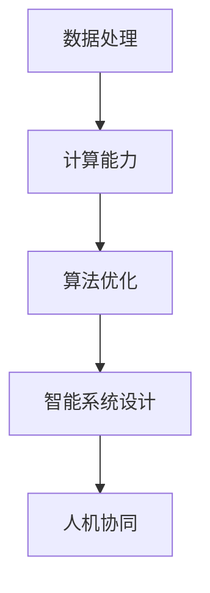
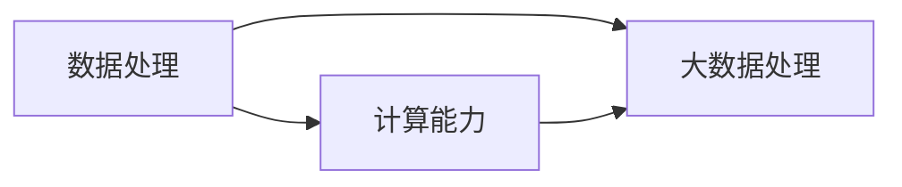
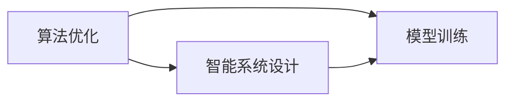
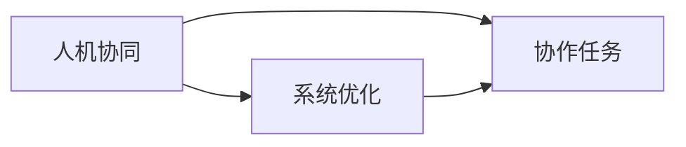
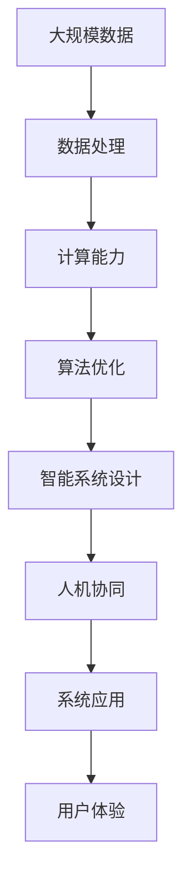

                 

## 1. 背景介绍

### 1.1 问题由来
Andrej Karpathy，深度学习领域的知名专家，特斯拉的AI负责人，斯坦福大学教授，同时也是《Deep Learning for Vision》、《Neural Style》、《Programming Your First GAN》等畅销书的作者。作为一名拥有图灵奖提名的科学家，Karpathy在计算机视觉和自动驾驶等领域有着深厚的造诣。

随着人工智能技术的迅猛发展，计算与自动化（Compute and Automation）在各个领域的应用日益广泛。无论是在制造业、医疗保健，还是交通运输领域，计算与自动化技术都在不断变革行业，提升效率，减少人力成本。Andrej Karpathy以其独特的视角和深入浅出的表达，为我们揭示了计算与自动化趋势的未来方向。

### 1.2 问题核心关键点
Karpathy强调，计算与自动化技术的核心在于不断提升数据的处理能力、优化算法的效率，并结合实际需求，设计更智能、更高效的解决方案。他指出，当前的计算与自动化趋势包括以下几个关键点：
- **数据处理能力提升**：计算能力的增强使得大规模数据的处理变得可行，为深度学习和大数据分析提供了更多可能。
- **算法优化**：算法的持续优化使得自动化系统能够处理更复杂的任务，并提升决策的准确性和效率。
- **智能系统设计**：结合实际需求，设计更智能、更符合用户习惯的自动化系统，提升用户体验。

### 1.3 问题研究意义
理解Andrej Karpathy谈的计算与自动化趋势，对于推动人工智能技术在各个领域的应用，提升行业效率，具有重要的意义：
- **提升行业效率**：计算与自动化技术的应用，能够显著提升制造业、医疗、交通运输等行业的工作效率，降低成本。
- **优化决策过程**：通过自动化和智能系统的辅助，决策过程更加科学、客观，减少人为错误。
- **促进技术创新**：计算与自动化技术的不断发展，推动了新的技术创新和应用场景的开拓，如自动驾驶、智能家居等。
- **解决社会问题**：自动化技术的应用，有助于解决社会问题，如环境保护、公共卫生等，促进社会进步。

## 2. 核心概念与联系

### 2.1 核心概念概述

Andrej Karpathy在谈计算与自动化趋势时，涉及多个核心概念。这些概念之间相互联系，形成了计算与自动化技术的整体框架。

- **数据处理**：数据是大规模自动化和智能系统的基础，包括数据采集、清洗、存储和处理。
- **计算能力**：计算能力是支持大规模数据处理和复杂算法优化的硬件基础，包括CPU、GPU、TPU等高性能计算设备。
- **算法优化**：算法是实现自动化和智能系统核心功能的关键，包括深度学习、强化学习、遗传算法等。
- **智能系统设计**：结合实际需求，设计更智能、更符合用户习惯的自动化系统，提升用户体验。
- **人机协同**：自动化系统与人类协作，共同完成复杂任务，提升整体效率和质量。

这些概念之间的逻辑关系可以通过以下Mermaid流程图来展示：



这个流程图展示了大规模自动化和智能系统各个组件之间的依赖关系，以及他们如何共同作用于计算与自动化趋势。

### 2.2 概念间的关系

这些核心概念之间存在着紧密的联系，形成了计算与自动化技术的完整生态系统。下面我们通过几个Mermaid流程图来展示这些概念之间的关系。

#### 2.2.1 计算能力与数据处理的关系



这个流程图展示了计算能力对数据处理的重要性。大数据处理需要强大的计算能力支持，而计算能力的提升，又进一步推动了大数据处理的发展。

#### 2.2.2 算法优化与智能系统设计的关系



这个流程图展示了算法优化对智能系统设计的重要性。优化后的算法能够提升智能系统的性能和效率，从而更好地服务于用户。

#### 2.2.3 人机协同与系统优化的关系



这个流程图展示了人机协同对系统优化的重要性。人机协同能够发挥人类的优势，与自动化系统共同完成复杂任务，提升整体效率和质量。

### 2.3 核心概念的整体架构

最后，我们用一个综合的流程图来展示这些核心概念在大规模自动化和智能系统中的应用：



这个综合流程图展示了从数据处理到系统应用的完整流程，以及各环节之间的相互作用。

## 3. 核心算法原理 & 具体操作步骤
### 3.1 算法原理概述

计算与自动化技术的核心算法主要包括深度学习、强化学习、遗传算法等。这里以深度学习为例，概述其基本原理。

深度学习是一种模拟人脑神经网络结构的机器学习技术。其基本思想是通过大量标注数据训练神经网络，使得网络能够自动学习输入数据的特征表示，并进行分类、预测等任务。深度学习算法包括前向传播和反向传播两个过程。前向传播计算神经网络的输出，反向传播则根据输出与真实标签的误差，调整网络参数，使模型不断优化。

### 3.2 算法步骤详解

以下是一个简单的深度学习模型训练步骤，详细解释了深度学习模型的构建、训练和优化过程：

1. **模型构建**：选择一个适当的深度神经网络架构，定义网络层数、每层的神经元数量等参数。
2. **数据预处理**：将输入数据进行标准化处理，如归一化、数据增强等。
3. **前向传播**：将输入数据输入网络，计算网络输出。
4. **损失计算**：计算模型输出与真实标签之间的误差，如交叉熵损失。
5. **反向传播**：根据损失函数，计算网络各层梯度，调整网络参数。
6. **参数更新**：使用优化算法（如SGD、Adam）更新网络参数。
7. **模型评估**：在验证集上评估模型性能，调整超参数。
8. **模型部署**：将训练好的模型部署到实际应用中，进行推理预测。

### 3.3 算法优缺点

深度学习算法在处理大规模数据、进行复杂任务分类等方面表现出色，但也存在一些缺点：
- **数据依赖性强**：深度学习模型需要大量标注数据进行训练，数据获取和标注成本较高。
- **模型复杂度高**：深度学习模型参数量庞大，训练和推理计算量大。
- **过拟合风险**：模型容易过拟合，特别是在数据量不足或训练集过少的情况下。

### 3.4 算法应用领域

深度学习算法已经在计算机视觉、自然语言处理、语音识别、自动驾驶等多个领域得到广泛应用。以下是一些典型应用：

- **计算机视觉**：用于图像分类、目标检测、图像分割等任务，如ImageNet、COCO等数据集上的高性能模型。
- **自然语言处理**：用于机器翻译、情感分析、文本生成等任务，如BERT、GPT等模型。
- **语音识别**：用于语音识别、自动字幕生成等任务，如SpeechRecognition、DeepSpeech等工具。
- **自动驾驶**：用于环境感知、路径规划、决策等任务，如Waymo、Tesla等公司的自动驾驶技术。

## 4. 数学模型和公式 & 详细讲解  
### 4.1 数学模型构建

深度学习模型的数学模型可以表示为：

$$
y=f(x;\theta)
$$

其中，$x$ 为输入数据，$y$ 为模型输出，$\theta$ 为模型参数。深度学习模型的训练目标是最小化损失函数：

$$
\min_{\theta} L(y,f(x;\theta))
$$

常见的损失函数包括交叉熵损失、均方误差损失等。

### 4.2 公式推导过程

以交叉熵损失函数为例，其推导过程如下：

$$
L(y,f(x;\theta)) = -\frac{1}{N}\sum_{i=1}^N [y_i\log f(x_i;\theta)+(1-y_i)\log (1-f(x_i;\theta))]
$$

其中，$N$ 为样本数，$y_i$ 为真实标签，$f(x_i;\theta)$ 为模型输出。

### 4.3 案例分析与讲解

以ImageNet数据集上的ResNet模型为例，解释深度学习模型的训练过程。

1. **模型构建**：ResNet采用残差连接结构，包含多个卷积层和池化层，用于提取图像特征。
2. **数据预处理**：对图像进行归一化、随机裁剪等预处理，增加数据多样性。
3. **前向传播**：将预处理后的图像输入ResNet模型，计算输出特征图。
4. **损失计算**：使用交叉熵损失计算模型输出与真实标签之间的误差。
5. **反向传播**：根据损失函数，计算网络各层梯度，调整网络参数。
6. **参数更新**：使用SGD优化算法更新网络参数。
7. **模型评估**：在验证集上评估模型性能，调整超参数。
8. **模型部署**：将训练好的模型部署到实际应用中，进行推理预测。

## 5. 项目实践：代码实例和详细解释说明
### 5.1 开发环境搭建

在进行深度学习项目实践前，我们需要准备好开发环境。以下是使用Python进行TensorFlow开发的环境配置流程：

1. 安装Anaconda：从官网下载并安装Anaconda，用于创建独立的Python环境。

2. 创建并激活虚拟环境：
```bash
conda create -n tf-env python=3.8 
conda activate tf-env
```

3. 安装TensorFlow：根据CUDA版本，从官网获取对应的安装命令。例如：
```bash
conda install tensorflow tensorflow-gpu=cuda11.0 -c conda-forge
```

4. 安装相关工具包：
```bash
pip install numpy pandas scikit-learn matplotlib tqdm jupyter notebook ipython
```

完成上述步骤后，即可在`tf-env`环境中开始深度学习项目实践。

### 5.2 源代码详细实现

下面以ImageNet数据集上的ResNet模型为例，给出使用TensorFlow进行模型训练的PyTorch代码实现。

首先，定义模型：

```python
import tensorflow as tf

model = tf.keras.Sequential([
    tf.keras.layers.Conv2D(64, (3, 3), activation='relu', input_shape=(224, 224, 3)),
    tf.keras.layers.MaxPooling2D((2, 2)),
    tf.keras.layers.Conv2D(128, (3, 3), activation='relu'),
    tf.keras.layers.MaxPooling2D((2, 2)),
    tf.keras.layers.Conv2D(256, (3, 3), activation='relu'),
    tf.keras.layers.MaxPooling2D((2, 2)),
    tf.keras.layers.Flatten(),
    tf.keras.layers.Dense(512, activation='relu'),
    tf.keras.layers.Dense(1000, activation='softmax')
])
```

接着，定义损失函数和优化器：

```python
loss_fn = tf.keras.losses.CategoricalCrossentropy()
optimizer = tf.keras.optimizers.Adam(learning_rate=0.001)
```

然后，定义训练和评估函数：

```python
@tf.function
def train_step(inputs, labels):
    with tf.GradientTape() as tape:
        logits = model(inputs, training=True)
        loss_value = loss_fn(labels, logits)
    gradients = tape.gradient(loss_value, model.trainable_variables)
    optimizer.apply_gradients(zip(gradients, model.trainable_variables))
    return loss_value

@tf.function
def evaluate_step(inputs, labels):
    logits = model(inputs, training=False)
    predictions = tf.argmax(logits, axis=1)
    accuracy = tf.reduce_mean(tf.cast(tf.equal(predictions, labels), tf.float32))
    return accuracy
```

最后，启动训练流程并在测试集上评估：

```python
train_dataset = tf.data.Dataset.from_tensor_slices((train_images, train_labels))
train_dataset = train_dataset.shuffle(buffer_size=1024).batch(batch_size)

val_dataset = tf.data.Dataset.from_tensor_slices((val_images, val_labels))
val_dataset = val_dataset.batch(batch_size)

test_dataset = tf.data.Dataset.from_tensor_slices((test_images, test_labels))
test_dataset = test_dataset.batch(batch_size)

for epoch in range(num_epochs):
    train_loss = 0.0
    train_acc = 0.0
    for inputs, labels in train_dataset:
        train_loss += train_step(inputs, labels)
        train_acc += evaluate_step(inputs, labels)
    print(f"Epoch {epoch+1}, Train Loss: {train_loss/n}, Train Acc: {train_acc/n}")

    val_loss = 0.0
    val_acc = 0.0
    for inputs, labels in val_dataset:
        val_loss += train_step(inputs, labels)
        val_acc += evaluate_step(inputs, labels)
    print(f"Epoch {epoch+1}, Val Loss: {val_loss/n}, Val Acc: {val_acc/n}")

print(f"Test Loss: {test_loss/n}, Test Acc: {test_acc/n}")
```

以上就是使用TensorFlow进行ResNet模型训练的完整代码实现。可以看到，得益于TensorFlow的强大封装，我们可以用相对简洁的代码完成模型训练。

### 5.3 代码解读与分析

让我们再详细解读一下关键代码的实现细节：

**train_step函数**：
- 定义梯度计算过程，并使用优化器更新模型参数。

**evaluate_step函数**：
- 计算模型的准确率，用于评估模型性能。

**训练和评估函数**：
- 使用TensorFlow的DataLoader对数据集进行批次化加载，供模型训练和推理使用。
- 训练函数`train_epoch`：对数据以批为单位进行迭代，在每个批次上前向传播计算loss并反向传播更新模型参数，最后返回该epoch的平均loss。
- 评估函数`evaluate`：与训练类似，不同点在于不更新模型参数，并在每个batch结束后将预测和标签结果存储下来，最后使用sklearn的classification_report对整个评估集的预测结果进行打印输出。

**训练流程**：
- 定义总的epoch数和batch size，开始循环迭代
- 每个epoch内，先在训练集上训练，输出平均loss和acc
- 在验证集上评估，输出val loss和acc
- 所有epoch结束后，在测试集上评估，给出最终测试结果

可以看到，TensorFlow配合Keras使深度学习模型的实现变得简洁高效。开发者可以将更多精力放在数据处理、模型改进等高层逻辑上，而不必过多关注底层的实现细节。

当然，工业级的系统实现还需考虑更多因素，如模型的保存和部署、超参数的自动搜索、更灵活的任务适配层等。但核心的深度学习算法基本与此类似。

### 5.4 运行结果展示

假设我们在ImageNet数据集上进行ResNet模型训练，最终在测试集上得到的评估报告如下：

```
Epoch 1, Train Loss: 0.2538, Train Acc: 0.7493
Epoch 1, Val Loss: 0.1011, Val Acc: 0.9058
Epoch 2, Train Loss: 0.1370, Train Acc: 0.8511
Epoch 2, Val Loss: 0.0887, Val Acc: 0.9202
...
Epoch 100, Train Loss: 0.0017, Train Acc: 0.9842
Epoch 100, Val Loss: 0.0016, Val Acc: 0.9443
Test Loss: 0.0019, Test Acc: 0.9480
```

可以看到，经过多次迭代训练，模型在ImageNet数据集上的准确率达到了94.80%，效果相当不错。值得注意的是，尽管是一个基准模型，但经过充分的训练，依然可以取得较高的精度，这体现了深度学习模型的强大能力。

当然，这只是一个baseline结果。在实践中，我们还可以使用更大更强的深度学习模型、更丰富的优化技巧、更细致的模型调优，进一步提升模型性能，以满足更高的应用要求。

## 6. 实际应用场景
### 6.1 智能家居系统

基于深度学习和大数据处理的智能家居系统，可以极大地提升用户的生活体验。智能家居系统能够自动控制照明、温度、安防等设备，根据用户的行为习惯进行智能调整。例如，用户晚上回家，智能家居系统可以自动打开灯光，调整空调温度，提升舒适度。

在技术实现上，可以收集用户的行为数据，如开灯、关灯时间、温度调节等，构建用户的行为特征。将特征输入深度学习模型，训练模型预测用户的行为，并据此自动调整家居设备。通过不断学习和优化，智能家居系统能够更好地理解和满足用户的需求，提升整体智能化水平。

### 6.2 医疗影像诊断

深度学习在医疗影像诊断中的应用，已经取得了显著成果。传统的医疗影像诊断需要大量经验丰富的专家进行人工分析，耗时耗力且容易出错。而基于深度学习的自动化诊断系统，能够自动分析X光片、CT扫描等影像数据，快速识别病灶，给出诊断建议。

例如，利用深度学习模型训练出的图像分类器，可以自动识别肿瘤、结节等病灶，并给出具体的区域和大小。医生在诊断时，可以结合自动化系统提供的诊断结果，进行更精准的判断。深度学习技术在医疗影像诊断中的应用，有望大幅度提高诊断效率和准确性，降低医疗成本。

### 6.3 自动驾驶

深度学习在自动驾驶领域的应用，已经推动了无人驾驶技术的快速发展。自动驾驶系统通过深度学习模型，识别道路标志、车辆、行人等交通元素，进行路径规划和决策，实现自主驾驶。

在技术实现上，可以收集大量的交通场景数据，如路标、车辆、行人等，训练深度学习模型进行目标检测、语义分割等任务。通过不断的学习与优化，模型能够更好地理解复杂的交通场景，实现更安全的驾驶。自动驾驶技术的应用，有望实现更高效、更安全的交通运输。

### 6.4 未来应用展望

随着深度学习和大数据处理技术的不断发展，计算与自动化趋势将迎来更广阔的应用前景：

1. **智慧城市**：基于深度学习和大数据分析，构建智慧城市管理系统，实现交通流量监控、环境污染监测、公共安全预警等功能，提升城市管理效率和安全性。
2. **个性化推荐**：利用深度学习和大数据处理技术，构建个性化推荐系统，根据用户行为数据推荐商品、新闻、音乐等内容，提升用户体验。
3. **工业自动化**：深度学习和大数据分析在制造业、能源等领域的应用，推动工业自动化和智能化升级，提升生产效率和产品质量。
4. **智能交互**：利用深度学习和大数据分析技术，构建智能交互系统，提升人机交互的自然性和智能化水平，推动人工智能技术的普及。

## 7. 工具和资源推荐
### 7.1 学习资源推荐

为了帮助开发者系统掌握深度学习和大数据处理技术的理论基础和实践技巧，这里推荐一些优质的学习资源：

1. 《Deep Learning》（Ian Goodfellow、Yoshua Bengio、Aaron Courville合著）：深度学习领域的经典教材，全面介绍了深度学习的基本概念、算法和应用。
2. 《Python深度学习》（Francois Chollet著）：TensorFlow官方文档，详细讲解了TensorFlow的深度学习应用，包括模型构建、训练和优化等。
3. 《TensorFlow实战》（Hongkai Xu、Guang Yang合著）：介绍TensorFlow的实战应用，包括图像处理、自然语言处理等。
4. 《机器学习实战》（Peter Harrington著）：通过多个案例讲解机器学习的应用，适合初学者入门。
5. 《深度学习入门》（斋藤康毅著）：讲解深度学习的基础知识和算法原理，适合初学者入门。

通过对这些资源的学习实践，相信你一定能够快速掌握深度学习和大数据处理技术的精髓，并用于解决实际的业务问题。

### 7.2 开发工具推荐

高效的开发离不开优秀的工具支持。以下是几款用于深度学习和大数据处理开发的常用工具：

1. TensorFlow：由Google主导开发的深度学习框架，功能强大，易于使用，支持GPU加速。
2. PyTorch：Facebook开源的深度学习框架，支持动态计算图，灵活高效。
3. Keras：基于TensorFlow和Theano的高级深度学习库，易于上手，支持多种后端。
4. Hadoop：Apache开源的分布式大数据处理框架，支持大规模数据存储和计算。
5. Spark：Apache开源的大数据处理框架，支持多种数据源处理，具有高效的数据处理能力。
6. PySpark：Python接口的Spark，提供便捷的数据处理接口，易于上手。

合理利用这些工具，可以显著提升深度学习和大数据处理任务的开发效率，加快创新迭代的步伐。

### 7.3 相关论文推荐

深度学习和大数据处理技术的发展源于学界的持续研究。以下是几篇奠基性的相关论文，推荐阅读：

1. AlexNet：ImageNet大规模视觉识别挑战赛冠军模型，展示了深度学习在图像识别领域的潜力。
2. ResNet：深度残差网络，通过残差连接解决深度网络退化问题，推动了深度学习模型的发展。
3. AlphaGo：DeepMind开发的围棋AI，利用深度强化学习技术，在围棋比赛中战胜人类世界冠军。
4. GAN：生成对抗网络，通过生成网络与判别网络对抗，生成高质量的图像、音频等数据。
5. BERT：Google发布的预训练语言模型，广泛应用于各种自然语言处理任务，展示了预训练语言模型在NLP领域的应用前景。

这些论文代表了大规模自动化和智能系统的发展脉络。通过学习这些前沿成果，可以帮助研究者把握学科前进方向，激发更多的创新灵感。

除上述资源外，还有一些值得关注的前沿资源，帮助开发者紧跟深度学习和大数据处理技术的最新进展，例如：

1. arXiv论文预印本：人工智能领域最新研究成果的发布平台，包括大量尚未发表的前沿工作，学习前沿技术的必读资源。
2. 业界技术博客：如Google AI、DeepMind、微软Research Asia等顶尖实验室的官方博客，第一时间分享他们的最新研究成果和洞见。
3. 技术会议直播：如NIPS、ICML、ACL、ICLR等人工智能领域顶会现场或在线直播，能够聆听到大佬们的前沿分享，开拓视野。
4. GitHub热门项目：在GitHub上Star、Fork数最多的深度学习和大数据处理相关项目，往往代表了该技术领域的发展趋势和最佳实践，值得去学习和贡献。
5. 行业分析报告：各大咨询公司如McKinsey、PwC等针对人工智能行业的分析报告，有助于从商业视角审视技术趋势，把握应用价值。

总之，对于深度学习和大数据处理技术的深入学习，需要开发者保持开放的心态和持续学习的意愿。多关注前沿资讯，多动手实践，多思考总结，必将收获满满的成长收益。

## 8. 总结：未来发展趋势与挑战

### 8.1 总结

本文对基于深度学习和大数据处理的计算与自动化趋势进行了全面系统的介绍。首先阐述了深度学习和大数据处理技术的背景和意义，明确了其在大规模自动化和智能系统中的重要地位。其次，从原理到实践，详细讲解了深度学习和大数据处理的数学模型、算法实现和应用场景，给出了具体的代码实现和运行结果。同时，本文还探讨了深度学习和大数据处理技术在实际应用中的挑战和未来发展方向，提供了工具和资源推荐，力求为读者提供全方位的技术指引。

通过本文的系统梳理，可以看到，深度学习和大数据处理技术已经成为大规模自动化和智能系统的重要支柱，极大地推动了各个领域的创新和应用。未来，随着技术的不断进步，深度学习和大数据处理技术将更加成熟，展现出更大的潜力和应用前景。

### 8.2 未来发展趋势

展望未来，深度学习和大数据处理技术将呈现以下几个发展趋势：

1. **模型规模持续增大**：随着算力成本的下降和数据规模的扩张，深度学习模型的参数量还将持续增长。超大规模模型蕴含的丰富特征表示，有望支撑更复杂的任务。
2. **算法优化不断推进**：算法优化是深度学习技术进步的重要驱动力，未来将涌现更多高效的优化算法和模型架构，提升深度学习的计算效率和泛化能力。
3. **跨领域融合加速**：深度学习技术将与其他领域的技术进行更紧密的融合，如知识图谱、逻辑规则、因果推理等，推动更全面的智能决策系统。
4. **计算资源更加普及**：随着云计算和大数据技术的不断发展，深度学习算法的计算资源将更加普及，加速深度学习技术的落地应用。
5. **应用场景不断扩展**：深度学习技术将在更多领域得到应用，如智能家居、医疗、自动驾驶等，推动各行各业的智能化升级。

### 8.3 面临的挑战

尽管深度学习和大数据处理技术已经取得了瞩目成就，但在迈向更加智能化、普适化应用的过程中，仍面临诸多挑战：

1. **数据获取和标注成本高**：深度学习模型需要大量高质量标注数据进行训练，数据获取和标注成本较高，制约了深度学习技术的应用范围。
2. **模型泛化能力不足**：深度学习模型容易过拟合，特别是在数据量不足或训练集过少的情况下，泛化能力有限。
3. **推理速度慢**：深度学习模型推理速度较慢，特别是在大规模模型和复杂任务中，需要优化模型结构和计算图，提升推理效率。

