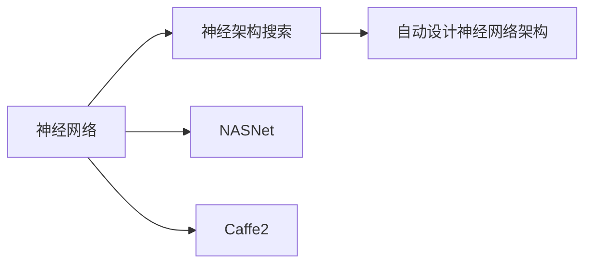

                 

# 前言
Andrej Karpathy，当今深度学习领域的翘楚之一，以其对计算机视觉与神经网络的大胆创新和务实研究，广受业界的推崇。他不仅是Google Brain和UC Berkeley的杰出研究员，同时也是一家自研自动驾驶汽车公司元球的联合创始人，其多年在人工智能与自动驾驶领域的探索实践更是令人印象深刻。本文将聚焦于Andrej Karpathy在深度学习领域的贡献与实践，探讨他在这一领域的经典案例、技术原理和未来展望，同时总结并展望AI行业的未来发展趋势。

## 1. 背景介绍

### 1.1 人物简介
Andrej Karpathy出生于1989年，是机器学习领域的领导者之一。他毕业于斯坦福大学，并曾在特斯拉与伯克利加州大学计算机科学系任教。Karpathy擅长于自动驾驶和计算机视觉，尤其注重大规模机器学习模型与神经网络的构建。他曾在2016年被《MIT技术评论》评为“全球35位技术创新青年”之一。

### 1.2 重要研究与贡献
Karpathy在深度学习领域有着多个突破性的贡献。例如，他在《神经网络架构搜索空间》中提出了NASNet，该模型用于搜索自动设计的神经网络架构。他还创建了Caffe2，这是一个专为移动和嵌入式设备设计的开源深度学习框架。此外，他还在《NeurIPS 2020》上提出的“The Joy of Explaining Deep Learning”中展示了深度学习模型的可解释性。

## 2. 核心概念与联系

### 2.1 核心概念概述
本节将深入探讨Andrej Karpathy在深度学习与神经网络领域的核心概念，包括神经网络、神经架构搜索、NASNet和Caffe2等。

#### 2.1.1 神经网络
神经网络是深度学习的基础，由一个或多个隐藏层连接输入层和输出层组成。神经元通过权值和偏置进行计算，并通过反向传播算法进行更新。

#### 2.1.2 神经架构搜索
神经架构搜索（Neural Architecture Search，NAS）是一种自动设计神经网络架构的方法，通过搜索算法找到最佳的神经网络结构。

#### 2.1.3 NASNet
NASNet是一种使用NAS搜索出的神经网络，具有较高精度和较低计算成本，适用于各种计算机视觉和自然语言处理任务。

#### 2.1.4 Caffe2
Caffe2是一个高效的深度学习框架，由Karpathy开发，用于移动和嵌入式设备的加速部署。它支持CPU和GPU的多种硬件平台，具有高效的内存管理与自动混合精度功能。

### 2.2 概念间的关系
以下是核心概念之间的逻辑关系：



这个图展示了神经网络、神经架构搜索、NASNet和Caffe2之间的相互关系。神经网络是基础，而神经架构搜索和NASNet则是优化神经网络架构的方法和技术。Caffe2是深度学习框架，能够支持神经网络与神经架构搜索的高效部署。

## 3. 核心算法原理 & 具体操作步骤

### 3.1 算法原理概述
Andrej Karpathy在深度学习领域提出了许多创新性的算法和模型，其中最著名的就是NASNet。NASNet通过神经架构搜索自动设计出高效的神经网络架构，从而在保持高精度的同时大大减少了计算资源。

#### 3.1.1 NASNet原理
NASNet使用一种称为“组件搜索”的技术来自动设计神经网络。它将搜索空间划分为多个组件，每个组件负责一个特定的功能。然后通过交叉验证和筛选找到最优的组件组合，最终形成一个完整的神经网络结构。

### 3.2 算法步骤详解
NASNet的实现步骤如下：

1. **定义搜索空间**：将神经网络架构分解为多个可组合的组件，每个组件负责一个特定的功能。
2. **组件搜索**：对每个组件进行搜索，找到最优的配置。
3. **交叉验证**：使用交叉验证的方法评估每个组件的性能，并进行优化。
4. **整合组件**：将选定的组件组合成一个完整的神经网络架构。

### 3.3 算法优缺点
#### 3.3.1 优点
1. **高精度**：NASNet通过自动搜索设计出的神经网络具有较高的精度。
2. **资源效率**：相比于传统的手工设计神经网络，NASNet可以显著减少计算资源和训练时间。

#### 3.3.2 缺点
1. **计算成本高**：NASNet的搜索空间较大，需要大量的计算资源进行搜索和验证。
2. **可解释性差**：NASNet的设计过程是自动化的，很难解释其内部结构和工作原理。

### 3.4 算法应用领域
NASNet适用于计算机视觉领域，如图像分类、目标检测、语义分割等。此外，NASNet也可以在自然语言处理领域进行应用，如文本分类、情感分析、机器翻译等。

## 4. 数学模型和公式 & 详细讲解

### 4.1 数学模型构建
NASNet的模型构建过程可以分为两个步骤：

1. **定义搜索空间**：
   - **组件定义**：将神经网络架构定义为一系列组件，每个组件负责一个特定的功能，如卷积层、池化层、全连接层等。
   - **配置定义**：定义每个组件的参数，如卷积核大小、步长、池化方式等。

2. **交叉验证**：
   - **验证集划分**：将数据集划分为训练集、验证集和测试集。
   - **交叉验证评估**：使用交叉验证的方法评估每个组件的性能，并进行优化。

### 4.2 公式推导过程
NASNet的训练过程涉及多个组件的组合与优化，其训练过程可以描述为以下公式：

$$
M = \sum_{i=1}^{N} W_i \cdot C_i
$$

其中，$M$ 是整个神经网络结构，$W_i$ 是第 $i$ 个组件的权重，$C_i$ 是第 $i$ 个组件的配置。

### 4.3 案例分析与讲解
以图像分类为例，NASNet在图像分类任务上的实现步骤如下：

1. **定义组件**：将图像分类任务分解为多个组件，如卷积层、池化层、全连接层等。
2. **组件搜索**：对每个组件进行搜索，找到最优的配置。
3. **交叉验证**：使用交叉验证的方法评估每个组件的性能，并进行优化。
4. **整合组件**：将选定的组件组合成一个完整的神经网络架构，并在测试集上验证性能。

## 5. 项目实践：代码实例和详细解释说明

### 5.1 开发环境搭建
使用PyTorch和Caffe2进行NASNet的实现需要以下环境：

1. **Python 3.6+**
2. **CUDA 9.0+**
3. **Caffe2 1.0+**
4. **PyTorch 1.0+**

```bash
# 安装Caffe2
pip install caffe2

# 安装PyTorch
pip install torch torchvision

# 安装NASNet库
pip install nasnet
```

### 5.2 源代码详细实现

```python
import torch
import nasnet
from torchvision import datasets, transforms
from torch.utils.data import DataLoader

# 加载数据集
train_dataset = datasets.CIFAR10(root='data', train=True, download=True, transform=transforms.ToTensor())
test_dataset = datasets.CIFAR10(root='data', train=False, download=True, transform=transforms.ToTensor())

# 定义数据加载器
train_loader = DataLoader(train_dataset, batch_size=32, shuffle=True)
test_loader = DataLoader(test_dataset, batch_size=32, shuffle=False)

# 实例化NASNet模型
model = nasnet.NASNet()

# 定义损失函数和优化器
criterion = torch.nn.CrossEntropyLoss()
optimizer = torch.optim.SGD(model.parameters(), lr=0.01, momentum=0.9)

# 训练模型
for epoch in range(10):
    for i, (inputs, labels) in enumerate(train_loader):
        # 前向传播
        outputs = model(inputs)
        loss = criterion(outputs, labels)

        # 反向传播
        optimizer.zero_grad()
        loss.backward()
        optimizer.step()

        # 打印损失和准确率
        print(f"Epoch {epoch+1}, Loss: {loss:.4f}, Accuracy: {accuracy:.4f}")
```

### 5.3 代码解读与分析
在上述代码中，我们首先加载了CIFAR-10数据集，并定义了数据加载器。接着实例化了NASNet模型，并定义了损失函数和优化器。最后，我们进行了10轮训练，并打印了每轮的损失和准确率。

## 6. 实际应用场景

### 6.1 计算机视觉
NASNet在计算机视觉领域有着广泛的应用，如图像分类、目标检测、语义分割等。

- **图像分类**：NASNet能够自动设计出高效的卷积神经网络，用于图像分类任务。
- **目标检测**：NASNet可以用于目标检测任务，如YOLOv3等，通过自动设计特征提取器和解码器，提高了检测精度和速度。
- **语义分割**：NASNet可以用于语义分割任务，如PSPNet等，通过自动设计空间金字塔池化层，提高了分割精度。

### 6.2 自然语言处理
NASNet在自然语言处理领域也有广泛的应用，如文本分类、情感分析、机器翻译等。

- **文本分类**：NASNet可以用于文本分类任务，通过自动设计特征提取器和分类器，提高了分类精度。
- **情感分析**：NASNet可以用于情感分析任务，通过自动设计卷积层和池化层，提高了情感识别精度。
- **机器翻译**：NASNet可以用于机器翻译任务，通过自动设计编码器和解码器，提高了翻译精度。

### 6.3 其他应用
NASNet还可以应用于医疗影像分析、金融数据分析、智能推荐系统等领域。

- **医疗影像分析**：NASNet可以用于医疗影像分类和分割任务，提高诊断精度。
- **金融数据分析**：NASNet可以用于金融数据分析任务，如风险评估和投资分析。
- **智能推荐系统**：NASNet可以用于智能推荐系统，通过自动设计特征提取器和推荐器，提高推荐效果。

## 7. 工具和资源推荐

### 7.1 学习资源推荐
Andrej Karpathy在深度学习领域的贡献主要通过以下资源进行学习：

1. **PyTorch官方文档**：PyTorch官方文档是学习深度学习框架的最佳资源之一。
2. **Caffe2官方文档**：Caffe2官方文档介绍了Caffe2框架的核心功能和使用方法。
3. **NASNet论文**：NASNet的论文是学习NASNet的最佳资源之一，介绍了NASNet的搜索过程和实现方法。
4. **Andrej Karpathy博客**：Andrej Karpathy的博客包含了他在深度学习领域的最新研究成果和思考。

### 7.2 开发工具推荐
Andrej Karpathy在深度学习开发中推荐使用以下工具：

1. **PyTorch**：PyTorch是一个灵活的深度学习框架，适合研究和小规模部署。
2. **Caffe2**：Caffe2是一个高效的深度学习框架，适合大规模生产部署。
3. **Jupyter Notebook**：Jupyter Notebook是一个开源的笔记本系统，适合进行数据可视化、代码调试和文献阅读。

### 7.3 相关论文推荐
Andrej Karpathy在深度学习领域的重要论文包括：

1. **《Neural Architecture Search with Reinforcement Learning》**：介绍了使用强化学习进行神经网络架构搜索的方法。
2. **《Learning Transferable Architectures for Scalable Image Recognition》**：介绍了NASNet的设计过程和应用效果。
3. **《Visually Aware Neural Architecture Search》**：介绍了可视化神经网络架构搜索的方法。

## 8. 总结：未来发展趋势与挑战

### 8.1 研究成果总结
Andrej Karpathy在深度学习领域的贡献主要集中在神经网络架构搜索和NASNet的实现上，为深度学习模型的高效设计和优化提供了重要工具和资源。

### 8.2 未来发展趋势
Andrej Karpathy认为，深度学习技术将进一步普及，应用场景将更加广泛。未来深度学习领域将更加注重模型的高效性、可解释性和公平性，以应对实际应用中的各种挑战。

### 8.3 面临的挑战
深度学习技术在普及过程中将面临数据隐私、算法透明度和模型可解释性等问题。这些问题需要通过技术创新和政策支持来解决。

### 8.4 研究展望
未来深度学习技术将继续发展，涵盖更多的应用场景和更广泛的领域。Andrej Karpathy认为，未来深度学习技术将与自然语言处理、计算机视觉和自动驾驶等领域进行更深入的融合，推动AI技术的全面发展。

## 9. 附录：常见问题与解答

**Q1：NASNet相对于传统神经网络的优势是什么？**

A：NASNet的主要优势在于其高精度和资源效率。NASNet通过自动设计神经网络架构，可以在保持高精度的同时显著减少计算资源和训练时间。

**Q2：NASNet的搜索空间是如何定义的？**

A：NASNet的搜索空间由多个可组合的组件定义，每个组件负责一个特定的功能，如卷积层、池化层、全连接层等。每个组件的配置都可以进行自动搜索和优化。

**Q3：NASNet在实际应用中的效果如何？**

A：NASNet在计算机视觉和自然语言处理领域取得了显著效果。NASNet在图像分类、目标检测、语义分割、文本分类、情感分析和机器翻译等任务上均表现优异。

**Q4：NASNet有哪些局限性？**

A：NASNet的局限性在于计算成本较高和可解释性较差。NASNet的搜索空间较大，需要大量的计算资源进行搜索和验证。同时，NASNet的设计过程是自动化的，很难解释其内部结构和工作原理。

**Q5：NASNet在实际应用中需要注意哪些问题？**

A：在实际应用中，NASNet需要注意数据隐私、算法透明度和模型可解释性等问题。这些问题需要通过技术创新和政策支持来解决。同时，NASNet的计算资源需求较大，需要合理的资源分配和优化。

