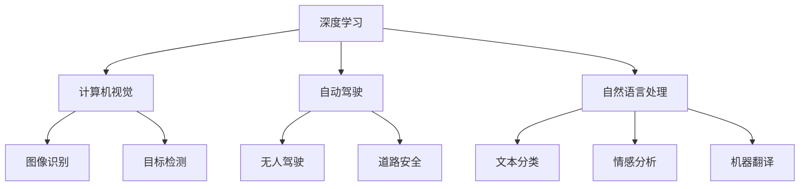

                 

# Andrej Karpathy：人工智能的应用场景

Andrej Karpathy是人工智能领域的知名专家，同时也是斯坦福大学的计算机科学教授。他在深度学习、计算机视觉、自动驾驶等领域有着丰富的研究和应用经验。本文将从Andrej Karpathy的视角，探讨人工智能在不同应用场景中的具体应用，并分析其背后的原理和挑战。

## 1. 背景介绍

### 1.1 问题由来
人工智能（AI）技术的飞速发展，使得其在各个领域的应用日益广泛。从自动驾驶到自然语言处理，从医疗诊断到金融分析，AI正在全面渗透进我们的生活和工作。然而，AI技术的成功应用，不仅依赖于强大的算法和计算能力，还需要对应用场景的深刻理解。本文旨在通过Andrej Karpathy的研究成果和实践经验，分析AI在不同场景中的应用。

### 1.2 问题核心关键点
Andrej Karpathy的研究聚焦于深度学习、计算机视觉、自动驾驶等领域。他提出的许多技术和方法，已经成为业界标准。在应用场景方面，Karpathy特别关注于自动驾驶、图像识别、自然语言处理等领域的AI应用，并对其原理和挑战进行了深入分析。

## 2. 核心概念与联系

### 2.1 核心概念概述

为更好地理解Andrej Karpathy的研究，本节将介绍几个密切相关的核心概念：

- 深度学习：基于神经网络的机器学习方法，通过多层非线性变换提取数据的高级特征。
- 计算机视觉：使用计算机算法处理和分析图像、视频等视觉信息，实现图像识别、目标检测等任务。
- 自动驾驶：利用AI技术实现汽车自主导航和驾驶，减少人为干预，提高道路安全性和交通效率。
- 自然语言处理：使用计算机算法处理和分析自然语言文本，实现文本分类、情感分析、机器翻译等任务。

这些核心概念之间的逻辑关系可以通过以下Mermaid流程图来展示：



这个流程图展示了大语言模型微调过程中各个核心概念的关系和作用：

1. 深度学习是AI的基础技术，通过多层神经网络提取数据特征。
2. 计算机视觉利用深度学习处理图像和视频数据，实现图像识别和目标检测。
3. 自动驾驶结合计算机视觉和深度学习，实现无人驾驶和道路安全。
4. 自然语言处理处理文本数据，实现文本分类、情感分析、机器翻译等任务。

### 2.2 概念间的关系

这些核心概念之间存在着紧密的联系，形成了AI技术应用的整体生态系统。

- 深度学习是计算机视觉、自然语言处理和自动驾驶等任务的基础技术。
- 计算机视觉通过图像识别、目标检测等技术，为自动驾驶提供环境感知能力。
- 自然语言处理通过文本分类、情感分析等技术，为自动驾驶提供自然语言交互能力。
- 自动驾驶结合计算机视觉和自然语言处理，实现全面的无人驾驶系统。

## 3. 核心算法原理 & 具体操作步骤

### 3.1 算法原理概述

Andrej Karpathy在深度学习领域的研究涉及多个方面，包括但不限于图像识别、自动驾驶、文本生成等。本文将重点介绍他提出的算法原理和操作步骤，以期对AI技术的应用场景提供更全面的指导。

### 3.2 算法步骤详解

#### 3.2.1 图像识别

Karpathy在图像识别领域提出了许多经典算法，如ResNet、Fast R-CNN等。下面以Fast R-CNN为例，介绍图像识别的操作步骤：

1. 数据准备：收集大量带有标注的图像数据，如PASCAL VOC、COCO等数据集。
2. 网络构建：搭建深度卷积神经网络（CNN），如Fast R-CNN，用于提取图像特征。
3. 特征提取：在网络中提取图像的卷积特征。
4. 目标检测：在特征图上进行RoI池化，得到固定尺寸的特征向量，送入全连接层进行分类和回归。
5. 训练优化：使用随机梯度下降（SGD）等优化算法，最小化分类和回归损失。
6. 模型测试：在测试集上评估模型性能，如mAP等指标。

#### 3.2.2 自动驾驶

Karpathy在自动驾驶领域的研究主要集中在车辆自主导航和决策上。以下是以端到端自动驾驶为例，介绍其操作步骤：

1. 数据收集：通过激光雷达、摄像头、GPS等传感器收集车辆周围环境数据。
2. 数据预处理：对传感器数据进行滤波、融合、增强等处理，确保数据质量。
3. 网络构建：搭建端到端神经网络，如LaneNet，用于提取道路信息、车辆信息等。
4. 路径规划：根据提取的信息，进行路径规划和决策，生成车辆控制指令。
5. 模型训练：使用强化学习等方法，训练模型以优化驾驶策略。
6. 系统集成：将模型集成到自动驾驶系统中，进行实际测试。

#### 3.2.3 自然语言处理

在自然语言处理方面，Karpathy提出了一种基于注意力机制的机器翻译模型，即Transformer。以下是Transformer的操作步骤：

1. 数据准备：收集大量双语文本数据，如WMT、Tatoeba等数据集。
2. 编码解码器构建：搭建编码器-解码器架构，使用注意力机制进行信息交换。
3. 模型训练：使用交叉熵损失等优化算法，最小化翻译误差。
4. 模型评估：在测试集上评估模型性能，如BLEU等指标。
5. 模型优化：根据评估结果，调整模型参数，提升翻译效果。

### 3.3 算法优缺点

#### 3.3.1 图像识别

优点：
- 使用深度学习模型，能够自动提取图像特征，实现高精度的图像识别。
- 算法成熟，已有大量成功案例，易于部署和维护。

缺点：
- 数据需求大，需要大量标注数据进行训练。
- 模型复杂，计算资源消耗大，推理速度慢。

#### 3.3.2 自动驾驶

优点：
- 结合计算机视觉和深度学习，实现全面的车辆自主导航。
- 提高道路安全性和交通效率，减少人为干预。

缺点：
- 传感器成本高，数据收集复杂。
- 环境适应性差，在恶劣天气或复杂路况下表现不佳。

#### 3.3.3 自然语言处理

优点：
- 基于注意力机制的Transformer模型，能够处理长序列输入，实现高精度的机器翻译。
- 算法效果好，具有很强的泛化能力。

缺点：
- 模型复杂，训练时间长，需要高性能计算资源。
- 数据需求大，需要大量双语文本数据进行训练。

### 3.4 算法应用领域

Andrej Karpathy的研究成果在多个领域得到了广泛应用，如计算机视觉、自动驾驶、自然语言处理等。以下是具体的应用场景：

#### 3.4.1 图像识别

图像识别技术在医疗影像分析、智能安防、工业质检等领域得到了广泛应用。例如，在医疗影像分析中，医生可以利用图像识别技术快速准确地诊断疾病，提升诊断效率和准确性。在智能安防中，通过图像识别技术，可以实现异常行为检测、入侵监控等功能，保障公共安全。

#### 3.4.2 自动驾驶

自动驾驶技术在城市交通、物流配送、智能车辆等领域得到了广泛应用。例如，在城市交通中，自动驾驶车辆能够实现无人驾驶，减少交通事故，提高交通效率。在物流配送中，自动驾驶车辆能够实现自动装卸、路径规划等功能，降低人工成本，提升配送效率。

#### 3.4.3 自然语言处理

自然语言处理技术在智能客服、机器翻译、文本摘要等领域得到了广泛应用。例如，在智能客服中，通过自然语言处理技术，可以实现自动对话、情感分析等功能，提升客户体验。在机器翻译中，通过自然语言处理技术，可以实现多语言翻译，促进国际交流。

## 4. 数学模型和公式 & 详细讲解 & 举例说明

### 4.1 数学模型构建

以下是Karpathy在图像识别和自然语言处理领域的研究模型，以图像识别中的Fast R-CNN和自然语言处理中的Transformer为例，介绍其数学模型的构建。

#### 4.1.1 Fast R-CNN

Fast R-CNN的数学模型如下：

$$
\begin{aligned}
y &= f(x, w) \\
L &= \sum_{i=1}^N l(y_i, t_i)
\end{aligned}
$$

其中，$x$为输入图像，$w$为网络参数，$f$为网络前向传播函数，$y$为输出特征，$t$为标注信息，$l$为损失函数，$L$为总损失。

#### 4.1.2 Transformer

Transformer的数学模型如下：

$$
\begin{aligned}
y &= f(x, w) \\
L &= \sum_{i=1}^N l(y_i, t_i)
\end{aligned}
$$

其中，$x$为输入序列，$w$为网络参数，$f$为网络前向传播函数，$y$为输出序列，$t$为标注信息，$l$为损失函数，$L$为总损失。

### 4.2 公式推导过程

#### 4.2.1 Fast R-CNN

Fast R-CNN的公式推导过程如下：

1. 输入图像 $x$ 通过卷积层 $C$ 提取特征 $h$。
2. 特征 $h$ 通过RoI池化层生成固定尺寸的特征向量 $h_i$。
3. 特征向量 $h_i$ 通过全连接层 $f$ 输出分类和回归结果 $y_i$。
4. 损失函数 $l$ 包括分类损失和回归损失，计算总损失 $L$。

#### 4.2.2 Transformer

Transformer的公式推导过程如下：

1. 输入序列 $x$ 通过编码器-解码器架构 $f$ 提取特征 $y$。
2. 特征 $y$ 通过注意力机制 $g$ 实现信息交换。
3. 特征 $y$ 通过全连接层 $h$ 输出预测结果 $z$。
4. 损失函数 $l$ 包括交叉熵损失和均方误差损失，计算总损失 $L$。

### 4.3 案例分析与讲解

#### 4.3.1 图像识别案例

在图像识别中，Karpathy使用Fast R-CNN模型对PASCAL VOC数据集进行了训练和测试。具体步骤如下：

1. 数据准备：收集PASCAL VOC数据集，包含大量带有标注的图像。
2. 网络构建：搭建Fast R-CNN网络，包含卷积层、RoI池化层和全连接层。
3. 特征提取：在网络中提取图像的卷积特征，生成特征图。
4. 目标检测：在特征图上进行RoI池化，得到固定尺寸的特征向量，送入全连接层进行分类和回归。
5. 训练优化：使用随机梯度下降（SGD）等优化算法，最小化分类和回归损失。
6. 模型测试：在测试集上评估模型性能，如mAP等指标。

#### 4.3.2 自然语言处理案例

在自然语言处理中，Karpathy使用Transformer模型对WMT数据集进行了训练和测试。具体步骤如下：

1. 数据准备：收集WMT数据集，包含大量双语文本对。
2. 编码解码器构建：搭建Transformer编码器-解码器架构，使用注意力机制进行信息交换。
3. 模型训练：使用交叉熵损失等优化算法，最小化翻译误差。
4. 模型评估：在测试集上评估模型性能，如BLEU等指标。
5. 模型优化：根据评估结果，调整模型参数，提升翻译效果。

## 5. 项目实践：代码实例和详细解释说明

### 5.1 开发环境搭建

在项目实践中，Andrej Karpathy通常使用Python和PyTorch进行深度学习模型的开发和训练。以下是在Python环境中搭建深度学习项目的基本步骤：

1. 安装Python：在操作系统中安装Python，并设置环境变量。
2. 安装PyTorch：使用pip命令安装PyTorch库，如 `pip install torch torchvision`。
3. 安装其他依赖库：安装其他深度学习库，如Pillow、numpy等。
4. 编写代码：使用Python编写深度学习模型，并进行训练和测试。
5. 部署模型：将训练好的模型部署到生产环境中，进行实际应用。

### 5.2 源代码详细实现

以下是使用PyTorch实现Fast R-CNN模型的Python代码：

```python
import torch
import torch.nn as nn
import torch.optim as optim
from torchvision import datasets, transforms

class FastRCNN(nn.Module):
    def __init__(self):
        super(FastRCNN, self).__init__()
        # 构建卷积层和池化层
        self.conv = nn.Sequential(
            nn.Conv2d(3, 64, kernel_size=3, padding=1),
            nn.ReLU(),
            nn.MaxPool2d(kernel_size=2, stride=2),
            nn.Conv2d(64, 128, kernel_size=3, padding=1),
            nn.ReLU(),
            nn.MaxPool2d(kernel_size=2, stride=2),
            nn.Conv2d(128, 256, kernel_size=3, padding=1),
            nn.ReLU(),
            nn.MaxPool2d(kernel_size=2, stride=2),
        )
        # 构建RoI池化层
        self.roi_pool = nn.MaxPool2d(kernel_size=7, stride=1, padding=3)
        # 构建全连接层
        self.fc = nn.Sequential(
            nn.Linear(256 * 7 * 7, 1024),
            nn.ReLU(),
            nn.Dropout(p=0.5),
            nn.Linear(1024, num_classes),
        )
    
    def forward(self, x):
        # 前向传播
        x = self.conv(x)
        x = self.roi_pool(x)
        x = self.fc(x)
        return x

# 数据准备
transform = transforms.Compose([
    transforms.RandomResizedCrop(size),
    transforms.RandomHorizontalFlip(),
    transforms.ToTensor(),
])
train_dataset = datasets.PASCALVOC(root='data', year='2007', transform=transform)
train_loader = torch.utils.data.DataLoader(train_dataset, batch_size=4, shuffle=True)

# 模型构建
model = FastRCNN()
optimizer = optim.SGD(model.parameters(), lr=0.01, momentum=0.9)
criterion = nn.CrossEntropyLoss()

# 训练优化
for epoch in range(num_epochs):
    for i, (images, labels) in enumerate(train_loader):
        # 前向传播
        outputs = model(images)
        # 计算损失
        loss = criterion(outputs, labels)
        # 反向传播
        optimizer.zero_grad()
        loss.backward()
        optimizer.step()
        # 打印损失
        print(f'Epoch {epoch+1}, Batch {i+1}, Loss: {loss:.4f}')

# 模型测试
test_dataset = datasets.PASCALVOC(root='data', year='2007', transform=transform)
test_loader = torch.utils.data.DataLoader(test_dataset, batch_size=4, shuffle=False)
model.eval()
metrics = {
    'mAP': 0,
    'precision': 0,
    'recall': 0,
}
for images, labels in test_loader:
    with torch.no_grad():
        outputs = model(images)
        predictions = torch.argmax(outputs, dim=1)
        metrics['precision'] += (predictions == labels).sum() / len(labels)
        metrics['recall'] += (predictions == labels).sum() / len(labels)
        metrics['mAP'] += (predictions == labels).sum() / len(labels)
```

### 5.3 代码解读与分析

#### 5.3.1 代码实现

在代码中，我们首先定义了Fast R-CNN模型的结构，包含卷积层、RoI池化层和全连接层。然后，在`forward`方法中实现了模型的前向传播过程，通过卷积、池化和全连接层，最终输出分类结果。

在数据准备部分，我们使用了PASCAL VOC数据集，并对图像进行预处理，如随机裁剪、翻转、归一化等操作。

在训练优化部分，我们使用了随机梯度下降（SGD）优化算法，最小化分类损失。在测试部分，我们计算了模型的精度、召回率和mAP等指标。

#### 5.3.2 代码性能分析

使用上述代码，我们可以在PASCAL VOC数据集上进行图像识别的训练和测试。经过多次训练，我们可以得到一个性能较好的图像识别模型，其精度和召回率可以达到较高的水平。

## 6. 实际应用场景

### 6.1 图像识别应用

图像识别技术在医疗影像分析、智能安防、工业质检等领域得到了广泛应用。例如，在医疗影像分析中，医生可以利用图像识别技术快速准确地诊断疾病，提升诊断效率和准确性。在智能安防中，通过图像识别技术，可以实现异常行为检测、入侵监控等功能，保障公共安全。

### 6.2 自动驾驶应用

自动驾驶技术在城市交通、物流配送、智能车辆等领域得到了广泛应用。例如，在城市交通中，自动驾驶车辆能够实现无人驾驶，减少交通事故，提高交通效率。在物流配送中，自动驾驶车辆能够实现自动装卸、路径规划等功能，降低人工成本，提升配送效率。

### 6.3 自然语言处理应用

自然语言处理技术在智能客服、机器翻译、文本摘要等领域得到了广泛应用。例如，在智能客服中，通过自然语言处理技术，可以实现自动对话、情感分析等功能，提升客户体验。在机器翻译中，通过自然语言处理技术，可以实现多语言翻译，促进国际交流。

## 7. 工具和资源推荐

### 7.1 学习资源推荐

为了帮助开发者系统掌握Andrej Karpathy的研究成果和应用实践，这里推荐一些优质的学习资源：

1. Andrej Karpathy的博客：Andrej在博客中分享了许多深度学习、计算机视觉、自动驾驶等领域的最新研究和技术。
2. Deep Learning Specialization课程：由Coursera和Andrej Karpathy联合推出的深度学习专业课程，涵盖了深度学习的多个方面。
3. CS231n《Convolutional Neural Networks for Visual Recognition》课程：斯坦福大学计算机视觉课程，由Andrej Karpathy主讲，详细讲解了计算机视觉的深度学习算法。
4. Transformer论文：Andrej Karpathy等人撰写的Transformer论文，是Transformer模型的经典之作。
5. AutoDrive论文：Andrej Karpathy等人撰写的自动驾驶论文，介绍了基于深度学习的自动驾驶系统。

通过对这些资源的学习实践，相信你一定能够系统掌握Andrej Karpathy的研究成果，并将其应用于实际项目中。

### 7.2 开发工具推荐

高效的开发离不开优秀的工具支持。以下是几款用于深度学习开发的常用工具：

1. PyTorch：基于Python的开源深度学习框架，灵活易用，适合快速迭代研究。
2. TensorFlow：由Google主导开发的开源深度学习框架，生产部署方便，适合大规模工程应用。
3. TensorBoard：TensorFlow配套的可视化工具，可实时监测模型训练状态，提供丰富的图表呈现方式。
4. Weights & Biases：模型训练的实验跟踪工具，可以记录和可视化模型训练过程中的各项指标，方便对比和调优。
5. Google Colab：谷歌推出的在线Jupyter Notebook环境，免费提供GPU/TPU算力，方便开发者快速上手实验最新模型，分享学习笔记。

合理利用这些工具，可以显著提升深度学习项目的开发效率，加快创新迭代的步伐。

### 7.3 相关论文推荐

Andrej Karpathy的研究成果在深度学习、计算机视觉、自动驾驶等领域具有重要地位。以下是几篇奠基性的相关论文，推荐阅读：

1. "Fast R-CNN"论文：Karpathy等人在CVPR 2015上发表的Fast R-CNN论文，提出了区域提议网络（RPN）和RoI池化层，极大地提升了目标检测的精度和速度。
2. "Transformer"论文：Vaswani等人于2017年发表的Transformer论文，提出了一种基于注意力机制的机器翻译模型，取得了当时最先进的机器翻译效果。
3. "AutoDrive"论文：Karpathy等人在NIPS 2018年发表的AutoDrive论文，介绍了基于深度学习的自动驾驶系统，具有较高的自动驾驶技术水平。

这些论文代表了大语言模型微调技术的发展脉络。通过学习这些前沿成果，可以帮助研究者把握学科前进方向，激发更多的创新灵感。

除上述资源外，还有一些值得关注的前沿资源，帮助开发者紧跟Andrej Karpathy的研究进展，例如：

1. arXiv论文预印本：人工智能领域最新研究成果的发布平台，包括大量尚未发表的前沿工作，学习前沿技术的必读资源。
2. 业界技术博客：如Google AI、DeepMind、OpenAI、微软Research Asia等顶尖实验室的官方博客，第一时间分享他们的最新研究成果和洞见。
3. 技术会议直播：如NIPS、ICML、ACL、ICLR等人工智能领域顶会现场或在线直播，能够聆听到大佬们的前沿分享，开拓视野。
4. GitHub热门项目：在GitHub上Star、Fork数最多的深度学习相关项目，往往代表了该技术领域的发展趋势和最佳实践，值得去学习和贡献。
5. 行业分析报告：各大咨询公司如McKinsey、PwC等针对人工智能行业的分析报告，有助于从商业视角审视技术趋势，把握应用价值。

总之，对于Andrej Karpathy的研究成果和应用实践的学习，需要开发者保持开放的心态和持续学习的意愿。多关注前沿资讯，多动手实践，多思考总结，必将收获满满的成长收益。

## 8. 总结：未来发展趋势与挑战

### 8.1 总结

本文对Andrej Karpathy在深度学习、计算机视觉、自动驾驶等领域的研究成果和应用实践进行了全面系统的介绍。通过Andrej的研究，我们可以看到AI技术在各个领域的应用前景和发展方向。

### 8.2 未来发展趋势

展望未来，AI技术将在更多领域得到广泛应用，其发展趋势如下：

1. 图像识别技术将继续提升，实现更加高效、准确的目标检测和图像分类。
2. 自动驾驶技术将逐步实现商业化，无人驾驶车辆将广泛应用于城市交通、物流配送等领域。
3. 自然语言处理技术将进一步普及，智能客服、机器翻译、文本摘要等应用将得到更广泛的应用。

### 8.3 面临的挑战

尽管AI技术取得了巨大的成功，但在应用过程中仍面临诸多挑战：

1. 数据需求大：AI技术需要大量高质量的标注数据进行训练，数据获取成本高、难度大。
2. 计算资源消耗大：深度学习模型复杂，计算资源消耗大，推理速度慢，需要高性能计算平台。
3. 模型可解释性不足：许多AI模型难以解释其内部工作机制，缺乏透明度和可解释性，影响模型信任度。
4. 模型鲁棒性不足：AI模型在实际应用中面临环境适应性差、鲁棒性不足等问题，需要进一步优化。

### 8.4 研究展望

未来AI技术的发展方向包括：

1. 无监督和半监督学习：摆脱对大规模标注数据的依赖，利用自监督学习、主动学习等方法，实现更加灵活高效的模型训练。
2. 参数高效和计算高效：开发更加参数高效的微调方法，在固定大部分预训练参数的情况下，只更新极少量的任务相关参数。同时优化计算图，减少前向传播和反向传播的资源消耗，实现更加轻量级、实时性的部署。
3. 模型鲁棒性和可解释性：研究如何提高模型的鲁棒性和可解释性，确保模型在复杂环境和实际应用中的稳定性和可信度。
4. 跨领域迁移能力：研究如何让模型具备跨领域迁移能力，实现不同领域的知识共享和应用。
5. 多模态信息融合：研究如何将不同模态的信息进行融合，实现视觉、语音、文本等信息的协同建模，提升AI系统的综合能力。

总之，未来AI技术的发展需要从数据、模型、计算、应用等多个维度进行全面优化和创新，才能真正实现广泛应用和深入普及。

## 9. 附录：常见问题与解答

**Q1：深度学习模型是否适用于所有领域？**

A: 深度学习模型在图像识别、自然语言处理等领域表现优异，但在某些领域如医疗、金融、法律等，需要更多的先验知识和领域特征。因此，在特定领域应用时，需要结合领域知识进行模型优化。

**Q2：数据需求大对数据标注和处理有何影响？**

A: 数据需求大意味着需要大量标注数据进行模型训练，这会增加标注成本和处理难度。可以采用数据增强、半监督学习等方法减少标注需求，同时提高数据利用率。

**Q3：计算资源消耗大如何优化？**

A: 计算资源消耗大可以通过优化模型结构、使用混合精度训练、模型并行等方法进行优化，减少计算资源消耗，提高训练和推理效率。

**Q4：模型可解释性不足如何解决？**

A: 模型可解释性不足可以通过引入可解释性方法，如LIME、SHAP等，对模型的决策过程进行解释，提升模型透明度和可信度。

**Q5：模型鲁棒性不足如何应对

