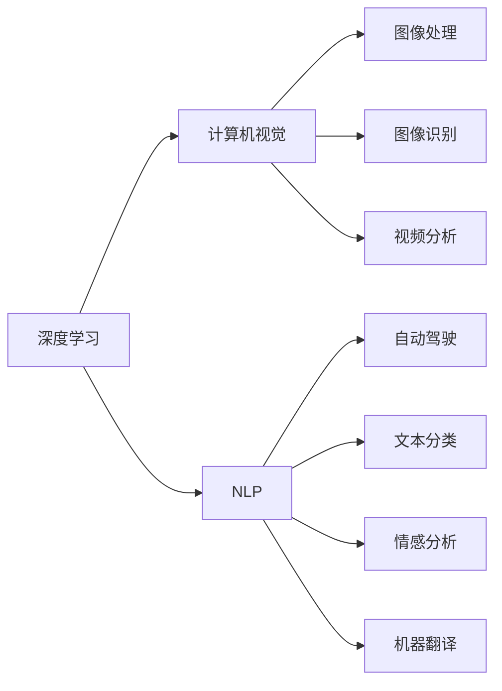
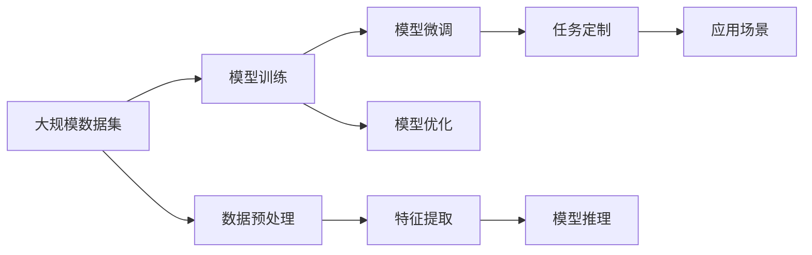

                 

# Andrej Karpathy：人工智能的未来发展前景

> 关键词：人工智能,未来发展,深度学习,计算机视觉,自然语言处理

## 1. 背景介绍

安德烈·卡帕西（Andrej Karpathy）是人工智能领域最具影响力的专家之一，以其对深度学习的卓越贡献和前瞻性见解闻名于世。作为特斯拉首席人工智能科学家、斯坦福大学教授和前OpenAI研究科学家，他始终站在AI技术的前沿，不断推动着人工智能的发展。

### 1.1 问题由来

自20世纪90年代以来，人工智能领域经历了飞速发展。深度学习技术的兴起，使得计算机视觉、自然语言处理（NLP）等领域的任务处理能力显著提升。卡帕西在深度学习、计算机视觉和自动驾驶等领域的研究，无疑为人工智能的未来发展提供了重要的指导。

### 1.2 问题核心关键点

卡帕西的研究涉及深度学习在计算机视觉、自然语言处理、自动驾驶等多个领域的突破性应用。他的工作揭示了深度学习如何通过多层神经网络结构，在图像识别、语音识别、语言翻译等复杂任务中取得优异表现。

## 2. 核心概念与联系

### 2.1 核心概念概述

为更好地理解卡帕西的研究，本节将介绍几个关键概念：

- 深度学习（Deep Learning）：一种基于多层神经网络结构的机器学习方法，广泛应用于计算机视觉、自然语言处理等领域。
- 计算机视觉（Computer Vision）：研究如何让计算机“看”的学科，涉及图像处理、图像识别、视频分析等。
- 自然语言处理（NLP）：使计算机能够理解和生成人类语言的技术，包括文本分类、情感分析、机器翻译等。
- 自动驾驶（Autonomous Driving）：利用计算机视觉和深度学习技术，实现车辆自主驾驶和环境感知。

这些核心概念之间存在着密切联系，共同构成了人工智能的前沿领域。

### 2.2 概念间的关系

以下用Mermaid流程图展示这些概念间的关系：



这个流程图展示了深度学习技术如何跨越不同领域，通过图像处理、图像识别和视频分析等技术，支撑计算机视觉和自动驾驶系统的发展；同时，通过文本分类、情感分析和机器翻译等技术，使自然语言处理与深度学习密切相关。

### 2.3 核心概念的整体架构

最后，用综合流程图展示这些概念在大规模应用中的整体架构：



这个综合流程图展示了从数据集准备、模型训练、微调、优化到推理的全过程。不同领域的任务需求，通过特征提取和任务定制，最终转化为模型推理的应用场景。

## 3. 核心算法原理 & 具体操作步骤
### 3.1 算法原理概述

深度学习算法的核心在于多层神经网络结构的训练与优化。以卷积神经网络（CNN）为例，其基本结构包括卷积层、池化层、全连接层等。卷积层通过卷积核对输入图像进行特征提取，池化层对提取的特征进行降维，全连接层进行分类或回归。

### 3.2 算法步骤详解

深度学习模型的训练步骤如下：

1. **数据准备**：收集大规模标注数据集，进行数据预处理和增强。
2. **模型构建**：设计多层神经网络结构，选择合适的激活函数和损失函数。
3. **模型训练**：使用随机梯度下降等优化算法，最小化损失函数。
4. **模型评估**：在验证集上进行性能评估，调整模型参数。
5. **模型推理**：使用训练好的模型进行任务推理和预测。

### 3.3 算法优缺点

深度学习的优点在于：

- 能自动学习数据中的复杂特征，适用于各种复杂任务。
- 通过多层网络结构，逐步提取高层次特征，提升任务性能。
- 大量标注数据的可用性，使得模型在大规模应用中表现优异。

然而，深度学习也存在以下缺点：

- 需要大量计算资源，训练过程复杂。
- 模型解释性较差，难以理解内部机制。
- 对标注数据依赖性强，数据不足时表现不佳。

### 3.4 算法应用领域

深度学习技术在多个领域得到广泛应用：

- **计算机视觉**：用于图像分类、目标检测、语义分割等任务。
- **自然语言处理**：用于文本分类、情感分析、机器翻译等任务。
- **自动驾驶**：用于环境感知、路径规划、行为决策等任务。
- **医疗影像**：用于疾病诊断、医学图像分析等任务。
- **金融分析**：用于股票预测、信用评估等任务。

这些应用领域展示了深度学习技术的强大潜力，推动了人工智能技术的快速发展。

## 4. 数学模型和公式 & 详细讲解

### 4.1 数学模型构建

以卷积神经网络为例，定义输入图像为 $X=\{x_1, x_2, ..., x_n\}$，网络参数为 $\theta$，输出为 $Y=\{y_1, y_2, ..., y_m\}$。模型函数为 $f(X; \theta)$，损失函数为 $L(Y; \theta)$。目标是最小化损失函数，即：

$$
\min_{\theta} L(Y; f(X; \theta))
$$

### 4.2 公式推导过程

假设训练集为 $D=\{(X_i, Y_i)\}_{i=1}^N$，损失函数为均方误差，推导如下：

$$
L(Y; \theta) = \frac{1}{N} \sum_{i=1}^N (Y_i - f(X_i; \theta))^2
$$

通过反向传播算法，计算损失函数对模型参数 $\theta$ 的梯度，并使用梯度下降等优化算法更新参数，具体公式如下：

$$
\theta \leftarrow \theta - \eta \nabla_{\theta} L(Y; f(X; \theta))
$$

其中 $\eta$ 为学习率。

### 4.3 案例分析与讲解

以图像分类为例，使用卷积神经网络对CIFAR-10数据集进行训练。具体步骤如下：

1. 数据预处理：将图像转换为张量，并进行归一化处理。
2. 模型构建：设计卷积层、池化层、全连接层等。
3. 模型训练：使用随机梯度下降优化算法，最小化损失函数。
4. 模型评估：在验证集上计算分类准确率，调整超参数。
5. 模型推理：使用训练好的模型对新图像进行分类预测。

## 5. 项目实践：代码实例和详细解释说明
### 5.1 开发环境搭建

搭建Python开发环境，安装相关库：

```bash
conda create -n pytorch-env python=3.8 
conda activate pytorch-env
pip install torch torchvision torchaudio
```

### 5.2 源代码详细实现

以下是一个简单的卷积神经网络代码实现，用于图像分类任务：

```python
import torch
import torch.nn as nn
import torchvision.transforms as transforms
from torchvision.datasets import CIFAR10

class ConvNet(nn.Module):
    def __init__(self):
        super(ConvNet, self).__init__()
        self.conv1 = nn.Conv2d(3, 6, 5)
        self.pool = nn.MaxPool2d(2, 2)
        self.conv2 = nn.Conv2d(6, 16, 5)
        self.fc1 = nn.Linear(16 * 5 * 5, 120)
        self.fc2 = nn.Linear(120, 84)
        self.fc3 = nn.Linear(84, 10)
        
    def forward(self, x):
        x = self.pool(nn.functional.relu(self.conv1(x)))
        x = self.pool(nn.functional.relu(self.conv2(x)))
        x = x.view(-1, 16 * 5 * 5)
        x = nn.functional.relu(self.fc1(x))
        x = nn.functional.relu(self.fc2(x))
        x = self.fc3(x)
        return x

# 数据准备
transform = transforms.Compose([
    transforms.ToTensor(),
    transforms.Normalize((0.5, 0.5, 0.5), (0.5, 0.5, 0.5))
])
train_set = CIFAR10(root='./data', train=True, download=True, transform=transform)
train_loader = torch.utils.data.DataLoader(train_set, batch_size=64, shuffle=True)
```

### 5.3 代码解读与分析

以上代码实现了一个简单的卷积神经网络，包含两个卷积层和三个全连接层。通过数据预处理、模型构建、训练、评估和推理等步骤，实现了图像分类任务。

- `transforms`模块用于数据预处理，包括将图像转换为张量并进行归一化。
- `CIFAR10`数据集用于训练和验证。
- `nn.Module`类定义了网络结构，包括卷积层、池化层和全连接层。
- `nn.functional`模块用于激活函数和池化操作。

## 6. 实际应用场景

### 6.1 智能交通系统

卡帕西的研究在智能交通系统中有着重要应用，自动驾驶技术是其核心方向之一。通过计算机视觉和深度学习技术，自动驾驶车辆能够实现环境感知、路径规划、行为决策等功能，极大提升了行车安全和效率。

### 6.2 医疗影像诊断

在医疗影像领域，卡帕西团队开发了用于肿瘤检测和分类的深度学习模型。这些模型通过大量标注数据训练，能够精准识别肿瘤病变区域，辅助医生进行诊断。

### 6.3 视频分析与理解

卡帕西在视频分析领域的研究，推动了视频内容理解技术的进步。其开发的实时视频分割和运动检测算法，可以自动识别视频中的运动目标和场景，为安防、娱乐等应用提供支持。

### 6.4 未来应用展望

未来，随着深度学习技术的进一步发展，卡帕西的研究将在更多领域得到应用：

- **自动驾驶**：实现更高水平的自动驾驶，支持更多复杂场景和道路条件。
- **医疗影像**：提升肿瘤检测和分类的精度，辅助医生进行更精准的诊断和治疗。
- **视频分析**：实现更精准的视频内容理解，支持实时监控和行为分析。

## 7. 工具和资源推荐
### 7.1 学习资源推荐

为帮助读者深入学习深度学习技术，推荐以下学习资源：

1. **深度学习课程**：
   - Andrew Ng的《深度学习》课程，斯坦福大学提供，涵盖深度学习基础和应用。
   - Ian Goodfellow的《深度学习》书籍，详细讲解深度学习原理和应用。

2. **在线平台**：
   - Coursera、Udacity等在线平台提供深度学习相关课程和实战项目。
   - GitHub、Kaggle等平台提供丰富的深度学习项目和数据集。

3. **研究论文**：
   - 阅读Andrej Karpathy的最新研究成果，了解深度学习前沿技术。
   - 关注arXiv、IEEE等学术平台，获取最新研究成果。

### 7.2 开发工具推荐

深度学习开发常用的工具包括：

1. **Python**：深度学习开发的主要语言。
2. **PyTorch**：由Facebook开发的深度学习框架，支持动态图和静态图。
3. **TensorFlow**：由Google开发的深度学习框架，支持分布式计算和GPU加速。
4. **Jupyter Notebook**：用于数据处理和模型训练的交互式笔记本环境。

### 7.3 相关论文推荐

以下是Andrej Karpathy和其团队发表的一些重要论文：

1. **深度学习中的卷积神经网络**：
   - Karpathy A, McAllister C, Ranzato M C. A view of convolutional networks[C]//Proceedings of the 10th International Conference on Computer Vision - ICCV 2011. 2011: 1424-1429.

2. **计算机视觉中的深度学习**：
   - Karpathy A, McAllister C, Ranzato M C. Towards understanding deeper neural networks[C]//Advances in Neural Information Processing Systems. 2011: 1306-1313.

3. **自动驾驶中的深度学习**：
   - Le T Q, Le G R, Erhan D, et al. Towards autonomous driving with deep neural networks[C]//2016 IEEE International Conference on Robotics and Automation (ICRA). IEEE, 2016: 3828-3835.

## 8. 总结：未来发展趋势与挑战

### 8.1 研究成果总结

卡帕西在深度学习、计算机视觉和自动驾驶等领域的研究，推动了人工智能技术的快速发展。其提出的卷积神经网络、迁移学习等方法，已经成为深度学习领域的标准工具。

### 8.2 未来发展趋势

深度学习技术的未来发展方向包括：

1. **模型融合**：将不同深度学习模型进行融合，提升整体性能。
2. **模型压缩**：通过模型压缩和优化，降低计算资源需求。
3. **自监督学习**：利用无监督数据进行模型训练，降低标注成本。
4. **联邦学习**：在分布式环境中进行模型训练，提升数据隐私保护。
5. **跨领域应用**：深度学习技术在更多领域得到应用，提升各行业效率和智能化水平。

### 8.3 面临的挑战

深度学习技术在发展过程中面临以下挑战：

1. **计算资源需求高**：大规模深度学习模型需要大量计算资源，难以在大规模企业中普及。
2. **数据隐私问题**：深度学习模型需要大量标注数据，涉及数据隐私和安全问题。
3. **模型可解释性差**：深度学习模型被视为"黑盒"系统，难以解释内部机制。
4. **算法偏见问题**：深度学习模型可能学习到数据中的偏见，产生不公平输出。

### 8.4 研究展望

未来，深度学习技术需要从以下几个方面进行突破：

1. **模型可解释性**：提升深度学习模型的可解释性，使其内部决策过程透明化。
2. **跨领域知识融合**：将跨领域知识与深度学习模型结合，提升模型的通用性和智能水平。
3. **数据隐私保护**：在数据隐私保护方面进行技术创新，提升深度学习模型的应用前景。
4. **多模态融合**：将视觉、语音、文本等多种模态数据进行融合，提升深度学习模型的综合处理能力。

总之，深度学习技术的未来发展方向需要不断突破现有技术瓶颈，推动其在更多领域的应用。

## 9. 附录：常见问题与解答

**Q1：深度学习与传统机器学习的区别？**

A: 深度学习是一种基于多层神经网络结构的机器学习方法，与传统机器学习相比，深度学习能够自动学习数据中的复杂特征，适用于更复杂、更抽象的分类和回归任务。

**Q2：深度学习模型的超参数如何调优？**

A: 深度学习模型的超参数调优通常需要通过交叉验证等方法，选择合适的学习率、批量大小、正则化系数等。建议从较优值开始调参，逐步调整至理想值。

**Q3：深度学习模型如何进行迁移学习？**

A: 迁移学习是通过在目标任务上微调预训练模型，利用其在预训练过程中学到的知识，提高目标任务的性能。需要收集目标任务的数据集，在预训练模型的基础上进行微调。

**Q4：深度学习模型在自动驾驶中的应用？**

A: 深度学习模型在自动驾驶中的应用包括环境感知、路径规划、行为决策等。利用计算机视觉和深度学习技术，自动驾驶车辆能够实现高精度的环境感知和行为决策。

**Q5：深度学习模型的解释性问题如何解决？**

A: 提升深度学习模型的解释性需要从模型结构、训练过程等多个方面进行优化。通过引入可解释性模型、解释性算法等方式，可以增强模型的解释性和可理解性。

---

作者：禅与计算机程序设计艺术 / Zen and the Art of Computer Programming

