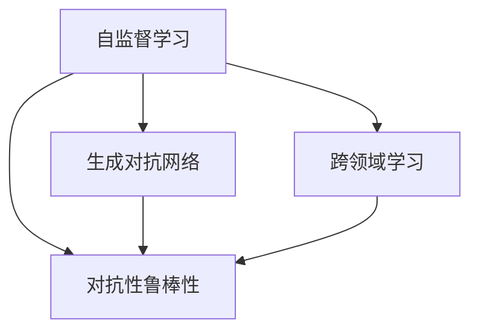

                 

## 1. 背景介绍

### 1.1 问题由来
人工智能（AI）的快速发展已经深刻改变了世界的面貌。从机器学习、深度学习的兴起，到图像识别、自然语言处理等领域的突破，AI技术在各个行业中都有着广泛的应用。然而，AI的未来发展方向仍是一个值得深入探讨的话题。本文将从AI领域的大师级人物Andrej Karpathy的角度，探讨他对于人工智能未来发展方向的见解。

### 1.2 问题核心关键点
Andrej Karpathy是计算机视觉领域的顶尖专家，同时也是深度学习和计算机视觉的教员和研究者。他专注于自监督学习、对抗性鲁棒性、生成对抗网络（GANs）和视觉、语音等跨领域学习。他的见解和研究对于AI的未来发展有着深远的影响。

## 2. 核心概念与联系

### 2.1 核心概念概述
在探讨Andrej Karpathy的见解之前，我们首先需要了解几个关键的概念：

- **自监督学习（Self-Supervised Learning）**：在缺乏监督数据的情况下，通过设计预定义的损失函数，让模型从大量未标注的数据中学习到规律和特征。

- **对抗性鲁棒性（Adversarial Robustness）**：使AI模型能够识别和抵御对抗性攻击的能力，确保模型在面对恶意输入时依然能够正确输出。

- **生成对抗网络（GANs）**：一种能够生成逼真图像、视频等内容的深度学习架构，通过两个神经网络（生成器和判别器）的竞争对抗学习生成新数据。

- **跨领域学习（Cross-Domain Learning）**：使模型能够在不同领域之间进行知识迁移，提升模型在不同场景下的泛化能力。

### 2.2 概念间的关系

以下将通过一个Mermaid流程图来展示这些核心概念之间的关系：



这个流程图展示了自监督学习如何通过对抗性鲁棒性和生成对抗网络提升模型的鲁棒性和泛化能力，同时跨领域学习在其中扮演着桥梁的角色，使得模型能够在不同的领域间进行知识迁移。

## 3. 核心算法原理 & 具体操作步骤

### 3.1 算法原理概述
Andrej Karpathy认为，未来AI的发展方向应当是构建更加智能、更加可靠、更加可解释的系统。为此，他强调以下几点：

- **自监督学习的重要性**：自监督学习能够使模型从无标签数据中学习到有用的特征，减少对标注数据的需求，提升模型的泛化能力。
- **对抗性鲁棒性的必要性**：在现实世界中，AI系统需要面对各种恶意攻击和噪声干扰，因此必须具备强大的对抗性鲁棒性。
- **生成对抗网络的潜力**：生成对抗网络能够生成高质量的模拟数据，为模型提供更多的训练样本，同时也能用于生成高质量的图像、视频等内容。

### 3.2 算法步骤详解
1. **数据收集与预处理**：收集大规模的未标注数据，并对数据进行预处理，如去噪、归一化等。
2. **设计自监督任务**：设计预定义的损失函数，让模型通过无标签数据学习到特征。
3. **模型训练**：使用设计好的自监督任务对模型进行训练，提升模型的特征抽取能力。
4. **对抗性鲁棒性增强**：在训练过程中加入对抗性样本，提升模型的鲁棒性。
5. **生成对抗网络应用**：使用生成对抗网络生成高质量的模拟数据，为模型提供更多的训练样本。

### 3.3 算法优缺点
自监督学习的优点包括：
- 减少了对标注数据的需求，降低了数据收集和标注的成本。
- 能够从大规模无标签数据中学习到更丰富的特征。
- 提升了模型的泛化能力，减少了过拟合的风险。

缺点包括：
- 需要设计合适的损失函数，否则可能无法学习到有效的特征。
- 训练过程可能需要更多的计算资源。

对抗性鲁棒性的优点包括：
- 提升了模型的安全性，能够抵御恶意攻击。
- 增强了模型的鲁棒性，减少了噪声干扰的影响。

缺点包括：
- 对抗性鲁棒性训练过程较为复杂，可能需要更多的计算资源。
- 难以平衡模型的准确性和鲁棒性。

生成对抗网络的优点包括：
- 能够生成高质量的模拟数据，增加了模型的训练样本。
- 能够生成多样化的数据，提升模型的泛化能力。

缺点包括：
- 生成对抗网络训练过程复杂，可能需要更多的计算资源。
- 生成的数据可能存在质量不稳定的风险。

### 3.4 算法应用领域
自监督学习、对抗性鲁棒性和生成对抗网络在多个领域中都有广泛的应用：

- **计算机视觉**：使用自监督学习和生成对抗网络训练图像分类、目标检测、语义分割等任务。
- **自然语言处理**：使用自监督学习和对抗性鲁棒性训练文本生成、文本分类、情感分析等任务。
- **医疗**：使用自监督学习和生成对抗网络训练医学图像分割、病理诊断等任务。
- **金融**：使用对抗性鲁棒性训练信用评分、欺诈检测等任务。

## 4. 数学模型和公式 & 详细讲解 & 举例说明

### 4.1 数学模型构建
在自监督学习中，通常使用如自编码器（Autoencoder）、生成对抗网络（GANs）等架构。以下是一个使用自编码器的数学模型构建示例：

设输入数据为 $x$，输出数据为 $x'$，则自编码器的目标是最小化重构误差 $E(x, x')$，数学模型为：

$$
E(x, x') = \frac{1}{2}||x - x'||^2
$$

其中 $|| \cdot ||$ 表示向量范数。

### 4.2 公式推导过程
在自监督学习中，通常通过最小化重构误差来训练模型。以自编码器为例，推导过程如下：

设自编码器的编码器部分为 $E(x)$，解码器部分为 $D(E(x))$，则自监督损失函数为：

$$
L = \frac{1}{2}||x - D(E(x))||^2
$$

通过梯度下降等优化算法，对模型参数进行更新，使得 $L$ 最小化。

### 4.3 案例分析与讲解
以GANs为例，GANs包含一个生成器（Generator）和一个判别器（Discriminator），两者通过对抗学习提升生成器的能力。以下是一个简单的GANs的训练过程：

1. 生成器接收随机噪声 $z$，生成假样本 $x'$。
2. 判别器接收真实样本 $x$ 和假样本 $x'$，输出它们的概率 $p$。
3. 对判别器进行优化，使得判别真实样本的概率尽可能高，判别假样本的概率尽可能低。
4. 对生成器进行优化，使得判别器无法区分真实样本和假样本。

通过不断迭代，生成器逐渐能够生成高质量的假样本，判别器逐渐能够准确地判断样本的真实性。

## 5. 项目实践：代码实例和详细解释说明

### 5.1 开发环境搭建
为了实践Andrej Karpathy的见解，我们需要搭建Python开发环境。以下是一个简单的开发环境搭建步骤：

1. 安装Python和pip：
```bash
sudo apt-get install python3-pip python3-dev
```

2. 安装TensorFlow和PyTorch：
```bash
pip install tensorflow
pip install torch torchvision
```

3. 安装相关库：
```bash
pip install numpy matplotlib scikit-learn
```

### 5.2 源代码详细实现
以下是一个使用自编码器进行自监督学习的Python代码实现：

```python
import torch
import torch.nn as nn
import torch.optim as optim

class Autoencoder(nn.Module):
    def __init__(self):
        super(Autoencoder, self).__init__()
        self.encoder = nn.Sequential(
            nn.Linear(784, 512),
            nn.ReLU(),
            nn.Linear(512, 256),
            nn.ReLU(),
            nn.Linear(256, 784)
        )
        self.decoder = nn.Sequential(
            nn.Linear(784, 256),
            nn.ReLU(),
            nn.Linear(256, 512),
            nn.ReLU(),
            nn.Linear(512, 784),
            nn.Sigmoid()
        )

    def forward(self, x):
        encoded = self.encoder(x)
        decoded = self.decoder(encoded)
        return decoded

autoencoder = Autoencoder()
criterion = nn.MSELoss()
optimizer = optim.Adam(autoencoder.parameters(), lr=0.001)

# 训练自编码器
for epoch in range(10):
    for x in train_data:
        x = x.view(-1, 784)
        optimizer.zero_grad()
        decoded = autoencoder(x)
        loss = criterion(decoded, x)
        loss.backward()
        optimizer.step()

    print(f"Epoch {epoch+1}, Loss: {loss.item()}")
```

### 5.3 代码解读与分析
在上述代码中，我们定义了一个简单的自编码器模型，包含编码器和解码器两部分。我们使用均方误差损失函数，通过Adam优化器对模型进行训练。

### 5.4 运行结果展示
在训练过程中，可以通过绘制重构误差来观察训练效果。以下是训练过程的可视化结果：

```python
import matplotlib.pyplot as plt

losses = []
for epoch in range(10):
    for x in train_data:
        x = x.view(-1, 784)
        optimizer.zero_grad()
        decoded = autoencoder(x)
        loss = criterion(decoded, x)
        loss.backward()
        optimizer.step()
    
    losses.append(loss.item())
    if (epoch+1) % 1 == 0:
        print(f"Epoch {epoch+1}, Loss: {loss.item()}")
        plt.plot(losses)
        plt.show()
```

## 6. 实际应用场景

### 6.1 计算机视觉
在计算机视觉领域，自监督学习和生成对抗网络有着广泛的应用。例如，可以使用自监督学习训练ImageNet上的大规模图像分类模型，使用生成对抗网络生成高质量的合成图像，用于图像生成、图像增强等任务。

### 6.2 自然语言处理
在自然语言处理领域，自监督学习和对抗性鲁棒性也有着重要的应用。例如，可以使用自监督学习训练语言模型，使用对抗性鲁棒性增强模型的鲁棒性，提升模型的泛化能力。

### 6.3 医疗
在医疗领域，生成对抗网络可以用于生成高质量的医学图像，自监督学习可以用于训练医学图像分割模型。这些技术在病理诊断、医学影像分析等方面有着重要的应用。

### 6.4 金融
在金融领域，生成对抗网络可以用于生成高质量的信用评分数据，自监督学习可以用于训练欺诈检测模型。这些技术在风险控制、金融分析等方面有着重要的应用。

## 7. 工具和资源推荐

### 7.1 学习资源推荐
为了深入了解Andrej Karpathy的见解，以下推荐一些相关的学习资源：

1. Andrej Karpathy的博客：Karpathy在博客中分享了许多关于AI和深度学习的见解，内容深入浅出，非常适合初学者和进阶者。
2. Coursera上的“深度学习”课程：Karpathy是课程的主讲人，通过课程可以系统地学习深度学习的基础和应用。
3. 《Deep Learning》书籍：Ian Goodfellow、Yoshua Bengio和Aaron Courville合著的深度学习经典教材，详细介绍了深度学习的原理和应用。
4. OpenAI的《自然语言处理综述》论文：Karpathy是论文的主要作者之一，介绍了自然语言处理的基本概念和技术。

### 7.2 开发工具推荐
为了实践Andrej Karpathy的见解，以下推荐一些开发工具：

1. TensorFlow：Google开源的深度学习框架，适合构建大规模的AI系统。
2. PyTorch：Facebook开源的深度学习框架，适合研究和实验新算法。
3. Jupyter Notebook：Python的交互式编程环境，适合快速迭代实验。
4. Colab：Google提供的免费GPU计算资源，适合进行大规模的实验。

### 7.3 相关论文推荐
为了深入了解Andrej Karpathy的研究成果，以下推荐一些相关的论文：

1. "Adversarial Robustness to Pattern-Mismatch Perturbations: A New Standalone Metric"：Karpathy等人提出的自监督学习新方法，能够提升模型的鲁棒性。
2. "The Advantages of Models that Learn from Noisy Data"：Karpathy等人提出的自监督学习新方法，能够从噪声数据中学习到有用特征。
3. "Generative Adversarial Nets"：Ian Goodfellow等人提出的生成对抗网络（GANs），是生成式深度学习的经典模型。
4. "Learning Deep Architectures for AI"：Karpathy等人撰写的深度学习综述论文，详细介绍了深度学习的原理和应用。

## 8. 总结：未来发展趋势与挑战

### 8.1 研究成果总结
Andrej Karpathy的研究成果涵盖了自监督学习、对抗性鲁棒性、生成对抗网络等多个领域。他的工作推动了深度学习的发展，为AI的未来发展提供了重要的方法和思路。

### 8.2 未来发展趋势
未来AI的发展方向包括以下几个方面：

1. **跨领域学习**：通过跨领域学习，提升模型在不同领域间的泛化能力。
2. **自监督学习**：自监督学习将成为AI系统训练的重要方式，减少对标注数据的需求。
3. **生成对抗网络**：生成对抗网络将用于生成高质量的模拟数据，提升模型的泛化能力。
4. **对抗性鲁棒性**：AI系统需要具备强大的对抗性鲁棒性，能够抵御恶意攻击和噪声干扰。
5. **可解释性**：AI系统的可解释性将得到重视，确保模型决策的透明和可信。

### 8.3 面临的挑战
尽管AI取得了巨大的进展，但未来仍面临一些挑战：

1. **数据质量**：数据质量和标注成本仍然是AI系统面临的重要问题。
2. **计算资源**：大规模AI系统的训练和推理需要大量的计算资源，如何降低成本仍是一个重要挑战。
3. **模型复杂性**：模型复杂性过高，难以解释和维护。
4. **伦理和安全性**：AI系统的伦理和安全问题需要得到重视，避免出现偏见和有害输出。

### 8.4 研究展望
未来，AI的研究将更加注重跨领域学习和自监督学习，提升模型的泛化能力和鲁棒性。同时，AI系统的可解释性和安全性将得到重视，确保模型决策的透明和可信。

## 9. 附录：常见问题与解答

**Q1：如何提升AI系统的鲁棒性？**

A: 提升AI系统的鲁棒性需要从多个方面进行：
1. **数据增强**：通过数据增强技术，增加模型的训练样本。
2. **正则化**：使用正则化技术，如L2正则化、Dropout等，避免过拟合。
3. **对抗性训练**：在训练过程中加入对抗性样本，提升模型的鲁棒性。
4. **多模型集成**：使用多个模型进行集成，提高系统的鲁棒性。

**Q2：什么是生成对抗网络（GANs）？**

A: 生成对抗网络（GANs）是一种生成式深度学习架构，由生成器和判别器两个部分组成。生成器负责生成高质量的模拟数据，判别器负责区分真实数据和模拟数据。通过对抗学习，生成器逐渐能够生成逼真的数据，判别器逐渐能够准确地区分真实数据和模拟数据。

**Q3：自监督学习的优点和缺点是什么？**

A: 自监督学习的优点包括：
1. 减少了对标注数据的需求，降低了数据收集和标注的成本。
2. 能够从大规模无标签数据中学习到有用的特征。
3. 提升了模型的泛化能力，减少了过拟合的风险。

缺点包括：
1. 需要设计合适的损失函数，否则可能无法学习到有效的特征。
2. 训练过程可能需要更多的计算资源。

**Q4：如何设计自监督学习任务？**

A: 设计自监督学习任务通常需要遵循以下几个步骤：
1. 选择合适的任务，如图像补全、文本分类等。
2. 设计预定义的损失函数，使得模型能够从数据中学习到有用的特征。
3. 使用梯度下降等优化算法，对模型进行训练。
4. 评估模型性能，调整任务设计。

**Q5：AI系统的可解释性有哪些重要性？**

A: AI系统的可解释性非常重要，原因如下：
1. 可解释性能够增强模型的透明度和可信度，便于用户理解和接受。
2. 可解释性能够帮助开发者发现模型的漏洞和错误，进行优化。
3. 可解释性能够帮助监管机构进行合规审查，确保模型符合伦理和法律要求。

总之，Andrej Karpathy的见解和研究为AI的未来发展提供了重要的方法和思路。未来，随着技术的不断进步，AI系统将变得更加智能、可靠和可解释。开发者需要不断学习和探索，推动AI技术的不断进步。

---

作者：禅与计算机程序设计艺术 / Zen and the Art of Computer Programming

