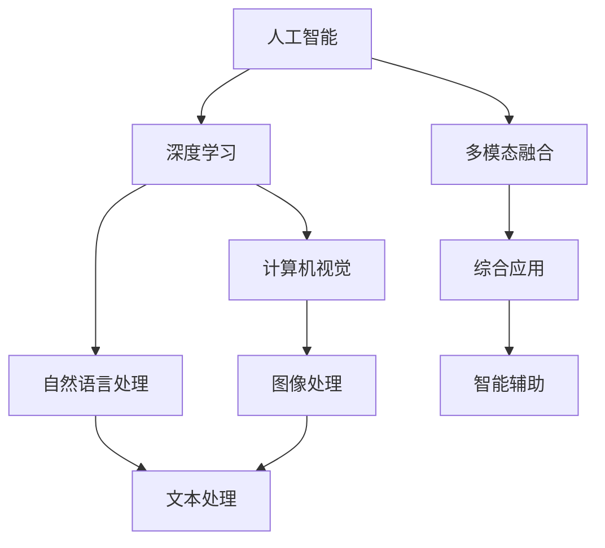

                 

# Andrej Karpathy：人工智能的未来发展趋势

## 1. 背景介绍

### 1.1 问题由来

Andrej Karpathy，一位在人工智能领域颇有建树的专家，曾在深度学习和计算机视觉方面取得显著成果。他对人工智能的未来发展趋势有着深刻的见解，认为未来的AI将朝着更加智能、可解释和普适化方向发展。他通过一系列的公开演讲、文章和技术分享，深入浅出地描绘了AI的未来蓝图，为业内人士提供了宝贵的参考。本文将基于他的观点，系统介绍人工智能的未来发展趋势及其应用前景。

### 1.2 问题核心关键点

Karpathy认为，未来AI的发展将围绕以下几个核心关键点展开：

1. **可解释性**：AI模型需要具备更高的可解释性，使得其决策过程透明，便于理解和调试。
2. **普适性**：AI技术应具备更强的普适性，能够应用于各行各业，提高生产效率和生活质量。
3. **智能辅助**：AI应更多地充当人类智能的辅助工具，而不是完全替代人类。
4. **多模态融合**：AI应具备多模态融合能力，能够处理图像、语音、文本等多种数据形式。
5. **道德伦理**：AI的开发和使用需遵循伦理道德规范，避免偏见和歧视。

### 1.3 问题研究意义

探讨AI的未来发展趋势，对于预测未来技术走向、制定政策导向、指导技术研发和产业应用具有重要意义。理解AI的潜力和局限，可以帮助我们更好地把握AI技术的发展脉络，为各行各业的智能化转型提供科学依据。

## 2. 核心概念与联系

### 2.1 核心概念概述

- **人工智能**：通过计算机模拟人类智能，实现问题解决、认知、学习等功能的技术。
- **深度学习**：一种基于神经网络的机器学习技术，通过多层次的非线性变换提取输入数据的特征。
- **计算机视觉**：AI在图像和视频处理方面的应用，如目标检测、图像分割等。
- **自然语言处理**：AI在文本处理方面的应用，如情感分析、机器翻译等。
- **多模态融合**：将图像、语音、文本等多种数据源结合起来，实现更全面、精准的模型输出。

这些概念构成了AI技术的主要框架，各个概念之间的联系紧密，共同推动AI技术的进步。

### 2.2 概念间的关系

以下是各个核心概念之间的联系，通过Mermaid流程图展示：



这个流程图展示了AI技术各组成部分之间的关系，从单一领域的技术发展到多模态融合的综合应用，再到智能辅助的人机协作，形成了一个完整的技术生态系统。

## 3. 核心算法原理 & 具体操作步骤

### 3.1 算法原理概述

Karpathy认为，AI的未来发展将更加依赖于深度学习和大数据。深度学习通过多层次的非线性变换，能够自动提取数据的特征，适用于复杂的模式识别和决策任务。大数据则提供了丰富的数据源，为模型训练提供了充足的训练样本，使得模型能够不断优化，提升性能。

在具体实现上，AI的各个领域会采用不同的算法和技术，如目标检测采用卷积神经网络（CNN），情感分析采用循环神经网络（RNN）或Transformer等。这些算法和技术相互配合，共同实现AI的各种应用。

### 3.2 算法步骤详解

AI的实现过程通常包括以下几个关键步骤：

1. **数据准备**：收集、清洗和标注训练数据，是模型训练的基础。
2. **模型设计**：选择合适的深度学习架构，设计合适的损失函数和优化器，进行模型训练。
3. **模型评估**：在验证集上进行评估，选择合适的超参数，防止过拟合。
4. **模型部署**：将训练好的模型部署到实际应用中，进行推理和预测。
5. **模型优化**：根据实际应用反馈，不断优化模型，提高性能。

### 3.3 算法优缺点

深度学习算法具有以下优点：

- **自适应能力强**：能够自动提取数据特征，适用于多种复杂任务。
- **性能提升显著**：在图像、语音、文本等领域的性能提升显著。
- **计算资源丰富**：得益于GPU、TPU等高性能设备的支持，计算效率提升明显。

但其也存在一些局限：

- **训练时间长**：数据量大、模型复杂时，训练时间较长。
- **过拟合风险高**：模型容易过拟合，泛化能力不足。
- **需要大量标注数据**：标注数据成本高，获取难度大。

### 3.4 算法应用领域

AI技术广泛应用于各个领域，如医疗、金融、教育、制造等。在医疗领域，AI用于疾病诊断、影像分析等；在金融领域，用于风险评估、智能投顾等；在教育领域，用于智能教学、学习分析等；在制造领域，用于生产优化、质量检测等。

## 4. 数学模型和公式 & 详细讲解 & 举例说明

### 4.1 数学模型构建

以目标检测为例，构建深度学习模型，步骤如下：

1. **模型选择**：选择适当的深度学习框架，如TensorFlow、PyTorch等。
2. **数据集准备**：准备训练数据集，包含图像和标注信息。
3. **模型设计**：设计卷积神经网络（CNN）结构，如ResNet、VGG等。
4. **损失函数**：选择适当的损失函数，如交叉熵损失、IoU损失等。
5. **优化器**：选择适当的优化器，如Adam、SGD等。
6. **训练和评估**：在训练集上进行模型训练，在验证集上进行模型评估。

### 4.2 公式推导过程

以目标检测的交叉熵损失函数为例，推导过程如下：

1. **目标函数定义**：

$$
L = \frac{1}{N}\sum_{i=1}^N L_i
$$

其中 $L_i$ 表示第 $i$ 个样本的损失函数。

2. **目标检测的损失函数**：

$$
L_i = -\sum_{j=1}^{n_c} (y_j \log p_j + (1-y_j) \log (1-p_j))
$$

其中 $n_c$ 表示类别数，$y_j$ 表示第 $j$ 个类别的真实标签，$p_j$ 表示模型对第 $j$ 个类别的预测概率。

3. **交叉熵损失函数的推导**：

$$
L_i = -\sum_{j=1}^{n_c} y_j \log \hat{y}_j
$$

其中 $\hat{y}_j$ 表示模型对第 $j$ 个类别的预测概率。

通过以上推导，可以得到目标检测任务中交叉熵损失函数的完整表达式。

### 4.3 案例分析与讲解

以ImageNet数据集为例，进行深度学习模型的训练和评估。

1. **数据准备**：将ImageNet数据集划分为训练集和验证集。
2. **模型选择**：选择ResNet模型，并进行特征提取。
3. **损失函数**：选择交叉熵损失函数，进行模型训练。
4. **优化器**：选择Adam优化器，进行模型优化。
5. **模型评估**：在验证集上进行模型评估，选择适当的超参数。

最终，通过不断的训练和评估，可以得到性能优异的模型。

## 5. 项目实践：代码实例和详细解释说明

### 5.1 开发环境搭建

搭建AI项目的开发环境需要以下步骤：

1. **安装Python**：从官网下载并安装Python。
2. **安装深度学习框架**：安装TensorFlow、PyTorch等深度学习框架。
3. **安装其他依赖库**：安装numpy、pandas、scikit-learn等常用库。
4. **配置环境变量**：设置深度学习框架的路径，确保能够正常调用。

### 5.2 源代码详细实现

以目标检测为例，展示代码实现：

```python
import tensorflow as tf
from tensorflow.keras import layers

# 构建ResNet模型
model = tf.keras.Sequential([
    layers.Conv2D(64, (3,3), activation='relu', input_shape=(224,224,3)),
    layers.MaxPooling2D((2,2)),
    layers.Conv2D(128, (3,3), activation='relu'),
    layers.MaxPooling2D((2,2)),
    layers.Conv2D(256, (3,3), activation='relu'),
    layers.MaxPooling2D((2,2)),
    layers.Conv2D(512, (3,3), activation='relu'),
    layers.MaxPooling2D((2,2)),
    layers.Flatten(),
    layers.Dense(1024, activation='relu'),
    layers.Dense(1000, activation='softmax')
])

# 编译模型
model.compile(optimizer='adam', loss='categorical_crossentropy', metrics=['accuracy'])

# 训练模型
model.fit(train_images, train_labels, epochs=10, validation_data=(val_images, val_labels))

# 评估模型
test_loss, test_acc = model.evaluate(test_images, test_labels)
print('Test accuracy:', test_acc)
```

### 5.3 代码解读与分析

- **模型构建**：使用TensorFlow框架构建ResNet模型，包含卷积层、池化层、全连接层等。
- **模型编译**：设置优化器和损失函数，进行模型编译。
- **模型训练**：使用训练数据进行模型训练，设置迭代轮数和验证集。
- **模型评估**：在测试集上进行模型评估，输出准确率。

## 6. 实际应用场景

### 6.1 智能驾驶

智能驾驶是AI的重要应用场景之一，涉及计算机视觉、深度学习和传感器融合等多个领域。AI通过分析摄像头、雷达等传感器数据，进行目标检测、路径规划和决策，实现自动驾驶。

### 6.2 医疗影像分析

AI在医疗影像分析领域有着广泛应用，通过深度学习模型对医学影像进行自动检测和分析，如病灶检测、病理分析等。AI技术提升了医疗诊断的准确性和效率。

### 6.3 金融风险管理

AI在金融风险管理领域也有重要应用，通过分析历史数据和市场动态，进行风险评估和预测，提升金融决策的精准度。

### 6.4 未来应用展望

未来AI将在更多领域得到应用，如教育、制造、能源等。AI技术将推动各行业的智能化转型，提高生产效率和生活质量。

## 7. 工具和资源推荐

### 7.1 学习资源推荐

- **深度学习课程**：Coursera上的《深度学习》课程，由Andrew Ng讲授。
- **计算机视觉教程**：斯坦福大学的CS231n课程，涵盖了计算机视觉领域的核心技术。
- **自然语言处理资源**：NLP领域的经典书籍《Speech and Language Processing》。
- **多模态融合资源**：多模态融合领域的综述论文《Review of Multi-modal Information Fusion Methods》。

### 7.2 开发工具推荐

- **深度学习框架**：TensorFlow、PyTorch等。
- **数据处理工具**：Pandas、NumPy等。
- **模型可视化工具**：TensorBoard、Weights & Biases等。

### 7.3 相关论文推荐

- **目标检测论文**：Faster R-CNN、YOLO等。
- **计算机视觉论文**：VGG、ResNet等。
- **自然语言处理论文**：BERT、GPT等。

## 8. 总结：未来发展趋势与挑战

### 8.1 研究成果总结

未来AI的发展将更加依赖于深度学习和大数据。深度学习通过多层次的非线性变换，能够自动提取数据特征，适用于多种复杂任务。大数据则提供了丰富的数据源，为模型训练提供了充足的训练样本，使得模型能够不断优化，提升性能。

### 8.2 未来发展趋势

未来AI将朝着以下几个方向发展：

1. **可解释性**：AI模型需要具备更高的可解释性，使得其决策过程透明，便于理解和调试。
2. **普适性**：AI技术应具备更强的普适性，能够应用于各行各业，提高生产效率和生活质量。
3. **智能辅助**：AI应更多地充当人类智能的辅助工具，而不是完全替代人类。
4. **多模态融合**：AI应具备多模态融合能力，能够处理图像、语音、文本等多种数据形式。
5. **道德伦理**：AI的开发和使用需遵循伦理道德规范，避免偏见和歧视。

### 8.3 面临的挑战

AI的发展面临以下挑战：

1. **数据获取难度大**：标注数据成本高，获取难度大。
2. **模型泛化能力不足**：模型容易过拟合，泛化能力不足。
3. **计算资源需求高**：深度学习模型计算资源需求高，训练时间长。
4. **伦理道德问题**：AI的开发和使用需遵循伦理道德规范，避免偏见和歧视。
5. **安全性和隐私保护**：AI模型可能存在安全漏洞和隐私问题。

### 8.4 研究展望

未来AI的研究方向包括：

1. **可解释性**：研究AI模型的可解释性，提高其决策透明性。
2. **普适性**：研究AI技术的普适性，使其能够应用于更多领域。
3. **智能辅助**：研究AI的智能辅助能力，提升其与人类协作的效率。
4. **多模态融合**：研究多模态融合技术，提升AI处理多种数据形式的能力。
5. **伦理道德**：研究AI的伦理道德问题，确保其开发和使用符合社会规范。

## 9. 附录：常见问题与解答

**Q1：AI技术在医疗领域有哪些应用？**

A: AI技术在医疗领域的应用包括疾病诊断、影像分析、药物研发等。AI通过分析医学影像和病历数据，自动检测病灶、分析病理，提高诊断的准确性和效率。同时，AI技术还被用于药物研发，加速新药的发现和筛选。

**Q2：AI技术的开发流程有哪些关键步骤？**

A: AI技术的开发流程包括以下关键步骤：

1. **数据准备**：收集、清洗和标注训练数据。
2. **模型设计**：选择合适的深度学习架构，设计合适的损失函数和优化器。
3. **模型训练**：在训练集上进行模型训练，防止过拟合。
4. **模型评估**：在验证集上进行模型评估，选择适当的超参数。
5. **模型优化**：根据实际应用反馈，不断优化模型，提高性能。

**Q3：AI技术在智能驾驶中的应用有哪些？**

A: AI技术在智能驾驶中的应用包括目标检测、路径规划、决策制定等。AI通过分析摄像头、雷达等传感器数据，实现自动驾驶。在目标检测方面，AI可以识别道路上的车辆、行人、障碍物等，为驾驶提供实时反馈。在路径规划方面，AI可以分析道路条件，生成最优路径。在决策制定方面，AI可以综合考虑多方面因素，做出最优决策。

**Q4：AI技术的开发需要哪些关键资源？**

A: AI技术的开发需要以下关键资源：

1. **数据**：标注数据成本高，获取难度大。
2. **计算资源**：深度学习模型计算资源需求高，需要高性能设备。
3. **人才**：AI技术的开发需要高水平的人才，涉及深度学习、计算机视觉等多个领域。
4. **工具**：需要深度学习框架、数据处理工具、模型可视化工具等。

**Q5：AI技术的未来发展方向有哪些？**

A: AI技术的未来发展方向包括：

1. **可解释性**：AI模型需要具备更高的可解释性，使得其决策过程透明，便于理解和调试。
2. **普适性**：AI技术应具备更强的普适性，能够应用于各行各业，提高生产效率和生活质量。
3. **智能辅助**：AI应更多地充当人类智能的辅助工具，而不是完全替代人类。
4. **多模态融合**：AI应具备多模态融合能力，能够处理图像、语音、文本等多种数据形式。
5. **伦理道德**：AI的开发和使用需遵循伦理道德规范，避免偏见和歧视。

总之，AI技术的未来发展前景广阔，有望在更多领域得到应用，提升生产效率和生活质量，带来深刻的变革。

