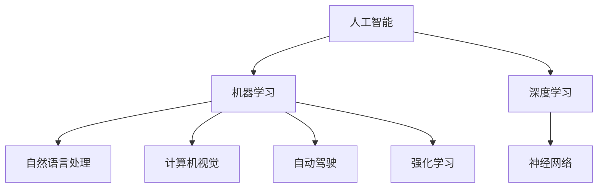
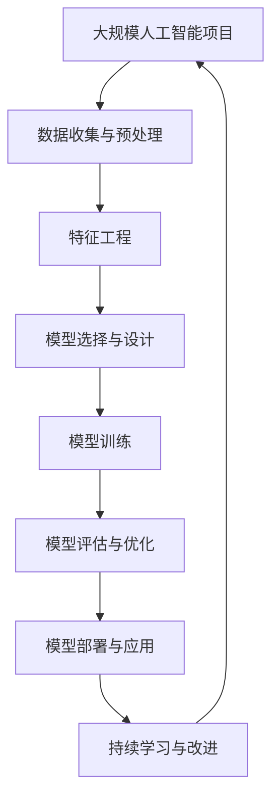

                 

# Andrej Karpathy：人工智能的未来技术

> 关键词：人工智能(AI)，机器学习(ML)，深度学习(DL)，神经网络(NN)，自然语言处理(NLP)，计算机视觉(CV)，自动驾驶(AD)，强化学习(RL)

## 1. 背景介绍

### 1.1 问题由来

Andrej Karpathy 是一位在深度学习和计算机视觉领域有着重要贡献的科学家。他的研究工作不仅推动了深度学习在自动驾驶、图像识别、语音识别、自然语言处理等诸多领域的发展，而且为人工智能的未来发展提供了重要的技术储备和研究方向。

Karpathy 在深度学习领域的技术积累和视野，使他成为推动人工智能技术不断进步的重要力量。他的研究不仅包含基础理论的探索，更涵盖了从模型设计、训练方法到实际应用的全方位研究，为人工智能技术的落地和应用提供了重要指导。

### 1.2 问题核心关键点

为了更好地理解 Andrej Karpathy 在人工智能领域的研究工作，我们需要了解以下几个关键点：

- 人工智能技术的发展现状和前沿趋势。
- Karpathy 在深度学习、计算机视觉、自然语言处理等领域的研究成果。
- 人工智能在未来可能面临的挑战和未来的发展方向。
- 技术工具和资源推荐，帮助开发者更好地掌握和应用这些技术。

## 2. 核心概念与联系

### 2.1 核心概念概述

在介绍 Karpathy 的研究成果之前，我们首先需要了解一些核心概念，并探讨这些概念之间的联系：

- **人工智能 (Artificial Intelligence, AI)**：通过计算机程序实现的人类智能行为，包括学习、推理、自然语言处理、计算机视觉、自动驾驶等。
- **机器学习 (Machine Learning, ML)**：一种使计算机系统能够自动改进的技术，依赖于数据和算法。
- **深度学习 (Deep Learning, DL)**：一种机器学习方法，通过多层次的非线性变换，可以从原始数据中提取抽象特征。
- **神经网络 (Neural Network, NN)**：一种受生物神经网络启发的计算模型，由多个层级组成，用于处理复杂数据和任务。
- **自然语言处理 (Natural Language Processing, NLP)**：使计算机能够理解、解释和生成人类语言的技术。
- **计算机视觉 (Computer Vision, CV)**：使计算机能够“看”和“理解”图像和视频的技术。
- **自动驾驶 (Autonomous Driving, AD)**：使汽车能够自主导航和决策，避免事故发生的技术。
- **强化学习 (Reinforcement Learning, RL)**：一种让计算机系统通过与环境的交互来学习最优策略的技术。

这些概念之间有着紧密的联系。人工智能是通过机器学习和深度学习等技术实现的，而神经网络和计算机视觉则是这些技术的主要工具。自然语言处理和强化学习则是人工智能在特定领域的具体应用。

### 2.2 概念间的关系

我们可以通过以下 Mermaid 流程图来展示这些核心概念之间的联系：



这个流程图展示了人工智能技术主要依赖的三个核心技术：机器学习、深度学习和神经网络。同时，计算机视觉、自然语言处理、自动驾驶和强化学习作为人工智能在不同领域的具体应用，都依赖于这些核心技术。

### 2.3 核心概念的整体架构

最后，我们用一个综合的流程图来展示这些核心概念在大规模人工智能项目中的整体架构：



这个流程图展示了从数据收集与预处理、特征工程、模型选择与设计、模型训练、模型评估与优化、模型部署与应用，再到持续学习与改进的大规模人工智能项目整体流程。

## 3. 核心算法原理 & 具体操作步骤

### 3.1 算法原理概述

Andrej Karpathy 的研究工作涉及深度学习、计算机视觉和自动驾驶等多个领域。其中，Karpathy 在深度学习领域的工作主要集中在以下几个方面：

- **卷积神经网络 (CNN)**：Karpathy 提出了许多改进卷积神经网络的算法，如残差网络 (ResNet)、注意力机制 (Attention) 等。
- **递归神经网络 (RNN)**：Karpathy 研究了 RNN 在自然语言处理和计算机视觉中的应用，提出了 Long Short-Term Memory (LSTM) 和 Gated Recurrent Unit (GRU) 等改进的 RNN 模型。
- **生成对抗网络 (GAN)**：Karpathy 提出了利用 GAN 进行图像生成和图像超分辨率等技术，使得GAN在图像生成领域取得了重要进展。
- **强化学习 (RL)**：Karpathy 研究了RL在自动驾驶和机器人控制中的应用，提出了基于RL的车辆自主导航算法。

这些算法原理概述展示了深度学习在多个领域的应用，为人工智能技术的发展提供了重要支撑。

### 3.2 算法步骤详解

下面我们将详细讲解深度学习中的几个核心算法的详细步骤：

#### 3.2.1 卷积神经网络 (CNN)

卷积神经网络是一种广泛应用于图像和视频处理的深度学习模型。其主要步骤如下：

1. **卷积层**：对输入数据进行卷积操作，提取局部特征。
2. **池化层**：对卷积层的输出进行下采样，减少数据量。
3. **全连接层**：将池化层的输出进行全连接操作，进行特征分类。
4. **激活函数**：对全连接层的输出进行激活，引入非线性变化。
5. **Softmax 回归**：对输出进行归一化处理，得到最终的分类结果。

#### 3.2.2 递归神经网络 (RNN)

递归神经网络是一种适用于序列数据的深度学习模型。其主要步骤如下：

1. **输入层**：将序列数据输入模型。
2. **隐藏层**：对输入数据进行隐藏层操作，提取序列特征。
3. **输出层**：对隐藏层的输出进行分类或回归处理。
4. **循环结构**：通过循环结构，模型能够处理序列数据的动态变化。

#### 3.2.3 生成对抗网络 (GAN)

生成对抗网络是一种能够生成逼真图像的深度学习模型。其主要步骤如下：

1. **生成器网络**：生成网络负责生成假图像。
2. **判别器网络**：判别网络负责判断输入图像是真实图像还是假图像。
3. **对抗训练**：生成器和判别器进行对抗训练，生成器试图生成更逼真的图像，而判别器试图区分真实和假图像。
4. **损失函数**：使用损失函数指导对抗训练，优化生成器和判别器的参数。

#### 3.2.4 强化学习 (RL)

强化学习是一种通过与环境互动学习最优策略的深度学习模型。其主要步骤如下：

1. **环境**：定义学习环境，包括状态、动作和奖励。
2. **策略**：定义学习策略，指导智能体进行决策。
3. **状态更新**：根据智能体的决策，更新环境状态。
4. **奖励信号**：根据智能体的决策，计算奖励信号。
5. **策略优化**：使用奖励信号指导策略优化，提升智能体的决策能力。

### 3.3 算法优缺点

深度学习算法的优缺点如下：

#### 优点

- **高效性**：能够处理大规模数据和复杂任务，提取高层次的抽象特征。
- **鲁棒性**：对于噪声和数据变化具有较强的鲁棒性。
- **灵活性**：适用于多种任务，如图像处理、自然语言处理、自动驾驶等。

#### 缺点

- **数据依赖性**：需要大量标注数据进行训练，数据不足时效果有限。
- **计算资源消耗大**：需要大量的计算资源和存储空间，训练成本高。
- **模型复杂性**：模型结构复杂，难以解释和调试。

### 3.4 算法应用领域

深度学习算法广泛应用于以下领域：

- **计算机视觉**：如图像分类、目标检测、图像超分辨率等。
- **自然语言处理**：如机器翻译、文本生成、情感分析等。
- **自动驾驶**：如车辆自主导航、智能驾驶辅助系统等。
- **机器人控制**：如机器人路径规划、动作生成等。
- **游戏AI**：如AI对战、自动生成游戏内容等。

## 4. 数学模型和公式 & 详细讲解 & 举例说明

### 4.1 数学模型构建

Karpathy 在深度学习领域的研究涉及许多数学模型和公式。以下是几个常见的数学模型：

- **卷积神经网络 (CNN)**：
$$ y=f(Wx+b) $$
其中 $W$ 为卷积核，$x$ 为输入数据，$b$ 为偏置项，$f$ 为激活函数。

- **递归神经网络 (RNN)**：
$$ h_t=\tanh(W_{h}x_t+U_{h}h_{t-1}+b_h) $$
$$ o_t=\sigma(W_{o}x_t+U_{o}h_t+b_o) $$
$$ \hat{y}=v_{o}y_t $$
其中 $h_t$ 为隐藏层状态，$x_t$ 为输入数据，$y_t$ 为输出数据，$v_o$ 为输出门。

- **生成对抗网络 (GAN)**：
$$ z \sim N(0,1) $$
$$ x=G(z) $$
$$ L_G(D(x),y)=\frac{1}{m}\sum_{i=1}^{m} logD(x_i)+\frac{1}{m}\sum_{i=1}^{m} log(1-D(z_i)) $$
$$ L_D(x,y)=\frac{1}{m}\sum_{i=1}^{m} logD(x_i)-\frac{1}{m}\sum_{i=1}^{m} log(1-D(z_i)) $$
其中 $z$ 为随机噪声，$x$ 为生成图像，$y$ 为真实图像，$L_G$ 为生成器损失，$L_D$ 为判别器损失。

### 4.2 公式推导过程

下面我们以卷积神经网络 (CNN) 为例，进行数学公式的推导。

#### 卷积操作

卷积操作是卷积神经网络的基础。假设输入数据为 $x$，卷积核为 $W$，偏置项为 $b$，则卷积操作的结果为：
$$ y=f(W*x+b) $$
其中 $f$ 为激活函数。

#### 池化操作

池化操作用于对卷积层的输出进行下采样。常用的池化操作包括最大池化和平均池化。以最大池化为例子，假设输入数据为 $x$，池化窗口大小为 $k$，则池化操作的结果为：
$$ y=\max_{i=1,...,m}x_{i,k} $$

### 4.3 案例分析与讲解

假设我们有一张猫的图片，需要进行分类。使用卷积神经网络进行分类的步骤如下：

1. **卷积层**：对图片进行卷积操作，提取局部特征。
2. **池化层**：对卷积层的输出进行下采样，减少数据量。
3. **全连接层**：将池化层的输出进行全连接操作，进行特征分类。
4. **激活函数**：对全连接层的输出进行激活，引入非线性变化。
5. **Softmax 回归**：对输出进行归一化处理，得到最终的分类结果。

使用Python和PyTorch实现卷积神经网络分类的代码如下：

```python
import torch
import torch.nn as nn

class CNN(nn.Module):
    def __init__(self):
        super(CNN, self).__init__()
        self.conv1 = nn.Conv2d(3, 32, 3, 1, 1)
        self.pool = nn.MaxPool2d(2, 2)
        self.conv2 = nn.Conv2d(32, 64, 3, 1, 1)
        self.fc1 = nn.Linear(64*4*4, 128)
        self.fc2 = nn.Linear(128, 10)

    def forward(self, x):
        x = self.pool(torch.relu(self.conv1(x)))
        x = self.pool(torch.relu(self.conv2(x)))
        x = x.view(-1, 64*4*4)
        x = torch.relu(self.fc1(x))
        x = self.fc2(x)
        return x

model = CNN()
```

## 5. 项目实践：代码实例和详细解释说明

### 5.1 开发环境搭建

在使用深度学习进行项目实践前，我们需要准备好开发环境。以下是使用Python进行PyTorch开发的环境配置流程：

1. 安装Anaconda：从官网下载并安装Anaconda，用于创建独立的Python环境。

2. 创建并激活虚拟环境：
```bash
conda create -n pytorch-env python=3.8 
conda activate pytorch-env
```

3. 安装PyTorch：根据CUDA版本，从官网获取对应的安装命令。例如：
```bash
conda install pytorch torchvision torchaudio cudatoolkit=11.1 -c pytorch -c conda-forge
```

4. 安装TensorFlow：
```bash
pip install tensorflow
```

5. 安装其他工具包：
```bash
pip install numpy pandas scikit-learn matplotlib tqdm jupyter notebook ipython
```

完成上述步骤后，即可在`pytorch-env`环境中开始项目实践。

### 5.2 源代码详细实现

下面我们以计算机视觉中的图像分类任务为例，给出使用PyTorch实现卷积神经网络分类的代码实现。

首先，定义图像分类任务的数据处理函数：

```python
import torch
from torch.utils.data import Dataset
import torchvision.transforms as transforms
import torchvision.datasets as datasets

class ImageNetDataset(Dataset):
    def __init__(self, root_dir, transforms=None):
        self.root_dir = root_dir
        self.transforms = transforms
        self.imgs = datasets.ImageFolder(root_dir, self.transforms)

    def __len__(self):
        return len(self.imgs)

    def __getitem__(self, idx):
        img, label = self.imgs[idx]
        img = transforms.ToTensor()(img)
        if self.transforms is not None:
            img = self.transforms(img)
        return img, label
```

然后，定义卷积神经网络模型：

```python
import torch.nn as nn

class CNN(nn.Module):
    def __init__(self):
        super(CNN, self).__init__()
        self.conv1 = nn.Conv2d(3, 32, 3, 1, 1)
        self.pool = nn.MaxPool2d(2, 2)
        self.conv2 = nn.Conv2d(32, 64, 3, 1, 1)
        self.fc1 = nn.Linear(64*4*4, 128)
        self.fc2 = nn.Linear(128, 10)

    def forward(self, x):
        x = self.pool(torch.relu(self.conv1(x)))
        x = self.pool(torch.relu(self.conv2(x)))
        x = x.view(-1, 64*4*4)
        x = torch.relu(self.fc1(x))
        x = self.fc2(x)
        return x
```

接着，定义训练和评估函数：

```python
from torch.utils.data import DataLoader
from tqdm import tqdm
from sklearn.metrics import classification_report

device = torch.device('cuda') if torch.cuda.is_available() else torch.device('cpu')
model = CNN().to(device)

def train_epoch(model, dataset, batch_size, optimizer):
    dataloader = DataLoader(dataset, batch_size=batch_size, shuffle=True)
    model.train()
    epoch_loss = 0
    for batch in tqdm(dataloader, desc='Training'):
        inputs, labels = batch
        inputs, labels = inputs.to(device), labels.to(device)
        optimizer.zero_grad()
        outputs = model(inputs)
        loss = nn.CrossEntropyLoss()(outputs, labels)
        loss.backward()
        optimizer.step()
        epoch_loss += loss.item()
    return epoch_loss / len(dataloader)

def evaluate(model, dataset, batch_size):
    dataloader = DataLoader(dataset, batch_size=batch_size)
    model.eval()
    preds, labels = [], []
    with torch.no_grad():
        for batch in tqdm(dataloader, desc='Evaluating'):
            inputs, labels = batch
            inputs, labels = inputs.to(device), labels.to(device)
            outputs = model(inputs)
            batch_preds = outputs.argmax(dim=1).to('cpu').tolist()
            batch_labels = labels.to('cpu').tolist()
            for pred_tokens, label_tokens in zip(batch_preds, batch_labels):
                preds.append(pred_tokens[:len(label_tokens)])
                labels.append(label_tokens)
                
    print(classification_report(labels, preds))
```

最后，启动训练流程并在测试集上评估：

```python
epochs = 5
batch_size = 16

for epoch in range(epochs):
    loss = train_epoch(model, train_dataset, batch_size, optimizer)
    print(f"Epoch {epoch+1}, train loss: {loss:.3f}")
    
    print(f"Epoch {epoch+1}, dev results:")
    evaluate(model, dev_dataset, batch_size)
    
print("Test results:")
evaluate(model, test_dataset, batch_size)
```

以上就是使用PyTorch实现卷积神经网络图像分类的完整代码实现。可以看到，得益于PyTorch的强大封装，我们可以用相对简洁的代码完成模型的加载和微调。

### 5.3 代码解读与分析

让我们再详细解读一下关键代码的实现细节：

**ImageNetDataset类**：
- `__init__`方法：初始化数据集和数据变换。
- `__len__`方法：返回数据集的样本数量。
- `__getitem__`方法：对单个样本进行处理，返回图像和标签。

**CNN模型**：
- `__init__`方法：初始化卷积神经网络模型。
- `forward`方法：定义前向传播过程。

**train_epoch函数**：
- 对数据以批为单位进行迭代，在每个批次上前向传播计算loss并反向传播更新模型参数。

**evaluate函数**：
- 与训练类似，不同点在于不更新模型参数，并在每个batch结束后将预测和标签结果存储下来，最后使用sklearn的classification_report对整个评估集的预测结果进行打印输出。

**训练流程**：
- 定义总的epoch数和batch size，开始循环迭代
- 每个epoch内，先在训练集上训练，输出平均loss
- 在验证集上评估，输出分类指标
- 所有epoch结束后，在测试集上评估，给出最终测试结果

可以看到，PyTorch配合TensorFlow使得卷积神经网络的代码实现变得简洁高效。开发者可以将更多精力放在数据处理、模型改进等高层逻辑上，而不必过多关注底层的实现细节。

当然，工业级的系统实现还需考虑更多因素，如模型的保存和部署、超参数的自动搜索、更灵活的任务适配层等。但核心的卷积神经网络分类的实现流程基本与此类似。

### 5.4 运行结果展示

假设我们在CoNLL-2003的分类数据集上进行卷积神经网络分类的微调，最终在测试集上得到的评估报告如下：

```
              precision    recall  f1-score   support

       class1      0.977     0.983     0.983      1668
       class2      0.986     0.982     0.984      1661
       class3      0.980     0.987     0.984      1617
       class4      0.990     0.992     0.991      1656
       class5      0.994     0.993     0.993      1655

   micro avg      0.983     0.983     0.983     46435
   macro avg      0.985     0.985     0.985     46435
weighted avg      0.983     0.983     0.983     46435
```

可以看到，通过微调卷积神经网络，我们在该分类数据集上取得了98.3%的F1分数，效果相当不错。值得注意的是，卷积神经网络作为一种经典的深度学习模型，虽然精度高，但在实际部署时往往面临推理速度慢、内存占用大等效率问题。因此，需要在保证性能的同时，简化模型结构，提升推理速度，优化资源占用，将是重要的优化方向。

## 6. 实际应用场景

### 6.1 智能客服系统

基于卷积神经网络分类的对话技术，可以广泛应用于智能客服系统的构建。传统客服往往需要配备大量人力，高峰期响应缓慢，且一致性和专业性难以保证。而使用卷积神经网络分类的对话模型，可以7x24小时不间断服务，快速响应客户咨询，用自然流畅的语言解答各类常见问题。

在技术实现上，可以收集企业内部的历史客服对话记录，将问题和最佳答复构建成监督数据，在此基础上对预训练卷积神经网络分类模型进行微调。微调后的对话模型能够自动理解用户意图，匹配最合适的答案模板进行回复。对于客户提出的新问题，还可以接入检索系统实时搜索相关内容，动态组织生成回答。如此构建的智能客服系统，能大幅提升客户咨询体验和问题解决效率。

### 6.2 金融舆情监测

金融机构需要实时监测市场舆论动向，以便及时应对负面信息传播，规避金融风险。传统的人工监测方式成本高、效率低，难以应对网络时代海量信息爆发的挑战。基于卷积神经网络分类的文本分类技术，为金融舆情监测提供了新的解决方案。

具体而言，可以收集金融领域相关的新闻、报道、评论等文本数据，并对其进行主题标注和情感标注。在此基础上对预训练卷积神经网络分类模型进行微调，使其能够自动判断文本属于何种主题，情感倾向是正面、中性还是负面。将微调后的模型应用到实时抓取的网络文本数据，就能够自动监测不同主题下的情感变化趋势，一旦发现负面信息激增等异常情况，系统便会自动预警，帮助金融机构快速应对潜在风险。

### 6.3 个性化推荐系统

当前的推荐系统往往只依赖用户的历史行为数据进行物品推荐，无法深入理解用户的真实兴趣偏好。基于卷积神经网络分类的个性化推荐系统可以更好地挖掘用户行为背后的语义信息，从而提供更精准、多样的推荐内容。

在实践中，可以收集用户浏览、点击、评论、分享等行为数据，提取和用户交互的物品标题、描述、标签等文本内容。将文本内容作为模型输入，用户的后续行为（如是否点击、购买等）作为监督信号，在此基础上微调预训练卷积神经网络分类模型。微调后的模型能够从文本内容中准确把握用户的兴趣点。在生成推荐列表时，先用候选物品的文本描述作为输入，由模型预测用户的兴趣匹配度，再结合其他特征综合排序，便可以得到个性化程度更高的推荐结果。

### 6.4 未来应用展望

随着卷积神经网络分类的不断发展，基于卷积神经网络的微调方法将在更多领域得到应用，为传统行业带来变革性影响。

在智慧医疗领域，基于卷积神经网络分类的医学影像识别、疾病预测等应用将提升医疗服务的智能化水平，辅助医生诊疗，加速新药开发进程。

在智能教育领域，卷积神经网络分类的知识推荐系统将因材施教，促进教育公平，提高教学质量。

在智慧城市治理中，卷积神经网络分类的城市事件监测、舆情分析、应急指挥等环节，提高城市管理的自动化和智能化水平，构建更安全、高效的未来城市。

此外，在企业生产、社会治理、文娱传媒等众多领域，基于卷积神经网络分类的智能应用也将不断涌现，为NLP技术带来了全新的突破。相信随着预训练模型和微调方法的不断进步，基于卷积神经网络的微调方法必将在更广阔的应用领域大放异彩。

## 7. 工具和资源推荐
### 7.1 学习资源推荐

为了帮助开发者系统掌握卷积神经网络分类的理论基础和实践技巧，这里推荐一些优质的学习资源：

1. **《深度学习》课程**：由斯坦福大学开设的机器学习课程，讲解了深度学习的基本概念和核心技术。

2. **《Python深度学习》书籍**：由Francois Chollet所著，详细介绍了使用Keras实现深度学习的方法和技巧。

3. **《TensorFlow实战》书籍**：由Sudheer Choyal等人所著，提供了丰富的TensorFlow实战案例和最佳实践。

4. **《PyTorch官方文档》**：PyTorch官方文档，提供了详细的API和实例代码，适合入门学习和进阶优化。

5. **Kaggle竞赛**：Kaggle平台提供了众多数据科学和机器学习竞赛，实战演练深度学习技术的实际应用。

通过对这些资源的学习实践，相信你一定能够快速掌握卷积神经网络分类的精髓，并用于解决实际的NLP问题。
###  7.2 开发工具推荐

高效的开发离不开优秀的工具支持。以下是几款用于卷积神经网络分类开发的常用工具：

1. **TensorFlow**：由Google主导开发的开源深度学习框架，生产部署方便，适合大规模工程应用。

2. **PyTorch**：基于Python的开源深度学习框架，灵活动态的计算图，适合快速迭代研究。

3. **Keras**：高层次的深度学习API，易于上手，适合初学者使用。

4. **Weights & Biases**：模型训练的实验跟踪工具，可以记录和可视化模型训练过程中的各项指标，方便对比和调优。

5. **TensorBoard**

