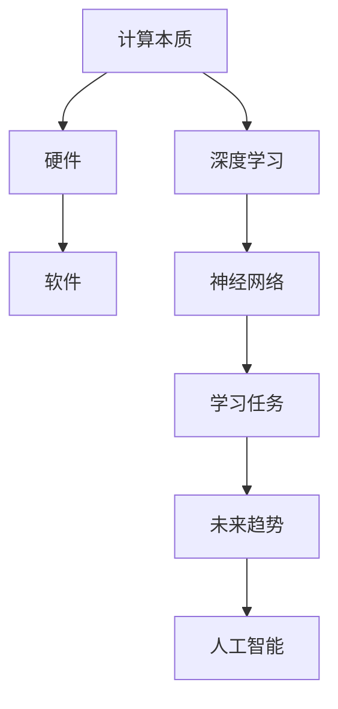
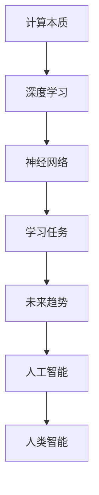

                 

# Andrej Karpathy：计算的本质正在变化

> 关键词：计算本质,深度学习,神经网络,未来趋势,人工智能,人类智能

## 1. 背景介绍

安德烈·卡帕希（Andrej Karpathy），斯坦福大学计算机系副教授，深度学习领域知名学者，因对计算机视觉和深度学习的贡献被广泛认可。在深度学习领域，卡帕希发表了多篇具有里程碑意义的研究论文，并通过Twitter、YouTube等平台影响着业界和学术界的广泛关注。本文将以卡帕希的思想为基础，探讨计算的本质正在发生哪些变化，这些变化将如何影响未来的人工智能技术发展。

## 2. 核心概念与联系

### 2.1 核心概念概述

在深入探讨计算的本质变化之前，我们需要理解几个关键概念：

- **计算本质**：计算的本质涉及计算机如何处理信息、存储数据、执行计算和产生结果的过程。计算本质包含硬件、软件和算法三个层面。
- **深度学习**：深度学习是机器学习的一个分支，通过构建多层神经网络，从数据中学习抽象特征，以实现对复杂问题的理解和预测。
- **神经网络**：神经网络是深度学习的核心组件，模拟人脑神经元的工作机制，通过节点间的连接权重进行信息传递和计算。
- **未来趋势**：未来趋势是指计算、人工智能等技术的发展方向和前景。
- **人工智能**：人工智能是指计算机系统模拟人类智能的能力，涵盖感知、学习、推理、决策等多个方面。

这些概念之间的联系可以通过以下Mermaid流程图来展示：



这个流程图展示了计算本质和人工智能的关系，以及深度学习和神经网络在其中扮演的角色。

### 2.2 概念间的关系

在深入分析这些概念之间的关系时，我们可以从以下几个方面进行考虑：

- 硬件和软件是计算的基本要素，它们共同构成计算的基础设施。
- 深度学习和神经网络是实现特定计算任务的方法和模型，它们依赖于硬件和软件的基础设施。
- 学习任务是深度学习和神经网络的目标，它们通过特定的数据集和任务进行训练。
- 未来趋势是计算和人工智能发展的方向和前景，它受到当前技术和理论的限制。
- 人工智能是计算技术的高级应用，它通过学习和推理实现类似于人类的智能行为。

这些概念之间的逻辑关系可以通过以下Mermaid流程图来展示：



这个流程图展示了从计算本质到未来趋势的演变过程，以及人工智能在这一过程中扮演的角色。

## 3. 核心算法原理 & 具体操作步骤

### 3.1 算法原理概述

安德烈·卡帕希在其工作中强调了计算本质的变化，特别是神经网络在深度学习中的重要性。神经网络通过大量的参数和复杂的非线性关系，可以从原始数据中提取出抽象的特征表示，从而实现对复杂任务的预测和推理。这种特征表示的抽象能力使得神经网络在图像识别、语音识别、自然语言处理等任务上取得了显著的进展。

### 3.2 算法步骤详解

神经网络的训练过程主要包括以下几个步骤：

1. **数据准备**：收集和处理训练数据，确保数据的多样性和代表性。
2. **模型构建**：设计并搭建神经网络模型，选择合适的层数和节点数量。
3. **损失函数定义**：定义损失函数，衡量模型预测结果与实际标签之间的差距。
4. **反向传播**：通过反向传播算法，计算损失函数对每个节点权重的梯度，更新权重以最小化损失函数。
5. **参数更新**：使用优化算法（如随机梯度下降）更新模型参数，以进一步降低损失函数。

### 3.3 算法优缺点

神经网络具有以下优点：

- **高表现力**：神经网络可以通过多层结构学习到复杂的特征表示，适用于各种复杂任务。
- **端到端训练**：神经网络可以一次性训练所有参数，避免了特征工程等繁琐的预处理步骤。
- **适应性强**：神经网络可以适应不同的任务和数据集，具有较强的泛化能力。

同时，神经网络也存在以下缺点：

- **计算量大**：神经网络需要大量的计算资源和时间进行训练，特别是在大规模数据集上。
- **可解释性差**：神经网络的内部机制复杂，难以解释其决策过程。
- **过拟合风险**：神经网络在处理噪声数据时容易过拟合，导致模型泛化性能下降。

### 3.4 算法应用领域

神经网络已经在图像识别、语音识别、自然语言处理、机器翻译、游戏AI等多个领域取得了显著的进展。以下是几个典型应用领域的详细解释：

- **计算机视觉**：神经网络通过卷积神经网络（CNN）结构，可以从图像中提取出纹理、形状、边缘等特征，用于图像分类、目标检测、图像分割等任务。
- **语音识别**：通过循环神经网络（RNN）和变种结构（如LSTM、GRU），神经网络可以从语音信号中提取音频特征，用于语音识别和语音合成。
- **自然语言处理**：通过Transformer等结构，神经网络可以从文本中提取语义信息，用于文本分类、情感分析、机器翻译等任务。
- **游戏AI**：神经网络通过强化学习算法，可以学习到复杂的游戏策略和决策，用于自动驾驶、机器人控制等任务。

## 4. 数学模型和公式 & 详细讲解

### 4.1 数学模型构建

神经网络的数学模型可以表示为：

$$
\hat{y} = f(\boldsymbol{W} \boldsymbol{x} + \boldsymbol{b})
$$

其中，$f$ 为激活函数，$\boldsymbol{W}$ 为权重矩阵，$\boldsymbol{x}$ 为输入向量，$\boldsymbol{b}$ 为偏置向量，$\hat{y}$ 为输出向量。

### 4.2 公式推导过程

以神经网络的反向传播算法为例，其推导过程如下：

1. **前向传播**：将输入数据 $\boldsymbol{x}$ 经过多层神经网络计算，得到输出 $\hat{y}$。
2. **损失函数计算**：计算预测输出 $\hat{y}$ 与真实标签 $y$ 之间的损失函数 $L$。
3. **梯度计算**：通过反向传播算法计算损失函数对每个权重参数的梯度 $\frac{\partial L}{\partial \boldsymbol{W}}$。
4. **参数更新**：使用梯度下降等优化算法更新权重参数，最小化损失函数。

### 4.3 案例分析与讲解

以图像分类任务为例，神经网络通过多层卷积和池化操作提取图像特征，然后通过全连接层进行分类预测。反向传播算法通过计算损失函数对每个卷积核和全连接层权重的梯度，更新权重参数，从而实现对新样本的分类预测。

## 5. 项目实践：代码实例和详细解释说明

### 5.1 开发环境搭建

以下是使用Python和PyTorch进行神经网络训练的开发环境配置流程：

1. 安装Anaconda：从官网下载并安装Anaconda，用于创建独立的Python环境。
2. 创建并激活虚拟环境：
```bash
conda create -n pytorch-env python=3.8 
conda activate pytorch-env
```

3. 安装PyTorch：根据CUDA版本，从官网获取对应的安装命令。例如：
```bash
conda install pytorch torchvision torchaudio cudatoolkit=11.1 -c pytorch -c conda-forge
```

4. 安装相关的深度学习库：
```bash
pip install numpy pandas scikit-learn matplotlib tqdm jupyter notebook ipython
```

5. 安装TensorBoard：用于可视化神经网络训练过程。
```bash
pip install tensorboard
```

6. 安装PyTorch官方提供的可视化工具：
```bash
pip install torchvision tensorboard
```

完成上述步骤后，即可在`pytorch-env`环境中开始神经网络训练。

### 5.2 源代码详细实现

以下是使用PyTorch进行卷积神经网络（CNN）图像分类任务训练的代码实现：

```python
import torch
import torch.nn as nn
import torch.optim as optim
import torchvision.transforms as transforms
import torchvision.datasets as datasets
import torchvision.models as models

# 定义数据预处理
transform_train = transforms.Compose([
    transforms.RandomCrop(32, padding=4),
    transforms.RandomHorizontalFlip(),
    transforms.ToTensor(),
    transforms.Normalize([0.485, 0.456, 0.406], [0.229, 0.224, 0.225])
])

transform_test = transforms.Compose([
    transforms.ToTensor(),
    transforms.Normalize([0.485, 0.456, 0.406], [0.229, 0.224, 0.225])
])

# 加载CIFAR-10数据集
train_dataset = datasets.CIFAR10(root='./data', train=True, download=True, transform=transform_train)
test_dataset = datasets.CIFAR10(root='./data', train=False, download=True, transform=transform_test)

# 定义神经网络模型
model = models.resnet18(pretrained=False)

# 定义损失函数和优化器
criterion = nn.CrossEntropyLoss()
optimizer = optim.SGD(model.parameters(), lr=0.01, momentum=0.9)

# 训练神经网络
for epoch in range(10):
    model.train()
    for data, target in train_loader:
        data, target = data.to(device), target.to(device)
        optimizer.zero_grad()
        output = model(data)
        loss = criterion(output, target)
        loss.backward()
        optimizer.step()
```

### 5.3 代码解读与分析

在上述代码中，我们使用了CIFAR-10数据集，并定义了一个ResNet-18神经网络模型进行图像分类任务。通过定义数据预处理、加载数据集、定义模型、损失函数、优化器，最后进行模型训练和评估，完成了一个基本的神经网络训练流程。

## 6. 实际应用场景

### 6.1 智能驾驶

神经网络在游戏AI领域取得了巨大成功，通过强化学习算法学习到复杂的游戏策略。在智能驾驶领域，神经网络也可以通过深度学习和强化学习算法，学习到车辆的驾驶策略，实现自动驾驶功能。智能驾驶系统可以实时处理传感器数据，对路况进行分析和预测，从而做出最优的驾驶决策。

### 6.2 医疗影像诊断

神经网络在医疗影像诊断领域也有广泛应用。通过深度学习和卷积神经网络，神经网络可以从医学影像中提取特征，用于疾病诊断和图像分割。例如，卷积神经网络可以通过分析医学影像，识别出肿瘤、病灶等异常区域，辅助医生进行诊断和治疗决策。

### 6.3 金融风险管理

在金融领域，神经网络可以通过深度学习算法进行风险预测和投资决策。通过分析历史数据和市场趋势，神经网络可以预测股票价格、市场波动等金融指标，辅助投资者做出投资决策。此外，神经网络还可以用于欺诈检测、信用评分等金融应用。

### 6.4 未来应用展望

未来，神经网络将在更多领域发挥重要作用，推动人工智能技术的进一步发展。以下是几个未来应用的展望：

- **通用人工智能**：神经网络有望发展成通用人工智能，具备更强的推理和决策能力，解决更多复杂的任务。
- **跨模态学习**：神经网络可以学习跨模态信息，如视觉、语音、文本等，实现多模态数据的协同建模。
- **自适应学习**：神经网络可以自适应学习新的知识和技能，适应快速变化的环境和任务。
- **人类智能增强**：神经网络可以增强人类智能，辅助人类进行复杂决策和任务。

## 7. 工具和资源推荐

### 7.1 学习资源推荐

以下是几本深度学习相关书籍，可以帮助开发者深入理解神经网络的原理和应用：

- 《深度学习》（Ian Goodfellow）：深度学习领域的经典教材，涵盖了深度学习的理论基础和实际应用。
- 《神经网络与深度学习》（Michael Nielsen）：一本免费的在线教材，详细介绍了神经网络的原理和实现。
- 《动手学深度学习》（李沐、李航）：一本实用的深度学习教材，包含大量代码示例和实践项目。

### 7.2 开发工具推荐

以下是一些用于深度学习开发的常用工具：

- PyTorch：基于Python的开源深度学习框架，提供了灵活的动态计算图。
- TensorFlow：由Google开发的开源深度学习框架，提供了高效的计算图优化和分布式训练支持。
- Keras：一个高层次的深度学习框架，提供了简单易用的API，可以快速构建深度学习模型。
- Jupyter Notebook：一个交互式的开发环境，支持代码编写、数据可视化、模型训练等多种功能。

### 7.3 相关论文推荐

以下是几篇具有里程碑意义的深度学习相关论文，值得开发者深入阅读：

- AlexNet：2012年ImageNet竞赛冠军，首次展示了深度学习在图像分类任务上的优越性能。
- Inception：2014年ImageNet竞赛冠军，提出了多尺度卷积结构，进一步提升了深度网络的性能。
- ResNet：2015年ImageNet竞赛冠军，通过残差网络结构解决了深度网络的梯度消失问题。
- Transformer：2017年提出，通过自注意力机制改进了循环神经网络，提高了序列建模的效率和效果。

## 8. 总结：未来发展趋势与挑战

### 8.1 研究成果总结

本文总结了安德烈·卡帕希关于计算本质的观点，以及深度学习在其中的重要地位。深度学习通过神经网络模型，可以从原始数据中提取出高层次的特征表示，从而实现对复杂任务的预测和推理。然而，深度学习也面临计算资源消耗大、模型可解释性差、过拟合风险高等挑战。

### 8.2 未来发展趋势

未来，神经网络将在更多领域发挥重要作用，推动人工智能技术的进一步发展。以下是几个未来应用的展望：

- **通用人工智能**：神经网络有望发展成通用人工智能，具备更强的推理和决策能力，解决更多复杂的任务。
- **跨模态学习**：神经网络可以学习跨模态信息，如视觉、语音、文本等，实现多模态数据的协同建模。
- **自适应学习**：神经网络可以自适应学习新的知识和技能，适应快速变化的环境和任务。
- **人类智能增强**：神经网络可以增强人类智能，辅助人类进行复杂决策和任务。

### 8.3 面临的挑战

尽管深度学习取得了显著的进展，但也面临诸多挑战：

- **计算资源消耗大**：深度学习模型需要大量的计算资源和时间进行训练，特别是在大规模数据集上。
- **模型可解释性差**：深度学习模型的内部机制复杂，难以解释其决策过程。
- **过拟合风险**：深度学习模型在处理噪声数据时容易过拟合，导致模型泛化性能下降。

### 8.4 研究展望

未来，深度学习的研究方向可以从以下几个方面进行探索：

- **计算资源优化**：优化深度学习模型的计算图和硬件架构，提高计算效率和资源利用率。
- **模型可解释性**：提高深度学习模型的可解释性，增强模型的透明度和可信度。
- **模型泛化能力**：提高深度学习模型的泛化能力，减少过拟合风险。
- **跨领域应用**：将深度学习模型应用于更多领域，如医疗、金融、教育等。

通过不断探索和创新，深度学习技术必将迎来更广阔的应用前景，推动人类社会的进步和发展。

## 9. 附录：常见问题与解答

**Q1：神经网络在深度学习中的作用是什么？**

A: 神经网络是深度学习中的核心组件，通过多层结构从原始数据中提取出高层次的特征表示，从而实现对复杂任务的预测和推理。神经网络可以应用于图像识别、语音识别、自然语言处理等多个领域，取得了显著的进展。

**Q2：神经网络在实际应用中面临哪些挑战？**

A: 神经网络在实际应用中面临以下几个挑战：

- **计算资源消耗大**：深度学习模型需要大量的计算资源和时间进行训练，特别是在大规模数据集上。
- **模型可解释性差**：深度学习模型的内部机制复杂，难以解释其决策过程。
- **过拟合风险**：深度学习模型在处理噪声数据时容易过拟合，导致模型泛化性能下降。

**Q3：如何优化深度学习模型的计算效率？**

A: 优化深度学习模型的计算效率可以从以下几个方面进行探索：

- **计算图优化**：优化深度学习模型的计算图，减少不必要的计算。
- **硬件加速**：利用GPU、TPU等高性能设备加速深度学习模型的计算。
- **模型压缩**：采用模型压缩、剪枝等方法减小深度学习模型的规模。

**Q4：如何提高深度学习模型的可解释性？**

A: 提高深度学习模型的可解释性可以从以下几个方面进行探索：

- **可视化技术**：使用可视化技术展示深度学习模型的内部结构和参数分布。
- **可解释模型**：开发可解释性强的深度学习模型，如LIME、SHAP等。
- **知识图谱**：结合符号化的先验知识，增强深度学习模型的可解释性。

**Q5：深度学习模型在实际应用中如何进行迁移学习？**

A: 深度学习模型在实际应用中进行迁移学习可以从以下几个方面进行探索：

- **任务适配**：通过微调深度学习模型，使其适应特定的下游任务。
- **预训练模型**：使用预训练模型作为初始化参数，加速深度学习模型的训练过程。
- **多任务学习**：同时训练多个任务，提高深度学习模型的泛化能力。

通过不断探索和创新，深度学习技术必将迎来更广阔的应用前景，推动人类社会的进步和发展。

---

作者：禅与计算机程序设计艺术 / Zen and the Art of Computer Programming

