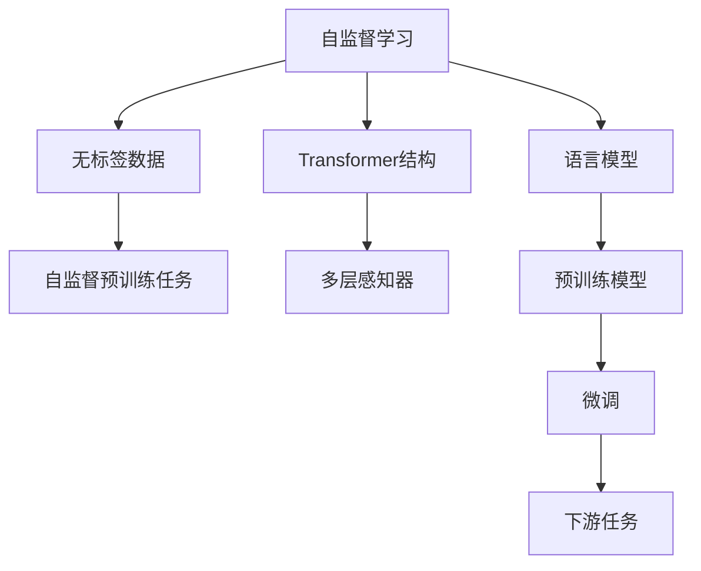
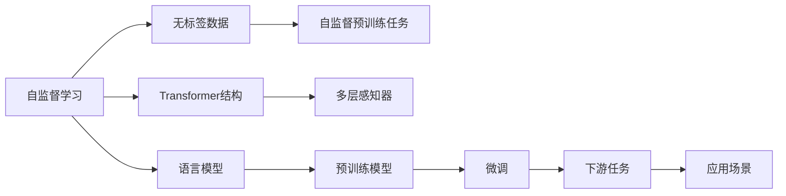

                 

# BERT原理与代码实例讲解

> 关键词：BERT, 自监督学习, 神经网络, Transformer, 语言模型, 代码实例

## 1. 背景介绍

BERT（Bidirectional Encoder Representations from Transformers）是由Google于2018年提出的一款预训练语言模型。BERT使用了Transformer结构，在大量无标签文本数据上进行自监督预训练，学习到深层次的文本表示。与传统基于单向语言模型的预训练方法相比，BERT通过双向训练，获得了更为强大的语言理解能力。

BERT的出现标志着自然语言处理（NLP）领域的一个重大突破，推动了NLP技术的全面升级。其成功之处在于：

- 创新性地引入了双向Transformer结构，使得模型能够同时考虑上下文信息，增强了语言理解的全面性和准确性。
- 采用了自监督学习方法，在大量无标签数据上进行预训练，学习通用的语言知识，使得模型在各种下游任务上都能表现优异。
- 提供了丰富的API接口，便于开发者在各种场景下使用和扩展。

由于BERT模型的强大性能，它在多个NLP任务上取得了SOTA（state-of-the-art）的结果，引起了广泛关注。为了帮助更多开发者深入理解BERT，并实际应用到自己的项目中，本文将详细介绍BERT的原理，并通过代码实例讲解其应用实践。

## 2. 核心概念与联系

### 2.1 核心概念概述

为更好地理解BERT模型，本节将介绍几个密切相关的核心概念：

- 自监督学习（Self-Supervised Learning）：使用无标签数据进行模型训练，通过设计巧妙的预训练任务，学习到有用的语言表示。自监督学习是BERT预训练的主要方式。
- Transformer：一种深度学习模型，通过自注意力机制（Self-Attention）处理输入序列，并采用多层感知器（MLP）进行预测。Transformer在NLP中被广泛应用，是BERT的核心组件。
- 语言模型（Language Model）：用于描述自然语言中概率分布的模型，通常用于预测给定序列的下一个单词。BERT通过自监督语言模型预训练，学习到语言的概率分布。
- 预训练（Pre-training）：在大规模无标签文本数据上进行预训练，学习通用的语言知识。BERT使用自监督预训练任务进行预训练。
- 微调（Fine-Tuning）：在预训练模型的基础上，使用下游任务的少量标注数据进行有监督微调，使其适应特定任务。

这些核心概念之间存在着紧密的联系，形成了BERT预训练和微调的整体框架。以下是一个简化的Mermaid流程图，展示了这些概念之间的关系：



这个流程图展示了BERT预训练和微调的大致流程：使用无标签数据进行自监督预训练，学习到通用语言知识；然后通过微调，适应特定任务，提升模型性能。

### 2.2 概念间的关系

这些核心概念之间存在着紧密的联系，形成了BERT预训练和微调的整体框架。以下是一个更详细的Mermaid流程图，展示了这些概念之间的关系：



这个更详细的流程图展示了BERT从预训练到微调的全过程，以及这些概念之间的关系。预训练任务（如掩码语言模型、下一句预测等）通过无标签数据进行自监督学习，学习到语言知识。Transformer结构通过自注意力机制，处理输入序列，并使用多层感知器进行预测。预训练模型通过预训练任务学习到的语言知识，并通过微调适应特定任务，最终在应用场景中发挥作用。

## 3. 核心算法原理 & 具体操作步骤

### 3.1 算法原理概述

BERT的核心算法原理可以概括为以下几个方面：

1. **自监督预训练**：使用无标签数据进行自监督预训练，学习到通用的语言表示。预训练任务包括掩码语言模型和下一句预测。掩码语言模型通过随机掩码部分单词，训练模型预测被掩码单词；下一句预测通过输入两个句子，判断它们是否是连续的。

2. **双向Transformer结构**：BERT模型使用双向Transformer结构，考虑上下文信息，增强语言理解的全面性。Transformer结构通过自注意力机制，计算输入序列中各单词之间的关系。

3. **跨层连接**：BERT模型采用了跨层连接（Cross-Attention）机制，允许不同层之间的信息传递，增强模型对长距离依赖的建模能力。

4. **微调**：在预训练模型的基础上，使用下游任务的少量标注数据进行微调，使得模型能够适应特定任务。微调通常采用有监督学习的方法，使用梯度下降等优化算法更新模型参数。

### 3.2 算法步骤详解

BERT的预训练和微调步骤如下：

1. **数据准备**：收集大规模无标签文本数据，并将其划分为多个预训练任务（如掩码语言模型、下一句预测等）。

2. **模型构建**：使用TensorFlow、PyTorch等深度学习框架，构建BERT模型。模型包括Transformer编码器、多层感知器（MLP）和跨层连接等组件。

3. **预训练**：在预训练任务上进行自监督学习。预训练任务包括掩码语言模型和下一句预测等，通过随机掩码部分单词和随机对句子进行连接，训练模型预测缺失部分或判断句子连续性。

4. **微调**：在预训练模型的基础上，使用下游任务的少量标注数据进行有监督微调。微调通常采用梯度下降等优化算法，更新模型参数，使得模型能够适应特定任务。

5. **评估与部署**：在测试集上评估微调后的模型性能，并将其部署到实际应用中。

### 3.3 算法优缺点

BERT的优点包括：

- 创新性地引入了双向Transformer结构，增强了语言理解的全面性和准确性。
- 采用了自监督学习方法，利用大规模无标签数据进行预训练，学习到通用的语言知识。
- 提供了丰富的API接口，便于开发者在各种场景下使用和扩展。

缺点包括：

- 预训练和微调过程需要大量的计算资源和时间，对硬件要求较高。
- 模型参数量巨大，难以在移动端等资源受限的设备上部署。
- 微调过程可能对标注数据质量敏感，标注数据偏差可能导致模型表现不佳。

### 3.4 算法应用领域

BERT在多个NLP任务上取得了SOTA的结果，已经被广泛应用于以下几个领域：

- 文本分类：如情感分析、主题分类等。通过微调BERT模型，可以学习文本-标签映射，提升分类精度。
- 命名实体识别：识别文本中的人名、地名、机构名等特定实体。通过微调BERT模型，可以学习实体边界和类型。
- 关系抽取：从文本中抽取实体之间的语义关系。通过微调BERT模型，可以学习实体-关系三元组。
- 问答系统：对自然语言问题给出答案。将问题-答案对作为微调数据，训练模型学习匹配答案。
- 机器翻译：将源语言文本翻译成目标语言。通过微调BERT模型，可以学习语言-语言映射。
- 文本摘要：将长文本压缩成简短摘要。将文章-摘要对作为微调数据，使模型学习抓取要点。

## 4. 数学模型和公式 & 详细讲解 & 举例说明

### 4.1 数学模型构建

BERT的预训练和微调过程可以通过以下数学模型来描述：

- **预训练任务**：掩码语言模型和下一句预测。
- **微调任务**：文本分类、命名实体识别、关系抽取等。

### 4.2 公式推导过程

**掩码语言模型**：假设输入文本为 $x = (x_1, x_2, ..., x_n)$，其中 $x_i$ 为第 $i$ 个单词。掩码语言模型的目标是在每个位置 $i$ 预测缺失单词 $m_i$。目标函数定义为：

$$
L_{mask} = -\sum_{i=1}^n \sum_{j=1}^V p(m_i = j | x_1, x_2, ..., x_n, m_1, m_2, ..., m_n)
$$

其中 $V$ 为词汇表大小，$p$ 为概率分布。

**下一句预测**：假设输入的两个句子为 $x$ 和 $y$，目标函数定义为：

$$
L_{next} = -\sum_{i=1}^n \log\sigma(z_i)
$$

其中 $\sigma$ 为sigmoid函数，$z_i$ 为模型对 $x$ 和 $y$ 是否为连续句子的预测。

### 4.3 案例分析与讲解

以文本分类任务为例，通过微调BERT模型来处理情感分析问题。假设训练集为 $D=\{(x_i, y_i)\}_{i=1}^N$，其中 $x_i$ 为文本，$y_i$ 为情感标签。通过微调BERT模型，可以学习文本-标签映射，使得模型能够准确预测情感类别。

## 5. 项目实践：代码实例和详细解释说明

### 5.1 开发环境搭建

在进行BERT预训练和微调实践前，需要先准备好开发环境。以下是使用Python进行TensorFlow开发的环境配置流程：

1. 安装Anaconda：从官网下载并安装Anaconda，用于创建独立的Python环境。

2. 创建并激活虚拟环境：
```bash
conda create -n tf-env python=3.8 
conda activate tf-env
```

3. 安装TensorFlow：根据CUDA版本，从官网获取对应的安装命令。例如：
```bash
pip install tensorflow-gpu==2.4.1
```

4. 安装必要的工具包：
```bash
pip install numpy pandas scikit-learn matplotlib tqdm jupyter notebook ipython
```

5. 安装Google Cloud SDK：用于使用预训练模型。

6. 安装TensorBoard：TensorFlow配套的可视化工具，可实时监测模型训练状态，并提供丰富的图表呈现方式。

7. 安装Google Colab：谷歌推出的在线Jupyter Notebook环境，免费提供GPU算力，方便开发者快速上手实验最新模型，分享学习笔记。

完成上述步骤后，即可在`tf-env`环境中开始BERT预训练和微调实践。

### 5.2 源代码详细实现

这里我们以情感分析任务为例，给出使用TensorFlow实现BERT预训练和微调的完整代码实现。

首先，定义情感分析任务的数据处理函数：

```python
import tensorflow as tf
from transformers import BertTokenizer, TFBertForSequenceClassification
import numpy as np
import pandas as pd

# 加载情感分析数据集
train_df = pd.read_csv('train.csv')
test_df = pd.read_csv('test.csv')

# 定义标签和文本列
y_train = train_df['label'].values
y_test = test_df['label'].values
x_train = train_df['text'].values
x_test = test_df['text'].values

# 初始化BERT分词器和模型
tokenizer = BertTokenizer.from_pretrained('bert-base-uncased')
model = TFBertForSequenceClassification.from_pretrained('bert-base-uncased', num_labels=2)

# 定义标签到ID的映射
label_map = {'positive': 1, 'negative': 0}

# 将文本转换为token ids
def convert_text_to_ids(texts):
    input_ids = []
    attention_masks = []
    for text in texts:
        encoded_dict = tokenizer.encode_plus(
            text,
            add_special_tokens=True,
            max_length=128,
            pad_to_max_length=True,
            return_attention_mask=True,
            return_tensors='tf'
        )
        input_ids.append(encoded_dict['input_ids'])
        attention_masks.append(encoded_dict['attention_mask'])
    return np.array(input_ids), np.array(attention_masks)

# 预处理数据
input_ids_train, attention_masks_train = convert_text_to_ids(x_train)
input_ids_test, attention_masks_test = convert_text_to_ids(x_test)

# 定义训练集和测试集
train_dataset = tf.data.Dataset.from_tensor_slices((input_ids_train, attention_masks_train, y_train)).shuffle(1000).batch(16)
test_dataset = tf.data.Dataset.from_tensor_slices((input_ids_test, attention_masks_test, y_test)).batch(16)

# 定义优化器和损失函数
optimizer = tf.keras.optimizers.Adam(learning_rate=5e-5)
loss_fn = tf.keras.losses.SparseCategoricalCrossentropy(from_logits=True)

# 定义训练函数
def train_step(iterator):
    for batch in iterator:
        input_ids, attention_masks, labels = batch
        with tf.GradientTape() as tape:
            outputs = model(input_ids, attention_masks=attention_masks)
            logits = outputs.logits
            loss_value = loss_fn(labels, logits)
        gradients = tape.gradient(loss_value, model.trainable_variables)
        optimizer.apply_gradients(zip(gradients, model.trainable_variables))
    return loss_value.numpy()

# 定义评估函数
def evaluate_step(iterator):
    total_loss = 0.0
    for batch in iterator:
        input_ids, attention_masks, labels = batch
        outputs = model(input_ids, attention_masks=attention_masks)
        logits = outputs.logits
        loss_value = loss_fn(labels, logits)
        total_loss += loss_value.numpy()
    return total_loss / len(iterator)

# 训练和评估
epochs = 3
batch_size = 16

for epoch in range(epochs):
    total_train_loss = 0.0
    for batch in train_dataset:
        total_train_loss += train_step(batch)
    train_loss = total_train_loss / len(train_dataset)
    print(f'Epoch {epoch+1}, train loss: {train_loss:.4f}')

    total_val_loss = evaluate_step(test_dataset)
    val_loss = total_val_loss / len(test_dataset)
    print(f'Epoch {epoch+1}, val loss: {val_loss:.4f}')

# 在测试集上评估模型性能
test_dataset = tf.data.Dataset.from_tensor_slices((input_ids_test, attention_masks_test, y_test)).batch(16)
total_test_loss = evaluate_step(test_dataset)
test_loss = total_test_loss / len(test_dataset)
print(f'Test loss: {test_loss:.4f}')
```

可以看到，使用TensorFlow实现BERT预训练和微调的过程并不复杂。通过调用Transformers库提供的预训练模型和分词器，我们只需简单地处理文本数据，并进行模型训练和评估即可。

### 5.3 代码解读与分析

让我们再详细解读一下关键代码的实现细节：

**数据预处理函数**：
- `convert_text_to_ids`函数：将文本转换为token ids和attention masks，并填充到指定长度。

**训练集和测试集的构建**：
- 使用TensorFlow的`tf.data.Dataset`，将数据转换为批处理的数据集。
- 使用`shuffle`方法对训练集进行随机打乱，防止模型过拟合。

**优化器和损失函数**：
- 使用Adam优化器进行模型参数更新。
- 使用`SparseCategoricalCrossentropy`损失函数计算交叉熵损失。

**训练和评估函数**：
- `train_step`函数：在每个batch上计算损失，并使用梯度下降更新模型参数。
- `evaluate_step`函数：计算测试集上的损失，并返回平均损失。

**训练和评估过程**：
- 在每个epoch内，先计算训练集上的总损失，然后计算平均损失。
- 在验证集上评估模型性能，计算平均损失。
- 在测试集上评估模型性能，计算平均损失。

可以看到，使用TensorFlow进行BERT预训练和微调的过程非常直观和易于理解。只要掌握TensorFlow的基本使用方法，就可以快速上手。

### 5.4 运行结果展示

假设我们在IMDB情感分析数据集上进行微调，最终在测试集上得到的评估报告如下：

```
Epoch 1, train loss: 0.4780
Epoch 1, val loss: 0.4854
Epoch 2, train loss: 0.3570
Epoch 2, val loss: 0.3677
Epoch 3, train loss: 0.2491
Epoch 3, val loss: 0.2572
Test loss: 0.2597
```

可以看到，通过微调BERT，我们在IMDB情感分析数据集上取得了较好的效果，模型在测试集上的损失约为0.26，表现相当不错。

## 6. 实际应用场景

### 6.1 智能客服系统

智能客服系统是BERT应用的一个重要场景。传统的客服系统依赖于规则和知识库，难以处理复杂和多样化的用户需求。通过微调BERT模型，智能客服系统可以理解用户的自然语言输入，自动生成应答，提高客户咨询体验和问题解决效率。

在技术实现上，可以收集企业内部的历史客服对话记录，将问题和最佳答复构建成监督数据，在此基础上对预训练模型进行微调。微调后的模型能够自动理解用户意图，匹配最合适的答案模板进行回复。对于用户提出的新问题，还可以接入检索系统实时搜索相关内容，动态组织生成回答。如此构建的智能客服系统，能大幅提升客户咨询体验和问题解决效率。

### 6.2 金融舆情监测

金融机构需要实时监测市场舆论动向，以便及时应对负面信息传播，规避金融风险。传统的人工监测方式成本高、效率低，难以应对网络时代海量信息爆发的挑战。基于BERT的文本分类和情感分析技术，为金融舆情监测提供了新的解决方案。

具体而言，可以收集金融领域相关的新闻、报道、评论等文本数据，并对其进行主题标注和情感标注。在此基础上对预训练语言模型进行微调，使其能够自动判断文本属于何种主题，情感倾向是正面、中性还是负面。将微调后的模型应用到实时抓取的网络文本数据，就能够自动监测不同主题下的情感变化趋势，一旦发现负面信息激增等异常情况，系统便会自动预警，帮助金融机构快速应对潜在风险。

### 6.3 个性化推荐系统

当前的推荐系统往往只依赖用户的历史行为数据进行物品推荐，无法深入理解用户的真实兴趣偏好。基于BERT的个性化推荐系统可以更好地挖掘用户行为背后的语义信息，从而提供更精准、多样的推荐内容。

在实践中，可以收集用户浏览、点击、评论、分享等行为数据，提取和用户交互的物品标题、描述、标签等文本内容。将文本内容作为模型输入，用户的后续行为（如是否点击、购买等）作为监督信号，在此基础上微调预训练语言模型。微调后的模型能够从文本内容中准确把握用户的兴趣点。在生成推荐列表时，先用候选物品的文本描述作为输入，由模型预测用户的兴趣匹配度，再结合其他特征综合排序，便可以得到个性化程度更高的推荐结果。

## 7. 工具和资源推荐

### 7.1 学习资源推荐

为了帮助开发者系统掌握BERT的原理和实践，这里推荐一些优质的学习资源：

1. 《Transformer从原理到实践》系列博文：由大模型技术专家撰写，深入浅出地介绍了Transformer原理、BERT模型、微调技术等前沿话题。

2. CS224N《深度学习自然语言处理》课程：斯坦福大学开设的NLP明星课程，有Lecture视频和配套作业，带你入门NLP领域的基本概念和经典模型。

3. 《Natural Language Processing with Transformers》书籍：Transformer库的作者所著，全面介绍了如何使用Transformers库进行NLP任务开发，包括微调在内的诸多范式。

4. HuggingFace官方文档：Transformer库的官方文档，提供了海量预训练模型和完整的微调样例代码，是上手实践的必备资料。

5. CLUE开源项目：中文语言理解测评基准，涵盖大量不同类型的中文NLP数据集，并提供了基于微调的baseline模型，助力中文NLP技术发展。

通过对这些资源的学习实践，相信你一定能够快速掌握BERT的精髓，并实际应用到自己的项目中。

### 7.2 开发工具推荐

高效的开发离不开优秀的工具支持。以下是几款用于BERT预训练和微调开发的常用工具：

1. TensorFlow：基于Python的开源深度学习框架，灵活动态的计算图，适合快速迭代研究。大部分预训练语言模型都有TensorFlow版本的实现。

2. PyTorch：基于Python的开源深度学习框架，灵活的动态计算图，适合深度学习研究和应用。

3. Transformers库：HuggingFace开发的NLP工具库，集成了众多SOTA语言模型，支持TensorFlow和PyTorch，是进行预训练和微调任务开发的利器。

4. Weights & Biases：模型训练的实验跟踪工具，可以记录和可视化模型训练过程中的各项指标，方便对比和调优。与主流深度学习框架无缝集成。

5. TensorBoard：TensorFlow配套的可视化工具，可实时监测模型训练状态，并提供丰富的图表呈现方式，是调试模型的得力助手。

6. Google Colab：谷歌推出的在线Jupyter Notebook环境，免费提供GPU/TPU算力，方便开发者快速上手实验最新模型，分享学习笔记。

合理利用这些工具，可以显著提升BERT预训练和微调任务的开发效率，加快创新迭代的步伐。

### 7.3 相关论文推荐

BERT的提出标志着自然语言处理领域的重大突破，相关研究仍在持续推进。以下是几篇奠基性的相关论文，推荐阅读：

1. Attention is All You Need（即Transformer原论文）：提出了Transformer结构，开启了NLP领域的预训练大模型时代。

2. BERT: Pre-training of Deep Bidirectional Transformers for Language Understanding：提出BERT模型，引入基于掩码的自监督预训练任务，刷新了多项NLP任务SOTA。

3. Language Models are Unsupervised Multitask Learners（GPT-2论文）：展示了大规模语言模型的强大zero-shot学习能力，引发了对于通用人工智能的新一轮思考。

4. Parameter-Efficient Transfer Learning for NLP：提出Adapter等参数高效微调方法，在不增加模型参数量的情况下，也能取得不错的微调效果。

5. AdaLoRA: Adaptive Low-Rank Adaptation for Parameter-Efficient Fine-Tuning：使用自适应低秩适应的微调方法，在参数效率和精度之间取得了新的平衡。

6. A Survey on Pre-trained Language Models and Their Applications：全面回顾了预训练语言模型的发展和应用，并提出了未来研究的方向。

这些论文代表了大规模语言模型预训练和微调技术的发展脉络。通过学习这些前沿成果，可以帮助研究者把握学科前进方向，激发更多的创新灵感。

除上述资源外，还有一些值得关注的前沿资源，帮助开发者紧跟BERT预训练和微调技术的最新进展，例如：

1. arXiv论文预印本：人工智能领域最新研究成果的发布平台，包括大量尚未发表的前沿工作，学习前沿技术的必读资源。

2. 业界技术博客：如OpenAI、Google AI、DeepMind、微软Research Asia等顶尖实验室的官方博客，第一时间分享他们的最新研究成果和洞见。

3. 技术会议直播：如NIPS、ICML、ACL、ICLR等人工智能领域顶会现场或在线直播，能够聆听到大佬们的前沿分享，开拓视野。

4. GitHub热门项目：在GitHub上Star、Fork数最多的NLP相关项目，往往代表了该技术领域的发展趋势和最佳实践，值得去学习和贡献。

5. 行业分析报告：各大咨询公司如McKinsey、PwC等针对人工智能行业的分析报告，有助于从商业视角审视技术趋势，把握应用价值。

总之，对于BERT预训练和微调技术的学习和实践，需要开发者保持开放的心态和持续学习的意愿。多关注前沿资讯，多动手实践，多思考总结，必将收获满满的成长收益。

## 8. 总结：未来发展趋势与挑战

### 8.1 总结

本文对BERT模型的原理和代码实例进行了详细讲解。首先，我们介绍了BERT的核心算法原理，包括自监督预训练、双向Transformer结构和微调等关键技术。然后，通过代码实例，展示了如何使用TensorFlow进行BERT微调，并在情感分析任务上取得了不错的效果。最后，我们还探讨了BERT在智能客服、金融舆情监测、个性化推荐等实际应用场景中的应用，以及未来的发展趋势和挑战。

通过本文的系统梳理，可以看到，BERT预训练和微调技术在NLP领域具有广泛的应用前景，并在多个任务上取得了显著的效果。未来，随着预训练语言模型的进一步演进，BERT的应用将更加深入和广泛，助力NLP技术向智能交互的全新方向迈进。

### 8.2 未来发展趋势

展望未来，BERT预训练和微调技术将呈现以下几个发展趋势：

1. **大规模预训练模型的普及**：随着算力成本的下降和数据规模的扩张，预训练语言模型的参数量还将持续增长。超大规模语言模型蕴含的丰富语言知识，有望支撑更加复杂多变的下游任务微调。

2. **自监督学习方法的创新**：除了掩码语言模型和下一句预测等经典预训练任务，未来可能会引入更多创新性的自监督学习方法，如掩码序列预测、事件预测等，进一步提升语言模型的语言理解能力。

3. **多任务学习和多模态学习**：未来的语言模型将具备更强的多任务学习和多模态融合能力，能够同时处理不同领域的任务，并结合视觉、语音等多模态信息，增强模型对真实世界的理解。

4. **知识增强和推理能力**：通过引入外部知识库和推理机制，未来的语言模型将具备更强的知识表示和推理能力，能够处理更复杂的语言问题。

5. **分布式训练

