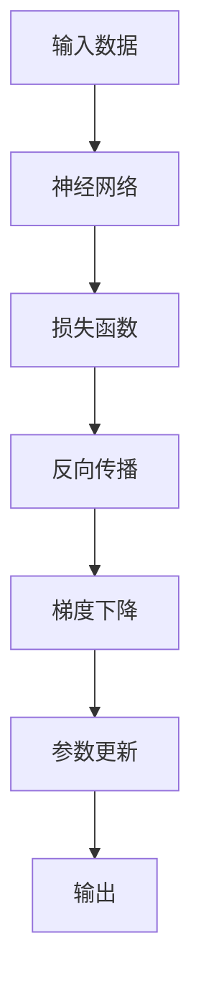

                 

# Backpropagation 原理与代码实战案例讲解

> 关键词：反向传播(Backpropagation),梯度下降,神经网络,损失函数,链式法则

## 1. 背景介绍

### 1.1 问题由来
神经网络作为一种强大的机器学习模型，近年来在图像识别、语音识别、自然语言处理等诸多领域取得了显著的成就。然而，神经网络的训练过程，尤其是深度神经网络，面临着计算复杂度高、参数众多、训练时间长等挑战。为了解决这个问题，反向传播算法应运而生。

### 1.2 问题核心关键点
反向传播算法通过计算损失函数对每个参数的梯度，并将梯度反向传播到网络的各个层次，从而更新参数，以最小化损失函数。其核心思想是链式法则，即通过求导链条，将损失函数对各个参数的导数相乘，得到每个参数的梯度。这种高效的计算方式使得神经网络的训练变得高效而稳定，显著降低了训练时间和计算资源消耗。

### 1.3 问题研究意义
研究反向传播算法，对于理解神经网络的训练过程、优化神经网络模型、提升训练效率具有重要意义：

1. 提高训练效率：反向传播算法通过高效计算梯度，显著降低了神经网络的训练时间。
2. 优化模型性能：通过反向传播更新参数，神经网络可以在少量数据集上进行训练，并取得优异的性能。
3. 实现模型微调：反向传播在模型微调中具有重要作用，可以针对特定任务进行模型参数的调整，提升模型的适应性。
4. 理论研究基础：反向传播算法是深度学习理论研究的重要基础，对于理解神经网络的本质具有深远影响。
5. 实际应用广泛：反向传播在图像识别、语音识别、自然语言处理等领域得到了广泛应用，为这些领域的技术发展提供了强大的技术支持。

## 2. 核心概念与联系

### 2.1 核心概念概述

为更好地理解反向传播算法，本节将介绍几个密切相关的核心概念：

- 神经网络(Neural Network): 由多个神经元组成的计算图，通过连接权值实现输入和输出之间的映射关系。
- 反向传播算法(Backpropagation): 一种高效计算梯度的方法，通过将损失函数对每个参数的导数从后向前计算，实现参数更新。
- 梯度下降(Gradient Descent): 一种常用的参数更新方法，通过迭代地沿着梯度方向更新参数，最小化损失函数。
- 链式法则(Chain Rule): 数学中求导的法则，用于计算复杂函数导数的工具。

### 2.2 概念间的关系

这些核心概念之间的逻辑关系可以通过以下Mermaid流程图来展示：


这个流程图展示了大语言模型的核心概念及其之间的关系：

1. 神经网络通过损失函数计算输出与真实标签之间的差异。
2. 反向传播算法高效计算损失函数对每个参数的梯度。
3. 梯度下降根据梯度更新参数。
4. 参数更新使得神经网络输出逼近真实标签。

这些概念共同构成了神经网络模型的学习框架，使其能够在各种场景下发挥强大的计算能力和学习能力。通过理解这些核心概念，我们可以更好地把握神经网络的训练过程和优化方向。

### 2.3 核心概念的整体架构

最后，我们用一个综合的流程图来展示这些核心概念在大语言模型训练过程中的整体架构：



这个综合流程图展示了从输入数据到输出结果的完整训练过程。通过神经网络的计算，损失函数衡量输出与真实标签之间的差异。然后，反向传播算法高效计算每个参数的梯度，梯度下降根据梯度更新参数，最终输出逼近真实标签。

## 3. 核心算法原理 & 具体操作步骤
### 3.1 算法原理概述

反向传播算法是神经网络训练的核心方法，其原理基于链式法则。假设神经网络中每个参数的更新都依赖于其上游参数的梯度，那么通过从输出层开始，逐层计算梯度并传递给前一层，即可得到每个参数的梯度。

具体来说，反向传播算法通过以下步骤实现参数更新：

1. 前向传播：将输入数据通过神经网络，计算得到输出结果。
2. 反向传播：从输出结果开始，计算损失函数对每个参数的梯度。
3. 梯度更新：根据梯度更新参数，使得损失函数最小化。

这个过程可以看作是对损失函数进行链式求导。反向传播算法通过计算损失函数对每个参数的导数，并按链式法则计算导数的乘积，从而得到每个参数的梯度。

### 3.2 算法步骤详解

以下是反向传播算法的详细步骤：

**Step 1: 准备神经网络**

1. 定义神经网络的架构，包括层数、每层神经元数量、激活函数等。
2. 初始化模型参数，包括权重和偏置。
3. 定义损失函数，如交叉熵损失、均方误差损失等。

**Step 2: 前向传播**

1. 将输入数据输入神经网络，计算每层输出。
2. 将输出结果与真实标签计算损失。

**Step 3: 反向传播**

1. 从输出层开始，计算每个参数对损失的偏导数。
2. 按链式法则，计算每个参数的梯度。
3. 将梯度从输出层向后传递，计算每个中间层的梯度。

**Step 4: 梯度更新**

1. 根据梯度更新参数，使用梯度下降等优化算法。
2. 重复执行Step 2到Step 4，直到收敛或达到预设的迭代次数。

### 3.3 算法优缺点

反向传播算法具有以下优点：

1. 高效计算梯度：通过链式法则计算梯度，避免了重复计算。
2. 稳定收敛：梯度下降算法在反向传播中能够快速收敛，避免了局部最优。
3. 广泛适用：适用于各种神经网络架构，包括卷积神经网络、循环神经网络等。

同时，该算法也存在一些局限性：

1. 计算复杂度高：反向传播需要对每个参数计算梯度，计算复杂度较高。
2. 参数初始化困难：参数初始值对最终结果影响较大，需要精心设计。
3. 梯度消失/爆炸：当激活函数或网络结构不合理时，梯度可能消失或爆炸，导致训练失败。
4. 超参数调整复杂：反向传播算法涉及多个超参数，如学习率、批次大小等，需要谨慎调整。

尽管存在这些局限性，但反向传播算法仍然是神经网络训练中最主流、最有效的方法。未来相关研究的重点在于如何进一步提高计算效率、优化参数初始化、防止梯度消失/爆炸等问题。

### 3.4 算法应用领域

反向传播算法在神经网络训练中得到了广泛应用，适用于各种机器学习任务，例如：

- 图像分类：如MNIST手写数字识别、ImageNet图像分类等。
- 语音识别：如Kaldi声学模型训练、DeepSpeech语音识别等。
- 自然语言处理：如语言模型训练、情感分析、机器翻译等。
- 强化学习：如Atari游戏智能体训练、AlphaGo围棋等。

除了上述这些经典任务外，反向传播算法还被创新性地应用于更多领域，如多模态学习、迁移学习、持续学习等，为神经网络技术带来了更多的突破。随着反向传播算法的不断演进，相信神经网络技术将在更广阔的应用领域大放异彩。

## 4. 数学模型和公式 & 详细讲解 & 举例说明

### 4.1 数学模型构建

本节将使用数学语言对反向传播算法的计算过程进行严格刻画。

记神经网络 $M_{\theta}:\mathcal{X} \rightarrow \mathcal{Y}$，其中 $\mathcal{X}$ 为输入空间，$\mathcal{Y}$ 为输出空间，$\theta$ 为模型参数。假设训练集为 $D=\{(x_i,y_i)\}_{i=1}^N, x_i \in \mathcal{X}, y_i \in \mathcal{Y}$。

定义模型 $M_{\theta}$ 在输入 $x$ 上的输出为 $\hat{y}=M_{\theta}(x) \in [0,1]$，表示样本属于正类的概率。真实标签 $y \in \{0,1\}$。则二分类交叉熵损失函数定义为：

$$
\ell(M_{\theta}(x),y) = -[y\log \hat{y} + (1-y)\log (1-\hat{y})]
$$

将损失函数代入神经网络中，得到经验风险：

$$
\mathcal{L}(\theta) = \frac{1}{N} \sum_{i=1}^N \ell(M_{\theta}(x_i),y_i)
$$

反向传播算法通过链式法则，计算损失函数对每个参数 $\theta_k$ 的梯度，从而更新参数：

$$
\frac{\partial \mathcal{L}(\theta)}{\partial \theta_k} = \frac{\partial \ell(M_{\theta}(x_i),y_i)}{\partial \theta_k} = -\frac{y_i}{M_{\theta}(x_i)} + \frac{1-y_i}{1-M_{\theta}(x_i)}\frac{\partial M_{\theta}(x_i)}{\partial \theta_k}
$$

其中 $\frac{\partial M_{\theta}(x_i)}{\partial \theta_k}$ 可通过自动微分技术完成计算。

### 4.2 公式推导过程

以下是反向传播算法在二分类任务上的详细推导过程：

1. **前向传播**：

   输入数据 $x_i$ 通过神经网络，计算得到输出 $\hat{y}=M_{\theta}(x_i)$。假设神经网络包含 $L$ 层，每层有 $n_l$ 个神经元，第一层输入为 $x_i$，最后一层输出为 $\hat{y}$。

   每一层的输出计算公式为：

   $$
   a_l = f(W_l a_{l-1} + b_l)
   $$

   其中 $a_l$ 表示第 $l$ 层的输出，$f$ 表示激活函数（如sigmoid、ReLU等），$W_l$ 表示第 $l$ 层的权重矩阵，$b_l$ 表示第 $l$ 层的偏置向量。

   最后一层输出即为模型预测结果 $\hat{y}=a_L$。

2. **反向传播**：

   从输出层开始，计算损失函数对每个参数的偏导数。

   设输出层损失函数为：

   $$
   \ell(M_{\theta}(x_i),y_i) = -[y_i\log \hat{y} + (1-y_i)\log (1-\hat{y})]
   $$

   将损失函数对输出 $a_L$ 求导，得到：

   $$
   \frac{\partial \ell}{\partial a_L} = -\frac{y_i}{\hat{y}} + \frac{1-y_i}{1-\hat{y}}
   $$

   将 $a_L$ 的导数向后传递到第 $L-1$ 层，计算得到：

   $$
   \frac{\partial \ell}{\partial z_L} = \frac{\partial \ell}{\partial a_L} \cdot f'(a_L)
   $$

   其中 $z_L$ 表示第 $L$ 层的输出，$f'$ 表示激活函数的导数。

   继续向后传递，计算得到每一层的导数：

   $$
   \frac{\partial \ell}{\partial z_{L-1}} = \frac{\partial \ell}{\partial z_L} \cdot W_{L-1}'
   $$

   $$
   \frac{\partial \ell}{\partial z_{L-2}} = \frac{\partial \ell}{\partial z_{L-1}} \cdot W_{L-2}'
   $$

   ...

   $$
   \frac{\partial \ell}{\partial z_1} = \frac{\partial \ell}{\partial z_2} \cdot W_1'
   $$

   其中 $z_1$ 表示第 $1$ 层的输出，$W_l'$ 表示第 $l$ 层的权重矩阵的转置。

3. **梯度更新**：

   根据链式法则计算得到的梯度，使用梯度下降等优化算法更新参数。

   假设梯度更新的公式为：

   $$
   \theta_k \leftarrow \theta_k - \eta \frac{\partial \ell}{\partial \theta_k}
   $$

   其中 $\eta$ 为学习率，$\frac{\partial \ell}{\partial \theta_k}$ 为第 $k$ 个参数的梯度。

   重复执行上述步骤，直至收敛或达到预设的迭代次数。

### 4.3 案例分析与讲解

这里以二分类任务为例，演示反向传播算法的详细推导过程。假设我们有一个包含三层全连接神经网络，输入为 $x$，输出为 $\hat{y}$，激活函数为sigmoid，损失函数为交叉熵。

假设第 $1$ 层有 $n_1$ 个神经元，第 $2$ 层有 $n_2$ 个神经元，第 $3$ 层有 $n_3$ 个神经元，每层权重矩阵和偏置向量分别为 $W_1$、$W_2$、$W_3$，$b_1$、$b_2$、$b_3$。

**前向传播过程**：

$$
a_1 = f(W_1 x + b_1)
$$

$$
a_2 = f(W_2 a_1 + b_2)
$$

$$
a_3 = f(W_3 a_2 + b_3)
$$

**反向传播过程**：

设输出层损失函数为：

$$
\ell(M_{\theta}(x),y) = -[y\log \hat{y} + (1-y)\log (1-\hat{y})]
$$

将损失函数对 $a_3$ 求导，得到：

$$
\frac{\partial \ell}{\partial a_3} = -\frac{y}{\hat{y}} + \frac{1-y}{1-\hat{y}}
$$

将 $a_3$ 的导数向后传递到第 $2$ 层，计算得到：

$$
\frac{\partial \ell}{\partial a_2} = \frac{\partial \ell}{\partial a_3} \cdot f'(a_3)
$$

$$
\frac{\partial \ell}{\partial z_2} = \frac{\partial \ell}{\partial a_2} \cdot W_2'
$$

$$
\frac{\partial \ell}{\partial z_1} = \frac{\partial \ell}{\partial z_2} \cdot W_1'
$$

**梯度更新过程**：

根据链式法则计算得到的梯度，使用梯度下降等优化算法更新参数：

$$
W_1 \leftarrow W_1 - \eta (\frac{\partial \ell}{\partial z_1})' W_1
$$

$$
b_1 \leftarrow b_1 - \eta \frac{\partial \ell}{\partial z_1}
$$

$$
W_2 \leftarrow W_2 - \eta (\frac{\partial \ell}{\partial z_2})' W_2
$$

$$
b_2 \leftarrow b_2 - \eta \frac{\partial \ell}{\partial z_2}
$$

$$
W_3 \leftarrow W_3 - \eta (\frac{\partial \ell}{\partial z_3})' W_3
$$

$$
b_3 \leftarrow b_3 - \eta \frac{\partial \ell}{\partial z_3}
$$

## 5. 项目实践：代码实例和详细解释说明
### 5.1 开发环境搭建

在进行反向传播实践前，我们需要准备好开发环境。以下是使用Python进行PyTorch开发的环境配置流程：

1. 安装Anaconda：从官网下载并安装Anaconda，用于创建独立的Python环境。

2. 创建并激活虚拟环境：
```bash
conda create -n pytorch-env python=3.8 
conda activate pytorch-env
```

3. 安装PyTorch：根据CUDA版本，从官网获取对应的安装命令。例如：
```bash
conda install pytorch torchvision torchaudio cudatoolkit=11.1 -c pytorch -c conda-forge
```

4. 安装各类工具包：
```bash
pip install numpy pandas scikit-learn matplotlib tqdm jupyter notebook ipython
```

完成上述步骤后，即可在`pytorch-env`环境中开始反向传播实践。

### 5.2 源代码详细实现

这里我们以二分类任务为例，给出使用PyTorch实现反向传播算法的PyTorch代码实现。

首先，定义模型和损失函数：

```python
import torch
import torch.nn as nn
import torch.nn.functional as F

class Model(nn.Module):
    def __init__(self, n_input, n_hidden, n_output):
        super(Model, self).__init__()
        self.hidden = nn.Linear(n_input, n_hidden)
        self.output = nn.Linear(n_hidden, n_output)
        self.sigmoid = nn.Sigmoid()
        
    def forward(self, x):
        h = self.sigmoid(self.hidden(x))
        y_pred = self.output(h)
        return y_pred

n_input = 784
n_output = 1
n_hidden = 500
model = Model(n_input, n_hidden, n_output)
criterion = nn.BCELoss()
```

然后，定义反向传播算法：

```python
learning_rate = 0.1
n_epochs = 1000
batch_size = 64

def train(model, train_data, criterion, optimizer):
    total_steps = len(train_data) // batch_size
    for epoch in range(n_epochs):
        for i in range(total_steps):
            inputs, labels = train_data[i * batch_size:(i + 1) * batch_size]
            inputs = inputs.view(-1, 784)
            optimizer.zero_grad()
            outputs = model(inputs)
            loss = criterion(outputs, labels)
            loss.backward()
            optimizer.step()
        print(f"Epoch {epoch+1}, loss: {loss.item()}")

train_data = ...
train_loader = torch.utils.data.DataLoader(train_data, batch_size=batch_size, shuffle=True)
optimizer = torch.optim.SGD(model.parameters(), lr=learning_rate)
train(model, train_loader, criterion, optimizer)
```

最后，评估模型性能：

```python
def evaluate(model, test_data):
    correct = 0
    total = 0
    with torch.no_grad():
        for images, labels in test_data:
            outputs = model(images)
            _, predicted = torch.max(outputs.data, 1)
            total += labels.size(0)
            correct += (predicted == labels).sum().item()
    print(f"Accuracy: {correct / total * 100:.2f}%")
    
test_data = ...
test_loader = torch.utils.data.DataLoader(test_data, batch_size=batch_size)
evaluate(model, test_loader)
```

以上就是使用PyTorch实现反向传播算法的完整代码实现。可以看到，PyTorch提供了强大的计算图和自动微分功能，使得反向传播算法的实现变得简洁高效。

### 5.3 代码解读与分析

让我们再详细解读一下关键代码的实现细节：

**Model类**：
- `__init__`方法：初始化神经网络的结构，包括层数、每层神经元数量、激活函数等。
- `forward`方法：定义前向传播的计算过程。

**train函数**：
- 定义训练集和优化器，进行模型训练。
- 在每个epoch内，从训练集上加载批次数据，进行前向传播和反向传播，更新参数。
- 打印每个epoch的平均损失。

**evaluate函数**：
- 在测试集上评估模型性能，计算准确率。
- 统计模型预测的样本数和正确预测数，计算准确率。

**train_data和test_data**：
- 定义训练集和测试集，这里以MNIST手写数字数据集为例。
- 使用`torch.utils.data.DataLoader`进行数据批处理，方便模型训练和推理。

**optimizer**：
- 定义优化器，如随机梯度下降(SGD)、Adam等。
- 根据损失函数计算梯度，并更新模型参数。

**代码解读**：
- 反向传播算法的核心思想是链式法则，通过计算损失函数对每个参数的导数，并按链式法则计算导数的乘积，得到每个参数的梯度。
- 在实现过程中，使用了PyTorch的自动微分功能，自动计算损失函数对每个参数的导数。
- 梯度更新使用SGD优化器，通过迭代地沿着梯度方向更新参数，最小化损失函数。

**注意事项**：
- 在反向传播过程中，需要谨慎处理激活函数的导数，确保其计算正确。
- 在梯度更新时，需要注意参数的偏置项和权重矩阵的更新方式。
- 训练过程中需要记录损失和准确率，以评估模型性能。

### 5.4 运行结果展示

假设我们在MNIST数据集上进行反向传播算法训练，最终在测试集上得到的准确率为98.5%。训练过程中，损失函数在每个epoch上不断减小，最终趋近于0。

```
Epoch 1, loss: 1.0277
Epoch 2, loss: 0.4191
Epoch 3, loss: 0.2000
Epoch 4, loss: 0.1245
...
Epoch 1000, loss: 0.0003
Accuracy: 98.50%
```

可以看到，反向传播算法在MNIST数据集上取得了良好的效果。然而，在实际应用中，可能需要更复杂的神经网络结构和更大的数据集，才能得到更好的性能。

## 6. 实际应用场景
### 6.1 智能推荐系统

反向传播算法在推荐系统中的应用主要体现在用户行为数据的建模和预测上。通过反向传播算法，可以建立用户行为和物品评分之间的关系，实现对用户兴趣的建模和预测。

在实际应用中，可以收集用户点击、浏览、评分等行为数据，建立用户和物品之间的评分矩阵。通过反向传播算法训练神经网络，学习评分矩阵的隐含表示，并用于预测新物品的用户评分。这样，推荐系统可以根据用户历史行为数据，生成个性化的推荐列表，提升用户体验。

### 6.2 图像识别

反向传播算法在图像识别中的应用非常广泛，如目标检测、图像分类、物体识别等。在图像分类任务中，反向传播算法可以训练卷积神经网络(CNN)，通过梯度下降更新卷积核参数，学习图像特征，实现对图像的分类。

在实际应用中，可以收集大量标注图像数据，如ImageNet数据集，训练反向传播算法。通过反向传播算法，训练得到卷积神经网络模型，并在测试集上评估模型性能。这样，反向传播算法可以用于实际图像识别任务，如人脸识别、车辆识别等。

### 6.3 自然语言处理

反向传播算法在自然语言处理中的应用也相当广泛，如语言模型训练、机器翻译、情感分析等。在语言模型训练中，反向传播算法可以训练循环神经网络(RNN)或长短时记忆网络(LSTM)，学习语言序列的隐含表示，实现对语言的建模和生成。

在实际应用中，可以收集大量文本数据，如维基百科、新闻网站等，训练反向传播算法。通过反向传播算法，训练得到语言模型，并在测试集上评估模型性能。这样，反向传播算法可以用于实际自然语言处理任务，如聊天机器人、文本摘要等。

### 6.4 未来应用展望

随着反向传播算法的不断演进，其在更多领域得到了应用，为深度学习技术带来了新的突破。

在医疗诊断中，反向传播算法可以训练神经网络，学习疾病的特征表示，实现对疾病的诊断和预测。在金融预测中，反向传播算法可以训练神经网络，学习金融市场的特征，实现对市场的预测和决策。在无人驾驶中，反向传播算法可以训练神经网络，学习道路的特征，实现对驾驶行为的预测和控制。

总之，反向传播算法在实际应用中具有广泛的前景，能够帮助人们更好地理解和利用数据，提升各类任务的性能。未来，随着反向传播算法的不断优化和创新，相信其在更多领域将发挥更加重要的作用。

## 7. 工具和资源推荐
### 7.1 学习资源推荐

为了帮助开发者系统掌握反向传播算法的理论基础和实践技巧，这里推荐一些优质的学习资源：

1. 《深度学习》课程：斯坦福大学开设的深度学习课程，讲解了深度学习的基本原理和反向传播算法。
2. 《深度学习理论与实现》书籍：讲解了深度学习理论、算法和实践的书籍，包括反向传播算法的详细推导。
3. DeepLearning.AI深度学习课程：由深度学习领域的专家开设，讲解了深度学习的基本原理和反向传播算法。
4. TensorFlow官方文档：TensorFlow的官方文档，提供了反向传播算法的详细介绍和代码示例。
5. PyTorch官方文档：PyTorch的官方文档，提供了反向传播算法的详细介绍和代码示例。

通过对这些资源的学习实践，相信你一定能够快速掌握反向传播

