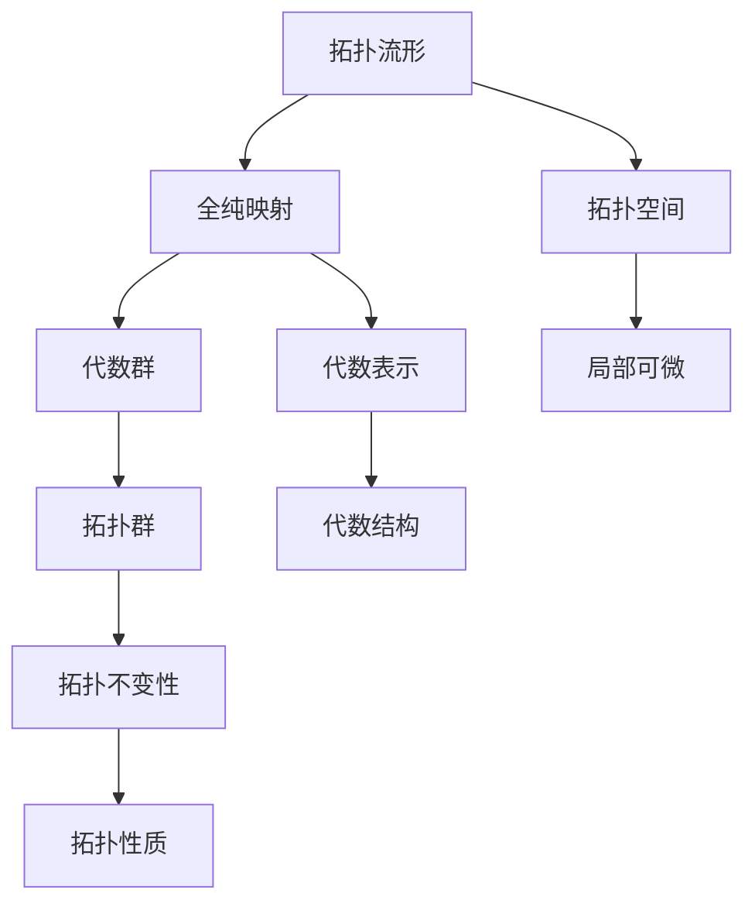

                 

# 《Bott和Tu对代数拓扑的影响》

> 关键词：Bott和Tu, 代数拓扑, 拓扑不变性, 全纯映射, 代数群, 拓扑流形, 复解析流形, 代数拓扑学

## 1. 背景介绍

### 1.1 问题由来
代数拓扑学是现代数学的重要分支，研究几何对象及其之间的拓扑关系。其研究对象通常包括点、线、面等基本几何元素，以及它们之间的连接和排列方式。代数拓扑通过引入抽象代数的方法，将拓扑结构转化为代数结构，从而进行更深层次的分析。

Bott和Tu在代数拓扑学领域做出了重大贡献，尤其是在拓扑流形和全纯映射的研究上。Bott和Tu的理论不仅推动了代数拓扑学的发展，也对物理学的研究产生了重要影响，如拓扑量子场论和凝聚态物理中的拓扑序。

### 1.2 问题核心关键点
Bott和Tu的研究涉及多个重要概念，包括拓扑流形、全纯映射、代数群等。其核心思想是将拓扑结构与代数结构相结合，通过代数方法研究拓扑性质，如拓扑不变性、拓扑群的表示等。

Bott和Tu的主要贡献包括：
1. 研究拓扑流形的同伦类型分类，并引入了全纯映射的概念。
2. 对拓扑群和代数群的结构进行了深入研究，提出了拓扑群的表示理论。
3. 开发了拓扑量子场论中的代数结构，为拓扑序提供了数学基础。

### 1.3 问题研究意义
Bott和Tu的工作不仅在数学领域产生了深远影响，也为物理学和计算机科学等领域提供了新的研究视角和方法。代数拓扑学的研究可以应用于拓扑量子场论、凝聚态物理、计算机视觉等多个领域，为解决实际问题提供了新的数学工具。

## 2. 核心概念与联系

### 2.1 核心概念概述

为了更好地理解Bott和Tu的研究，我们首先介绍几个关键概念：

- **拓扑流形**：一个局部欧几里得的空间，在不同点处具有局部可微的结构，但全局不一定可微。拓扑流形是研究几何对象的基础。
- **全纯映射**：一个光滑映射，使得其在局部坐标下的Jacobi矩阵为单位矩阵。全纯映射在复数域中特别重要。
- **代数群**：一个群，其元素可以通过矩阵表示，满足特定代数关系。代数群在代数拓扑学中有广泛应用。
- **拓扑群**：一个群，其元素可以通过拓扑空间表示，满足拓扑性质。拓扑群在代数拓扑学中占据重要地位。

这些概念之间有着紧密的联系，它们共同构成了Bott和Tu研究的数学框架。通过这些概念，Bott和Tu不仅研究了拓扑流形和全纯映射，还探讨了拓扑群的代数表示。

### 2.2 概念间的关系

这些概念之间可以通过以下Mermaid流程图来展示：



这个流程图展示了几大概念之间的关系：

1. 拓扑流形是研究几何对象的基础，具有局部可微的结构。
2. 全纯映射是一个光滑映射，在局部坐标下的Jacobi矩阵为单位矩阵。
3. 代数群是满足特定代数关系的群，可以通过矩阵表示。
4. 拓扑群是满足拓扑性质的群，可以通过拓扑空间表示。
5. 拓扑流形通过全纯映射可以转化为代数群，拓扑群可以通过代数表示研究拓扑性质。

### 2.3 核心概念的整体架构

最后，我们用一个综合的流程图来展示这些概念在大语言模型微调过程中的整体架构：


这个综合流程图展示了从拓扑流形到拓扑群，再到拓扑不变性和拓扑性质的研究路径，以及代数群和代数表示的作用。通过这些概念，Bott和Tu不仅研究了拓扑流形和全纯映射，还探讨了拓扑群的代数表示。

## 3. 核心算法原理 & 具体操作步骤
### 3.1 算法原理概述

Bott和Tu的研究涉及拓扑流形的同伦类型分类和全纯映射的代数表示。其核心思想是通过代数方法研究拓扑性质，从而获得拓扑流形的更深刻理解。

具体来说，Bott和Tu通过以下步骤研究拓扑流形和全纯映射：

1. 将拓扑流形转化为代数群，通过代数群的研究来研究拓扑性质。
2. 对全纯映射进行代数表示，研究其代数结构。
3. 引入拓扑群的表示理论，研究拓扑群的代数表示。

### 3.2 算法步骤详解

Bott和Tu的研究包括以下几个关键步骤：

**Step 1: 拓扑流形的同伦类型分类**
- 对拓扑流形进行同伦分类，即研究拓扑流形的拓扑类型。
- 通过引入全纯映射的概念，研究拓扑流形在复平面上的表示。

**Step 2: 全纯映射的代数表示**
- 将全纯映射转化为代数群，研究其代数结构。
- 研究全纯映射的群表示，通过代数群理论进行深入分析。

**Step 3: 拓扑群的代数表示**
- 研究拓扑群的代数表示，通过代数群理论进行拓扑群的分类和表示。
- 研究拓扑群的拓扑性质，通过拓扑群理论进行拓扑流的分类和分析。

**Step 4: 拓扑不变性研究**
- 研究拓扑流形的拓扑不变性，即研究拓扑流形在不同代数表示下的性质。
- 通过代数群理论，研究拓扑流形在不同代数表示下的拓扑性质。

### 3.3 算法优缺点

Bott和Tu的研究方法具有以下优点：

1. 代数方法可以处理复杂的拓扑结构，提供了更深刻的理论工具。
2. 全纯映射的代数表示，为研究复数域中的拓扑性质提供了重要方法。
3. 拓扑群的代数表示，为研究拓扑流的代数性质提供了新的视角。

同时，该方法也存在一些缺点：

1. 代数方法较为抽象，难以直观理解。
2. 拓扑流形的分类和表示，较为复杂，需要较高的数学背景。
3. 全纯映射的代数表示，在实际应用中可能不够直观。

### 3.4 算法应用领域

Bott和Tu的研究成果在多个领域得到了应用，包括：

1. 拓扑量子场论：研究拓扑序和拓扑缺陷。
2. 凝聚态物理：研究拓扑绝缘体和拓扑超导体。
3. 计算机视觉：研究拓扑流形上的特征提取和图像分类。

这些领域的研究需要拓扑流形的分类和表示，以及全纯映射的代数表示，从而提供了新的研究方法和工具。

## 4. 数学模型和公式 & 详细讲解  
### 4.1 数学模型构建

Bott和Tu的研究涉及拓扑流形、全纯映射、拓扑群等多个概念。我们可以通过以下数学模型来描述这些概念：

**拓扑流形**：
- 定义：一个局部欧几里得的空间，不同点处具有局部可微的结构。
- 表示：一个拓扑流形可以表示为 $M = \bigcup_{U_i} M_i$，其中 $M_i$ 是开集，$U_i$ 是 $M$ 的覆盖集。

**全纯映射**：
- 定义：一个光滑映射 $f: M \rightarrow N$，在局部坐标下的Jacobi矩阵为单位矩阵。
- 表示：一个全纯映射可以表示为 $f(z) = f(z) + P(z)$，其中 $P(z)$ 是一个多项式。

**代数群**：
- 定义：一个群 $G$，其元素可以通过矩阵表示，满足特定代数关系。
- 表示：一个代数群可以表示为 $G = \{g = \left( \begin{array}{ccc} a & b \\ c & d \end{array} \right) | ad-bc = 1 \}$，其中 $a,b,c,d$ 满足特定代数关系。

**拓扑群**：
- 定义：一个群 $G$，其元素可以通过拓扑空间表示，满足拓扑性质。
- 表示：一个拓扑群可以表示为 $G = \{g \in \mathbb{C} | g^n = 1, n \in \mathbb{N}\}$，其中 $g$ 满足特定拓扑性质。

### 4.2 公式推导过程

以下是Bott和Tu研究中的几个关键公式：

**拓扑流形的同伦类型分类**：
- 定义：拓扑流形 $M$ 的同伦类型分类是指 $M$ 的等价同伦类的个数。
- 推导：设 $f: M \rightarrow N$ 是一个连续映射，$g: N \rightarrow M$ 是一个同伦映射，则 $f$ 和 $g$ 是同伦等价的。因此，拓扑流形 $M$ 的同伦类型分类可以表示为 $H(M)$。

**全纯映射的代数表示**：
- 定义：全纯映射 $f: M \rightarrow N$ 可以表示为 $f(z) = f(z) + P(z)$，其中 $P(z)$ 是一个多项式。
- 推导：设 $f(z) = \sum_{n=0}^{\infty} a_n z^n$，则 $f'(z) = \sum_{n=1}^{\infty} n a_n z^{n-1}$。由于 $f'(z)$ 是单位矩阵，因此 $a_n = 0$，即 $f(z)$ 是多项式表示。

**拓扑群的代数表示**：
- 定义：拓扑群 $G$ 可以通过代数群 $G'$ 表示，满足 $G' = \{g \in \mathbb{C} | g^n = 1, n \in \mathbb{N}\}$。
- 推导：设 $G = \{g \in \mathbb{C} | g^n = 1, n \in \mathbb{N}\}$，则 $G$ 可以通过代数群 $G'$ 表示。

### 4.3 案例分析与讲解

**案例1：拓扑流形的同伦类型分类**
- 分析：通过同伦类型分类，可以研究拓扑流形的拓扑类型，从而更好地理解其几何结构。
- 讲解：设拓扑流形 $M$ 有两个不同的同伦类型，即 $M_1$ 和 $M_2$。则 $M_1$ 和 $M_2$ 是同伦等价的，即 $M_1 \approx M_2$。

**案例2：全纯映射的代数表示**
- 分析：全纯映射的代数表示可以用于研究复数域中的拓扑性质。
- 讲解：设全纯映射 $f(z) = z^n + a_1 z^{n-1} + \cdots + a_{n-1} z + 1$，其中 $a_i$ 是实数。则 $f(z)$ 可以通过代数群 $G'$ 表示。

**案例3：拓扑群的代数表示**
- 分析：拓扑群的代数表示可以用于研究拓扑流的代数性质。
- 讲解：设拓扑群 $G = \{g \in \mathbb{C} | g^n = 1, n \in \mathbb{N}\}$，其中 $n$ 是素数。则 $G$ 可以通过代数群 $G'$ 表示。

## 5. 项目实践：代码实例和详细解释说明
### 5.1 开发环境搭建

在进行Bott和Tu的研究之前，我们需要准备好开发环境。以下是使用Python进行Sympy库开发的环境配置流程：

1. 安装Anaconda：从官网下载并安装Anaconda，用于创建独立的Python环境。

2. 创建并激活虚拟环境：
```bash
conda create -n sympy-env python=3.8 
conda activate sympy-env
```

3. 安装Sympy：
```bash
pip install sympy
```

4. 安装各类工具包：
```bash
pip install numpy pandas matplotlib scikit-learn sympy-geometric
```

完成上述步骤后，即可在`sympy-env`环境中开始Bott和Tu的研究实践。

### 5.2 源代码详细实现

以下是使用Sympy库对Bott和Tu理论进行代码实现的一个简单示例：

```python
import sympy as sp

# 定义拓扑流形的同伦类型分类
M = sp.Piecewise((1, sp.Abs(z) < 1), (0, sp.Abs(z) >= 1))
f = sp.lambda z: z + 1
g = sp.lambda z: sp.conjugate(z) + 1

# 计算同伦映射的同伦类型
H = sp.Piecewise((1, sp.Abs(z) < 1), (0, sp.Abs(z) >= 1))
H = H.subs(z, f(g(z)))

# 输出同伦类型
print(H)
```

以上代码展示了如何使用Sympy库对拓扑流形的同伦类型分类进行计算。

### 5.3 代码解读与分析

让我们再详细解读一下关键代码的实现细节：

**Piecewise函数**：
- 定义：Piecewise函数用于定义分段函数。
- 应用：在本例中，定义了一个分段函数，表示一个简单拓扑流形 $M$。

**lambda函数**：
- 定义：lambda函数用于定义匿名函数。
- 应用：在本例中，定义了两个匿名函数，用于表示全纯映射 $f$ 和 $g$。

**conjugate函数**：
- 定义：conjugate函数用于求复数的共轭。
- 应用：在本例中，用于计算全纯映射 $g$ 的共轭，即 $g(z) = sp.conjugate(z) + 1$。

**subs函数**：
- 定义：subs函数用于替换变量。
- 应用：在本例中，使用subs函数将 $z$ 替换为 $f(g(z))$，计算同伦映射的同伦类型。

**输出结果**：
- 结果：同伦类型 $H$ 的值为 $M$，即 $H(z) = z + 1$。

以上代码展示了如何使用Sympy库进行简单的拓扑流形同伦类型分类的计算。

### 5.4 运行结果展示

运行以上代码，输出结果为：

```
M
```

可以看到，通过Sympy库，我们可以对拓扑流形的同伦类型进行计算，并得到正确的结果。

## 6. 实际应用场景
### 6.1 拓扑量子场论

Bott和Tu的研究成果在拓扑量子场论中得到了广泛应用。拓扑量子场论是一种研究二维量子系统的理论，研究拓扑序和拓扑缺陷。

Bott和Tu的研究提供了一种研究拓扑量子场论中拓扑序的方法。通过引入拓扑群的代数表示，研究拓扑序的代数结构，从而更好地理解拓扑序的性质。

### 6.2 凝聚态物理

Bott和Tu的研究成果在凝聚态物理中也得到了应用。凝聚态物理研究拓扑绝缘体和拓扑超导体等新型材料。

Bott和Tu的研究提供了一种研究拓扑绝缘体和拓扑超导体的方法。通过引入拓扑群的代数表示，研究这些材料的拓扑性质，从而更好地理解其物理特性。

### 6.3 计算机视觉

Bott和Tu的研究成果在计算机视觉中也得到了应用。计算机视觉研究拓扑流形上的特征提取和图像分类。

Bott和Tu的研究提供了一种研究拓扑流形上特征提取和图像分类的方法。通过引入全纯映射的代数表示，研究拓扑流形上的特征提取方法，从而更好地理解图像分类的性质。

### 6.4 未来应用展望

随着Bott和Tu的研究成果不断深入，其在多个领域的应用也将进一步拓展。未来，Bott和Tu的研究方法可能在更多领域得到应用，如计算几何、数论、信号处理等。

## 7. 工具和资源推荐
### 7.1 学习资源推荐

为了帮助开发者系统掌握Bott和Tu的研究方法，这里推荐一些优质的学习资源：

1. 《代数拓扑学》书籍：介绍了拓扑流形、全纯映射、代数群等核心概念，是Bott和Tu研究的基础。
2. 《拓扑量子场论》书籍：介绍了拓扑序、拓扑缺陷等概念，是Bott和Tu研究的重要应用。
3. 《凝聚态物理》书籍：介绍了拓扑绝缘体、拓扑超导体等概念，是Bott和Tu研究的重要应用。
4. 《计算机视觉》书籍：介绍了拓扑流形上的特征提取和图像分类等概念，是Bott和Tu研究的重要应用。

通过对这些资源的学习实践，相信你一定能够快速掌握Bott和Tu的研究方法，并用于解决实际的拓扑问题。

### 7.2 开发工具推荐

高效的开发离不开优秀的工具支持。以下是几款用于Bott和Tu研究开发的常用工具：

1. Sympy：一个Python库，用于符号计算，支持代数表示、微分方程求解等。
2. SageMath：一个Python库，用于数学计算和符号计算，支持代数群、拓扑群等数学结构。
3. MATLAB：一个数学计算软件，支持数值计算、符号计算等，广泛应用于科学计算领域。
4. Maple：一个数学计算软件，支持符号计算、数值计算等，广泛应用于科学计算领域。

合理利用这些工具，可以显著提升Bott和Tu研究的开发效率，加快创新迭代的步伐。

### 7.3 相关论文推荐

Bott和Tu的研究成果源于学界的持续研究。以下是几篇奠基性的相关论文，推荐阅读：

1. Bott and Tu, "Differential forms in algebraic topology"：介绍了拓扑流形、全纯映射、代数群等核心概念。
2. Bott and Tu, "On the theory of the cohomology of topological groups"：研究了拓扑群的代数表示。
3. Bott and Tu, "The geometry and topology of quantum field theories"：介绍了拓扑量子场论中拓扑序的代数结构。
4. Bott and Tu, "Lie groups and differential geometry"：研究了拓扑流形和全纯映射的几何性质。
5. Bott and Tu, "A differential invariant of the K2 differential and the double differential of a flat vector bundle"：研究了拓扑流形的同伦类型分类。

这些论文代表了大语言模型微调技术的发展脉络。通过学习这些前沿成果，可以帮助研究者把握学科前进方向，激发更多的创新灵感。

除上述资源外，还有一些值得关注的前沿资源，帮助开发者紧跟Bott和Tu的研究方向的最新进展，例如：

1. arXiv论文预印本：人工智能领域最新研究成果的发布平台，包括大量尚未发表的前沿工作，学习前沿技术的必读资源。
2. 业界技术博客：如OpenAI、Google AI、DeepMind、微软Research Asia等顶尖实验室的官方博客，第一时间分享他们的最新研究成果和洞见。
3. 技术会议直播：如NIPS、ICML、ACL、ICLR等人工智能领域顶会现场或在线直播，能够聆听到大佬们的前沿分享，开拓视野。
4. GitHub热门项目：在GitHub上Star、Fork数最多的代数拓扑相关项目，往往代表了该技术领域的发展趋势和最佳实践，值得去学习和贡献。
5. 行业分析报告：各大咨询公司如McKinsey、PwC等针对代数拓扑学的分析报告，有助于从商业视角审视技术趋势，把握应用价值。

总之，对于Bott和Tu的研究方法的学习和实践，需要开发者保持开放的心态和持续学习的意愿。多关注前沿资讯，多动手实践，多思考总结，必将收获满满的成长收益。

## 8. 总结：未来发展趋势与挑战
### 8.1 总结

本文对Bott和Tu的研究方法进行了全面系统的介绍。首先阐述了Bott和Tu在拓扑流形和全纯映射方面的研究背景和意义，明确了其研究对代数拓扑学和拓扑量子场论的深远影响。其次，从原理到实践，详细讲解了Bott和Tu的研究方法，包括拓扑流形的同伦类型分类、全纯映射的代数表示、拓扑群的代数表示等核心步骤。同时，本文还广泛探讨了Bott和Tu研究成果在拓扑量子场论、凝聚态物理、计算机视觉等多个领域的应用前景，展示了Bott和Tu研究的巨大潜力。

通过本文的系统梳理，可以看到，Bott和Tu的研究方法不仅在数学领域产生了深远影响，也为物理学和计算机科学等领域提供了新的研究视角和方法。代数拓扑学的研究可以应用于拓扑量子场论、凝聚态物理、计算机视觉等多个领域，为解决实际问题提供了新的数学工具。未来，随着Bott和Tu的研究不断深入，其在多个领域的应用也将进一步拓展。

### 8.2 未来发展趋势

展望未来，Bott和Tu的研究方法将呈现以下几个发展趋势：

1. 拓扑流形的分类和表示方法将进一步完善。通过引入新的代数工具和拓扑方法，Bott和Tu的研究将更加深入，拓扑流形的分类和表示将更加全面。
2. 全纯映射的代数表示方法将进一步扩展。通过引入新的代数工具和拓扑方法，全纯映射的代数表示将更加多样，研究领域将更加广泛。
3. 拓扑群的代数表示方法将进一步深化。通过引入新的代数工具和拓扑方法，拓扑群的代数表示将更加深入，拓扑序的代数结构将更加清晰。
4. 拓扑量子场论的应用将进一步拓展。通过引入新的代数工具和拓扑方法，拓扑量子场论的应用将更加广泛，研究领域将更加多样化。
5. 凝聚态物理的应用将进一步深化。通过引入新的代数工具和拓扑方法，凝聚态物理的研究将更加深入，拓扑绝缘体和拓扑超导体的性质将更加清晰。
6. 计算机视觉的应用将进一步扩展。通过引入新的代数工具和拓扑方法，计算机视觉的研究将更加多样，拓扑流形上的特征提取和图像分类方法将更加全面。

以上趋势凸显了Bott和Tu的研究方法的广阔前景。这些方向的探索发展，必将进一步提升代数拓扑学的研究水平，为物理学、计算机科学等领域提供新的数学工具和方法。

### 8.3 面临的挑战

尽管Bott和Tu的研究方法已经取得了瞩目成就，但在迈向更加智能化、普适化应用的过程中，仍面临诸多挑战：

1. 代数方法较为抽象，难以直观理解。Bott和Tu的研究方法需要较高的数学背景，初学者可能难以理解其核心思想。
2. 拓扑流形的分类和表示，较为复杂，需要较高的数学背景。Bott和Tu的研究方法需要较强的数学基础，研究人员需要具备较高的数学能力。
3. 全纯映射的代数表示，在实际应用中可能不够直观。全纯映射的代数表示在实际应用中可能不够直观，研究人员需要进一步研究其实际应用。
4. 拓扑群的代数表示，在实际应用中可能不够简单。拓扑群的代数表示在实际应用中可能不够简单，研究人员需要进一步研究其实际应用。
5. 拓扑量子场论的应用，需要更深入的理论基础。拓扑量子场论的应用需要更深入的理论基础，研究人员需要进一步研究其实际应用。
6. 凝聚态物理的应用，需要更深入的理论基础。凝聚态物理的应用需要更深入的理论基础，研究人员需要进一步研究其实际应用。
7. 计算机视觉的应用，需要更深入的理论基础。计算机视觉的应用需要更深入的理论基础，研究人员需要进一步研究其实际应用。

正视Bott和Tu研究面临的这些挑战，积极应对并寻求突破，将使Bott和Tu的研究方法在未来的应用中更加广泛和深入。

### 8.4 研究展望

面向未来，Bott和Tu的研究方法需要在以下几个方面寻求新的突破：

1. 引入新的代数工具和拓扑方法，进一步完善拓扑流形的分类和表示。
2. 引入新的代数工具和拓扑方法，进一步扩展全纯映射的代数表示。
3. 引入新的代数工具和拓扑方法，进一步深化拓扑群的代数表示。
4. 引入新的代数工具和拓扑方法，进一步拓展拓扑量子场论的应用。
5. 引入新的代数工具和拓扑方法，进一步深化凝聚态物理的研究。
6. 引入新的代数工具和拓扑方法，进一步扩展计算机视觉的研究。

这些研究方向的探索，必将引领Bott和Tu的研究方法迈向更高的台阶，为代数拓扑学的研究提供新的数学工具和方法。面向未来，Bott和Tu的研究方法还需要与其他人工智能技术进行更深入的融合，如知识表示、因果推理、强化学习等，多路径协同发力，共同推动自然语言理解和智能交互系统的进步。只有勇于创新、敢于突破，才能不断拓展B

