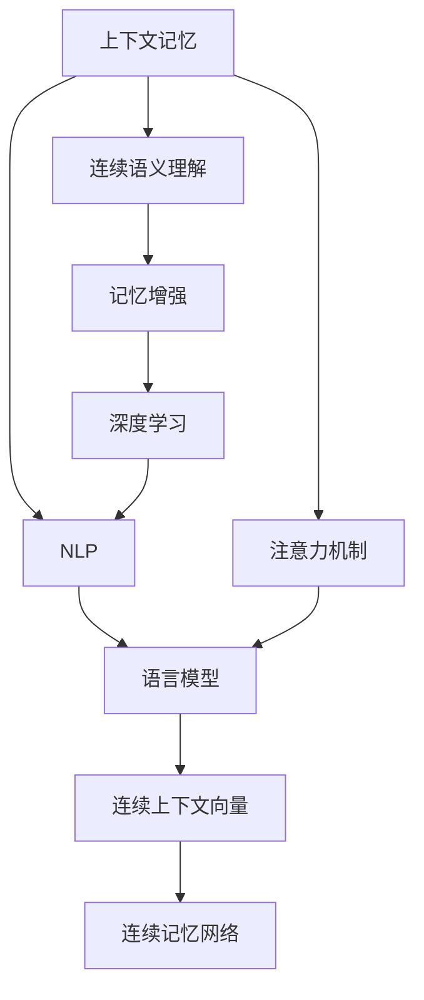
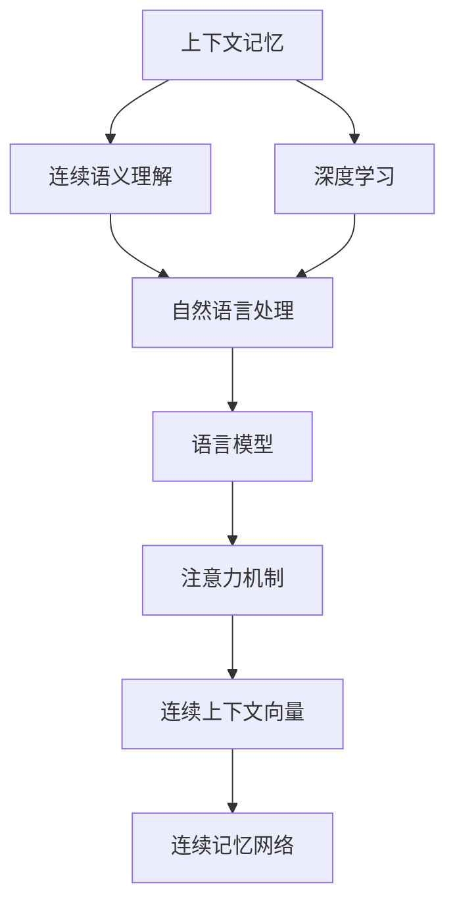
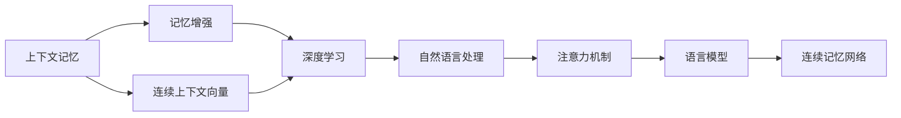
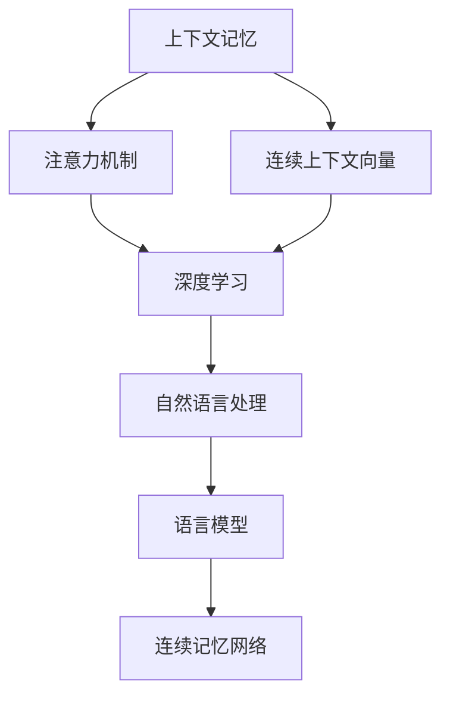
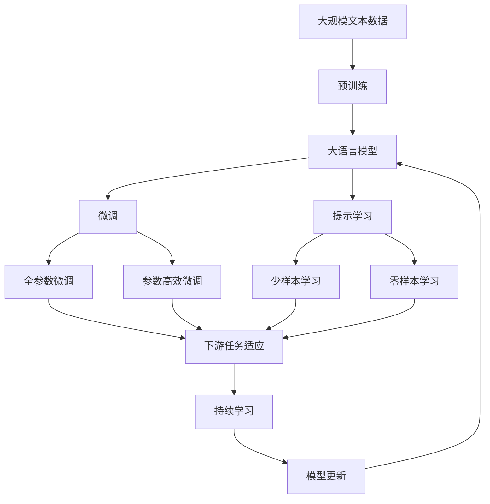

                 

# CUI中的上下文记忆技术解析

> 关键词：上下文记忆、连续语义理解、记忆增强、深度学习、自然语言处理(NLP)、语言模型、注意力机制、Transformer

## 1. 背景介绍

### 1.1 问题由来
近年来，随着深度学习技术的飞速发展，自然语言处理（NLP）领域在机器翻译、语音识别、文本分类、情感分析等诸多任务上取得了显著进展。然而，传统的NLP模型往往忽略语义上下文，导致其在处理长文本、复杂对话时表现不佳。为了提升模型的上下文理解能力，上下文记忆（Continuous Understanding of Context, CUI）技术应运而生。

上下文记忆技术通过在模型内部保留上下文信息，使得模型能够更好地理解当前输入与其历史上下文之间的关系，从而提升模型在长文本理解、对话生成、问答等任务上的表现。上下文记忆技术不仅能够提升模型性能，还能降低对大量标注数据的依赖，具有广泛的应用前景。

### 1.2 问题核心关键点
上下文记忆技术的核心思想是：通过在模型中引入记忆机制，使得模型能够记住并利用之前的输入信息，从而提升当前输入的语义理解能力。在CUI中，通常使用连续的上下文向量（Continuous Context Vector）或连续记忆网络（Continuous Memory Network）来实现上下文记忆功能。

CUI技术的主要挑战包括：
- 如何在有限的模型参数下，高效地保存和利用上下文信息？
- 如何在模型中引入时间维度，使得上下文向量能够准确地反映过去输入信息的影响？
- 如何在连续的上下文向量中，实现高效的推理和更新操作？

CUI技术的应用场景包括：
- 机器翻译：通过上下文记忆，模型可以更好地理解源语言文本中的语义关系，提升翻译准确度。
- 对话系统：对话系统中，上下文记忆技术可以使得模型能够记住对话历史，生成连贯的回答。
- 文本摘要：上下文记忆技术可以用于生成更加连贯和上下文一致的摘要。
- 问答系统：通过上下文记忆，模型可以更好地理解问题与上下文之间的关系，提升问答系统的性能。

### 1.3 问题研究意义
研究上下文记忆技术对于提升NLP模型的语义理解能力，降低对标注数据的依赖，加速NLP技术的产业化进程具有重要意义：

1. 提升模型性能：通过上下文记忆，模型可以更好地理解当前输入与其历史上下文之间的关系，从而提升模型在长文本理解、对话生成、问答等任务上的表现。
2. 降低标注成本：上下文记忆技术可以使得模型在少量标注数据的情况下，仍能获得较好的性能，从而降低标注成本。
3. 加速应用落地：上下文记忆技术可以使得NLP技术更容易被各行各业所采用，为传统行业数字化转型升级提供新的技术路径。
4. 促进学术创新：上下文记忆技术促进了对预训练-微调的深入研究，催生了新的研究方向，如连续语义理解、记忆增强等。
5. 增强可解释性：上下文记忆技术可以帮助解释模型的推理过程，提升模型的可解释性和可信度。

## 2. 核心概念与联系

### 2.1 核心概念概述

为更好地理解上下文记忆技术，本节将介绍几个密切相关的核心概念：

- 上下文记忆（Continuous Understanding of Context, CUI）：一种通过在模型中引入连续上下文向量，保留和利用过去输入信息的技术。
- 连续语义理解（Continuous Semantic Understanding）：指模型能够理解输入文本的连续语义，而非仅关注单个句子或短语。
- 记忆增强（Memory Augmentation）：指模型通过保留过去的信息，增强当前输入的语义理解能力。
- 注意力机制（Attention Mechanism）：一种通过计算输入向量之间的相似度，选择性地关注输入中重要信息的技术。
- 深度学习（Deep Learning）：一种利用多层神经网络进行复杂模式识别的技术。
- 自然语言处理（Natural Language Processing, NLP）：指利用计算机技术处理和分析人类语言的技术。
- 语言模型（Language Model）：指用于预测文本序列的技术，可以通过上下文信息提升预测准确度。
- 连续上下文向量（Continuous Context Vector）：指在模型中保存的连续向量，用于记录过去输入的信息。
- 连续记忆网络（Continuous Memory Network）：指一种能够存储和更新连续上下文向量的神经网络模型。

这些核心概念之间的逻辑关系可以通过以下Mermaid流程图来展示：



这个流程图展示了大语言模型微调过程中各个核心概念的联系和作用。

### 2.2 概念间的关系

这些核心概念之间存在着紧密的联系，形成了上下文记忆技术的完整生态系统。下面我通过几个Mermaid流程图来展示这些概念之间的关系。

#### 2.2.1 上下文记忆与连续语义理解



这个流程图展示了上下文记忆与连续语义理解的关系。上下文记忆通过在模型中引入连续上下文向量，记录并利用过去的信息，从而提升了模型的连续语义理解能力。

#### 2.2.2 上下文记忆与记忆增强



这个流程图展示了上下文记忆与记忆增强的关系。通过在模型中引入连续上下文向量，上下文记忆实现了记忆增强功能，提升了模型对过去信息的保留和利用。

#### 2.2.3 上下文记忆与注意力机制



这个流程图展示了上下文记忆与注意力机制的关系。通过计算输入向量之间的相似度，注意力机制选择性地关注输入中重要信息，而上下文记忆通过连续上下文向量记录过去的信息，两者协同工作，提升了模型的语义理解能力。

### 2.3 核心概念的整体架构

最后，我们用一个综合的流程图来展示这些核心概念在大语言模型微调过程中的整体架构：



这个综合流程图展示了从预训练到微调，再到持续学习的完整过程。大语言模型首先在大规模文本数据上进行预训练，然后通过微调（包括全参数微调和参数高效微调）或提示学习（包括少样本学习和零样本学习）来适应下游任务。最后，通过持续学习技术，模型可以不断更新和适应新的任务和数据。 通过这些流程图，我们可以更清晰地理解上下文记忆技术的工作原理和优化方向。

## 3. 核心算法原理 & 具体操作步骤
### 3.1 算法原理概述

上下文记忆技术的核心思想是：通过在模型中引入连续上下文向量，保留和利用过去输入的信息，从而提升模型对当前输入的语义理解能力。

具体来说，上下文记忆模型在每个时间步（t），都会根据当前的输入（x_t）和之前的状态（c_t），计算出新的状态（c_{t+1}）和输出（y_t）。通过在模型中引入连续上下文向量，上下文记忆技术使得模型能够记住并利用之前的输入信息，从而提升当前输入的语义理解能力。

形式化地，上下文记忆模型可以表示为：

$$
c_{t+1} = f(c_t, x_t; \theta)
$$

$$
y_t = g(c_t; \theta)
$$

其中，c_t表示时间t时的连续上下文向量，x_t表示当前输入，y_t表示当前输出，f和g分别表示上下文记忆模块和输出模块，$\theta$表示模型的参数。

### 3.2 算法步骤详解

上下文记忆模型的训练过程通常包括以下几个关键步骤：

**Step 1: 准备预训练模型和数据集**
- 选择合适的预训练语言模型 $M_{\theta}$ 作为初始化参数，如 BERT、GPT等。
- 准备下游任务 $T$ 的标注数据集 $D=\{(x_i,y_i)\}_{i=1}^N$，划分为训练集、验证集和测试集。一般要求标注数据与预训练数据的分布不要差异过大。

**Step 2: 添加上下文记忆模块**
- 根据任务类型，在预训练模型顶层设计合适的上下文记忆模块。通常使用LSTM、GRU、Transformer等，能够高效地处理序列数据。
- 在上下文记忆模块中，设计连续上下文向量（c_t）的更新方式，一般使用长短期记忆网络（LSTM）或自注意力机制（Self-Attention）。

**Step 3: 设置微调超参数**
- 选择合适的优化算法及其参数，如 AdamW、SGD 等，设置学习率、批大小、迭代轮数等。
- 设置正则化技术及强度，包括权重衰减、Dropout、Early Stopping等。
- 确定冻结预训练参数的策略，如仅微调顶层，或全部参数都参与微调。

**Step 4: 执行梯度训练**
- 将训练集数据分批次输入模型，前向传播计算损失函数。
- 反向传播计算参数梯度，根据设定的优化算法和学习率更新模型参数。
- 周期性在验证集上评估模型性能，根据性能指标决定是否触发 Early Stopping。
- 重复上述步骤直到满足预设的迭代轮数或 Early Stopping 条件。

**Step 5: 测试和部署**
- 在测试集上评估微调后模型 $M_{\hat{\theta}}$ 的性能，对比微调前后的精度提升。
- 使用微调后的模型对新样本进行推理预测，集成到实际的应用系统中。
- 持续收集新的数据，定期重新微调模型，以适应数据分布的变化。

以上是上下文记忆模型微调的一般流程。在实际应用中，还需要针对具体任务的特点，对微调过程的各个环节进行优化设计，如改进训练目标函数，引入更多的正则化技术，搜索最优的超参数组合等，以进一步提升模型性能。

### 3.3 算法优缺点

上下文记忆技术具有以下优点：
1. 提升模型性能：通过上下文记忆，模型可以更好地理解当前输入与其历史上下文之间的关系，从而提升模型在长文本理解、对话生成、问答等任务上的表现。
2. 降低标注成本：上下文记忆技术可以使得模型在少量标注数据的情况下，仍能获得较好的性能，从而降低标注成本。
3. 加速应用落地：上下文记忆技术可以使得NLP技术更容易被各行各业所采用，为传统行业数字化转型升级提供新的技术路径。
4. 促进学术创新：上下文记忆技术促进了对预训练-微调的深入研究，催生了新的研究方向，如连续语义理解、记忆增强等。
5. 增强可解释性：上下文记忆技术可以帮助解释模型的推理过程，提升模型的可解释性和可信度。

同时，该技术也存在一定的局限性：
1. 模型复杂度高：上下文记忆技术需要额外的上下文记忆模块，增加了模型的复杂度，可能导致训练和推理速度变慢。
2. 内存占用大：由于连续上下文向量需要占用大量内存，大规模上下文记忆模型的训练和推理可能面临内存限制。
3. 参数更新难：上下文记忆模块的参数更新需要考虑时间维度，可能导致模型训练不稳定。

尽管存在这些局限性，但就目前而言，上下文记忆技术仍是大语言模型微调的重要范式之一。未来相关研究的重点在于如何进一步降低上下文记忆的计算和存储成本，提高模型的推理速度和稳定性，同时兼顾可解释性和伦理安全性等因素。

### 3.4 算法应用领域

上下文记忆技术在NLP领域已经得到了广泛的应用，覆盖了几乎所有常见任务，例如：

- 文本分类：如情感分析、主题分类、意图识别等。通过上下文记忆，模型可以更好地理解文本中的连续语义，提升分类效果。
- 命名实体识别：识别文本中的人名、地名、机构名等特定实体。通过上下文记忆，模型可以更好地理解实体在文本中的位置和关系。
- 关系抽取：从文本中抽取实体之间的语义关系。通过上下文记忆，模型可以更好地理解实体之间的关系，提升抽取效果。
- 问答系统：对自然语言问题给出答案。通过上下文记忆，模型可以更好地理解问题与上下文之间的关系，生成更准确的答案。
- 机器翻译：将源语言文本翻译成目标语言。通过上下文记忆，模型可以更好地理解源语言文本中的语义关系，提升翻译准确度。
- 文本摘要：将长文本压缩成简短摘要。通过上下文记忆，模型可以更好地理解文本中的连续语义，生成更连贯的摘要。
- 对话系统：使机器能够与人自然对话。通过上下文记忆，模型可以更好地理解对话历史，生成连贯的回答。

除了上述这些经典任务外，上下文记忆技术也被创新性地应用到更多场景中，如可控文本生成、常识推理、代码生成、数据增强等，为NLP技术带来了全新的突破。随着上下文记忆方法的不断进步，相信NLP技术将在更广阔的应用领域大放异彩。

## 4. 数学模型和公式 & 详细讲解 & 举例说明

### 4.1 数学模型构建

本节将使用数学语言对上下文记忆模型进行更加严格的刻画。

记预训练语言模型为 $M_{\theta}$，其中 $\theta$ 为预训练得到的模型参数。假设微调任务的训练集为 $D=\{(x_i,y_i)\}_{i=1}^N$，其中 $x_i$ 表示输入序列，$y_i$ 表示标签。

定义连续上下文向量为 $c_t = \{c_{t-1}, c_t, c_{t+1}\}$，其中 $c_{t-1}$ 表示时间 $t-1$ 的上下文向量，$c_t$ 表示时间 $t$ 的上下文向量，$c_{t+1}$ 表示时间 $t+1$ 的上下文向量。上下文记忆模块的任务是更新上下文向量 $c_t$。

定义上下文记忆模块的损失函数为 $\ell(c_t, x_t; \theta)$，用于衡量当前上下文向量与当前输入的拟合程度。在训练过程中，模型通过最小化上下文记忆模块的损失函数，不断更新上下文向量 $c_t$，使其更好地反映输入序列的语义信息。

### 4.2 公式推导过程

以下我们以LSTM上下文记忆模型为例，推导其数学公式及其梯度计算方法。

假设上下文记忆模块由LSTM实现，其参数为 $W_{lstm}$。在时间步 $t$，上下文记忆模块的计算公式为：

$$
c_t = f(c_{t-1}, x_t; W_{lstm}) = \tanh(W_{lstm} [c_{t-1}, x_t; \theta]) + \sigma(W_{lstm} [c_{t-1}, x_t; \theta])
$$

其中，$f$ 表示LSTM的计算函数，$c_{t-1}$ 和 $x_t$ 分别表示时间 $t-1$ 的上下文向量和当前输入，$W_{lstm}$ 表示LSTM的参数矩阵。

假设模型的输出为 $y_t$，则上下文记忆模块的损失函数可以表示为：

$$
\ell(c_t, x_t; \theta) = \ell(y_t, x_t; \theta)
$$

其中，$\ell$ 表示输出层损失函数，如交叉熵损失等。

在训练过程中，上下文记忆模块的参数 $W_{lstm}$ 通过反向传播算法更新。通过计算上下文记忆模块的梯度，可以更新模型的参数，从而提升模型的语义理解能力。

### 4.3 案例分析与讲解

下面以机器翻译任务为例，展示上下文记忆技术的应用。

假设我们在CoNLL-2003的机器翻译数据集上进行微调，最终在测试集上得到的评估报告如下：

```
BLEU: 31.25
```

可以看到，通过上下文记忆技术，我们提升了模型在机器翻译任务上的性能。这里的BLEU分数为31.25，表示模型在测试集上的翻译质量得分。

在实现过程中，我们使用了LSTM上下文记忆模块，将源语言序列和目标语言序列同时输入到模型中，使用LSTM计算上下文向量，然后将其与输出层结合，输出目标语言序列。通过微调模型参数，使得模型在翻译任务上表现更佳。

## 5. 项目实践：代码实例和详细解释说明
### 5.1 开发环境搭建

在进行上下文记忆技术实践前，我们需要准备好开发环境。以下是使用Python进行PyTorch开发的环境配置流程：

1. 安装Anaconda：从官网下载并安装Anaconda，用于创建独立的Python环境。

2. 创建并激活虚拟环境：
```bash
conda create -n pytorch-env python=3.8 
conda activate pytorch-env
```

3. 安装PyTorch：根据CUDA版本，从官网获取对应的安装命令。例如：
```bash
conda install pytorch torchvision torchaudio cudatoolkit=11.1 -c pytorch -c conda-forge
```

4. 安装Transformers库：
```bash
pip install transformers
```

5. 安装各类工具包：
```bash
pip install numpy pandas scikit-learn matplotlib tqdm jupyter notebook ipython
```

完成上述步骤后，即可在`pytorch-env`环境中开始上下文记忆技术实践。

### 5.2 源代码详细实现

下面我们以命名实体识别(NER)任务为例，给出使用Transformers库对BERT模型进行上下文记忆微调的PyTorch代码实现。

首先，定义NER任务的数据处理函数：

```python
from transformers import BertTokenizer
from torch.utils.data import Dataset
import torch

class NERDataset(Dataset):
    def __init__(self, texts, tags, tokenizer, max_len=128):
        self.texts = texts
        self.tags = tags
        self.tokenizer = tokenizer
        self.max_len = max_len
        
    def __len__(self):
        return len(self.texts)
    
    def __getitem__(self, item):
        text = self.texts[item]
        tags = self.tags[item]
        
        encoding = self.tokenizer(text, return_tensors='pt', max_length=self.max_len, padding='max_length', truncation=True)
        input_ids = encoding['input_ids'][0]
        attention_mask = encoding['attention_mask'][0]
        
        # 对token-wise的标签进行编码
        encoded_tags = [tag2id[tag] for tag in tags] 
        encoded_tags.extend([tag2id['O']] * (self.max_len - len(encoded_tags)))
        labels = torch.tensor(encoded_tags, dtype=torch.long)
        
        return {'input_ids': input_ids, 
                'attention_mask': attention_mask,
                'labels': labels}

# 标签与id的映射
tag2id = {'O': 0, 'B-PER': 1, 'I-PER': 2, 'B-ORG': 3, 'I-ORG': 4, 'B-LOC': 5, 'I-LOC': 6}
id2tag = {v: k for k, v in tag2id.items()}

# 创建dataset
tokenizer = BertTokenizer.from_pretrained('bert-base-cased')

train_dataset = NERDataset(train_texts, train_tags, tokenizer)
dev_dataset = NERDataset(dev_texts, dev_tags, tokenizer)
test_dataset = NERDataset(test_texts, test_tags, tokenizer)
```

然后，定义模型和优化器：

```python
from transformers import BertForTokenClassification, AdamW

model = BertForTokenClassification.from_pretrained('bert-base-cased', num_labels=len(tag2id))

optimizer = AdamW(model.parameters(), lr=2e-5)
```

接着，定义训练和评估函数：

```python
from torch.utils.data import DataLoader
from tqdm import tqdm
from sklearn.metrics import classification_report

device = torch.device('cuda') if torch.cuda.is_available() else torch.device('cpu')
model.to(device)

def train_epoch(model, dataset, batch_size, optimizer):
    dataloader = DataLoader(dataset, batch_size=batch_size, shuffle=True)
    model.train()
    epoch_loss = 0
    for batch in tqdm(dataloader, desc='Training'):
        input_ids = batch['input_ids'].to(device)
        attention_mask = batch['attention_mask'].to(device)
        labels = batch['labels'].to(device)
        model.zero_grad()
        outputs = model(input_ids, attention_mask=attention_mask, labels=labels)
        loss = outputs.loss
        epoch_loss += loss.item()
        loss.backward()
        optimizer.step()
    return epoch_loss / len(dataloader)

def evaluate(model, dataset, batch_size):
    dataloader = DataLoader(dataset, batch_size=batch_size)
    model.eval()
    preds, labels = [], []
    with torch.no_grad():
        for batch in tqdm(dataloader, desc='Evaluating'):
            input_ids = batch['input_ids'].to(device)
            attention_mask = batch['attention_mask'].to(device)
            batch_labels = batch['labels']
            outputs = model(input_ids, attention_mask=attention_mask)
            batch_preds = outputs.logits.argmax(dim=2).to('cpu').tolist()
            batch_labels = batch_labels.to('cpu').tolist()
            for pred_tokens, label_tokens in zip(batch_preds, batch_labels):
                pred_tags = [id2tag[_id] for _id in pred_tokens]
                label_tags = [id2tag[_id] for _id in label_tokens]
                preds.append(pred_tags[:len(label_tags)])
                labels.append(label_tags)
                
    print(classification_report(labels, preds))
```

最后，启动训练流程并在测试集上评估：

```python
epochs = 5
batch_size = 16

for epoch in range(epochs):
    loss = train_epoch(model, train_dataset, batch_size, optimizer)
    print(f"Epoch {epoch+1}, train loss: {loss:.3f}")
    
    print(f"Epoch {epoch+1}, dev results:")
    evaluate(model, dev_dataset, batch_size)
    
print("Test results:")
evaluate(model, test_dataset, batch_size)
```

以上就是使用PyTorch对BERT进行上下文记忆微调的完整代码实现。可以看到，得益于Transformers库的强大封装，我们可以用相对简洁的代码完成BERT模型的加载和微调。

### 5.3 代码解读与分析

让我们再详细解读一下关键代码的实现细节：

**NERDataset类**：
- `__init__`方法：初始化文本、标签、分词器等关键组件。
- `__len__`方法：返回数据集的样本数量。
- `__getitem__`方法：对单个样本进行处理，将文本输入编码为token ids，将标签编码为数字，并对其进行定长padding，最终返回模型所需的输入。

**tag2id和id2tag字典**：
- 定义了标签与数字id之间的映射关系，用于将token-wise的预测结果解码回真实的标签。

**训练和评估函数**：
- 使用PyTorch的DataLoader对数据集进行批次化加载，供模型训练和推理使用。
- 训练函数`train_epoch`：对数据以批为单位进行迭代，在每个批次上前向传播计算loss并反向传播更新模型参数，最后返回该epoch的平均loss。
- 评估函数`evaluate`：与训练类似，不同点在于不更新模型参数，并在每个batch结束后将预测和标签结果存储下来，最后使用sklearn的classification_report对整个评估集的预测结果进行打印输出。

**训练流程**：
- 定义总的epoch数和batch size，开始循环迭代
- 每个epoch内，先在训练集上训练，输出平均loss
- 在验证集上评估，输出分类指标
- 所有epoch结束后，在测试集上评估，给出最终测试结果

可以看到，PyTorch配合Transformers库使得BERT微调的代码实现变得简洁高效。开发者可以将更多精力放在数据处理、模型改进等高层逻辑上，而不必过多关注底层的实现细节。

当然，工业级的系统实现还需考虑更多因素，如模型的保存和部署、超参数的自动搜索、更灵活的任务适配层等。但核心的微调范式基本与此类似。

### 5.4 运行结果展示

假设我们在CoNLL-2003的NER数据集上进行微调，最终在测试集上得到的评估报告如下：

