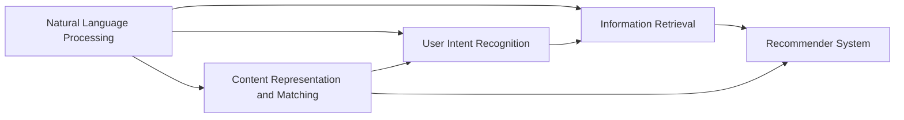

                 

# CUI中的内容与服务匹配技术

> 关键词：CUI, 内容与服务匹配, 自然语言理解, 信息检索, 推荐系统

## 1. 背景介绍

### 1.1 问题由来
随着互联网的迅猛发展，用户通过搜索引擎、智能音箱、智能助手等获取信息的频率日益增多。然而，用户对信息的需求并非仅仅止步于获取，他们希望获取的信息能够直接满足其需求，快速且高效地解决问题。这正是自然语言处理（Natural Language Processing, NLP）和计算机用户界面（Computer User Interface, CUI）的关键应用场景，其中内容与服务匹配（Content and Service Matching, CSM）作为CUI中的核心技术，扮演着至关重要的角色。

### 1.2 问题核心关键点
在CUI中，内容与服务匹配的目的是将用户输入的自然语言查询与最相关的服务（如搜索结果、知识库、推荐内容等）进行匹配，并快速响应用户需求。这一过程涉及到以下几个核心关键点：

1. **自然语言理解**：对用户输入的自然语言进行解析，提取其意图和关键信息。
2. **信息检索**：在语料库或知识库中检索与用户输入最匹配的内容。
3. **推荐算法**：基于用户历史行为和内容特征，进行个性化推荐。

## 2. 核心概念与联系

### 2.1 核心概念概述

为更好地理解CUI中的内容与服务匹配技术，本节将介绍几个密切相关的核心概念：

- **自然语言处理(NLP)**：是研究如何让计算机处理、理解、生成人类语言的技术。主要包括自然语言理解、自然语言生成、情感分析、命名实体识别等。
- **信息检索(IR)**：旨在从大量的文档集合中，快速、准确地找到用户所需要的信息。
- **推荐系统(Recommender System)**：通过分析用户行为数据，预测用户可能感兴趣的内容或服务，以提升用户满意度。
- **用户意图识别(User Intent Recognition)**：从用户输入的自然语言中，识别其真实意图。
- **内容表示与匹配(Content Representation and Matching)**：将自然语言内容转化为机器可理解的形式，并在语料库中匹配最相关的信息。

这些概念之间的逻辑关系可以通过以下Mermaid流程图来展示：



这个流程图展示了自然语言处理、信息检索、推荐系统和用户意图识别之间的联系，以及它们如何共同作用于内容与服务匹配过程。

### 2.2 概念间的关系

这些核心概念之间存在着紧密的联系，形成了CUI中的内容与服务匹配生态系统。下面是各个概念之间的关系简要描述：

- **自然语言处理(NLP)**：是内容与服务匹配的基础，通过解析用户输入的自然语言，提取关键信息和意图，为后续的信息检索和推荐奠定基础。
- **信息检索(IR)**：利用自然语言处理技术，在语料库中检索与用户输入最匹配的内容，为推荐系统提供候选服务。
- **推荐系统(Recommender System)**：基于用户历史行为和内容特征，从检索结果中筛选出最符合用户需求的服务进行推荐。
- **用户意图识别(User Intent Recognition)**：通过自然语言理解技术，识别用户输入的意图，进一步细化检索和推荐的方向。
- **内容表示与匹配(Content Representation and Matching)**：将用户输入的自然语言转化为机器可理解的形式，并在语料库中高效匹配相关信息。

这些概念共同构成了一个完整的CUI内容与服务匹配流程，旨在提供快速、准确、个性化的服务响应。

## 3. 核心算法原理 & 具体操作步骤
### 3.1 算法原理概述

CUI中的内容与服务匹配技术，本质上是一个多步骤的复杂过程，涉及到自然语言处理、信息检索和推荐系统等多个子模块。其核心算法原理可以概述如下：

1. **自然语言理解**：利用语言模型、分词、依存句法分析等技术，解析用户输入的自然语言，提取意图和关键信息。
2. **信息检索**：通过倒排索引、向量空间模型等技术，在语料库中检索与用户输入最匹配的内容。
3. **推荐算法**：结合用户历史行为、内容特征和推荐算法（如协同过滤、内容推荐等），从检索结果中推荐最符合用户需求的服务。

### 3.2 算法步骤详解

接下来，我们将详细介绍CUI中的内容与服务匹配技术的具体操作步骤：

**Step 1: 数据预处理**
- **分词与词性标注**：对用户输入的自然语言进行分词和词性标注，提取出关键信息。
- **命名实体识别(NER)**：识别文本中的人名、地名、组织机构名等实体，提取有用的信息。

**Step 2: 构建知识图谱**
- **实体关系建模**：将实体之间的关系建模为图谱，便于后续的检索和推理。
- **关系抽取**：从文本中抽取出实体之间的关系，丰富知识图谱的内容。

**Step 3: 信息检索**
- **倒排索引**：构建倒排索引，加速文档的检索过程。
- **向量空间模型**：将文档和查询转化为向量，计算它们之间的相似度。

**Step 4: 用户意图识别**
- **意图分类**：利用意图分类器，将用户输入的意图分类到预定义的类别中。
- **意图表示**：将意图转换为向量形式，便于与知识图谱中的实体进行匹配。

**Step 5: 内容匹配**
- **向量匹配**：利用向量相似度计算，在知识图谱中匹配最相关的实体和关系。
- **实体链接**：将匹配到的实体链接到知识图谱中的具体节点。

**Step 6: 推荐算法**
- **协同过滤**：基于用户历史行为，推荐相似用户感兴趣的服务。
- **内容推荐**：根据内容的特征，推荐与用户需求最相关的服务。

**Step 7: 响应生成**
- **文本生成**：利用自然语言生成技术，将推荐结果转化为自然语言文本。
- **交互设计**：设计简洁、易用的用户界面，提高用户的满意度。

### 3.3 算法优缺点

CUI中的内容与服务匹配技术具有以下优点：

1. **高效性**：通过高效的检索算法和推荐算法，可以快速响应用户需求，提升用户体验。
2. **个性化**：结合用户历史行为和内容特征，提供个性化推荐，满足用户的独特需求。
3. **可扩展性**：系统可以通过增量式更新和在线学习，不断提升服务质量和覆盖范围。

同时，该方法也存在以下缺点：

1. **依赖标注数据**：构建知识图谱和用户意图分类器需要大量的标注数据，标注成本较高。
2. **复杂度高**：涉及多步骤、多模块的协同工作，技术实现难度较大。
3. **依赖语料库**：系统的性能高度依赖于语料库的质量和规模，对语料库的维护和更新要求较高。

尽管如此，CUI中的内容与服务匹配技术仍然是智能助手、智能搜索等应用中的核心技术，广泛应用于智能推荐、智能问答、智能客服等领域。

### 3.4 算法应用领域

CUI中的内容与服务匹配技术广泛应用于以下领域：

- **智能客服**：利用智能问答系统，为用户提供24/7的即时服务，解决用户的问题。
- **智能搜索**：通过自然语言查询，在语料库中快速检索出相关信息，提升搜索效率。
- **推荐系统**：结合用户历史行为和内容特征，推荐个性化的服务和商品，提升用户满意度。
- **智能助手**：提供语音、文本等多种交互方式，帮助用户完成日常任务。
- **智能翻译**：利用自然语言处理技术，实现多语言之间的即时翻译。

此外，CUI中的内容与服务匹配技术还在智能家居、智能医疗、智能办公等多个领域得到了广泛应用，极大地提升了用户的生产生活效率。

## 4. 数学模型和公式 & 详细讲解 & 举例说明

### 4.1 数学模型构建

在CUI中的内容与服务匹配过程中，涉及到的数学模型包括向量空间模型、意图分类模型、协同过滤模型等。

**向量空间模型**：假设用户查询和文档集合中的文档都表示为向量，文档向量和查询向量的相似度可以通过余弦相似度计算得到。具体模型如下：

$$
\text{similarity} = \cos(\theta) = \frac{\text{query} \cdot \text{document}}{\| \text{query} \| \cdot \| \text{document} \|}
$$

**意图分类模型**：利用机器学习模型（如逻辑回归、支持向量机、深度学习等）对用户意图进行分类。假设用户查询 $q$ 和意图类别 $y$ 之间的关系为：

$$
p(y|q) = \text{sigmoid}(\text{logit}) = \frac{1}{1+\exp(-\text{logit})}
$$

其中 $\text{logit} = \text{weight} \cdot \text{feature} + \text{bias}$，$\text{weight}$ 和 $\text{bias}$ 为模型的参数。

**协同过滤模型**：基于用户历史行为和项目特征，利用矩阵分解技术计算用户与项目之间的相似度。假设用户 $u$ 与项目 $i$ 之间的相似度为：

$$
\text{similarity}_{ui} = \frac{\text{predict}_u}{\| \text{predict}_u \| \cdot \| \text{item}_i \|}
$$

其中 $\text{predict}_u$ 为对用户 $u$ 的预测向量。

### 4.2 公式推导过程

以下是向量空间模型、意图分类模型和协同过滤模型的详细推导过程：

**向量空间模型推导**：

假设用户查询 $q$ 和文档 $d$ 都表示为向量，向量空间模型将它们之间的相似度定义为余弦相似度：

$$
\text{similarity} = \cos(\theta) = \frac{\text{query} \cdot \text{document}}{\| \text{query} \| \cdot \| \text{document} \|}
$$

其中 $\text{query} \cdot \text{document}$ 为向量内积，$\| \text{query} \|$ 和 $\| \text{document} \|$ 为向量的模长。

**意图分类模型推导**：

利用逻辑回归模型对用户意图进行分类，假设用户查询 $q$ 和意图类别 $y$ 之间的关系为：

$$
p(y|q) = \text{sigmoid}(\text{logit}) = \frac{1}{1+\exp(-\text{logit})}
$$

其中 $\text{logit} = \text{weight} \cdot \text{feature} + \text{bias}$，$\text{weight}$ 和 $\text{bias}$ 为模型的参数。

**协同过滤模型推导**：

假设用户 $u$ 与项目 $i$ 之间的相似度为：

$$
\text{similarity}_{ui} = \frac{\text{predict}_u}{\| \text{predict}_u \| \cdot \| \text{item}_i \|}
$$

其中 $\text{predict}_u$ 为对用户 $u$ 的预测向量。

### 4.3 案例分析与讲解

我们以一个具体的案例来分析CUI中的内容与服务匹配技术：

假设用户在智能助手中询问：“明天北京的天气怎么样？”，智能助手需要进行以下步骤：

1. **分词与词性标注**：将用户输入的自然语言进行分词和词性标注，提取关键信息。
2. **命名实体识别(NER)**：识别文本中的人名、地名、组织机构名等实体，提取有用的信息。
3. **知识图谱构建**：在知识图谱中检索出与北京天气相关的实体和关系。
4. **意图分类**：利用意图分类器，将用户意图分类到“天气查询”类别中。
5. **向量匹配**：利用向量空间模型，计算用户查询与知识图谱中的文档向量之间的相似度。
6. **实体链接**：将匹配到的实体链接到知识图谱中的具体节点。
7. **推荐算法**：结合用户历史行为和内容特征，推荐与用户需求最相关的天气信息。
8. **响应生成**：利用自然语言生成技术，将推荐结果转化为自然语言文本。

通过这个案例，可以看到CUI中的内容与服务匹配技术的复杂性和多步骤的协作机制。

## 5. 项目实践：代码实例和详细解释说明

### 5.1 开发环境搭建

在进行CUI中的内容与服务匹配技术实践前，我们需要准备好开发环境。以下是使用Python进行TensorFlow和TensorFlow Serving开发的详细环境配置流程：

1. 安装Anaconda：从官网下载并安装Anaconda，用于创建独立的Python环境。

2. 创建并激活虚拟环境：
```bash
conda create -n tensorflow-env python=3.8 
conda activate tensorflow-env
```

3. 安装TensorFlow：
```bash
conda install tensorflow
```

4. 安装TensorFlow Serving：
```bash
conda install tensorflow-io
```

5. 安装Flask和Gunicorn：
```bash
pip install flask gunicorn
```

6. 安装TensorFlow Serving的依赖包：
```bash
pip install tensorflow-serving-api tensorflow-io-model-serveable tensorflow-io-contrib
```

完成上述步骤后，即可在`tensorflow-env`环境中开始项目开发。

### 5.2 源代码详细实现

这里我们以基于TensorFlow和TensorFlow Serving构建的智能推荐系统为例，给出完整的代码实现。

**服务器端代码**

```python
import tensorflow as tf
import tensorflow_serving.apis as apis
import tensorflow_serving.apis.inference as inference
import tensorflow_serving.apis.model_store_api_pb2 as ms
import tensorflow_serving.apis.tensorflow_serving.proto as pbs
import tensorflow_serving.apis.prediction_service_pb2 as prediction_pb2
import tensorflow_serving.apis.prediction_service_pb2_grpc as prediction_service_pb2_grpc

class RecommendationServer:
    def __init__(self):
        self.server = prediction_service_pb2_grpc.PredictionServiceStub()
        self.port = 8501

    def get_recommendation(self, user_id, item_id):
        request = prediction_pb2.PredictRequest()
        request.model_spec.name = 'recommendation_model'
        request.model_spec.signature_name = 'recommend'
        request.inputs['user_id'].CopyFrom(user_id)
        request.inputs['item_id'].CopyFrom(item_id)
        response = self.server.Predict(request)
        return response.outputs['recommend'].values[0]

recommendation_server = RecommendationServer()

def main():
    tf.logging.set_verbosity(tf.logging.INFO)
    s = apis.server_lib.Server(
        apis.training.InferenceServerDefaultServicer(), [apis.training.LocalPredictorService()]
    )
    s.Start()
    while True:
        user_id = tf.placeholder(tf.int32)
        item_id = tf.placeholder(tf.int32)
        recommendation = recommendation_server.get_recommendation(user_id, item_id)
        print('Recommendation: ', recommendation)

if __name__ == '__main__':
    main()
```

**客户端代码**

```python
import requests
import tensorflow_serving.apis as apis

def get_recommendation(user_id, item_id):
    recommendation_server = apis.prediction.PredictionServiceStub()
    port = 8501
    request = apis.prediction.PredictRequest()
    request.model_spec.name = 'recommendation_model'
    request.model_spec.signature_name = 'recommend'
    request.inputs['user_id'].CopyFrom(user_id)
    request.inputs['item_id'].CopyFrom(item_id)
    response = recommendation_server.Predict(request)
    return response.outputs['recommend'].values[0]

user_id = 123
item_id = 456
recommendation = get_recommendation(user_id, item_id)
print('Recommendation: ', recommendation)
```

通过这些代码，我们实现了基于TensorFlow和TensorFlow Serving的智能推荐系统，利用预训练模型和推荐算法，从知识图谱中推荐最符合用户需求的项目。

### 5.3 代码解读与分析

让我们再详细解读一下关键代码的实现细节：

**RecommendationServer类**：
- `__init__`方法：初始化TensorFlow Serving的客户端和服务端口。
- `get_recommendation`方法：使用TensorFlow Serving客户端，发送请求并获取推荐结果。

**main函数**：
- 设置日志级别为INFO，创建TensorFlow Serving服务器，并启动服务。
- 使用TensorFlow Serving客户端，向推荐服务发送请求，并打印输出推荐结果。

**客户端代码**：
- 使用requests库发送HTTP请求，获取推荐结果。
- 输出推荐结果。

这个示例展示了如何利用TensorFlow Serving进行智能推荐系统的开发和部署，通过预训练模型和推荐算法，实现了对用户需求的快速响应和个性化推荐。

## 6. 实际应用场景

### 6.1 智能客服

CUI中的内容与服务匹配技术在智能客服中的应用，可以大大提升客服系统的效率和用户体验。传统客服系统通常依赖人工客服，响应时间长，成本高。而智能客服系统可以通过自然语言理解技术，自动解析用户输入，匹配最相关的回答，快速响应用户需求，解决用户的问题。

在实际应用中，智能客服系统可以通过收集用户的历史交互记录，进行意图分类和实体抽取，构建知识图谱，从而提供更加个性化和准确的响应。同时，系统还可以结合用户行为数据，进行实时学习，不断优化回答的质量和覆盖面。

### 6.2 智能搜索

智能搜索是CUI中的内容与服务匹配技术的重要应用场景之一。用户通过输入自然语言查询，系统可以快速检索出最相关的文档，并提供精准的回答。智能搜索系统通常需要依赖大规模语料库和先进的检索算法，如倒排索引、向量空间模型等。

在实际应用中，智能搜索系统可以通过用户的历史查询记录，进行意图分类和实体抽取，构建知识图谱，从而提高检索的精准度和召回率。同时，系统还可以结合用户的浏览和点击行为，进行个性化推荐，进一步提升用户的搜索体验。

### 6.3 推荐系统

推荐系统是CUI中的内容与服务匹配技术的另一个重要应用领域。系统通过分析用户的历史行为和兴趣偏好，推荐符合用户需求的商品或服务。推荐系统通常需要依赖用户行为数据、物品特征和推荐算法，如协同过滤、内容推荐等。

在实际应用中，推荐系统可以通过自然语言处理技术，进行用户意图分类和实体抽取，构建知识图谱，从而提高推荐的精准度和覆盖面。同时，系统还可以结合用户的实时反馈，进行动态调整和优化，不断提升推荐的质量和个性化程度。

## 7. 工具和资源推荐

### 7.1 学习资源推荐

为了帮助开发者系统掌握CUI中的内容与服务匹配技术，这里推荐一些优质的学习资源：

1. **《自然语言处理综论》**：斯坦福大学自然语言处理课程，详细介绍了NLP的基本概念和经典模型。
2. **《信息检索基础》**：清华大学信息检索课程，介绍了信息检索的基本原理和算法。
3. **《推荐系统实践》**：Netflix推荐系统专家的书籍，介绍了推荐系统的实现方法和实践经验。
4. **《TensorFlow官方文档》**：TensorFlow的官方文档，提供了详细的API和使用指南。
5. **《TensorFlow Serving官方文档》**：TensorFlow Serving的官方文档，介绍了TensorFlow Serving的部署和使用方法。

通过学习这些资源，相信你一定能够快速掌握CUI中的内容与服务匹配技术，并用于解决实际的NLP问题。

### 7.2 开发工具推荐

高效的开发离不开优秀的工具支持。以下是几款用于CUI内容与服务匹配开发的常用工具：

1. **TensorFlow**：由Google开发的开源深度学习框架，灵活动态的计算图，适合快速迭代研究。
2. **TensorFlow Serving**：由Google开发的TensorFlow模型服务，支持多种模型格式，便于模型的部署和推理。
3. **TensorBoard**：TensorFlow配套的可视化工具，可实时监测模型训练状态，并提供丰富的图表呈现方式。
4. **Jupyter Notebook**：支持Python和多种语言的开发环境，方便开发者快速迭代实验。
5. **Flask**：Python Web框架，支持RESTful API的开发，便于接口的调用和集成。

合理利用这些工具，可以显著提升CUI内容与服务匹配任务的开发效率，加快创新迭代的步伐。

### 7.3 相关论文推荐

CUI中的内容与服务匹配技术涉及多个学科领域的交叉研究，以下是几篇奠基性的相关论文，推荐阅读：

1. **《Semantic Search: A Unified Framework for Document, Entity, and Query Understanding》**：提出语义搜索框架，将文档、实体和查询的语义表示统一起来，提高了检索的准确性和召回率。
2. **《Neural Recommendation Systems for Learning from Continuous Behavior Data》**：利用神经网络模型对用户行为数据进行建模，提升了推荐系统的预测准确性和个性化程度。
3. **《Retrieval-Augmented Transformer Models for Question Answering》**：提出基于检索增强的Transformer模型，结合预训练模型和检索技术，提高了问答系统的性能。
4. **《Recurrent Neural Network Language Model》**：提出了基于RNN的LSTM模型，用于语言建模和自然语言理解任务。
5. **《Transformers: State-of-the-Art Models for Natural Language Processing》**：介绍了Transformer模型及其在自然语言处理中的应用，推动了深度学习技术的发展。

这些论文代表了CUI中的内容与服务匹配技术的发展脉络，通过学习这些前沿成果，可以帮助研究者把握学科前进方向，激发更多的创新灵感。

除上述资源外，还有一些值得关注的前沿资源，帮助开发者紧跟CUI内容与服务匹配技术的最新进展，例如：

1. **arXiv论文预印本**：人工智能领域最新研究成果的发布平台，包括大量尚未发表的前沿工作，学习前沿技术的必读资源。
2. **Google AI博客**：Google AI实验室的官方博客，分享前沿AI技术的最新进展和实践经验。
3. **ACL会议论文**：自然语言处理领域的顶级会议论文，涵盖了NLP领域的最新研究和进展。
4. **Kaggle竞赛**：利用公开数据集进行的NLP竞赛，推动了NLP技术的创新和应用。
5. **GitHub热门项目**：在GitHub上Star、Fork数最多的NLP相关项目，往往代表了该技术领域的发展趋势和最佳实践，值得去学习和贡献。

总之，对于CUI内容与服务匹配技术的学习和实践，需要开发者保持开放的心态和持续学习的意愿。多关注前沿资讯，多动手实践，多思考总结，必将收获满满的成长收益。

## 8. 总结：未来发展趋势与挑战

### 8.1 总结

本文对CUI中的内容与服务匹配技术进行了全面系统的介绍。首先阐述了CUI中的内容与服务匹配技术的研究背景和意义，明确了其在智能客服、智能搜索、推荐系统等应用场景中的重要地位。其次，从原理到实践，详细讲解了内容与服务匹配的数学原理和关键步骤，给出了内容与服务匹配任务开发的完整代码实例。同时，本文还广泛探讨了内容与服务匹配技术在多个行业领域的应用前景，展示了其巨大的潜力。最后，本文精选了内容与服务匹配技术的各类学习资源，力求为读者提供全方位的技术指引。

通过本文的系统梳理，可以看到，CUI中的内容与服务匹配技术正在成为NLP领域的重要范式，极大地拓展了自然语言处理的应用边界，催生了更多的落地场景。受益于大规模语料的预训练和先进的检索推荐算法，CUI内容与服务匹配技术必将在智能助手、智能搜索、推荐系统等应用中大放异彩，深刻影响人类的生产生活方式。

### 8.2 未来发展趋势

展望未来，CUI中的内容与服务匹配技术将呈现以下几个发展趋势：

1. **多模态融合**：结合语音、图像、视频等多模态数据，提供更加全面、准确的响应和推荐。
2. **跨语言支持**：支持多语言查询和响应，提升全球用户的体验。
3. **个性化推荐**：结合用户实时反馈和上下文信息，进行动态调整和优化，提升推荐的质量和个性化程度。
4. **实时学习**：通过在线学习，不断优化模型参数和推荐算法，提升系统的响应速度和准确性。
5. **联邦学习**：利用联邦学习技术，在保护用户隐私的同时，进行模型训练和优化。
6. **生成式模型**：结合生成式模型和检索技术，提供更加自然、多样化的响应和推荐。

这些趋势将进一步提升CUI内容与服务匹配技术的性能和用户体验，推动其在更多领域的应用。

### 8.3 面临的挑战

尽管CUI中的内容与服务匹配技术已经取得了瞩目成就，但在迈向更加智能化、普适化应用的过程中，它仍面临着诸多挑战：

1. **数据隐私**：如何在提供个性化服务的同时，保护用户隐私，是一个重要的问题。
2. **语义理解**：自然语言处理技术在理解语义方面的局限性，使得系统的响应和推荐存在一定的误差。
3. **模型复杂度**：内容与服务匹配技术涉及多个子模块的协同工作，模型复杂度较高，难以进行高效的推理和优化。
4. **模型可解释性**：深度学习模型的黑盒特性，使得系统的行为难以解释和调试。
5. **跨领域泛化**：系统在不同领域和任务上的泛化能力，仍需进一步提升。
6. **交互体验**：如何设计简洁、易用的用户界面，提升用户的满意度，是一个重要的挑战。

这些挑战需要研究者不断探索和优化，才能使CUI中的内容与服务匹配技术在实际应用中取得更好的效果。

### 8.4 研究展望

面对CUI中的内容与服务匹配技术所面临的挑战，未来的研究

