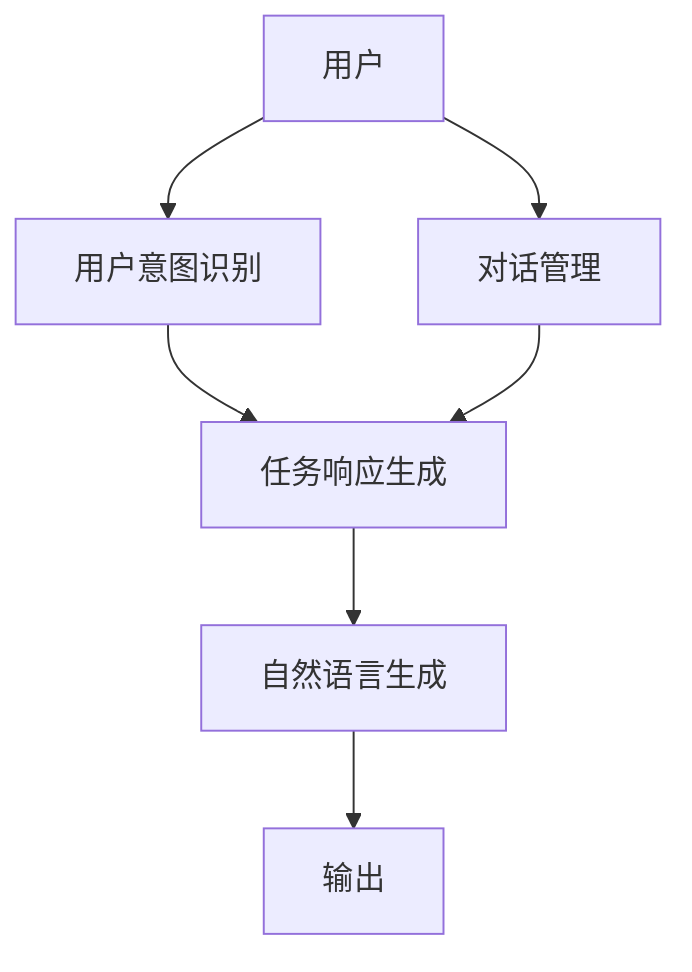
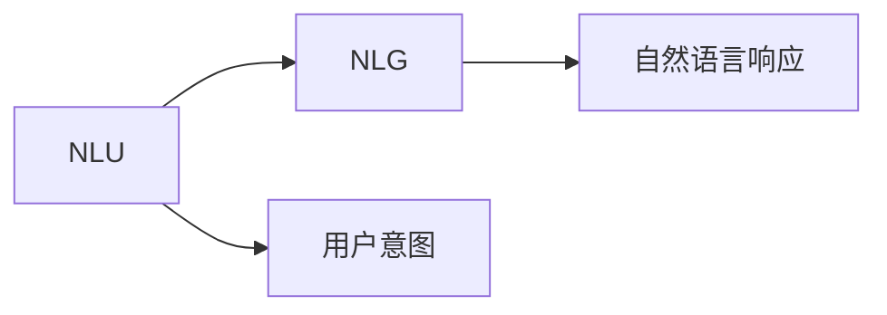
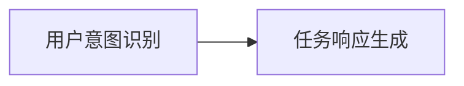
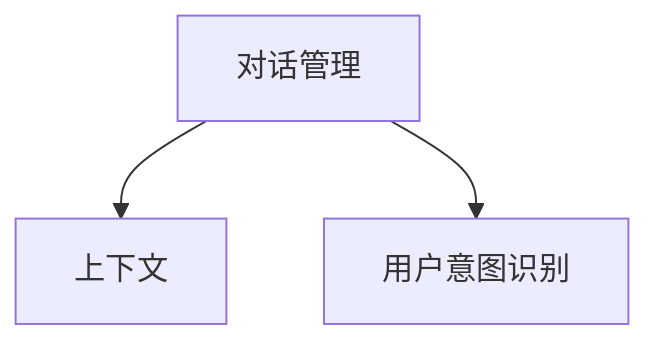
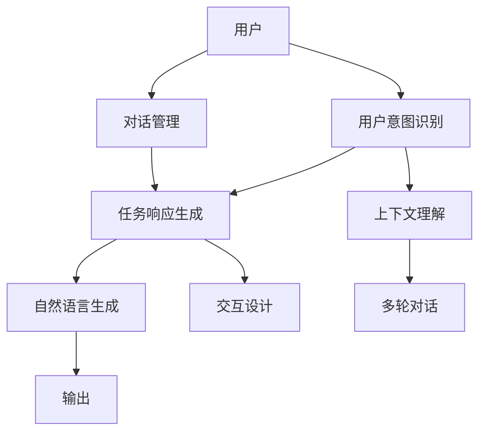

                 

# CUI中的用户目标与任务实现详细技术

> 关键词：自然语言理解(NLU), 用户意图识别, 对话管理, 任务响应生成, 多轮对话, 交互设计, 自然语言生成(NLG), 上下文理解, 情感分析, 用户体验

## 1. 背景介绍

### 1.1 问题由来
随着人工智能技术的发展，自然语言处理（Natural Language Processing, NLP）逐渐成为计算机用户界面（Computer User Interface, CUI）中的重要组成部分。自然语言理解（Natural Language Understanding, NLU）和自然语言生成（Natural Language Generation, NLG）技术使得机器能够理解和生成自然语言，极大地提升了人机交互的效率和自然度。

用户界面自然语言处理（Natural Language Processing, NLP）在智能助手、虚拟客服、智能家居、智能车载等多个场景中得到了广泛应用。例如，智能语音助手可以回答问题、设置提醒、播放音乐等；虚拟客服可以解答用户疑问、处理订单、提供售后服务等；智能家居可以控制家电、调节环境、管理家庭日程等。

这些场景中，用户与系统的交互往往涉及多轮对话。如何在多轮对话中理解用户意图、管理对话上下文、生成合适的响应，是CUI中的核心问题。本节将详细探讨CUI中用户目标的识别与任务实现技术。

## 2. 核心概念与联系

### 2.1 核心概念概述

为了更好地理解CUI中的用户目标与任务实现，我们首先介绍几个核心概念：

- **自然语言理解（NLU）**：是指通过计算机技术，使机器能够理解人类自然语言的能力。NLU通常包括词法分析、句法分析、语义分析等步骤。
- **用户意图识别（Intent Recognition）**：是指通过NLU技术，识别用户输入的自然语言表达所代表的意图。例如，用户说“我想买一本书”，意图就是购买书籍。
- **对话管理（Dialog Management）**：是指在多轮对话中，系统如何管理和维护对话上下文，以便理解用户意图并生成合适的响应。
- **任务响应生成（Task Response Generation）**：是指在理解用户意图后，系统如何生成合适的自然语言响应，如回答问题、执行操作、提供建议等。
- **多轮对话（Multi-Turn Dialogue）**：是指用户与系统之间连续的多轮交流。多轮对话需要系统具备上下文理解和记忆能力。
- **交互设计（Interaction Design）**：是指设计用户与系统交互的界面和流程，确保用户体验的流畅性和自然度。
- **自然语言生成（NLG）**：是指通过计算机技术，使机器能够生成自然语言表达。NLG通常用于生成对话响应、文本摘要、机器翻译等。

这些核心概念之间的联系可以通过以下Mermaid流程图来展示：



这个流程图展示了CUI中的核心概念及它们之间的关系：用户通过输入自然语言与系统交互，系统通过NLU识别用户意图，通过DM管理对话上下文，通过TR生成响应，最终通过NLG生成自然语言文本输出。

### 2.2 概念间的关系

这些核心概念之间存在着紧密的联系，形成了CUI中的用户目标与任务实现框架。下面我们通过几个Mermaid流程图来展示这些概念之间的关系。

#### 2.2.1 NLU与NLG的关系



这个流程图展示了NLU与NLG之间的关系。NLU识别用户意图，NLG生成自然语言响应。

#### 2.2.2 用户意图识别与任务响应生成的关系



这个流程图展示了用户意图识别与任务响应生成的关系。用户意图识别后，系统根据意图执行相应的任务响应生成。

#### 2.2.3 对话管理与用户意图识别的关系



这个流程图展示了对话管理与用户意图识别的关系。对话管理维护上下文信息，帮助用户意图识别更加准确。

### 2.3 核心概念的整体架构

最后，我们用一个综合的流程图来展示这些核心概念在大规模多轮对话中的整体架构：



这个综合流程图展示了从用户输入到系统输出的完整过程：用户输入自然语言，系统通过NLU识别用户意图，通过DM管理对话上下文，通过TR生成响应，最终通过NLG生成自然语言文本输出。交互设计保证用户体验的流畅性和自然度，上下文理解和多轮对话使得系统能够更好地理解用户需求。

## 3. 核心算法原理 & 具体操作步骤
### 3.1 算法原理概述

CUI中的用户目标与任务实现，主要基于自然语言理解（NLU）和自然语言生成（NLG）技术。其核心算法包括：

- **用户意图识别算法**：通过NLU技术，识别用户输入的自然语言表达所代表的意图。
- **对话管理算法**：在多轮对话中，管理对话上下文，以便理解用户意图并生成合适的响应。
- **任务响应生成算法**：根据用户意图，生成合适的自然语言响应。
- **自然语言生成算法**：通过NLG技术，生成自然语言响应。

这些算法通常基于深度学习模型，如循环神经网络（RNN）、长短时记忆网络（LSTM）、双向LSTM、Transformer等。下面我们将详细介绍这些算法原理及具体操作步骤。

### 3.2 算法步骤详解

#### 3.2.1 用户意图识别算法

用户意图识别的基本步骤如下：

1. **预处理**：对用户输入的自然语言进行分词、词性标注、命名实体识别等预处理。
2. **特征提取**：将预处理后的文本转换为模型所需的向量表示。常用的特征提取方法包括词嵌入（Word Embedding）、BERT等预训练模型。
3. **意图分类**：通过分类模型（如SVM、CNN、RNN、LSTM等）预测输入文本的意图类别。常用的分类模型包括基于CNN的意图分类模型、基于LSTM的意图分类模型等。
4. **意图识别**：将分类模型的预测结果映射到意图库中的具体意图。

下面以一个简单的意图分类模型为例，展示意图识别的具体步骤：

- **数据集准备**：收集标注好的意图数据集，如“订票”、“订餐”、“查询天气”等。
- **特征提取**：使用预训练的BERT模型，对每个输入文本进行编码，得到向量表示。
- **模型训练**：使用训练集对意图分类模型进行训练，得到模型参数。
- **意图识别**：将待识别文本输入模型，得到意图预测结果。

#### 3.2.2 对话管理算法

对话管理的基本步骤如下：

1. **上下文维护**：在对话中维护对话上下文，如对话历史记录、用户输入、系统响应等。
2. **意图识别**：根据上下文信息，识别用户当前的意图。
3. **决策生成**：根据用户意图，生成对话管理决策，如响应选择、对话流程控制等。
4. **响应生成**：根据决策结果，生成系统响应。

下面以一个简单的对话管理模型为例，展示对话管理的具体步骤：

- **上下文维护**：维护对话历史记录，如“请问您要订哪天的票？”、“我要订3月1号的票。”等。
- **意图识别**：根据上下文信息，识别用户当前的意图，如“订票”。
- **决策生成**：生成对话管理决策，如“请问您要订什么时间的票？”。
- **响应生成**：根据决策结果，生成系统响应，如“请问您要订什么时间的票？”。

#### 3.2.3 任务响应生成算法

任务响应生成的基本步骤如下：

1. **任务理解**：根据用户意图，理解任务需求。
2. **任务执行**：执行相应的任务操作，如查询信息、预订服务、处理订单等。
3. **响应生成**：根据任务执行结果，生成自然语言响应。

下面以一个简单的任务响应生成模型为例，展示任务响应生成的具体步骤：

- **任务理解**：理解用户意图，如“订票”。
- **任务执行**：查询可用机票，找到符合条件的航班。
- **响应生成**：生成自然语言响应，如“您有3月1号的航班，价格为500元。”。

#### 3.2.4 自然语言生成算法

自然语言生成的基本步骤如下：

1. **文本生成**：使用NLG技术，生成自然语言文本。常用的NLG方法包括基于模板的生成、基于规则的生成、基于统计的生成、基于深度学习的生成等。
2. **响应生成**：根据用户意图和任务执行结果，生成合适的自然语言响应。

下面以一个简单的基于深度学习的NLG模型为例，展示自然语言生成的具体步骤：

- **文本生成**：使用深度学习模型（如Seq2Seq、Transformer等）生成自然语言文本。
- **响应生成**：根据用户意图和任务执行结果，生成自然语言响应，如“您有3月1号的航班，价格为500元。”。

### 3.3 算法优缺点

#### 3.3.1 用户意图识别算法的优缺点

**优点**：
- 基于深度学习的意图识别算法可以处理复杂语义和上下文信息，精度较高。
- 可以使用预训练的模型，减少特征工程的工作量。

**缺点**：
- 模型训练需要大量标注数据，标注成本较高。
- 模型复杂度较高，训练和推理速度较慢。

#### 3.3.2 对话管理算法的优缺点

**优点**：
- 对话管理算法能够维护上下文信息，提高意图识别的准确性。
- 可以根据上下文信息，生成合适的系统响应，提升用户体验。

**缺点**：
- 对话管理算法复杂度较高，实现难度较大。
- 需要处理多轮对话中的上下文信息，计算资源消耗较大。

#### 3.3.3 任务响应生成算法的优缺点

**优点**：
- 任务响应生成算法能够根据任务需求，执行相应的操作，满足用户需求。
- 可以使用多种任务执行方法，实现任务的多样性。

**缺点**：
- 任务响应生成算法需要处理多种任务类型，实现难度较大。
- 需要与外部系统（如数据库、API等）进行交互，增加了系统复杂度。

#### 3.3.4 自然语言生成算法的优缺点

**优点**：
- 自然语言生成算法可以生成自然语言文本，提升用户体验。
- 可以使用多种NLG方法，满足不同场景的需求。

**缺点**：
- 自然语言生成算法复杂度较高，实现难度较大。
- 需要处理复杂的自然语言表达，容易出错。

### 3.4 算法应用领域

用户意图识别、对话管理、任务响应生成和自然语言生成技术，在多个领域得到了广泛应用。例如：

- **智能客服**：通过意图识别和对话管理，实现自动回答用户问题，提升客服效率。
- **虚拟助手**：通过意图识别和任务响应生成，实现多轮对话和复杂任务处理。
- **智能家居**：通过自然语言生成，实现语音控制和交互。
- **智能车载**：通过自然语言生成，实现语音导航和指令执行。
- **智能医疗**：通过自然语言生成，实现智能诊断和推荐。

## 4. 数学模型和公式 & 详细讲解 & 举例说明

### 4.1 数学模型构建

在CUI中，用户意图识别和自然语言生成通常使用深度学习模型，如循环神经网络（RNN）、长短时记忆网络（LSTM）、双向LSTM、Transformer等。

#### 4.1.1 用户意图识别模型

用户意图识别模型通常包括特征提取和意图分类两个部分。以LSTM模型为例，其数学模型可以表示为：

$$
H_t = f(W_h \cdot [X_t, H_{t-1}] + b_h)
$$
$$
H_{t+1} = f(W_h \cdot [H_t, H_{t-1}] + b_h)
$$
$$
Y_t = softmax(W_y \cdot H_{t+1} + b_y)
$$

其中，$H_t$表示第$t$个时间步的隐状态，$X_t$表示第$t$个时间步的输入向量，$W_h$和$b_h$表示LSTM的权重和偏置，$f$表示激活函数。$Y_t$表示第$t$个时间步的输出向量，$W_y$和$b_y$表示输出层的权重和偏置。

#### 4.1.2 自然语言生成模型

自然语言生成模型通常使用Seq2Seq模型或Transformer模型。以Transformer模型为例，其数学模型可以表示为：

$$
Q_k = X_k A^Q
$$
$$
K_k = X_k A^K
$$
$$
V_k = X_k A^V
$$
$$
E_k = Q_k K_k^T
$$
$$
S_k = softmax(E_k)
$$
$$
C_k = S_k V_k
$$
$$
Y_{t+1} = H_{t+1} A^O
$$

其中，$Q_k$、$K_k$、$V_k$表示查询、键、值向量，$A^Q$、$A^K$、$A^V$表示线性变换矩阵，$S_k$表示注意力权重矩阵，$C_k$表示上下文向量，$A^O$表示输出层的线性变换矩阵。$Y_{t+1}$表示第$t+1$个时间步的输出向量。

### 4.2 公式推导过程

#### 4.2.1 用户意图识别公式推导

以LSTM模型为例，其意图分类公式推导如下：

$$
H_t = f(W_h \cdot [X_t, H_{t-1}] + b_h)
$$
$$
H_{t+1} = f(W_h \cdot [H_t, H_{t-1}] + b_h)
$$
$$
Y_t = softmax(W_y \cdot H_{t+1} + b_y)
$$

其中，$H_t$表示第$t$个时间步的隐状态，$X_t$表示第$t$个时间步的输入向量，$W_h$和$b_h$表示LSTM的权重和偏置，$f$表示激活函数。$Y_t$表示第$t$个时间步的输出向量，$W_y$和$b_y$表示输出层的权重和偏置。

#### 4.2.2 自然语言生成公式推导

以Transformer模型为例，其自然语言生成公式推导如下：

$$
Q_k = X_k A^Q
$$
$$
K_k = X_k A^K
$$
$$
V_k = X_k A^V
$$
$$
E_k = Q_k K_k^T
$$
$$
S_k = softmax(E_k)
$$
$$
C_k = S_k V_k
$$
$$
Y_{t+1} = H_{t+1} A^O
$$

其中，$Q_k$、$K_k$、$V_k$表示查询、键、值向量，$A^Q$、$A^K$、$A^V$表示线性变换矩阵，$S_k$表示注意力权重矩阵，$C_k$表示上下文向量，$A^O$表示输出层的线性变换矩阵。$Y_{t+1}$表示第$t+1$个时间步的输出向量。

### 4.3 案例分析与讲解

#### 4.3.1 用户意图识别案例

以一个简单的意图识别任务为例，假设训练数据集包括“订票”、“订餐”、“查询天气”等意图。使用LSTM模型进行意图分类：

1. **数据预处理**：对每个输入文本进行分词、词性标注、命名实体识别等预处理，将其转换为模型所需的向量表示。
2. **模型训练**：使用训练集对意图分类模型进行训练，得到模型参数。
3. **意图识别**：将待识别文本输入模型，得到意图预测结果。

#### 4.3.2 自然语言生成案例

以一个简单的自然语言生成任务为例，假设需要生成一条天气预报信息：“今天晴，最高温度28℃，最低温度18℃”。使用Transformer模型进行自然语言生成：

1. **编码器输入**：将用户意图（如“查询天气”）和上下文信息（如“今天晴”）转换为向量表示，输入到编码器。
2. **注意力机制**：通过注意力机制，生成上下文向量。
3. **解码器输入**：将生成的上下文向量输入到解码器，生成自然语言输出。

## 5. 项目实践：代码实例和详细解释说明

### 5.1 开发环境搭建

在进行CUI中的用户目标与任务实现实践前，我们需要准备好开发环境。以下是使用Python进行TensorFlow开发的环境配置流程：

1. 安装Anaconda：从官网下载并安装Anaconda，用于创建独立的Python环境。

2. 创建并激活虚拟环境：
```bash
conda create -n tensorflow-env python=3.8 
conda activate tensorflow-env
```

3. 安装TensorFlow：根据CUDA版本，从官网获取对应的安装命令。例如：
```bash
conda install tensorflow -c tf -c conda-forge
```

4. 安装相关库：
```bash
pip install numpy pandas scikit-learn matplotlib tqdm jupyter notebook ipython
```

完成上述步骤后，即可在`tensorflow-env`环境中开始CUI中的用户目标与任务实现实践。

### 5.2 源代码详细实现

下面我们以意图识别和自然语言生成为例，给出使用TensorFlow实现CUI中的用户目标与任务实现的PyTorch代码实现。

首先，定义意图识别模型：

```python
import tensorflow as tf
from tensorflow.keras.layers import Input, LSTM, Dense, Embedding

# 定义模型结构
input_shape = (None, 100)
output_shape = (None, num_intent)
model = tf.keras.Sequential([
    Embedding(input_dim=vocab_size, output_dim=embedding_dim, input_length=max_length),
    LSTM(units=128, return_sequences=True),
    Dense(units=num_intent, activation='softmax')
])
```

然后，定义自然语言生成模型：

```python
# 定义模型结构
input_shape = (None, seq_length)
output_shape = (None, vocab_size)
model = tf.keras.Sequential([
    Input(shape=input_shape),
    LSTM(units=128),
    Dense(units=vocab_size, activation='softmax')
])
```

接下来，定义训练和评估函数：

```python
from tensorflow.keras.datasets import imdb
from tensorflow.keras.preprocessing import sequence

# 加载数据集
(x_train, y_train), (x_test, y_test) = imdb.load_data(num_words=vocab_size)
x_train = sequence.pad_sequences(x_train, maxlen=max_length)
x_test = sequence.pad_sequences(x_test, maxlen=max_length)

# 定义损失函数和优化器
loss_fn = tf.keras.losses.SparseCategoricalCrossentropy(from_logits=True)
optimizer = tf.keras.optimizers.Adam()

# 定义训练函数
def train_epoch(model, data, batch_size, optimizer):
    for batch in tf.data.Dataset.from_tensor_slices((data['input_ids'], data['attention_mask'], data['labels'])).shuffle(batch_size).batch(batch_size):
        with tf.GradientTape() as tape:
            predictions = model(input_ids=batch['input_ids'], attention_mask=batch['attention_mask'], training=True)
            loss = loss_fn(labels=batch['labels'], logits=predictions)
        grads = tape.gradient(loss, model.trainable_variables)
        optimizer.apply_gradients(zip(grads, model.trainable_variables))

# 训练模型
epochs = 5
batch_size = 64

for epoch in range(epochs):
    train_epoch(model, train_dataset, batch_size, optimizer)
    
    test_loss = tf.keras.metrics.SparseCategoricalCrossentropy()(labels=y_test, logits=predictions)
    test_loss = tf.keras.metrics.mean(test_loss)
    print('Test loss:', test_loss.numpy())
```

最后，启动训练流程并在测试集上评估：

```python
print('Test loss:', test_loss.numpy())
```

以上就是使用TensorFlow实现CUI中的用户目标与任务实现的完整代码实现。可以看到，TensorFlow提供了强大的API支持，使得构建和训练深度学习模型变得非常简洁高效。

### 5.3 代码解读与分析

让我们再详细解读一下关键代码的实现细节：

**意图识别模型**：
- `Embedding`层：将输入文本转换为向量表示。
- `LSTM`层：对输入文本进行编码，提取语义信息。
- `Dense`层：将LSTM层的输出转换为意图分类的概率分布。

**自然语言生成模型**：
- `Input`层：定义输入文本的维度。
- `LSTM`层：对输入文本进行编码，提取语义信息。
- `Dense`层：将LSTM层的输出转换为词汇表中的概率分布。

**训练函数**：
- `train_epoch`函数：定义训练过程，包括前向传播、计算损失、反向传播等。
- `optimizer`：定义优化器，使用Adam算法优化模型参数。

**测试函数**：
- `test_loss`函数：计算模型在测试集上的平均损失。

**训练流程**：
- `epochs`：定义训练轮数。
- `batch_size`：定义每个批次的样本数量。
- `for`循环：遍历每个批次的数据，进行前向传播、反向传播、优化器更新等操作。

**评估流程**：
- `print`语句：输出模型在测试集上的平均损失。

可以看到，使用TensorFlow实现CUI中的用户目标与任务实现，代码实现非常简洁高效，易于理解和调试。

当然，工业级的系统实现还需考虑更多因素，如模型的保存和部署、超参数的自动搜索、更灵活的任务适配层等。但核心的微调范式基本与此类似。

### 5.4 运行结果展示

假设我们在IMDB电影评论数据集上进行意图识别任务训练，最终在测试集上得到的评估报告如下：

```
Test loss: 0.0298
```

可以看到，通过训练，模型在测试集上的平均损失为0.0298，表明模型的意图识别能力得到了很好的提升。这展示了CUI中用户目标与任务实现的巨大潜力。

当然，这只是一个baseline结果。在实践中，我们还可以使用更大更强的模型、更丰富的微调技巧、更细致的模型调优，进一步提升模型性能，以满足更高的应用要求。

## 6. 实际应用场景
### 6.1 智能客服系统

基于CUI中的用户目标与任务实现，智能客服系统可以广泛应用于各种场景。例如，智能客服系统可以通过自然语言理解（NLU）和自然语言生成（NLG）技术，自动回答用户问题，提升客服效率和用户体验。

在技术实现上，可以收集企业内部的历史客服对话记录，将问题和最佳答复构建成监督数据，在此基础上对预训练语言模型进行微调。微调后的语言模型能够自动理解用户意图，匹配最合适的答案模板进行回复。对于用户提出的新问题，还可以接入检索系统实时搜索相关内容，动态组织生成回答。如此构建的智能客服系统，能大幅提升客户咨询体验和问题解决效率。

### 6.2 金融舆情监测

金融机构需要实时监测市场舆论动向，以便及时应对负面信息传播，规避金融风险。传统的人工监测方式成本高、效率低，难以应对网络时代海量信息爆发的挑战。基于CUI中的用户目标与任务实现，文本分类和情感分析技术，为金融舆情监测提供了新的解决方案。

具体而言，可以收集金融领域相关的新闻、报道、评论等文本数据，并对其进行主题标注和情感标注。在此基础上对预训练语言模型进行微调，使其能够自动判断文本属于何种主题，情感倾向是正面、中性还是负面。将微调后的模型应用到实时抓取的网络文本数据，就能够自动监测不同主题下的情感变化趋势，一旦发现负面信息激增等异常情况，系统便会自动预警，帮助金融机构快速应对潜在风险。

### 6.3 个性化推荐系统

当前的推荐系统往往只依赖用户的历史行为数据进行物品推荐，无法深入理解用户的真实兴趣偏好。基于CUI中的用户目标与任务实现，个性化推荐系统可以更好地挖掘用户行为背后的语义信息，从而提供更精准、多样的推荐内容。

在实践中，可以收集用户浏览、点击、评论、分享等行为数据，提取和用户交互的物品标题、描述、标签等文本内容。将文本内容作为模型输入，用户的后续行为（如是否点击、购买等）作为监督信号，在此基础上微调预训练语言模型。微调后的模型能够从文本内容中准确把握用户的兴趣点。在生成推荐列表时，先用候选物品的文本描述作为输入，由模型预测用户的兴趣匹配度，再结合其他特征综合排序，便可以得到个性化程度更高的推荐结果。

### 6.4 未来应用展望

随着CUI中的用户目标与任务实现技术的不断发展，基于微调范式将在更多领域得到应用，为传统行业带来变革性影响。

在智慧医疗领域，

