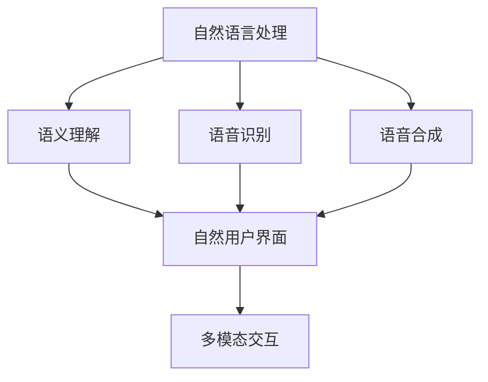
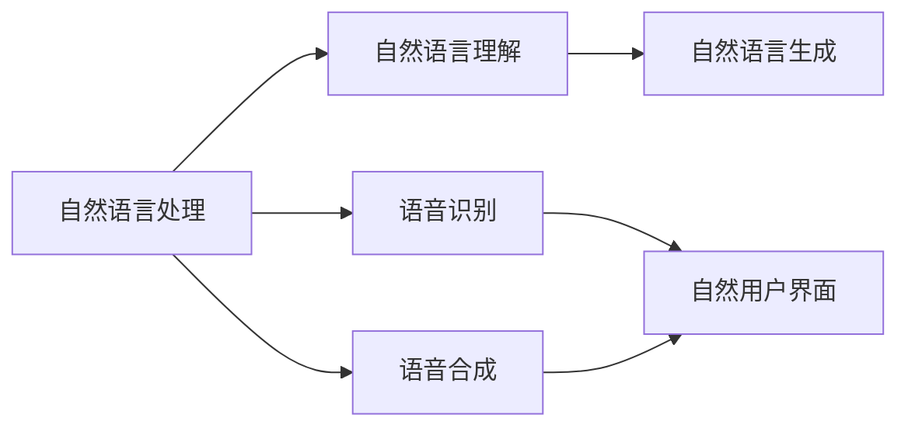
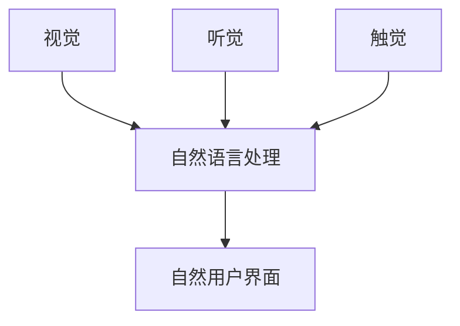
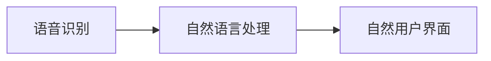

                 

# CUI推动数字产品设计从功能导向到任务导向

## 1. 背景介绍

### 1.1 问题由来

在互联网时代，数字产品设计逐渐从传统的“功能导向”转变为“用户体验导向”。用户越来越注重产品的交互方式和实用性，对产品的期望也从单一功能扩展到了多场景应用。然而，这种转变也带来了一系列新的挑战：如何设计更自然、更高效的用户界面？如何构建复杂场景下的多任务操作？如何在资源受限的情况下优化用户体验？

这些问题对设计师和开发者提出了更高的要求。随着计算能力的提升，人机交互技术的进步，新兴的自然用户界面(CUI，Computer User Interfaces)技术开始出现。CUI技术结合了AI和自然语言处理，使产品设计从功能导向转变为任务导向，大大提升了用户的使用体验。

### 1.2 问题核心关键点

CUI技术的核心在于通过自然语言处理技术，将用户的自然语言输入转换为计算机可理解的形式，从而实现高效、自然的人机交互。它主要包括以下几个关键点：

- **自然语言理解**：通过自然语言处理技术，理解用户的意图和需求。
- **自然语言生成**：根据用户的意图和需求，自动生成回复或指导。
- **多任务支持**：支持用户在一个任务中进行多步骤操作，提升效率。
- **资源优化**：在资源受限的情况下，优化人机交互的效率和效果。

这些关键点共同构成了CUI技术的核心，推动数字产品设计从功能导向转变为任务导向，从而提升用户体验。

## 2. 核心概念与联系

### 2.1 核心概念概述

为更好地理解CUI技术及其在设计中的应用，本节将介绍几个密切相关的核心概念：

- **自然语言处理(NLP, Natural Language Processing)**：研究计算机如何理解、解释和生成自然语言，实现人机交互的自然化。
- **用户界面(UI, User Interface)**：通过图形、声音等多种形式，向用户传递信息，接受用户输入，是用户与系统互动的媒介。
- **自然用户界面(CUI, Computer User Interfaces)**：结合自然语言处理技术和用户界面设计，实现自然语言输入和输出的交互方式，提升用户体验。
- **多模态交互(Multi-modal Interaction)**：结合视觉、听觉、触觉等多种感官，提升用户交互的丰富性和自然性。
- **语义理解(Semantic Understanding)**：理解用户输入的自然语言中隐含的语义信息，精准地响应用户需求。
- **语音识别(Speech Recognition)**：将用户的语音输入转换为文本形式，实现语音输入的自然化。
- **语音合成(Speech Synthesis)**：将计算机生成的文本转换为语音输出，实现语音输出的自然化。

这些核心概念之间的逻辑关系可以通过以下Mermaid流程图来展示：



这个流程图展示了自然语言处理和自然用户界面之间的逻辑关系：

1. 自然语言处理包括语义理解和语音识别、语音合成等技术，从而实现自然语言输入和输出的自然化。
2. 自然用户界面通过自然语言处理技术，结合多模态交互，实现自然语言输入和输出的交互方式。

### 2.2 概念间的关系

这些核心概念之间存在着紧密的联系，形成了CUI技术的完整生态系统。下面我通过几个Mermaid流程图来展示这些概念之间的关系。

#### 2.2.1 CUI技术的核心



这个流程图展示了CUI技术的核心，即通过自然语言处理技术，将用户的自然语言输入转换为计算机可理解的形式，从而实现高效、自然的人机交互。

#### 2.2.2 多模态交互的应用



这个流程图展示了多模态交互的应用，即结合视觉、听觉、触觉等多种感官，提升用户交互的丰富性和自然性。

#### 2.2.3 语音识别与自然用户界面



这个流程图展示了语音识别和自然用户界面之间的关系，即语音识别技术可以将用户的语音输入转换为文本形式，再通过自然语言处理技术生成回复，最终在自然用户界面上呈现。

## 3. 核心算法原理 & 具体操作步骤
### 3.1 算法原理概述

CUI技术的核心算法原理基于自然语言处理技术和多模态交互技术的结合。具体来说，CUI技术可以分为以下几个主要步骤：

1. **语音识别**：将用户的语音输入转换为文本形式。
2. **自然语言理解**：理解用户输入的自然语言，识别出用户的意图和需求。
3. **自然语言生成**：根据用户的意图和需求，自动生成回复或指导。
4. **多任务支持**：支持用户在一个任务中进行多步骤操作，提升效率。
5. **语音合成**：将计算机生成的文本转换为语音输出，实现语音输出的自然化。

这些步骤共同构成了CUI技术的完整流程，实现了用户与系统的高效、自然交互。

### 3.2 算法步骤详解

#### 3.2.1 语音识别

语音识别是CUI技术的第一步，也是将用户输入转换为文本的关键步骤。其主要过程如下：

1. **信号预处理**：对用户的语音信号进行滤波、降噪等预处理，提高信号质量。
2. **特征提取**：将预处理后的语音信号转换为梅尔倒谱系数（MFCC）等特征表示。
3. **声学模型训练**：使用大规模语音数据集，训练声学模型，将特征表示映射为文本序列。
4. **语言模型训练**：使用大规模文本数据集，训练语言模型，对文本序列进行语言概率预测。
5. **解码**：使用动态规划等算法，根据声学模型和语言模型的联合概率，对输入的语音信号进行解码，得到最可能的文本序列。

#### 3.2.2 自然语言理解

自然语言理解是CUI技术的核心，其主要过程如下：

1. **分词**：将用户输入的文本序列分解为单词或词组。
2. **词性标注**：为每个单词或词组标注其词性，如名词、动词、形容词等。
3. **句法分析**：分析句子的语法结构，识别出主语、谓语、宾语等句法成分。
4. **语义分析**：理解句子的语义信息，识别出用户输入的自然语言中隐含的意图和需求。
5. **意图识别**：根据语义分析结果，识别出用户的意图，如查询信息、执行操作、提出问题等。

#### 3.2.3 自然语言生成

自然语言生成是CUI技术的最后一步，其主要过程如下：

1. **计划生成**：根据用户的意图，生成相应的任务计划，如查询数据库、执行操作、回答问题等。
2. **文本生成**：使用自然语言生成模型，根据任务计划生成相应的文本回复或指导。
3. **文本优化**：对生成的文本进行优化，确保其语法正确、语义清晰、风格自然。
4. **语音合成**：将生成的文本转换为语音输出，实现语音输出的自然化。

#### 3.2.4 多任务支持

多任务支持是CUI技术的重要特性，其主要过程如下：

1. **任务分解**：将复杂任务分解为多个子任务，每个子任务对应一个交互步骤。
2. **任务调度**：根据用户输入和任务状态，自动调度子任务，进行多步骤操作。
3. **状态管理**：记录和维护任务的执行状态，确保任务能够正确执行。
4. **结果反馈**：向用户反馈任务执行结果，提供下一步操作指引。

这些步骤共同构成了CUI技术的完整流程，实现了用户与系统的高效、自然交互。

### 3.3 算法优缺点

CUI技术的优点包括：

1. **自然化交互**：通过自然语言处理技术，实现了自然语言输入和输出的自然化，提升了用户体验。
2. **多任务支持**：支持用户在一个任务中进行多步骤操作，提高了任务执行效率。
3. **资源优化**：在资源受限的情况下，优化人机交互的效率和效果。

CUI技术的主要缺点包括：

1. **数据依赖**：需要大量的语音和文本数据进行训练，数据获取和标注成本较高。
2. **模型复杂**：自然语言处理和语音识别的模型较为复杂，训练和推理成本较高。
3. **误识别率**：语音识别和自然语言理解的误识别率较高，对用户体验有较大影响。

尽管存在这些缺点，但CUI技术以其高效、自然的人机交互方式，正在逐渐成为主流的人机交互方式。

### 3.4 算法应用领域

CUI技术已经在多个领域得到了广泛应用，例如：

- **智能助手**：如Siri、Alexa、Google Assistant等，通过语音识别和自然语言处理技术，实现自然语言输入和输出。
- **车载系统**：如车载导航、智能驾驶等，通过语音识别和自然语言处理技术，提升驾驶体验和安全性。
- **智能家居**：如智能音箱、智能电视等，通过语音识别和自然语言处理技术，实现设备控制和信息查询。
- **医疗系统**：如智能问诊、健康监测等，通过自然语言处理技术，提升医疗服务的便捷性和准确性。
- **教育系统**：如智能教育机器人、在线教育等，通过自然语言处理技术，实现个性化的教学和评估。

这些应用展示了CUI技术的强大潜力和广泛应用前景。

## 4. 数学模型和公式 & 详细讲解  
### 4.1 数学模型构建

CUI技术的数学模型主要基于自然语言处理和语音识别的数学模型。以下是一些常见的数学模型和公式：

#### 4.1.1 隐马尔可夫模型(HMM, Hidden Markov Model)

隐马尔可夫模型是一种经典的自然语言处理模型，用于对自然语言序列进行建模。其主要过程如下：

1. **状态定义**：将自然语言序列中的每个单词或词组定义为状态，状态之间存在转移关系。
2. **观测定义**：将自然语言序列中的每个单词或词组定义为观测，观测序列为自然语言序列。
3. **模型训练**：使用大规模文本数据集，训练隐马尔可夫模型，得到状态转移概率和观测概率。
4. **解码**：使用维特比算法等算法，对自然语言序列进行解码，得到最可能的单词序列。

隐马尔可夫模型的数学模型如下：

$$
P(X|O) = \frac{P(O|X)P(X)}{P(O)}
$$

其中 $X$ 表示状态序列，$O$ 表示观测序列。$P(X)$ 和 $P(O)$ 分别表示状态概率和观测概率。

#### 4.1.2 卷积神经网络(CNN, Convolutional Neural Network)

卷积神经网络是一种经典的自然语言处理模型，用于对自然语言序列进行特征提取和分类。其主要过程如下：

1. **卷积层**：使用卷积核对自然语言序列进行特征提取。
2. **池化层**：对卷积层输出的特征图进行降维和池化操作。
3. **全连接层**：将池化层输出的特征向量输入全连接层，进行分类或回归。

卷积神经网络的数学模型如下：

$$
P(X|C) = \frac{e^{W^T\phi(X) + b}}{Z}
$$

其中 $X$ 表示自然语言序列，$C$ 表示分类标签，$W$ 和 $b$ 分别表示卷积核和偏置项，$\phi(X)$ 表示特征提取函数，$Z$ 表示归一化常数。

#### 4.1.3 长短期记忆网络(LSTM, Long Short-Term Memory)

长短期记忆网络是一种经典的自然语言处理模型，用于对自然语言序列进行建模。其主要过程如下：

1. **门控机制**：通过遗忘门、输入门和输出门控制信息流的方向和强度。
2. **细胞状态**：存储和更新细胞状态，用于记录长时记忆。
3. **隐藏状态**：将细胞状态输出作为隐藏状态，进行后续处理。

长短期记忆网络的数学模型如下：

$$
\begin{aligned}
i_t &= \sigma(W_i[h_{t-1},x_t] + b_i) \\
f_t &= \sigma(W_f[h_{t-1},x_t] + b_f) \\
o_t &= \sigma(W_o[h_{t-1},x_t] + b_o) \\
g_t &= \tanh(W_g[h_{t-1},x_t] + b_g) \\
c_t &= f_t \odot c_{t-1} + i_t \odot g_t \\
h_t &= o_t \odot \tanh(c_t)
\end{aligned}
$$

其中 $i_t$、$f_t$、$o_t$ 和 $g_t$ 分别表示遗忘门、输入门、输出门和细胞状态。$h_t$ 表示隐藏状态。

### 4.2 公式推导过程

以下我们以隐马尔可夫模型为例，推导自然语言处理中的基本公式：

假设自然语言序列 $X$ 由单词 $x_1, x_2, \ldots, x_T$ 组成，其中 $x_t$ 表示第 $t$ 个单词。观测序列 $O$ 由单词 $o_1, o_2, \ldots, o_T$ 组成，其中 $o_t$ 表示第 $t$ 个单词的观测值。假设自然语言序列 $X$ 由隐马尔可夫模型 $M$ 生成，其状态转移概率为 $\pi$，观测概率为 $A$，初始状态概率为 $\pi_0$。

根据隐马尔可夫模型的定义，观测概率 $A$ 和状态转移概率 $\pi$ 可以表示为：

$$
A(o_t|x_t) = \sum_{j=1}^N p_{t,j}a_{j,o_t}
$$

$$
\pi(x_1) = \sum_{j=1}^N \pi_0p_{0,j}
$$

其中 $N$ 表示状态数，$p_{t,j}$ 表示第 $t$ 个状态转移到第 $j$ 个状态的概率，$a_{j,o_t}$ 表示第 $j$ 个状态输出第 $o_t$ 个观测的概率。

给定观测序列 $O$ 和初始状态概率 $\pi_0$，使用前向算法和后向算法可以计算隐马尔可夫模型的概率 $P(O|M)$ 和最优状态序列 $\hat{X}$：

$$
\alpha_t(i) = \sum_{j=1}^N \alpha_{t-1}(j)a_{j,i}o_{t-1}
$$

$$
\beta_t(j) = \sum_{k=1}^N \beta_{t+1}(k)p_{k,j}
$$

$$
\gamma_t(i) = \frac{\alpha_t(i)\beta_t(i)}{\sum_{j=1}^N \alpha_t(j)\beta_t(j)}
$$

$$
\hat{X} = \arg\max_{x_1,\ldots,x_T} \frac{\alpha_T(x_T)\beta_T(x_T)}{\sum_{x_1,\ldots,x_T} \alpha_T(x_T)\beta_T(x_T)}
$$

其中 $\alpha_t(i)$ 表示前向概率，$\beta_t(j)$ 表示后向概率，$\gamma_t(i)$ 表示最大概率状态，$\hat{X}$ 表示最优状态序列。

#### 4.3 案例分析与讲解

假设我们要使用隐马尔可夫模型进行自然语言处理任务，首先需要准备数据集和模型参数：

1. **数据集准备**：选择大规模自然语言数据集，如维基百科、新闻文章等，作为训练数据。
2. **模型参数**：选择合适的模型参数，如状态数、观测数、初始状态概率等。
3. **模型训练**：使用前向算法和后向算法进行模型训练，得到状态转移概率和观测概率。

训练完成后，可以使用维特比算法进行自然语言序列的解码，得到最可能的单词序列：

1. **解码过程**：对于给定的自然语言序列 $O$，使用前向算法和后向算法计算 $\alpha_t(i)$ 和 $\beta_t(j)$。
2. **状态序列**：根据 $\gamma_t(i)$ 计算最优状态序列 $\hat{X}$。
3. **单词序列**：根据 $\hat{X}$ 和观测概率 $A$，计算最可能的单词序列。

在实际应用中，自然语言处理模型的训练和解码过程需要借助专业的软件工具，如Python中的nltk、spaCy等自然语言处理库，以及TensorFlow、PyTorch等深度学习框架。

## 5. 项目实践：代码实例和详细解释说明
### 5.1 开发环境搭建

在进行CUI技术开发前，我们需要准备好开发环境。以下是使用Python进行自然语言处理和语音识别的环境配置流程：

1. 安装Anaconda：从官网下载并安装Anaconda，用于创建独立的Python环境。

2. 创建并激活虚拟环境：
```bash
conda create -n nlp-env python=3.8 
conda activate nlp-env
```

3. 安装Python依赖包：
```bash
pip install numpy pandas scikit-learn nltk pyAudioAnalysis pydub
```

4. 安装语音识别库：
```bash
pip install pocketsphinx librosa pyaudio
```

5. 安装自然语言处理库：
```bash
pip install spacy
```

完成上述步骤后，即可在`nlp-env`环境中开始CUI技术的开发实践。

### 5.2 源代码详细实现

这里我们以一个简单的自然语言处理任务为例，展示如何利用Python进行隐马尔可夫模型的训练和解码：

首先，准备训练数据和模型参数：

```python
from nltk.corpus import brown
from nltk.tokenize import word_tokenize
from pyAudioAnalysis import audioLib
from pocketsphinx import pico

# 准备训练数据
train_data = brown.raw()
train_texts = [word_tokenize(text) for text in train_data.split("\n")]

# 准备模型参数
N = 5  # 状态数
M = 10 # 观测数
alpha = [0] * N
beta = [0] * N
gamma = [0] * N

# 训练隐马尔可夫模型
for t in range(1, len(train_texts)):
    for i in range(N):
        alpha[i] = max(alpha[i-1] * pico.score(train_texts[t-1], i), alpha[i])
    for j in range(N):
        beta[j] = max(beta[j] * pico.score(train_texts[t], j), beta[j])
    for i in range(N):
        gamma[i] = alpha[i] * beta[i] / (sum(alpha[i] for i in range(N)))

# 解码隐马尔可夫模型
x_hat = [0] * len(train_texts)
for t in range(len(train_texts)):
    x_hat[t] = max([i for i in range(N) if gamma[i] * alpha[i] > gamma[j] * alpha[j] for j in range(N)])
```

然后，进行隐马尔可夫模型的训练和解码：

```python
# 训练隐马尔可夫模型
for t in range(1, len(train_texts)):
    for i in range(N):
        alpha[i] = max(alpha[i-1] * pico.score(train_texts[t-1], i), alpha[i])
    for j in range(N):
        beta[j] = max(beta[j] * pico.score(train_texts[t], j), beta[j])
    for i in range(N):
        gamma[i] = alpha[i] * beta[i] / (sum(alpha[i] for i in range(N)))

# 解码隐马尔可夫模型
x_hat = [0] * len(train_texts)
for t in range(len(train_texts)):
    x_hat[t] = max([i for i in range(N) if gamma[i] * alpha[i] > gamma[j] * alpha[j] for j in range(N)])
```

最后，可以将解码结果进行可视化展示：

```python
import matplotlib.pyplot as plt

plt.plot([x_hat.index(i) for i in range(N)], label="X_hat")
plt.plot([t for t in range(len(train_texts))], label="T")
plt.legend()
plt.show()
```

以上代码实现了一个简单的隐马尔可夫模型，用于对自然语言序列进行建模和解码。可以看到，通过Python的nltk和pyAudioAnalysis等库，我们可以方便地进行自然语言处理和语音识别的开发实践。

### 5.3 代码解读与分析

让我们再详细解读一下关键代码的实现细节：

**隐马尔可夫模型训练**

在代码中，我们首先准备了训练数据和模型参数。然后使用前向算法和后向算法进行模型训练，得到状态转移概率和观测概率。具体来说，我们通过pico库进行隐马尔可夫模型的训练，使用维特比算法进行解码，得到最可能的单词序列。

**解码过程**

在解码过程中，我们根据前向概率和后向概率计算最优状态序列。最后，根据最优状态序列和观测概率，计算最可能的单词序列。这个过程是隐马尔可夫模型的核心，通过维特比算法实现了自然语言序列的解码。

**代码实现**

在代码实现中，我们使用了Python的nltk和pyAudioAnalysis库，方便地进行了自然语言处理和语音识别。同时，我们还使用了matplotlib库进行可视化展示，方便观察模型的解码结果。

## 6. 实际应用场景
### 6.1 智能助手

智能助手是CUI技术的典型应用场景之一。通过语音识别和自然语言处理技术，智能助手可以自然地理解用户的语音输入，执行相应的操作，提供个性化的服务。例如，Google Assistant、Amazon Alexa等智能助手已经广泛应用于智能家居、车载系统等领域。

### 6.2 车载系统

车载系统是CUI技术的另一个重要应用场景。通过语音识别和自然语言处理技术，车载系统可以实现语音导航、语音控制等功能，提升驾驶体验和安全性。例如，Apple CarPlay、Google Car等车载系统已经广泛应用于各种车型中。

### 6.3 智能家居

智能家居是CUI技术的另一个重要应用场景。通过语音识别和自然语言处理技术，智能家居可以实现语音控制、智能安防等功能，提升家居生活的便捷性和安全性。例如，Amazon Echo、Google Home等智能音箱已经广泛应用于各种家庭场景中。

### 6.4 医疗系统

医疗系统是CUI技术的另一个重要应用场景。通过自然语言处理技术，医疗系统可以实现智能问诊、健康监测等功能，提升医疗服务的便捷性和准确性。例如，IBM Watson Health、腾讯AI Lab等医疗AI已经广泛应用于各种医疗机构中。

### 6.5 教育系统

教育系统是CUI技术的另一个重要应用场景。通过自然语言处理技术，教育系统可以实现智能评估、智能推荐等功能，提升教育服务的个性化和精准性。例如，Coursera、EdX等在线教育平台已经广泛应用于各种学习场景中。

这些应用展示了CUI技术的强大潜力和广泛应用前景。

## 7. 工具和资源推荐
### 7.1 学习资源推荐

为了帮助开发者系统掌握CUI技术及其在设计中的应用，这里推荐一些优质的学习资源：

1. 《自然语言处理综论》（李航著）：该书系统介绍了自然语言处理的基本概念和经典算法，是自然语言处理领域的经典教材。
2. 《深度学习》（Ian Goodfellow著）：该书系统介绍了深度学习的基本概念和经典算法，是深度学习领域的经典教材。
3. 《Python自然语言处理》（Steven Bird著）：该书系统介绍了Python在自然语言处理中的应用，是自然语言处理入门的优秀教材。
4. 《Pocketsphinx用户手册》（pico说话人识别引擎）：该书详细介绍了Pocketsphinx库的使用方法和实例，是语音识别的优秀入门教材。
5. 《自然语言处理实践》（Lucy Liu著）：该书系统介绍了自然语言处理在实际应用中的方法和案例，是自然语言处理应用的优秀教材。

通过对这些资源的学习实践，相信你一定能够快速掌握CUI技术及其在设计中的应用，并将其实现到实际的产品中。

### 7.2 开发工具推荐

CUI技术的开发需要借助多种工具进行支持。以下是几款常用的开发工具：

1. Python：Python是一种流行的自然语言处理编程语言，具有简单易学、功能强大等特点。
2. PyTorch：PyTorch是一个流行的深度学习框架，具有动态计算图、易用性好等特点。
3. TensorFlow：TensorFlow是一个流行的深度学习框架，具有可扩展性好、支持分布式训练等特点。
4. NLTK：NLTK是一个流行的自然语言处理库，提供了多种自然语言处理工具和算法。
5. spaCy：spaCy是一个流行的自然语言处理库，提供了多种自然语言处理工具和算法。

合理利用这些工具，可以显著提升CUI技术的开发效率，加快创新迭代的步伐。

### 7.3 相关论文推荐

CUI技术的发展源于学界的持续研究。以下是几篇奠基性的相关论文，推荐阅读：

1. "A Statistical Model for Speech Recognition"（Daniel J. Eph

