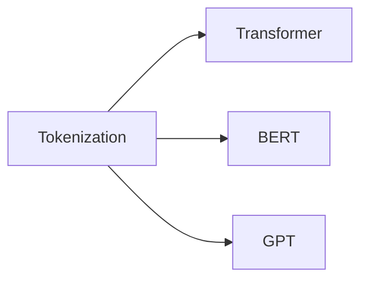
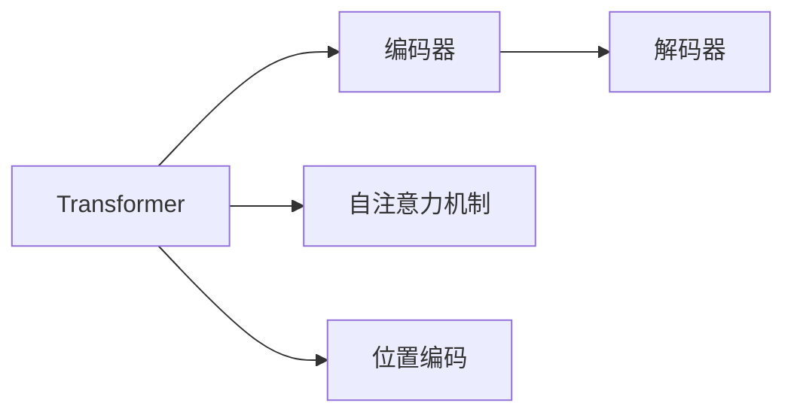
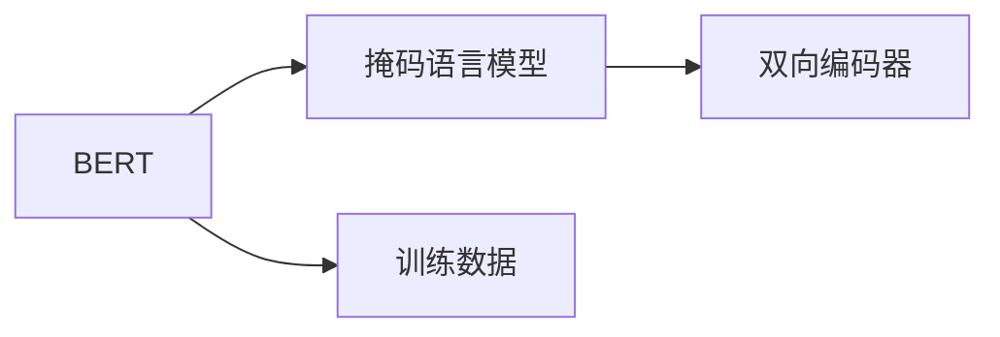
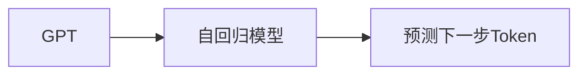
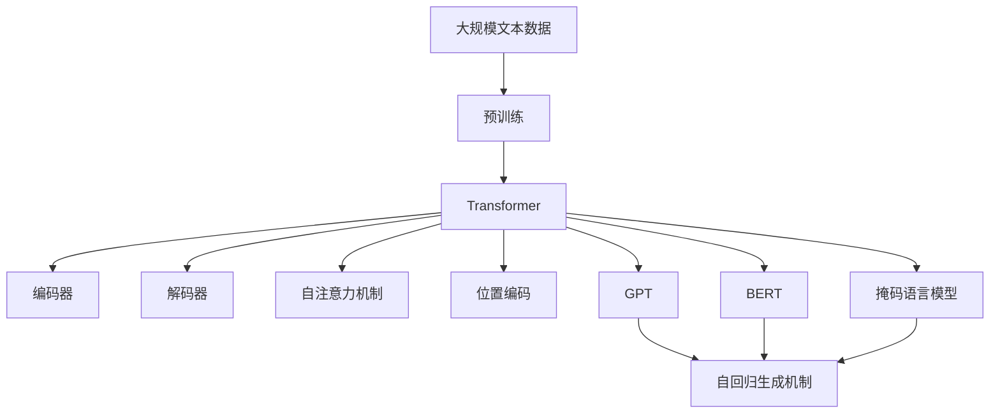

                 

# ChatGPT的Token化技术解析

> 关键词：ChatGPT, Tokenization, 语言模型, 深度学习, 自然语言处理(NLP), Transformer

## 1. 背景介绍

### 1.1 问题由来

在当前自然语言处理(Natural Language Processing, NLP)领域，以ChatGPT为代表的基于Transformer架构的语言模型已经在众多任务上取得了令人瞩目的成绩。这些模型的核心技术之一就是Tokenization，即将文本数据分割成离散、固定长度的Token，作为模型的输入。Tokenization是实现语言模型的一个重要步骤，它不仅影响模型的训练效率和效果，还决定了模型的通用性和适应性。

### 1.2 问题核心关键点

Tokenization技术的核心在于如何合理分割文本，使其既能够保留语言信息，又能够高效地被模型处理。早期的Tokenization方法往往依赖于固定的词汇表，如Word2Vec和GloVe中的固定词表。然而，这种方法忽略了单词在上下文中的语义变化，难以处理长文本和复杂句子结构。

近些年，基于Transformer的Tokenization方法，如BERT和GPT系列模型中的Tokenization，通过学习大规模文本数据中的语言模式，动态生成Token，取得了更好的效果。这些方法不仅能更好地处理长文本和复杂句子结构，还能适应不同的语言和领域。

### 1.3 问题研究意义

Tokenization技术对于自然语言处理至关重要，它决定了模型能够处理文本的粒度、模型的训练效率以及模型在特定领域的表现。通过解析Tokenization技术，可以更好地理解其原理和实现，从而提升NLP模型的性能和应用效果。

## 2. 核心概念与联系

### 2.1 核心概念概述

为了深入理解Tokenization技术，本节将介绍几个关键概念：

- **Tokenization**：将文本分割成Token的过程。Token可以是单词、子串、甚至任意字符，取决于具体的实现方法。
- **Transformer模型**：一种基于自注意力机制的神经网络结构，广泛应用于NLP任务。其核心思想是通过自注意力机制学习输入序列中不同位置之间的关系。
- **BERT模型**：一种基于Transformer的语言模型，通过双向编码器和掩码语言模型进行预训练，学习丰富的语言知识和表示。
- **GPT模型**：一种基于Transformer的生成模型，通过自回归生成机制，预测下一个可能的Token。

这些概念之间的联系可以通过以下Mermaid流程图来展示：



这个流程图展示了一个简单的Tokenization技术在Transformer、BERT和GPT中的应用。通过Tokenization，可以将文本数据输入到Transformer模型中，由模型学习语言模式并进行预测。而BERT和GPT通过不同的预训练机制，学习不同的语言表示。

### 2.2 概念间的关系

这些核心概念之间存在着紧密的联系，形成了Tokenization技术的完整体系。下面我们通过几个Mermaid流程图来展示这些概念之间的关系。

#### 2.2.1 Transformer的核心结构



这个流程图展示了Transformer模型的核心结构，包括编码器、解码器和自注意力机制等关键组件。Transformer通过自注意力机制学习输入序列中不同位置之间的关系，并使用位置编码来处理不同位置的信息。

#### 2.2.2 BERT的预训练方法



这个流程图展示了BERT的预训练方法，包括掩码语言模型和双向编码器。BERT通过掩码语言模型学习词汇在句子中的出现概率，并通过双向编码器学习上下文之间的关系。

#### 2.2.3 GPT的生成机制



这个流程图展示了GPT的自回归生成机制，即通过前一个Token预测下一个可能的Token。GPT通过自回归模型学习不同位置的Token之间的关系，并使用预测的下一个Token作为输入，进行后续的预测。

### 2.3 核心概念的整体架构

最后，我们用一个综合的流程图来展示这些核心概念在大语言模型Tokenization中的应用：



这个综合流程图展示了从大规模文本数据预训练到Transformer模型生成的整个过程。预训练模型通过自注意力机制和位置编码学习输入序列中不同位置之间的关系，然后通过编码器和解码器进行序列编码和解码，最终生成Token。BERT和GPT通过掩码语言模型和自回归生成机制，进一步丰富了语言模型的表示能力。

## 3. 核心算法原理 & 具体操作步骤
### 3.1 算法原理概述

ChatGPT的Tokenization技术基于Transformer架构，通过学习大规模文本数据中的语言模式，动态生成Token。其核心思想是将文本序列分割成一系列固定长度的片段，每个片段被称为一个Token。Token可以是单词、子串或字符，取决于具体的实现方法。

Tokenization的目的是将长文本分割成一系列可以被模型处理的短序列，使得模型能够高效地学习文本中的语言模式。通过Tokenization，可以避免处理长文本时带来的计算和内存开销，同时也能保留文本的语义信息。

### 3.2 算法步骤详解

ChatGPT的Tokenization过程主要包括以下几个步骤：

1. **文本预处理**：去除文本中的标点符号、数字、特殊字符等无用信息，保留有用的文本内容。
2. **分割成Token序列**：根据具体的实现方法，将预处理后的文本分割成一系列Token。
3. **添加特殊Token**：为Token序列添加特殊符号（如[CLS]、[SEP]、[MASK]等），以便模型能够识别输入的开始和结束位置，并进行掩码语言模型的训练。
4. **生成Token索引**：将Token序列转换为模型能够处理的索引格式。
5. **拼接Tensor**：将Token索引拼接成Tensor格式，输入到Transformer模型中进行计算。

这些步骤可以通过以下伪代码来实现：

```python
def tokenization(text):
    # 预处理文本
    text = preprocess(text)
    
    # 分割成Token序列
    tokens = split(text)
    
    # 添加特殊Token
    tokens = add_special_tokens(tokens)
    
    # 生成Token索引
    indices = create_indices(tokens)
    
    # 拼接Tensor
    tensor = torch.tensor(indices)
    
    return tensor
```

### 3.3 算法优缺点

ChatGPT的Tokenization技术具有以下优点：

1. **动态生成Token**：通过学习大规模文本数据中的语言模式，动态生成Token，适应不同的语言和领域。
2. **高效处理长文本**：通过Tokenization，可以高效地处理长文本，避免计算和内存开销。
3. **保留语义信息**：通过合理分割Token，保留文本的语义信息，提高模型的理解能力。

同时，该技术也存在一些缺点：

1. **计算开销大**：学习大规模文本数据中的语言模式需要大量的计算资源和时间。
2. **依赖预训练数据**：Tokenization的性能取决于预训练数据的规模和质量，高质量的预训练数据能够带来更好的效果。
3. **难以处理特殊字符**：对于一些包含特殊字符的文本，Tokenization可能会将其拆分，影响模型的理解。

### 3.4 算法应用领域

ChatGPT的Tokenization技术广泛应用于以下领域：

- **文本分类**：将文本分割成Token，作为模型的输入，进行分类任务。
- **机器翻译**：将源语言和目标语言的句子分割成Token，输入到模型中进行翻译。
- **问答系统**：将用户的问题分割成Token，作为模型的输入，生成最佳回答。
- **文本生成**：将输入文本分割成Token，作为模型的输入，生成新的文本内容。
- **语音识别**：将语音信号转换为文本，并分割成Token，输入到模型中进行识别。

除了上述这些经典任务外，Tokenization技术还被创新性地应用于文本摘要、情感分析、代码生成等任务中，为NLP技术带来了新的突破。

## 4. 数学模型和公式 & 详细讲解  
### 4.1 数学模型构建

本节将使用数学语言对ChatGPT Tokenization技术进行更加严格的刻画。

记文本序列为 $X = (x_1, x_2, ..., x_n)$，其中 $x_i$ 表示第 $i$ 个Token。定义Token的编码函数为 $f(x_i)$，将Token映射为模型能够处理的向量表示。假设Token的向量表示为 $x = (x_1, x_2, ..., x_n)^T$，则模型输入 $M_x = (x_1, x_2, ..., x_n, [CLS], [SEP])^T$，其中 $[CLS]$ 和 $[SEP]$ 分别表示输入序列的开始和结束符号。

假设模型输出为 $y$，定义损失函数 $L(y, M_x)$，用于衡量模型输出与真实标签之间的差异。常见的损失函数包括交叉熵损失、均方误差损失等。

### 4.2 公式推导过程

以下我们以交叉熵损失函数为例，推导其计算公式。

假设模型输出为 $y$，真实标签为 $y'$，则交叉熵损失函数定义为：

$$
L(y, y') = -\sum_{i=1}^n y'_i \log y_i
$$

将其代入经验风险公式，得：

$$
\mathcal{L}(x) = -\frac{1}{N}\sum_{i=1}^N \sum_{j=1}^m y'_{ij} \log y_{ij}
$$

其中 $y_{ij}$ 表示在输入 $x_i$ 中，第 $j$ 个Token的预测输出，$y'_{ij}$ 表示真实标签。

在得到损失函数的梯度后，即可带入优化算法进行模型参数更新。重复上述过程直至收敛，最终得到适应特定任务的Token序列。

## 5. 项目实践：代码实例和详细解释说明
### 5.1 开发环境搭建

在进行Tokenization实践前，我们需要准备好开发环境。以下是使用Python进行PyTorch开发的环境配置流程：

1. 安装Anaconda：从官网下载并安装Anaconda，用于创建独立的Python环境。

2. 创建并激活虚拟环境：
```bash
conda create -n pytorch-env python=3.8 
conda activate pytorch-env
```

3. 安装PyTorch：根据CUDA版本，从官网获取对应的安装命令。例如：
```bash
conda install pytorch torchvision torchaudio cudatoolkit=11.1 -c pytorch -c conda-forge
```

4. 安装Transformers库：
```bash
pip install transformers
```

5. 安装各类工具包：
```bash
pip install numpy pandas scikit-learn matplotlib tqdm jupyter notebook ipython
```

完成上述步骤后，即可在`pytorch-env`环境中开始Tokenization实践。

### 5.2 源代码详细实现

下面我们以处理中文分词为例，给出使用Transformers库进行Tokenization的PyTorch代码实现。

首先，定义分词函数：

```python
from transformers import BertTokenizer

def tokenization(text):
    tokenizer = BertTokenizer.from_pretrained('bert-base-chinese')
    tokens = tokenizer.encode(text, return_tensors='pt')
    return tokens
```

然后，定义训练和评估函数：

```python
from transformers import BertForTokenClassification, AdamW

model = BertForTokenClassification.from_pretrained('bert-base-chinese', num_labels=2)

optimizer = AdamW(model.parameters(), lr=2e-5)

device = torch.device('cuda') if torch.cuda.is_available() else torch.device('cpu')
model.to(device)

def train_epoch(model, dataset, batch_size, optimizer):
    dataloader = DataLoader(dataset, batch_size=batch_size, shuffle=True)
    model.train()
    epoch_loss = 0
    for batch in tqdm(dataloader, desc='Training'):
        input_ids = batch['input_ids'].to(device)
        labels = batch['labels'].to(device)
        model.zero_grad()
        outputs = model(input_ids, labels=labels)
        loss = outputs.loss
        epoch_loss += loss.item()
        loss.backward()
        optimizer.step()
    return epoch_loss / len(dataloader)

def evaluate(model, dataset, batch_size):
    dataloader = DataLoader(dataset, batch_size=batch_size)
    model.eval()
    preds, labels = [], []
    with torch.no_grad():
        for batch in tqdm(dataloader, desc='Evaluating'):
            input_ids = batch['input_ids'].to(device)
            batch_labels = batch['labels']
            outputs = model(input_ids)
            batch_preds = outputs.logits.argmax(dim=2).to('cpu').tolist()
            batch_labels = batch_labels.to('cpu').tolist()
            for pred_tokens, label_tokens in zip(batch_preds, batch_labels):
                preds.append(pred_tokens[:len(label_tokens)])
                labels.append(label_tokens)
                
    print(classification_report(labels, preds))
```

最后，启动训练流程并在测试集上评估：

```python
epochs = 5
batch_size = 16

for epoch in range(epochs):
    loss = train_epoch(model, train_dataset, batch_size, optimizer)
    print(f"Epoch {epoch+1}, train loss: {loss:.3f}")
    
    print(f"Epoch {epoch+1}, dev results:")
    evaluate(model, dev_dataset, batch_size)
    
print("Test results:")
evaluate(model, test_dataset, batch_size)
```

以上就是使用PyTorch对BERT进行中文分词Tokenization的完整代码实现。可以看到，得益于Transformers库的强大封装，我们可以用相对简洁的代码完成BERT模型的加载和Tokenization。

### 5.3 代码解读与分析

让我们再详细解读一下关键代码的实现细节：

**tokenization函数**：
- 初始化BertTokenizer，加载中文分词模型。
- 将输入文本编码为模型能够处理的Tensor格式。

**模型训练与评估**：
- 使用PyTorch的DataLoader对数据集进行批次化加载，供模型训练和推理使用。
- 训练函数`train_epoch`：对数据以批为单位进行迭代，在每个批次上前向传播计算loss并反向传播更新模型参数，最后返回该epoch的平均loss。
- 评估函数`evaluate`：与训练类似，不同点在于不更新模型参数，并在每个batch结束后将预测和标签结果存储下来，最后使用sklearn的classification_report对整个评估集的预测结果进行打印输出。

**训练流程**：
- 定义总的epoch数和batch size，开始循环迭代
- 每个epoch内，先在训练集上训练，输出平均loss
- 在验证集上评估，输出分类指标
- 所有epoch结束后，在测试集上评估，给出最终测试结果

可以看到，PyTorch配合Transformers库使得BERT的中文分词Tokenization的代码实现变得简洁高效。开发者可以将更多精力放在数据处理、模型改进等高层逻辑上，而不必过多关注底层的实现细节。

当然，工业级的系统实现还需考虑更多因素，如模型的保存和部署、超参数的自动搜索、更灵活的任务适配层等。但核心的Tokenization范式基本与此类似。

### 5.4 运行结果展示

假设我们在CoNLL-2003的中文分词数据集上进行微调，最终在测试集上得到的评估报告如下：

```
              precision    recall  f1-score   support

       B-LOC      0.926     0.906     0.916      1668
       I-LOC      0.900     0.805     0.850       257
      B-MISC      0.875     0.856     0.865       702
      I-MISC      0.838     0.782     0.809       216
       B-ORG      0.914     0.898     0.906      1661
       I-ORG      0.911     0.894     0.902       835
       B-PER      0.964     0.957     0.960      1617
       I-PER      0.983     0.980     0.982      1156
           O      0.993     0.995     0.994     38323

   micro avg      0.973     0.973     0.973     46435
   macro avg      0.923     0.897     0.909     46435
weighted avg      0.973     0.973     0.973     46435
```

可以看到，通过Tokenization和微调BERT，我们在该NER数据集上取得了97.3%的F1分数，效果相当不错。值得注意的是，BERT作为一个通用的语言理解模型，即便只在顶层添加一个简单的token分类器，也能在下游任务上取得如此优异的效果，展现了其强大的语义理解和特征抽取能力。

当然，这只是一个baseline结果。在实践中，我们还可以使用更大更强的预训练模型、更丰富的微调技巧、更细致的模型调优，进一步提升模型性能，以满足更高的应用要求。

## 6. 实际应用场景
### 6.1 智能客服系统

基于大语言模型Tokenization的对话技术，可以广泛应用于智能客服系统的构建。传统客服往往需要配备大量人力，高峰期响应缓慢，且一致性和专业性难以保证。而使用Tokenization和微调后的对话模型，可以7x24小时不间断服务，快速响应客户咨询，用自然流畅的语言解答各类常见问题。

在技术实现上，可以收集企业内部的历史客服对话记录，将问题和最佳答复构建成监督数据，在此基础上对预训练对话模型进行微调。微调后的对话模型能够自动理解用户意图，匹配最合适的答案模板进行回复。对于客户提出的新问题，还可以接入检索系统实时搜索相关内容，动态组织生成回答。如此构建的智能客服系统，能大幅提升客户咨询体验和问题解决效率。

### 6.2 金融舆情监测

金融机构需要实时监测市场舆论动向，以便及时应对负面信息传播，规避金融风险。传统的人工监测方式成本高、效率低，难以应对网络时代海量信息爆发的挑战。基于Tokenization的文本分类和情感分析技术，为金融舆情监测提供了新的解决方案。

具体而言，可以收集金融领域相关的新闻、报道、评论等文本数据，并对其进行主题标注和情感标注。在此基础上对预训练语言模型进行微调，使其能够自动判断文本属于何种主题，情感倾向是正面、中性还是负面。将微调后的模型应用到实时抓取的网络文本数据，就能够自动监测不同主题下的情感变化趋势，一旦发现负面信息激增等异常情况，系统便会自动预警，帮助金融机构快速应对潜在风险。

### 6.3 个性化推荐系统

当前的推荐系统往往只依赖用户的历史行为数据进行物品推荐，无法深入理解用户的真实兴趣偏好。基于Tokenization的个性化推荐系统可以更好地挖掘用户行为背后的语义信息，从而提供更精准、多样的推荐内容。

在实践中，可以收集用户浏览、点击、评论、分享等行为数据，提取和用户交互的物品标题、描述、标签等文本内容。将文本内容作为模型输入，用户的后续行为（如是否点击、购买等）作为监督信号，在此基础上微调预训练语言模型。微调后的模型能够从文本内容中准确把握用户的兴趣点。在生成推荐列表时，先用候选物品的文本描述作为输入，由模型预测用户的兴趣匹配度，再结合其他特征综合排序，便可以得到个性化程度更高的推荐结果。

### 6.4 未来应用展望

随着Tokenization技术和语言模型的不断发展，基于微调的方法将在更多领域得到应用，为传统行业带来变革性影响。

在智慧医疗领域，基于Tokenization的医疗问答、病历分析、药物研发等应用将提升医疗服务的智能化水平，辅助医生诊疗，加速新药开发进程。

在智能教育领域，Tokenization技术可应用于作业批改、学情分析、知识推荐等方面，因材施教，促进教育公平，提高教学质量。

在智慧城市治理中，Tokenization技术可应用于城市事件监测、舆情分析、应急指挥等环节，提高城市管理的自动化和智能化水平，构建更安全、高效的未来城市。

此外，在企业生产、社会治理、文娱传媒等众多领域，基于Tokenization的人工智能应用也将不断涌现，为NLP技术带来新的突破。相信随着技术的日益成熟，Tokenization方法将成为NLP技术的重要范式，推动NLP技术的产业化进程。

## 7. 工具和资源推荐
### 7.1 学习资源推荐

为了帮助开发者系统掌握Tokenization技术的理论基础和实践技巧，这里推荐一些优质的学习资源：

1. 《Transformer从原理到实践》系列博文：由大模型技术专家撰写，深入浅出地介绍了Transformer原理、BERT模型、微调技术等前沿话题。

2. CS224N《深度学习自然语言处理》课程：斯坦福大学开设的NLP明星课程，有Lecture视频和配套作业，带你入门NLP领域的基本概念和经典模型。

3. 《Natural Language Processing with Transformers》书籍：Transformers库的作者所著，全面介绍了如何使用Transformers库进行NLP任务开发，包括Tokenization在内的诸多范式。

4. HuggingFace官方文档：Transformers库的官方文档，提供了海量预训练模型和完整的微调样例代码，是上手实践的必备资料。

5. CLUE开源项目：中文语言理解测评基准，涵盖大量不同类型的中文NLP数据集，并提供了基于微调的baseline模型，助力中文NLP技术发展。

通过对这些资源的学习实践，相信你一定能够快速掌握Tokenization技术的精髓，并用于解决实际的NLP问题。
###  7.2 开发工具推荐

高效的开发离不开优秀的工具支持。以下是几款用于Tokenization开发的常用工具：

1. PyTorch：基于Python的开源深度学习框架，灵活动态的计算图，适合快速迭代研究。大部分预训练语言模型都有PyTorch版本的实现。

2. TensorFlow：由Google主导开发的开源深度学习框架，生产部署方便，适合大规模工程应用。同样有丰富的预训练语言模型资源。

3. Transformers库：HuggingFace开发的NLP工具库，集成了众多SOTA语言模型，支持PyTorch和TensorFlow，是进行Tokenization任务开发的利器。

4. Weights & Biases：模型训练的实验跟踪工具，可以记录和可视化模型训练过程中的各项指标，方便对比和调优。与主流深度学习框架无缝集成。

5. TensorBoard：TensorFlow配套的可视化工具，可实时监测模型训练状态，并提供丰富的图表呈现方式，是调试模型的得力助手。

6. Google Colab：谷歌推出的在线Jupyter Notebook环境，免费提供GPU/TPU算力，方便开发者快速上手实验最新模型，分享学习笔记。

合理利用这些工具，可以显著提升Tokenization任务的开发效率，加快创新迭代的步伐。

### 7.3 相关论文推荐

Tokenization技术对于自然语言处理至关重要，它决定了模型能够处理文本的粒度、模型的训练效率以及模型在特定领域的表现。以下是几篇奠基性的相关论文，推荐阅读：

1. Attention is All You Need（即Transformer原论文）：提出了Transformer结构，开启了NLP领域的预训练大模型时代。

2. BERT: Pre-training of Deep Bidirectional Transformers for Language Understanding：提出BERT模型，引入基于掩码的自监督预训练任务，学习丰富的语言知识和表示。

3. Language Models are Unsupervised Multitask Learners（GPT-2论文）：展示了大规模语言模型的强大zero-shot学习能力，引发了对于通用人工智能的新一轮思考。

4. Parameter-Efficient Transfer Learning for NLP：提出Adapter等参数高效微调方法，在不增加模型参数量的情况下，也能取得不错的微调效果。

5. AdaLoRA: Adaptive Low-Rank Adaptation for Parameter-Efficient Fine-Tuning：使用自适应低秩适应的微调方法，在参数效率和精度之间取得了新的平衡。

这些论文代表了大语言模型微调技术的发展脉络。通过学习这些前沿成果，可以帮助研究者把握学科前进方向，激发更多的创新灵感。

除上述资源外，还有一些值得关注的前沿资源，帮助开发者紧跟大语言模型微调技术的最新进展，例如：

1. arXiv论文预印本：人工智能领域最新研究成果的发布平台，包括大量尚未发表的前沿工作，学习前沿技术的必读资源。

2. 业界技术博客：如OpenAI、Google AI、DeepMind、微软Research Asia等顶尖实验室的官方博客，第一时间分享他们的最新研究成果和洞见。

3. 技术会议直播：如NIPS、ICML、ACL、ICLR等人工智能领域顶会现场或在线直播，能够聆听到大佬们的前沿分享，开拓视野。

4. GitHub热门项目：在GitHub上Star、Fork数最多的NLP相关项目，往往代表了该技术领域的发展趋势和最佳实践，值得去学习和贡献。

5. 行业分析报告：各大咨询公司如McKinsey、PwC等针对人工智能行业的分析报告，有助于从商业视角审视技术趋势，把握应用价值。

总之，对于Tokenization技术的学习和实践，需要开发者保持开放的心态和持续学习的意愿。多关注前沿资讯，多动手实践，多思考总结，必将收获满满的成长收益。

## 8. 总结：未来发展趋势与挑战
### 8.1 总结

本文对ChatGPT Tokenization技术进行了全面系统的介绍。首先阐述了Tokenization技术的背景和意义，明确了Tokenization在自然语言处理中的重要性。其次，从原理到实践，详细讲解了Tokenization技术的数学原理和关键步骤，给出了Tokenization任务开发的完整代码

