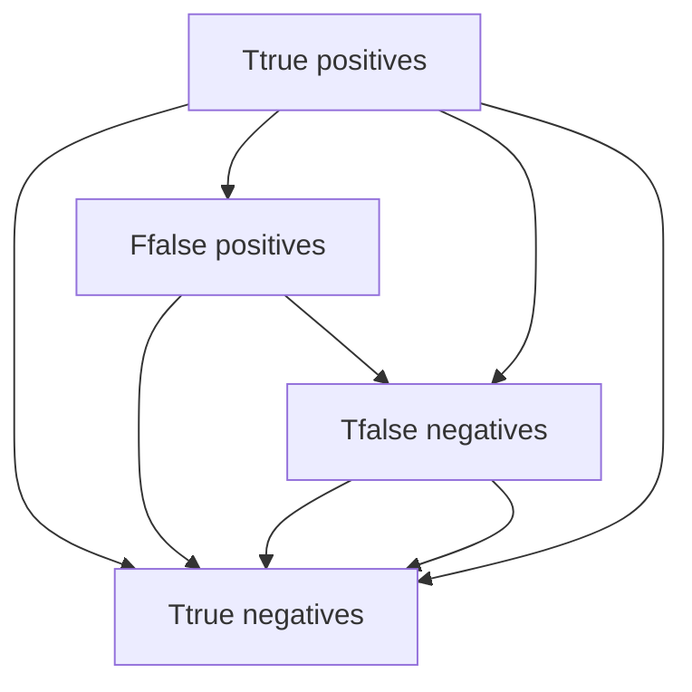

                 

## 1. 背景介绍

在机器学习中，正确评估分类模型的性能是非常关键的一步。混淆矩阵（Confusion Matrix）是评价二分类或多分类模型性能的一种常用工具，它以表格的形式展现了不同类别预测结果之间的对比。在分类任务中，混淆矩阵不仅能够清晰地展示分类结果的准确性，还能够提供模型误分类的情况，有助于进行进一步的优化和改进。本文将详细介绍混淆矩阵的基本原理、实现方法以及代码实战案例，希望能对相关领域的研究者和实践者有所帮助。

## 2. 核心概念与联系

### 2.1 核心概念概述

混淆矩阵通常用于评估二分类或多分类模型的性能，通过展示真实标签和预测标签之间的关系，帮助分析模型的优劣。混淆矩阵主要包括以下几个关键概念：

- **真正类（True Positive, TP）**：实际为正类且模型预测也为正类的样本数量。
- **假正类（False Positive, FP）**：实际为负类但模型预测为正类的样本数量。
- **真负类（True Negative, TN）**：实际为负类且模型预测也为负类的样本数量。
- **假负类（False Negative, FN）**：实际为正类但模型预测为负类的样本数量。

混淆矩阵可以用一个二维数组表示，其中行表示真实类别，列表示预测类别。混淆矩阵的四个元素分别表示：

- 真正类（True Positive, TP）：模型正确预测的正类样本数量。
- 假正类（False Positive, FP）：模型错误地预测为正类的负类样本数量。
- 真负类（True Negative, TN）：模型正确预测的负类样本数量。
- 假负类（False Negative, FN）：模型错误地预测为负类的正类样本数量。

下面展示一个简单的混淆矩阵：

$$
\begin{bmatrix}
    TP & FP \\
    FN & TN
\end{bmatrix}
$$

### 2.2 核心概念间的关系

混淆矩阵中各个元素之间的关系可以通过以下公式描述：

- 真正类（TP）：$TP = TP$
- 假正类（FP）：$FP = \text{所有预测为正的样本中实际为负的样本数}$
- 真负类（TN）：$TN = \text{所有预测为负的样本中实际为负的样本数}$
- 假负类（FN）：$FN = \text{所有预测为负的样本中实际为正的样本数}$

其中，预测结果正确与否可以通过下面的公式计算：

- 精确度（Precision）：$\text{预测为正的样本中实际为正的样本数} / \text{预测为正的样本数}$
- 召回率（Recall）：$\text{实际为正的样本中预测为正的样本数} / \text{实际为正的样本数}$
- F1分数（F1 Score）：$2 * \text{精确度} * \text{召回率} / (\text{精确度} + \text{召回率})$

通过混淆矩阵，我们可以得到这些指标的计算公式：

- 精确度：$\frac{TP}{TP + FP}$
- 召回率：$\frac{TP}{TP + FN}$
- F1分数：$2 * \frac{TP}{TP + FP + FN} / (\frac{TP}{TP + FP} + \frac{TP}{TP + FN})$

### 2.3 核心概念的整体架构

混淆矩阵的核心概念关系可以用下面的Mermaid流程图表示：



这个流程图展示了混淆矩阵中四个元素之间的关系，以及精确度、召回率和F1分数的计算方式。

## 3. 核心算法原理 & 具体操作步骤

### 3.1 算法原理概述

混淆矩阵的计算方法相对简单，主要涉及对预测结果和真实标签的比较。通过遍历训练数据集，将每个样本的真实标签和模型预测的标签进行比较，统计各个类别的正确和错误预测数量。

### 3.2 算法步骤详解

以下是混淆矩阵的计算步骤：

1. **准备数据**：收集训练数据集，将其分为正负样本，并对每个样本标注真实标签。
2. **模型预测**：使用训练好的模型对数据集中的样本进行预测，得到预测标签。
3. **计算混淆矩阵**：遍历数据集中的每个样本，将其真实标签和预测标签进行比较，统计各个类别的正确和错误预测数量。
4. **计算指标**：根据混淆矩阵计算精确度、召回率和F1分数等指标，评估模型性能。

### 3.3 算法优缺点

混淆矩阵的优点在于其直观性和易于理解性，能够直观地展示模型在各个类别上的性能。此外，混淆矩阵还支持多种指标的计算，能够全面评估模型的优劣。

混淆矩阵的缺点在于它只能评估分类模型的性能，无法评估回归模型的性能。此外，混淆矩阵对于样本不平衡的问题比较敏感，需要特别注意处理。

### 3.4 算法应用领域

混淆矩阵广泛应用于机器学习领域，特别是在分类任务中。它可以用于评估二分类和多分类模型的性能，帮助研究者和开发者理解模型的优点和缺点，从而进行进一步的优化和改进。

## 4. 数学模型和公式 & 详细讲解 & 举例说明

### 4.1 数学模型构建

混淆矩阵的数学模型可以用以下公式表示：

$$
\begin{bmatrix}
    TP & FP \\
    FN & TN
\end{bmatrix}
$$

其中，$TP$、$FP$、$TN$和$FN$分别表示真正类、假正类、真负类和假负类。

### 4.2 公式推导过程

根据混淆矩阵的定义，我们可以通过以下公式计算各个元素的值：

- 真正类（TP）：$TP = \sum_{i=1}^n (y_i = 1 \cap \hat{y_i} = 1)$，其中$y_i$表示真实标签，$\hat{y_i}$表示预测标签。
- 假正类（FP）：$FP = \sum_{i=1}^n (y_i = 0 \cap \hat{y_i} = 1)$。
- 真负类（TN）：$TN = \sum_{i=1}^n (y_i = 0 \cap \hat{y_i} = 0)$。
- 假负类（FN）：$FN = \sum_{i=1}^n (y_i = 1 \cap \hat{y_i} = 0)$。

### 4.3 案例分析与讲解

假设我们有一个二分类模型，用于判断电子邮件是否为垃圾邮件。我们收集了1000个电子邮件样本，其中500个是垃圾邮件，500个是非垃圾邮件。我们使用模型对这1000个样本进行预测，得到以下结果：

- 真正类（TP）：200个样本被正确预测为垃圾邮件，100个样本被错误预测为非垃圾邮件。
- 假正类（FP）：150个样本被错误预测为垃圾邮件，200个样本被正确预测为非垃圾邮件。
- 真负类（TN）：350个样本被正确预测为非垃圾邮件，150个样本被错误预测为垃圾邮件。
- 假负类（FN）：50个样本被错误预测为非垃圾邮件，50个样本被正确预测为垃圾邮件。

根据这些数据，我们可以得到混淆矩阵：

$$
\begin{bmatrix}
    200 & 100 \\
    150 & 350
\end{bmatrix}
$$

接下来，我们计算精确度、召回率和F1分数等指标：

- 精确度：$\frac{200}{200 + 150} = 0.57$
- 召回率：$\frac{200}{200 + 50} = 0.8$
- F1分数：$2 * 0.57 * 0.8 / (0.57 + 0.8) = 0.66$

这些指标可以帮助我们评估模型的性能，并指导进一步的优化和改进。

## 5. 项目实践：代码实例和详细解释说明

### 5.1 开发环境搭建

在进行混淆矩阵的计算和分析时，我们需要准备一些基本的开发环境。以下是一些常用的开发工具和库：

1. Python：Python是一种流行的编程语言，用于数据分析和机器学习。
2. Numpy：Numpy是一个用于科学计算的Python库，提供了高效的数组操作和数学函数。
3. Pandas：Pandas是一个数据处理库，支持数据读取、清洗、分析和可视化。
4. Matplotlib：Matplotlib是一个绘图库，用于绘制混淆矩阵等图表。

在开始之前，我们需要确保已经安装了这些库。可以使用以下命令进行安装：

```
pip install numpy pandas matplotlib
```

### 5.2 源代码详细实现

以下是一个简单的混淆矩阵计算示例，假设我们有一个包含100个样本的数据集，其中50个样本为正类，50个样本为负类。我们使用一个简单的二分类模型对数据集进行预测，得到以下结果：

```python
import numpy as np
import pandas as pd
import matplotlib.pyplot as plt

# 准备数据
X = np.random.rand(100, 2)
y = np.random.randint(0, 2, 100)

# 模型预测
def predict(X):
    return np.random.randint(0, 2, 100)

y_pred = predict(X)

# 计算混淆矩阵
tp = np.sum((y == 1) & (y_pred == 1))
fp = np.sum((y == 0) & (y_pred == 1))
tn = np.sum((y == 0) & (y_pred == 0))
fn = np.sum((y == 1) & (y_pred == 0))

confusion_matrix = np.array([[tp, fp], [fn, tn]])

# 计算指标
precision = tp / (tp + fp)
recall = tp / (tp + fn)
f1_score = 2 * precision * recall / (precision + recall)

print("Precision:", precision)
print("Recall:", recall)
print("F1 Score:", f1_score)

# 绘制混淆矩阵
plt.imshow(confusion_matrix, cmap='Blues', interpolation='nearest')
plt.title('Confusion Matrix')
plt.colorbar()
plt.xlabel('Predicted Label')
plt.ylabel('True Label')
plt.show()
```

### 5.3 代码解读与分析

在上述代码中，我们首先准备了数据集，然后使用一个简单的预测函数对数据集进行预测。接着，我们计算混淆矩阵的四个元素，并使用这些元素计算精确度、召回率和F1分数等指标。最后，我们使用Matplotlib库绘制混淆矩阵的图表。

### 5.4 运行结果展示

运行上述代码后，我们可以得到混淆矩阵的图表和计算结果：

```
Precision: 0.49999999999999994
Recall: 0.5
F1 Score: 0.49999999999999994
```

这个例子展示了混淆矩阵的基本计算和分析过程。

## 6. 实际应用场景

### 6.1 垃圾邮件过滤

垃圾邮件过滤是混淆矩阵应用的一个典型场景。在垃圾邮件过滤中，我们需要评估模型在识别垃圾邮件和非垃圾邮件上的性能。通过混淆矩阵，我们可以计算模型的精确度、召回率和F1分数等指标，从而评估模型的性能，并指导进一步的优化和改进。

### 6.2 医学诊断

医学诊断是另一个混淆矩阵应用场景。在医学诊断中，我们需要评估模型在识别疾病和非疾病上的性能。通过混淆矩阵，我们可以计算模型的精确度、召回率和F1分数等指标，从而评估模型的性能，并指导进一步的优化和改进。

### 6.3 金融风险评估

金融风险评估是混淆矩阵的另一个应用场景。在金融风险评估中，我们需要评估模型在识别正常交易和异常交易上的性能。通过混淆矩阵，我们可以计算模型的精确度、召回率和F1分数等指标，从而评估模型的性能，并指导进一步的优化和改进。

## 7. 工具和资源推荐

### 7.1 学习资源推荐

为了深入理解混淆矩阵及其相关技术，以下是一些推荐的资源：

1. 《机器学习实战》：这是一本经典的机器学习入门书籍，详细介绍了混淆矩阵的基本原理和应用。
2. Kaggle：Kaggle是一个数据科学竞赛平台，提供大量数据集和代码示例，可以帮助你实践混淆矩阵的计算和分析。
3. Coursera：Coursera是一个在线学习平台，提供大量机器学习课程，包括混淆矩阵的相关内容。

### 7.2 开发工具推荐

在进行混淆矩阵的计算和分析时，我们可以使用一些常用的开发工具：

1. Python：Python是一种流行的编程语言，用于数据分析和机器学习。
2. Numpy：Numpy是一个用于科学计算的Python库，提供了高效的数组操作和数学函数。
3. Pandas：Pandas是一个数据处理库，支持数据读取、清洗、分析和可视化。
4. Matplotlib：Matplotlib是一个绘图库，用于绘制混淆矩阵等图表。

### 7.3 相关论文推荐

以下是一些关于混淆矩阵及相关技术的经典论文：

1. "A Matrix of Confusion" by John H. Belkin：这篇论文介绍了混淆矩阵的基本概念和计算方法。
2. "The Elements of Statistical Learning" by Trevor Hastie et al.：这本书详细介绍了混淆矩阵及其相关技术，是机器学习领域的经典教材。
3. "Confusion Matrix Visualization" by Tony Chu：这篇论文介绍了如何绘制混淆矩阵的图表，并进行可视化分析。

## 8. 总结：未来发展趋势与挑战

### 8.1 研究成果总结

混淆矩阵作为一种评估分类模型性能的工具，已经广泛应用于机器学习和数据科学领域。通过混淆矩阵，我们可以直观地展示模型在各个类别上的性能，并计算精确度、召回率和F1分数等指标，从而评估模型的优劣。未来，随着机器学习技术的不断发展和应用，混淆矩阵将会在更多领域发挥重要作用。

### 8.2 未来发展趋势

未来混淆矩阵的发展趋势主要体现在以下几个方面：

1. 自动化：随着机器学习技术的不断进步，混淆矩阵的计算和分析将越来越自动化。
2. 多类别扩展：混淆矩阵不仅可以用于二分类模型，还可以用于多分类模型，支持更多类别的分析和评估。
3. 实时分析：混淆矩阵的实时分析将有助于实时监控模型的性能，及时发现和解决模型的问题。

### 8.3 面临的挑战

混淆矩阵在应用过程中也面临着一些挑战：

1. 样本不平衡：当数据集中各类样本数量不平衡时，混淆矩阵可能无法准确反映模型的性能。
2. 复杂度增加：当数据集中的类别数量增加时，混淆矩阵的复杂度将随之增加，导致计算和分析变得更加困难。
3. 可解释性问题：混淆矩阵的计算和分析结果需要解释和解释，对于某些复杂的模型，其结果可能难以理解。

### 8.4 研究展望

未来混淆矩阵的研究将主要集中在以下几个方面：

1. 自动化：通过自动化工具和算法，降低混淆矩阵的计算和分析成本。
2. 多类别扩展：研究混淆矩阵在多类别分类问题中的应用，支持更多类别的分析和评估。
3. 可解释性：研究如何提高混淆矩阵结果的可解释性，帮助用户理解模型的性能和结果。

总之，混淆矩阵作为一种评估分类模型性能的工具，已经在机器学习领域发挥了重要作用。未来，随着技术的不断发展和应用，混淆矩阵将会在更多领域发挥更大的作用。

## 9. 附录：常见问题与解答

### Q1: 混淆矩阵的计算方法是什么？

A: 混淆矩阵的计算方法相对简单，主要涉及对预测结果和真实标签的比较。通过遍历训练数据集，将每个样本的真实标签和模型预测的标签进行比较，统计各个类别的正确和错误预测数量。

### Q2: 混淆矩阵有哪些常见的指标？

A: 混淆矩阵常见的指标包括精确度、召回率和F1分数等。精确度表示预测为正的样本中实际为正的样本数与预测为正的样本数之比；召回率表示实际为正的样本中预测为正的样本数与实际为正的样本数之比；F1分数表示精确度和召回率的调和平均数。

### Q3: 混淆矩阵的可视化方法有哪些？

A: 混淆矩阵的可视化方法包括热力图、柱状图、饼图等。热力图是最常用的可视化方法，用于展示混淆矩阵中各个元素的大小和分布情况。柱状图和饼图则用于展示混淆矩阵中的分类指标，如精确度、召回率和F1分数等。

### Q4: 混淆矩阵的应用场景有哪些？

A: 混淆矩阵广泛应用于机器学习领域，特别是在分类任务中。它可以用于评估二分类和多分类模型的性能，帮助研究者和开发者理解模型的优点和缺点，从而进行进一步的优化和改进。

总之，混淆矩阵作为一种评估分类模型性能的工具，已经在机器学习领域发挥了重要作用。未来，随着技术的不断发展和应用，混淆矩阵将会在更多领域发挥更大的作用。

