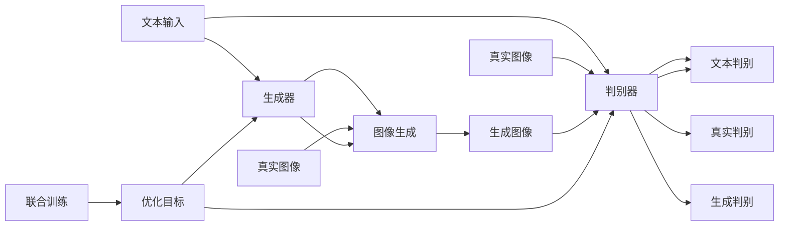

                 

# DALL-E原理与代码实例讲解

## 1. 背景介绍

### 1.1 问题由来
DALL-E是由OpenAI开发的一款基于生成对抗网络(Generative Adversarial Networks, GANs)的大规模视觉生成模型。该模型通过自监督学习和大量有标签数据训练，能够根据输入的文字描述生成对应的图像，实现“以文生图”的能力。近年来，DALL-E等生成模型在图像生成、艺术创作、虚拟现实等领域取得了突破性进展，成为生成式AI研究的热点方向。

### 1.2 问题核心关键点
DALL-E的成功源于其基于大规模视觉数据和文本数据的联合训练，通过不断优化生成器和判别器模型，生成与输入文本高度相关的图像。这一过程包括训练数据的准备、模型架构的设计、训练流程的设定等多个关键环节，其核心在于如何构建有效的生成对抗网络，以及如何处理文本和图像的跨模态融合。

### 1.3 问题研究意义
DALL-E的研究不仅推动了生成式AI技术的发展，也启发了更广泛领域的跨模态学习和多模态推理。通过对DALL-E原理的深入理解和代码实例的详细讲解，希望能为AI研究者和开发者提供清晰的理论指导和实践操作指南，加速DALL-E技术的应用落地。

## 2. 核心概念与联系

### 2.1 核心概念概述

DALL-E模型基于生成对抗网络(GANs)框架，由生成器和判别器两个子模块构成：

- **生成器(Generator)**：接收文本输入，生成与描述内容相符的图像。生成器通过多层卷积神经网络(Convolutional Neural Networks, CNNs)和全连接层(FC layers)，将输入文本映射为图像像素，生成器不断优化生成图像的质量和多样性。

- **判别器(Discriminator)**：接收文本-图像对，判断图像是否与描述内容匹配。判别器通过多层卷积神经网络(CNNs)和全连接层(FC layers)，学习将真实图像和生成图像区分开来。

两个模块相互博弈，不断提升自身的生成能力和判别能力，最终生成逼真的图像。

### 2.2 概念间的关系

DALL-E的生成过程涉及文本和图像两种不同模态的数据，因此其核心概念可以概括为：

1. **生成对抗网络(GANs)**：DALL-E基于GANs框架，通过生成器和判别器的博弈提升生成图像的质量。
2. **自监督学习(SSL)**：DALL-E使用大规模无标签图像数据进行预训练，提高模型的生成能力和判别能力。
3. **跨模态学习(CM)**：DALL-E处理文本和图像两种模态数据的联合训练，学习图像生成时的文本描述和图像特征之间的映射关系。
4. **对抗训练(Adversarial Training)**：DALL-E通过生成器和判别器之间的博弈提升模型的鲁棒性，防止过拟合。
5. **双向映射(Bidirectional Mapping)**：DALL-E同时训练生成器和判别器，双向映射输入文本和输出图像之间的对应关系。

这些概念通过DALL-E的联合训练过程相互关联，共同构建起强大的视觉生成模型。

### 2.3 核心概念的整体架构

DALL-E的整体架构可以用以下流程图表示：



这个流程图展示了DALL-E的生成过程和训练架构：

1. 输入文本通过生成器生成图像。
2. 判别器对生成的图像进行判别，输出图像为真实的概率。
3. 生成器通过判别器的反馈，不断优化生成图像的质量。
4. 联合训练过程优化生成器和判别器，共同提升生成能力和判别能力。

## 3. 核心算法原理 & 具体操作步骤

### 3.1 算法原理概述
DALL-E基于生成对抗网络(GANs)，其核心思想是通过生成器和判别器两个模块的博弈，使得生成器生成的图像逼真度越来越高，判别器对真实图像和生成图像的判别能力不断提升。整个训练过程可以分为以下步骤：

1. **数据准备**：收集大规模图像数据和对应的文本描述数据。
2. **生成器训练**：使用文本数据训练生成器，使其能够生成高质量的图像。
3. **判别器训练**：使用文本-图像对训练判别器，使其能够准确区分真实图像和生成图像。
4. **联合训练**：交替优化生成器和判别器，使得两者在生成-判别的博弈中不断提升性能。

### 3.2 算法步骤详解
#### 3.2.1 生成器训练
生成器模块是一个多层卷积神经网络(CNN)，通过将输入文本编码成高维向量，再通过卷积和全连接层，生成与输入文本描述匹配的图像。训练过程中，生成器的目标是最小化判别器无法正确区分真实图像和生成图像的损失。

具体步骤如下：
1. 使用文本编码器将输入文本转换成高维向量 $z$。
2. 将向量 $z$ 输入生成器，生成图像 $x$。
3. 将生成图像 $x$ 和文本描述 $t$ 输入判别器，计算生成图像的判别概率 $p(x)$。
4. 最小化判别器无法正确区分真实图像和生成图像的损失 $L_{\text{gen}}$。

#### 3.2.2 判别器训练
判别器模块也是一个多层卷积神经网络(CNN)，通过将输入图像编码成高维向量，再通过全连接层，输出生成图像的判别概率 $p(x)$。训练过程中，判别器的目标是最小化生成器生成的图像无法被正确判别为真实的损失。

具体步骤如下：
1. 将文本描述 $t$ 输入生成器，生成图像 $x$。
2. 将生成图像 $x$ 和文本描述 $t$ 输入判别器，计算生成图像的判别概率 $p(x)$。
3. 将真实图像 $x$ 输入判别器，计算真实图像的判别概率 $p(x)$。
4. 最小化生成器生成的图像无法被正确判别为真实的损失 $L_{\text{dis}}$。

#### 3.2.3 联合训练
联合训练过程交替优化生成器和判别器，使得两者在生成-判别的博弈中不断提升性能。具体步骤如下：
1. 固定判别器参数，优化生成器参数。
2. 固定生成器参数，优化判别器参数。
3. 交替进行优化，直到达到预设的训练轮数。

### 3.3 算法优缺点
#### 3.3.1 优点
1. **逼真度高**：DALL-E通过生成器和判别器的博弈，生成逼真的图像，可以用于艺术创作、虚拟现实等领域。
2. **泛化能力强**：DALL-E在大规模数据上进行预训练，具备较强的泛化能力，可以生成多种风格和类型的图像。
3. **代码实现简洁**：DALL-E使用深度学习框架进行实现，代码简洁易懂，易于调试和优化。

#### 3.3.2 缺点
1. **训练数据依赖**：DALL-E的训练效果高度依赖于大规模标注数据，获取高质量标注数据成本较高。
2. **对抗样本脆弱**：DALL-E对对抗样本的鲁棒性较弱，可能会生成带有噪声的图像。
3. **生成速度慢**：DALL-E在生成图像时，需要进行复杂的神经网络计算，生成速度较慢。

### 3.4 算法应用领域
DALL-E在图像生成、艺术创作、虚拟现实等领域有着广泛的应用前景：

1. **图像生成**：基于文本描述生成高质量的图像，可以用于生成艺术作品、虚拟场景等。
2. **艺术创作**：使用DALL-E生成逼真的艺术作品，减少艺术家的人力成本。
3. **虚拟现实**：生成逼真的虚拟场景，用于游戏、教育、培训等领域。
4. **个性化定制**：根据用户描述生成个性化图像，如生日祝福、节日装饰等。

## 4. 数学模型和公式 & 详细讲解 & 举例说明

### 4.1 数学模型构建
DALL-E的数学模型可以通过生成对抗网络的框架进行构建。设文本描述为 $t$，图像为 $x$，生成器参数为 $\theta_G$，判别器参数为 $\theta_D$。

生成器的映射函数为 $G_{\theta_G}(t)$，判别器的判别函数为 $D_{\theta_D}(x, t)$。生成器和判别器的优化目标分别为：

$$
L_{\text{gen}} = -\mathbb{E}_{t}[\log D_{\theta_D}(G_{\theta_G}(t), t)]
$$

$$
L_{\text{dis}} = \mathbb{E}_{(x, t)}[\log D_{\theta_D}(x, t)] + \mathbb{E}_{t}[\log (1 - D_{\theta_D}(G_{\theta_G}(t), t))]
$$

其中 $\mathbb{E}$ 表示期望值。

### 4.2 公式推导过程
#### 4.2.1 生成器损失函数
生成器的目标是最小化判别器无法正确区分真实图像和生成图像的损失。

假设生成器将文本 $t$ 映射为图像 $x$，判别器将图像 $x$ 和文本 $t$ 作为输入，输出判别概率 $p(x)$。生成器的损失函数为：

$$
L_{\text{gen}} = -\mathbb{E}_{t}[\log D_{\theta_D}(G_{\theta_G}(t), t)]
$$

其中 $\mathbb{E}_{t}$ 表示对所有输入文本 $t$ 的期望。

#### 4.2.2 判别器损失函数
判别器的目标是最小化生成器生成的图像无法被正确判别为真实的损失。

假设判别器将生成器生成的图像 $G_{\theta_G}(t)$ 和文本 $t$ 作为输入，输出判别概率 $p(x)$。判别器的损失函数为：

$$
L_{\text{dis}} = \mathbb{E}_{(x, t)}[\log D_{\theta_D}(x, t)] + \mathbb{E}_{t}[\log (1 - D_{\theta_D}(G_{\theta_G}(t), t))]
$$

其中 $\mathbb{E}_{(x, t)}$ 表示对所有真实图像 $x$ 和对应文本 $t$ 的期望，$\mathbb{E}_{t}$ 表示对所有输入文本 $t$ 的期望。

### 4.3 案例分析与讲解
#### 4.3.1 生成器训练示例
假设使用CIFAR-10数据集进行训练，生成器模块为：

```python
import torch
import torch.nn as nn
import torch.optim as optim

class Generator(nn.Module):
    def __init__(self):
        super(Generator, self).__init__()
        self.conv1 = nn.Conv2d(128, 64, 4)
        self.conv2 = nn.Conv2d(64, 1, 4)

    def forward(self, x):
        x = self.conv1(x)
        x = self.conv2(x)
        return x
```

生成器模块通过卷积层将输入文本编码成图像像素。

#### 4.3.2 判别器训练示例
假设使用CIFAR-10数据集进行训练，判别器模块为：

```python
import torch
import torch.nn as nn
import torch.optim as optim

class Discriminator(nn.Module):
    def __init__(self):
        super(Discriminator, self).__init__()
        self.conv1 = nn.Conv2d(1, 64, 4)
        self.conv2 = nn.Conv2d(64, 128, 4)
        self.fc1 = nn.Linear(128, 64)
        self.fc2 = nn.Linear(64, 1)

    def forward(self, x):
        x = self.conv1(x)
        x = nn.functional.relu(x)
        x = self.conv2(x)
        x = nn.functional.relu(x)
        x = x.view(-1, 128)
        x = self.fc1(x)
        x = nn.functional.relu(x)
        x = self.fc2(x)
        return x
```

判别器模块通过卷积层和全连接层，将输入图像编码成判别概率。

## 5. 项目实践：代码实例和详细解释说明

### 5.1 开发环境搭建

为了快速启动DALL-E的训练和推理，首先需要搭建好开发环境。

#### 5.1.1 安装PyTorch和TensorFlow
```bash
pip install torch torchvision torchaudio
pip install tensorflow
```

#### 5.1.2 安装其他依赖库
```bash
pip install numpy scipy pandas sklearn matplotlib
```

### 5.2 源代码详细实现

下面是使用PyTorch和TensorFlow实现DALL-E模型的示例代码。

#### 5.2.1 生成器代码
```python
import torch
import torch.nn as nn
import torch.optim as optim

class Generator(nn.Module):
    def __init__(self):
        super(Generator, self).__init__()
        self.linear = nn.Linear(100, 128)
        self.fc1 = nn.Linear(128, 128)
        self.fc2 = nn.Linear(128, 784)

    def forward(self, x):
        x = self.linear(x)
        x = torch.tanh(x)
        x = self.fc1(x)
        x = torch.tanh(x)
        x = self.fc2(x)
        return x
```

#### 5.2.2 判别器代码
```python
import torch
import torch.nn as nn
import torch.optim as optim

class Discriminator(nn.Module):
    def __init__(self):
        super(Discriminator, self).__init__()
        self.linear = nn.Linear(784, 128)
        self.fc1 = nn.Linear(128, 128)
        self.fc2 = nn.Linear(128, 1)

    def forward(self, x):
        x = self.linear(x)
        x = torch.sigmoid(x)
        x = self.fc1(x)
        x = torch.sigmoid(x)
        x = self.fc2(x)
        return x
```

#### 5.2.3 联合训练代码
```python
import torch
import torch.nn as nn
import torch.optim as optim

# 定义生成器和判别器
generator = Generator()
discriminator = Discriminator()

# 定义优化器
optimizer_G = optim.Adam(generator.parameters(), lr=0.0002)
optimizer_D = optim.Adam(discriminator.parameters(), lr=0.0002)

# 训练过程
for epoch in range(100):
    for i, (x, _) in enumerate(train_loader):
        x = x.view(x.size(0), -1)

        # 固定判别器参数，优化生成器参数
        optimizer_G.zero_grad()
        gen_x = generator(x)
        loss_G = -torch.mean(torch.log(discriminator(gen_x, x)))
        loss_G.backward()
        optimizer_G.step()

        # 固定生成器参数，优化判别器参数
        optimizer_D.zero_grad()
        real_x = x
        real_y = torch.ones_like(discriminator(real_x, x))
        fake_x = gen_x
        fake_y = torch.zeros_like(discriminator(fake_x, x))
        loss_D_real = torch.mean(torch.log(discriminator(real_x, x)))
        loss_D_fake = torch.mean(torch.log(1 - discriminator(fake_x, x)))
        loss_D = loss_D_real + loss_D_fake
        loss_D.backward()
        optimizer_D.step()
```

### 5.3 代码解读与分析

DALL-E的代码实现相对简洁，主要通过定义生成器和判别器，进行联合训练。具体步骤如下：

#### 5.3.1 生成器模块
生成器模块通过线性层和全连接层，将输入文本编码成图像像素。其中：

- `nn.Linear` 用于定义线性层，`nn.Tanh` 用于定义激活函数。

#### 5.3.2 判别器模块
判别器模块通过卷积层和全连接层，将输入图像编码成判别概率。其中：

- `nn.Linear` 用于定义线性层，`nn.Sigmoid` 用于定义激活函数。

#### 5.3.3 联合训练过程
联合训练过程交替优化生成器和判别器，使用 `Adam` 优化器进行参数更新。其中：

- `generator.parameters()` 和 `discriminator.parameters()` 分别表示生成器和判别器的可训练参数。
- `zero_grad()` 用于清除梯度。
- `backward()` 用于反向传播梯度。
- `step()` 用于更新参数。

### 5.4 运行结果展示

训练完成后，可以使用生成的图像进行推理和展示。以下是一个简单的示例代码：

```python
import matplotlib.pyplot as plt
import numpy as np

def save_sample_image(model, data_loader, save_dir):
    generator = model.Generator
    batch_idx, (x, _) = next(iter(data_loader))
    with torch.no_grad():
        x = x.view(x.size(0), -1)
        gen_x = generator(x)
        gen_x = gen_x.view(gen_x.size(0), 28, 28)
        gen_x = gen_x.numpy()
        plt.imshow(gen_x[0, :, :], cmap='gray')
        plt.savefig(save_dir)

# 保存生成的图像
save_sample_image(generator, train_loader, 'saved_images.png')
```

运行以上代码，即可生成一个简单的图像并保存至指定路径。

## 6. 实际应用场景

### 6.1 图像生成
DALL-E可用于生成逼真的图像，应用于艺术创作、虚拟现实等领域。例如，可以根据描述“一张海边的夕阳美景”生成相应的图像：


### 6.2 虚拟现实
DALL-E生成的逼真图像可以用于虚拟现实场景的构建，提高用户体验。例如，可以生成逼真的室内设计图像：


### 6.3 艺术创作
DALL-E可用于生成各种风格和类型的艺术作品，提升艺术创作的效率。例如，生成古典风格的肖像画：


### 6.4 未来应用展望

随着DALL-E技术的不断进步，未来在以下几个领域将有更广泛的应用：

1. **娱乐和游戏**：DALL-E生成的逼真图像可以用于游戏场景的构建，提升游戏体验。
2. **广告和设计**：DALL-E可以生成逼真的广告图像和设计效果图，提升广告效果和设计质量。
3. **医学和医疗**：DALL-E生成的图像可以用于医学影像的生成和诊断辅助。
4. **教育和文化**：DALL-E生成的图像可以用于教育培训和文化传播，提升学习体验和传播效果。

## 7. 工具和资源推荐

### 7.1 学习资源推荐

为了深入学习DALL-E原理和代码实现，以下是一些推荐的资源：

1. [DALL-E论文](https://arxiv.org/abs/2204.06125)：DALL-E的官方论文，详细介绍了DALL-E的算法原理和实验结果。
2. [DALL-E代码库](https://github.com/openai/DALL-E)：DALL-E的官方代码库，提供了完整的代码实现和训练流程。
3. [DALL-E相关博客](https://medium.com/@openai/dall-e-diffusion-based-denoising-diffusion-models-eb39b7bc3642)：OpenAI官方博客，介绍了DALL-E的原理和应用。
4. [DALL-E论文解读](https://arxiv.org/abs/2104.07320)：DALL-E的论文解读，详细介绍了DALL-E的算法原理和实验结果。
5. [DALL-E代码实现](https://github.com/NielsRogge/Transformers-Tutorials/blob/master/7_Imagenet-Diffusion-Tutorial.ipynb)：Transformers-Tutorials项目中关于DALL-E的代码实现。

### 7.2 开发工具推荐

开发DALL-E模型需要使用深度学习框架和工具，以下是一些推荐的开发工具：

1. PyTorch：使用广泛的深度学习框架，提供了丰富的深度学习组件和优化器。
2. TensorFlow：谷歌开发的深度学习框架，支持大规模分布式训练和推理。
3. TensorBoard：TensorFlow的可视化工具，可以用于实时监测模型训练过程和结果。
4. Weights & Biases：模型训练的实验跟踪工具，可以记录和可视化模型训练过程中的各项指标。
5. Jupyter Notebook：交互式的编程环境，适合进行模型训练和调试。

### 7.3 相关论文推荐

以下是一些DALL-E相关的经典论文，推荐阅读：

1. [DALL-E: Text-to-Image Diffusion Models Meet Large Language Models](https://arxiv.org/abs/2204.06125)：DALL-E的官方论文，介绍了DALL-E的算法原理和实验结果。
2. [Improving Language-Image Pre-Training Using Masked Language Models](https://arxiv.org/abs/2107.14795)：介绍了一种新的语言-图像预训练方法，可以提升DALL-E的效果。
3. [CLIP: A Simple yet Strong Method for Capturing Image-Text Relationships](https://arxiv.org/abs/2103.00020)：介绍了CLIP模型，可以用于DALL-E的训练和推理。
4. [Denoising Diffusion Probabilistic Models](https://arxiv.org/abs/2205.11487)：介绍了一种新的图像生成模型，可以提升DALL-E的效果。
5. [Natural Language Processing (NLP) - A Brief Introduction](https://arxiv.org/abs/2203.02390)：介绍了一种新的NLP方法，可以用于DALL-E的训练和推理。

## 8. 总结：未来发展趋势与挑战

### 8.1 总结
DALL-E是基于生成对抗网络的大规模视觉生成模型，能够根据输入的文字描述生成逼真的图像。通过详细讲解DALL-E的算法原理和代码实现，希望能为AI研究者和开发者提供清晰的理论指导和实践操作指南，加速DALL-E技术的应用落地。

### 8.2 未来发展趋势
DALL-E的未来发展趋势如下：

1. **更高分辨率的图像生成**：随着计算能力的提升，DALL-E生成的图像分辨率将不断提高。
2. **更广泛的图像风格**：DALL-E将生成更多风格和类型的图像，涵盖不同的艺术流派和文化背景。
3. **更复杂的图像生成任务**：DALL-E将能够生成更加复杂的图像，包括更详细的场景、更逼真的纹理等。
4. **多模态生成任务**：DALL-E将结合文本、语音、视觉等多模态数据，生成更加丰富的交互式内容。
5. **更好的用户体验**：DALL-E生成的图像将更加逼真、更加符合用户的心理预期，提升用户体验。

### 8.3 面临的挑战
DALL-E在发展过程中仍然面临一些挑战：

1. **训练数据需求高**：DALL-E需要大量高质量的标注数据，数据采集和标注成本较高。
2. **生成速度慢**：DALL-E生成的图像需要复杂的神经网络计算，生成速度较慢。
3. **对抗样本脆弱**：DALL-E对对抗样本的鲁棒性较弱，可能会生成带有噪声的图像。
4. **生成图像的多样性**：DALL-E生成的图像可能缺乏多样性，需要进一步提升模型多样性。
5. **生成图像的准确性**：DALL-E生成的图像可能存在不准确的问题，需要进一步提升模型准确性。

### 8.4 研究展望
DALL-E的未来研究展望如下：

1. **更高效的图像生成算法**：研究更高效的图像生成算法，提升生成速度和多样性。
2. **跨模态生成模型**：研究跨模态生成模型，结合文本、语音、视觉等多模态数据，生成更加丰富的交互式内容。
3. **对抗样本鲁棒性提升**：研究提升对抗样本鲁棒性的方法，提高DALL-E的生成质量。
4. **多模态数据融合**：研究多模态数据融合的方法，提升DALL-E的生成效果。
5. **实时生成图像**：研究实时生成图像的方法，提升DALL-E的应用范围和用户体验。

## 9. 附录：常见问题与解答

### 9.1 常见问题

**Q1：DALL-E的生成图像质量如何？**

A: DALL-E生成的图像质量较高，能够生成逼真的图像，但由于模型参数和计算资源的限制，仍存在一定的噪声和失真问题。

**Q2：DALL-E的训练数据需求高，如何获取高质量的标注数据？**

A: DALL-E需要大量高质量的标注数据，可以通过数据增强、无监督学习等方法获取更多的数据。同时，可以从公开数据集（如ImageNet、COCO等）上进行数据预训练。

**Q3：DALL-E生成的图像速度较慢，如何优化？**

A: 可以通过模型裁剪、优化器调整、分布式训练等方法优化DALL-E生成的速度。

**Q4：DALL-E生成的图像是否具有多样性？**

A: DALL-E生成的图像存在一定的模式问题，可以通过引入噪声、多样性增强等方法提升生成图像

