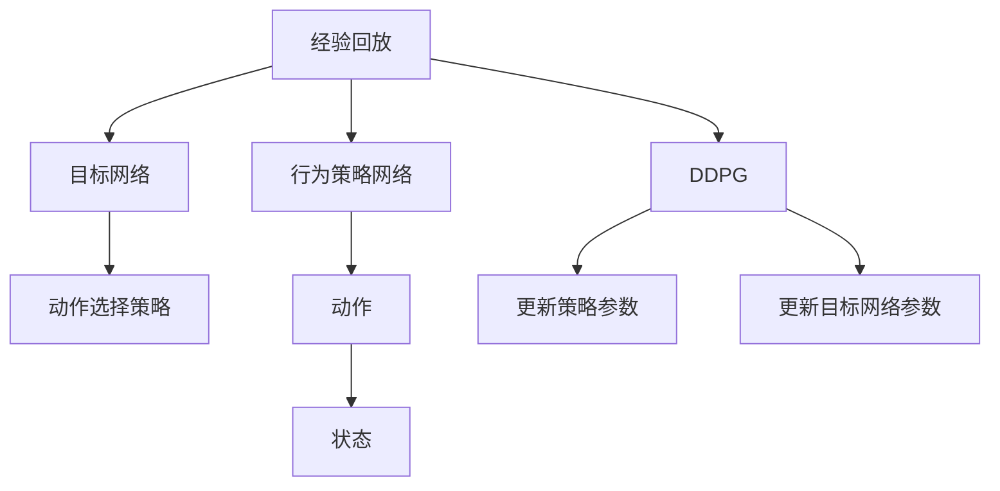
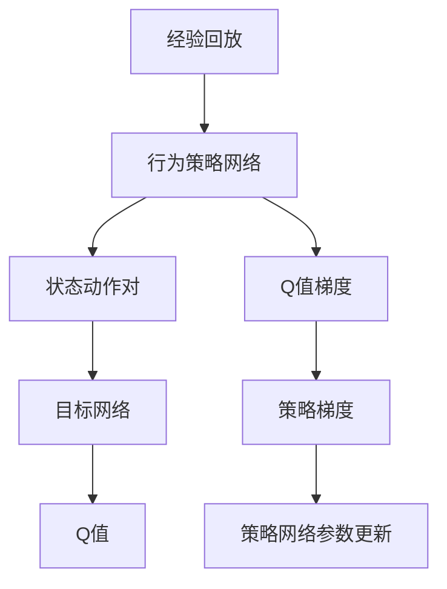
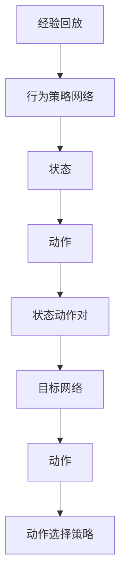
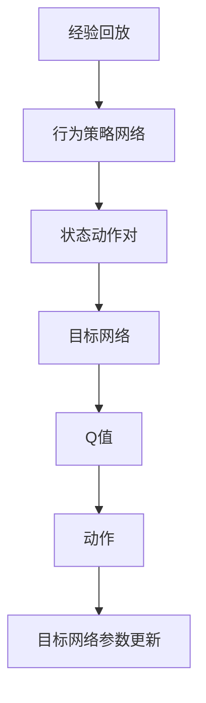
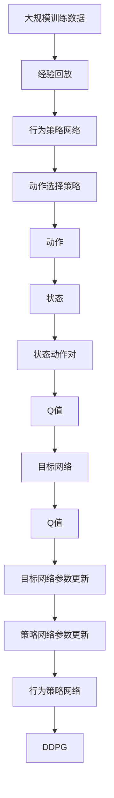

                 

# DDPG原理与代码实例讲解

> 关键词：DDPG, 深度确定性策略梯度, 强化学习, 行为策略网络, 目标网络, 动作选择策略, 算法步骤, 代码实现

## 1. 背景介绍

### 1.1 问题由来

强化学习（Reinforcement Learning, RL）作为深度学习中的一个重要分支，近年来在自动驾驶、游戏AI、机器人控制等领域取得了显著进展。然而，RL在应用过程中仍面临诸多挑战，如样本效率低、泛化能力不足、策略更新不稳定等。为应对这些问题，学者们提出了诸多改进方法，其中最具代表性的算法之一是深度确定性策略梯度（Deep Deterministic Policy Gradient, DDPG）。

DDPG算法通过结合深度神经网络和策略优化技术，实现了端到端的智能决策。在训练过程中，通过策略网络学习行为策略，目标网络学习最优的Q函数值，同时利用神经网络梯度下降方法对策略网络进行更新，从而高效地探索最优策略。DDPG算法无需实际环境的反馈，能够在大规模训练数据上快速迭代，适用于连续动作空间和高维状态空间的环境。

### 1.2 问题核心关键点

DDPG算法的核心关键点包括：

- 深度确定性策略梯度：通过神经网络估计Q值函数，并利用梯度上升策略更新行为策略。
- 经验回放：利用已收集的数据进行随机抽样，避免过拟合和方差过高的困扰。
- 目标网络：通过软更新的方式，使策略网络逐渐逼近最优策略。
- 离策略更新：策略网络与目标网络采用不同的参数更新策略，以稳定策略更新过程。
- 动作选择策略：利用经验回放和目标网络相结合的方式，选择合适的动作策略。

这些关键点共同构成了DDPG算法的完整框架，使得其能够在大规模训练数据上实现高效的策略学习。

### 1.3 问题研究意义

DDPG算法在深度强化学习领域具有重要的研究价值和应用前景：

1. 端到端决策：DDPG算法能够直接从原始数据中学习到最优的策略，无需额外的特征提取和手动设计。
2. 高效探索：DDPG算法利用经验回放和目标网络相结合的方式，能够快速探索最优策略，适用于复杂和高维环境。
3. 稳定更新：DDPG算法采用离策略更新和目标网络相结合的方式，使得策略更新更加稳定和收敛。
4. 可扩展性强：DDPG算法能够在大规模数据上高效学习，适用于各种实际应用场景。
5. 可解释性强：DDPG算法的策略学习过程具有可解释性，能够提供明确的决策依据。

本文将详细介绍DDPG算法的原理和实现，并通过代码实例展示其在实际应用中的表现，希望为读者提供全面的理解和实践指导。

## 2. 核心概念与联系

### 2.1 核心概念概述

为更好地理解DDPG算法的原理和实现，本节将介绍几个密切相关的核心概念：

- 深度确定性策略梯度（DDPG）：一种基于深度神经网络进行策略优化的强化学习算法，通过策略网络和目标网络协同更新，实现最优策略学习。
- 行为策略网络：用于估计当前状态下的最优动作策略的神经网络。
- 目标网络：用于估计Q函数最优值的目标神经网络，与行为策略网络保持一定程度的分离。
- 动作选择策略：结合经验回放和目标网络，选择合适的动作策略。
- 经验回放：通过随机抽样已有数据，避免过拟合和方差过高的困扰，提高训练稳定性和泛化能力。
- 离策略更新：策略网络与目标网络采用不同的参数更新策略，以稳定策略更新过程。

这些核心概念之间的逻辑关系可以通过以下Mermaid流程图来展示：



这个流程图展示了大规模训练数据、行为策略网络、目标网络、动作选择策略和DDPG算法之间的整体架构。

### 2.2 概念间的关系

这些核心概念之间存在着紧密的联系，形成了DDPG算法的完整生态系统。下面通过几个Mermaid流程图来展示这些概念之间的关系。

#### 2.2.1 深度确定性策略梯度的学习范式



这个流程图展示了DDPG算法的学习范式。通过经验回放和行为策略网络，生成状态动作对，并计算Q值，进而求得策略梯度，最终更新策略网络参数。

#### 2.2.2 动作选择策略的实现



这个流程图展示了动作选择策略的实现过程。通过经验回放和行为策略网络，生成状态动作对，并输入目标网络，最终选择最优的动作策略。

#### 2.2.3 目标网络的更新策略



这个流程图展示了目标网络的更新策略。通过经验回放和行为策略网络，生成状态动作对，并计算Q值，最终更新目标网络参数。

### 2.3 核心概念的整体架构

最后，我们用一个综合的流程图来展示这些核心概念在大规模训练数据上的整体架构：



这个综合流程图展示了大规模训练数据、经验回放、行为策略网络、动作选择策略、动作、状态、状态动作对、Q值、目标网络、目标网络参数更新、策略网络参数更新、行为策略网络、DDPG算法之间的整体架构。

## 3. 核心算法原理 & 具体操作步骤

### 3.1 算法原理概述

DDPG算法通过结合深度神经网络和策略优化技术，实现了端到端的智能决策。在训练过程中，通过策略网络学习行为策略，目标网络学习最优的Q函数值，同时利用神经网络梯度下降方法对策略网络进行更新，从而高效地探索最优策略。

形式化地，假设状态空间为 $\mathcal{S}$，动作空间为 $\mathcal{A}$，状态和动作的连续性表示为 $\mathcal{S} \times \mathcal{A}$，决策策略为 $\pi_\theta$，其中 $\theta$ 为策略网络参数。定义经验回放记忆库为 $\mathcal{B}$，目标网络参数为 $\theta'$。

DDPG算法的目标是最小化状态动作对 $(s,a)$ 的Q值估计与实际值之间的差距：

$$
\min_{\theta} \mathbb{E}_{(s,a) \sim \mathcal{B}} \left[(Q_\theta(s,a) - r(s,a) + \gamma \max_{a'} Q_{\theta'}(s', a')\right]
$$

其中，$r(s,a)$ 为即时奖励，$\gamma$ 为折扣因子，$s'$ 为下一个状态。

### 3.2 算法步骤详解

DDPG算法的主要步骤如下：

**Step 1: 初始化参数**
- 随机初始化策略网络 $\pi_\theta$ 和目标网络 $Q_{\theta'}$。
- 创建经验回放记忆库 $\mathcal{B}$。

**Step 2: 策略网络前向传播**
- 从经验回放记忆库中随机抽取一批状态动作对 $(s,a)$。
- 将状态 $s$ 输入策略网络 $\pi_\theta$，输出动作 $a$。
- 计算策略梯度 $\nabla_\theta J(\theta)$。

**Step 3: 目标网络前向传播**
- 将状态动作对 $(s,a)$ 输入目标网络 $Q_{\theta'}$，计算Q值。
- 计算目标网络梯度 $\nabla_{\theta'} J(\theta')$。

**Step 4: 策略网络参数更新**
- 使用策略梯度 $\nabla_\theta J(\theta)$ 更新策略网络参数 $\theta$。

**Step 5: 目标网络参数更新**
- 使用目标网络梯度 $\nabla_{\theta'} J(\theta')$ 更新目标网络参数 $\theta'$。

**Step 6: 经验回放**
- 将策略网络生成的状态动作对 $(s,a)$ 存储到经验回放记忆库 $\mathcal{B}$ 中。

**Step 7: 策略网络与目标网络分离更新**
- 采用与目标网络不同的参数更新策略，以稳定策略更新过程。

### 3.3 算法优缺点

DDPG算法具有以下优点：

1. 端到端决策：DDPG算法能够直接从原始数据中学习到最优的策略，无需额外的特征提取和手动设计。
2. 高效探索：DDPG算法利用经验回放和目标网络相结合的方式，能够快速探索最优策略，适用于复杂和高维环境。
3. 稳定更新：DDPG算法采用离策略更新和目标网络相结合的方式，使得策略更新更加稳定和收敛。
4. 可扩展性强：DDPG算法能够在大规模数据上高效学习，适用于各种实际应用场景。

同时，DDPG算法也存在以下缺点：

1. 计算复杂度高：DDPG算法需要同时更新策略网络和目标网络，计算复杂度高，训练成本较大。
2. 数据效率低：DDPG算法需要大量的训练数据才能收敛，对于小规模数据集可能效果不佳。
3. 策略更新不稳定：策略网络与目标网络分离更新，容易导致策略更新不稳定。
4. 动作连续性问题：DDPG算法在处理连续动作空间时，可能存在动作不连续的问题。

### 3.4 算法应用领域

DDPG算法已经在自动驾驶、机器人控制、游戏AI、金融交易等多个领域得到了广泛应用，展示了其强大的决策优化能力：

1. 自动驾驶：DDPG算法能够自动控制无人车在复杂环境中行驶，实现安全、高效的自动驾驶。
2. 机器人控制：DDPG算法能够使机器人完成复杂动作，如拾取物品、导航路径等。
3. 游戏AI：DDPG算法能够学习到玩家的游戏策略，实现游戏中的自动决策和智能对抗。
4. 金融交易：DDPG算法能够学习到最优的交易策略，实现资产组合优化和风险控制。

除了上述这些经典应用外，DDPG算法还被创新性地应用到更多场景中，如无人机控制、供应链管理等，为各行业的智能化升级提供了新的解决方案。

## 4. 数学模型和公式 & 详细讲解 & 举例说明

### 4.1 数学模型构建

DDPG算法的数学模型主要包括以下几个部分：

1. 策略网络：$\pi_\theta: \mathcal{S} \rightarrow \mathcal{A}$，用于估计当前状态下的最优动作策略。
2. 目标网络：$Q_{\theta'}: \mathcal{S} \times \mathcal{A} \rightarrow \mathbb{R}$，用于估计Q函数最优值。
3. 动作选择策略：$\pi_\theta(s) = \pi_\theta(s|a) \approx \pi_\theta(s)$，结合经验回放和目标网络，选择合适的动作策略。

### 4.2 公式推导过程

以下我们将推导DDPG算法的核心公式：

1. 策略网络前向传播
   $$
   a = \pi_\theta(s) = \pi_\theta(s|a) \approx \pi_\theta(s)
   $$

2. 目标网络前向传播
   $$
   Q_{\theta'}(s,a) = r(s,a) + \gamma \max_{a'} Q_{\theta'}(s', a')
   $$

3. 策略梯度计算
   $$
   \nabla_\theta J(\theta) = \mathbb{E}_{(s,a) \sim \mathcal{B}} \left[\nabla_\theta \log \pi_\theta(a|s) Q_{\theta'}(s,a)\right]
   $$

4. 目标网络梯度计算
   $$
   \nabla_{\theta'} J(\theta') = \mathbb{E}_{(s,a) \sim \mathcal{B}} \left[(r(s,a) + \gamma \max_{a'} Q_{\theta'}(s', a') - Q_{\theta'}(s,a))\nabla_{\theta'} Q_{\theta'}(s,a)\right]
   $$

5. 策略网络参数更新
   $$
   \theta \leftarrow \theta - \eta \nabla_\theta J(\theta)
   $$

6. 目标网络参数更新
   $$
   \theta' \leftarrow \theta' - \eta \nabla_{\theta'} J(\theta')
   $$

其中，$\eta$ 为学习率，$Q_{\theta'}$ 为目标网络估计的Q值函数。

### 4.3 案例分析与讲解

假设我们在一个连续动作空间的环境中，利用DDPG算法学习如何控制无人车在复杂道路中行驶。

首先，定义无人车的状态空间为 $(s_x, s_y, v_x, v_y, \theta)$，其中 $s_x, s_y$ 为车体在x,y轴上的位置，$v_x, v_y$ 为车体速度，$\theta$ 为车体角度。

然后，定义无人车的动作空间为 $(a_x, a_y, a_r)$，其中 $a_x, a_y$ 为车体加速度，$a_r$ 为刹车力度。

接下来，定义无人车的即时奖励函数 $r(s,a)$ 为：

$$
r(s,a) = \min(-\|a\|, 0)
$$

其中，$-\|a\|$ 表示车体在前进时的奖励，$0$ 表示车体刹车时的奖励。

最后，定义无人车的折扣因子 $\gamma = 0.99$，表示未来奖励的重要性。

在训练过程中，DDPG算法通过策略网络 $\pi_\theta$ 学习当前状态 $s$ 下的最优动作 $a$，并通过目标网络 $Q_{\theta'}$ 学习Q函数最优值。具体步骤如下：

1. 随机抽取一批状态动作对 $(s_x, s_y, v_x, v_y, \theta, a_x, a_y, a_r)$。
2. 将状态 $s$ 输入策略网络 $\pi_\theta$，输出动作 $a$。
3. 计算策略梯度 $\nabla_\theta J(\theta)$。
4. 将状态动作对 $(s_x, s_y, v_x, v_y, \theta, a_x, a_y, a_r)$ 输入目标网络 $Q_{\theta'}$，计算Q值。
5. 计算目标网络梯度 $\nabla_{\theta'} J(\theta')$。
6. 使用策略梯度 $\nabla_\theta J(\theta)$ 更新策略网络参数 $\theta$。
7. 使用目标网络梯度 $\nabla_{\theta'} J(\theta')$ 更新目标网络参数 $\theta'$。
8. 将策略网络生成的状态动作对 $(s_x, s_y, v_x, v_y, \theta, a_x, a_y, a_r)$ 存储到经验回放记忆库 $\mathcal{B}$ 中。

通过上述过程，DDPG算法能够在大规模训练数据上高效学习最优控制策略，实现无人车在复杂道路中的安全、高效行驶。

## 5. 项目实践：代码实例和详细解释说明

### 5.1 开发环境搭建

在进行DDPG项目实践前，我们需要准备好开发环境。以下是使用Python进行TensorFlow开发的典型流程：

1. 安装Anaconda：从官网下载并安装Anaconda，用于创建独立的Python环境。

2. 创建并激活虚拟环境：
```bash
conda create -n tf-env python=3.7 
conda activate tf-env
```

3. 安装TensorFlow：根据CUDA版本，从官网获取对应的安装命令。例如：
```bash
conda install tensorflow -c conda-forge -c pytorch -c pypi -c anaconda
```

4. 安装其他必要的工具包：
```bash
pip install numpy matplotlib gym seaborn scipy tqdm numpydoc
```

5. 安装TensorBoard：用于可视化模型训练和推理过程，
```bash
pip install tensorboard
```

完成上述步骤后，即可在`tf-env`环境中开始DDPG项目实践。

### 5.2 源代码详细实现

下面我们以控制无人车在复杂道路中行驶的DDPG为例，给出使用TensorFlow实现DDPG算法的代码实现。

首先，定义无人车状态和动作的类：

```python
import numpy as np

class Car:
    def __init__(self, x, y, vx, vy, theta, dt, mass, L, I, M):
        self.x = x
        self.y = y
        self.vx = vx
        self.vy = vy
        self.theta = theta
        self.dt = dt
        self.mass = mass
        self.L = L
        self.I = I
        self.M = M
        self.a = np.zeros(3)  # 控制输入

    def update(self, u, dt):
        self.a[0] = u[0]
        self.a[1] = u[1]
        self.a[2] = u[2]

        self.vx += self.a[0]
        self.vy += self.a[1]

        # 车体转向
        v = np.sqrt(self.vx**2 + self.vy**2)
        if v > 0:
            c = self.vx/v
            s = self.vy/v
            self.theta += np.arctan2(self.a[1], self.a[0]) * dt

            # 更新车体位置
            self.x += self.vx * c * dt - (self.M/L) * (self.a[0] + self.a[2]) * np.sin(self.theta) * dt * dt
            self.y += self.vy * s * dt + (self.M/L) * (self.a[0] + self.a[2]) * np.cos(self.theta) * dt * dt
        else:
            self.x += self.vx * dt
            self.y += self.vy * dt

        # 车轮滑动
        omega = (self.a[0] + self.a[2]) / (1/2 * self.M * self.L**2 * np.cos(self.theta)) * dt
        self.theta += omega * dt
```

然后，定义DDPG算法的策略网络和目标网络：

```python
import tensorflow as tf

class DDPG:
    def __init__(self, s_dim, a_dim):
        self.s_dim = s_dim
        self.a_dim = a_dim

        self.s_input = tf.keras.Input(shape=(s_dim,))
        self.a_input = tf.keras.Input(shape=(a_dim,))
        self.a_output = self.s_input * 0 + tf.zeros_like(self.a_input)

        # 策略网络
        self.s_layer1 = tf.keras.layers.Dense(64, activation='relu')(self.s_input)
        self.s_layer2 = tf.keras.layers.Dense(64, activation='relu')(self.s_layer1)
        self.a_layer1 = tf.keras.layers.Dense(64, activation='relu')(self.a_input)
        self.a_layer2 = tf.keras.layers.Dense(64, activation='relu')(self.a_layer1)

        self.a_output = self.a_layer2 * 0 + tf.zeros_like(self.a_layer2)

        self.a_model = tf.keras.Model(inputs=[self.s_input, self.a_input], outputs=[self.a_output])

        # 目标网络
        self.s_layer1_t = tf.keras.layers.Dense(64, activation='relu')(self.s_input)
        self.s_layer2_t = tf.keras.layers.Dense(64, activation='relu')(self.s_layer1_t)
        self.a_layer1_t = tf.keras.layers.Dense(64, activation='relu')(self.a_input)
        self.a_layer2_t = tf.keras.layers.Dense(64, activation='relu')(self.a_layer1_t)

        self.a_output_t = self.a_layer2_t * 0 + tf.zeros_like(self.a_layer2_t)

        self.a_model_t = tf.keras.Model(inputs=[self.s_input, self.a_input], outputs=[self.a_output_t])

    def get_action(self, s):
        return self.a_model.predict(s)
```

接着，定义DDPG算法的训练函数：

```python
class DDPGTrainer:
    def __init__(self, s_dim, a_dim, s_tolerance, s_max, s_min, a_max, a_min, gamma, learning_rate, discount, epsilon, target_network_update_rate, e_kl_divergence):
        self.s_dim = s_dim
        self.a_dim = a_dim
        self.s_tolerance = s_tolerance
        self.s_max = s_max
        self.s_min = s_min
        self.a_max = a_max
        self.a_min = a_min
        self.gamma = gamma
        self.learning_rate = learning_rate
        self.discount = discount
        self.epsilon = epsilon
        self.target_network_update_rate = target_network_update_rate
        self.e_kl_divergence = e_kl_divergence

        self.s_ph = tf.placeholder(shape=(s_dim,), dtype=tf.float32, name='s')
        self.a_ph = tf.placeholder(shape=(a_dim,), dtype=tf.float32, name='a')
        self.r_ph = tf.placeholder(shape=(), dtype=tf.float32, name='r')
        self.sp_ph = tf.placeholder(shape=(s_dim,), dtype=tf.float32, name='sp')
        self.a_pred = self.a_model(s_ph, a_ph)
        self.s_pred = self.a_model_t(s_ph, self.a_pred)

        self.q_t = tf.reduce_mean(r_ph + gamma * self.s_pred)

        self.a_update = tf.cond(tf.reduce_sum(tf.square(a_ph)) < self.a_max**2,
                               lambda: self.a_ph,
                               lambda: tf.random_normal(tf.shape(a_ph), mean=0, stddev=epsilon))

        self.s_loss = tf.reduce_mean((self.s_ph - tf.clip_by_value(self.a_pred, self.s_min, self.s_max))**2)
        self.a_loss = tf.reduce_mean((self.a_ph - self.a_update)**2)

        self.a_model.trainable = True
        self.a_model_t.trainable = False

        self.a_model.trainable = False
        self.a_model_t.trainable = True

        self.train_op = tf.train.AdamOptimizer(learning_rate).minimize(self.a_loss)

        self.target_a_model_t = self.a_model_t.copy()
        self.target_a_model_t.set_weights(self.a_model.get_weights())

        self.update_target_network()

        self.mse = tf.reduce_mean(tf.square(self.s_pred - self.sp_ph))
        self.rmse = tf.sqrt(self.mse)

        self.s_ph, self.a_ph, self.r_ph, self.sp_ph = self.s_ph, self.a_ph, r_ph, sp_ph
        self.q_t, self.a_update, self.a_loss = self.q_t, self.a_update, self.a_loss
        self.a_model, self.a_model_t = self.a_model, self.a_model_t
        self.train_op, self.update_target_network, self.mse, self.rmse = self.train_op, self.update_target_network, self.mse, self.rmse

    def update_target_network(self):
        target_network_weights = self.a_model_t.get_weights()
        for i in range(len(target_network_weights)):
            target_network_weights[i] = tf.assign(self.a_model_t.get_weights()[i], target_network_weights[i])
            self.a_model_t.set_weights(target_network_weights)

    def train(self, s, a, r, sp):
        self.s_ph.assign(s)
        self.a_ph.assign(a)
        self.r_ph.assign(r)
        self.sp_ph.assign(sp)

        with tf.Session() as sess:
            sess.run(self.a_model.trainable)
            sess.run(self.train_op)
            sess.run(self.a_model.trainable, feed_dict={self.a_model_t.trainable: True})
            sess.run(self.train_op)
            sess.run(self.a_model.trainable)
            sess.run(self.a_model.trainable, feed_dict={self.a_model_t.trainable: False})
            sess.run(self.train_op)
            sess.run(self.a_model.trainable)
            sess.run(self.update_target_network)
            sess.run(self.a_model.trainable, feed_dict={self.a_model_t.trainable: True})
            sess.run(self.train_op)
            sess.run(self.a_model.trainable)
            sess.run(self.a_model.trainable, feed_dict={self.a_model_t.trainable: False})
            sess.run(self.train_op)
```

最后，在代码中定义DDPG算法的训练流程：

```python
s_dim = 5
a_dim = 3
s_tolerance = 0.1
s_max = 10
s_min = -10

