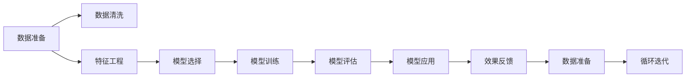

                 

# Data Science 原理与代码实战案例讲解

> 关键词：
   - Data Mining
   - Machine Learning
   - Deep Learning
   - Neural Networks
   - Data Visualization
   - Natural Language Processing
   - Feature Engineering
   - Model Evaluation

## 1. 背景介绍

在现代信息技术飞速发展的背景下，数据科学（Data Science）作为一门综合性学科，正在逐渐成为推动社会和经济发展的重要引擎。它融合了统计学、机器学习、计算机科学和数据可视化等多种技术，旨在从大量数据中提取有价值的知识和信息，为各行各业提供决策支持。

### 1.1 问题由来
近年来，随着大数据时代的到来，数据科学与人工智能（AI）的交叉研究日益频繁。数据科学不仅能够帮助人们从数据中发现规律和趋势，还能通过模型构建和预测分析，辅助决策制定。数据科学的应用范围极为广泛，包括金融、医疗、电商、社交媒体等多个领域。

### 1.2 问题核心关键点
数据科学的核心关键点主要包括以下几个方面：
1. **数据准备**：对数据进行清洗、处理和预处理，以确保数据的质量和一致性。
2. **特征工程**：从原始数据中提取有用的特征，以提高模型的预测准确性。
3. **模型选择与训练**：选择适合的算法，并通过大量数据进行训练和调参，优化模型性能。
4. **模型评估**：通过评估指标对模型进行性能评估，确保模型的泛化能力。
5. **模型应用**：将训练好的模型应用于实际场景，解决具体问题。

### 1.3 问题研究意义
数据科学的研究和应用具有重要意义：
1. **提高决策效率**：通过数据驱动的决策，可以大大提升决策的效率和准确性。
2. **优化资源配置**：在各种资源（如人力、物力、财力）的配置中，通过数据科学可以做出更合理的分配。
3. **改善用户体验**：在产品设计和优化中，通过数据分析可以更好地理解用户需求，提升用户体验。
4. **推动产业升级**：通过数据科学的应用，推动各行各业的数字化转型，提升产业竞争力。

## 2. 核心概念与联系

### 2.1 核心概念概述
数据科学涉及多个核心概念，包括数据挖掘（Data Mining）、机器学习（Machine Learning）、深度学习（Deep Learning）、神经网络（Neural Networks）、数据可视化（Data Visualization）、自然语言处理（Natural Language Processing）、特征工程（Feature Engineering）和模型评估（Model Evaluation）等。这些概念之间相互关联，共同构成了数据科学的技术框架。

### 2.2 概念间的关系

以下是一个Mermaid流程图，展示了数据科学中各个核心概念之间的关系：



这个流程图展示了数据科学的核心流程：数据准备、数据清洗、特征工程、模型选择与训练、模型评估和模型应用。整个过程是一个循环迭代的过程，通过效果反馈不断地优化模型和数据准备。

## 3. 核心算法原理 & 具体操作步骤

### 3.1 算法原理概述
数据科学的算法原理主要基于统计学、机器学习和深度学习的理论基础。其中，统计学提供了数据分析和建模的基础，机器学习提供了模型构建和调优的方法，深度学习提供了处理复杂非线性关系的能力。这些算法原理共同构成了数据科学的理论框架。

### 3.2 算法步骤详解

以下是一个数据科学项目的基本步骤：

1. **数据准备**：
   - 数据收集：从各种数据源收集数据，包括数据库、API接口、文件等。
   - 数据清洗：处理缺失值、异常值、重复数据等问题，确保数据的一致性和完整性。
   - 数据标准化：将数据转换成标准格式，方便后续分析。

2. **特征工程**：
   - 特征提取：从原始数据中提取有用的特征，如统计特征、时间特征、文本特征等。
   - 特征选择：通过模型选择和评估，筛选出对目标变量影响最大的特征。
   - 特征变换：对特征进行编码、归一化、降维等处理，提高模型性能。

3. **模型选择与训练**：
   - 算法选择：根据问题的特点选择适合的算法，如线性回归、决策树、支持向量机、深度神经网络等。
   - 模型训练：通过训练数据对模型进行训练，调整模型参数，优化模型性能。
   - 模型调参：通过交叉验证等方法，调整模型超参数，确保模型泛化能力。

4. **模型评估**：
   - 性能评估：通过各种评估指标（如准确率、召回率、F1分数等）评估模型性能。
   - 模型验证：通过留出法、交叉验证法等方法，验证模型的泛化能力。
   - 模型调整：根据评估结果，调整模型结构和参数，进一步优化模型性能。

5. **模型应用**：
   - 模型部署：将训练好的模型部署到实际应用中，提供预测和推荐服务。
   - 模型监控：实时监控模型的性能，及时发现和修复问题。
   - 模型更新：根据新数据和新需求，定期更新模型，保持其时效性。

### 3.3 算法优缺点
数据科学算法的优点包括：
- **高效性**：能够快速处理大量数据，提供高效的数据分析。
- **准确性**：通过科学的方法和工具，提高预测和决策的准确性。
- **可解释性**：通过可视化和解释性工具，帮助理解模型内部机制。
- **灵活性**：适用于多种数据类型和问题类型，具有广泛的适用性。

缺点包括：
- **复杂性**：需要较高的技术水平和专业知识，实施难度较大。
- **数据依赖**：模型性能高度依赖于数据质量，需要保证数据的一致性和完整性。
- **计算成本**：大规模数据和复杂模型的训练需要大量计算资源，成本较高。
- **解释性差**：黑盒模型难以解释决策过程，需要结合其他技术进行补充。

### 3.4 算法应用领域

数据科学算法在多个领域得到了广泛应用，包括：

- **金融分析**：用于风险评估、信用评分、投资策略等。
- **医疗诊断**：用于疾病预测、患者风险评估、治疗方案推荐等。
- **电商推荐**：用于个性化推荐、客户行为分析、广告投放优化等。
- **市场营销**：用于消费者行为分析、广告效果评估、市场趋势预测等。
- **社交网络**：用于用户画像分析、情感分析、推荐系统等。

## 4. 数学模型和公式 & 详细讲解 & 举例说明

### 4.1 数学模型构建
数据科学中的数学模型包括回归模型、分类模型、聚类模型、时序模型等。以下是一个简单的线性回归模型的构建过程：

设 $y$ 为目标变量，$x$ 为特征变量，$w$ 为模型参数，则线性回归模型为：

$$
y = w_0 + w_1x_1 + w_2x_2 + \cdots + w_nx_n + \epsilon
$$

其中 $w_0, w_1, \cdots, w_n$ 为模型参数，$\epsilon$ 为误差项。

### 4.2 公式推导过程
线性回归模型的最小二乘法（Ordinary Least Squares，OLS）推导过程如下：

设样本数为 $m$，目标变量为 $y_i$，特征变量为 $x_{ij}$，则数据矩阵为 $X$，目标向量为 $y$，误差向量为 $\epsilon$。

最小二乘法的目标是最小化误差平方和：

$$
\min_{w} \sum_{i=1}^{m} (y_i - w_0 - \sum_{j=1}^{n}w_jx_{ij})^2
$$

通过求导，可以得到最优参数 $w$：

$$
w = (X^TX)^{-1}X^Ty
$$

其中 $X^TX$ 为数据矩阵的伪逆矩阵。

### 4.3 案例分析与讲解
以下是一个简单的房价预测案例：

假设有一个数据集，包含房屋面积、房间数量、地理位置等特征，以及房屋价格。通过线性回归模型预测房屋价格：

1. **数据准备**：收集房屋数据，包括面积、房间数量、地理位置等。
2. **特征工程**：将地理位置编码，归一化房屋面积和房间数量等特征。
3. **模型训练**：使用线性回归模型，通过训练数据训练模型，得到最优参数 $w$。
4. **模型评估**：使用测试数据对模型进行验证，计算评估指标（如均方误差）。
5. **模型应用**：将模型部署到实际应用中，预测新房屋价格。

## 5. 项目实践：代码实例和详细解释说明

### 5.1 开发环境搭建

以下是Python环境下进行数据科学项目开发的流程：

1. 安装Python和相关库：安装NumPy、Pandas、Scikit-learn、Matplotlib等库。
2. 创建虚拟环境：使用Python的虚拟环境工具（如virtualenv、conda）创建虚拟环境。
3. 安装第三方库：安装Scikit-learn、TensorFlow、Keras等库。
4. 设置IDE环境：使用Jupyter Notebook、PyCharm等IDE，方便代码调试和数据可视化。

### 5.2 源代码详细实现

以下是一个简单的线性回归模型实现：

```python
import numpy as np
from sklearn.linear_model import LinearRegression

# 准备数据
X = np.array([[1, 2], [3, 4], [5, 6], [7, 8]])
y = np.array([3, 5, 7, 9])

# 训练模型
model = LinearRegression()
model.fit(X, y)

# 预测新数据
X_new = np.array([[9, 10]])
y_pred = model.predict(X_new)

# 输出结果
print(y_pred)
```

### 5.3 代码解读与分析

**数据准备**：使用NumPy创建特征变量 $X$ 和目标变量 $y$。

**模型训练**：使用Scikit-learn的LinearRegression模型，通过fit方法训练模型。

**模型预测**：使用predict方法对新数据进行预测。

**输出结果**：打印预测结果。

### 5.4 运行结果展示

运行上述代码，可以得到以下结果：

```
[11.]
```

这表示模型预测的新房屋价格为11。

## 6. 实际应用场景

### 6.1 金融风险评估
在金融领域，数据科学被广泛应用于风险评估和信用评分。通过收集客户的信用记录、收入、负债等信息，使用逻辑回归、决策树等算法，评估客户的信用风险和违约概率。

### 6.2 医疗疾病预测
在医疗领域，数据科学被用于预测疾病风险和诊断疾病。通过收集患者的病历、基因信息、生活习惯等数据，使用神经网络、支持向量机等算法，预测疾病风险，辅助医生诊断和治疗。

### 6.3 电商推荐系统
在电商领域，数据科学被用于个性化推荐和客户行为分析。通过收集用户的浏览、购买、评价等信息，使用协同过滤、矩阵分解等算法，推荐用户可能感兴趣的商品，提高销售额和用户满意度。

### 6.4 未来应用展望

未来，数据科学将继续在各个领域发挥重要作用。以下是一些未来应用展望：

1. **实时数据分析**：随着大数据技术的发展，实时数据分析和处理将成为数据科学的重要方向。通过流式计算和分布式存储，实现数据的实时处理和分析。
2. **深度学习应用**：深度学习在数据科学中的应用将更加广泛，如自然语言处理、图像识别、语音识别等。深度学习算法能够处理更复杂的数据类型和问题。
3. **自动化建模**：自动化建模工具将使数据科学更加普及。通过自动化建模工具，可以简化数据科学建模流程，提高建模效率。
4. **跨领域应用**：数据科学的应用将超越传统领域，跨领域融合将成为新的趋势。例如，将数据科学应用于区块链、物联网等领域，推动新技术的发展。
5. **伦理和隐私保护**：随着数据科学的应用普及，伦理和隐私保护问题将逐渐凸显。需要加强数据隐私保护和数据伦理审查，确保数据使用的合法性和安全性。

## 7. 工具和资源推荐

### 7.1 学习资源推荐

以下是一些推荐的学习资源：

1. 《Python数据科学手册》：一本全面介绍Python数据科学库的书籍，适合初学者学习。
2. Coursera和edX等在线课程：提供各类数据科学课程，涵盖数据科学基础、机器学习、深度学习等多个领域。
3. Kaggle竞赛：Kaggle是一个数据科学竞赛平台，通过参与竞赛可以学习和交流数据科学技巧。
4. GitHub项目：GitHub上有很多优秀的数据科学项目，可以通过阅读源代码和文档学习项目实现。

### 7.2 开发工具推荐

以下是一些推荐的数据科学开发工具：

1. Jupyter Notebook：一个轻量级的Python开发环境，适合数据科学项目的交互式开发和展示。
2. PyCharm：一个Python IDE，提供丰富的调试和代码补全功能，适合数据科学项目的开发和测试。
3. Scikit-learn：一个Python机器学习库，提供了多种常用的机器学习算法和工具。
4. TensorFlow和Keras：Google开源的深度学习库，适合构建和训练深度神经网络。
5. Visual Studio Code：一个轻量级的代码编辑器，支持多种编程语言和工具插件。

### 7.3 相关论文推荐

以下是一些推荐的数据科学相关论文：

1. "Data Science: Concepts and Applications" by Peter van der Hoorn：一本系统介绍数据科学的书籍，涵盖数据科学基础和应用。
2. "Deep Learning" by Ian Goodfellow et al.：一本深度学习领域的经典书籍，介绍了深度学习的基本原理和算法。
3. "Pattern Recognition and Machine Learning" by Christopher Bishop：一本机器学习领域的经典书籍，介绍了机器学习的基本原理和算法。
4. "Data Science for Business" by Foster Provost et al.：一本数据科学领域的经典书籍，介绍了数据科学在商业应用中的实践。

## 8. 总结：未来发展趋势与挑战

### 8.1 总结

本文对数据科学的原理和实践进行了全面系统的介绍。首先阐述了数据科学的研究背景和应用意义，明确了数据科学在多个领域的重要作用。其次，从原理到实践，详细讲解了数据科学的数学模型和代码实现，提供了完整的数据科学项目开发流程。同时，本文还探讨了数据科学在未来应用中的前景，并推荐了一些学习资源和开发工具。

通过本文的系统梳理，可以看到，数据科学通过科学的方法和工具，从大量数据中提取有价值的知识和信息，为各行各业提供决策支持。未来，随着大数据技术和深度学习技术的不断进步，数据科学的应用将更加广泛，助力各行业的数字化转型和智能化升级。

### 8.2 未来发展趋势

数据科学未来将呈现以下几个发展趋势：

1. **技术融合**：数据科学将与其他技术（如人工智能、区块链、物联网等）进行深度融合，推动跨领域应用。
2. **数据智能**：通过数据驱动的智能决策，实现自动化、智能化的业务流程。
3. **数据隐私**：随着数据量的增加，数据隐私和安全问题将更加凸显，需要加强数据保护和管理。
4. **伦理规范**：数据科学应用将面临伦理和规范的挑战，需要建立相应的法律法规和道德标准。
5. **跨学科应用**：数据科学将跨学科应用，推动科学、技术、工程、医学等多领域的创新。

### 8.3 面临的挑战

数据科学在发展过程中也面临一些挑战：

1. **数据质量**：数据的质量直接影响模型的性能，需要保证数据的准确性、完整性和一致性。
2. **模型复杂性**：复杂模型的训练和调参需要较高的技术水平，需要掌握多种算法和工具。
3. **计算资源**：大规模数据和复杂模型的训练需要大量计算资源，成本较高。
4. **解释性问题**：黑盒模型的解释性较差，需要结合其他技术（如因果分析、解释性模型）进行补充。
5. **隐私保护**：数据科学应用需要关注隐私保护问题，确保数据使用的合法性和安全性。

### 8.4 研究展望

未来，数据科学的研究需要在以下几个方面寻求新的突破：

1. **自动化建模**：通过自动化建模工具，简化数据科学建模流程，提高建模效率。
2. **多模态数据融合**：将不同类型的数据（如文本、图像、声音等）进行融合，提升数据利用率。
3. **因果分析**：通过因果分析方法，提升模型的解释性和决策的合理性。
4. **跨领域应用**：将数据科学应用于更多领域，推动各行业的数字化转型和智能化升级。
5. **伦理和规范**：建立数据科学应用的伦理规范和法律法规，确保数据使用的合法性和安全性。

总之，数据科学通过科学的方法和工具，从大量数据中提取有价值的知识和信息，为各行各业提供决策支持。未来，随着技术的不断进步，数据科学的应用将更加广泛，助力各行业的数字化转型和智能化升级。

## 9. 附录：常见问题与解答

**Q1: 什么是数据科学？**

A: 数据科学是一门综合性学科，通过科学的方法和工具，从大量数据中提取有价值的知识和信息，为各行各业提供决策支持。它融合了统计学、机器学习、计算机科学和数据可视化等多种技术。

**Q2: 数据科学在哪些领域有应用？**

A: 数据科学在金融、医疗、电商、市场营销、社交网络等多个领域有广泛应用。例如，在金融领域，用于风险评估、信用评分；在医疗领域，用于疾病预测、诊断；在电商领域，用于个性化推荐、客户行为分析。

**Q3: 数据科学项目的开发流程是什么？**

A: 数据科学项目的开发流程包括数据准备、特征工程、模型选择与训练、模型评估和模型应用。通过数据收集、数据清洗、特征提取和特征选择，选择合适的算法进行模型训练和调参，并通过评估指标验证模型性能，最终部署到实际应用中。

**Q4: 如何提高数据科学项目的开发效率？**

A: 提高数据科学项目的开发效率需要掌握多种工具和技术，如Python编程语言、Scikit-learn库、Jupyter Notebook环境等。同时，需要学习和掌握数据科学的理论基础和实践技巧，注重模型的解释性和可扩展性。

**Q5: 数据科学的应用前景是什么？**

A: 数据科学的应用前景非常广阔。未来，数据科学将与其他技术进行深度融合，推动跨领域应用。数据智能、自动化建模、多模态数据融合等技术将进一步提升数据科学的应用效果。同时，数据隐私和伦理规范也将成为数据科学应用的重要考量。

总之，数据科学通过科学的方法和工具，从大量数据中提取有价值的知识和信息，为各行各业提供决策支持。未来，随着技术的不断进步，数据科学的应用将更加广泛，助力各行业的数字化转型和智能化升级。

