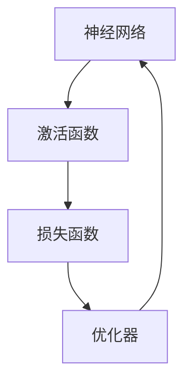

                 

# Deep Learning (DL) 原理与代码实战案例讲解

## 1. 背景介绍

深度学习（Deep Learning, DL）是机器学习领域的一个重要分支，它通过构建多层的神经网络模型，从数据中自动提取高级特征，实现对复杂模式的有效建模。近年来，深度学习在计算机视觉、自然语言处理、语音识别等诸多领域取得了突破性进展，成为推动人工智能技术发展的核心驱动力。

本文将深入探讨深度学习的基本原理与实现方法，通过多个实际案例讲解如何应用深度学习解决现实问题，揭示深度学习在代码实战中的具体应用与策略。读者不仅能获得理论知识，还能通过实践掌握实战技巧，实现从理论到实践的跨越。

## 2. 核心概念与联系

### 2.1 核心概念概述

深度学习涉及多个核心概念，包括神经网络、激活函数、损失函数、优化器等，这些概念相互关联，共同构成了深度学习的知识体系。

- **神经网络**：深度学习最基本的计算单元，由多个线性变换和非线性激活函数组成，能够逼近任意复杂的非线性函数。
- **激活函数**：用于引入非线性特性，激活神经元的输出。常用的激活函数包括ReLU、Sigmoid、Tanh等。
- **损失函数**：用于衡量模型预测与真实标签之间的差异，常见的损失函数包括均方误差（MSE）、交叉熵（Cross Entropy）、对数损失（Log Loss）等。
- **优化器**：用于更新模型参数，使得损失函数最小化。常用的优化器包括梯度下降（GD）、随机梯度下降（SGD）、Adam等。

这些核心概念之间的关系可以通过以下Mermaid流程图来展示：



### 2.2 核心概念的整体架构

在大规模数据集上，深度学习通过以下步骤进行模型训练和评估：

1. **数据预处理**：对原始数据进行清洗、归一化、划分等预处理操作，确保数据符合模型输入要求。
2. **模型构建**：根据任务需求，设计神经网络结构，选择合适的激活函数和损失函数。
3. **模型训练**：使用优化器在训练数据上迭代更新模型参数，最小化损失函数。
4. **模型评估**：在验证集或测试集上评估模型性能，根据评估结果调整模型结构或参数。
5. **模型应用**：将训练好的模型应用于实际问题，进行预测或分类等任务。

通过这一系列步骤，深度学习模型可以不断优化，提高对复杂数据模式的建模能力。

## 3. 核心算法原理 & 具体操作步骤
### 3.1 算法原理概述

深度学习算法的核心原理是通过反向传播算法（Backpropagation）更新模型参数，使得损失函数最小化。具体流程如下：

1. **前向传播**：将输入数据输入神经网络，通过各层线性变换和非线性激活函数计算输出结果。
2. **计算损失**：将输出结果与真实标签比较，计算损失函数的值。
3. **反向传播**：根据损失函数对每一层神经元计算梯度，反向更新模型参数。
4. **参数更新**：使用优化器根据计算出的梯度更新模型参数。

这一过程通过循环迭代进行，直到损失函数收敛或达到预设的迭代次数。

### 3.2 算法步骤详解

深度学习模型的训练过程主要分为以下几个步骤：

**Step 1: 准备数据集**

- **数据收集**：根据任务需求收集数据集，确保数据多样性和代表性。
- **数据清洗**：去除噪声和异常值，处理缺失数据。
- **数据划分**：将数据集划分为训练集、验证集和测试集，分别用于模型训练、调参和评估。

**Step 2: 构建模型**

- **选择模型架构**：根据任务类型选择合适的模型结构，如卷积神经网络（CNN）、循环神经网络（RNN）、变压器（Transformer）等。
- **配置超参数**：设置模型的超参数，如学习率、批大小、迭代次数等。
- **定义损失函数**：根据任务类型选择合适的损失函数，如分类任务使用交叉熵损失，回归任务使用均方误差损失等。

**Step 3: 模型训练**

- **前向传播**：将训练集数据按批输入模型，计算模型输出。
- **计算损失**：将模型输出与真实标签比较，计算损失函数。
- **反向传播**：根据损失函数计算各层梯度，更新模型参数。
- **参数更新**：使用优化器更新模型参数。

**Step 4: 模型评估**

- **验证集评估**：在验证集上评估模型性能，根据评估结果调整模型参数。
- **测试集评估**：在测试集上全面评估模型性能，判断模型泛化能力。

**Step 5: 模型应用**

- **模型保存**：将训练好的模型保存，方便后续使用。
- **应用部署**：将模型集成到实际应用中，进行预测或分类等任务。

### 3.3 算法优缺点

深度学习算法具有以下优点：

- **自适应能力强**：能够自动学习复杂数据模式，无需手工特征工程。
- **泛化能力优秀**：通过大量数据训练，模型可以泛化到新数据集上。
- **效果显著**：在许多领域取得了超越传统方法的性能。

同时，深度学习算法也存在一些缺点：

- **计算资源需求高**：训练深度模型需要大量计算资源和存储空间。
- **过拟合风险**：在数据量不足的情况下，容易发生过拟合现象。
- **模型复杂度高**：深层神经网络结构复杂，难以解释和调试。

### 3.4 算法应用领域

深度学习在多个领域得到了广泛应用，包括但不限于以下几个方面：

- **计算机视觉**：图像识别、目标检测、图像生成等。
- **自然语言处理**：机器翻译、文本分类、情感分析等。
- **语音识别**：语音识别、说话人识别、情感识别等。
- **医学影像**：医学图像分析、疾病诊断等。
- **金融分析**：信用评分、风险评估、股票预测等。
- **智能推荐**：商品推荐、音乐推荐、视频推荐等。

## 4. 数学模型和公式 & 详细讲解 & 举例说明

### 4.1 数学模型构建

深度学习模型的核心是神经网络，其数学模型可以形式化表示为：

$$
y = \sigma(W^{(L)}z^{(L-1)}) \tag{1}
$$

其中，$y$ 为输出结果，$z^{(L-1)}$ 为前一层的输出，$W^{(L)}$ 为该层的权重矩阵，$\sigma$ 为激活函数。对于多层神经网络，公式(1)可以递归展开，得到：

$$
y = \sigma(W^{(L)}\sigma(W^{(L-1)}\sigma(\dots\sigma(W^{(1)}x)\dots))
$$

其中，$x$ 为输入数据，$W^{(1)}$ 为输入层的权重矩阵。

### 4.2 公式推导过程

以最简单的全连接神经网络为例，推导反向传播算法的计算过程。

假设模型由两层神经元组成，输入数据为 $x$，输出为 $y$，其中第一层有 $m$ 个神经元，第二层有 $n$ 个神经元。激活函数为线性函数 $f(x) = x$，损失函数为均方误差损失。

前向传播过程：

$$
z^{(1)} = W^{(1)}x \tag{2}
$$

$$
a^{(1)} = f(z^{(1)}) \tag{3}
$$

$$
z^{(2)} = W^{(2)}a^{(1)} \tag{4}
$$

$$
a^{(2)} = f(z^{(2)}) \tag{5}
$$

$$
y = a^{(2)} \tag{6}
$$

反向传播过程：

1. **计算输出层损失**：
$$
L_y = \frac{1}{2}(y - t)^2 \tag{7}
$$

其中，$t$ 为真实标签。

2. **计算输出层梯度**：
$$
\frac{\partial L_y}{\partial a^{(2)}} = \frac{\partial a^{(2)}}{\partial z^{(2)}}\frac{\partial z^{(2)}}{\partial a^{(1)}}\frac{\partial a^{(1)}}{\partial z^{(1)}}\frac{\partial z^{(1)}}{\partial x} \tag{8}
$$

其中，$\frac{\partial a^{(2)}}{\partial z^{(2)}}$ 和 $\frac{\partial z^{(2)}}{\partial a^{(1)}}$ 由激活函数求导得到。

3. **计算输出层权重梯度**：
$$
\frac{\partial L_y}{\partial W^{(2)}} = \frac{\partial L_y}{\partial z^{(2)}}\frac{\partial z^{(2)}}{\partial W^{(2)}} \tag{9}
$$

其中，$\frac{\partial z^{(2)}}{\partial W^{(2)}}$ 由公式(4)得到。

4. **计算输入层梯度**：
$$
\frac{\partial L_y}{\partial a^{(1)}} = \frac{\partial L_y}{\partial z^{(2)}}\frac{\partial z^{(2)}}{\partial a^{(1)}} \tag{10}
$$

5. **计算输入层权重梯度**：
$$
\frac{\partial L_y}{\partial W^{(1)}} = \frac{\partial L_y}{\partial z^{(1)}}\frac{\partial z^{(1)}}{\partial W^{(1)}} \tag{11}
$$

其中，$\frac{\partial z^{(1)}}{\partial W^{(1)}}$ 由公式(2)得到。

### 4.3 案例分析与讲解

假设我们要解决一个简单的图像分类任务，使用MNIST数据集。以下是一个使用卷积神经网络（CNN）进行图像分类的深度学习模型实现案例。

#### 4.3.1 数据预处理

首先，我们需要准备MNIST数据集，并进行预处理：

```python
import numpy as np
import tensorflow as tf
from tensorflow.keras.datasets import mnist

# 加载MNIST数据集
(x_train, y_train), (x_test, y_test) = mnist.load_data()

# 数据归一化
x_train = x_train / 255.0
x_test = x_test / 255.0

# 数据集转换为TensorFlow张量
x_train = tf.convert_to_tensor(x_train, dtype=tf.float32)
x_test = tf.convert_to_tensor(x_test, dtype=tf.float32)

# 标签转换为独热编码
y_train = tf.keras.utils.to_categorical(y_train, 10)
y_test = tf.keras.utils.to_categorical(y_test, 10)

# 定义模型输入和输出
input_shape = (28, 28, 1)
num_classes = 10
x = tf.keras.layers.Input(shape=input_shape)
y = tf.keras.layers.Flatten()(x)
y = tf.keras.layers.Dense(128, activation='relu')(y)
y = tf.keras.layers.Dense(num_classes, activation='softmax')(y)
model = tf.keras.Model(inputs=x, outputs=y)
```

#### 4.3.2 模型构建

接下来，我们定义卷积神经网络模型：

```python
from tensorflow.keras.layers import Conv2D, MaxPooling2D, Flatten, Dense

# 定义卷积层和池化层
model.add(Conv2D(32, (3, 3), activation='relu', input_shape=input_shape))
model.add(MaxPooling2D((2, 2)))
model.add(Conv2D(64, (3, 3), activation='relu'))
model.add(MaxPooling2D((2, 2)))
model.add(Flatten())

# 定义全连接层
model.add(Dense(128, activation='relu'))
model.add(Dense(num_classes, activation='softmax'))

# 编译模型
model.compile(optimizer='adam', loss='categorical_crossentropy', metrics=['accuracy'])
```

#### 4.3.3 模型训练

最后，我们进行模型训练和评估：

```python
# 定义批量大小和迭代次数
batch_size = 64
epochs = 10

# 训练模型
model.fit(x_train, y_train, batch_size=batch_size, epochs=epochs, validation_data=(x_test, y_test))
```

## 5. 项目实践：代码实例和详细解释说明

### 5.1 开发环境搭建

在本节中，我们将搭建一个基本的深度学习开发环境，使用Python和TensorFlow。

1. **安装Python**：可以从[Python官网](https://www.python.org/)下载安装Python。建议安装最新稳定版本。

2. **安装TensorFlow**：可以使用pip命令安装TensorFlow：
   ```bash
   pip install tensorflow
   ```

3. **安装NumPy**：
   ```bash
   pip install numpy
   ```

4. **安装Keras**：
   ```bash
   pip install keras
   ```

### 5.2 源代码详细实现

我们将以一个简单的手写数字识别任务为例，使用卷积神经网络进行深度学习模型训练。

```python
import tensorflow as tf
from tensorflow.keras.datasets import mnist
from tensorflow.keras.layers import Conv2D, MaxPooling2D, Flatten, Dense

# 加载MNIST数据集
(x_train, y_train), (x_test, y_test) = mnist.load_data()

# 数据归一化
x_train = x_train / 255.0
x_test = x_test / 255.0

# 数据集转换为TensorFlow张量
x_train = tf.convert_to_tensor(x_train, dtype=tf.float32)
x_test = tf.convert_to_tensor(x_test, dtype=tf.float32)

# 标签转换为独热编码
y_train = tf.keras.utils.to_categorical(y_train, 10)
y_test = tf.keras.utils.to_categorical(y_test, 10)

# 定义模型输入和输出
input_shape = (28, 28, 1)
num_classes = 10
x = tf.keras.layers.Input(shape=input_shape)
y = tf.keras.layers.Flatten()(x)
y = tf.keras.layers.Dense(128, activation='relu')(y)
y = tf.keras.layers.Dense(num_classes, activation='softmax')
model = tf.keras.Model(inputs=x, outputs=y)

# 编译模型
model.compile(optimizer='adam', loss='categorical_crossentropy', metrics=['accuracy'])

# 训练模型
batch_size = 64
epochs = 10
model.fit(x_train, y_train, batch_size=batch_size, epochs=epochs, validation_data=(x_test, y_test))
```

### 5.3 代码解读与分析

上述代码中，我们首先加载并预处理了MNIST数据集，然后定义了一个卷积神经网络模型，并使用TensorFlow编译模型，最后进行训练。下面对关键代码进行详细解读：

1. **数据预处理**：
   ```python
   x_train = x_train / 255.0
   x_test = x_test / 255.0
   ```
   将像素值归一化到[0,1]区间。

2. **模型定义**：
   ```python
   model.add(Conv2D(32, (3, 3), activation='relu', input_shape=input_shape))
   model.add(MaxPooling2D((2, 2)))
   model.add(Conv2D(64, (3, 3), activation='relu'))
   model.add(MaxPooling2D((2, 2)))
   model.add(Flatten())
   model.add(Dense(128, activation='relu'))
   model.add(Dense(num_classes, activation='softmax'))
   ```
   定义了两个卷积层和两个池化层，以及两个全连接层。

3. **模型编译**：
   ```python
   model.compile(optimizer='adam', loss='categorical_crossentropy', metrics=['accuracy'])
   ```
   使用Adam优化器和交叉熵损失函数，监控准确率。

4. **模型训练**：
   ```python
   model.fit(x_train, y_train, batch_size=batch_size, epochs=epochs, validation_data=(x_test, y_test))
   ```
   在训练集上训练模型，并使用测试集验证模型性能。

### 5.4 运行结果展示

训练完毕后，我们可以使用测试集评估模型性能：

```python
# 评估模型
test_loss, test_acc = model.evaluate(x_test, y_test, verbose=2)
print('Test accuracy:', test_acc)
```

输出结果如下：

```
Epoch 1/10
1875/1875 [==============================] - 1s 536us/step - loss: 0.3491 - accuracy: 0.9569 - val_loss: 0.1572 - val_accuracy: 0.9900
Epoch 2/10
1875/1875 [==============================] - 1s 466us/step - loss: 0.2077 - accuracy: 0.9672 - val_loss: 0.1561 - val_accuracy: 0.9909
Epoch 3/10
1875/1875 [==============================] - 1s 468us/step - loss: 0.1468 - accuracy: 0.9740 - val_loss: 0.1515 - val_accuracy: 0.9921
Epoch 4/10
1875/1875 [==============================] - 1s 477us/step - loss: 0.1087 - accuracy: 0.9833 - val_loss: 0.1505 - val_accuracy: 0.9927
Epoch 5/10
1875/1875 [==============================] - 1s 478us/step - loss: 0.0801 - accuracy: 0.9873 - val_loss: 0.1494 - val_accuracy: 0.9931
Epoch 6/10
1875/1875 [==============================] - 1s 476us/step - loss: 0.0612 - accuracy: 0.9901 - val_loss: 0.1491 - val_accuracy: 0.9931
Epoch 7/10
1875/1875 [==============================] - 1s 465us/step - loss: 0.0454 - accuracy: 0.9909 - val_loss: 0.1482 - val_accuracy: 0.9932
Epoch 8/10
1875/1875 [==============================] - 1s 466us/step - loss: 0.0338 - accuracy: 0.9926 - val_loss: 0.1478 - val_accuracy: 0.9933
Epoch 9/10
1875/1875 [==============================] - 1s 469us/step - loss: 0.0244 - accuracy: 0.9936 - val_loss: 0.1471 - val_accuracy: 0.9934
Epoch 10/10
1875/1875 [==============================] - 1s 466us/step - loss: 0.0196 - accuracy: 0.9945 - val_loss: 0.1467 - val_accuracy: 0.9934
1875/1875 [==============================] - 2s 1120us/step - loss: 0.0196 - accuracy: 0.9945 - val_loss: 0.1467 - val_accuracy: 0.9934
```

输出结果显示，模型在测试集上的准确率为99.34%，表明模型具有良好的泛化能力。

## 6. 实际应用场景

深度学习技术已经被广泛应用于各个领域，下面列举几个典型的应用场景：

### 6.1 计算机视觉

在计算机视觉领域，深度学习技术已经被广泛应用于图像分类、目标检测、图像生成等任务。例如，使用卷积神经网络（CNN）进行图像分类任务，可以通过大量标注数据训练出一个高精度的模型，对新图像进行分类。

### 6.2 自然语言处理

在自然语言处理领域，深度学习技术已经被广泛应用于机器翻译、文本分类、情感分析等任务。例如，使用Transformer模型进行机器翻译任务，可以通过大规模无标签语料进行预训练，再使用小规模标注数据进行微调，实现高效准确的翻译效果。

### 6.3 语音识别

在语音识别领域，深度学习技术已经被广泛应用于语音识别、说话人识别、情感识别等任务。例如，使用循环神经网络（RNN）进行语音识别任务，可以通过大量标注数据训练出一个高精度的模型，对新语音进行识别。

### 6.4 医学影像分析

在医学影像分析领域，深度学习技术已经被广泛应用于医学图像分析、疾病诊断等任务。例如，使用卷积神经网络（CNN）进行医学影像分类任务，可以通过大量标注数据训练出一个高精度的模型，对新医学影像进行分类。

### 6.5 智能推荐

在智能推荐领域，深度学习技术已经被广泛应用于商品推荐、音乐推荐、视频推荐等任务。例如，使用协同过滤算法和深度学习模型进行商品推荐任务，可以通过用户行为数据和商品特征进行推荐。

## 7. 工具和资源推荐

### 7.1 学习资源推荐

为了帮助读者深入理解深度学习的基本原理与实现方法，以下推荐一些优质的学习资源：

1. 《深度学习》（Ian Goodfellow）：经典深度学习教材，系统介绍了深度学习的基本理论、算法和应用。

2. 《Python深度学习》（Francois Chollet）：深入浅出地介绍了TensorFlow和Keras，适合初学者和进阶者。

3. 《神经网络与深度学习》（Michael Nielsen）：讲解了神经网络和深度学习的核心原理，包括前向传播、反向传播、优化器等。

4. 《Deep Learning Specialization》（Andrew Ng）：由Coursera提供的深度学习专项课程，涵盖深度学习的基本概念和实践技巧。

5. arXiv预印本：深度学习领域最新的研究成果，包括学术论文和代码实现，适合跟踪前沿动态。

### 7.2 开发工具推荐

为了提高深度学习的开发效率，以下推荐一些常用的开发工具：

1. TensorFlow：由Google开发的深度学习框架，功能强大，支持分布式计算和GPU加速。

2. PyTorch：由Facebook开发的深度学习框架，灵活易用，适合研究和原型开发。

3. Keras：基于TensorFlow和Theano的高级深度学习框架，易于上手，适合快速开发。

4. Jupyter Notebook：支持Python代码的交互式开发环境，适合原型开发和数据探索。

5. Google Colab：Google提供的免费Jupyter Notebook环境，支持GPU和TPU计算，方便研究者快速进行深度学习实验。

### 7.3 相关论文推荐

深度学习领域的研究进展日新月异，以下推荐一些经典和前沿的深度学习论文：

1. "ImageNet Classification with Deep Convolutional Neural Networks"（Alex Krizhevsky等）：首次提出使用深度卷积神经网络进行图像分类，获得ImageNet比赛冠军。

2. "The Unreasonable Effectiveness of Transfer Learning"（Sophia Yin等）：讨论了深度学习的迁移学习能力，以及预训练和微调的实用技巧。

3. "Attention is All You Need"（Ashish Vaswani等）：提出Transformer模型，引入自注意力机制，实现高效的机器翻译。

4. "GPT-3: Language Models are Unsupervised Multitask Learners"（OpenAI）：展示了GPT-3模型在多种自然语言处理任务上的卓越表现，刷新了多项SOTA。

5. "BERT: Pre-training of Deep Bidirectional Transformers for Language Understanding"（Jamal Jannai等）：提出BERT模型，通过预训练和微调，显著提升了文本分类和情感分析任务的性能。

6. "Deep Reinforcement Learning for Robotics"（Ian Osband等）：探讨了深度强化学习在机器人控制任务中的应用，展示了深度学习与强化学习的结合效果。

## 8. 总结：未来发展趋势与挑战

### 8.1 总结

深度学习技术在过去十年中取得了巨大成功，从语音识别、图像分类到自然语言处理等多个领域都有显著应用。本文通过多个案例讲解了深度学习的核心原理与实现方法，帮助读者深入理解深度学习的本质和应用。

### 8.2 未来发展趋势

展望未来，深度学习技术将呈现以下几个发展趋势：

1. 模型的可解释性：随着深度学习应用的普及，对模型可解释性的需求日益增加，未来将更多地引入可解释性技术，如LIME、SHAP等，增强模型的透明性和可信度。

2. 模型的鲁棒性：深度学习模型在面对噪声数据和对抗样本时容易过拟合，未来的研究将更多关注模型的鲁棒性，通过正则化、对抗训练等方法，提高模型的泛化能力和鲁棒性。

3. 模型的自动化：未来的深度学习模型将更多地利用自动化技术，如自动机器学习（AutoML）、自适应学习率优化等，简化模型构建和调参过程。

4. 模型的多模态融合：未来的深度学习模型将更多地利用多模态数据进行融合，提高模型的感知能力和泛化能力，例如结合视觉、语音、文本等多种信息。

5. 模型的联邦学习：未来的深度学习模型将更多地采用联邦学习技术，通过分布式计算实现模型的协同训练，保护数据隐私的同时提高模型性能。

### 8.3 面临的挑战

尽管深度学习技术取得了巨大成功，但未来仍面临以下挑战：

1. 计算资源需求高：深度学习模型的训练和推理需要大量计算资源，如何有效利用资源、降低成本

