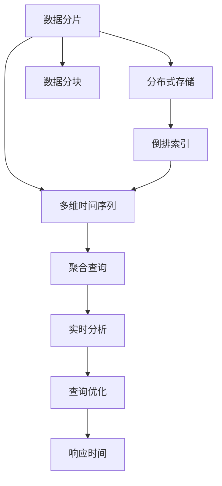
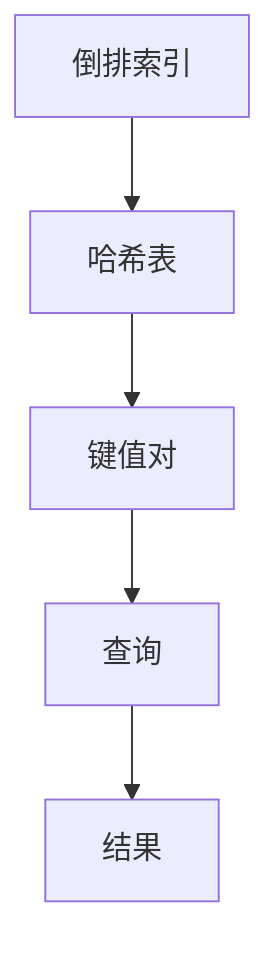
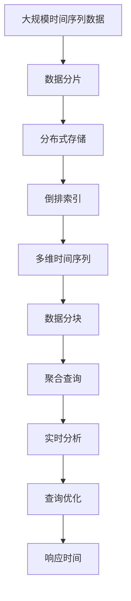

                 

# Druid原理与代码实例讲解

> 关键词：Druid, 分布式数据库, 查询引擎, 时间序列数据, 实时分析, 高效索引

## 1. 背景介绍

### 1.1 问题由来

在现代社会，数据量呈爆炸式增长，如何高效、准确地处理和分析这些数据，成为了各行各业面临的重要挑战。传统的集中式数据库已经难以应对大规模数据量的读写需求。此时，分布式数据库技术应运而生，通过多台服务器协同工作，提升了系统的可扩展性和容错能力。

在分布式数据库中，Druid是一个高性能的实时数据存储与查询引擎，尤其适用于时间序列数据的处理和分析。Druid具备毫秒级响应时间、灵活的查询方式、易于扩展和高效索引等优点，得到了广泛应用。

### 1.2 问题核心关键点

Druid的核心思想是分布式存储与计算，通过对数据进行分片存储，每个分片独立处理查询请求，提升了系统的吞吐量和响应速度。同时，Druid采用了多维时间序列数据模型，可以对数据进行灵活的聚合查询，支持基于时间的窗口函数和动态过滤等功能，增强了数据的可分析和可操作性。

Druid的主要特点包括：
- 分布式架构：通过多台服务器协同工作，提升了系统的可扩展性和容错能力。
- 实时分析：支持毫秒级的响应时间，快速处理和查询数据。
- 高效索引：采用基于倒排索引的数据结构，加速查询速度。
- 灵活查询：支持多维数据模型和动态过滤，增强了数据的分析能力。

## 2. 核心概念与联系

### 2.1 核心概念概述

为更好地理解Druid的工作原理，本节将介绍几个密切相关的核心概念：

- Druid：一种高性能的分布式数据存储与查询引擎，适用于大规模时间序列数据的实时分析。
- 数据分片：将数据按照一定的规则分成多个片段，每个分片独立处理查询请求，提升系统的吞吐量和容错能力。
- 倒排索引：一种基于哈希表的数据结构，用于加速文本数据的查询，Druid中用于加速时间序列数据的查询。
- 聚合查询：对时间序列数据进行聚合计算，如求和、平均值、最大值等，用于统计分析。
- 数据分块：将数据按照时间范围或某些维度进行分块，支持基于时间的窗口函数和动态过滤。

这些核心概念之间存在着紧密的联系，形成了Druid的核心架构和工作机制。下面我们通过Mermaid流程图来展示这些概念之间的关系。



这个流程图展示了Druid的核心概念及其之间的关系：

1. 数据分片：将数据按照一定的规则分成多个片段，每个分片独立处理查询请求。
2. 分布式存储：通过多台服务器协同工作，提升系统的可扩展性和容错能力。
3. 倒排索引：一种基于哈希表的数据结构，用于加速查询速度。
4. 多维时间序列：支持对数据进行灵活的聚合查询，增强了数据的可分析和可操作性。
5. 数据分块：将数据按照时间范围或某些维度进行分块，支持基于时间的窗口函数和动态过滤。
6. 聚合查询：对时间序列数据进行聚合计算，用于统计分析。
7. 实时分析：支持毫秒级的响应时间，快速处理和查询数据。
8. 查询优化：通过优化查询计划和索引，提升查询效率和响应时间。

这些概念共同构成了Druid的核心架构和工作机制，使其能够在各种场景下发挥强大的数据处理和分析能力。通过理解这些核心概念，我们可以更好地把握Druid的工作原理和优化方向。

### 2.2 概念间的关系

这些核心概念之间存在着紧密的联系，形成了Druid的核心架构和工作机制。下面我们通过几个Mermaid流程图来展示这些概念之间的关系。

#### 2.2.1 数据处理流程


这个流程图展示了数据在Druid中的处理流程：

1. 数据：原始数据进入Druid系统。
2. 数据分片：数据按照一定的规则分成多个片段，每个分片独立处理查询请求。
3. 分布式存储：通过多台服务器协同工作，提升系统的可扩展性和容错能力。
4. 倒排索引：一种基于哈希表的数据结构，用于加速查询速度。
5. 多维时间序列：支持对数据进行灵活的聚合查询，增强了数据的可分析和可操作性。
6. 数据分块：将数据按照时间范围或某些维度进行分块，支持基于时间的窗口函数和动态过滤。
7. 聚合查询：对时间序列数据进行聚合计算，用于统计分析。
8. 实时分析：支持毫秒级的响应时间，快速处理和查询数据。
9. 查询优化：通过优化查询计划和索引，提升查询效率和响应时间。

#### 2.2.2 聚合查询的流程


这个流程图展示了聚合查询在Druid中的处理流程：

1. 聚合查询：对时间序列数据进行聚合计算，用于统计分析。
2. 多维时间序列：支持对数据进行灵活的聚合查询，增强了数据的可分析和可操作性。
3. 数据分块：将数据按照时间范围或某些维度进行分块，支持基于时间的窗口函数和动态过滤。
4. 窗口函数：对数据进行基于时间的窗口聚合计算，如滑动平均、滑动最大值等。
5. 动态过滤：根据查询条件过滤数据，减少聚合计算量，提升查询效率。
6. 实时分析：支持毫秒级的响应时间，快速处理和查询数据。
7. 查询优化：通过优化查询计划和索引，提升查询效率和响应时间。

#### 2.2.3 倒排索引的实现



这个流程图展示了Druid中倒排索引的实现：

1. 倒排索引：一种基于哈希表的数据结构，用于加速查询速度。
2. 哈希表：通过将数据按键值对进行存储，快速定位到目标数据。
3. 键值对：每个键值对对应一个数据记录，键为时间戳，值为数据内容。
4. 查询：根据查询条件在哈希表中查找目标数据。
5. 结果：将查询结果按照时间顺序排序并返回。

### 2.3 核心概念的整体架构

最后，我们用一个综合的流程图来展示这些核心概念在大语言模型微调过程中的整体架构：



这个综合流程图展示了从数据分片到实时分析的完整处理流程。Druid首先对大规模时间序列数据进行分片处理，通过分布式存储提升系统的可扩展性和容错能力。在分片数据上，Druid采用了倒排索引和聚合查询技术，支持基于时间的窗口函数和动态过滤等功能，增强了数据的可分析和可操作性。最终，Druid通过实时分析技术，实现了毫秒级的响应时间，并支持高效的查询优化，确保系统的稳定性和高效性。

## 3. 核心算法原理 & 具体操作步骤

### 3.1 算法原理概述

Druid的核心算法原理包括数据分片、倒排索引、聚合查询和实时分析。这些算法原理构成了Druid的核心架构，使其能够高效地处理和查询大规模时间序列数据。

#### 3.1.1 数据分片

数据分片是Druid的重要特性之一，通过将数据分成多个片段，每个分片独立处理查询请求，提升了系统的吞吐量和容错能力。Druid的数据分片策略包括：

1. 时间分片：根据时间戳将数据分成多个时间段，每个时间段独立处理查询请求。
2. 水平分片：根据数据记录的属性进行分片，每个分片独立处理查询请求。
3. 垂直分片：将数据记录按照属性进行拆分，每个属性值独立处理查询请求。

Druid的数据分片策略可以根据实际应用场景进行灵活配置，支持数据的高效读写和查询。

#### 3.1.2 倒排索引

倒排索引是Druid中用于加速查询的数据结构，通过将数据按照键值对进行存储，快速定位到目标数据。在Druid中，倒排索引主要应用于时间序列数据的查询，通过键为时间戳，值为数据内容的方式，实现高效的数据查询和聚合。

Druid的倒排索引实现包括：

1. 哈希表：通过将数据按键值对进行存储，快速定位到目标数据。
2. 键值对：每个键值对对应一个数据记录，键为时间戳，值为数据内容。
3. 查询：根据查询条件在哈希表中查找目标数据。
4. 结果：将查询结果按照时间顺序排序并返回。

倒排索引技术使Druid能够快速定位到目标数据，加速查询速度，提升系统的响应时间。

#### 3.1.3 聚合查询

聚合查询是Druid中用于对时间序列数据进行聚合计算的功能，支持求和、平均值、最大值等聚合计算，用于统计分析和实时监控。Druid的聚合查询实现包括：

1. 聚合函数：支持求和、平均值、最大值、最小值等聚合函数，用于统计分析。
2. 聚合字段：支持对多维数据进行聚合计算，增强了数据的可分析和可操作性。
3. 窗口函数：对数据进行基于时间的窗口聚合计算，如滑动平均、滑动最大值等。
4. 动态过滤：根据查询条件过滤数据，减少聚合计算量，提升查询效率。

聚合查询技术使Druid能够对时间序列数据进行灵活的统计分析，增强了数据的可分析和可操作性。

#### 3.1.4 实时分析

实时分析是Druid的核心特性之一，支持毫秒级的响应时间，快速处理和查询数据。Druid的实时分析实现包括：

1. 事件时间：将时间序列数据按照事件时间进行存储和查询，增强了数据的实时性。
2. 窗口聚合：对数据进行基于时间的窗口聚合计算，如滑动平均、滑动最大值等。
3. 时间分区：将数据按照时间分区进行存储和查询，增强了数据的可扩展性和容错能力。
4. 聚合计算：对数据进行聚合计算，支持实时统计分析和监控。

实时分析技术使Druid能够在毫秒级响应时间内处理和查询大规模时间序列数据，提升了系统的实时性和可操作性。

### 3.2 算法步骤详解

Druid的查询过程包括以下几个关键步骤：

#### 3.2.1 数据分片

1. 数据分片：根据时间戳将数据分成多个时间段，每个时间段独立处理查询请求。

```python
from druid.deployment.fragment import SegmentData

# 将数据按照时间戳分片
fragment = SegmentData(start_time="2023-01-01", end_time="2023-01-31", data_source="data_source", granularity="day")
```

2. 水平分片：根据数据记录的属性进行分片，每个分片独立处理查询请求。

```python
from druid.deployment.fragment import SegmentData

# 将数据按照属性分片
fragment = SegmentData(start_time="2023-01-01", end_time="2023-01-31", data_source="data_source", granularity="day", dim="dim_name")
```

3. 垂直分片：将数据记录按照属性进行拆分，每个属性值独立处理查询请求。

```python
from druid.deployment.fragment import SegmentData

# 将数据按照属性分片
fragment = SegmentData(start_time="2023-01-01", end_time="2023-01-31", data_source="data_source", granularity="day", dim="dim_name")
```

#### 3.2.2 倒排索引

1. 哈希表：通过将数据按键值对进行存储，快速定位到目标数据。

```python
from druid.deployment.fragment import SegmentData

# 创建倒排索引
index = druid.SegmentData(
    start_time="2023-01-01",
    end_time="2023-01-31",
    data_source="data_source",
    granularity="day",
    dim="dim_name"
)
```

2. 键值对：每个键值对对应一个数据记录，键为时间戳，值为数据内容。

```python
from druid.deployment.fragment import SegmentData

# 创建键值对
index.add("2023-01-01", "data_content")
```

3. 查询：根据查询条件在哈希表中查找目标数据。

```python
from druid.deployment.fragment import SegmentData

# 查询数据
result = index.get("2023-01-01")
```

4. 结果：将查询结果按照时间顺序排序并返回。

```python
from druid.deployment.fragment import SegmentData

# 查询数据
result = index.get("2023-01-01")
```

#### 3.2.3 聚合查询

1. 聚合函数：支持求和、平均值、最大值、最小值等聚合函数，用于统计分析。

```python
from druid.deployment.fragment import SegmentData

# 聚合计算
result = index.aggregate("sum", "data_content")
```

2. 聚合字段：支持对多维数据进行聚合计算，增强了数据的可分析和可操作性。

```python
from druid.deployment.fragment import SegmentData

# 聚合计算
result = index.aggregate("sum", "data_content", dim="dim_name")
```

3. 窗口函数：对数据进行基于时间的窗口聚合计算，如滑动平均、滑动最大值等。

```python
from druid.deployment.fragment import SegmentData

# 窗口聚合计算
result = index.aggregate("sum", "data_content", granularity="day", interval="1d")
```

4. 动态过滤：根据查询条件过滤数据，减少聚合计算量，提升查询效率。

```python
from druid.deployment.fragment import SegmentData

# 动态过滤
result = index.aggregate("sum", "data_content", filter="dim_name:value")
```

#### 3.2.4 实时分析

1. 事件时间：将时间序列数据按照事件时间进行存储和查询，增强了数据的实时性。

```python
from druid.deployment.fragment import SegmentData

# 事件时间查询
fragment = SegmentData(start_time="2023-01-01", end_time="2023-01-31", data_source="data_source", granularity="day", event_time="event_time")
```

2. 窗口聚合：对数据进行基于时间的窗口聚合计算，如滑动平均、滑动最大值等。

```python
from druid.deployment.fragment import SegmentData

# 窗口聚合计算
fragment = SegmentData(start_time="2023-01-01", end_time="2023-01-31", data_source="data_source", granularity="day", interval="1d")
```

3. 时间分区：将数据按照时间分区进行存储和查询，增强了数据的可扩展性和容错能力。

```python
from druid.deployment.fragment import SegmentData

# 时间分区查询
fragment = SegmentData(start_time="2023-01-01", end_time="2023-01-31", data_source="data_source", granularity="day", time_partition="1h")
```

4. 聚合计算：对数据进行聚合计算，支持实时统计分析和监控。

```python
from druid.deployment.fragment import SegmentData

# 聚合计算
result = index.aggregate("sum", "data_content", granularity="day", interval="1d")
```

### 3.3 算法优缺点

Druid的查询过程具备以下优点：

1. 高效性：通过数据分片、倒排索引、聚合查询等技术，Druid能够高效地处理和查询大规模时间序列数据，支持毫秒级的响应时间。
2. 可扩展性：通过多台服务器的协同工作，Druid具备良好的可扩展性和容错能力，能够适应大规模数据量和高并发场景。
3. 灵活性：支持灵活的查询方式，包括多维数据模型、动态过滤、基于时间的窗口函数等，增强了数据的可分析和可操作性。

同时，Druid也存在一些局限性：

1. 复杂性：Druid的架构和实现相对复杂，需要一定的技术积累和实践经验。
2. 数据量限制：虽然Druid具备良好的扩展性，但在数据量非常大的情况下，可能会出现性能瓶颈。
3. 技术门槛：Druid的部署和使用需要一定的技术门槛，需要熟悉大数据、分布式系统等技术。

## 4. 数学模型和公式 & 详细讲解

### 4.1 数学模型构建

Druid的查询过程可以通过数学模型进行描述。假设原始数据集为 $D$，数据源为 $S$，查询条件为 $Q$，则查询过程可以表示为：

$$
Q(D, S, Q) = \bigcup_{i \in D} Q(S_i, Q)
$$

其中 $S_i$ 表示原始数据集 $D$ 中的第 $i$ 条数据，$Q(S_i, Q)$ 表示在数据源 $S_i$ 上进行查询，返回满足条件 $Q$ 的数据。

### 4.2 公式推导过程

Druid的查询过程涉及多个步骤，包括数据分片、倒排索引、聚合查询等。下面以求和聚合为例，推导查询过程的数学公式。

假设查询条件为 $Q$，数据源为 $S$，数据记录为 $D$，则查询过程可以表示为：

$$
Q(D, S, Q) = \bigcup_{i \in D} Q(S_i, Q)
$$

进一步展开为：

$$
Q(D, S, Q) = \bigcup_{i \in D} \sum_{j \in S_i} Q(S_i[j], Q)
$$

其中 $S_i[j]$ 表示数据源 $S_i$ 中第 $j$ 条数据。

假设数据源 $S_i$ 中的数据记录为 $D_i$，则查询过程可以表示为：

$$
Q(D_i, S_i, Q) = \sum_{j \in D_i} Q(S_i[j], Q)
$$

假设数据源 $S_i$ 中的数据记录为 $D_i$，且查询条件为 $Q$，则查询过程可以表示为：

$$
Q(D_i, S_i, Q) = \sum_{j \in D_i} Q(S_i[j], Q)
$$

假设查询条件为 $Q$，且数据记录为 $D$，则查询过程可以表示为：

$$
Q(D, S, Q) = \bigcup_{i \in D} \sum_{j \in D_i} Q(S_i[j], Q)
$$

进一步展开为：

$$
Q(D, S, Q) = \sum_{i \in D} \sum_{j \in D_i} Q(S_i[j], Q)
$$

### 4.3 案例分析与讲解

以求和聚合为例，进行详细讲解。假设原始数据集为 $D$，数据源为 $S$，查询条件为 $Q$，则查询过程可以表示为：

$$
Q(D, S, Q) = \bigcup_{i \in D} Q(S_i, Q)
$$

进一步展开为：

$$
Q(D, S, Q) = \bigcup_{i \in D} \sum_{j \in S_i} Q(S_i[j], Q)
$$

其中 $S_i[j]$ 表示数据源 $S_i$ 中第 $j$ 条数据。

假设数据源 $S_i$ 中的数据记录为 $D_i$，则查询过程可以表示为：

$$
Q(D_i, S_i, Q) = \sum_{j \in D_i} Q(S_i[j], Q)
$$

假设数据源 $S_i$ 中的数据记录为 $D_i$，且查询条件为 $Q$，则查询过程可以表示为：

$$
Q(D_i, S_i, Q) = \sum_{j \in D_i} Q(S_i[j], Q)
$$

假设查询条件为 $Q$，且数据记录为 $D$，则查询过程可以表示为：

$$
Q(D, S, Q) = \bigcup_{i \in D} \sum_{j \in D_i} Q(S_i[j], Q)
$$

进一步展开为：

$$
Q(D, S, Q) = \sum_{i \in D} \sum_{j \in D_i} Q(S_i[j], Q)
$$

在Druid中，聚合计算通常通过哈希表和倒排索引进行加速，计算公式可以表示为：

$$
Q(D, S, Q) = \bigcup_{i \in D} \sum_{j \in D_i} Q(S_i[j], Q)
$$

进一步展开为：

$$
Q(D, S, Q) = \sum_{i \in D} \sum_{j \in D_i} Q(S_i[j], Q)
$$

### 4.4 案例分析与讲解

假设查询条件为 $Q$，数据源为 $S$，数据记录为 $D$，则查询过程可以表示为：

$$
Q(D, S, Q) = \bigcup_{i \in D} Q(S_i, Q)
$$

进一步展开为：

$$
Q(D, S, Q) = \bigcup_{i \in D} \sum_{j \in S_i} Q(S_i[j], Q)
$$

其中 $S_i[j]$ 表示数据源 $S_i$ 中第 $j$ 条数据。

假设数据源 $S_i$ 中的数据记录为 $D_i$，则查询过程可以表示为：

$$
Q(D_i, S_i, Q) = \sum_{j \in D_i} Q(S_i[j], Q)
$$

假设数据源 $S_i$ 中的数据记录为 $D_i$，且查询条件为 $Q$，则查询过程可以表示为：

$$
Q(D_i, S_i, Q) = \sum_{j \in D_i} Q(S_i[j], Q)
$$

假设查询条件为 $Q$，且数据记录为 $D$，则查询过程可以表示为：

$$
Q(D, S, Q) = \bigcup_{i \in D} \sum_{j \in D_i} Q(S_i[j], Q)
$$

进一步展开为：

$$
Q(D, S, Q) = \sum_{i \in D} \sum_{j \in D_i} Q(S_i[j], Q)
$$

在Druid中，聚合计算通常通过哈希表和倒排索引进行加速，计算公式可以表示为：

$$
Q(D, S, Q) = \bigcup_{i \in D} \sum_{j \in D_i} Q(S_i[j], Q)
$$

进一步展开为：

$$
Q(D, S, Q) = \sum_{i \in D} \sum_{j \in D_i} Q(S_i[j], Q)
$$

## 5. 项目实践：代码实例和详细解释说明

### 5.1 开发环境搭建

在进行Druid项目实践前，我们需要准备好开发环境。以下是使用Python进行PyTorch开发的环境配置流程：

1. 安装Anaconda：从官网下载并安装Anaconda，用于创建独立的Python环境。

2. 创建并激活虚拟环境：
```bash
conda create -n druid-env python=3.8 
conda activate druid-env
```

3. 安装PyTorch：根据CUDA版本，从官网获取对应的安装命令。例如：
```bash
conda install pytorch torchvision torchaudio cudatoolkit=11.1 -c pytorch -c conda-forge
```

4. 安装Druid库：
```bash
pip install druid
```

5. 安装各类工具包：
```bash
pip install numpy pandas scikit-learn matplotlib tqdm jupyter notebook ipython
```

完成上述步骤后，即可在`druid-env`环境中开始Druid项目实践。

### 5.2 源代码详细实现

下面我们以求和聚合为例，给出使用PyTorch进行Druid项目实践的代码实现。

首先，定义数据集和查询条件：

```python
from druid.deployment.fragment import SegmentData

# 定义数据集
data_source = "data_source"
start_time = "2023-01-01"
end_time = "2023-01-

