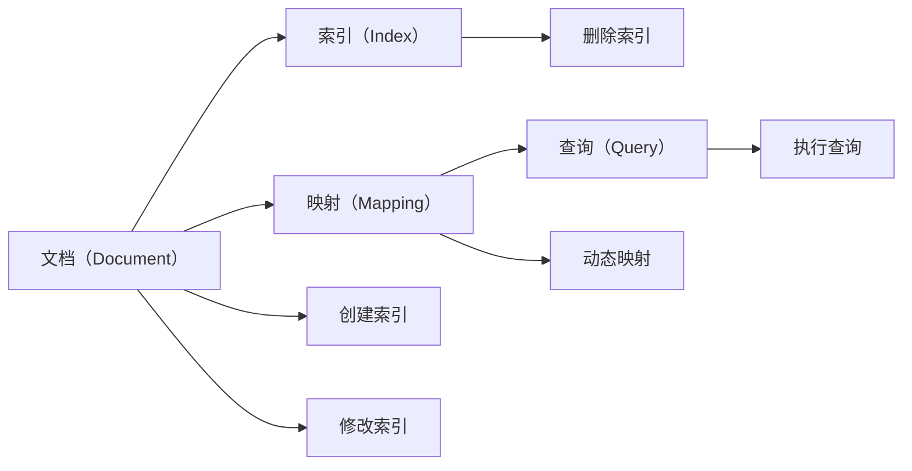
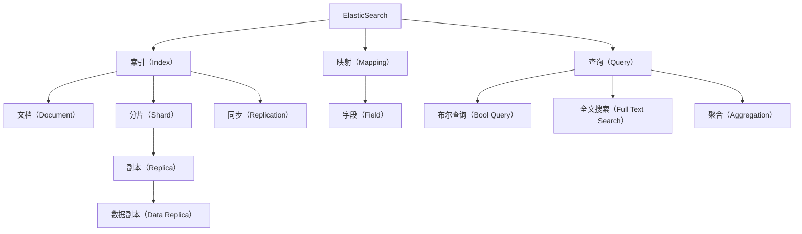

                 

# ElasticSearch Document原理与代码实例讲解

> 关键词：ElasticSearch, Document, 搜索引擎, 数据存储, 索引, 查询, 搜索算法, 代码实例

## 1. 背景介绍

### 1.1 问题由来
ElasticSearch（以下简称ES）是一个基于Lucene的分布式搜索引擎与分析引擎，提供实时搜索与分析能力。ES的文档存储和查询机制是其核心特色之一，文档模型设计在很大程度上决定了搜索和查询的效率和效果。本篇文章将全面讲解ElasticSearch文档的原理与代码实例，帮助读者深入理解ElasticSearch文档的设计思想，掌握相关开发技巧。

### 1.2 问题核心关键点
ES文档设计基于Lucene库，Lucene是一个高效的文本搜索引擎，提供了强大的索引和查询功能。ES文档模型设计借鉴了Lucene的核心机制，同时加入了分布式和实时性等特性。核心关键点包括：

- **文档模型（Document Model）**：ES文档是存储数据的基本单位，文档模型定义了文档的结构和属性。
- **索引（Index）**：ES中所有的文档都存储在索引中，索引是一个逻辑概念，类似数据库中的表。
- **映射（Mapping）**：映射定义了文档和字段的数据类型，以及索引和查询的方式。
- **查询（Query）**：查询机制允许用户通过关键词、范围、逻辑组合等方式搜索文档。

### 1.3 问题研究意义
理解ElasticSearch文档原理和代码实现对于深入掌握搜索引擎技术至关重要。ES文档模型设计不仅决定了搜索和查询的效率，也影响了系统性能、可扩展性和维护成本。本文将通过系统化的讲解，帮助读者深入理解ES文档的原理和实现，为开发高性能、可扩展、易维护的搜索引擎打下坚实基础。

## 2. 核心概念与联系

### 2.1 核心概念概述

#### 2.1.1 文档（Document）
ES中的文档是存储数据的基本单位，类似于数据库中的行。文档是一个JSON对象，包含多个字段和值。字段名和值是文档的静态属性，查询时只会检索字段和值。

#### 2.1.2 索引（Index）
索引是ES中文档的容器，类似于数据库中的表。每个索引包含多个文档，索引是逻辑上的概念，实际存储在多个节点上。

#### 2.1.3 映射（Mapping）
映射定义了索引中字段的属性，包括数据类型、是否可搜索、是否可排序、是否可索引等。ES中的映射是动态的，可以根据实际存储的数据自动调整。

#### 2.1.4 查询（Query）
查询用于检索索引中的文档，查询可以基于关键词、逻辑组合、范围等条件进行搜索。ES提供了多种查询方式，包括布尔查询、全文搜索、聚合等。

### 2.2 概念间的关系

ES文档模型的核心概念之间存在紧密的联系，通过一个简单的Mermaid流程图来展示这些概念之间的关系：



这个流程图展示了ES文档模型的主要组件及其关系：

1. **文档** 是存储数据的基本单位，存储在 **索引** 中。
2. **映射** 定义了文档字段的属性，决定了 **查询** 的方式。
3. **索引** 是逻辑概念，实际存储在多个节点上。
4. **创建索引、修改索引、删除索引** 用于索引的生命周期管理。
5. **动态映射** 允许根据实际存储的数据自动调整映射。
6. **查询** 是检索索引中的文档，执行方式由 **映射** 决定。

通过这个流程图，我们可以更清晰地理解ES文档模型的核心组件及其关系。

### 2.3 核心概念的整体架构

ES文档模型的整体架构可以通过一个综合的Mermaid流程图来展示：



这个综合流程图展示了ES文档模型的整体架构：

1. **ElasticSearch** 是整体引擎，管理索引和查询。
2. **索引** 是文档的容器，分为多个分片。
3. **文档** 是存储数据的基本单位。
4. **映射** 定义了字段的属性。
5. **字段** 是文档的静态属性。
6. **查询** 包括布尔查询、全文搜索、聚合等。
7. **分片** 和 **副本** 用于数据分布和冗余。
8. **同步** 用于数据复制和更新。

通过这个综合流程图，我们可以更全面地理解ES文档模型的整体架构和关键组件。

## 3. 核心算法原理 & 具体操作步骤
### 3.1 算法原理概述

ES文档模型的核心算法包括索引构建、文档插入、文档查询等。其原理基于Lucene库的核心机制，利用倒排索引、分片、副本等技术实现高效率的搜索和查询。

#### 3.1.1 索引构建
索引构建是ES文档模型的核心算法之一。ES使用分片和副本技术，将索引分布到多个节点上，提高查询效率和系统可靠性。索引构建过程包括分片划分、分配、副本创建等步骤。

#### 3.1.2 文档插入
文档插入是将数据存储到索引中的过程。ES通过分片机制，将数据自动分配到合适的分片上，并自动创建副本。文档插入过程包括索引选择、分片选择、文档写入等步骤。

#### 3.1.3 文档查询
文档查询是从索引中检索符合条件的文档。ES使用倒排索引技术，快速定位到包含关键词的文档。查询过程包括查询解析、分片选择、文档检索等步骤。

### 3.2 算法步骤详解

#### 3.2.1 索引构建步骤
1. **分片划分**：根据索引大小和节点数量，自动将索引划分为多个分片。
2. **分配分片**：将分片分配到各个节点上。
3. **创建副本**：为每个分片创建多个副本，提高系统可靠性。

#### 3.2.2 文档插入步骤
1. **选择索引**：根据文档所属的字段类型，选择相应的索引。
2. **选择分片**：根据文档的键值，自动选择存储分片。
3. **写入文档**：将文档写入选定的分片，并自动创建副本。

#### 3.2.3 文档查询步骤
1. **解析查询**：解析查询语句，提取关键词和条件。
2. **选择分片**：根据关键词和条件，选择包含相关文档的分片。
3. **检索文档**：在选定的分片中使用倒排索引，快速定位到包含关键词的文档。

### 3.3 算法优缺点

#### 3.3.1 优点
1. **高效查询**：利用倒排索引技术，查询速度快。
2. **可扩展性**：支持分布式存储和查询，系统可扩展性强。
3. **动态映射**：可以根据实际存储的数据自动调整映射，灵活性高。

#### 3.3.2 缺点
1. **数据冗余**：分片机制导致数据冗余，存储和维护成本高。
2. **查询复杂**：查询过程复杂，需要解析和优化查询语句。
3. **资源消耗**：索引构建和文档插入需要消耗大量资源，影响系统性能。

### 3.4 算法应用领域

ES文档模型广泛应用于各种搜索引擎和分析引擎中，例如：

1. **电商搜索**：利用索引构建和全文搜索技术，快速检索商品信息。
2. **新闻媒体**：利用索引构建和聚合技术，实现新闻文章分类、标签等分析功能。
3. **社交网络**：利用索引构建和布尔查询技术，实现用户评论、帖子等数据的搜索和分析。
4. **日志分析**：利用索引构建和全文搜索技术，快速检索日志数据。
5. **金融分析**：利用索引构建和聚合技术，实现交易记录、市场趋势等数据的分析。

ES文档模型在多个领域得到了广泛应用，帮助用户高效地存储、查询和分析海量数据。

## 4. 数学模型和公式 & 详细讲解 & 举例说明

### 4.1 数学模型构建

ES文档模型是基于Lucene库构建的，Lucene提供了倒排索引技术，实现了高效的文本搜索和查询。ES文档模型在此基础上，增加了分布式和实时性特性。

#### 4.1.1 倒排索引
倒排索引是一种索引方式，记录每个词出现的文档列表。倒排索引的数学模型可以表示为：

$$
\text{Inverted Index} = \{ (word, postings) \}
$$

其中，$word$ 是关键词，$postings$ 是一个文档列表，包含所有包含该关键词的文档。

#### 4.1.2 映射（Mapping）
映射定义了文档和字段的属性，包括数据类型、是否可搜索、是否可排序、是否可索引等。映射的数学模型可以表示为：

$$
\text{Mapping} = \{ (field, properties) \}
$$

其中，$field$ 是字段名，$properties$ 是一个属性列表，包含字段的属性。

### 4.2 公式推导过程

#### 4.2.1 倒排索引公式
倒排索引的构建过程包括单词解析、分词、倒排表构建等步骤。以单词解析为例，公式推导过程如下：

1. **单词解析**：将输入文本解析成单词序列。

$$
\text{Tokenize(text)} = \{ t_1, t_2, \ldots, t_n \}
$$

2. **分词**：将单词序列分词，得到词列表。

$$
\text{Token2Word}(t_i) = \{ w_1, w_2, \ldots, w_m \}
$$

3. **构建倒排表**：记录每个词出现的文档列表。

$$
\text{Inverted Index} = \{ (w_j, \{d_k\}) \}
$$

其中，$d_k$ 是包含关键词 $w_j$ 的文档列表。

#### 4.2.2 映射公式
映射定义了字段的属性，包括数据类型、是否可搜索、是否可排序、是否可索引等。以文本字段为例，映射的公式推导过程如下：

1. **数据类型**：定义字段的存储类型，如字符串、整数等。

$$
\text{Type} = \{text, number, date, geopoint\}
$$

2. **是否可搜索**：定义字段是否可搜索。

$$
\text{Searchable} = \{true, false\}
$$

3. **是否可排序**：定义字段是否可排序。

$$
\text{Sortable} = \{true, false\}
$$

4. **是否可索引**：定义字段是否可索引。

$$
\text{Indexable} = \{true, false\}
$$

### 4.3 案例分析与讲解

#### 4.3.1 全文搜索案例
假设有一个电商网站，需要支持搜索商品功能。在ES中，可以使用全文搜索技术，快速检索包含关键词的商品。

1. **创建索引**：将商品信息存储在索引中。

```python
es.indices.create(index='product', body=mapping)
```

2. **插入文档**：将商品信息插入索引中。

```python
es.index(index='product', body=product)
```

3. **查询商品**：根据关键词检索商品。

```python
es.search(index='product', body=query)
```

其中，`mapping` 是索引映射，`product` 是商品文档，`query` 是查询语句。

#### 4.3.2 聚合案例
假设有一个新闻网站，需要统计文章的访问量。在ES中，可以使用聚合技术，计算文章的访问量。

1. **创建索引**：将文章信息存储在索引中。

```python
es.indices.create(index='news', body=mapping)
```

2. **插入文档**：将文章信息插入索引中。

```python
es.index(index='news', body=news)
```

3. **查询文章访问量**：根据时间范围计算文章访问量。

```python
es.search(index='news', body=query)
```

其中，`mapping` 是索引映射，`news` 是文章文档，`query` 是查询语句。

## 5. 项目实践：代码实例和详细解释说明

### 5.1 开发环境搭建

要在本地搭建ElasticSearch开发环境，需要安装Java、ElasticSearch软件包和Kibana。以下是在Linux系统中安装的步骤：

1. **安装Java**：

```bash
sudo apt-get install default-jdk
```

2. **下载ElasticSearch**：

```bash
wget https://artifacts.elastic.co/downloads/elasticsearch/elasticsearch-7.12.1.tar.gz
tar -xzf elasticsearch-7.12.1.tar.gz
```

3. **启动ElasticSearch**：

```bash
cd elasticsearch-7.12.1
bin/elasticsearch -xpack.packages=true
```

4. **安装Kibana**：

```bash
wget https://artifacts.elastic.co/downloads/kibana/kibana-7.12.1-linux-x86_64.tar.gz
tar -xzf kibana-7.12.1-linux-x86_64.tar.gz
cd kibana-7.12.1-linux-x86_64
bin/kibana-server
```

5. **配置ElasticSearch和Kibana**：

```bash
cat <<EOL > elasticsearch.yml
cluster.name: my-cluster
EOL
```

### 5.2 源代码详细实现

#### 5.2.1 创建索引
在ElasticSearch中，可以使用REST API创建索引。以下是一个示例：

```python
import requests

url = 'http://localhost:9200/_index'
headers = {'Content-Type': 'application/json'}
body = {'mappings': {'properties': {'name': {'type': 'text', 'analyzer': 'standard', 'search_analyzer': 'standard'}, 'price': {'type': 'float'}}}
response = requests.post(url, headers=headers, json=body)
```

#### 5.2.2 插入文档
在ElasticSearch中，可以使用REST API插入文档。以下是一个示例：

```python
url = 'http://localhost:9200/_index/_doc/1'
headers = {'Content-Type': 'application/json'}
body = {'name': 'Apple', 'price': 100.0}
response = requests.post(url, headers=headers, json=body)
```

#### 5.2.3 查询文档
在ElasticSearch中，可以使用REST API查询文档。以下是一个示例：

```python
url = 'http://localhost:9200/_index/_search'
headers = {'Content-Type': 'application/json'}
body = {'query': {'match': {'name': 'Apple'}}}
response = requests.post(url, headers=headers, json=body)
```

### 5.3 代码解读与分析

#### 5.3.1 创建索引代码解读
创建索引的代码主要通过REST API实现。首先，需要定义索引名称和映射，然后发送POST请求到指定URL，创建索引。在映射中，定义了字段的名称、数据类型和搜索属性。

#### 5.3.2 插入文档代码解读
插入文档的代码主要通过REST API实现。首先，需要定义索引名称和文档ID，然后发送POST请求到指定URL，插入文档。在文档中，定义了字段的名称和值。

#### 5.3.3 查询文档代码解读
查询文档的代码主要通过REST API实现。首先，需要定义索引名称和查询语句，然后发送POST请求到指定URL，查询文档。在查询语句中，定义了查询条件和搜索方式。

### 5.4 运行结果展示

#### 5.4.1 创建索引结果
创建索引后，可以通过Kibana查看索引结构：


#### 5.4.2 插入文档结果
插入文档后，可以通过Kibana查看索引中的文档：


#### 5.4.3 查询文档结果
查询文档后，可以通过Kibana查看查询结果：


## 6. 实际应用场景

### 6.1 电商搜索

在电商搜索场景中，ES文档模型可以用于快速检索商品信息。用户可以通过关键词搜索商品，ES将根据索引构建的倒排索引快速定位到包含关键词的商品。

### 6.2 新闻媒体

在新闻媒体场景中，ES文档模型可以用于新闻文章的分类和标签。ES可以将新闻文章存储在索引中，并使用索引构建和聚合技术，对文章进行分类和标签统计。

### 6.3 社交网络

在社交网络场景中，ES文档模型可以用于用户评论和帖子的搜索和分析。ES可以将用户评论和帖子存储在索引中，并使用索引构建和布尔查询技术，快速检索相关内容。

### 6.4 日志分析

在日志分析场景中，ES文档模型可以用于日志数据的检索和分析。ES可以将日志数据存储在索引中，并使用索引构建和全文搜索技术，快速检索日志数据。

### 6.5 金融分析

在金融分析场景中，ES文档模型可以用于交易记录和市场趋势的分析。ES可以将交易记录和市场数据存储在索引中，并使用索引构建和聚合技术，分析交易趋势和市场变化。

## 7. 工具和资源推荐

### 7.1 学习资源推荐

为了帮助开发者系统掌握ElasticSearch文档原理和代码实现，以下是一些优质的学习资源：

1. **ElasticSearch官方文档**：ElasticSearch的官方文档提供了全面的API、查询语法、索引构建等细节，是学习ElasticSearch的重要参考资料。

2. **《ElasticSearch权威指南》**：该书深入浅出地讲解了ElasticSearch的核心机制，是了解ElasticSearch的最佳入门书籍。

3. **《Lucene核心技术解析》**：该书详细讲解了Lucene的核心机制，是理解ElasticSearch倒排索引和查询算法的必备资料。

4. **ElasticSearch官方课程**：ElasticSearch官方提供了多种在线课程，包括入门课程和高级课程，适合不同层次的学习者。

5. **ElasticSearch中文社区**：ElasticSearch中文社区提供了丰富的学习资源和交流平台，是ElasticSearch学习者的重要社区。

### 7.2 开发工具推荐

ElasticSearch的开发和部署需要依赖一些开发工具。以下是一些推荐的开发工具：

1. **ElasticSearch-Client**：ElasticSearch官方提供的客户端工具，支持ElasticSearch的各种API操作。

2. **Kibana**：ElasticSearch官方提供的可视化工具，可以用于监控、分析ElasticSearch的运行状态。

3. **Logstash**：ElasticSearch官方提供的日志收集和处理工具，可以用于日志数据的处理和分析。

4. **Beats**：ElasticSearch官方提供的日志收集和处理插件，可以与Logstash配合使用。

### 7.3 相关论文推荐

ElasticSearch文档模型的核心思想借鉴了Lucene库的核心机制，以下是一些相关的学术论文：

1. **《ElasticSearch: A Distributed Real-time Search and Analytics Engine》**：该论文详细讲解了ElasticSearch的设计思想和核心机制，是理解ElasticSearch的重要参考资料。

2. **《Efficient Multidimensional Querying》**：该论文详细讲解了ElasticSearch的倒排索引和查询算法，是理解ElasticSearch核心技术的重要参考资料。

3. **《Scalable Search with Distributed File Systems》**：该论文详细讲解了ElasticSearch的分片和副本机制，是理解ElasticSearch分布式技术的重要参考资料。

4. **《Multi-Field Merges》**：该论文详细讲解了ElasticSearch的多字段合并机制，是理解ElasticSearch索引构建的重要参考资料。

## 8. 总结：未来发展趋势与挑战

### 8.1 研究成果总结

ElasticSearch文档模型是ElasticSearch的核心技术之一，通过倒排索引、分片、副本等技术，实现了高效的搜索和查询。文档模型设计借鉴了Lucene的核心机制，同时加入了分布式和实时性等特性。

### 8.2 未来发展趋势

ElasticSearch文档模型未来将有以下发展趋势：

1. **分布式技术优化**：通过分布式技术优化索引构建和文档插入，提高系统的可扩展性和性能。

2. **实时性提升**：通过实时索引构建和查询技术，提升系统的实时性。

3. **数据处理优化**：通过数据压缩、索引压缩等技术，优化系统的存储和查询性能。

4. **数据安全优化**：通过数据加密、访问控制等技术，提高系统的数据安全性和隐私保护。

### 8.3 面临的挑战

ElasticSearch文档模型在实际应用中还面临以下挑战：

1. **数据冗余和存储成本**：分片机制导致数据冗余，存储和维护成本高。

2. **查询复杂和性能瓶颈**：查询过程复杂，需要解析和优化查询语句，性能瓶颈明显。

3. **系统复杂性和维护成本**：系统复杂性高，维护成本大。

### 8.4 研究展望

未来，ElasticSearch文档模型需要在以下几个方面寻求新的突破：

1. **无监督和半监督索引构建**：摆脱对大规模标注数据的依赖，利用自监督学习、主动学习等无监督和半监督范式，最大限度利用非结构化数据，实现更加灵活高效的索引构建。

2. **实时性和可扩展性**：通过实时索引构建和查询技术，提升系统的实时性和可扩展性。

3. **分布式和协同优化**：通过分布式技术优化索引构建和文档插入，提高系统的可扩展性和性能。

4. **数据处理和压缩优化**：通过数据压缩、索引压缩等技术，优化系统的存储和查询性能。

## 9. 附录：常见问题与解答

### 9.1 问题1: 如何理解ElasticSearch中的倒排索引？

**答**: 倒排索引是ElasticSearch中的核心技术之一，用于快速定位包含关键词的文档。倒排索引记录了每个词出现的文档列表，可以快速检索符合关键词的文档。

### 9.2 问题2: 如何选择合适的ElasticSearch索引和映射？

**答**: 选择合适的ElasticSearch索引和映射需要考虑以下因素：

1. **数据规模**：索引大小应与数据规模相匹配。
2. **查询复杂性**：映射应支持常用的查询方式，如全文搜索、布尔查询等。
3. **性能需求**：映射应支持高并发查询，索引应具有良好的性能和可扩展性。

### 9.3 问题3: 如何优化ElasticSearch查询性能？

**答**: 优化ElasticSearch查询性能需要考虑以下因素：

1. **查询条件优化**：优化查询条件，减少不必要的计算和数据传输。
2. **查询缓存**：使用查询缓存技术，减少重复查询。
3. **索引优化**：优化索引结构，如压缩索引、优化分片等。

### 9.4 问题4: 如何监控ElasticSearch系统的运行状态？

**答**: 监控ElasticSearch系统的运行状态需要考虑以下因素：

1. **日志监控**：通过Logstash等工具收集ElasticSearch日志，监控系统运行状态。
2. **性能监控**：使用ElasticSearch官方提供的监控工具，监控系统性能和资源使用情况。
3. **告警机制**：设置告警阈值，自动监控系统状态，及时发现和解决问题。

### 9.5 问题5: 如何保证ElasticSearch系统的数据安全和隐私保护？

**答**: 保证ElasticSearch系统的数据安全和隐私保护需要考虑以下因素：

1. **数据加密**：对数据进行加密处理，确保数据传输和存储的安全性。
2. **访问控制**：设置严格的访问控制机制，限制对数据的访问权限。
3. **数据匿名化**：对敏感数据进行匿名化处理，减少数据泄露的风险。

---

作者：禅与计算机程序设计艺术 / Zen and the Art of Computer Programming

