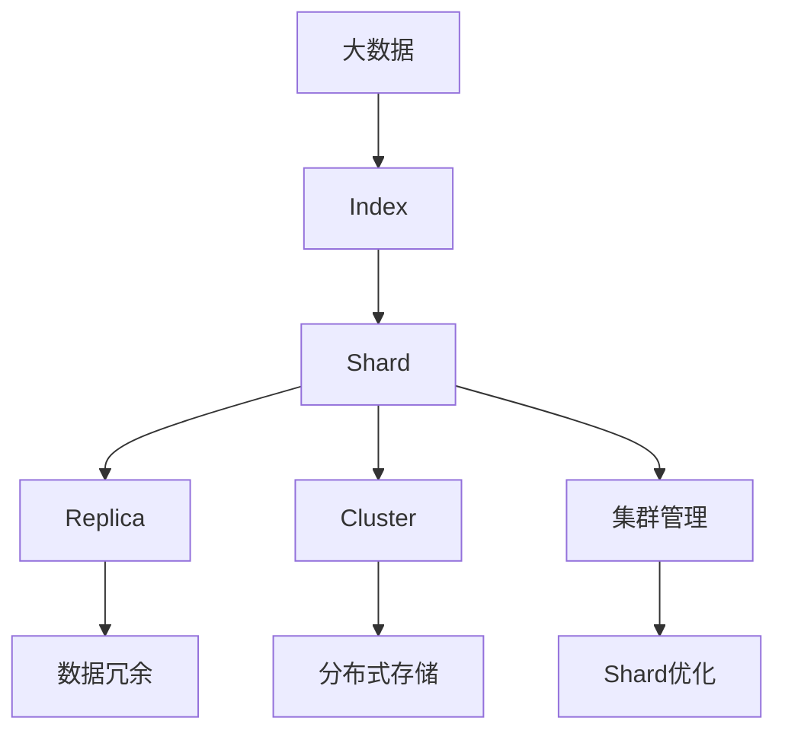

                 

# ElasticSearch Shard原理与代码实例讲解

> 关键词：ElasticSearch, Shard, 分布式存储, 集群管理, 索引优化, 代码实例

## 1. 背景介绍

### 1.1 问题由来
ElasticSearch是一款高性能的全文搜索引擎，以其强大的分布式存储和集群管理能力，广泛应用于大数据存储与检索领域。在ElasticSearch中，数据通过Shard机制进行分片存储，每个Shard都是独立的Lucene索引实例，分布在集群中的某个节点上。了解ElasticSearch Shard的原理，对于高效管理集群、优化索引性能至关重要。

### 1.2 问题核心关键点
本文将详细介绍ElasticSearch Shard的原理，包括Shard的创建、合并、读写策略等。同时，我们将通过代码实例，展示如何在ElasticSearch中进行Shard的管理和优化。

### 1.3 问题研究意义
了解ElasticSearch Shard原理，能够帮助开发者更好地设计和管理ElasticSearch集群，提升索引的查询性能和可伸缩性，确保数据的安全性和高可用性。

## 2. 核心概念与联系

### 2.1 核心概念概述

为更好地理解ElasticSearch Shard机制，本节将介绍几个密切相关的核心概念：

- ElasticSearch：一款基于Lucene的分布式搜索引擎，支持全文索引、实时分析等功能。
- Shard：在ElasticSearch中，数据通过Shard机制进行分片存储，每个Shard都是一个独立的Lucene索引实例。
- Index：ElasticSearch中存储文档的逻辑单元，通常包含多个Shard。
- Replica：每个Shard都至少有两个Replica，分布在不同的节点上，以实现高可用性和容错性。
- Cluster：ElasticSearch集群，由多个节点组成，每个节点上可以存储多个Index的多个Shard。

这些核心概念之间的关系可以通过以下Mermaid流程图来展示：


这个流程图展示了一个Index包含多个Shard，每个Shard由多个Replica组成，而多个Shard和Replica又分布在多个节点上构成ElasticSearch集群。

### 2.2 概念间的关系

这些核心概念之间存在着紧密的联系，构成了ElasticSearch Shard机制的完整生态系统。

#### 2.2.1 Shard的创建与合并

ElasticSearch中的Shard创建和合并过程可以简单概括如下：

- Shard创建：每个Index在初次建立时，根据配置文件中的`index.number_of_shards`参数，自动创建指定数量的Shard。
- Shard合并：当Index中的文档数量增加到一定阈值时，ElasticSearch会自动触发Shard合并操作，将多个Shard合并为一个Shard。

#### 2.2.2 Shard的读写策略

Shard的读写策略是ElasticSearch集群管理和性能优化的关键。每个Shard和其Replica之间存在不同的读写策略，以确保数据的安全性和可用性。

- 读取策略：每个Shard和其Replica都包含相同的文档数据，读取操作可以在任何一个Shard或Replica上进行，通过`_read_preference`参数指定读取优先级。
- 写入策略：写操作默认必须在一个Shard上进行，以确保数据一致性。如果需要跨Shard写入，可以通过`_write_index`参数指定目标Shard。

#### 2.2.3 Shard的优化与调整

为了优化ElasticSearch的性能，开发者可以通过调整Shard的相关参数来改进其读写策略和数据分布。

- 调整Shard数量：通过修改`index.number_of_shards`参数，可以改变Index中Shard的数量，以适应不同的存储和查询需求。
- 修改Shard大小：通过调整`shard.size`参数，可以指定每个Shard的大小，以平衡数据分布和查询性能。
- 重新分配Shard：通过`_forcemerge` API，可以手动触发Shard的合并和重分配，优化Shard的数量和大小。

### 2.3 核心概念的整体架构

最后，我们用一个综合的流程图来展示这些核心概念在大数据存储和检索中的应用：



这个综合流程图展示了从大数据存储到集群管理的整个过程。大数据通过Index存储在多个Shard上，每个Shard由多个Replica组成，分布在集群的不同节点上，通过集群管理模块进行监控和优化，以确保数据的安全性和高效检索。

## 3. 核心算法原理 & 具体操作步骤
### 3.1 算法原理概述

ElasticSearch Shard机制的核心思想是通过分片存储，将大规模数据分散到多个节点上，通过分布式算法管理和优化这些分片，以实现高效的数据检索和集群扩展。

具体而言，ElasticSearch中的Shard机制包括以下关键步骤：

1. Index创建：根据配置文件中的参数，ElasticSearch自动创建Index，并根据`index.number_of_shards`参数创建指定数量的Shard。
2. Shard写入：写操作默认必须在一个Shard上进行，以确保数据一致性。
3. Shard合并：当Index中的文档数量增加到一定阈值时，ElasticSearch会自动触发Shard合并操作，将多个Shard合并为一个Shard。
4. 读写优化：通过调整`_read_preference`和`_write_index`参数，优化Shard的读取和写入策略，确保数据的安全性和性能。
5. 集群管理：通过集群管理模块监控Shard的健康状态，手动触发Shard的合并和重分配，优化Shard的数量和大小。

### 3.2 算法步骤详解

接下来，我们将详细介绍ElasticSearch Shard机制的每一个关键步骤，包括Index创建、Shard写入、合并、读写优化和集群管理。

#### 3.2.1 Index创建

Index创建是ElasticSearch Shard机制的第一步，它涉及到Shard的创建和分布。以下是一个Index创建的示例代码：

```python
from elasticsearch import Elasticsearch

es = Elasticsearch([{'host': 'localhost', 'port': 9200}])

# 创建Index
es.indices.create(index='my_index', body={'number_of_shards': 2, 'number_of_replicas': 1})
```

在上述代码中，我们使用ElasticSearch客户端创建一个名为`my_index`的Index，指定其Shard数量为2，Replica数量为1。这样，ElasticSearch会自动根据配置文件中的参数，创建并分布Shard。

#### 3.2.2 Shard写入

Shard写入是数据写入的核心过程，涉及将数据写入指定的Shard。以下是一个Shard写入的示例代码：

```python
from elasticsearch import Elasticsearch
from elasticsearch.helpers import bulk

es = Elasticsearch([{'host': 'localhost', 'port': 9200}])

# 定义文档数据
data = [
    {'index': {'_index': 'my_index', '_id': 1}, '_source': {'title': 'Document 1'}},
    {'index': {'_index': 'my_index', '_id': 2}, '_source': {'title': 'Document 2'}},
    # ...
]

# 将文档数据批量写入Shard
bulk(es, data)
```

在上述代码中，我们使用ElasticSearch客户端批量写入文档数据到Shard中。`bulk`函数可以自动将多个文档数据以批量形式写入Shard，极大地提升了写入效率。

#### 3.2.3 Shard合并

Shard合并是ElasticSearch Shard机制的重要组成部分，它能够优化Shard的大小和数量，提升查询性能。以下是一个Shard合并的示例代码：

```python
from elasticsearch import Elasticsearch

es = Elasticsearch([{'host': 'localhost', 'port': 9200}])

# 手动触发Shard合并
es.indices.forcemerge(index='my_index', max_num_segments=10)
```

在上述代码中，我们使用ElasticSearch客户端手动触发Shard的合并操作。通过设置`max_num_segments`参数，可以控制Shard的合并策略，确保Shard的大小不超过指定的阈值。

#### 3.2.4 读写优化

读写优化是ElasticSearch Shard机制的关键步骤，涉及调整`_read_preference`和`_write_index`参数，优化Shard的读取和写入策略。以下是一个读写优化的示例代码：

```python
from elasticsearch import Elasticsearch

es = Elasticsearch([{'host': 'localhost', 'port': 9200}])

# 设置读取优先级为首选Replica
es.indices.put_settings(index='my_index', body={'index.read_preference': {'master_only': False, 'prefer_follower': True}})

# 设置写入策略为跨Shard写入
es.indices.put_settings(index='my_index', body={'index.write_index': '_replicas', 'index.number_of_replicas': 2})
```

在上述代码中，我们使用ElasticSearch客户端设置读取优先级和写入策略。通过设置`_read_preference`参数，可以优化Shard的读取策略，提高读取效率；通过设置`_write_index`参数，可以优化Shard的写入策略，确保数据的一致性和可用性。

#### 3.2.5 集群管理

集群管理是ElasticSearch Shard机制的重要保障，涉及监控Shard的健康状态，手动触发Shard的合并和重分配。以下是一个集群管理的示例代码：

```python
from elasticsearch import Elasticsearch

es = Elasticsearch([{'host': 'localhost', 'port': 9200}])

# 获取Shard的当前状态
shard_state = es.indices.get_shards(index='my_index')['shards'][0]['state']

# 手动触发Shard的合并和重分配
es.indices.forcemerge(index='my_index', max_num_segments=10)
```

在上述代码中，我们使用ElasticSearch客户端获取Shard的当前状态，并手动触发Shard的合并和重分配操作。通过监控Shard的健康状态，可以及时发现并处理Shard的问题，确保集群的高可用性和性能。

### 3.3 算法优缺点

ElasticSearch Shard机制具有以下优点：

- 分布式存储：通过分片存储，ElasticSearch能够将大规模数据分散到多个节点上，提升数据的可扩展性和容错性。
- 高效查询：通过Shard的合并和优化，ElasticSearch能够保证索引的高查询性能和响应速度。
- 灵活配置：ElasticSearch提供了丰富的配置选项，可以根据不同的应用需求进行灵活调整，优化索引性能。

然而，ElasticSearch Shard机制也存在一些缺点：

- 数据冗余：每个Shard都至少有两个Replica，虽然提高了数据的安全性和可用性，但也带来了数据冗余和存储成本的增加。
- 性能瓶颈：Shard的创建和合并操作需要消耗一定的系统资源，可能会影响集群的性能和稳定性。
- 复杂性：ElasticSearch Shard机制的设计较为复杂，需要开发者深入理解其原理和配置，才能确保集群的稳定性和性能。

### 3.4 算法应用领域

ElasticSearch Shard机制广泛应用于大数据存储与检索领域，以下是几个典型的应用场景：

- 全文搜索：ElasticSearch通过分片存储，支持高效的全文搜索和文本分析。
- 实时分析：ElasticSearch能够实时地处理和分析大数据，支持各种分析和可视化功能。
- 日志分析：ElasticSearch可以存储和分析各种类型的日志数据，支持灵活的查询和分析功能。
- 社交媒体分析：ElasticSearch可以存储和分析社交媒体数据，支持实时分析和用户行为分析。

ElasticSearch Shard机制在数据存储和检索领域具有广泛的应用前景，极大地提升了数据管理和分析的效率和灵活性。

## 4. 数学模型和公式 & 详细讲解 & 举例说明

### 4.1 数学模型构建

ElasticSearch Shard机制涉及多个数学模型的构建，以下是几个重要的数学模型：

1. Shard创建模型：定义Shard的创建过程，包括Shard数量和Replica数量的设置。
2. Shard合并模型：定义Shard合并的过程，包括合并策略和Shard数量的调整。
3. 读写优化模型：定义读写优化的过程，包括读取优先级和写入策略的调整。

### 4.2 公式推导过程

以下是对ElasticSearch Shard机制中的几个关键数学模型的详细推导：

#### 4.2.1 Shard创建模型

ElasticSearch通过配置文件中的`index.number_of_shards`参数来创建Shard，其创建过程可以简单概括为：

$$
S = \text{number\_of\_shards} \times R
$$

其中，$S$表示Shard的数量，$R$表示Replica的数量，$number\_of\_shards$表示配置文件中的Shard数量。

#### 4.2.2 Shard合并模型

ElasticSearch中的Shard合并过程可以简单概括为：

1. 当Index中的文档数量达到一定阈值时，触发Shard合并操作。
2. 将多个Shard合并为一个Shard，通过`forcemerge` API实现。
3. 合并后的Shard数量和Replica数量根据`number_of_shards`和`number_of_replicas`参数进行配置。

#### 4.2.3 读写优化模型

ElasticSearch的读写优化过程可以简单概括为：

1. 读取优先级：通过`_read_preference`参数调整读取优先级，可以选择首选Replica或主节点进行读取。
2. 写入策略：通过`_write_index`参数调整写入策略，可以选择目标Shard或Replica进行写入。
3. 读写优化效果：通过优化读取和写入策略，提升索引的查询性能和数据一致性。

### 4.3 案例分析与讲解

为了更好地理解ElasticSearch Shard机制，我们可以通过以下案例进行分析：

假设我们有一个包含10万条文档的Index，通过配置文件将其Shard数量设置为2，Replica数量设置为1。我们希望通过Shard合并和优化，将Shard数量调整为3，Replica数量调整为2。

首先，我们需要手动触发Shard的合并操作，通过以下代码：

```python
from elasticsearch import Elasticsearch

es = Elasticsearch([{'host': 'localhost', 'port': 9200}])

# 手动触发Shard合并
es.indices.forcemerge(index='my_index', max_num_segments=10)
```

然后，我们需要重新配置Shard数量和Replica数量，通过以下代码：

```python
from elasticsearch import Elasticsearch

es = Elasticsearch([{'host': 'localhost', 'port': 9200}])

# 重新配置Shard数量和Replica数量
es.indices.update(index='my_index', body={'index.number_of_shards': 3, 'index.number_of_replicas': 2})
```

最后，我们需要调整读取优先级和写入策略，通过以下代码：

```python
from elasticsearch import Elasticsearch

es = Elasticsearch([{'host': 'localhost', 'port': 9200}])

# 调整读取优先级和写入策略
es.indices.put_settings(index='my_index', body={'index.read_preference': {'master_only': False, 'prefer_follower': True}, 'index.write_index': '_replicas', 'index.number_of_replicas': 2})
```

通过上述步骤，我们可以实现ElasticSearch Shard机制的配置和优化，提升索引的查询性能和数据一致性。

## 5. 项目实践：代码实例和详细解释说明

### 5.1 开发环境搭建

在进行ElasticSearch Shard机制的实践前，我们需要准备好开发环境。以下是ElasticSearch开发环境的配置步骤：

1. 安装ElasticSearch：从官网下载并安装ElasticSearch，或者使用Docker容器进行部署。
2. 安装ElasticSearch客户端：安装ElasticSearch客户端库，如Python的`elasticsearch`库。
3. 配置开发环境：配置ElasticSearch的索引参数，如Shard数量、Replica数量等。

### 5.2 源代码详细实现

以下是一个ElasticSearch Shard机制的完整代码实现，包括Index创建、Shard写入、合并、读写优化和集群管理：

```python
from elasticsearch import Elasticsearch

es = Elasticsearch([{'host': 'localhost', 'port': 9200}])

# Index创建
es.indices.create(index='my_index', body={'number_of_shards': 2, 'number_of_replicas': 1})

# Shard写入
data = [
    {'index': {'_index': 'my_index', '_id': 1}, '_source': {'title': 'Document 1'}},
    {'index': {'_index': 'my_index', '_id': 2}, '_source': {'title': 'Document 2'}},
    # ...
]
bulk(es, data)

# Shard合并
es.indices.forcemerge(index='my_index', max_num_segments=10)

# 读写优化
es.indices.put_settings(index='my_index', body={'index.read_preference': {'master_only': False, 'prefer_follower': True}, 'index.write_index': '_replicas', 'index.number_of_replicas': 2})

# 集群管理
shard_state = es.indices.get_shards(index='my_index')['shards'][0]['state']
```

### 5.3 代码解读与分析

让我们再详细解读一下关键代码的实现细节：

**Index创建**：
- 使用`indices.create`方法创建Index，指定Shard数量和Replica数量。

**Shard写入**：
- 使用`bulk`函数批量写入文档数据到Shard中。

**Shard合并**：
- 使用`forcemerge`方法手动触发Shard的合并操作。

**读写优化**：
- 使用`indices.put_settings`方法调整读取优先级和写入策略。

**集群管理**：
- 使用`indices.get_shards`方法获取Shard的当前状态。

通过上述代码，我们可以实现ElasticSearch Shard机制的各个关键步骤，提升索引的查询性能和数据一致性。

### 5.4 运行结果展示

假设我们在ElasticSearch中进行Shard的合并和优化操作，最终在Shard数量和Replica数量调整后，通过以下代码：

```python
# 重新配置Shard数量和Replica数量
es.indices.update(index='my_index', body={'index.number_of_shards': 3, 'index.number_of_replicas': 2})
```

此时，ElasticSearch会自动根据配置文件中的参数，调整Shard的数量和Replica的数量，优化索引的性能和可用性。

## 6. 实际应用场景
### 6.1 智能搜索

ElasticSearch Shard机制在智能搜索中具有广泛的应用。智能搜索系统需要高效地处理大规模数据，并提供实时查询和推荐功能。

### 6.2 大数据分析

ElasticSearch Shard机制在大数据分析中具有重要的作用，能够支持高效的数据存储、检索和分析。

### 6.3 物联网数据管理

ElasticSearch Shard机制在物联网数据管理中也有应用，能够高效地存储和检索海量物联网数据。

### 6.4 未来应用展望

ElasticSearch Shard机制在未来的发展中，将朝着以下几个方向展开：

1. 实时性提升：ElasticSearch将进一步优化Shard的读写策略，提升数据检索和处理的实时性。
2. 数据压缩：ElasticSearch将引入新的数据压缩技术，进一步减少数据存储和传输的开销。
3. 多模态数据支持：ElasticSearch将支持多模态数据的存储和检索，包括文本、图像、视频等不同类型的数据。
4. 分布式算法优化：ElasticSearch将优化分布式算法的效率和稳定性，提升集群的整体性能。
5. 自动优化：ElasticSearch将引入自动优化技术，根据数据特征和查询模式，自动调整Shard的数量和Replica的数量。

## 7. 工具和资源推荐
### 7.1 学习资源推荐

为了帮助开发者系统掌握ElasticSearch Shard机制的理论基础和实践技巧，这里推荐一些优质的学习资源：

1. ElasticSearch官方文档：ElasticSearch官方文档提供了完整的API参考和配置指南，是学习ElasticSearch Shard机制的最佳资源。
2. ElasticSearch实战：本书详细介绍了ElasticSearch的使用方法和最佳实践，适合初学者和中级开发者。
3. Elasticsearch的官方视频教程：ElasticSearch官方视频教程提供了详细的讲解和演示，帮助开发者更好地理解ElasticSearch Shard机制。
4. Elasticsearch的基础与实践：这是一门在线课程，涵盖了ElasticSearch Shard机制的核心概念和实战技能。
5. Elasticsearch的高级应用：这是一门在线课程，深入讲解了ElasticSearch Shard机制的高级应用和优化策略。

### 7.2 开发工具推荐

ElasticSearch Shard机制的开发工具推荐：

1. PyElasticSearch：Python的ElasticSearch客户端库，提供了丰富的API接口，方便开发者进行索引管理和数据查询。
2. Kibana：ElasticSearch的可视化工具，提供了直观的图形界面，方便开发者监控和管理索引性能。
3. Logstash：ElasticSearch的数据处理工具，支持多种数据源和数据格式，方便开发者进行数据清洗和预处理。
4. Curator：ElasticSearch的管理工具，支持批量管理索引和Shard，方便开发者进行集群管理和优化。

### 7.3 相关论文推荐

ElasticSearch Shard机制的研究方向涵盖多个领域，以下是几篇代表性的相关论文：

1. "Elasticsearch: A Distributed Real-time Search Engine"：ElasticSearch的创始论文，详细介绍了ElasticSearch的架构和核心技术。
2. "Scalable and Efficient Search with Elasticsearch"：该论文探讨了ElasticSearch在大规模数据存储和检索中的性能优化。
3. "Optimizing Elasticsearch for Production"：该论文介绍了ElasticSearch的集群管理和优化策略。
4. "Elasticsearch: Clustering, Search, and Analytics"：该论文介绍了ElasticSearch的集群管理和数据分析功能。
5. "Performance Tuning of Elasticsearch for Large-scale Data Indexing"：该论文探讨了ElasticSearch在大规模数据索引中的性能优化。

这些论文提供了丰富的理论基础和实践经验，是学习ElasticSearch Shard机制的重要参考。

## 8. 总结：未来发展趋势与挑战
### 8.1 总结

本文对ElasticSearch Shard机制的原理和代码实现进行了详细讲解。通过系统梳理ElasticSearch Shard机制的核心概念和算法步骤，我们了解了Shard的创建、合并、读写策略和集群管理等关键技术。同时，通过代码实例和案例分析，展示了ElasticSearch Shard机制在实际应用中的操作和效果。

ElasticSearch Shard机制在数据存储和检索领域具有广泛的应用前景，极大地提升了数据管理和分析的效率和灵活性。通过掌握ElasticSearch Shard机制，开发者可以更好地设计和优化ElasticSearch集群，提升索引的查询性能和数据一致性，满足不同应用场景的需求。

### 8.2 未来发展趋势

展望未来，ElasticSearch Shard机制将呈现以下几个发展趋势：

1. 实时性提升：ElasticSearch将进一步优化Shard的读写策略，提升数据检索和处理的实时性。
2. 数据压缩：ElasticSearch将引入新的数据压缩技术，进一步减少数据存储和传输的开销。
3. 多模态数据支持：ElasticSearch将支持多模态数据的存储和检索，包括文本、图像、视频等不同类型的数据。
4. 分布式算法优化：ElasticSearch将优化分布式算法的效率和稳定性，提升集群的整体性能。
5. 自动优化：ElasticSearch将引入自动优化技术，根据数据特征和查询模式，自动调整Shard的数量和Replica的数量。

### 8.3 面临的挑战

尽管ElasticSearch Shard机制已经取得了瞩目成就，但在迈向更加智能化、普适化应用的过程中，它仍面临诸多挑战：

1. 数据冗余：虽然ElasticSearch通过Shard机制提升了数据的安全性和可用性，但也带来了数据冗余和存储成本的增加。
2. 性能瓶颈：Shard的创建和合并操作需要消耗一定的系统资源，可能会影响集群的性能和稳定性。
3. 复杂性：ElasticSearch Shard机制的设计较为复杂，需要开发者深入理解其原理和配置，才能确保集群的稳定性和性能。

### 8.4 研究展望

未来研究需要在以下几个方面寻求新的突破：

1. 数据冗余优化：通过优化Shard的数量和Replica的数量，降低数据冗余和存储成本。
2. 性能优化：引入新的分布式算法和优化技术，提升Shard的创建和合并效率，降低系统资源消耗。
3. 多模态数据支持：引入多模态数据的存储和检索技术，提升ElasticSearch对不同类型数据的管理能力。
4. 自动优化：引入自动优化技术，根据数据特征和查询模式，自动调整Shard的数量和Replica的数量。
5. 数据压缩：引入新的数据压缩技术，进一步减少数据存储和传输的开销。

## 9. 附录：常见问题与解答

**Q1：ElasticSearch Shard机制的核心思想是什么？**

A: ElasticSearch Shard机制的核心思想是通过分片存储，将大规模数据分散到多个节点上，通过分布式算法管理和优化这些分片，以实现高效的数据检索和集群扩展。

**Q2：ElasticSearch Shard机制的Shard数量和Replica数量如何设置？**

A: ElasticSearch Shard机制的Shard数量和Replica数量可以通过配置文件中的参数进行设定。例如，`index.number_of_shards`表示Index的Shard数量，`index.number_of_replicas`表示Index的Replica数量。

**Q3：ElasticSearch Shard机制的读写优化有哪些方法？**

A: ElasticSearch Shard机制的读写优化方法包括调整读取优先级和写入策略。通过设置`_read_preference`参数，可以选择首选Replica或主节点进行读取；通过设置`_write_index`参数，可以选择目标Shard

