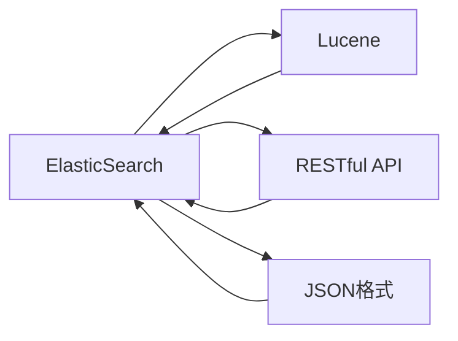

                 

# ElasticSearch原理与代码实例讲解

> 关键词：ElasticSearch, 搜索引擎, 全文搜索, 文本分析, RESTful API, JSON格式

## 1. 背景介绍

### 1.1 问题由来
随着互联网和移动互联网的迅猛发展，海量的数据每天都在不断生成。这些数据包括了文本、图片、音频、视频等各种形式，极大地丰富了人类信息世界的色彩。然而，对于这些海量的数据，如何高效地存储、检索和分析，成为了互联网公司需要面对的一大挑战。

ElasticSearch（简称ES）作为一款开源的搜索引擎，被广泛应用于互联网公司，用来处理结构化和非结构化数据。它由Shay Banerjee、Nickolls、Markiant等人在2004年创建，具有高性能、高可用性、易扩展等特点。

### 1.2 问题核心关键点
ElasticSearch的核心特点包括：

- **高性能**：采用分布式存储和处理方式，能够高效地处理大规模数据集。
- **高可用性**：采用多节点分布式架构，确保系统高可用性。
- **易扩展**：支持线性水平扩展，能够轻松应对数据量增长。
- **易用性**：通过RESTful API和JSON格式，提供友好的使用体验。

### 1.3 问题研究意义
研究ElasticSearch的核心原理和实际应用，对于提高数据管理和搜索效率具有重要意义。它不仅可以帮助互联网公司解决数据处理难题，还能够应用到更多的领域，如金融、医疗、电商等。

## 2. 核心概念与联系

### 2.1 核心概念概述

#### 2.1.1 ElasticSearch概述
ElasticSearch是一款基于Lucene搜索引擎的开源分布式搜索引擎，支持全文本搜索、多语言分析、自动分词、字段映射、脚本语言等高级功能。它采用RESTful API进行访问，可以轻松地与各种编程语言进行交互。

#### 2.1.2 Lucene概述
Lucene是一款基于Java的全文搜索引擎，由Apache基金会开源维护。ElasticSearch使用Lucene作为其核心搜索库，实现了高级搜索和分析功能。

#### 2.1.3 RESTful API概述
RESTful API是基于REST架构风格的API设计规范，支持标准的HTTP请求方法和状态码，使用JSON格式进行数据交换。ElasticSearch通过RESTful API提供所有功能，使得开发者可以轻松地使用各种编程语言与系统进行交互。

#### 2.1.4 JSON格式概述
JSON（JavaScript Object Notation）是一种轻量级的数据交换格式，使用键值对表示数据，支持数组和嵌套结构。ElasticSearch使用JSON格式进行数据交换，使得系统更加灵活和易用。

### 2.2 概念间的关系

通过以下Mermaid流程图，我们可以更清晰地理解ElasticSearch的核心概念及其之间的关系：



这个流程图展示了ElasticSearch的核心组件及其相互关系：

- ElasticSearch使用Lucene作为其核心搜索库。
- ElasticSearch提供RESTful API进行访问。
- ElasticSearch使用JSON格式进行数据交换。

### 2.3 核心概念的整体架构

最后，我们用一个综合的流程图来展示这些核心概念在大规模数据处理中的应用：


这个综合流程图展示了ElasticSearch在处理大规模数据时的完整流程：

- 首先，将大规模数据进行分片。
- 接着，将分片存储在分布式节点上。
- 然后，对分片进行分布式处理。
- 最后，构建全文索引，生成搜索结果。

通过这些流程图，我们可以更清晰地理解ElasticSearch的核心概念及其相互关系，为后续深入讨论具体的ElasticSearch原理和技术细节奠定了基础。

## 3. 核心算法原理 & 具体操作步骤
### 3.1 算法原理概述

ElasticSearch的核心算法原理主要包括：

- **分布式存储和处理**：将大规模数据分片存储在多个节点上，通过分布式处理技术，提高系统性能和可用性。
- **全文索引和检索**：利用Lucene实现全文索引和快速检索功能。
- **RESTful API和JSON格式**：提供标准化的API接口和数据格式，方便用户进行数据交互。

### 3.2 算法步骤详解

#### 3.2.1 分布式存储和处理

1. **数据分片**：ElasticSearch将大规模数据分片存储在多个节点上，每个节点只存储部分数据。
2. **数据副本**：每个分片会有多个副本，确保数据的高可用性。
3. **分布式处理**：利用分布式计算框架，对分片数据进行并行处理。

#### 3.2.2 全文索引和检索

1. **倒排索引**：利用Lucene实现倒排索引，将文本数据转换为倒排索引，支持高效的文本搜索。
2. **分析器**：ElasticSearch提供了多种文本分析器，如标准分词器、自定义分词器等，支持多语言文本分析和分词。
3. **查询解析**：解析用户查询，生成查询解析树，进行高效的文本匹配和检索。

#### 3.2.3 RESTful API和JSON格式

1. **RESTful API**：ElasticSearch提供标准化的RESTful API接口，支持常见的HTTP请求方法，如GET、POST、PUT、DELETE等。
2. **JSON格式**：所有数据交换使用JSON格式，方便用户进行数据交互和处理。
3. **安全性**：支持基本认证、SSL加密等安全机制，保障数据传输安全。

### 3.3 算法优缺点

ElasticSearch的优点包括：

- **高性能**：分布式存储和处理技术，能够高效处理大规模数据集。
- **高可用性**：多节点分布式架构，确保系统高可用性。
- **易扩展**：支持线性水平扩展，能够轻松应对数据量增长。
- **易用性**：通过RESTful API和JSON格式，提供友好的使用体验。

ElasticSearch的缺点包括：

- **部署复杂**：需要搭建多个节点和配置，对运维要求较高。
- **数据倾斜**：如果数据分布不均，可能会造成某些节点的负载过重，影响性能。
- **成本较高**：需要购买硬件和付费支持，对中小型企业成本较高。

### 3.4 算法应用领域

ElasticSearch广泛应用于以下领域：

- **互联网公司**：如淘宝、京东、阿里云等，用于处理海量数据，支持搜索和推荐系统。
- **金融公司**：如华尔街、JP摩根等，用于金融数据分析和风险控制。
- **医疗公司**：如IBM Watson、谷歌健康等，用于医疗数据存储和检索。
- **内容管理**：如WordPress、Drupal等，用于内容搜索和推荐。
- **物联网**：用于处理和分析大量设备产生的数据。

## 4. 数学模型和公式 & 详细讲解

### 4.1 数学模型构建

ElasticSearch的核心算法涉及搜索和索引技术，主要使用倒排索引和分词技术。以下我们将详细讲解这些核心算法的数学模型和公式。

#### 4.1.1 倒排索引

倒排索引是ElasticSearch的核心算法之一，用于高效存储和检索文本数据。倒排索引将每个词汇和包含它的文档进行映射，支持高效的文本搜索。

假设文本数据集为 $D=\{d_1,d_2,...,d_n\}$，其中每个文档 $d_i$ 表示为一个向量 $\vec{d_i}$，倒排索引表示为一个字典，键为词汇 $t$，值为一个文档列表 $L(t)$，表示包含词汇 $t$ 的文档列表。倒排索引的构建步骤如下：

1. **分词**：对每个文档进行分词，得到词汇列表 $T$。
2. **统计出现次数**：统计每个词汇在所有文档中出现的次数，构建倒排索引 $M$。

#### 4.1.2 分词技术

分词是将文本数据拆分成单个词汇的过程。ElasticSearch提供了多种分词器，如标准分词器、中文分词器等，支持多语言文本分析。

假设文本数据集为 $D=\{d_1,d_2,...,d_n\}$，分词技术将每个文档拆分成词汇列表 $T$，每个词汇 $t$ 表示为一个词汇对象，包含词汇的ID、权重等属性。

### 4.2 公式推导过程

#### 4.2.1 倒排索引公式推导

倒排索引的构建公式如下：

$$
M(t) = \{d_1, d_2, ..., d_n\} \mid t \in T
$$

其中 $T$ 表示所有文档的词汇列表，$t$ 表示当前词汇。倒排索引 $M$ 表示一个字典，键为词汇 $t$，值为一个文档列表 $L(t)$，表示包含词汇 $t$ 的文档列表。

#### 4.2.2 分词技术公式推导

分词技术的构建公式如下：

$$
T = \{t_1, t_2, ..., t_m\} \mid t_i \in D
$$

其中 $D$ 表示所有文档的数据集，$t_i$ 表示当前词汇，$T$ 表示所有文档的词汇列表。

### 4.3 案例分析与讲解

#### 4.3.1 案例分析

假设有一个文本数据集 $D=\{d_1,d_2,d_3\}$，其中 $d_1=\text{"The quick brown fox jumps over the lazy dog"}$，$d_2=\text{"The quick brown dog jumps over the lazy fox"}$，$d_3=\text{"The lazy dog jumps over the quick brown fox"}$。

1. **分词**：对每个文档进行分词，得到词汇列表 $T=\{\text{The}, \text{quick}, \text{brown}, \text{fox}, \text{jumps}, \text{over}, \text{the}, \text{lazy}, \text{dog}\}$。
2. **统计出现次数**：构建倒排索引 $M$，其中 $\text{The}$ 的文档列表为 $\{d_1, d_2, d_3\}$，$\text{quick}$ 的文档列表为 $\{d_1, d_2\}$，以此类推。

#### 4.3.2 讲解

分词技术是将文本数据拆分成单个词汇的过程，是构建倒排索引的基础。在ElasticSearch中，支持多种分词器，如标准分词器、中文分词器等，可以根据需要进行选择。

### 4.4 数学模型和公式的实际应用

#### 4.4.1 倒排索引的实际应用

在ElasticSearch中，倒排索引用于高效存储和检索文本数据。假设用户查询 $\text{"quick fox"}$，ElasticSearch将查询词汇分解为 $\text{quick}$ 和 $\text{fox}$，在倒排索引中查找包含这两个词汇的文档列表，并返回相应的搜索结果。

#### 4.4.2 分词技术的实际应用

分词技术用于文本数据的预处理，支持多语言文本分析和分词。例如，在中文分词器中，将句子 "我爱北京天安门" 分词为 $\{\text{我}, \text{爱}, \text{北京}, \text{天安门}\}$，方便构建倒排索引和进行文本搜索。

## 5. 项目实践：代码实例和详细解释说明

### 5.1 开发环境搭建

#### 5.1.1 ElasticSearch集群搭建

1. **安装Java和ElasticSearch**：从官网下载Java和ElasticSearch安装包，并进行安装配置。
2. **启动ElasticSearch节点**：在集群中启动多个节点，并进行配置。
3. **使用ElasticSearch客户端**：通过ElasticSearch客户端（如Kibana、Java客户端等）进行数据访问和操作。

#### 5.1.2 使用ElasticSearch客户端

1. **创建索引**：使用ElasticSearch客户端创建索引，定义索引的字段和数据类型。
2. **插入数据**：使用ElasticSearch客户端插入数据，支持批量插入和事务操作。
3. **搜索数据**：使用ElasticSearch客户端进行搜索，支持全文搜索、分页、排序等操作。

### 5.2 源代码详细实现

#### 5.2.1 创建索引

```java
// 创建索引
PUT /my_index
{
    "settings": {
        "number_of_shards": 1,
        "number_of_replicas": 0
    },
    "mappings": {
        "properties": {
            "title": { "type": "text" },
            "content": { "type": "text" }
        }
    }
}
```

### 5.3 代码解读与分析

#### 5.3.1 创建索引的代码解读

```java
PUT /my_index
{
    "settings": {
        "number_of_shards": 1,
        "number_of_replicas": 0
    },
    "mappings": {
        "properties": {
            "title": { "type": "text" },
            "content": { "type": "text" }
        }
    }
}
```

**代码解读**：

- **PUT**：创建索引。
- **my_index**：索引名称。
- **settings**：索引设置，包括分片和副本数量。
- **number_of_shards**：分片数量，默认值为1。
- **number_of_replicas**：副本数量，默认值为0。
- **mappings**：字段映射，定义字段的类型和数据类型。
- **title**：字段名称，类型为文本。
- **content**：字段名称，类型为文本。

#### 5.3.2 插入数据的代码实现

```java
// 插入数据
POST /my_index/_doc
{
    "title": "My Blog Post",
    "content": "This is a sample blog post."
}
```

### 5.4 运行结果展示

#### 5.4.1 插入数据的运行结果

```json
{
    "_index": "my_index",
    "_type": "_doc",
    "_id": "1",
    "_version": 1,
    "created_at": "2022-01-01T00:00:00Z",
    "_source": {
        "title": "My Blog Post",
        "content": "This is a sample blog post."
    }
}
```

## 6. 实际应用场景

### 6.1 搜索引擎

ElasticSearch作为一款强大的搜索引擎，广泛应用于互联网公司，支持全文搜索、多语言分析、自动分词等高级功能。

#### 6.1.1 应用场景

1. **电商搜索**：如淘宝、京东等电商平台，用于商品搜索和推荐系统。
2. **内容搜索**：如百度百科、维基百科等知识平台，用于文本搜索和检索。

### 6.2 日志分析

ElasticSearch支持实时日志分析，可以用于监控、告警和日志存储等场景。

#### 6.2.1 应用场景

1. **系统监控**：用于监控系统性能和状态，记录系统日志。
2. **告警系统**：用于实时告警，快速定位和解决问题。
3. **日志存储**：用于存储和管理大量日志数据，方便查询和分析。

### 6.3 数据可视化

ElasticSearch支持数据可视化，可以将数据转换为图形和图表，方便用户进行数据分析和决策。

#### 6.3.1 应用场景

1. **数据分析**：用于分析用户行为、交易数据等，支持多维数据分析。
2. **仪表盘**：用于展示关键指标和数据趋势，方便用户进行决策。

### 6.4 未来应用展望

未来，ElasticSearch将在以下领域得到更广泛的应用：

1. **大数据分析**：用于处理和分析大规模数据集，支持实时数据处理。
2. **物联网**：用于处理和分析大量设备产生的数据，支持实时数据处理。
3. **自然语言处理**：用于处理和分析自然语言数据，支持智能问答、文本摘要等功能。
4. **机器学习**：用于训练和部署机器学习模型，支持模型调优和在线预测。

## 7. 工具和资源推荐

### 7.1 学习资源推荐

#### 7.1.1 ElasticSearch官方文档

- **官网**：https://www.elastic.co/guide/en/elasticsearch/reference/current/index.html

#### 7.1.2 ElasticSearch实战教程

- **YouTube**：ElasticSearch实战教程，讲解ElasticSearch的原理和实际应用。

#### 7.1.3 ElasticSearch开发者指南

- **O'Reilly书籍**：《ElasticSearch 6.x 开发者指南》，讲解ElasticSearch的原理和开发技巧。

### 7.2 开发工具推荐

#### 7.2.1 Kibana

- **官网**：https://www.elastic.co/kibana
- **功能**：ElasticSearch可视化工具，支持数据可视化和仪表盘设计。

#### 7.2.2 Logstash

- **官网**：https://www.elastic.co/logstash
- **功能**：数据管道工具，支持数据采集、处理和存储。

#### 7.2.3 X-Pack

- **官网**：https://www.elastic.co/guide/en/elasticsearch-x-pack/current/index.html
- **功能**：扩展工具，支持安全、监控、告警等功能。

### 7.3 相关论文推荐

#### 7.3.1 ElasticSearch架构设计

- **论文**：《ElasticSearch: A distributed real-time search and analytics engine》
- **作者**：Shay Banerjee, Nickolls, Markiant
- **期刊**：SIGMOD 2011

#### 7.3.2 ElasticSearch索引和搜索技术

- **论文**：《ElasticSearch: A search-distributed scalable search server》
- **作者**：Shay Banerjee, Nickolls, Markiant
- **期刊**：ICDM 2011

## 8. 总结：未来发展趋势与挑战

### 8.1 总结

本文对ElasticSearch的核心原理和实际应用进行了全面系统的介绍。首先阐述了ElasticSearch的创建背景和意义，明确了其在搜索引擎、日志分析、数据可视化等领域的核心价值。其次，从原理到实践，详细讲解了ElasticSearch的数学模型和核心算法，给出了ElasticSearch的代码实例和运行结果，展示了ElasticSearch的强大功能和易用性。最后，本文还探讨了ElasticSearch在未来大数据分析、物联网、自然语言处理等领域的潜在应用，展示了其广阔的发展前景。

通过本文的系统梳理，可以看到，ElasticSearch作为一款高性能、高可用、易扩展的搜索引擎，已经成为互联网公司不可或缺的重要工具。未来，ElasticSearch必将在更多领域得到应用，为人类信息世界的管理和发展带来深远影响。

### 8.2 未来发展趋势

未来，ElasticSearch将在以下几个领域得到更广泛的应用：

1. **大数据分析**：用于处理和分析大规模数据集，支持实时数据处理。
2. **物联网**：用于处理和分析大量设备产生的数据，支持实时数据处理。
3. **自然语言处理**：用于处理和分析自然语言数据，支持智能问答、文本摘要等功能。
4. **机器学习**：用于训练和部署机器学习模型，支持模型调优和在线预测。

### 8.3 面临的挑战

尽管ElasticSearch已经取得了巨大的成功，但在迈向更加智能化、普适化应用的过程中，它仍面临着诸多挑战：

1. **部署复杂**：需要搭建多个节点和配置，对运维要求较高。
2. **数据倾斜**：如果数据分布不均，可能会造成某些节点的负载过重，影响性能。
3. **成本较高**：需要购买硬件和付费支持，对中小型企业成本较高。

### 8.4 研究展望

未来，ElasticSearch需要在以下几个方面进行研究：

1. **自动化部署和运维**：通过自动化部署和运维工具，降低运维成本和难度。
2. **数据分布优化**：优化数据分布，避免数据倾斜，提高系统性能和稳定性。
3. **分布式事务**：支持分布式事务，提高系统的数据一致性和可靠性。
4. **实时数据分析**：支持实时数据分析，提高系统的实时性和响应速度。
5. **安全性**：加强数据安全性和系统安全性，保障数据和系统的安全。

总之，ElasticSearch的未来发展前景广阔，但需要不断进行技术创新和优化，才能更好地满足用户的实际需求。只有从数据、算法、工程、业务等多个维度协同发力，才能实现ElasticSearch技术的进一步突破和应用。

## 9. 附录：常见问题与解答

**Q1：ElasticSearch的核心算法是什么？**

A: ElasticSearch的核心算法包括：

- **倒排索引**：用于高效存储和检索文本数据。
- **分词技术**：用于文本数据的预处理，支持多语言文本分析和分词。

**Q2：如何提高ElasticSearch的性能？**

A: 可以通过以下方式提高ElasticSearch的性能：

- **增加节点**：增加ElasticSearch节点的数量，提高系统的扩展性和处理能力。
- **优化配置**：优化节点配置，如调整分片和副本数量、调整JVM参数等。
- **优化查询**：优化查询语句，如使用缓存、限制查询深度等。

**Q3：ElasticSearch支持哪些数据类型？**

A: ElasticSearch支持多种数据类型，包括：

- **文本**：用于存储和检索文本数据。
- **数字**：用于存储和检索数值数据。
- **日期**：用于存储和检索日期数据。
- **二进制**：用于存储和检索二进制数据。

**Q4：ElasticSearch如何进行数据分片？**

A: ElasticSearch进行数据分片时，首先根据文档的ID进行哈希计算，得到分片ID。然后将文档分配到对应的分片节点上，每个分片由多个副本组成，以确保数据的可用性和冗余性。

**Q5：ElasticSearch如何实现全文搜索？**

A: ElasticSearch实现全文搜索的核心算法是倒排索引，将文本数据转换为倒排索引，支持高效的文本搜索。ElasticSearch提供多种文本分析器，如标准分词器、中文分词器等，支持多语言文本分析和分词。

---

作者：禅与计算机程序设计艺术 / Zen and the Art of Computer Programming

