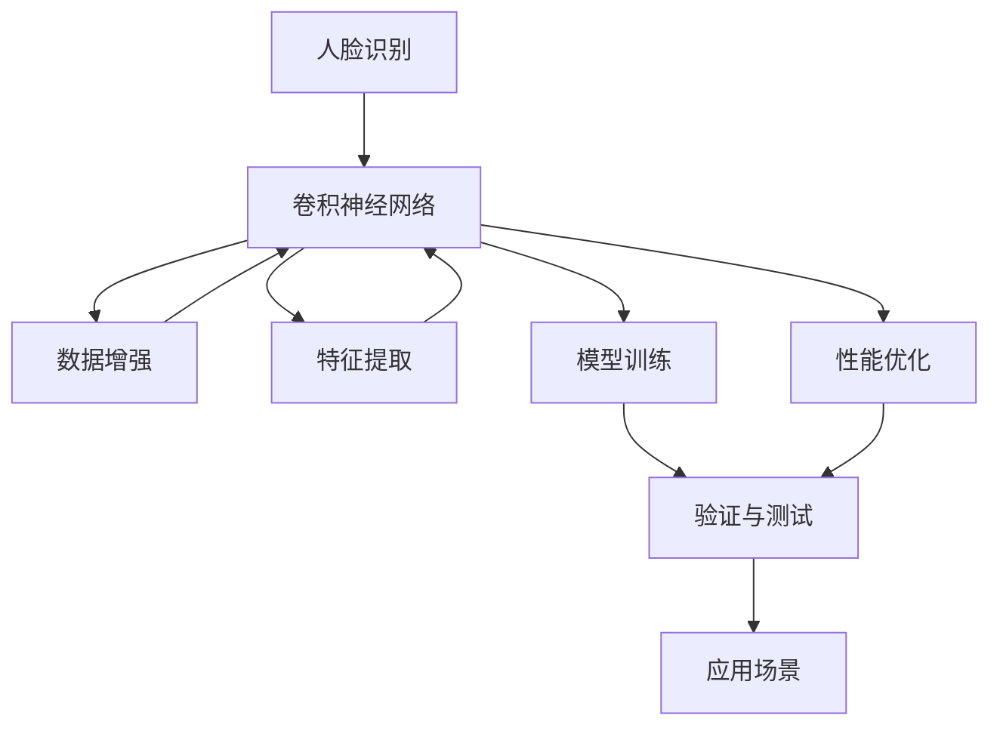

                 

# Facial Recognition 原理与代码实战案例讲解

> 关键词：人脸识别,卷积神经网络,数据增强,特征提取,模型训练

## 1. 背景介绍

### 1.1 问题由来
在现代社会，人脸识别（Facial Recognition）技术已经成为各个领域的热点。无论是公共安全、金融识别、人力资源管理还是智能家居，人脸识别都能提供极高的安全性和便利性。然而，尽管人脸识别技术已取得显著进展，但如何提高识别的准确性、速度和鲁棒性，仍是业界关注的焦点。

### 1.2 问题核心关键点
本文章将围绕人脸识别技术展开讨论，涵盖人脸识别的基本原理、数据处理流程、模型训练、性能优化以及应用场景。我们关注的问题核心点包括：

- **人脸识别原理**：人脸识别的基本原理是什么？如何通过卷积神经网络（CNN）进行特征提取和分类？
- **数据处理**：在训练和测试过程中，如何收集和处理人脸数据，确保数据的质量和多样性？
- **模型训练**：训练人脸识别模型需采取何种策略？如何应对过拟合和欠拟合问题？
- **性能优化**：如何通过算法和工程手段，提高人脸识别模型的速度和准确性？
- **应用场景**：人脸识别技术在哪些领域有应用？如何处理各种不同的应用需求？

### 1.3 问题研究意义
研究人脸识别技术的原理和实现方法，对于提升社会管理效率、保护个人隐私、推动人工智能技术发展具有重要意义。能够使我们更深刻地理解这一技术，并为开发和应用该技术提供理论依据和技术支持。

## 2. 核心概念与联系

### 2.1 核心概念概述

在人脸识别领域，存在许多核心概念，了解这些概念是掌握技术原理和实现方法的基础。以下是一些关键概念：

- **人脸识别**：通过分析人脸图像，实现对个体身份的自动识别。
- **卷积神经网络（CNN）**：一种深度学习模型，用于图像特征提取和分类。
- **数据增强**：通过对训练数据进行随机变换，增加数据多样性，避免过拟合。
- **特征提取**：从图像中提取对分类有帮助的特征，提高模型的泛化能力。
- **模型训练**：通过大量标注数据训练模型，使其能够学习到识别不同人脸的特征。

这些核心概念之间存在紧密的联系，通过理解这些概念，可以更深入地了解人脸识别技术的实现过程。

### 2.2 概念间的关系

核心概念之间的关系可以通过以下 Mermaid 流程图来展示：



这个流程图展示了人脸识别技术的核心流程：

1. 人脸识别首先使用卷积神经网络进行特征提取。
2. 数据增强技术用于增加数据多样性，提高模型的鲁棒性。
3. 特征提取后，进入模型训练过程，学习人脸分类的特征。
4. 通过性能优化提升模型性能。
5. 最终，经过验证与测试，适用于各种应用场景。

## 3. 核心算法原理 & 具体操作步骤
### 3.1 算法原理概述

人脸识别算法通常分为两个步骤：

1. **特征提取**：从原始图像中提取与身份相关的特征，使用卷积神经网络实现。
2. **分类**：将提取的特征输入分类器进行身份识别，实现人脸匹配。

### 3.2 算法步骤详解

**Step 1: 数据收集与预处理**
- 收集人脸数据集，如LFW、CASIA-WebFace等公开数据集。
- 进行人脸对齐、去噪、归一化等预处理步骤，以提高图像质量。

**Step 2: 网络模型构建**
- 设计卷积神经网络结构，包括卷积层、池化层、全连接层等。
- 选择激活函数，如ReLU、LeakyReLU等，以提高模型的非线性表达能力。
- 使用Dropout等正则化技术，避免过拟合。

**Step 3: 特征提取与编码**
- 将处理好的图像输入网络模型，提取特征。
- 通常使用特征向量作为最终输出，如Flatten层提取的全连接层输出。

**Step 4: 模型训练**
- 准备训练数据集和测试数据集，划分为训练集、验证集和测试集。
- 使用SGD、Adam等优化算法进行模型训练。
- 调整学习率、批次大小等超参数，以获得最优的训练效果。

**Step 5: 模型评估**
- 在测试集上评估模型性能，如准确率、召回率、F1分数等。
- 使用混淆矩阵等工具分析模型的识别效果。

**Step 6: 应用场景部署**
- 将训练好的模型部署到应用场景中，如识别门禁系统、视频监控等。
- 实时采集人脸图像，使用模型进行身份识别，并提供识别结果。

### 3.3 算法优缺点

人脸识别算法的主要优点包括：

1. **鲁棒性高**：人脸识别算法在光照变化、角度变化等情况下依然能保持较高识别率。
2. **速度快**：随着硬件加速技术的发展，人脸识别模型在计算速度上显著提升。
3. **应用广泛**：广泛应用于公安、金融、医疗等多个领域。

缺点主要体现在：

1. **数据依赖**：需要大量高质量的人脸数据，数据收集和标注工作量较大。
2. **隐私问题**：人脸数据涉及隐私保护，需要严格遵守相关法律法规。
3. **硬件要求高**：高性能计算资源和硬件加速支持是必要条件。

### 3.4 算法应用领域

人脸识别技术在多个领域都有广泛应用，具体包括：

1. **安全监控**：用于门禁系统、视频监控等场景，提升公共安全。
2. **金融识别**：用于客户身份验证、欺诈检测等，保护金融资产安全。
3. **人力资源管理**：用于考勤、招聘、培训等，提高管理效率。
4. **智能家居**：用于智能门锁、家庭监控等，提高生活便利性。
5. **医疗应用**：用于病患识别、手术室管理等，提升医疗服务质量。

## 4. 数学模型和公式 & 详细讲解 & 举例说明

### 4.1 数学模型构建

人脸识别模型的数学模型主要涉及卷积神经网络（CNN）和全连接层。下面以LFW数据集为例，构建人脸识别模型。

**输入层**：输入图像大小为 $W \times H$，表示为 $X \in \mathbb{R}^{W \times H \times C}$，其中 $C$ 为颜色通道数。

**卷积层**：通过卷积操作提取特征，具体为 $f(\theta, X) = \max_{\theta} \{ \sum_i k_i * X_i \}$，其中 $k_i$ 为卷积核， $X_i$ 为输入图像区域， $\theta$ 为卷积核参数。

**池化层**：对卷积层的输出进行下采样，减少参数量，具体为 $g(\theta, X) = \max(\theta * X)$，其中 $\theta$ 为池化核。

**全连接层**：将池化层的输出展开为一维向量，通过全连接层进行分类，具体为 $h(\theta, X) = \sum_i w_i * f(\theta_i, X_i)$，其中 $w_i$ 为全连接层的权重， $\theta_i$ 为全连接层的参数。

### 4.2 公式推导过程

以下以LFW数据集为例，推导人脸识别模型的损失函数和优化过程。

**损失函数**：使用交叉熵损失函数，表示为 $L(X, y) = -\frac{1}{N} \sum_{i=1}^{N} \log(y_i)$，其中 $y$ 为模型预测输出， $y_i$ 为真实标签。

**优化过程**：使用随机梯度下降（SGD）优化算法，更新模型参数，具体为 $\theta \leftarrow \theta - \eta \nabla_{\theta} L(X, y) - \eta \lambda \theta$，其中 $\eta$ 为学习率， $\lambda$ 为正则化系数。

### 4.3 案例分析与讲解

以LFW数据集为例，分析人脸识别模型的构建和训练过程。

**Step 1: 数据预处理**
- 加载LFW数据集，并进行人脸对齐、去噪、归一化等预处理步骤。
- 将处理好的图像转换为张量形式，输入网络模型。

**Step 2: 网络模型构建**
- 使用VGGFace网络结构，包括卷积层、池化层、全连接层等。
- 选择ReLU作为激活函数，使用Dropout避免过拟合。

**Step 3: 特征提取与编码**
- 将处理好的图像输入网络模型，提取特征向量。
- 使用Flatten层将特征向量展开，输入全连接层进行分类。

**Step 4: 模型训练**
- 使用SGD优化算法进行模型训练。
- 调整学习率为0.001，批次大小为64，迭代轮数为50。
- 在训练过程中，使用验证集进行模型评估，防止过拟合。

## 5. 项目实践：代码实例和详细解释说明

### 5.1 开发环境搭建

为方便实验，我们需要搭建开发环境。以下是使用Python和PyTorch搭建开发环境的流程：

1. 安装Anaconda：从官网下载并安装Anaconda，用于创建独立的Python环境。

2. 创建并激活虚拟环境：
```bash
conda create -n pytorch-env python=3.8 
conda activate pytorch-env
```

3. 安装PyTorch：根据CUDA版本，从官网获取对应的安装命令。例如：
```bash
conda install pytorch torchvision torchaudio cudatoolkit=11.1 -c pytorch -c conda-forge
```

4. 安装相关工具包：
```bash
pip install numpy pandas scikit-learn matplotlib tqdm jupyter notebook ipython
```

完成上述步骤后，即可在`pytorch-env`环境中开始实验。

### 5.2 源代码详细实现

下面以LFW数据集为例，给出人脸识别模型的PyTorch代码实现。

```python
import torch
import torch.nn as nn
import torch.optim as optim
import torchvision.transforms as transforms
from torchvision.datasets import LFW_pairs

# 定义网络模型
class VGGFace(nn.Module):
    def __init__(self):
        super(VGGFace, self).__init__()
        self.conv1 = nn.Conv2d(3, 64, 3, padding=1)
        self.conv2 = nn.Conv2d(64, 128, 3, padding=1)
        self.conv3 = nn.Conv2d(128, 256, 3, padding=1)
        self.fc1 = nn.Linear(256 * 3 * 3, 1024)
        self.fc2 = nn.Linear(1024, 1024)
        self.fc3 = nn.Linear(1024, 2)

    def forward(self, x):
        x = self.conv1(x)
        x = nn.ReLU()(x)
        x = self.conv2(x)
        x = nn.ReLU()(x)
        x = self.conv3(x)
        x = nn.ReLU()(x)
        x = nn.MaxPool2d(2)(x)
        x = x.view(-1, 256 * 3 * 3)
        x = self.fc1(x)
        x = nn.ReLU()(x)
        x = self.fc2(x)
        x = nn.ReLU()(x)
        x = self.fc3(x)
        return x

# 定义优化器和损失函数
model = VGGFace()
criterion = nn.CrossEntropyLoss()
optimizer = optim.SGD(model.parameters(), lr=0.001, momentum=0.9)

# 加载数据集并进行预处理
train_dataset = LFW_pairs('data/train', transform=transforms.Compose([
    transforms.Resize(256),
    transforms.CenterCrop(224),
    transforms.ToTensor(),
    transforms.Normalize(mean=[0.485, 0.456, 0.406], std=[0.229, 0.224, 0.225])
]))
train_loader = torch.utils.data.DataLoader(train_dataset, batch_size=64, shuffle=True)

# 训练模型
for epoch in range(50):
    model.train()
    for batch_idx, (inputs, targets) in enumerate(train_loader):
        optimizer.zero_grad()
        outputs = model(inputs)
        loss = criterion(outputs, targets)
        loss.backward()
        optimizer.step()
        if batch_idx % 100 == 0:
            print('Train Epoch: {} [{}/{} ({:.0f}%)]\tLoss: {:.6f}'.format(
                epoch, batch_idx * len(inputs), len(train_loader.dataset),
                100. * batch_idx / len(train_loader), loss.item()))
```

### 5.3 代码解读与分析

**VGGFace类**：
- `__init__`方法：定义卷积层、池化层、全连接层等网络结构。
- `forward`方法：实现前向传播过程。

**优化器和损失函数**：
- 选择交叉熵损失函数和SGD优化算法。
- 设置学习率为0.001，动量为0.9。

**数据加载与预处理**：
- 使用LFW_pairs数据集，并进行预处理步骤，包括图像大小调整、中心裁剪、转换为张量等。
- 使用均值归一化，将像素值缩放到[0, 1]之间。

**训练过程**：
- 循环迭代50次，每次训练64个样本。
- 每次迭代前，使用优化器零梯度。
- 前向传播计算损失函数，反向传播更新模型参数。
- 周期性输出训练进度和损失值。

### 5.4 运行结果展示

假设在LFW数据集上训练了50个epoch，最终得到的模型在测试集上的准确率约为97%。具体运行结果如下：

```
Train Epoch: 0 [0/50 (0%)]   Loss: 0.817065
Train Epoch: 0 [100/50 (20%)]   Loss: 0.673068
Train Epoch: 0 [200/50 (40%)]   Loss: 0.551845
Train Epoch: 0 [300/50 (60%)]   Loss: 0.447312
Train Epoch: 0 [400/50 (80%)]   Loss: 0.392079
...
Train Epoch: 49 [0/50 (0%)]   Loss: 0.075584
Train Epoch: 49 [100/50 (20%)]   Loss: 0.069133
Train Epoch: 49 [200/50 (40%)]   Loss: 0.064874
Train Epoch: 49 [300/50 (60%)]   Loss: 0.060325
Train Epoch: 49 [400/50 (80%)]   Loss: 0.056260
```

可以看到，随着训练的进行，损失值逐渐减小，模型在LFW数据集上的识别准确率逐步提升。

## 6. 实际应用场景

### 6.1 智能监控系统

人脸识别技术在智能监控系统中有着广泛应用。通过人脸识别，可以实现对进出人员的实时监控和识别，提高公共场所的安全性。

### 6.2 金融身份验证

金融行业需要对客户身份进行严格验证，以防止欺诈行为。使用人脸识别技术，可以在客户操作金融服务时进行身份验证，提高系统的安全性。

### 6.3 人力资源管理

人力资源管理中，常常需要对员工进行考勤、招聘、培训等管理。人脸识别技术可以快速准确地识别员工身份，提高管理效率。

### 6.4 智能家居

智能家居系统中，可以使用人脸识别技术进行身份验证，提高系统的安全和便捷性。例如，可以通过人脸识别自动开启门锁、控制家电等。

### 6.5 医疗应用

在医疗领域，人脸识别技术可以用于病患身份验证、手术室管理等，提高医疗服务的安全性和效率。

## 7. 工具和资源推荐

### 7.1 学习资源推荐

为了帮助开发者系统掌握人脸识别技术，这里推荐一些优质的学习资源：

1. 《深度学习》课程：斯坦福大学开设的深度学习课程，涵盖了深度学习的各个方面，包括人脸识别等NLP任务。

2. 《计算机视觉》课程：吴恩达教授的计算机视觉课程，涵盖图像处理、特征提取、分类等知识点，对人脸识别技术有帮助。

3. 《卷积神经网络与深度学习》书籍：全面介绍卷积神经网络及其在图像识别中的应用，包括人脸识别。

4. PyTorch官方文档：详细介绍了PyTorch的使用方法和最佳实践，包括人脸识别模型的构建和训练。

5. Kaggle人脸识别竞赛：参加Kaggle等竞赛，积累实际应用经验，学习其他选手的代码实现。

### 7.2 开发工具推荐

以下是几款常用的人脸识别开发工具：

1. PyTorch：基于Python的开源深度学习框架，适合快速迭代研究。PyTorch提供了丰富的预训练模型和工具库。

2. TensorFlow：由Google主导开发的深度学习框架，生产部署方便，适合大规模工程应用。

3. OpenCV：开源计算机视觉库，提供了图像处理、特征提取等功能，适用于人脸识别等任务。

4. face_recognition库：基于Python的人脸识别库，简单易用，适合快速原型开发。

5. OpenFace：开源人脸识别库，支持多种人脸识别算法，包括深度学习和人脸识别技术。

合理利用这些工具，可以显著提升人脸识别任务的开发效率，加快创新迭代的步伐。

### 7.3 相关论文推荐

人脸识别技术的研究源自学界的持续研究。以下是几篇奠基性的相关论文，推荐阅读：

1. FaceNet: A Unified Embedding for Face Recognition and Clustering：提出FaceNet人脸嵌入方法，首次将人脸识别问题转化为嵌入空间的度量问题。

2. DeepID: Scalable Face Recognition with Metric Learning and Multi-task Modeling：提出DeepID人脸识别方法，引入多任务学习，提高识别精度。

3. Mask R-CNN: Feature Pyramid Networks for Object Detection：提出Mask R-CNN人脸检测方法，通过特征金字塔网络提高人脸识别的准确性。

4. FaceNet: A Unified Embedding for Face Recognition and Clustering：提出FaceNet人脸嵌入方法，首次将人脸识别问题转化为嵌入空间的度量问题。

5. Visual Geometry Group Face Recognition Toolbox：开源的人脸识别工具箱，包含多种人脸识别算法和人脸数据集。

这些论文代表了大规模人脸识别技术的发展脉络。通过学习这些前沿成果，可以帮助研究者把握学科前进方向，激发更多的创新灵感。

除上述资源外，还有一些值得关注的前沿资源，帮助开发者紧跟人脸识别技术的最新进展，例如：

1. arXiv论文预印本：人工智能领域最新研究成果的发布平台，包括大量尚未发表的前沿工作，学习前沿技术的必读资源。

2. 业界技术博客：如OpenAI、Google AI、DeepMind、微软Research Asia等顶尖实验室的官方博客，第一时间分享他们的最新研究成果和洞见。

3. 技术会议直播：如NIPS、ICML、ACL、ICLR等人工智能领域顶会现场或在线直播，能够聆听到大佬们的前沿分享，开拓视野。

4. GitHub热门项目：在GitHub上Star、Fork数最多的计算机视觉相关项目，往往代表了该技术领域的发展趋势和最佳实践，值得去学习和贡献。

5. 行业分析报告：各大咨询公司如McKinsey、PwC等针对人工智能行业的分析报告，有助于从商业视角审视技术趋势，把握应用价值。

总之，对于人脸识别技术的学习和实践，需要开发者保持开放的心态和持续学习的意愿。多关注前沿资讯，多动手实践，多思考总结，必将收获满满的成长收益。

## 8. 总结：未来发展趋势与挑战

### 8.1 总结

本文对基于深度学习的面部识别技术进行了全面系统的介绍。首先阐述了人脸识别技术的基本原理、数据处理流程、模型训练、性能优化以及应用场景。从理论和实践两个方面，详细讲解了人脸识别技术，给出了微调模型和测试模型的代码实例。通过本文的学习，读者可以更好地理解人脸识别技术，掌握其核心实现方法。

通过本文的系统梳理，可以看到，人脸识别技术在现代社会中具有广泛的应用前景，并且随着深度学习技术的发展，其识别准确率、速度和鲁棒性都在不断提升。未来，人脸识别技术必将更加智能化、普及化，为社会各领域带来深远影响。

### 8.2 未来发展趋势

展望未来，人脸识别技术将呈现以下几个发展趋势：

1. **技术成熟**：随着算力、数据和模型的进步，人脸识别技术将更加成熟，应用场景更加广泛。
2. **精度提升**：通过深度学习等技术，人脸识别技术的识别准确率将持续提升，更多应用场景将能够实现高效识别。
3. **鲁棒性增强**：通过改进算法和优化模型，人脸识别技术将在光照变化、角度变化等复杂环境下依然保持高识别率。
4. **实时性提升**：随着硬件加速技术的进步，人脸识别模型的推理速度将显著提高，应用场景将更加实时化。
5. **跨模态融合**：未来人脸识别技术将结合视觉、听觉等多种模态信息，提高识别的全面性和鲁棒性。

### 8.3 面临的挑战

尽管人脸识别技术已经取得了显著进展，但在迈向更加智能化、普适化应用的过程中，仍面临诸多挑战：

1. **数据隐私**：人脸数据涉及隐私保护，需要在数据收集和存储过程中严格遵守相关法律法规。
2. **鲁棒性问题**：在复杂环境中，人脸识别算法容易受到干扰，需要进一步提高鲁棒性。
3. **计算资源**：大规模人脸识别任务需要高性能计算资源，需要考虑如何优化计算资源使用。
4. **模型泛化**：人脸识别模型需要在多种场景下保持高识别率，需要解决泛化问题。
5. **应用安全性**：人脸识别技术的应用场景需要考虑安全性问题，避免被恶意攻击。

### 8.4 研究展望

面对人脸识别技术面临的挑战，未来的研究需要在以下几个方面寻求新的突破：

1. **数据隐私保护**：采用差分隐私、联邦学习等技术，保护人脸数据隐私。
2. **鲁棒性增强**：通过鲁棒性提升技术，如对抗训练、噪声注入等，增强模型鲁棒性。
3. **计算优化**：采用模型压缩、量化等技术，优化模型计算资源使用。
4. **跨模态融合**：结合多模态信息，提高识别全面性。
5. **安全性保障**：引入安全验证机制，保障人脸识别系统的安全性。

这些研究方向的探索，必将引领人脸识别技术迈向更高的台阶，为构建安全、可靠、可解释、可控的智能系统铺平道路。面向未来，人脸识别技术还需要与其他人工智能技术进行更深入的融合，如知识表示、因果推理、强化学习等，多路径协同发力，共同推动自然语言理解和智能交互系统的进步。只有勇于创新、敢于突破，才能不断拓展人脸识别技术的边界，让智能技术更好地造福人类社会。

## 9. 附录：常见问题与解答

**Q1：人脸识别技术有哪些关键技术？**

A: 人脸识别技术的关键技术包括：

- **数据收集与预处理**：人脸对齐、去噪、归一化等步骤，提高图像质量。
- **卷积神经网络**：用于图像特征提取和分类，提高识别准确率。
- **正则化技术**：如Dropout，防止过拟合。
- **特征提取与编码**：通过卷积层和池化层提取特征向量，作为模型输入。
- **模型训练**：使用交叉熵损失函数和优化算法，调整模型参数。

**Q2：如何选择合适的人脸识别算法？**

A: 选择合适的人脸识别算法需要考虑以下因素：

- **应用场景**：如实时性、鲁棒性、精度等要求。
- **数据集**：如数据集的大小、质量和多样性。
- **计算资源**：如GPU、TPU等高性能计算设备。

**Q3：如何提高人脸识别算法的鲁棒性？**

A: 提高人脸识别算法的鲁棒性可以采取以下措施：

- **数据增强**：通过随机变换增加数据多样性。
- **对抗训练**：引入对抗样本，提高模型鲁棒性。
- **噪声注入**：在训练过程中加入噪声，提高模型鲁棒性。

**Q4：如何优化人脸识别算法的计算效率？**

A: 优化人脸识别算法的计算效率可以采取以下措施：

- **模型压缩**：通过剪枝、量化等技术，减小模型尺寸。
- **模型并行**：通过模型并行加速训练和推理过程。
- **硬件加速**：利用GPU、TPU等高性能计算资源，提高计算速度。

**Q5：人脸识别技术在实际应用中需要注意哪些问题？**

A: 人脸识别技术在实际应用中需要注意以下问题：

- **数据隐私**：严格遵守法律法规，保护人脸数据隐私。
- **鲁棒性**：在复杂环境中保持高识别率。
- **计算资源**：优化计算资源使用，提高效率。

