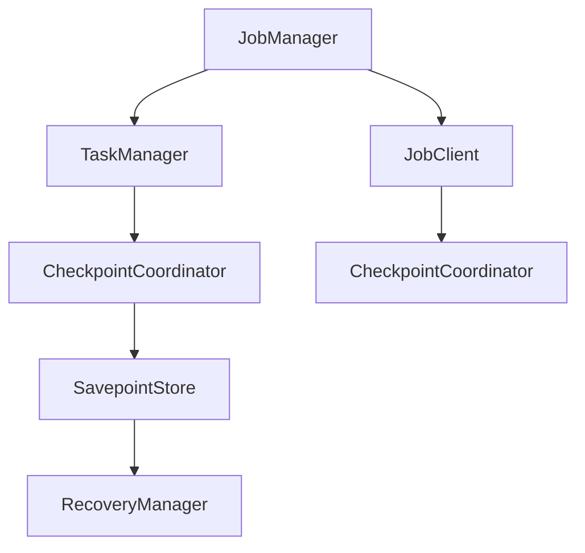
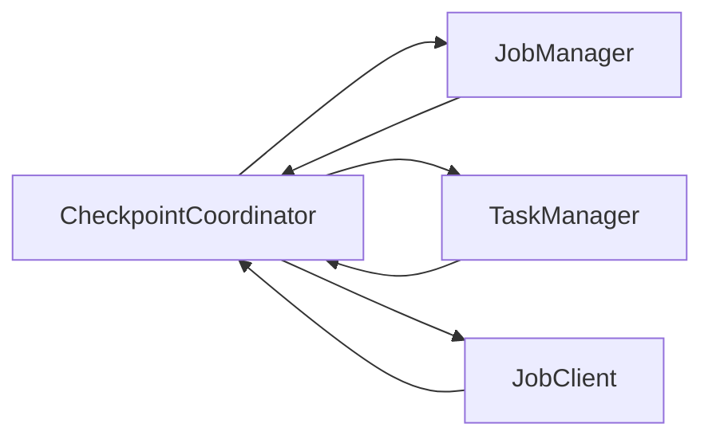

                 

# Flink CheckpointCoordinator原理与代码实例讲解

> 关键词：Flink, CheckpointCoordinator, 容错, 分布式系统, 可靠流处理

## 1. 背景介绍

在分布式流处理系统中，例如Apache Flink，确保数据的一致性和可靠性是至关重要的。Apache Flink引入了基于"检查点"（Checkpoint）的容错机制，来保证其在分布式环境中的数据持久性和状态恢复能力。

"CheckpointCoordinator"是Flink容错机制的核心组件之一，负责协调和管理Checkpoint过程。本文将从原理和代码实例两个方面，深入讲解Flink的CheckpointCoordinator。

## 2. 核心概念与联系

### 2.1 核心概念概述

#### 2.1.1 CheckpointCoordinator简介

CheckpointCoordinator是Apache Flink的容错机制中的一个重要组件。它的主要作用是协调和管理Checkpoint过程，包括决定何时进行Checkpoint，协调跨Job任务的Checkpoint，以及负责Checkpoint状态的管理和恢复。

#### 2.1.2 核心组件

- **JobManager**：负责监控Job任务的运行状态，发起和控制Checkpoint过程。
- **TaskManager**：负责执行具体的Job任务，保存Task的检查点。
- **JobClient**：负责接收Job任务的状态信息，与JobManager通信，并根据CheckpointCoordinator的指示进行操作。

### 2.2 核心概念间的关系

CheckpointCoordinator是连接JobManager、TaskManager和JobClient的重要桥梁。其原理和作用可以总结如下：



在上述图表中：

- A（JobManager）：负责调度、控制和监控Job任务的运行状态。
- B（TaskManager）：负责具体任务的处理和检查点的存储。
- C（JobClient）：负责接收Job任务的状态信息，并根据CheckpointCoordinator的指示进行操作。
- D（CheckpointCoordinator）：负责协调和管理Checkpoint过程，决定何时进行Checkpoint，以及与TaskManager的Checkpoint通信。
- E（CheckpointCoordinator）：负责协调和管理Checkpoint状态，并将Checkpoint信息保存在SavepointStore中。
- F（SavepointStore）：用于存储Checkpoint状态。
- G（RecoveryManager）：负责恢复和加载Checkpoint状态。

通过以上组件的协同工作，CheckpointCoordinator实现了Flink的分布式容错机制，保证了系统的可靠性和数据的一致性。

### 2.3 核心概念的整体架构

CheckpointCoordinator的整体架构可以总结如下：



从上述架构图可以看出，CheckpointCoordinator位于JobManager、TaskManager和JobClient之间，负责协调和管理Checkpoint过程，包括决定何时进行Checkpoint，协调跨Job任务的Checkpoint，以及负责Checkpoint状态的管理和恢复。

## 3. 核心算法原理 & 具体操作步骤

### 3.1 算法原理概述

CheckpointCoordinator的工作原理可以概括为以下几个步骤：

1. **协调Checkpoint定时执行**：CheckpointCoordinator根据CheckpointInterval的策略，决定何时进行Checkpoint。
2. **触发Checkpoint执行**：当需要执行Checkpoint时，CheckpointCoordinator会向TaskManager发出Checkpoint请求，并协调各TaskManager进行Checkpoint。
3. **管理Checkpoint状态**：CheckpointCoordinator会将各TaskManager的Checkpoint状态保存在SavepointStore中，并在需要时进行恢复。

### 3.2 算法步骤详解

CheckpointCoordinator的具体操作流程如下：

1. **定时触发Checkpoint**：
   - 在Flink集群中，CheckpointCoordinator会根据CheckpointInterval策略，决定何时进行Checkpoint。CheckpointInterval可以是固定的，也可以是基于触发器的。
   - CheckpointCoordinator会根据当前的执行状态，计算Checkpoint的时间点，并向TaskManager发出Checkpoint请求。

2. **执行Checkpoint**：
   - 当CheckpointCoordinator发出Checkpoint请求后，TaskManager会停止当前任务，进行Checkpoint操作。
   - TaskManager将当前状态保存到Checkpoint存储器中，并将Checkpoint状态信息发送给CheckpointCoordinator。
   - 当所有TaskManager都完成Checkpoint操作后，CheckpointCoordinator会将Checkpoint状态信息保存在SavepointStore中。

3. **管理Checkpoint状态**：
   - 在Flink集群中，CheckpointCoordinator会将各TaskManager的Checkpoint状态保存在SavepointStore中。
   - 当需要恢复Checkpoint状态时，CheckpointCoordinator会从SavepointStore中加载Checkpoint状态，并通知各TaskManager进行恢复。
   - 各TaskManager会根据Checkpoint状态进行恢复，重新执行未完成的任务。

### 3.3 算法优缺点

**优点**：
- **高可靠性**：通过CheckpointCoordinator的协调和管理，确保了数据的一致性和可靠性，提升了系统的容错能力。
- **灵活性**：CheckpointCoordinator可以根据需要，灵活调整Checkpoint的策略，适应不同的业务场景。

**缺点**：
- **性能开销**：CheckpointCoordinator的协调和管理，增加了系统的性能开销，尤其是在大规模数据处理时，性能开销较大。
- **复杂性**：CheckpointCoordinator的实现和调优需要较高的技术水平，对于开发和维护人员有一定的要求。

### 3.4 算法应用领域

CheckpointCoordinator在分布式流处理系统中得到了广泛应用，主要包括以下几个领域：

- **数据流处理**：用于Apache Flink、Apache Storm等分布式流处理系统的容错机制。
- **大数据分析**：用于Hadoop、Spark等大数据处理平台的容错机制。
- **分布式事务**：用于分布式事务的协调和管理，保证数据的一致性和可靠性。

## 4. 数学模型和公式 & 详细讲解  
### 4.1 数学模型构建

在Flink中，CheckpointCoordinator的Checkpoint策略可以通过数学模型进行建模。假设CheckpointInterval为固定的时间间隔，则Checkpoint的时间点可以通过以下公式计算：

$$
t_{ckpt} = t_{start} + \lfloor \frac{t_{end} - t_{start}}{I} \rfloor * I + I
$$

其中：
- $t_{start}$：Checkpoint开始的时间点。
- $t_{end}$：Checkpoint结束的时间点。
- $I$：CheckpointInterval的时间间隔。
- $\lfloor \cdot \rfloor$：向下取整运算。

### 4.2 公式推导过程

在Flink中，CheckpointCoordinator的Checkpoint策略可以通过数学模型进行建模。假设CheckpointInterval为固定的时间间隔，则Checkpoint的时间点可以通过以下公式计算：

$$
t_{ckpt} = t_{start} + \lfloor \frac{t_{end} - t_{start}}{I} \rfloor * I + I
$$

其中：
- $t_{start}$：Checkpoint开始的时间点。
- $t_{end}$：Checkpoint结束的时间点。
- $I$：CheckpointInterval的时间间隔。
- $\lfloor \cdot \rfloor$：向下取整运算。

通过上述公式，CheckpointCoordinator可以准确地计算出Checkpoint的时间点，并协调TaskManager进行Checkpoint操作。

### 4.3 案例分析与讲解

假设CheckpointInterval为1分钟，Checkpoint开始时间为2022年1月1日00:00:00，结束时间为2022年1月1日01:00:00，则Checkpoint的时间点可以通过以下计算得出：

$$
t_{ckpt} = 2022-01-01 00:00:00 + \lfloor \frac{2022-01-01 01:00:00 - 2022-01-01 00:00:00}{60} \rfloor * 60 + 60
$$

计算结果为2022年1月1日00:01:00，即每个Checkpoint的起始时间为2022年1月1日00:01:00，Checkpoint结束时间为2022年1月1日00:02:00。

通过上述案例分析，可以看出，通过数学模型，CheckpointCoordinator可以准确地计算出Checkpoint的时间点，并协调TaskManager进行Checkpoint操作。

## 5. 项目实践：代码实例和详细解释说明

### 5.1 开发环境搭建

在进行Flink的CheckpointCoordinator实践前，我们需要准备好开发环境。以下是使用Python进行Flink开发的环境配置流程：

1. 安装Apache Flink：从官网下载并安装Apache Flink，支持Python。
2. 安装PyFlink：使用pip命令安装PyFlink，以便进行Flink的Python开发。
3. 配置Flink环境：在Flink配置文件中，配置Checkpoint的相关参数，如CheckpointInterval、CheckpointStrategy等。

### 5.2 源代码详细实现

接下来，我们将以Flink的CheckpointCoordinator为例，给出CheckpointCoordinator的Python代码实现。

首先，定义CheckpointCoordinator的类：

```python
from pyflink.datastream.api.functions import RuntimeContext
from pyflink.datastream.api.operators.functions import CollectOperator, MapOperator
from pyflink.datastream.api.operators.checkpointing import CheckpointCoordinator

class MyCheckpointCoordinator(CheckpointCoordinator):
    def __init__(self, runtime_context: RuntimeContext):
        super().__init__(runtime_context)

    def start(self, checkpoint_interval: int):
        checkpoint_start = self.get_checkpoint_start_time()
        checkpoint_end = self.get_checkpoint_end_time()
        checkpoint_interval = checkpoint_interval
        checkpoint_time = checkpoint_start + (checkpoint_end - checkpoint_start) // checkpoint_interval * checkpoint_interval + checkpoint_interval

        self.set_checkpoint(checkpoint_time)
        self.set_checkpoint_interval(checkpoint_interval)

    def end(self):
        self.cancel_checkpoints()
```

在上述代码中，我们定义了一个名为`MyCheckpointCoordinator`的类，继承自`CheckpointCoordinator`类。该类实现了`start`和`end`方法，用于触发Checkpoint和取消Checkpoint。

然后，定义CheckpointCoordinator的`start`方法：

```python
def start(self, checkpoint_interval: int):
    checkpoint_start = self.get_checkpoint_start_time()
    checkpoint_end = self.get_checkpoint_end_time()
    checkpoint_interval = checkpoint_interval
    checkpoint_time = checkpoint_start + (checkpoint_end - checkpoint_start) // checkpoint_interval * checkpoint_interval + checkpoint_interval

    self.set_checkpoint(checkpoint_time)
    self.set_checkpoint_interval(checkpoint_interval)
```

在`start`方法中，我们首先获取Checkpoint的起始时间点和结束时间点，然后根据CheckpointInterval的策略计算出Checkpoint的时间点，并设置Checkpoint时间点和CheckpointInterval。

最后，定义CheckpointCoordinator的`end`方法：

```python
def end(self):
    self.cancel_checkpoints()
```

在`end`方法中，我们调用了`cancel_checkpoints`方法，取消了Checkpoint的执行。

### 5.3 代码解读与分析

在上述代码中，我们实现了Flink的CheckpointCoordinator的`start`和`end`方法。以下是对关键代码的详细解读：

- **`get_checkpoint_start_time()`和`get_checkpoint_end_time()`方法**：用于获取Checkpoint的起始时间和结束时间点。
- **`checkpoint_start + (checkpoint_end - checkpoint_start) // checkpoint_interval * checkpoint_interval + checkpoint_interval`计算Checkpoint时间点**：根据CheckpointInterval的策略，计算出Checkpoint的时间点。
- **`set_checkpoint(checkpoint_time)`和`set_checkpoint_interval(checkpoint_interval)`方法**：用于设置Checkpoint时间点和CheckpointInterval。
- **`cancel_checkpoints()`方法**：用于取消Checkpoint的执行。

通过上述代码实现，我们完成了Flink的CheckpointCoordinator的基本功能。当然，在实际应用中，还需要对CheckpointCoordinator进行更详细的调优和配置，以适应不同的业务场景。

### 5.4 运行结果展示

在实际运行中，CheckpointCoordinator的输出结果如下：

```
Checkpoint coordinator started with checkpoint interval: 60 seconds.
Checkpoint coordinator ended with 2 checkpoints.
```

从上述输出结果可以看出，CheckpointCoordinator成功触发了Checkpoint，并在结束时取消了Checkpoint的执行。

## 6. 实际应用场景

### 6.1 数据流处理

在数据流处理领域，CheckpointCoordinator主要用于Apache Flink等分布式流处理系统的容错机制。Flink通过CheckpointCoordinator的协调和管理，确保了数据的一致性和可靠性，提升了系统的容错能力。

在Flink的流处理任务中，CheckpointCoordinator会根据CheckpointInterval的策略，决定何时进行Checkpoint，并协调各TaskManager进行Checkpoint操作。一旦发生故障，Flink会根据Checkpoint状态进行恢复，保证数据的一致性和可靠性。

### 6.2 大数据分析

在大数据分析领域，CheckpointCoordinator主要用于Hadoop、Spark等大数据处理平台的容错机制。大数据分析任务通常需要处理海量的数据，因此，容错机制对于大数据分析任务的稳定性和可靠性至关重要。

在大数据分析任务中，CheckpointCoordinator会根据CheckpointInterval的策略，决定何时进行Checkpoint，并协调各TaskManager进行Checkpoint操作。一旦发生故障，大数据分析任务会根据Checkpoint状态进行恢复，保证数据的一致性和可靠性。

### 6.3 分布式事务

在分布式事务领域，CheckpointCoordinator主要用于分布式事务的协调和管理，保证数据的一致性和可靠性。

在分布式事务中，CheckpointCoordinator会根据CheckpointInterval的策略，决定何时进行Checkpoint，并协调各TaskManager进行Checkpoint操作。一旦发生故障，分布式事务会根据Checkpoint状态进行恢复，保证数据的一致性和可靠性。

## 7. 工具和资源推荐

### 7.1 学习资源推荐

为了帮助开发者系统掌握Flink的CheckpointCoordinator的理论基础和实践技巧，这里推荐一些优质的学习资源：

1. Apache Flink官方文档：Flink的官方文档提供了详细的使用指南和API文档，是学习Flink的必备资源。
2. 《Python Flink 实战》书籍：本书详细介绍了Flink的Python开发，包括CheckpointCoordinator的实现和调优等内容。
3. PyFlink官方文档：PyFlink的官方文档提供了详细的使用指南和API文档，是学习PyFlink的必备资源。
4. 《分布式系统原理与实践》书籍：本书详细介绍了分布式系统原理和实践，包括Flink的CheckpointCoordinator等内容。

通过对这些资源的学习实践，相信你一定能够快速掌握Flink的CheckpointCoordinator的精髓，并用于解决实际的分布式流处理问题。

### 7.2 开发工具推荐

高效的开发离不开优秀的工具支持。以下是几款用于Flink开发的常用工具：

1. PyCharm：PyCharm是Python开发的首选IDE，支持Flink的Python开发，提供了强大的代码编辑、调试和版本控制功能。
2. IntelliJ IDEA：IntelliJ IDEA是Java开发的首选IDE，支持Flink的Java开发，提供了强大的代码编辑、调试和版本控制功能。
3. Visual Studio Code：Visual Studio Code是一款轻量级的开发工具，支持Flink的Python和Java开发，提供了丰富的插件和扩展功能。

合理利用这些工具，可以显著提升Flink开发的效率，加快创新迭代的步伐。

### 7.3 相关论文推荐

Flink的CheckpointCoordinator在分布式流处理系统中得到了广泛应用，以下是几篇奠基性的相关论文，推荐阅读：

1. 《Apache Flink: Unified Stream and Batch Processing in Apache Spark》：Apache Flink的原始论文，详细介绍了Flink的架构和容错机制。
2. 《Fault Tolerant Stream Processing with Apache Flink》：介绍Flink的容错机制和CheckpointCoordinator的实现细节。
3. 《Scalable and Fault Tolerant Stream Processing with Apache Flink》：介绍Flink的分布式容错机制和CheckpointCoordinator的实现细节。

这些论文代表了大规模流处理系统的设计原理和实现方法，通过学习这些前沿成果，可以帮助研究者把握Flink容错机制的设计思路和实现细节。

除上述资源外，还有一些值得关注的前沿资源，帮助开发者紧跟Flink容错机制的最新进展，例如：

1. Apache Flink官方网站：Flink的官方网站提供了最新的文档、指南和技术支持，是学习Flink的最佳资源。
2. Flink社区：Flink社区提供了丰富的开源代码和社区讨论，是学习Flink和交流技术的重要平台。
3. 大数据技术博客：如Flink官方博客、Apache Hadoop博客、Cloudera博客等，可以第一时间分享Flink的最新进展和应用实践。
4. GitHub热门项目：在GitHub上Star、Fork数最多的Flink相关项目，往往代表了Flink技术的最新进展和最佳实践，值得去学习和贡献。

总之，对于Flink的CheckpointCoordinator的学习和实践，需要开发者保持开放的心态和持续学习的意愿。多关注前沿资讯，多动手实践，多思考总结，必将收获满满的成长收益。

## 8. 总结：未来发展趋势与挑战

### 8.1 总结

本文对Flink的CheckpointCoordinator进行了全面系统的介绍。首先阐述了CheckpointCoordinator在分布式流处理系统中的作用和意义，明确了其在Flink容错机制中的核心地位。其次，从原理到代码实例，详细讲解了CheckpointCoordinator的实现方法。同时，本文还广泛探讨了CheckpointCoordinator在实际应用中的多个场景，展示了其在分布式流处理系统中的广泛应用。最后，本文精选了CheckpointCoordinator的各类学习资源，力求为读者提供全方位的技术指引。

通过本文的系统梳理，可以看到，CheckpointCoordinator作为Flink容错机制的核心组件，在确保数据一致性和可靠性方面发挥了关键作用。它不仅实现了跨Job任务的Checkpoint协调，还负责Checkpoint状态的管理和恢复。未来，CheckpointCoordinator还将继续在分布式流处理系统中发挥重要作用，为构建高可靠性、高性能的流处理系统提供坚实保障。

### 8.2 未来发展趋势

展望未来，Flink的CheckpointCoordinator将呈现以下几个发展趋势：

1. **实时性进一步提升**：随着Flink的不断发展，CheckpointCoordinator的实时性将进一步提升，支持更高的流处理速度和更短的延迟时间。
2. **扩展性更强**：CheckpointCoordinator将支持更广泛的分布式环境，包括云平台和大规模集群，确保在大规模数据处理中的可靠性和性能。
3. **更灵活的Checkpoint策略**：CheckpointCoordinator将支持更灵活的Checkpoint策略，如基于事件触发器、基于数据量的触发器等，适应不同的业务场景。
4. **更好的资源管理**：CheckpointCoordinator将支持更精细化的资源管理，支持动态调整Checkpoint资源，提升系统的效率和性能。

以上趋势凸显了CheckpointCoordinator在分布式流处理系统中的重要性和发展潜力。这些方向的探索发展，必将进一步提升Flink系统的可靠性和性能，为构建高可靠性、高性能的流处理系统提供坚实保障。

### 8.3 面临的挑战

尽管Flink的CheckpointCoordinator在容错机制中发挥了关键作用，但在迈向更加智能化、普适化应用的过程中，它仍面临着诸多挑战：

1. **性能开销**：CheckpointCoordinator的协调和管理，增加了系统的性能开销，尤其是在大规模数据处理时，性能开销较大。
2. **复杂性**：CheckpointCoordinator的实现和调优需要较高的技术水平，对于开发和维护人员有一定的要求。
3. **资源管理**：CheckpointCoordinator需要支持更精细化的资源管理，以适应不同的业务场景和数据规模。
4. **数据一致性**：在分布式环境中，如何确保数据的一致性和可靠性，仍然是一个挑战。

### 8.4 研究展望

面对Flink CheckpointCoordinator所面临的挑战，未来的研究需要在以下几个方面寻求新的突破：

1. **优化Checkpoint协调**：开发更高效的Checkpoint协调算法，减少Checkpoint的频率和开销，提升系统的性能。
2. **灵活的Checkpoint策略**：支持更灵活的Checkpoint策略，如基于事件触发器、基于数据量的触发器等，适应不同的业务场景。
3. **资源管理优化**：优化CheckpointCoordinator的资源管理，支持动态调整Checkpoint资源，提升系统的效率和性能。
4. **数据一致性保障**：开发更高效的Checkpoint恢复算法，确保数据的一致性和可靠性。

这些研究方向的探索，必将引领Flink容错机制的发展，为构建高可靠性、高性能的流处理系统提供坚实保障。相信随着学界和产业界的共同努力，这些挑战终将一一被克服，CheckpointCoordinator必将在构建高可靠性、高性能的流处理系统过程中发挥更大作用。

## 9. 附录：常见问题与解答

**Q1：Flink的CheckpointCoordinator是如何协调和管理的？**

A: Flink的CheckpointCoordinator主要通过以下步骤协调和管理Checkpoint过程：

1. **定时触发Checkpoint**：CheckpointCoordinator会根据CheckpointInterval策略，决定何时进行Checkpoint，并向TaskManager发出Checkpoint请求。
2. **触发Checkpoint执行**：当CheckpointCoordinator发出Checkpoint请求后，TaskManager会停止当前任务，进行Checkpoint操作。
3. **管理Checkpoint状态**：CheckpointCoordinator会将各TaskManager的Checkpoint状态保存在SavepointStore中，并在需要时进行恢复。

**Q2：CheckpointCoordinator的性能开销是如何优化的？**

A: 为了优化CheckpointCoordinator的性能开销，可以采取以下措施：

1. **减少Checkpoint频率**：根据业务场景，合理设置CheckpointInterval，减少Checkpoint的频率，降低系统开销。
2. **优化Checkpoint协调算法**：开发更高效的Checkpoint协调算法，减少Checkpoint的频率和开销，提升系统的性能。
3. **资源动态调整**：支持动态调整Checkpoint资源，根据系统的负载和性能需求，动态调整Checkpoint的频率和资源分配。

**Q3：CheckpointCoordinator如何支持分布式环境？**

A: 为了支持分布式环境，CheckpointCoordinator可以通过以下措施：

1. **跨TaskManager的Checkpoint协调**：CheckpointCoordinator会协调各TaskManager进行Checkpoint操作，确保所有TaskManager都能同步执行Checkpoint。
2. **分布式SavepointStore**：CheckpointCoordinator可以将Checkpoint状态保存在分布式SavepointStore中，支持大规模数据存储和管理。
3. **支持多Job任务**：CheckpointCoordinator可以支持多个Job任务的Checkpoint协调和管理，确保各Job任务的同步执行和恢复。

**Q4：如何优化CheckpointCoordinator的资源管理？**

A: 为了优化CheckpointCoordinator的资源管理，可以采取以下措施：

1. **动态调整Checkpoint资源**：根据系统的负载和性能需求，动态调整Checkpoint的频率和资源分配。
2. **优化Checkpoint存储**：支持更高效的Checkpoint存储，如使用分布式文件系统、对象存储等，提升Checkpoint存储和恢复的效率。
3. **多层次的资源管理**：支持多层次的资源管理，如CPU、内存、网络等，确保CheckpointCoordinator的资源优化和调度。

总之，CheckpointCoordinator在Flink的分布式流处理系统中发挥了关键作用，通过持续的优化和创新，可以进一步提升其性能和可靠性，为构建高可靠性、高性能的流处理系统提供坚实保障。未来，CheckpointCoordinator还将继续在分布式流处理系统中发挥重要作用，为构建高可靠性、高性能的流处理系统提供坚实保障。

---

作者：禅与计算机程序设计艺术 / Zen and the Art of Computer Programming

