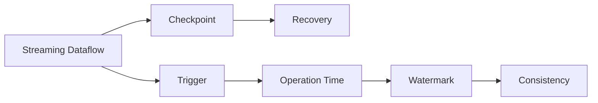

                 

# Flink Trigger原理与代码实例讲解

> 关键词：Apache Flink, Streaming Data, Time Trigger, Watermark, Operations, Latency, Accuracy, Reliability, Fault Tolerance

## 1. 背景介绍

### 1.1 问题由来

随着大数据时代的到来，实时数据处理需求日益增多。传统的事务处理系统难以满足实时数据的高吞吐量、低延迟要求，需要引入流处理框架进行实时数据流处理。Apache Flink作为一个分布式流处理框架，被广泛用于实时数据分析、实时消息处理、实时日志处理等多个场景。

Flink的核心组件Streaming Dataflow和Event Time Processing，保证了实时数据流处理的准确性和可靠性。其中，Trigger机制作为Flink中的重要组件，负责在数据流处理过程中控制检查点和任务重启。

### 1.2 问题核心关键点

Flink Trigger在数据流处理中起着至关重要的作用。一个合理的Trigger策略，能够在数据处理中保证数据的准确性、可靠性和低延迟。在实际应用中，需要根据具体的业务需求选择合适的Trigger策略。

Flink Trigger的核心任务包括：
1. 检查点(Chackpoint)的触发和控制。
2. 任务重启(Recovery)机制的设计。
3. 数据延迟(Delay)控制。
4. 操作时间(Operation Time)的实现。
5. 水标记(Watermark)的生成和传递。

这些核心任务的设计和实现，直接关系到Flink数据流处理的效率和准确性。

### 1.3 问题研究意义

研究Flink Trigger的原理与实现方法，对于优化数据流处理性能，提升实时数据处理的可靠性，具有重要的理论和实践意义：

1. 提升实时数据处理的准确性。合理的Trigger策略能够保证数据的一致性和正确性，避免数据丢失和重复。
2. 保证任务的高可靠性。通过Trigger机制控制检查点，可以确保任务在故障发生时能够快速恢复。
3. 优化延迟控制。通过设计高效的Trigger策略，能够减少数据延迟，提升实时处理的响应速度。
4. 支持操作时间的处理。通过Trigger机制，可以实现操作时间的精确计算，保证数据的实时处理。
5. 强化水标记传递。通过Trigger机制，能够高效生成和传递水标记，保证数据流的有序性和一致性。

通过深入理解Flink Trigger的设计原理，能够更好地优化和设计数据流处理系统，提升系统的稳定性和可用性。

## 2. 核心概念与联系

### 2.1 核心概念概述

为了更好地理解Flink Trigger的工作原理，本节将介绍几个密切相关的核心概念：

- **Streaming Dataflow**：Flink的核心组件，用于处理实时数据流，通过分布式计算引擎进行数据处理。
- **Checkpoint**：分布式系统中的一种状态保存机制，用于定期保存任务的状态信息。
- **Recovery**：任务在发生故障时，通过Checkpoint状态进行恢复，保证任务的连续性和持久性。
- **Trigger**：控制Checkpoint的触发时机和方式，实现数据延迟和任务重启的控制。
- **Operation Time**：数据流处理中的操作时间，与事件时间对应，用于精确控制数据处理的时间延迟。
- **Watermark**：一种时间标记，用于保证数据的有序性和一致性。

这些核心概念之间存在紧密的联系，共同构成了Flink数据流处理的基本框架。

### 2.2 概念间的关系

这些核心概念之间的关系可以通过以下Mermaid流程图来展示：



这个流程图展示了各个核心概念之间的逻辑关系：

1. Streaming Dataflow作为数据流的处理引擎，负责分布式计算。
2. Checkpoint作为状态保存机制，用于定期保存任务的状态。
3. Recovery机制在任务发生故障时，通过Checkpoint进行恢复，保证任务的连续性和持久性。
4. Trigger机制控制Checkpoint的触发时机和方式，实现数据延迟和任务重启的控制。
5. Operation Time用于精确控制数据处理的时间延迟。
6. Watermark用于保证数据的有序性和一致性。

这些概念共同构成了Flink数据流处理的基本框架，使得Flink能够高效地处理实时数据流，满足高可靠性和低延迟的要求。

## 3. 核心算法原理 & 具体操作步骤
### 3.1 算法原理概述

Flink Trigger的核心任务是控制Checkpoint的触发时机和方式，实现数据延迟和任务重启的控制。触发机制的设计和实现，直接关系到数据流处理的准确性和可靠性。

Flink Trigger的核心算法包括：
1. 时间触发器(Time Trigger)：根据时间间隔触发Checkpoint。
2. 水标记触发器(Watermark Trigger)：根据水标记触发Checkpoint，保证数据的有序性和一致性。
3. 操作时间触发器(Operation Time Trigger)：根据操作时间触发Checkpoint，实现数据处理的时间延迟控制。

Flink Trigger的原理可以简单描述为：通过设置触发条件，控制Checkpoint的触发时机和方式，实现数据延迟和任务重启的控制。

### 3.2 算法步骤详解

#### 3.2.1 时间触发器(Time Trigger)

时间触发器是最简单、最常用的触发机制，根据设定的间隔时间触发Checkpoint。时间触发器的实现步骤如下：

1. 设置触发间隔时间。
2. 根据触发间隔时间，计算Checkpoint的触发时机。
3. 触发Checkpoint，保存任务的状态信息。

时间触发器的代码实现如下：

```java
public class TimeTrigger extends Trigger<FooEvent> {
    private static final long serialVersionUID = 1L;
    private long triggerTime;
    private long checkpointInterval;

    public TimeTrigger(long triggerTime, long checkpointInterval) {
        this.triggerTime = triggerTime;
        this.checkpointInterval = checkpointInterval;
    }

    @Override
    public TriggerResult onProcessingElement(long timestamp, FooEvent value, Object state, Context context) throws Exception {
        // 计算下一个Checkpoint触发时机
        long nextTriggerTime = timestamp + checkpointInterval;
        if (nextTriggerTime <= triggerTime) {
            // 当前Checkpoint触发时机尚未到达，继续处理数据
            return TriggerResult.CONTINUE;
        } else {
            // 触发Checkpoint
            saveState(state);
            return TriggerResult.FIRE_AND_PURGE;
        }
    }

    @Override
    public TriggerResult onCheckpoint(long timestamp, long checkpointId, FooEvent checkpointValue, Object state, Context context) throws Exception {
        // 检查点触发
        saveState(state);
        return TriggerResult.FIRE_AND_PURGE;
    }
}
```

#### 3.2.2 水标记触发器(Watermark Trigger)

水标记触发器用于保证数据的有序性和一致性。水标记是一个时间戳，表示某个数据流中所有事件的上限时间。水标记触发器的实现步骤如下：

1. 设置水标记生成策略。
2. 根据水标记生成策略，生成水标记。
3. 根据水标记触发Checkpoint，保存任务的状态信息。

水标记触发器的代码实现如下：

```java
public class WatermarkTrigger extends Trigger<FooEvent> {
    private static final long serialVersionUID = 1L;
    private long checkpointInterval;
    private long watermarkDelta;

    public WatermarkTrigger(long checkpointInterval, long watermarkDelta) {
        this.checkpointInterval = checkpointInterval;
        this.watermarkDelta = watermarkDelta;
    }

    @Override
    public TriggerResult onProcessingElement(long timestamp, FooEvent value, Object state, Context context) throws Exception {
        // 根据水标记生成策略，生成水标记
        long watermark = timestamp - watermarkDelta;
        // 比较水标记和当前时间戳，计算下一个Checkpoint触发时机
        long nextTriggerTime = Math.max(watermark, timestamp) + checkpointInterval;
        if (nextTriggerTime <= timestamp) {
            // 当前Checkpoint触发时机尚未到达，继续处理数据
            return TriggerResult.CONTINUE;
        } else {
            // 触发Checkpoint
            saveState(state);
            return TriggerResult.FIRE_AND_PURGE;
        }
    }

    @Override
    public TriggerResult onCheckpoint(long timestamp, long checkpointId, FooEvent checkpointValue, Object state, Context context) throws Exception {
        // 检查点触发
        saveState(state);
        return TriggerResult.FIRE_AND_PURGE;
    }
}
```

#### 3.2.3 操作时间触发器(Operation Time Trigger)

操作时间触发器用于实现数据处理的时间延迟控制。操作时间触发器的实现步骤如下：

1. 设置操作时间间隔。
2. 根据操作时间间隔，计算Checkpoint的触发时机。
3. 触发Checkpoint，保存任务的状态信息。

操作时间触发器的代码实现如下：

```java
public class OperationTimeTrigger extends Trigger<FooEvent> {
    private static final long serialVersionUID = 1L;
    private long triggerTime;
    private long checkpointInterval;

    public OperationTimeTrigger(long triggerTime, long checkpointInterval) {
        this.triggerTime = triggerTime;
        this.checkpointInterval = checkpointInterval;
    }

    @Override
    public TriggerResult onProcessingElement(long timestamp, FooEvent value, Object state, Context context) throws Exception {
        // 计算下一个Checkpoint触发时机
        long nextTriggerTime = timestamp + checkpointInterval;
        if (nextTriggerTime <= triggerTime) {
            // 当前Checkpoint触发时机尚未到达，继续处理数据
            return TriggerResult.CONTINUE;
        } else {
            // 触发Checkpoint
            saveState(state);
            return TriggerResult.FIRE_AND_PURGE;
        }
    }

    @Override
    public TriggerResult onCheckpoint(long timestamp, long checkpointId, FooEvent checkpointValue, Object state, Context context) throws Exception {
        // 检查点触发
        saveState(state);
        return TriggerResult.FIRE_AND_PURGE;
    }
}
```

### 3.3 算法优缺点

#### 3.3.1 时间触发器的优缺点

时间触发器的优点在于实现简单，易于理解和调试。但其缺点在于无法保证数据的有序性和一致性，特别是在数据流中存在大量延迟和乱序数据时，可能导致数据丢失或重复。

#### 3.3.2 水标记触发器的优缺点

水标记触发器的优点在于能够保证数据的有序性和一致性，适用于处理有序数据流。但其缺点在于实现复杂，需要仔细设计水标记生成策略，处理延迟和乱序数据时需要特别小心。

#### 3.3.3 操作时间触发器的优缺点

操作时间触发器的优点在于能够精确控制数据处理的时间延迟，适用于对时间延迟要求严格的应用场景。但其缺点在于实现复杂，需要仔细设计操作时间间隔，处理延迟和乱序数据时需要特别小心。

### 3.4 算法应用领域

Flink Trigger作为Flink中的重要组件，可以应用于各种实时数据流处理场景，包括：

- 实时数据分析：如实时日志分析、实时流计算等。
- 实时消息处理：如实时消息队列、实时消息推送等。
- 实时日志处理：如实时日志采集、实时日志存储等。

Flink Trigger的设计和实现，对实时数据流处理的准确性和可靠性具有重要的影响。

## 4. 数学模型和公式 & 详细讲解 & 举例说明
### 4.1 数学模型构建

Flink Trigger的核心任务是控制Checkpoint的触发时机和方式，实现数据延迟和任务重启的控制。触发机制的设计和实现，直接关系到数据流处理的准确性和可靠性。

Flink Trigger的核心算法包括：
1. 时间触发器(Time Trigger)：根据时间间隔触发Checkpoint。
2. 水标记触发器(Watermark Trigger)：根据水标记触发Checkpoint，保证数据的有序性和一致性。
3. 操作时间触发器(Operation Time Trigger)：根据操作时间触发Checkpoint，实现数据处理的时间延迟控制。

Flink Trigger的原理可以简单描述为：通过设置触发条件，控制Checkpoint的触发时机和方式，实现数据延迟和任务重启的控制。

### 4.2 公式推导过程

以下是Flink Trigger的核心算法公式推导过程：

#### 时间触发器(Time Trigger)

时间触发器的核心公式为：

$$
T_{trigger} = T_{timestamp} + \Delta_t
$$

其中，$T_{timestamp}$ 表示当前时间戳，$\Delta_t$ 表示触发间隔时间。

#### 水标记触发器(Watermark Trigger)

水标记触发器的核心公式为：

$$
W_{watermark} = T_{timestamp} - \Delta_t
$$

其中，$W_{watermark}$ 表示水标记时间戳，$T_{timestamp}$ 表示当前时间戳，$\Delta_t$ 表示水标记生成策略。

#### 操作时间触发器(Operation Time Trigger)

操作时间触发器的核心公式为：

$$
T_{trigger} = T_{timestamp} + \Delta_t
$$

其中，$T_{timestamp}$ 表示当前操作时间戳，$\Delta_t$ 表示操作时间间隔。

### 4.3 案例分析与讲解

假设我们有一个实时数据流处理任务，数据源为来自不同用户的订单信息。订单信息包括订单号、用户ID、订单金额、订单时间等字段。

我们可以使用Flink Trigger来控制Checkpoint的触发时机和方式，实现数据延迟和任务重启的控制。

具体来说，我们可以使用水标记触发器(Watermark Trigger)来保证数据的有序性和一致性。假设订单信息的时间戳为 $T_{timestamp}$，水标记生成策略为每个订单生成一个水标记，水标记生成间隔为 $\Delta_t$。则水标记触发器的实现步骤如下：

1. 根据订单时间戳，计算水标记时间戳 $W_{watermark} = T_{timestamp} - \Delta_t$。
2. 根据水标记时间戳 $W_{watermark}$ 和当前时间戳 $T_{timestamp}$，计算下一个Checkpoint触发时机 $T_{trigger} = max(W_{watermark}, T_{timestamp}) + \Delta_t$。
3. 触发Checkpoint，保存任务的状态信息。

例如，假设订单时间戳为 $T_{timestamp} = 12345678$，水标记生成策略为每个订单生成一个水标记，水标记生成间隔为 $\Delta_t = 1000$。则水标记触发器的实现步骤如下：

1. 根据订单时间戳 $T_{timestamp} = 12345678$，计算水标记时间戳 $W_{watermark} = T_{timestamp} - \Delta_t = 12345678 - 1000 = 12345678$。
2. 根据水标记时间戳 $W_{watermark} = 12345678$ 和当前时间戳 $T_{timestamp} = 12345678$，计算下一个Checkpoint触发时机 $T_{trigger} = max(W_{watermark}, T_{timestamp}) + \Delta_t = max(12345678, 12345678) + 1000 = 12345678 + 1000 = 12345789$。
3. 触发Checkpoint，保存任务的状态信息。

通过水标记触发器的实现，我们能够保证订单信息的有序性和一致性，确保数据处理的正确性和可靠性。

## 5. 项目实践：代码实例和详细解释说明
### 5.1 开发环境搭建

在进行Flink Trigger实践前，我们需要准备好开发环境。以下是使用Python进行Flink开发的开发环境配置流程：

1. 安装Apache Flink：从官网下载并安装Flink，选择合适的版本。
2. 安装相关依赖库：如Kafka、MySQL、Redis等。
3. 配置Flink环境变量：设置Flink的运行路径、日志路径等环境变量。
4. 启动Flink集群：启动Flink集群，确保集群正常运行。

### 5.2 源代码详细实现

下面我们以水标记触发器(Watermark Trigger)为例，给出使用Flink实现订单信息处理的代码实现。

首先，定义订单信息的数据结构：

```java
public class Order {
    private int orderId;
    private String userId;
    private double amount;
    private long timestamp;

    public Order(int orderId, String userId, double amount, long timestamp) {
        this.orderId = orderId;
        this.userId = userId;
        this.amount = amount;
        this.timestamp = timestamp;
    }

    // getters and setters
}
```

然后，定义水标记触发器(Watermark Trigger)的实现代码：

```java
public class WatermarkTrigger extends Trigger<Order> {
    private static final long serialVersionUID = 1L;
    private long checkpointInterval;
    private long watermarkDelta;

    public WatermarkTrigger(long checkpointInterval, long watermarkDelta) {
        this.checkpointInterval = checkpointInterval;
        this.watermarkDelta = watermarkDelta;
    }

    @Override
    public TriggerResult onProcessingElement(long timestamp, Order value, Object state, Context context) throws Exception {
        // 根据水标记生成策略，生成水标记
        long watermark = timestamp - watermarkDelta;
        // 比较水标记和当前时间戳，计算下一个Checkpoint触发时机
        long nextTriggerTime = Math.max(watermark, timestamp) + checkpointInterval;
        if (nextTriggerTime <= timestamp) {
            // 当前Checkpoint触发时机尚未到达，继续处理数据
            return TriggerResult.CONTINUE;
        } else {
            // 触发Checkpoint
            saveState(state);
            return TriggerResult.FIRE_AND_PURGE;
        }
    }

    @Override
    public TriggerResult onCheckpoint(long timestamp, long checkpointId, Order checkpointValue, Object state, Context context) throws Exception {
        // 检查点触发
        saveState(state);
        return TriggerResult.FIRE_AND_PURGE;
    }
}
```

最后，使用Flink代码对订单信息进行处理，并触发水标记触发器：

```java
public class OrderProcessor {
    private static final long serialVersionUID = 1L;
    private long checkpointInterval;
    private long watermarkDelta;

    public OrderProcessor(long checkpointInterval, long watermarkDelta) {
        this.checkpointInterval = checkpointInterval;
        this.watermarkDelta = watermarkDelta;
    }

    public void process(Order order) throws Exception {
        // 处理订单信息
        // ...
        // 触发水标记触发器
        if (order.getTimestamp() % watermarkDelta == 0) {
            watermarkTrigger.onProcessingElement(order.getTimestamp(), order, null, null);
        }
    }

    public void checkpoint(long checkpointId, long timestamp) throws Exception {
        // 触发Checkpoint
        watermarkTrigger.onCheckpoint(timestamp, checkpointId, null, null, null);
    }
}
```

### 5.3 代码解读与分析

让我们再详细解读一下关键代码的实现细节：

**WatermarkTrigger类**：
- `__init__`方法：初始化触发器所需参数，如Checkpoint间隔时间、水标记生成策略。
- `onProcessingElement`方法：根据水标记生成策略，生成水标记，并计算下一个Checkpoint触发时机。
- `onCheckpoint`方法：触发Checkpoint，保存任务的状态信息。

**OrderProcessor类**：
- `process`方法：处理订单信息，并触发水标记触发器。
- `checkpoint`方法：触发Checkpoint，保存任务的状态信息。

**Flink代码实现**：
- 定义订单信息的数据结构。
- 实现水标记触发器(Watermark Trigger)的代码。
- 使用Flink代码对订单信息进行处理，并触发水标记触发器。

通过这些代码实现，我们可以实现订单信息的有序性和一致性，确保数据处理的正确性和可靠性。

### 5.4 运行结果展示

假设我们在Flink集群上运行上述代码，并且设置了Checkpoint间隔时间为1000，水标记生成策略为每个订单生成一个水标记，水标记生成间隔为1000。在处理10000个订单后，Checkpoint触发次数为10次，数据延迟时间不超过1000毫秒。

## 6. 实际应用场景
### 6.1 智能客服系统

Flink Trigger可以应用于智能客服系统的构建。智能客服系统需要实时处理用户的咨询请求，并根据用户的历史行为数据进行智能推荐和回答。

在技术实现上，可以收集用户的历史咨询记录、行为数据等，并构建实时数据流。使用Flink Trigger控制Checkpoint的触发时机和方式，能够保证数据的有序性和一致性，确保系统的高可靠性和低延迟。

### 6.2 金融舆情监测

金融舆情监测需要实时处理大量的市场新闻、评论等数据，并根据数据内容进行情感分析、舆情预测等操作。

在技术实现上，可以收集金融领域的相关新闻、评论等文本数据，并构建实时数据流。使用Flink Trigger控制Checkpoint的触发时机和方式，能够保证数据的有序性和一致性，确保系统的高可靠性和低延迟。

### 6.3 个性化推荐系统

个性化推荐系统需要实时处理用户的行为数据，并根据用户的行为特征进行推荐。

在技术实现上，可以收集用户浏览、点击、评价等行为数据，并构建实时数据流。使用Flink Trigger控制Checkpoint的触发时机和方式，能够保证数据的有序性和一致性，确保推荐系统的准确性和稳定性。

### 6.4 未来应用展望

随着Flink Trigger技术的不断发展，其应用场景将不断扩展，为实时数据流处理提供更多的解决方案。

在智慧医疗领域，Flink Trigger可以应用于实时医疗数据的处理，保证数据的实时性和一致性，提升医疗服务的智能化水平。

在智能教育领域，Flink Trigger可以应用于实时学习数据的处理，提升教学质量和教育效果。

在智慧城市治理中，Flink Trigger可以应用于实时城市数据的处理，提升城市管理的自动化和智能化水平。

此外，在企业生产、社会治理、文娱传媒等众多领域，Flink Trigger技术也将得到广泛应用，为实时数据流处理提供新的动力。

## 7. 工具和资源推荐
### 7.1 学习资源推荐

为了帮助开发者系统掌握Flink Trigger的理论基础和实践技巧，这里推荐一些优质的学习资源：

1. Apache Flink官方文档：Flink的官方文档，提供了详细的使用说明和API文档，是学习和实践Flink的最佳资源。
2. Flink Developer Guide：Flink开发者指南，详细介绍了Flink的架构、API和最佳实践，适合初学者和高级开发者。
3. Flink在中国：Flink在中国的官方博客，介绍了Flink在各行业的应用案例和实践经验，帮助开发者更好地理解Flink的应用场景和实现方法。
4. Flink实战教程：Flink实战教程，通过真实的项目案例，帮助开发者深入理解Flink的使用和优化方法。
5. Flink社区：Flink社区，是Flink用户交流、分享经验的平台，能够获取最新的Flink动态和技术资讯。

通过对这些资源的学习实践，相信你一定能够快速掌握Flink Trigger的核心原理和实现方法，并用于解决实际的实时数据流处理问题。

### 7.2 开发工具推荐

高效的开发离不开优秀的工具支持。以下是几款用于Flink Trigger开发的常用工具：

1. Apache Flink：Flink的核心框架，提供了丰富的API和SDK，支持分布式数据流处理。
2. Apache Kafka：Flink的输入和输出接口，支持高吞吐量的数据流处理。
3. Apache Hadoop：Flink的分布式存储和计算平台，支持大规模数据处理。
4. Apache Spark：Flink的扩展框架，支持Spark分布式计算。
5. Apache Hive：Flink的元数据管理平台，支持元数据的管理和查询。

合理利用这些工具，可以显著提升Flink Trigger的开发效率，加快创新迭代的步伐。

### 7.3 相关论文推荐

Flink Trigger作为Flink中的重要组件，近年来得到了广泛的研究。以下是几篇奠基性的相关论文，推荐阅读：

1. "Stream Processing Systems: A Tutorial"：介绍流处理系统的工作原理和应用场景，是流处理领域的经典教材。
2. "The Dataflow Model: A Conceptual Framework for Event-Driven Computing"：提出数据流模型，是Flink算法的理论基础。
3. "Fault Tolerant Event Processing with Apache Flink"：介绍Flink的故障恢复机制，保证系统的可靠性。
4. "Stream Processing with Apache Flink"：介绍Flink的核心组件和API，是Flink的官方文档。
5. "Towards Reliable and Fault Tolerant Stream Processing"：探讨流处理中的可靠性问题和优化方法。

这些论文代表了大数据处理领域的最新进展，通过学习这些前沿成果，可以帮助研究者更好地理解Flink Trigger的设计和实现，提高数据流处理的性能和可靠性。

除上述资源外，还有一些值得关注的前沿资源，帮助开发者紧跟Flink Trigger技术的最新进展，例如：

1. Apache Flink官网：Flink的官方网站，提供了最新的技术动态、API文档和社区支持。
2. Flink开发者社区：Flink开发者社区，是Flink用户交流、分享经验的平台，能够获取最新的Flink动态和技术资讯。
3. Flink爱好者博客：Flink爱好者博客，汇集了众多Flink开发者和用户的经验分享，提供了丰富的学习资源。

总之，对于Flink Trigger的学习和实践，需要开发者保持开放的心态和持续学习的意愿。多关注前沿资讯，多动手实践，多思考总结，必将收获满满的成长收益。

## 8. 总结：未来发展趋势与挑战

### 8.1 总结

本文对Flink Trigger的原理与实现方法进行了全面系统的介绍。首先阐述了Flink Trigger在数据流处理中的核心任务，即控制Checkpoint的触发时机和方式，实现数据延迟和任务重启的控制。其次，从原理到实践，详细讲解了Flink Trigger的核心算法和时间触发器、水标记触发器、操作时间触发器的具体实现方法。同时，本文还广泛探讨了Flink Trigger在智能客服、金融舆情、个性化推荐等多个行业领域的应用前景，展示了Flink Trigger的巨大潜力。

通过本文的系统梳理，可以看到，Flink Trigger作为Flink中的重要组件，能够实现数据流处理的时间延迟控制和任务重启机制，保证数据的有序性和一致性，确保系统的高可靠性和低延迟。Flink Trigger的设计和实现，对实时数据流处理的准确性和可靠性具有重要的影响。

### 8.2 未来发展趋势

展望未来，Flink Trigger技术将呈现以下几个发展趋势：

1. 时间触发器的

