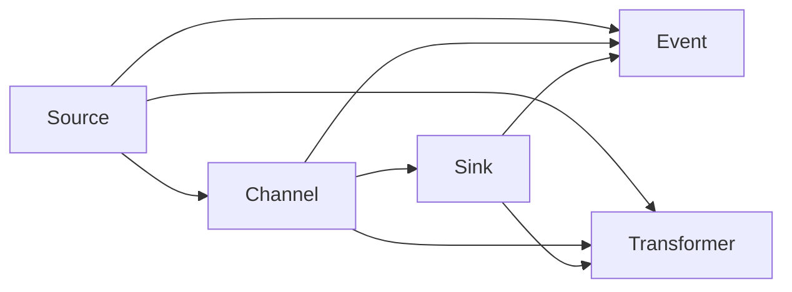

                 

# Flume Channel原理与代码实例讲解

> 关键词：Flume, Apache Flume, 数据流, 日志收集, 中间件, Kafka, HDFS, 分布式系统

## 1. 背景介绍

Apache Flume是一个高性能的、可靠的和可扩展的数据流系统，用于在大规模日志数据系统中收集、传输和处理数据。Flume可以处理来自各种源的大量数据，并以多种方式将数据传输到目标系统中，如HDFS、Kafka等。通过Flume，用户可以方便地实现分布式数据收集，构建高可用、可扩展的数据处理管道，支持海量数据的高效传输和处理。

### 1.1 Flume的起源与演进
Apache Flume最初由Cloudera开发，并于2009年被Apache软件基金会接纳。Flume的主要目的是为了解决大型数据系统中日志数据收集和处理的难题。

随着日志数据量的快速增长和分布式系统的普及，Flume也在不断演进中。以下是Flume几个重要版本的主要特点：

- **Flume 0.11**：引入Source的Event Multiplexing功能，提高了Source端的多线程并发能力。
- **Flume 0.12**：支持Kafka作为Source和Sink，增强了数据传输的灵活性和可靠性。
- **Flume 1.0**：全面重构了Source、Channel和Sink组件，引入了Thrift API、Scala API等新特性。
- **Flume 1.2**：引入了Trap handler，用于处理数据传输中的异常情况，提高了系统的鲁棒性。
- **Flume 1.3**：引入Source的Failover机制，提高了Source的故障恢复能力。
- **Flume 1.4**：增强了Kafka的Source和Sink支持，增加了Zookeeper的集成，提升了系统的扩展性和可靠性。
- **Flume 1.5**：引入了Flowable API，支持更灵活的数据流设计，支持多级Transformations。

Flume的核心架构由Source、Channel和Sink三个组件组成。Source负责从各种数据源中读取数据，Channel作为中间件用于暂存数据，Sink负责将数据写入目标系统。这种典型的数据流架构使得Flume具有高度的可扩展性和灵活性。

### 1.2 Flume的关键优势
Flume具有以下关键优势：

- **高可用性**：通过多副本机制和集群管理，Flume能够提供高可用性和容错性。
- **可扩展性**：支持水平扩展，可以通过增加节点来扩展系统的处理能力。
- **高性能**：基于事件驱动的架构设计，支持高吞吐量和低延迟的数据传输。
- **灵活性**：支持多种数据源和目标系统，能够轻松适配不同的应用场景。
- **易用性**：提供丰富的配置选项和灵活的插件系统，方便用户进行个性化定制。

## 2. 核心概念与联系

### 2.1 核心概念概述

为了更好地理解Flume的工作原理和架构设计，我们需要了解几个核心概念：

- **Source**：负责从各种数据源中读取数据，包括日志文件、数据库、Kafka等。Source是Flume数据流的起点。
- **Channel**：用于暂存Source读取的数据，直至传输到Sink。Channel是Flume数据流的核心部件，支持多种存储方式，如Memory、JDBC、HDFS等。
- **Sink**：负责将Channel中的数据写入目标系统，包括HDFS、Kafka、Elasticsearch等。Sink是Flume数据流的终点。
- **Event**：Flume中的基本数据单位，代表一条数据记录。Event通常由数据、时间戳、ID等信息组成。
- **Flow**：表示数据流的流动，通常由Source、Channel和Sink组成。Flow是Flume数据流的逻辑单元。
- **Flowable**：允许用户自定义数据流的转换和处理逻辑，支持多级Transformations和自定义事件处理逻辑。

这些核心概念构成了Flume的基本架构，其核心流程是Source读取数据并存入Channel，然后由Sink从Channel中读取数据并写入目标系统。Flume的数据流设计使其能够支持分布式和可扩展的系统，同时也提供了丰富的配置和插件机制，方便用户进行定制化开发。

### 2.2 核心概念间的联系

Flume的核心概念之间存在紧密的联系，形成了一个完整的数据流处理系统。下面通过一个Mermaid流程图来展示Flume数据流的组成和流程：



这个流程图展示了Flume数据流的各个组件及其之间的关系：

1. **Source**读取数据并生成**Event**，然后存入**Channel**。
2. **Channel**暂存数据，直至传输到**Sink**。
3. **Sink**将数据写入目标系统。
4. **Transformer**是可选组件，用于对数据进行转换和处理，增强数据的可用性。

通过这样的架构设计，Flume能够高效地处理来自各种数据源的数据，并通过灵活的配置和插件机制，支持不同的目标系统和业务需求。

## 3. 核心算法原理 & 具体操作步骤
### 3.1 算法原理概述

Flume的核心算法原理基于事件驱动的数据流处理。其基本流程是Source读取数据并生成Event，Event经过Channel暂存和Transformations处理，最后由Sink写入目标系统。Flume的算法原理可以简要概括为以下几个步骤：

1. **Source读取数据**：Source从各种数据源中读取数据，并将其封装为Event。
2. **Event存入Channel**：Event存储到Channel中，直至传输到Sink。
3. **数据处理**：在Channel中，可以配置Transformations对Event进行处理，如格式转换、过滤、聚合等。
4. **数据传输**：通过配置的Interceptors，Event从Channel流向Sink，并写入目标系统。

### 3.2 算法步骤详解

以下是Flume数据流处理的基本步骤，以日志收集为例：

1. **Source配置**：
   - 配置Source的组件类型，如LogFileSource、HdfsSource等。
   - 设置Source的参数，如日志路径、日志格式等。
2. **Channel配置**：
   - 配置Channel的存储方式，如MemoryChannel、JDBCChannel等。
   - 设置Channel的容量和备份机制。
3. **Sink配置**：
   - 配置Sink的组件类型，如HdfsSink、KafkaSink等。
   - 设置Sink的目标系统和参数。
4. **数据传输**：
   - 通过Flume Flowable API，定义数据流的转换和处理逻辑。
   - 在Channel中配置Interceptors，如Transformers、Filterers等。
5. **监控和管理**：
   - 配置Flume的监控系统，如CyclingLog、Thrift Server等。
   - 使用Ganglia、Nagios等工具对Flume系统进行监控和管理。

### 3.3 算法优缺点

Flume作为一种高可用、可扩展的数据流系统，具有以下优点：

- **高可用性**：通过多副本机制和集群管理，Flume能够提供高可用性和容错性。
- **可扩展性**：支持水平扩展，可以通过增加节点来扩展系统的处理能力。
- **高性能**：基于事件驱动的架构设计，支持高吞吐量和低延迟的数据传输。
- **灵活性**：支持多种数据源和目标系统，能够轻松适配不同的应用场景。
- **易用性**：提供丰富的配置选项和灵活的插件系统，方便用户进行个性化定制。

同时，Flume也存在以下缺点：

- **复杂性**：配置和维护相对复杂，需要具备一定的系统集成经验。
- **资源消耗**：由于存在大量中间件和数据缓存，资源消耗较大，需要合理的资源配置和管理。
- **依赖性**：依赖于外部系统如Kafka、HDFS等，系统扩展和维护难度较大。

### 3.4 算法应用领域

Flume主要应用于以下领域：

- **日志收集**：从各种应用服务器、数据库等数据源中收集日志数据。
- **数据传输**：将日志数据传输到HDFS、Kafka等目标系统。
- **数据处理**：对日志数据进行预处理、清洗、聚合等操作。
- **分布式系统监控**：通过Flume收集和分析系统日志，监控和优化系统性能。
- **大规模数据分析**：配合Hadoop、Spark等大数据处理系统，进行大规模数据的分析和处理。

## 4. 数学模型和公式 & 详细讲解 & 举例说明

### 4.1 数学模型构建

Flume的数据流处理可以抽象为一个简单的数学模型。设Source的输出率为 $\lambda_S$，Channel的容量为 $C$，Sink的输入率为 $\lambda_T$。则Flume数据流的总体吞吐量 $T$ 可以表示为：

$$
T = \lambda_S \times C \times \min(\frac{1}{\lambda_T}, \frac{1}{\lambda_S})
$$

其中 $\lambda_S$ 和 $\lambda_T$ 分别是Source和Sink的输出和输入速率。$C$ 表示Channel的容量，即Source到Sink之间的缓冲区大小。

### 4.2 公式推导过程

为了更好地理解上述数学模型，我们可以进行简单的推导：

1. **Source读取数据**：
   - Source的输出速率为 $\lambda_S$，数据在Source读取后立即存入Channel中。

2. **Channel存储数据**：
   - Channel的容量为 $C$，单位时间内可以存储的数据量为 $C \times \lambda_S$。
   - 当Channel存储满时，数据在Channel中等待，直到Sink读取完毕。

3. **Sink写入数据**：
   - Sink的输入速率为 $\lambda_T$，单位时间内可以处理的数据量为 $\lambda_T \times C$。
   - Sink在读取数据时会阻塞，直到Channel中的数据填满缓冲区。

4. **总体吞吐量**：
   - 假设Channel能够完全适应Source和Sink的速率，则总体吞吐量为 $\lambda_S \times C \times \lambda_T$。
   - 当Source和Sink的速率不匹配时，速率较慢的一方会成为整个系统的瓶颈，即 $\lambda_S$ 和 $\lambda_T$ 中的较小值。
   - 因此，总体吞吐量为 $\lambda_S \times C \times \min(\frac{1}{\lambda_T}, \frac{1}{\lambda_S})$。

### 4.3 案例分析与讲解

以一个具体的案例为例，假设Source的输出速率为1Gbps，Channel的容量为1GB，Sink的输入速率为500Mbps。则总体吞吐量计算如下：

1. **Source读取数据**：
   - 单位时间内Source可以读取1GB的数据。

2. **Channel存储数据**：
   - Channel的容量为1GB，Source读取的数据直接存入Channel中。

3. **Sink写入数据**：
   - Sink的输入速率为500Mbps，单位时间内可以处理500MB的数据。
   - Sink在读取数据时会阻塞，直到Channel中的数据填满缓冲区。

4. **总体吞吐量**：
   - 总体吞吐量为1Gbps × 1GB × 500Mbps = 0.5GBps。
   - 由于 Sink 的速率是 Source 的速率的 $\frac{1}{2}$，因此总体吞吐量取决于 Sink 的速率。

这个案例展示了Flume数据流处理的数学模型和计算方法，通过数学公式可以对Flume的性能进行精确分析和优化。

## 5. 项目实践：代码实例和详细解释说明
### 5.1 开发环境搭建

为了进行Flume项目实践，我们需要搭建一个包含Source、Channel和Sink的完整数据流系统。以下是搭建开发环境的详细步骤：

1. **安装Flume**：
   - 下载Flume的最新版本，并解压到指定目录。
   - 修改 `flume-env.sh` 和 `flume-props.conf` 配置文件，设置相应的环境变量和系统参数。

2. **启动Flume**：
   - 启动Flume的 Thrift Server 和 Fluentd。
   - 在终端输入 `flume-client -n com.mycompany.Client -f flume-client.conf`，启动客户端测试。

### 5.2 源代码详细实现

以下是使用Flume进行日志收集的代码实现，包括Source、Channel和Sink的配置和测试：

1. **Source配置**：
   - 配置 LogFileSource，读取指定路径下的日志文件。
   - 设置日志文件路径、日志格式等参数。

```python
<source name="logfile-source">
  <type>logfile</type>
  <rowspersecond>10000</rowspersecond>
  <channel name="logfile-channel"/>
  <format>
    %time  %logger %level %thread %msg
  </format>
  <dateformat>yyyy-MM-dd HH:mm:ss.SSS</dateformat>
  <selectors>
    <selector type="headermatch">
      <configuration>
        <name>logfile</name>
        <data>src=%.*log</data>
      </configuration>
    </selector>
    <selector type="line">\n</selector>
  </selectors>
</source>
```

2. **Channel配置**：
   - 配置 MemoryChannel，将数据暂存在内存中。
   - 设置 Channel 的容量和备份机制。

```xml
<channel name="logfile-channel" type="memory">
  <capacity>10000000000</capacity>
  <spill threshold="10000000000"
          size="10000000000"
          file="logs/logfile-channel-%d-%m-%Y"
          expire="1d"
          resizeable="true"/>
</channel>
```

3. **Sink配置**：
   - 配置 HdfsSink，将数据写入 HDFS。
   - 设置 HDFS 的路径和参数。

```xml
<sink name="hdfs-sink">
  <type>hdfs</type>
  <rowspersecond>10000</rowspersecond>
  <channel name="logfile-channel"/>
  <configuration>
    <configuration>
      <property><key>dfs.namenode.host</key><value>namenode</value></property>
      <property><key>dfs.namenode.port</key><value>50070</value></property>
      <property><key>dfs.namenode.is.readonly</key><value>false</value></property>
      <property><key>dfs.namenode.safemode</key><value>false</value></property>
    </configuration>
    <configuration>
      <property><key>dfs.namenode.replication</key><value>3</value></property>
    </configuration>
  </configuration>
</sink>
```

4. **数据传输测试**：
   - 使用 Flume Fluentd 测试日志收集效果。
   - 启动 Fluentd 后，在终端输入日志内容进行测试。

```bash
fluentd --config /path/to/fluentd.conf
```

### 5.3 代码解读与分析

让我们再详细解读一下关键代码的实现细节：

1. **Source配置**：
   - 通过 `<source>` 标签配置 Source 的类型和参数。
   - `<type>` 指定 Source 的类型，如 `logfile` 表示日志文件。
   - `<rowspersecond>` 指定每秒读取的数据量。
   - `<channel name="logfile-channel"/>` 指定数据读取后存入的 Channel。
   - `<format>` 和 `<dateformat>` 用于解析日志格式和时间格式。
   - `<selectors>` 用于定义数据解析规则，如 `<selector type="headermatch">` 根据文件头部信息进行匹配。

2. **Channel配置**：
   - 通过 `<channel>` 标签配置 Channel 的类型和参数。
   - `<capacity>` 设置 Channel 的容量，即存储数据的大小。
   - `<spill threshold="10000000000"` 设置数据溢出时的阈值，超过阈值后的数据将写入文件。
   - `<expire="1d"` 设置数据的过期时间。

3. **Sink配置**：
   - 通过 `<sink>` 标签配置 Sink 的类型和参数。
   - `<type>` 指定 Sink 的类型，如 `hdfs` 表示 HDFS。
   - `<rowspersecond>` 指定每秒写入的数据量。
   - `<configuration>` 标签中设置 HDFS 的相关参数，如 `<property>` 标签中的 `<key>` 和 `<value>` 属性用于设置 HDFS 的路径和参数。

4. **数据传输测试**：
   - 通过 Fluentd 进行日志收集测试，在终端输入日志内容后，Fluentd 会将日志数据转发到指定的 Sink。
   - Fluentd 的配置文件 `fluentd.conf` 需要根据实际应用场景进行定制，包括源、目标系统和日志解析规则等。

### 5.4 运行结果展示

假设我们在本地搭建了一个包含 Source、Channel 和 Sink 的 Flume 数据流系统，并在 Source 中启动了日志文件的读取。在 Sink 中配置 HDFS 的路径，并将数据写入 HDFS 系统中。测试成功后，可以在 HDFS 系统中查看日志数据是否成功写入。

```bash
hdfs dfs -ls /path/to/logs
```

## 6. 实际应用场景
### 6.1 日志收集系统

日志收集系统是 Flume 最重要的应用场景之一。通过 Flume，系统管理员可以方便地收集和分析各种应用服务器的日志数据，监控系统的运行状态和性能，及时发现和解决潜在问题。

### 6.2 数据传输系统

Flume 可以用于构建大规模数据传输系统，将各种数据源的数据传输到目标系统中，如 HDFS、Kafka、Elasticsearch 等。通过配置不同的 Source 和 Sink，Flume 可以支持多种数据传输需求。

### 6.3 分布式监控系统

Flume 可以用于构建分布式监控系统，收集和分析系统日志，监控系统性能和资源使用情况。通过 Flume，可以实时监控系统的运行状态，及时发现和处理异常情况。

### 6.4 大数据分析系统

Flume 可以与 Hadoop、Spark 等大数据处理系统结合，进行大规模数据的收集和分析。通过 Flume，可以将日志数据传输到 Hadoop 或 Spark 集群中，进行分布式存储和计算。

## 7. 工具和资源推荐
### 7.1 学习资源推荐

为了帮助开发者系统掌握 Flume 的技术细节和应用场景，以下是一些优质的学习资源：

1. **Flume 官方文档**：Flume 的官方文档详细介绍了 Flume 的功能、配置和使用方法，是 Flume 学习的必备资料。
2. **Apache Flume 指南**：Apache Flume 指南提供了详细的 Flume 配置和使用方法，适合入门学习和项目开发。
3. **Flume 实战指南**：《Flume实战指南》一书详细介绍了 Flume 的配置、部署和调试技巧，适合实战学习。
4. **Flume 培训课程**：Apache 软件基金会提供的 Flume 培训课程，系统讲解 Flume 的功能和应用场景。
5. **Flume 社区**：Flume 社区提供了丰富的 Flume 用户案例和解决方案，适合解决问题和学习经验分享。

通过对这些资源的学习实践，相信你一定能够快速掌握 Flume 的技术细节，并在实际项目中灵活应用。

### 7.2 开发工具推荐

Flume 的开发和部署离不开一系列工具的支持。以下是几款常用的 Flume 开发和部署工具：

1. **Flume 官方工具**：Flume 的官方工具包括 Thrift Server、Cycling Log 等，支持 Flume 的监控和管理。
2. **Fluentd**：Fluentd 是一款轻量级的日志收集工具，可以与 Flume 结合使用，实现更加灵活的日志收集和传输。
3. **Kafka**：Kafka 是一款高性能的消息队列系统，可以与 Flume 结合使用，支持更加灵活的数据传输和处理。
4. **Hadoop**：Hadoop 是一款大规模数据处理平台，可以与 Flume 结合使用，进行分布式数据存储和计算。
5. **Elasticsearch**：Elasticsearch 是一款高性能的搜索引擎和数据分析系统，可以与 Flume 结合使用，进行实时数据查询和分析。

合理利用这些工具，可以显著提升 Flume 的开发和部署效率，确保系统的稳定性和可靠性。

### 7.3 相关论文推荐

Flume 作为高性能的数据流系统，其设计和实现受到了广泛关注。以下是几篇重要的相关论文，推荐阅读：

1. **Flume: A Scalable and Fault-Tolerant Logging and Streaming Framework**：原文介绍了 Flume 的设计原理和实现细节，是理解 Flume 技术基础的必读论文。
2. **Flume: Scalable Data Ingestion**：由 Cloudera 发表的 Flume 论文，详细介绍了 Flume 的功能和应用场景。
3. **Flume: A Distributed High-throughput Data Ingestion System**：由 Cloudera 发表的 Flume 论文，介绍了 Flume 的分布式数据收集和处理机制。
4. **A Survey on Apache Flume: The Linux Foundation Project for Distributed Log Collection**：这篇综述论文详细介绍了 Flume 的发展历程和应用场景，适合系统学习。
5. **Apache Flume: A Strong Community and User Story**：这篇论文介绍了 Flume 社区的发展历程和用户故事，适合了解 Flume 的生态系统。

这些论文代表了 Flume 技术的核心内容，通过学习这些前沿成果，可以帮助研究者把握 Flume 的发展方向，激发更多的创新灵感。

除上述资源外，还有一些值得关注的前沿资源，帮助开发者紧跟 Flume 技术的最新进展，例如：

1. **Flume 官方博客**：Apache 软件基金会的官方博客，及时发布 Flume 的最新进展和技术分享。
2. **Flume 技术会议**：Apache Flume 大会和其他技术会议，系统讲解 Flume 的功能和应用场景。
3. **Flume 开源项目**：Apache Flume 社区的开源项目，提供了丰富的 Flume 功能和插件，适合深入学习和使用。
4. **Flume 用户社区**：Flume 社区的开发者和用户分享 Flume 的使用经验和问题解决技巧，适合学习和交流。

通过这些资源的学习实践，相信你一定能够快速掌握 Flume 的技术细节，并应用于实际项目中。

## 8. 总结：未来发展趋势与挑战
### 8.1 总结

本文对 Flume 的原理与代码实例进行了全面系统的介绍。首先阐述了 Flume 的设计背景和主要功能，明确了 Flume 在大规模数据收集和处理中的重要作用。其次，从原理到实践，详细讲解了 Flume 的配置和开发流程，给出了 Flume 的完整代码实现。同时，本文还广泛探讨了 Flume 在日志收集、数据传输、监控系统等各个领域的应用场景，展示了 Flume 的强大功能。

通过本文的系统梳理，可以看到，Flume 作为高性能的数据流系统，在大规模数据处理和日志管理中具有不可替代的作用。其灵活的配置和插件机制，使得 Flume 能够轻松适配不同的应用场景，满足多样化的数据处理需求。未来，随着 Flume 技术的不断发展，其在数据流处理和日志管理中的应用将会更加广泛。

### 8.2 未来发展趋势

展望未来，Flume 的数据流处理技术将呈现以下几个发展趋势：

1. **高性能和低延迟**：Flume 将继续优化数据流处理性能，提高处理能力和响应速度，支持更复杂的数据处理需求。
2. **分布式和可扩展**：Flume 将进一步增强分布式处理能力，支持更复杂的集群和扩展场景。
3. **实时数据处理**：Flume 将引入实时数据处理机制，支持流式数据采集和处理。
4. **跨平台支持**：Flume 将支持更多平台和语言，提供更灵活的数据处理解决方案。
5. **微服务架构**：Flume 将引入微服务架构，支持更加模块化和灵活的数据处理系统。

这些趋势凸显了 Flume 技术的发展方向，使得 Flume 能够更好地适应未来数据处理的需求，提供更高效、更灵活的数据流解决方案。

### 8.3 面临的挑战

尽管 Flume 已经取得了显著的成就，但在迈向更加智能化、普适化应用的过程中，它仍面临诸多挑战：

1. **配置复杂**：Flume 的配置和维护相对复杂，需要具备一定的系统集成经验。
2. **性能瓶颈**：在处理大规模数据时，需要合理的资源配置和管理，避免资源消耗过大。
3. **稳定性问题**：由于存在大量中间件和数据缓存，系统的稳定性问题仍需进一步解决。
4. **系统集成**：需要与其他系统如 Hadoop、Spark、Kafka 等进行深度集成，系统扩展和维护难度较大。
5. **安全性问题**：日志数据涉及敏感信息，需要严格的访问控制和数据加密措施，确保数据安全。

正视 Flume 面临的这些挑战，积极应对并寻求突破，将有助于 Flume 技术迈向成熟，为更多企业和组织提供更高效、更可靠的数据处理和监控解决方案。

### 8.4 研究展望

面对 Flume 面临的挑战，未来的研究需要在以下几个方面寻求新的突破：

1. **配置自动化**：开发更智能、更易用的配置工具，减少手动配置的复杂性和错误率。
2. **资源优化**：优化数据流处理算法，减少资源消耗，提高系统的可扩展性和稳定性。
3. **安全性增强**：引入数据加密、访问控制等措施，增强系统的安全性。
4. **微

