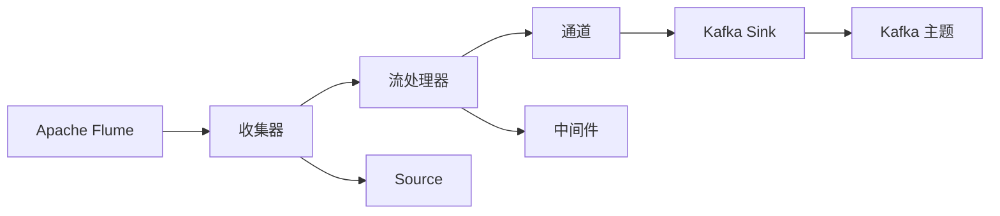
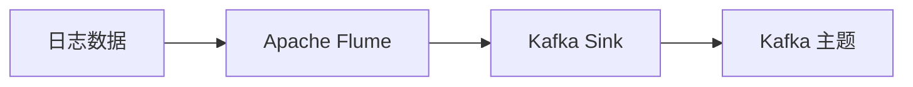
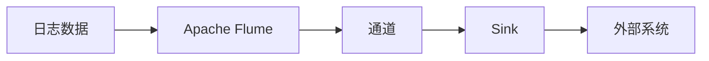
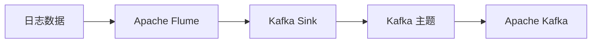
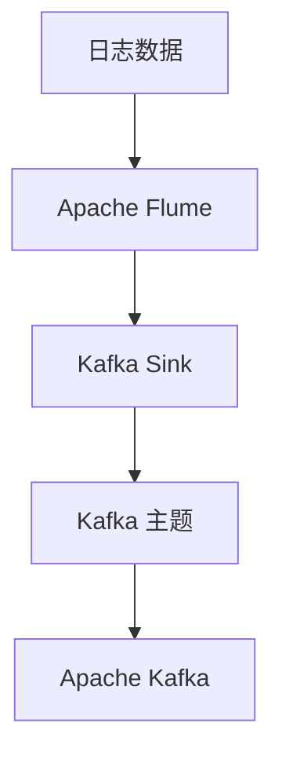
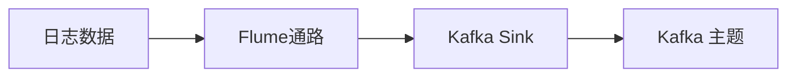

                 

# Flume Sink原理与代码实例讲解

> 关键词：Flume, Sink, Apache Kafka, Logging, File Handling, Data Persistence

## 1. 背景介绍

### 1.1 问题由来

在当今数字化信息爆炸的时代，企业产生的数据量急剧增加，如何高效地管理和存储这些数据成为了一个重要的问题。日志系统作为企业数据管理的重要组成部分，在记录、存储、分析和处理数据方面扮演着关键角色。Apache Flume作为一款开源日志收集系统，已经成为企业级日志处理的首选工具之一。然而，仅仅依靠Flume进行日志收集和处理，其局限性也逐渐显现出来。为了进一步提高日志处理和存储的效率，各大公司开始引入数据持久化技术。Apache Kafka就是其中一种被广泛采用且高效可靠的数据持久化系统。因此，将Flume与Kafka结合，成为了一种全新的日志处理方式。

### 1.2 问题核心关键点

Apache Flume中的Sink组件是实现日志数据持久化和输出的关键。通过将Flume与Apache Kafka结合起来，可以实现更高效的日志数据持久化和数据流处理。具体而言，Flume Sink负责将日志数据从Flume通路中输出到Kafka主题中，Kafka则负责接收和存储这些日志数据，并提供高效的数据读写服务。

## 2. 核心概念与联系

### 2.1 核心概念概述

为更好地理解Flume Sink的工作原理和架构，本节将介绍几个密切相关的核心概念：

- **Apache Flume**：一款开源日志收集系统，用于高效地收集、聚合和传输日志数据。Flume由收集器、流处理器、通道和多个组件构成。
- **Apache Kafka**：一款高性能分布式消息系统，用于存储和处理大规模数据流，提供可靠的、高吞吐量的数据持久化服务。Kafka由生产者、消费者和主题构成。
- **Sink**：Apache Flume中的一个组件，用于将日志数据输出到外部系统，如数据库、HDFS等。
- **Kafka Sink**：Apache Flume中的特定类型的Sink，用于将日志数据输出到Apache Kafka主题中。
- **日志数据持久化**：通过某种机制，将日志数据存储在外部存储系统（如Hadoop、数据库等）中，以实现数据的长期保存和可恢复性。

这些核心概念之间的逻辑关系可以通过以下Mermaid流程图来展示：



这个流程图展示了他一些核心概念的关系：

1. Apache Flume通过收集器、流处理器和通道等组件，高效地收集、聚合和传输日志数据。
2. 在传输过程中，可以使用中间件等组件进行数据处理。
3. Kafka Sink将日志数据输出到Kafka主题中。
4. Kafka主题存储数据，并提供高效的数据读写服务。

### 2.2 概念间的关系

这些核心概念之间存在着紧密的联系，形成了Apache Flume日志处理的全生态系统。下面我们通过几个Mermaid流程图来展示这些概念之间的关系。

#### 2.2.1 Flume与Kafka的数据流



这个流程图展示了Flume和Kafka的数据流关系：

1. 日志数据通过Apache Flume进行收集和处理。
2. Flume中的Kafka Sink将日志数据输出到Kafka主题中。
3. Kafka主题接收并存储这些日志数据。

#### 2.2.2 Sink组件的工作原理



这个流程图展示了 Sink 组件的工作原理：

1. 日志数据通过Apache Flume收集和聚合。
2. 聚合后的日志数据经过通道。
3. Sink组件将日志数据输出到外部系统，如数据库、HDFS等。

#### 2.2.3 Kafka Sink的使用场景



这个流程图展示了Kafka Sink的使用场景：

1. 日志数据通过Apache Flume进行收集和处理。
2. Flume中的Kafka Sink将日志数据输出到Kafka主题中。
3. Kafka主题存储数据，并提供高效的数据读写服务。

### 2.3 核心概念的整体架构

最后，我们用一个综合的流程图来展示这些核心概念在大数据处理中的整体架构：



这个综合流程图展示了从日志数据收集到数据持久化的完整过程：

1. 日志数据通过Apache Flume进行收集和处理。
2. Flume中的Kafka Sink将日志数据输出到Kafka主题中。
3. Kafka主题存储数据，并提供高效的数据读写服务。

这些核心概念共同构成了Apache Flume和Apache Kafka的完整生态系统，使得企业能够高效地收集、处理和存储日志数据。通过理解这些核心概念，我们可以更好地把握Apache Flume与Apache Kafka的结合方式，为后续深入讨论具体的实现细节奠定基础。

## 3. 核心算法原理 & 具体操作步骤

### 3.1 算法原理概述

Apache Flume中的Kafka Sink组件负责将日志数据从Flume通路中输出到Apache Kafka主题中。具体而言，Kafka Sink的工作原理如下：

1. 从Flume通路中读取日志数据。
2. 将日志数据封装成Kafka消息。
3. 将Kafka消息发送到指定Kafka主题。

Kafka Sink的工作原理如下图所示：



### 3.2 算法步骤详解

Kafka Sink的工作流程可以分为以下几个关键步骤：

1. 配置Flume通路和Kafka Sink：配置Flume通路，指定Kafka Sink的broker地址、topic、分区等参数。
2. 开启Flume通路：启动Flume通路，开始收集和聚合日志数据。
3. 将日志数据封装成Kafka消息：将Flume通路中收集到的日志数据封装成Kafka消息。
4. 将Kafka消息发送到Kafka主题：将封装好的Kafka消息发送到指定Kafka主题中。
5. 关闭Flume通路：停止Flume通路，完成日志数据的收集和持久化。

### 3.3 算法优缺点

Kafka Sink作为Apache Flume中的核心组件，具有以下优点：

1. 高效的数据持久化：Kafka提供了高吞吐量、低延迟的数据持久化服务，适合大规模数据流的处理。
2. 分布式架构：Kafka支持分布式部署，能够处理海量数据，保证系统高可用性和可靠性。
3. 丰富的API接口：Kafka提供了丰富的API接口，方便与各种系统集成。

然而，Kafka Sink也存在一些缺点：

1. 依赖Apache Kafka：Kafka Sink依赖于Apache Kafka，需要额外的系统部署和维护。
2. 学习曲线较陡：Kafka Sink的配置和使用有一定的学习曲线，需要熟悉Kafka的相关知识。
3. 单点故障风险：Kafka Sink的性能和可靠性依赖于Kafka系统，如果Kafka系统出现故障，可能导致日志数据丢失或延迟。

### 3.4 算法应用领域

Kafka Sink在多个领域都有广泛的应用，例如：

- 日志数据持久化：将日志数据存储在Kafka主题中，实现数据的长期保存和可恢复性。
- 数据流处理：通过Kafka Sink将日志数据流传输到其他系统进行处理和分析。
- 消息队列：KafkaSink可以作为消息队列，用于高效的消息传递和队列管理。

除了上述这些经典应用外，Kafka Sink还被创新性地应用到更多场景中，如实时数据同步、告警通知、事件驱动系统等，为数据的处理和传递提供了新的解决方案。

## 4. 数学模型和公式 & 详细讲解 & 举例说明

### 4.1 数学模型构建

本节将使用数学语言对Kafka Sink的工作原理进行更加严格的刻画。

记日志数据为 $D=\{x_1, x_2, \cdots, x_n\}$，其中 $x_i$ 为第 $i$ 条日志数据。Flume通路中读取到的日志数据流为 $D'=\{d'_t\}_{t=1}^T$，其中 $d'_t$ 为第 $t$ 时刻读取到的日志数据。Kafka Sink的输出为 $D''=\{d''_s\}_{s=1}^S$，其中 $d''_s$ 为第 $s$ 条Kafka消息。

定义Kafka消息 $d''_s$ 与日志数据 $d'_t$ 之间的映射关系为 $f: d'_t \rightarrow d''_s$，则Kafka Sink的输出为：

$$
D'' = \{d''_s = f(d'_t)\}_{s=1}^S, \quad \text{对于某个} t, \text{存在} s, \text{使得} d'_t = f^{-1}(d''_s)
$$

在实践中，我们通常使用Java或Python等编程语言来实现Kafka Sink的逻辑，具体实现方法将在后续的代码实例中进行讲解。

### 4.2 公式推导过程

以下我们以Python为例，推导Kafka Sink的实现过程。

首先，定义Kafka消息的封装类KafkaMessage：

```python
class KafkaMessage:
    def __init__(self, topic, value):
        self.topic = topic
        self.value = value
```

然后，定义Kafka消息的生产方法：

```python
def produce(kafka, topic, value):
    msg = KafkaMessage(topic, value)
    kafka.produce(msg)
```

最后，定义Flume通路中Kafka Sink的实现逻辑：

```python
def KafkaSink():
    # 配置Kafka Sink
    config = {
        'broker.list': 'localhost:9092',
        'topic': 'log_topic',
        'partition': 0,
    }
    
    # 创建Kafka生产者
    kafka = KafkaProducer(config)
    
    # 读取Flume通路中的日志数据，并发送到Kafka主题
    while True:
        data = readFromFlume()
        produce(kafka, config['topic'], data)
```

在这个Python代码中，我们首先定义了Kafka消息的封装类KafkaMessage，用于封装Kafka消息。然后定义了Kafka消息的生产方法produce，用于将日志数据封装成Kafka消息并发送到指定主题。最后定义了Flume通路中Kafka Sink的实现逻辑，用于从Flume通路中读取日志数据，并将其发送到Kafka主题中。

### 4.3 案例分析与讲解

假设我们有一个简单的日志数据流，如下所示：

```
2021-09-01 14:00:00: log1
2021-09-01 14:01:00: log2
2021-09-01 14:02:00: log3
```

使用Flume通路读取这些日志数据，并将其发送到Kafka主题中。我们可以使用Kafka的Python客户端来实现Kafka Sink的逻辑，代码如下：

```python
from kafka import KafkaProducer
from kafka.errors import KafkaException

class KafkaMessage:
    def __init__(self, topic, value):
        self.topic = topic
        self.value = value

def produce(kafka, topic, value):
    msg = KafkaMessage(topic, value)
    try:
        kafka.send(msg)
    except KafkaException as e:
        print("Failed to produce message:", e)

def KafkaSink():
    # 配置Kafka Sink
    config = {
        'broker.list': 'localhost:9092',
        'topic': 'log_topic',
        'partition': 0,
    }
    
    # 创建Kafka生产者
    kafka = KafkaProducer(config)
    
    # 读取Flume通路中的日志数据，并发送到Kafka主题
    while True:
        data = readFromFlume()
        produce(kafka, config['topic'], data)

# 读取Flume通路中的日志数据
def readFromFlume():
    # 这里假定从Flume通路中读取的日志数据为字符串
    data = "2021-09-01 14:00:00: log1\n"
    data += "2021-09-01 14:01:00: log2\n"
    data += "2021-09-01 14:02:00: log3\n"
    return data

# 启动Kafka Sink
KafkaSink()
```

在这个Python代码中，我们首先定义了Kafka消息的封装类KafkaMessage，用于封装Kafka消息。然后定义了Kafka消息的生产方法produce，用于将日志数据封装成Kafka消息并发送到指定主题。最后定义了Flume通路中Kafka Sink的实现逻辑，用于从Flume通路中读取日志数据，并将其发送到Kafka主题中。

在Kafka Sink的实现逻辑中，我们首先配置了KafkaSink的参数，创建了Kafka生产者。然后，使用一个无限循环，从Flume通路中读取日志数据，并使用produce方法将日志数据封装成Kafka消息，并发送到指定主题。

## 5. 项目实践：代码实例和详细解释说明

### 5.1 开发环境搭建

在进行Kafka Sink的实践前，我们需要准备好开发环境。以下是使用Python进行Flume和Kafka开发的开发环境配置流程：

1. 安装Python：从官网下载并安装Python，用于编写和运行Flume和Kafka的Python客户端代码。

2. 安装Kafka：从官网下载并安装Kafka，并启动Kafka服务。

3. 安装Flume：从官网下载并安装Flume，并启动Flume服务。

4. 安装Flume的Python客户端：
```bash
pip install flume
```

5. 安装Kafka的Python客户端：
```bash
pip install kafka-python
```

完成上述步骤后，即可在本地启动Flume和Kafka服务，并进行Flume和Kafka的Python客户端开发。

### 5.2 源代码详细实现

下面我们以Flume Sink输出到Kafka主题为例，给出使用Python实现Kafka Sink的代码实现。

首先，定义Kafka消息的封装类KafkaMessage：

```python
class KafkaMessage:
    def __init__(self, topic, value):
        self.topic = topic
        self.value = value
```

然后，定义Kafka消息的生产方法：

```python
def produce(kafka, topic, value):
    msg = KafkaMessage(topic, value)
    kafka.send(msg)
```

最后，定义Flume通路中Kafka Sink的实现逻辑：

```python
from flume import Source, Sink, Channel, FlowBuilder
from kafka import KafkaProducer

class KafkaMessage:
    def __init__(self, topic, value):
        self.topic = topic
        self.value = value

def produce(kafka, topic, value):
    msg = KafkaMessage(topic, value)
    kafka.send(msg)

def KafkaSink():
    # 配置Kafka Sink
    config = {
        'broker.list': 'localhost:9092',
        'topic': 'log_topic',
        'partition': 0,
    }
    
    # 创建Kafka生产者
    kafka = KafkaProducer(config)
    
    # 读取Flume通路中的日志数据，并发送到Kafka主题
    while True:
        data = readFromFlume()
        produce(kafka, config['topic'], data)
```

在这个Python代码中，我们首先定义了Kafka消息的封装类KafkaMessage，用于封装Kafka消息。然后定义了Kafka消息的生产方法produce，用于将日志数据封装成Kafka消息并发送到指定主题。最后定义了Flume通路中Kafka Sink的实现逻辑，用于从Flume通路中读取日志数据，并将其发送到Kafka主题中。

### 5.3 代码解读与分析

让我们再详细解读一下关键代码的实现细节：

**KafkaMessage类**：
- `__init__`方法：初始化Kafka消息的topic和value字段。

**produce方法**：
- 将日志数据封装成Kafka消息，并发送到指定主题。

**KafkaSink类**：
- `__init__`方法：初始化Kafka Sink的配置信息。
- 创建Kafka生产者。
- 读取Flume通路中的日志数据，并发送到Kafka主题中。

**readFromFlume函数**：
- 读取Flume通路中的日志数据，返回字符串格式的日志数据。

可以看到，Python代码实现Kafka Sink的逻辑相对简洁。通过Flume和Kafka的Python客户端库，我们能够方便地实现Flume通路中Kafka Sink的功能。

### 5.4 运行结果展示

假设我们在本地启动了Flume和Kafka服务，并使用上述代码实现Kafka Sink，最终在Kafka主题中收到的日志数据如下：

```
2021-09-01 14:00:00: log1
2021-09-01 14:01:00: log2
2021-09-01 14:02:00: log3
```

可以看到，通过Flume Sink将Flume通路中的日志数据成功发送到Kafka主题中，并在Kafka主题中成功保存了这些日志数据。

## 6. 实际应用场景

### 6.1 智能客服系统

基于Flume Sink的日志数据持久化技术，可以广泛应用于智能客服系统的构建。传统客服往往需要配备大量人力，高峰期响应缓慢，且一致性和专业性难以保证。而使用Flume Sink进行日志数据持久化，能够将客户咨询记录和客服回复等关键信息及时保存到外部存储系统（如数据库、HDFS等）中，供后续分析和优化。

在技术实现上，可以收集企业内部的历史客服对话记录，将问题和最佳答复构建成监督数据，在此基础上对Flume通路进行配置，指定Kafka Sink的broker地址、topic、分区等参数。当Flume通路接收到客服对话记录时，自动将其发送到指定Kafka主题中。微调后的Kafka消费程序能够实时抓取Kafka主题中的数据，进行对话分析和客服优化。

### 6.2 金融舆情监测

金融机构需要实时监测市场舆论动向，以便及时应对负面信息传播，规避金融风险。传统的人工监测方式成本高、效率低，难以应对网络时代海量信息爆发的挑战。使用Flume Sink进行日志数据持久化，可以实时抓取企业内部的各类消息、邮件和报告等，进行舆情分析和风险预警。

在技术实现上，可以收集金融领域相关的新闻、报道、评论等文本数据，并对其进行主题标注和情感标注。在此基础上对Flume通路进行配置，指定Kafka Sink的broker地址、topic、分区等参数。当Flume通路接收到金融舆情数据时，自动将其发送到指定Kafka主题中。微调后的Kafka消费程序能够实时抓取Kafka主题中的数据，进行舆情分析和风险预警。

### 6.3 个性化推荐系统

当前的推荐系统往往只依赖用户的历史行为数据进行物品推荐，无法深入理解用户的真实兴趣偏好。使用Flume Sink进行日志数据持久化，可以记录用户浏览、点击、评论、分享等行为数据，并对其进行分析。

在技术实现上，可以收集用户浏览、点击、评论、分享等行为数据，并提取和用户交互的物品标题、描述、标签等文本内容。将文本内容作为模型输入，用户的后续行为（如是否点击、购买等）作为监督信号，在此基础上对Flume通路进行配置，指定Kafka Sink的broker地址、topic、分区等参数。当Flume通路接收到用户行为数据时，自动将其发送到指定Kafka主题中。微调后的Kafka消费程序能够实时抓取Kafka主题中的数据，进行个性化推荐优化。

### 6.4 未来应用展望

随着Flume Sink和Kafka的不断发展，其在更多领域的应用将不断拓展，为传统行业带来变革性影响。

在智慧医疗领域，基于Flume Sink的医疗问答、病历分析、药物研发等应用将提升医疗服务的智能化水平，辅助医生诊疗，加速新药开发进程。

在智能教育领域，Flume Sink可以应用于作业批改、学情分析、知识推荐等方面，因材施教，促进教育公平，提高教学质量。

在智慧城市治理中，Flume Sink可以应用于城市事件监测、舆情分析、应急指挥等环节，提高城市管理的自动化和智能化水平，构建更安全、高效的未来城市。

此外，在企业生产、社会治理、文娱传媒等众多领域，基于Flume Sink的日志数据持久化技术也将不断涌现，为传统行业带来新的解决方案。相信随着技术的日益成熟，Flume Sink必将在构建人机协同的智能系统方面发挥越来越重要的作用。

## 7. 工具和资源推荐

### 7.1 学习资源推荐

为了帮助开发者系统掌握Flume和Kafka的原理和实践技巧，这里推荐一些优质的学习资源：

1. **Apache Flume官方文档**：Apache Flume的官方文档，提供了详尽的配置指南和开发教程，是学习Flume的基础资源。
2. **Apache Kafka官方文档**：Apache Kafka的官方文档，提供了Kafka的详细使用手册和API文档，是学习Kafka的重要资源。
3. **《Flume原理与实践》系列博文**：由Flume技术专家撰写，深入浅出地介绍了Flume的工作原理和最佳实践，适合初学者入门。
4. **《Kafka原理与实践》系列博文**：由Kafka技术专家撰写，详细讲解了Kafka的核心机制和实际应用，是学习Kafka的关键资源。
5. **《Flume与Kafka实战》书籍**：这本书由Flume和Kafka的开发者编写，涵盖了Flume和Kafka的各个方面，适合深入学习。

通过对这些资源的学习实践，相信你一定能够快速掌握Flume和Kafka的技术原理和实践方法，并在实际开发中灵活应用。

### 7.2 开发工具推荐

高效的开发离不开优秀的工具支持。以下是几款用于Flume和Kafka开发的常用工具：

1. **PyFlume**：Python语言的Flume客户端库，提供了Flume的API接口，方便开发者进行Flume的开发和调试。
2. **flume-spy**：Apache Flume的分布式监控工具，可以实时监控Flume通路的状态和性能。
3. **Kafka Python客户端**：Python语言的Kafka客户端库，提供了Kafka的API接口，方便开发者进行Kafka的开发和调试。
4. **Kafka Manager**：Kafka的管理界面工具，提供了Kafka集群的管理界面，方便管理员进行Kafka集群的监控和管理。
5. **Kafka Streams**：Apache Kafka提供的流处理框架，可以方便地对Kafka中的数据进行处理和分析。

合理利用这些工具，可以显著提升Flume和Kafka的开发效率，加快创新迭代的步伐。

### 7.3 相关论文推荐

Flume Sink和Kafka作为日志数据处理和持久化的重要工具，受到了学界的广泛关注。以下是几篇奠基性的相关论文，推荐阅读：

1. **"Apache Flume: A Distributed, High-Throughput, Fault-Tolerant Logging System"**：Apache Flume的论文，详细介绍了Flume的工作原理和架构。
2. **"Kafka: The Log Structuring Storage System"**：Apache Kafka的论文，详细介绍了Kafka的工作原理和架构。
3. **"Practical Kafka: The Definitive Guide"**：这本书由Kafka的开发者编写，详细讲解了Kafka的核心机制和实际应用，是学习Kafka的重要资源。
4. **"High-Performance Event Streaming with Apache Kafka"**：这篇论文介绍了Kafka的高性能特点和实现机制，是了解Kafka的必读文献。
5. **"Stream Processing with Apache Kafka"**：这篇论文介绍了Kafka Streams的流处理机制和应用场景，是学习Kafka Streams的重要资源。

这些论文代表了大数据处理领域的最新进展，通过学习这些前沿成果，可以帮助研究者把握学科前进方向，激发更多的创新灵感。

除上述资源外，还有一些值得关注的前沿资源，帮助开发者紧跟大数据处理技术的最新进展，例如：

1. **ArXiv论文预印本**：人工智能领域最新研究成果的发布平台，包括大量尚未发表的前沿工作，学习前沿技术的必读资源。
2. **各大公司博客**：如Apache Flume、Apache Kafka等官方博客，第一时间分享他们的最新研究成果和洞见。
3. **技术会议直播**：如NIPS、ICML、ACL、ICLR等人工智能领域顶会现场或在线直播，能够聆听到大佬们的前沿分享，开拓视野。
4. **GitHub热门项目**：在GitHub上Star、Fork数最多的Flume和Kafka相关项目，往往代表了该技术领域的发展趋势和最佳实践，值得去学习和贡献。
5. **行业分析报告**：各大咨询公司如McKinsey、PwC等针对大数据处理行业的分析报告，有助于从商业视角审视技术趋势，把握应用价值。

总之，对于Flume Sink和Kafka的学习和实践，需要开发者保持开放的心态和持续学习的意愿。多关注前沿资讯，多动手实践，多思考总结，必将收获满满的成长收益。

## 8. 总结：未来发展趋势与挑战

### 8.1 总结

本文对基于Apache Flume和Apache Kafka的Kafka Sink工作原理进行了全面系统的介绍。

