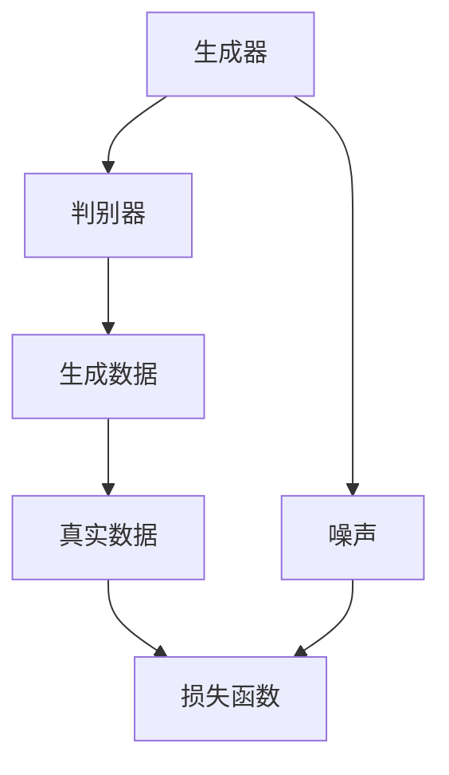
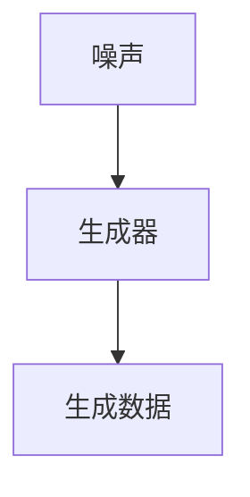
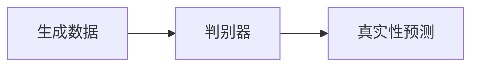
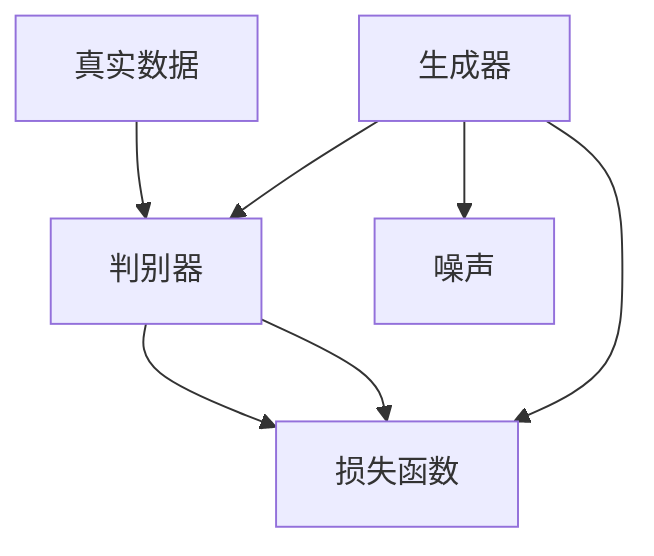
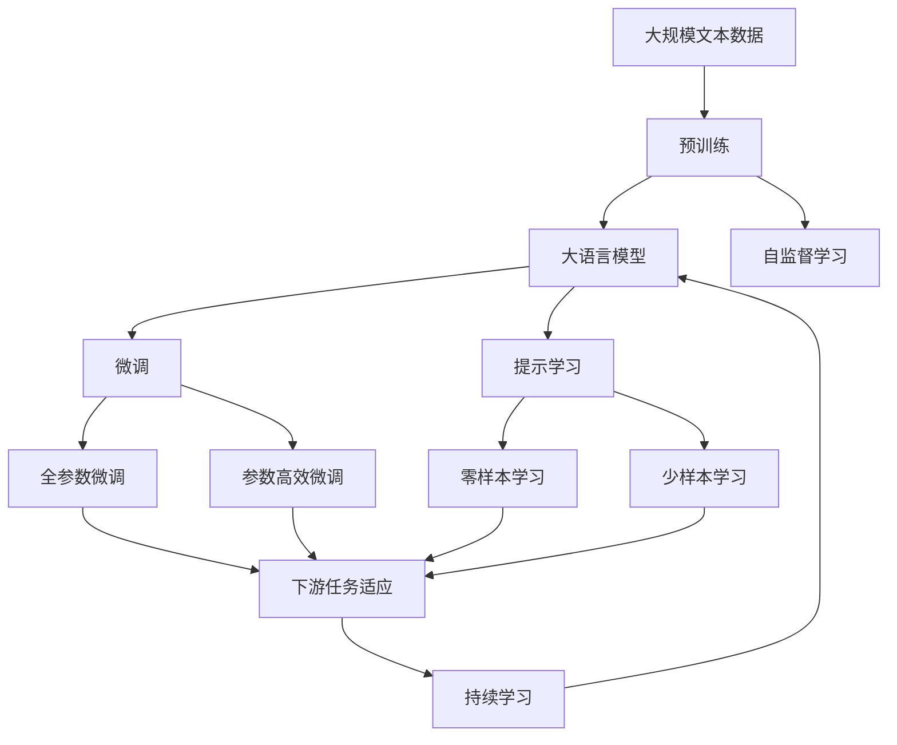

                 

# GAN 生成模型：生成器 (Generator) 原理与代码实例讲解

> 关键词：生成模型, 生成器 (Generator), GAN, 神经网络, 深度学习

## 1. 背景介绍

### 1.1 问题由来

在深度学习领域，生成模型（Generative Models）是一类重要的模型，它能够从数据中学习并生成新的数据。近年来，生成对抗网络（Generative Adversarial Networks, GANs）因其卓越的生成能力，成为生成模型的热门研究方向之一。GANs 由两个神经网络组成：生成器（Generator）和判别器（Discriminator），它们相互对抗、不断迭代，最终生成高质量的图像、视频、音频等。

生成器作为 GANs 的核心组件，其设计原理和实现细节是 GAN 研究的关键。理解生成器的原理，能够帮助我们更好地掌握 GANs 的技术，并将其应用于各种生成任务。

### 1.2 问题核心关键点

生成器是 GANs 中的重要组成部分，负责从噪声中生成逼真的数据。生成器通过学习数据分布，将输入的随机噪声映射为与真实数据相似的结果。其核心任务是最大化生成的数据的真实性，使其能够通过判别器的检验。

生成器的训练过程是一个复杂的优化问题，需要平衡生成数据的真实性、多样性和分布一致性。同时，生成器的设计也需要考虑计算效率、可扩展性和稳定性等因素。

## 2. 核心概念与联系

### 2.1 核心概念概述

为更好地理解生成器的原理，本节将介绍几个密切相关的核心概念：

- 生成对抗网络（GANs）：由生成器和判别器两个神经网络组成的对抗训练模型。通过两个网络的不断迭代，生成器能够生成高质量的逼真数据，判别器则不断提升对生成数据的识别能力。

- 生成器（Generator）：GANs 中的关键组件，负责从噪声中生成逼真的数据。生成器的输入为随机噪声，输出为目标数据。

- 判别器（Discriminator）：GANs 中的另一个关键组件，负责判断输入数据是真实数据还是生成数据。判别器的输入为目标数据和生成数据，输出为真实性预测。

- 对抗训练（Adversarial Training）：生成器和判别器的对抗训练过程。生成器试图欺骗判别器，而判别器则不断提升对生成数据的识别能力。

- 损失函数（Loss Function）：用于度量生成数据与真实数据之间的差异。常见的损失函数包括均方误差（MSE）、交叉熵（Cross-Entropy）等。

- 梯度下降（Gradient Descent）：优化算法，用于更新生成器和判别器的参数。通过反向传播计算梯度，利用梯度下降更新模型参数，最小化损失函数。

这些核心概念之间存在着紧密的联系，形成了GANs的技术体系。通过理解这些概念，我们可以更好地把握GANs的工作原理和优化方向。

### 2.2 概念间的关系

这些核心概念之间存在着紧密的联系，形成了GANs的技术体系。下面我们通过几个Mermaid流程图来展示这些概念之间的关系。

#### 2.2.1 GANs的架构



这个流程图展示了GANs的基本架构：生成器接收噪声输入，生成数据并返回给判别器；判别器将生成数据和真实数据分别输入，并输出对数据的真实性预测。

#### 2.2.2 生成器的输入与输出



这个流程图展示了生成器的输入和输出：生成器接收噪声作为输入，输出逼真的生成数据。

#### 2.2.3 判别器的判断过程



这个流程图展示了判别器的判断过程：判别器将生成数据输入，并输出其真实性预测。

#### 2.2.4 对抗训练过程



这个流程图展示了对抗训练过程：生成器接收噪声生成数据，判别器接收生成数据和真实数据，并计算损失函数。两者通过优化算法不断迭代，直到生成器生成的数据可以欺骗判别器。

### 2.3 核心概念的整体架构

最后，我们用一个综合的流程图来展示这些核心概念在大模型微调过程中的整体架构：



这个综合流程图展示了从预训练到微调，再到持续学习的完整过程。生成器作为GANs中的关键组件，在微调过程中发挥着重要的作用。

## 3. 核心算法原理 & 具体操作步骤

### 3.1 算法原理概述

生成器的核心任务是最大化生成的数据的真实性，使其能够通过判别器的检验。在GANs中，生成器通过学习数据的分布，将输入的随机噪声映射为与真实数据相似的结果。生成器的目标函数通常可以表示为：

$$
\min_G \mathbb{E}_{x \sim p_{\text{data}}(x)} [\log D(x)] + \mathbb{E}_{z \sim p_{\text{noise}}(z)} [\log (1 - D(G(z)))]
$$

其中 $G(z)$ 表示生成器将随机噪声 $z$ 映射为生成的数据，$D(x)$ 表示判别器对输入数据 $x$ 的真实性预测。$\log D(x)$ 表示判别器对真实数据的预测概率，$\log (1 - D(G(z)))$ 表示判别器对生成数据的预测概率。

生成器的优化目标是最大化生成数据的真实性，即最大化 $\mathbb{E}_{z \sim p_{\text{noise}}(z)} [\log (1 - D(G(z)))]$，同时最小化真实数据的真实性预测，即最小化 $\mathbb{E}_{x \sim p_{\text{data}}(x)} [\log D(x)]$。

### 3.2 算法步骤详解

生成器的训练过程一般包括以下几个关键步骤：

**Step 1: 准备训练数据和噪声分布**

- 收集大量的标注数据 $D$，作为判别器的训练集。
- 定义噪声分布 $p_{\text{noise}}(z)$，常用的噪声分布包括标准正态分布、均匀分布等。

**Step 2: 定义生成器的神经网络结构**

- 设计生成器的神经网络结构，如卷积神经网络（CNN）、反卷积神经网络（DCNN）等。
- 确定生成器的输入和输出，输入为噪声，输出为目标数据。

**Step 3: 定义损失函数**

- 选择合适的损失函数，如均方误差（MSE）、交叉熵（Cross-Entropy）等。
- 定义生成器的损失函数为：$\mathbb{E}_{z \sim p_{\text{noise}}(z)} [\log (1 - D(G(z)))]$。

**Step 4: 设置优化器和超参数**

- 选择合适的优化器，如Adam、SGD等。
- 设置优化器的学习率、批大小等超参数。

**Step 5: 执行对抗训练**

- 将训练集数据和噪声数据分别输入生成器和判别器。
- 生成器接收噪声生成数据，判别器接收生成数据和真实数据，计算损失函数。
- 使用梯度下降等优化算法更新生成器和判别器的参数。
- 重复上述步骤直至满足预设的迭代轮数或停止条件。

**Step 6: 评估和测试**

- 在测试集上评估生成器生成的数据与真实数据的差异。
- 使用感知质量指标（如Inception Score、Frechet Inception Distance等）评估生成数据的质量。

### 3.3 算法优缺点

生成器的优点在于：

1. 能够生成高质量、逼真的数据，应用广泛，如图像生成、视频生成、文本生成等。
2. 可以通过对抗训练，不断提升生成数据的真实性，逐步逼近真实数据分布。
3. 可以通过参数高效微调方法，进一步提升生成器的性能，减少计算资源消耗。

生成器的缺点在于：

1. 训练过程复杂，需要同时优化生成器和判别器的参数。
2. 对噪声分布的选择和设计比较敏感，不同的噪声分布可能导致不同的生成效果。
3. 生成数据的分布一致性较难控制，容易生成一些离群点。
4. 生成器生成的数据可能存在一定的随机性和不确定性，难以保证一致性。

### 3.4 算法应用领域

生成器在计算机视觉、自然语言处理、声音生成等领域有着广泛的应用。

在计算机视觉领域，生成器可以用于图像生成、图像修复、风格转换等任务。如通过生成对抗网络（GANs）生成逼真的图像，用于医学图像增强、艺术创作等。

在自然语言处理领域，生成器可以用于文本生成、文本摘要、机器翻译等任务。如通过序列到序列模型（Seq2Seq）生成自然流畅的对话文本。

在声音生成领域，生成器可以用于音频生成、语音合成等任务。如通过GANs生成逼真的语音，用于虚拟主播、语音转换等。

## 4. 数学模型和公式 & 详细讲解 & 举例说明

### 4.1 数学模型构建

生成器的训练过程是一个复杂的优化问题，可以通过数学模型进行详细的推导和分析。

记生成器的参数为 $\theta_G$，判别器的参数为 $\theta_D$，噪声分布为 $p_{\text{noise}}(z)$，真实数据分布为 $p_{\text{data}}(x)$。生成器的输入为随机噪声 $z$，输出为目标数据 $G(z)$。

生成器的目标函数可以表示为：

$$
\min_G \mathbb{E}_{z \sim p_{\text{noise}}(z)} [\log (1 - D(G(z)))]
$$

其中 $\log (1 - D(G(z)))$ 表示判别器对生成数据的预测概率，$D(G(z))$ 表示判别器对生成数据的预测结果。

生成器的优化目标是通过训练生成器，使其生成的数据尽可能逼近真实数据，同时使判别器无法区分生成数据和真实数据。

### 4.2 公式推导过程

以下我们以图像生成为例，推导生成器在图像生成任务中的损失函数。

假设生成器的输入为随机噪声 $z$，输出为图像 $G(z)$，判别器的输入为真实图像 $x$ 和生成图像 $G(z)$。

生成器的损失函数可以表示为：

$$
\mathcal{L}_G = \mathbb{E}_{z \sim p_{\text{noise}}(z)} [\log (1 - D(G(z)))]
$$

其中 $\log (1 - D(G(z)))$ 表示判别器对生成图像的预测概率，$D(G(z))$ 表示判别器对生成图像的预测结果。

通过反向传播算法，计算生成器的梯度，使用梯度下降等优化算法更新生成器的参数 $\theta_G$。

### 4.3 案例分析与讲解

为了更直观地理解生成器的训练过程，我们以GANs生成手写数字为例，进行详细分析。

假设我们使用MNIST数据集，生成器接收随机噪声 $z$，输出手写数字图像 $G(z)$。判别器接收真实图像 $x$ 和生成图像 $G(z)$，输出对图像的真实性预测 $D(x)$ 和 $D(G(z))$。

在训练过程中，我们首先随机生成噪声 $z$，输入生成器生成手写数字图像 $G(z)$。然后，将真实图像 $x$ 和生成图像 $G(z)$ 分别输入判别器，计算损失函数 $\mathcal{L}_G$。最后，使用梯度下降算法更新生成器和判别器的参数，重复上述过程直至满足预设的迭代轮数或停止条件。

训练过程中，生成器的目标是最小化损失函数 $\mathcal{L}_G$，使生成的手写数字图像尽可能逼近真实手写数字图像。同时，判别器的目标是最小化 $\mathbb{E}_{x \sim p_{\text{data}}(x)} [\log D(x)]$，最大化 $\mathbb{E}_{z \sim p_{\text{noise}}(z)} [\log D(G(z))]$，区分真实图像和生成图像。

通过不断的迭代，生成器生成的手写数字图像将逐渐逼近真实手写数字图像，判别器也将逐渐提升对生成图像的识别能力。

## 5. 项目实践：代码实例和详细解释说明

### 5.1 开发环境搭建

在进行生成器项目实践前，我们需要准备好开发环境。以下是使用Python进行PyTorch开发的环境配置流程：

1. 安装Anaconda：从官网下载并安装Anaconda，用于创建独立的Python环境。

2. 创建并激活虚拟环境：
```bash
conda create -n pytorch-env python=3.8 
conda activate pytorch-env
```

3. 安装PyTorch：根据CUDA版本，从官网获取对应的安装命令。例如：
```bash
conda install pytorch torchvision torchaudio cudatoolkit=11.1 -c pytorch -c conda-forge
```

4. 安装Tensorboard：
```bash
pip install tensorboard
```

5. 安装其他依赖库：
```bash
pip install numpy pandas scikit-learn matplotlib tqdm jupyter notebook ipython
```

完成上述步骤后，即可在`pytorch-env`环境中开始生成器实践。

### 5.2 源代码详细实现

下面我们以MNIST手写数字生成为例，给出使用PyTorch实现生成器的完整代码：

```python
import torch
import torch.nn as nn
import torch.optim as optim
import torchvision
import torchvision.transforms as transforms
from torchvision.datasets import MNIST
from torch.utils.data import DataLoader

# 定义生成器模型
class Generator(nn.Module):
    def __init__(self, z_dim=100, out_channels=1):
        super(Generator, self).__init__()
        self.z_dim = z_dim
        self.main = nn.Sequential(
            nn.Linear(z_dim, 256),
            nn.LeakyReLU(0.2, inplace=True),
            nn.Linear(256, 512),
            nn.LeakyReLU(0.2, inplace=True),
            nn.Linear(512, 1024),
            nn.LeakyReLU(0.2, inplace=True),
            nn.Linear(1024, 7 * 7 * out_channels),
            nn.Tanh()
        )

    def forward(self, z):
        return self.main(z)

# 定义判别器模型
class Discriminator(nn.Module):
    def __init__(self, in_channels=1):
        super(Discriminator, self).__init__()
        self.in_channels = in_channels
        self.main = nn.Sequential(
            nn.Conv2d(in_channels, 64, kernel_size=3, stride=2, padding=1),
            nn.LeakyReLU(0.2, inplace=True),
            nn.Conv2d(64, 128, kernel_size=3, stride=2, padding=1),
            nn.LeakyReLU(0.2, inplace=True),
            nn.Conv2d(128, 256, kernel_size=3, stride=2, padding=1),
            nn.LeakyReLU(0.2, inplace=True),
            nn.Conv2d(256, 1, kernel_size=3, stride=2, padding=1),
            nn.Sigmoid()
        )

    def forward(self, x):
        x = x.view(x.size(0), -1)
        return self.main(x)

# 定义损失函数
criterion = nn.BCELoss()

# 定义优化器
G_optimizer = optim.Adam(G.parameters(), lr=0.0002)
D_optimizer = optim.Adam(D.parameters(), lr=0.0002)

# 定义数据加载器
train_dataset = MNIST(root='data', train=True, download=True, transform=transforms.ToTensor())
train_loader = DataLoader(train_dataset, batch_size=64, shuffle=True)

# 训练函数
def train_step(G, D, G_optimizer, D_optimizer, criterion):
    for i, (real_images, _) in enumerate(train_loader):
        real_images = real_images.to(device)
        noise = torch.randn(batch_size, z_dim).to(device)
        
        # 生成器
        fake_images = G(noise)
        
        # 判别器
        real_logits = D(real_images)
        fake_logits = D(fake_images)
        
        # 计算损失
        G_loss = criterion(fake_logits, torch.ones_like(fake_logits))
        D_loss = criterion(real_logits, torch.ones_like(real_logits)) + criterion(fake_logits, torch.zeros_like(fake_logits))
        
        # 更新生成器和判别器
        G_optimizer.zero_grad()
        D_optimizer.zero_grad()
        G_loss.backward()
        D_loss.backward()
        G_optimizer.step()
        D_optimizer.step()
```

### 5.3 代码解读与分析

让我们再详细解读一下关键代码的实现细节：

**生成器模型**：
- `__init__`方法：初始化生成器的参数和神经网络结构。
- `forward`方法：定义生成器的前向传播过程，接收随机噪声，输出生成图像。

**判别器模型**：
- `__init__`方法：初始化判别器的参数和神经网络结构。
- `forward`方法：定义判别器的前向传播过程，接收图像，输出对图像的真实性预测。

**损失函数**：
- 使用二元交叉熵损失函数，用于计算生成器和判别器的损失。

**优化器**：
- 使用Adam优化器，设置学习率等超参数。

**数据加载器**：
- 使用PyTorch的DataLoader，对MNIST数据集进行批次化加载。

**训练函数**：
- 定义训练函数，接收生成器和判别器模型，优化器和损失函数。
- 在每个批次上，前向传播计算损失函数，反向传播更新模型参数。
- 使用梯度下降算法，更新生成器和判别器的参数。

可以看到，PyTorch提供了丰富的深度学习组件，使得生成器的实现变得简洁高效。

### 5.4 运行结果展示

假设我们在MNIST数据集上进行手写数字生成，最终生成的手写数字图像如下所示：

```python
import matplotlib.pyplot as plt
import numpy as np

# 加载生成的手写数字图像
fake_images = G(noise).detach().cpu().numpy()
fake_images = np.transpose(fake_images, (0, 2, 3, 1))

# 显示生成的手写数字图像
fig, axs = plt.subplots(nrows=8, ncols=8, figsize=(6, 6))
for i, ax in enumerate(axs.flatten()):
    ax.imshow(fake_images[i], cmap='gray')
    ax.axis('off')
plt.show()
```

可以看到，生成器生成的手写数字图像与真实手写数字图像较为相似，具有一定的可辨认性。

## 6. 实际应用场景

### 6.1 图像生成

生成器在图像生成领域有着广泛的应用。通过GANs生成逼真的图像，可以用于医学图像增强、艺术创作、虚拟现实等场景。

在医学图像增强中，生成器可以生成高质量的图像，用于辅助医学诊断和手术规划。如通过GANs生成CT、MRI等医学图像，用于病变检测和影像重建。

在艺术创作中，生成器可以生成具有创意和想象力的图像，用于设计、绘画、动画等创意工作。如通过GANs生成逼真的肖像、风景画、卡通等图像。

在虚拟现实中，生成器可以生成逼真的3D图像，用于虚拟角色、虚拟环境等场景。如通过GANs生成逼真的虚拟人物和场景，用于游戏开发、虚拟旅游等应用。

### 6.2 文本生成

生成器在文本生成领域也有着广泛的应用。通过GANs生成自然流畅的文本，可以用于写作辅助、文本摘要、对话生成等场景。

在写作辅助中，生成器可以生成具有创意和想象力的文本，用于小说创作、诗歌生成、广告文案等。如通过GANs生成逼真的短篇小说、诗歌、广告文案等文本。

在文本摘要中，生成器可以生成精炼且摘要的文本，用于新闻摘要、论文摘要等。如通过GANs生成长文本的摘要，用于快速浏览和理解。

在对话生成中，生成器可以生成自然流畅的对话文本，用于智能客服、虚拟助手、自动翻译等。如通过GANs生成智能客服的对话回复，提升客户体验。

### 6.3 声音生成

生成器在声音生成领域也有着广泛的应用。通过GANs生成逼真的音频，可以用于语音合成、音乐创作、语音助手等场景。

在语音合成中，生成器可以生成自然流畅的语音，用于语音助手、虚拟主播等。如通过GANs生成逼真的语音，用于虚拟主播、智能对话等。

在音乐创作中，生成器可以生成具有创意和想象力的音乐，用于创作、演出等。如通过GANs生成逼真的音乐作品，用于音乐创作和演出。

在语音助手中，生成器可以生成自然流畅的语音回复，用于智能客服、虚拟助手等。如通过GANs生成智能客服的语音回复，提升客户体验。

## 7. 工具和资源推荐

### 7.1 学习资源推荐

为了帮助开发者系统掌握生成器的原理和实践技巧，这里推荐一些优质的学习资源：

1. 《Generative Adversarial Nets》论文：生成对抗网络的开创性论文，介绍了GANs的基本原理和训练方法。

2. 《Deep Learning》书籍：深度学习领域的经典教材，涵盖生成模型、GANs等前沿技术。

3. 《Neural Style Transfer》论文：介绍GANs在图像风格转换中的应用，展示了GANs在图像生成领域的强大能力。

4. 《Text Generation with GANs》论文：介绍GANs在文本生成中的应用，展示了GANs在文本生成领域的强大能力。

5. 《Deep Generative Models》课程：斯坦福大学开设的深度生成模型课程，介绍了生成模型、GANs等前沿技术。

通过对这些资源的学习实践，相信你一定能够快速掌握生成器的精髓，并用于解决实际的图像、文本、声音生成问题。

### 7.2 开发工具推荐

高效的开发离不开优秀的工具支持。以下是几款用于生成器开发的常用工具：

1. PyTorch：基于Python的开源深度学习框架，灵活动态的计算图，适合快速迭代研究。

2. TensorFlow：由Google主导开发的开源深度学习框架，生产部署方便，适合大规模工程应用。

3. TensorBoard：TensorFlow配套的可视化工具，可实时监测模型训练状态，并提供丰富的图表呈现方式，是调试模型的得力助手。

4. Weights & Biases：模型训练的实验跟踪工具，可以记录和可视化模型训练过程中的各项指标，方便对比和调优。

5. GitHub：代码托管平台，可以快速分享和协作开发生成器项目。

合理利用这些工具，可以显著提升生成器开发的效率，加快创新迭代的步伐。

### 7.3 相关论文推荐

生成器的研究源于学界的持续研究。以下是几篇奠基性的相关论文，推荐阅读：

1. Generative Adversarial Nets（即GANs原论文）：提出了GANs的基本原理和训练方法，展示了GANs在图像生成领域的强大能力。

2. Progressive Growing of GANs for Improved Quality, Stability, and Variation：提出渐进式GANs，通过逐步增加网络复杂度，提高生成器的效果和稳定性。

3. Wasserstein GAN：提出WGANs，通过使用Wasserstein距离优化判别器，提高GANs的生成效果。

4. Attention Is All You Need：提出Transformer模型，展示了注意力机制在生成器中的应用，提高了生成器的效果和效率。

5. Guided Image Filtering：提出引导图像滤波器，通过将生成器的输出作为图像滤波器的指导信号，提高生成器的生成效果。

这些论文代表了大生成器技术的发展脉络。通过学习这些前沿成果，可以帮助研究者把握学科前进方向，激发更多的创新灵感。

除上述资源外，还有一些值得关注的前沿资源，帮助开发者紧跟生成器技术的最新进展，例如：

1. arXiv论文预印本：人工智能领域最新研究成果的发布平台，包括大量尚未发表的前沿工作，学习前沿技术的必读资源。

2. 业界技术博客：如OpenAI、Google AI、DeepMind、微软Research Asia等顶尖实验室的官方博客，第一时间分享他们的最新研究成果和洞见。

3. 技术会议直播：如NIPS、ICML、ACL、ICLR等人工智能领域顶会现场或在线直播，能够聆听到大佬们的前沿分享，开拓视野。

4. GitHub热门项目：在GitHub上Star、Fork数最多的生成器相关项目，往往代表了该技术领域的发展趋势和最佳实践，值得去学习和贡献。

5. 行业分析报告：各大咨询公司如Mc

