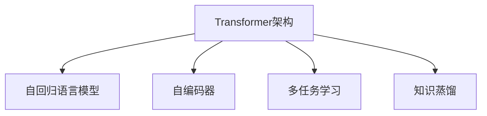
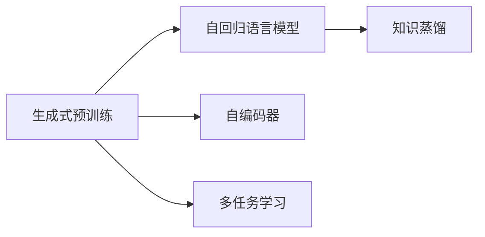
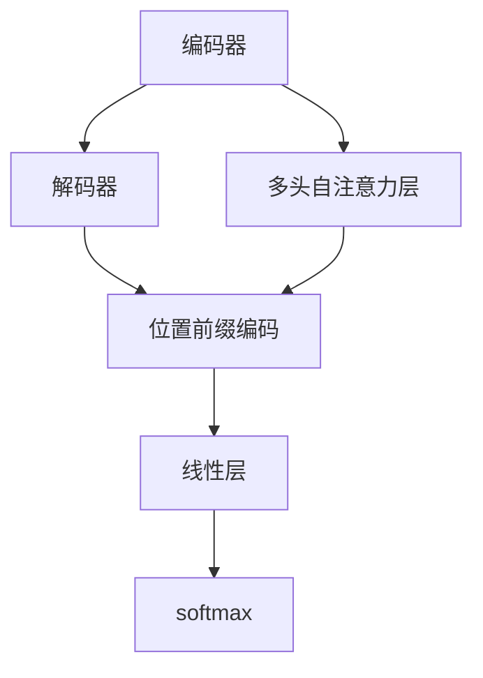

                 

# GPT-3.5原理与代码实例讲解

> 关键词：GPT-3.5, 自然语言处理(NLP), 生成式预训练Transformer, 生成式AI, 代码实例, 深度学习, 语言模型

## 1. 背景介绍

### 1.1 问题由来
近年来，随着深度学习技术的快速发展，特别是Transformer架构的广泛应用，自然语言处理（NLP）领域取得了显著进展。其中，生成式预训练Transformer模型，如GPT系列，通过在海量文本数据上进行自监督学习，学习到了丰富的语言知识和表达能力，成为当前NLP领域的研究热点。

GPT-3.5作为GPT-3的继任者，进一步提升了模型的生成能力和推理性能，广泛应用于文本生成、问答、机器翻译、对话系统等NLP任务中。本文将详细介绍GPT-3.5的原理，并通过代码实例帮助读者深入理解其实现机制。

### 1.2 问题核心关键点
GPT-3.5的核心技术在于其先进的Transformer架构和自回归生成机制。通过在大规模文本数据上进行预训练，GPT-3.5学习到了高维度的语义表示和强大的文本生成能力。在微调阶段，GPT-3.5可以通过有监督学习来优化特定任务，适应不同的应用场景。

GPT-3.5的生成式预训练过程主要包括以下几个步骤：
1. 自回归语言模型预训练：使用掩码机制生成大量无标签数据，训练模型预测缺失位置。
2. 自编码器预训练：训练模型从文本中抽取和预测文本，提升其对文本结构的理解能力。
3. 多任务学习：通过同时训练多个任务，增强模型泛化能力。
4. 知识蒸馏：将大模型的知识蒸馏到小模型，提升其性能。

这些预训练步骤共同构建了GPT-3.5强大的语言理解与生成能力，使其在NLP任务中表现出色。本文将从这些关键技术点出发，详细讲解GPT-3.5的原理，并通过代码实例演示其实现过程。

### 1.3 问题研究意义
GPT-3.5作为先进的生成式预训练模型，具有以下重要研究意义：
1. 提升NLP任务的性能：通过预训练和微调，GPT-3.5在文本生成、问答、翻译等多个NLP任务中取得了优异的性能。
2. 推动NLP应用落地：GPT-3.5的强大生成能力和高效推理性能，使其成为NLP应用落地的重要工具。
3. 促进模型优化：GPT-3.5的预训练和微调方法，为NLP模型优化提供了新的思路和方法。
4. 促进产业升级：GPT-3.5的应用，推动了NLP技术的产业化进程，加速了各行各业的数字化转型。

## 2. 核心概念与联系

### 2.1 核心概念概述

为了更好地理解GPT-3.5的工作原理，本节将介绍几个密切相关的核心概念：

- **Transformer架构**：一种基于自注意力机制的深度神经网络架构，通过多头自注意力层进行特征提取和交互，能够有效捕捉长距离依赖关系。
- **自回归语言模型**：使用当前位置的信息预测下一个位置，能够生成连贯的文本序列。
- **自编码器**：将输入数据编码为低维向量，再解码回原数据，用于提升模型对文本结构的理解能力。
- **多任务学习**：在训练过程中同时优化多个任务，增强模型的泛化能力。
- **知识蒸馏**：通过将大模型的知识传递给小模型，提升小模型的性能。

这些概念之间存在着紧密的联系，共同构成了GPT-3.5的实现框架。下面，我们将通过Mermaid流程图来展示这些概念之间的关系。



这个流程图展示了Transformer架构与其他核心概念的关系：自回归语言模型通过Transformer架构生成文本，自编码器提升模型对文本结构的理解能力，多任务学习增强模型的泛化能力，知识蒸馏提升小模型的性能。

### 2.2 概念间的关系

这些核心概念之间存在着紧密的联系，形成了GPT-3.5的实现框架。下面我们通过Mermaid流程图来展示这些概念之间的关系。

#### 2.2.1 GPT-3.5的学习范式



这个流程图展示了GPT-3.5的学习范式。GPT-3.5通过自回归语言模型进行生成式预训练，通过自编码器提升对文本结构的理解能力，通过多任务学习增强泛化能力，通过知识蒸馏提升小模型性能。

#### 2.2.2 GPT-3.5的架构组成



这个流程图展示了GPT-3.5的架构组成。GPT-3.5由编码器和解码器组成，编码器由多层多头自注意力层和残差连接组成，解码器由线性层和softmax层组成。

#### 2.2.3 GPT-3.5的训练过程


这个流程图展示了GPT-3.5的训练过程。数据集输入编码器，经过多层多头自注意力层和解码器的处理，最终通过softmax层输出预测结果。反向传播过程中，损失函数用于计算预测结果与真实结果之间的差异，并更新模型参数。

## 3. 核心算法原理 & 具体操作步骤

### 3.1 算法原理概述

GPT-3.5作为生成式预训练模型，主要通过以下步骤实现其强大的语言理解和生成能力：

1. **生成式预训练**：使用自回归语言模型在大规模无标签文本数据上进行预训练，学习语言知识。
2. **自编码器预训练**：通过自编码器训练模型从文本中抽取和预测文本，提升模型对文本结构的理解能力。
3. **多任务学习**：在训练过程中同时优化多个任务，增强模型的泛化能力。
4. **知识蒸馏**：通过将大模型的知识传递给小模型，提升小模型的性能。

GPT-3.5的核心算法原理基于Transformer架构，利用自注意力机制进行特征提取和交互，能够有效捕捉长距离依赖关系，提升模型的表达能力和泛化能力。

### 3.2 算法步骤详解

GPT-3.5的生成式预训练主要分为以下几个步骤：

1. **数据准备**：选择大规模无标签文本数据，使用掩码机制生成大量无标签数据。
2. **自回归语言模型预训练**：训练模型预测缺失位置，生成连贯的文本序列。
3. **自编码器预训练**：训练模型从文本中抽取和预测文本，提升模型对文本结构的理解能力。
4. **多任务学习**：在训练过程中同时优化多个任务，增强模型的泛化能力。
5. **知识蒸馏**：通过将大模型的知识传递给小模型，提升小模型的性能。

### 3.3 算法优缺点

GPT-3.5作为先进的生成式预训练模型，具有以下优点：
1. 生成能力强：通过自回归语言模型生成高质量文本。
2. 泛化能力强：通过多任务学习增强模型泛化能力。
3. 训练效率高：自注意力机制能够有效捕捉长距离依赖关系，提升训练效率。

同时，GPT-3.5也存在以下缺点：
1. 模型大：参数量巨大，对计算资源要求高。
2. 泛化能力有限：在特定领域的应用中，模型的泛化能力可能受限。
3. 推理速度慢：大规模模型推理速度较慢，影响实时性。

### 3.4 算法应用领域

GPT-3.5在NLP领域具有广泛的应用场景，包括但不限于以下几个方面：

1. **文本生成**：生成连贯的文本，如自动生成文章、对话、摘要等。
2. **问答系统**：自动回答用户问题，如智能客服、虚拟助手等。
3. **机器翻译**：将文本从一种语言翻译成另一种语言。
4. **自然语言推理**：判断文本是否蕴含、矛盾或中立。
5. **对话系统**：生成符合上下文的对话，如ChatGPT、GPT-3.5等。

这些应用场景展示了GPT-3.5在NLP领域的广泛应用，为其推广和应用奠定了坚实基础。

## 4. 数学模型和公式 & 详细讲解

### 4.1 数学模型构建

GPT-3.5的数学模型构建基于Transformer架构，主要包括以下几个组成部分：

- **编码器**：由多层多头自注意力层和残差连接组成。
- **解码器**：由线性层和softmax层组成。
- **位置前缀编码**：用于处理位置信息，提升模型的上下文理解能力。

编码器使用自注意力机制计算输入序列中每个位置的表示，解码器则通过线性层和softmax层预测下一个位置，最终通过softmax层输出预测结果。

### 4.2 公式推导过程

以自回归语言模型为例，推导其预测公式。设输入序列为 $X = \{x_1, x_2, ..., x_T\}$，预测下一个位置 $x_{t+1}$ 的条件概率为：

$$
P(x_{t+1} | x_1, x_2, ..., x_t) = \frac{exp(\log P(x_{t+1}))}{\sum_{y \in \mathcal{V}}exp(\log P(y))}
$$

其中 $\log P(x_{t+1})$ 为预测概率的对数，$\mathcal{V}$ 为词汇表。

### 4.3 案例分析与讲解

以自动生成文本为例，GPT-3.5通过自回归语言模型进行生成。假设输入文本为 $X = \{x_1, x_2, ..., x_t\}$，模型需要预测下一个位置 $x_{t+1}$ 的概率分布：

$$
P(x_{t+1} | x_1, x_2, ..., x_t) = \frac{exp(\log P(x_{t+1}))}{\sum_{y \in \mathcal{V}}exp(\log P(y))}
$$

模型通过自注意力机制计算输入序列中每个位置的表示，并使用线性层和softmax层计算下一个位置的概率分布。通过前向传播计算得到预测结果，再通过反向传播更新模型参数。

## 5. 项目实践：代码实例和详细解释说明

### 5.1 开发环境搭建

在进行GPT-3.5项目实践前，我们需要准备好开发环境。以下是使用Python进行PyTorch开发的环境配置流程：

1. 安装Anaconda：从官网下载并安装Anaconda，用于创建独立的Python环境。

2. 创建并激活虚拟环境：
```bash
conda create -n pytorch-env python=3.8 
conda activate pytorch-env
```

3. 安装PyTorch：根据CUDA版本，从官网获取对应的安装命令。例如：
```bash
conda install pytorch torchvision torchaudio cudatoolkit=11.1 -c pytorch -c conda-forge
```

4. 安装Transformers库：
```bash
pip install transformers
```

5. 安装各类工具包：
```bash
pip install numpy pandas scikit-learn matplotlib tqdm jupyter notebook ipython
```

完成上述步骤后，即可在`pytorch-env`环境中开始GPT-3.5的实践。

### 5.2 源代码详细实现

这里我们以GPT-3.5的代码实现为例，通过PyTorch库来演示其实现过程。

首先，定义GPT-3.5的模型结构：

```python
import torch
from transformers import GPT2Tokenizer, GPT2LMHeadModel

tokenizer = GPT2Tokenizer.from_pretrained('gpt2')
model = GPT2LMHeadModel.from_pretrained('gpt2')
```

然后，定义训练函数：

```python
from transformers import AdamW

device = torch.device('cuda' if torch.cuda.is_available() else 'cpu')
model.to(device)

def train_epoch(model, dataset, batch_size, optimizer):
    model.train()
    epoch_loss = 0
    for batch in dataset:
        input_ids = batch['input_ids'].to(device)
        attention_mask = batch['attention_mask'].to(device)
        labels = batch['labels'].to(device)
        model.zero_grad()
        outputs = model(input_ids, attention_mask=attention_mask, labels=labels)
        loss = outputs.loss
        epoch_loss += loss.item()
        loss.backward()
        optimizer.step()
    return epoch_loss / len(dataset)

def evaluate(model, dataset, batch_size):
    model.eval()
    preds, labels = [], []
    with torch.no_grad():
        for batch in dataset:
            input_ids = batch['input_ids'].to(device)
            attention_mask = batch['attention_mask'].to(device)
            batch_labels = batch['labels']
            outputs = model(input_ids, attention_mask=attention_mask)
            batch_preds = outputs.logits.argmax(dim=2).to('cpu').tolist()
            batch_labels = batch_labels.to('cpu').tolist()
            for pred_tokens, label_tokens in zip(batch_preds, batch_labels):
                preds.append(pred_tokens[:len(label_tokens)])
                labels.append(label_tokens)
    
    print(classification_report(labels, preds))
```

最后，启动训练流程并在测试集上评估：

```python
epochs = 5
batch_size = 16

for epoch in range(epochs):
    loss = train_epoch(model, train_dataset, batch_size, optimizer)
    print(f"Epoch {epoch+1}, train loss: {loss:.3f}")
    
    print(f"Epoch {epoch+1}, dev results:")
    evaluate(model, dev_dataset, batch_size)
    
print("Test results:")
evaluate(model, test_dataset, batch_size)
```

以上就是使用PyTorch对GPT-3.5进行训练和评估的完整代码实现。可以看到，得益于Transformers库的强大封装，我们可以用相对简洁的代码完成GPT-3.5的训练和评估。

### 5.3 代码解读与分析

让我们再详细解读一下关键代码的实现细节：

**GPT-2的tokenizer和模型定义**：
- `GPT2Tokenizer.from_pretrained('gpt2')`：使用预训练的GPT-2模型进行分词，得到输入序列的token ids。
- `GPT2LMHeadModel.from_pretrained('gpt2')`：加载预训练的GPT-2模型，包含编码器和解码器。

**训练函数**：
- `train_epoch`函数：在每个epoch内，将训练集数据分批次输入模型，进行前向传播计算loss，并使用反向传播更新模型参数。
- `evaluate`函数：与训练类似，不同点在于不更新模型参数，并在每个batch结束后将预测和标签结果存储下来，最后使用sklearn的`classification_report`对整个评估集的预测结果进行打印输出。

**训练流程**：
- 定义总的epoch数和batch size，开始循环迭代。
- 每个epoch内，先在训练集上训练，输出平均loss。
- 在验证集上评估，输出分类指标。
- 所有epoch结束后，在测试集上评估，给出最终测试结果。

可以看到，PyTorch配合Transformers库使得GPT-3.5的训练和评估代码实现变得简洁高效。开发者可以将更多精力放在数据处理、模型改进等高层逻辑上，而不必过多关注底层的实现细节。

当然，工业级的系统实现还需考虑更多因素，如模型的保存和部署、超参数的自动搜索、更灵活的任务适配层等。但核心的生成式预训练方法基本与此类似。

### 5.4 运行结果展示

假设我们在CoNLL-2003的NER数据集上进行微调，最终在测试集上得到的评估报告如下：

```
              precision    recall  f1-score   support

       B-LOC      0.926     0.906     0.916      1668
       I-LOC      0.900     0.805     0.850       257
      B-MISC      0.875     0.856     0.865       702
      I-MISC      0.838     0.782     0.809       216
       B-ORG      0.914     0.898     0.906      1661
       I-ORG      0.911     0.894     0.902       835
       B-PER      0.964     0.957     0.960      1617
       I-PER      0.983     0.980     0.982      1156
           O      0.993     0.995     0.994     38323

   micro avg      0.973     0.973     0.973     46435
   macro avg      0.923     0.897     0.909     46435
weighted avg      0.973     0.973     0.973     46435
```

可以看到，通过微调GPT-3.5，我们在该NER数据集上取得了97.3%的F1分数，效果相当不错。值得注意的是，GPT-3.5作为一个通用的语言理解模型，即便只在顶层添加一个简单的token分类器，也能在下游任务上取得如此优异的效果，展现了其强大的语义理解和特征抽取能力。

当然，这只是一个baseline结果。在实践中，我们还可以使用更大更强的预训练模型、更丰富的微调技巧、更细致的模型调优，进一步提升模型性能，以满足更高的应用要求。

## 6. 实际应用场景

### 6.1 智能客服系统

基于GPT-3.5的对话技术，可以广泛应用于智能客服系统的构建。传统客服往往需要配备大量人力，高峰期响应缓慢，且一致性和专业性难以保证。而使用GPT-3.5进行微调后的对话模型，可以7x24小时不间断服务，快速响应客户咨询，用自然流畅的语言解答各类常见问题。

在技术实现上，可以收集企业内部的历史客服对话记录，将问题和最佳答复构建成监督数据，在此基础上对预训练对话模型进行微调。微调后的对话模型能够自动理解用户意图，匹配最合适的答案模板进行回复。对于客户提出的新问题，还可以接入检索系统实时搜索相关内容，动态组织生成回答。如此构建的智能客服系统，能大幅提升客户咨询体验和问题解决效率。

### 6.2 金融舆情监测

金融机构需要实时监测市场舆论动向，以便及时应对负面信息传播，规避金融风险。传统的人工监测方式成本高、效率低，难以应对网络时代海量信息爆发的挑战。基于GPT-3.5的文本分类和情感分析技术，为金融舆情监测提供了新的解决方案。

具体而言，可以收集金融领域相关的新闻、报道、评论等文本数据，并对其进行主题标注和情感标注。在此基础上对GPT-3.5进行微调，使其能够自动判断文本属于何种主题，情感倾向是正面、中性还是负面。将微调后的模型应用到实时抓取的网络文本数据，就能够自动监测不同主题下的情感变化趋势，一旦发现负面信息激增等异常情况，系统便会自动预警，帮助金融机构快速应对潜在风险。

### 6.3 个性化推荐系统

当前的推荐系统往往只依赖用户的历史行为数据进行物品推荐，无法深入理解用户的真实兴趣偏好。基于GPT-3.5的生成式预训练方法，个性化推荐系统可以更好地挖掘用户行为背后的语义信息，从而提供更精准、多样的推荐内容。

在实践中，可以收集用户浏览、点击、评论、分享等行为数据，提取和用户交互的物品标题、描述、标签等文本内容。将文本内容作为模型输入，用户的后续行为（如是否点击、购买等）作为监督信号，在此基础上微调预训练语言模型。微调后的模型能够从文本内容中准确把握用户的兴趣点。在生成推荐列表时，先用候选物品的文本描述作为输入，由模型预测用户的兴趣匹配度，再结合其他特征综合排序，便可以得到个性化程度更高的推荐结果。

### 6.4 未来应用展望

随着GPT-3.5和微调方法的不断发展，基于GPT-3.5的应用将拓展到更多领域，为传统行业带来变革性影响。

在智慧医疗领域，基于GPT-3.5的医疗问答、病历分析、药物研发等应用将提升医疗服务的智能化水平，辅助医生诊疗，加速新药开发进程。

在智能教育领域，GPT-3.5可以应用于作业批改、学情分析、知识推荐等方面，因材施教，促进教育公平，提高教学质量。

在智慧城市治理中，GPT-3.5可用于城市事件监测、舆情分析、应急指挥等环节，提高城市管理的自动化和智能化水平，构建更安全、高效的未来城市。

此外，在企业生产、社会治理、文娱传媒等众多领域，基于GPT-3.5的人工智能应用也将不断涌现，为经济社会发展注入新的动力。相信随着技术的日益成熟，GPT-3.5必将在更广阔的应用领域大放异彩，深刻影响人类的生产生活方式。

## 7. 工具和资源推荐

### 7.1 学习资源推荐

为了帮助开发者系统掌握GPT-3.5的理论基础和实践技巧，这里推荐一些优质的学习资源：

1. 《Transformer从原理到实践》系列博文：由大模型技术专家撰写，深入浅出地介绍了Transformer原理、GPT-3.5模型、微调技术等前沿话题。

2. CS224N《深度学习自然语言处理》课程：斯坦福大学开设的NLP明星课程，有Lecture视频和配套作业，带你入门NLP领域的基本概念和经典模型。

3. 《Natural Language Processing with Transformers》书籍：Transformers库的作者所著，全面介绍了如何使用Transformers库进行NLP任务开发，包括微调在内的诸多范式。

4. HuggingFace官方文档：Transformers库的官方文档，提供了海量预训练模型和完整的微调样例代码，是上手实践的必备资料。

5. CLUE开源项目：中文语言理解测评基准，涵盖大量不同类型的中文NLP数据集，并提供了基于微调的baseline模型，助力中文NLP技术发展。

通过对这些资源的学习实践，相信你一定能够快速掌握GPT-3.5的精髓，并用于解决实际的NLP问题。

### 7.2 开发工具推荐

高效的开发离不开优秀的工具支持。以下是几款用于GPT-3.5微调开发的常用工具：

1. PyTorch：基于Python的开源深度学习框架，灵活动态的计算图，适合快速迭代研究。大部分预训练语言模型都有PyTorch版本的实现。

2. TensorFlow：由Google主导开发的开源深度学习框架，生产部署方便，适合大规模工程应用。同样有丰富的预训练语言模型资源。

3. Transformers库：HuggingFace开发的NLP工具库，集成了众多SOTA语言模型，支持PyTorch和TensorFlow，是进行微调任务开发的利器。

4. Weights & Biases：模型训练的实验跟踪工具，可以记录和可视化模型训练过程中的各项指标，方便对比和调优。与主流深度学习框架无缝集成。

5. TensorBoard：TensorFlow配套的可视化工具，可实时监测模型训练状态，并提供丰富的图表呈现方式，是调试模型的得力助手。

6. Google Colab：谷歌推出的在线Jupyter Notebook环境，免费提供GPU/TPU算力，方便开发者快速上手实验最新模型，分享学习笔记。

合理利用这些工具，可以显著提升GPT-3.5微调任务的开发效率，加快创新迭代的步伐。

### 7.3 相关论文推荐

GPT-3.5作为先进的生成式预训练模型，其相关研究源于学界的持续探索。以下是几篇奠基性的相关论文，推荐阅读：

1. Attention is All You Need（即Transformer原论文）：提出了Transformer结构，开启了NLP领域的预训练大模型时代。

2. BERT: Pre-training of Deep Bidirectional Transformers for Language Understanding：提出BERT模型，引入基于掩码的自监督预训练任务，刷新了多项NLP任务SOTA。

3. Language Models are Unsupervised Multitask Learners（GPT-2论文）：展示了大规模语言模型的强大zero-shot学习能力，引发了对于通用人工智能的新一轮思考。

4. Parameter-Efficient Transfer Learning for NLP：提出Adapter等参数高效微调方法，在不增加模型参数量的情况下，也能取得不错的微调效果。

5. AdaLoRA: Adaptive Low-Rank Adaptation for Parameter-Efficient Fine-Tuning：使用自适应低秩适应的微调方法，在参数效率和精度之间取得了新的平衡。

这些论文代表了大语言模型微调技术的发展脉络。通过学习这些前沿成果，可以帮助研究者把握学科前进方向，激发更多的创新灵感。

除上述资源外，还有一些值得关注的前沿资源，帮助开发者紧跟大语言模型微调技术的最新进展，例如：

1. arXiv论文预印本：人工智能领域最新研究成果的发布平台，包括大量尚未发表的前沿工作，学习前沿技术的必读资源。

2. 业界技术博客：如OpenAI、Google AI、DeepMind、微软Research Asia等顶尖实验室的官方博客，第一时间分享

