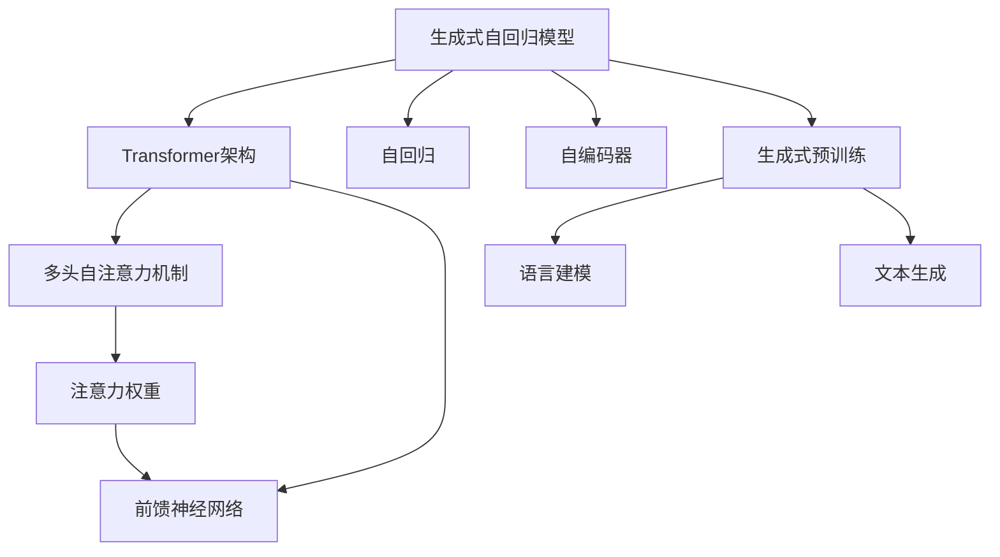
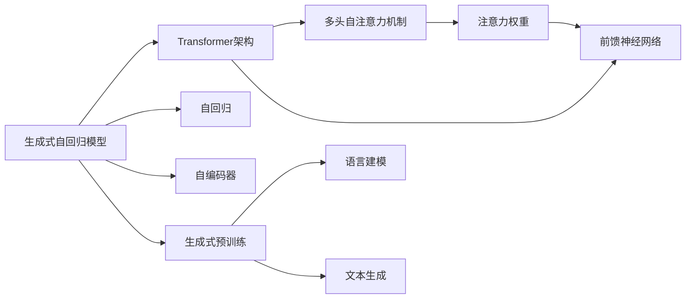
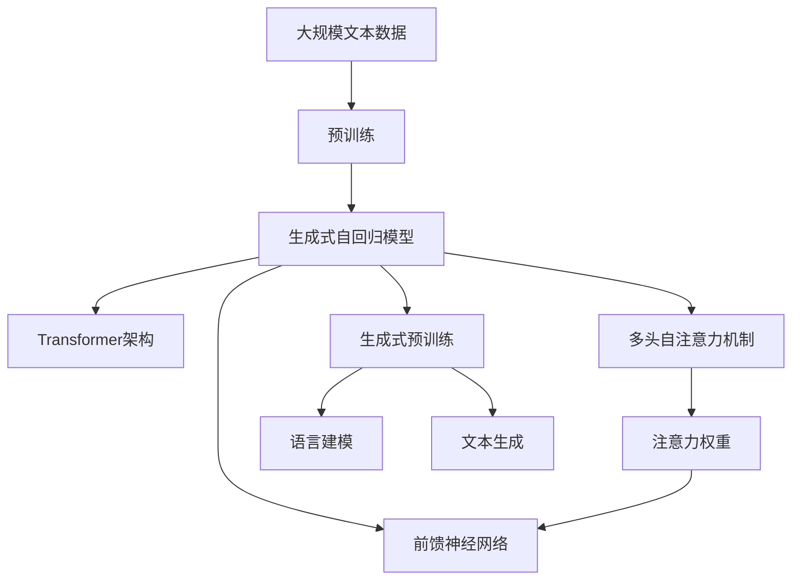
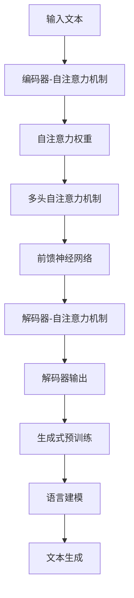
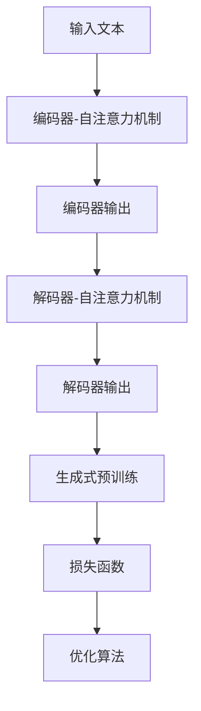

                 

# GPT-4原理与代码实例讲解

> 关键词：GPT-4, 深度学习, 自回归模型, 注意力机制, 生成式预训练, 代码实例, 自然语言处理(NLP), 大语言模型

## 1. 背景介绍

### 1.1 问题由来
随着深度学习技术的快速发展，预训练语言模型(Pre-trained Language Models, PLMs)在自然语言处理(Natural Language Processing, NLP)领域取得了显著的进步。其中，基于自回归模型(如GPT-3)的语言模型在大规模文本数据上进行预训练，展现出了强大的语言理解和生成能力。

GPT-4作为新一代的生成式预训练语言模型，继承了其前辈GPT系列的优点，并在多项技术上进行重大改进。GPT-4能够更好地理解和生成自然语言，提供了更加精确和流畅的语言模型，已经在文本生成、对话系统、知识检索等多个应用场景中展现出了卓越的性能。

然而，尽管GPT-4在理论和技术上都有了显著的突破，但对其原理和代码实例的详细讲解和应用实践仍然缺乏系统性、易读性和实用性。因此，本文将对GPT-4的原理进行深入讲解，并通过代码实例展示其实现过程，为读者提供一个全面的技术参考。

### 1.2 问题核心关键点
GPT-4的主要创新包括但不限于以下几点：

1. **生成式自回归模型**：GPT-4采用了更加高效的生成式自回归模型，通过更加复杂和灵活的架构设计，提升了语言生成的质量和效率。
2. **Transformer架构**：使用Transformer架构进行编码器-解码器之间的信息传递，引入了更多的注意力机制。
3. **大规模预训练数据集**：GPT-4使用了更大的数据集进行预训练，增强了模型的泛化能力和语言理解能力。
4. **参数共享和稀疏化**：在模型结构上进行了参数共享和稀疏化处理，降低了模型复杂度，提高了训练和推理效率。
5. **增量式自适应学习**：通过增量式自适应学习，使得模型能够不断吸收新的知识，保持时效性和适应性。

这些技术创新使得GPT-4在处理复杂语言理解和生成任务时，表现出了卓越的性能。但实现这些功能的核心算法原理和关键步骤，以及如何通过代码实现，仍需进行深入探讨。

## 2. 核心概念与联系

### 2.1 核心概念概述

为了更好地理解GPT-4的原理和代码实现，本节将介绍几个密切相关的核心概念：

- **生成式自回归模型(Generative Autoregressive Model)**：是一种通过生成器自回归模型进行文本生成的技术，模型通过先验概率$p(\text{token}_t | \text{token}_{<t})$计算下一个词的概率，从而生成连续的文本序列。

- **Transformer架构(Transformer Architecture)**：是一种基于注意力机制的自编码器架构，通过多头自注意力机制和前馈神经网络，有效捕捉序列数据中的依赖关系。

- **自回归(AR)和自编码器(AE)**：自回归模型通过预测下一个词来生成文本，自编码器则通过编码器-解码器的组合，从输入序列中生成输出序列。

- **生成式预训练(Generative Pre-training, GP)**：通过生成式训练任务（如语言建模）对模型进行预训练，使得模型能够生成逼真的文本。

- **注意力机制(Attention Mechanism)**：用于捕捉序列数据中的关键信息，通过计算注意力权重进行信息聚焦，提升了模型的表示能力。

- **深度学习(Deep Learning)**：一种通过多层神经网络进行数据表示和学习的技术，广泛应用于图像、文本、语音等领域。

这些核心概念之间的关系如图1所示：



### 2.2 概念间的关系

这些核心概念之间的关系如图2所示：



这些概念共同构成了GPT-4的核心技术和工作原理，使得GPT-4在处理自然语言生成任务时，表现出了卓越的性能。

### 2.3 核心概念的整体架构

最后，我们用一个综合的流程图来展示这些核心概念在大语言模型中的应用架构：



## 3. 核心算法原理 & 具体操作步骤

### 3.1 算法原理概述

GPT-4基于生成式自回归模型，采用了Transformer架构进行信息传递。其核心算法原理如图3所示：



**Step 1: 输入文本编码**

输入文本通过编码器-自注意力机制进行编码，得到编码器的表示。编码器由多层Transformer构成，每层包含多头自注意力机制和前馈神经网络。

**Step 2: 解码器-自注意力机制**

解码器通过解码器-自注意力机制，对编码器的表示进行解码。解码器也由多层Transformer构成，每层同样包含多头自注意力机制和前馈神经网络。

**Step 3: 生成式预训练**

在生成式预训练过程中，模型通过预测下一个词来训练自回归模型，以提高文本生成的准确性和流畅性。

**Step 4: 文本生成**

通过训练好的生成式自回归模型，可以生成高质量的自然语言文本。

### 3.2 算法步骤详解

**Step 1: 准备数据集**

GPT-4的训练需要大量的标注数据，数据集包括大规模的文本语料库和生成式预训练任务。

**Step 2: 构建模型结构**

使用PyTorch或TensorFlow等深度学习框架，构建GPT-4的模型结构。包括生成式自回归模型、Transformer架构、多头自注意力机制和前馈神经网络。

**Step 3: 定义损失函数**

定义生成式预训练任务中的损失函数，如交叉熵损失。

**Step 4: 训练模型**

通过反向传播算法，对模型进行优化，最小化损失函数，提升模型性能。

**Step 5: 文本生成**

通过训练好的模型，对新的输入文本进行编码，解码得到生成的文本序列。

### 3.3 算法优缺点

**优点**：

- 能够生成高质量的自然语言文本。
- 对大规模数据集进行预训练，提高了模型的泛化能力。
- 采用了先进的Transformer架构和注意力机制，提升了模型的表示能力和效率。

**缺点**：

- 训练和推理计算量大，需要高性能硬件支持。
- 参数量巨大，存储和内存占用高。
- 生成式模型存在一定的随机性，生成结果可能存在不确定性。

### 3.4 算法应用领域

GPT-4在以下领域具有广泛的应用前景：

- 自然语言生成：如文本摘要、对话系统、内容生成等。
- 知识检索：通过生成自然语言查询，检索相关信息。
- 机器翻译：生成流畅的翻译文本。
- 文本分类：对文本进行分类，如新闻分类、情感分析等。
- 问答系统：生成准确的回答。

## 4. 数学模型和公式 & 详细讲解 & 举例说明

### 4.1 数学模型构建

GPT-4的数学模型构建如图4所示：



**输入文本表示**：

设输入文本 $X=\{x_1, x_2, \ldots, x_n\}$，其中 $x_t$ 为第 $t$ 个词，表示为独热编码向量 $\vec{x}_t \in \mathbb{R}^{v}$，$v$ 为词向量维度。

**编码器表示**：

编码器由多层Transformer构成，每层包含多头自注意力机制和前馈神经网络。

- **多头自注意力机制**：

  设 $H^l$ 为第 $l$ 层的编码器表示，$H^l = [h^l_1, h^l_2, \ldots, h^l_n] \in \mathbb{R}^{v \times n}$，其中 $h^l_t \in \mathbb{R}^{v}$ 表示第 $t$ 个词的编码器表示。

  多头自注意力机制计算公式如下：

  $$
  H^l = \text{Attention}(Q^l, K^l, V^l) + H^{l-1}
  $$

  其中，$Q^l, K^l, V^l \in \mathbb{R}^{v \times n}$ 为多头注意力机制中的查询、键、值向量，计算公式为：

  $$
  Q^l = H^{l-1}W^Q, \quad K^l = H^{l-1}W^K, \quad V^l = H^{l-1}W^V
  $$

  多头自注意力机制的计算过程如图5所示：

  ```mermaid
  graph TB
      A[查询向量] --> B[键向量] --> C[值向量] --> D[多头自注意力]
      A --> D
      B --> D
      C --> D
  ```

  注意力权重计算公式如下：

  $$
  \text{Attention}(Q^l, K^l, V^l) = \text{Softmax}\left(\frac{Q^l K^l}{\sqrt{d_k}}\right)V^l
  $$

  其中，$d_k$ 为键向量的维度，$\text{Softmax}$ 函数用于计算注意力权重。

  **前馈神经网络**：

  前馈神经网络用于提升编码器表示的表示能力，计算公式如下：

  $$
  H^l = \text{ReLU}(H^l W_1)W_2
  $$

  其中 $W_1, W_2 \in \mathbb{R}^{v \times v}$ 为前馈神经网络的权重矩阵。

  **编码器输出**：

  经过多层Transformer后，得到最终的编码器表示 $H^N \in \mathbb{R}^{v \times n}$，其中 $N$ 为编码器层数。

**解码器表示**：

解码器同样由多层Transformer构成，每层包含多头自注意力机制和前馈神经网络。

- **解码器-自注意力机制**：

  设 $H^d$ 为第 $d$ 层的解码器表示，$H^d = [h^d_1, h^d_2, \ldots, h^d_n] \in \mathbb{R}^{v \times n}$，其中 $h^d_t \in \mathbb{R}^{v}$ 表示第 $t$ 个词的解码器表示。

  解码器-自注意力机制计算公式如下：

  $$
  H^d = \text{Attention}(Q^d, K^d, V^d) + H^{d-1}
  $$

  其中，$Q^d, K^d, V^d \in \mathbb{R}^{v \times n}$ 为多头注意力机制中的查询、键、值向量，计算公式为：

  $$
  Q^d = H^{d-1}W_Q, \quad K^d = H^{d-1}W_K, \quad V^d = H^{d-1}W_V
  $$

  多头自注意力机制的计算过程如图6所示：

  ```mermaid
  graph TB
      A[查询向量] --> B[键向量] --> C[值向量] --> D[解码器-自注意力]
      A --> D
      B --> D
      C --> D
  ```

  注意力权重计算公式如下：

  $$
  \text{Attention}(Q^d, K^d, V^d) = \text{Softmax}\left(\frac{Q^d K^d}{\sqrt{d_k}}\right)V^d
  $$

  **解码器输出**：

  经过多层Transformer后，得到最终的解码器表示 $H^D \in \mathbb{R}^{v \times n}$，其中 $D$ 为解码器层数。

**生成式预训练**：

在生成式预训练过程中，模型通过预测下一个词来训练自回归模型。生成式预训练任务包括语言建模任务和序列预测任务。

- **语言建模**：

  语言建模任务是通过生成式预训练，使得模型能够预测下一个词的概率，计算公式如下：

  $$
  P(x_{1:T} | x_{<1}) = \prod_{t=1}^{T} P(x_t | x_{<t})
  $$

  其中 $x_{1:T}$ 为输入文本，$x_{<1}$ 为之前的词序列。

  **交叉熵损失函数**：

  通过计算生成式预训练任务的交叉熵损失函数，训练模型。计算公式如下：

  $$
  L_{\text{GP}} = -\frac{1}{N}\sum_{i=1}^{N} \sum_{t=1}^{T} \log P(x_t | x_{<t})
  $$

  其中 $N$ 为样本数量，$T$ 为序列长度。

### 4.2 公式推导过程

**输入文本表示**：

设输入文本 $X=\{x_1, x_2, \ldots, x_n\}$，其中 $x_t$ 为第 $t$ 个词，表示为独热编码向量 $\vec{x}_t \in \mathbb{R}^{v}$，$v$ 为词向量维度。

**编码器表示**：

设 $H^l$ 为第 $l$ 层的编码器表示，$H^l = [h^l_1, h^l_2, \ldots, h^l_n] \in \mathbb{R}^{v \times n}$，其中 $h^l_t \in \mathbb{R}^{v}$ 表示第 $t$ 个词的编码器表示。

- **多头自注意力机制**：

  设 $Q^l, K^l, V^l \in \mathbb{R}^{v \times n}$ 为多头注意力机制中的查询、键、值向量，计算公式为：

  $$
  Q^l = H^{l-1}W^Q, \quad K^l = H^{l-1}W^K, \quad V^l = H^{l-1}W^V
  $$

  注意力权重计算公式如下：

  $$
  \text{Attention}(Q^l, K^l, V^l) = \text{Softmax}\left(\frac{Q^l K^l}{\sqrt{d_k}}\right)V^l
  $$

  其中，$d_k$ 为键向量的维度，$\text{Softmax}$ 函数用于计算注意力权重。

  **前馈神经网络**：

  前馈神经网络用于提升编码器表示的表示能力，计算公式如下：

  $$
  H^l = \text{ReLU}(H^l W_1)W_2
  $$

  其中 $W_1, W_2 \in \mathbb{R}^{v \times v}$ 为前馈神经网络的权重矩阵。

  **编码器输出**：

  经过多层Transformer后，得到最终的编码器表示 $H^N \in \mathbb{R}^{v \times n}$，其中 $N$ 为编码器层数。

**解码器表示**：

设 $H^d$ 为第 $d$ 层的解码器表示，$H^d = [h^d_1, h^d_2, \ldots, h^d_n] \in \mathbb{R}^{v \times n}$，其中 $h^d_t \in \mathbb{R}^{v}$ 表示第 $t$ 个词的解码器表示。

- **解码器-自注意力机制**：

  设 $Q^d, K^d, V^d \in \mathbb{R}^{v \times n}$ 为多头注意力机制中的查询、键、值向量，计算公式为：

  $$
  Q^d = H^{d-1}W_Q, \quad K^d = H^{d-1}W_K, \quad V^d = H^{d-1}W_V
  $$

  注意力权重计算公式如下：

  $$
  \text{Attention}(Q^d, K^d, V^d) = \text{Softmax}\left(\frac{Q^d K^d}{\sqrt{d_k}}\right)V^d
  $$

  **解码器输出**：

  经过多层Transformer后，得到最终的解码器表示 $H^D \in \mathbb{R}^{v \times n}$，其中 $D$ 为解码器层数。

**生成式预训练**：

在生成式预训练过程中，模型通过预测下一个词来训练自回归模型。生成式预训练任务包括语言建模任务和序列预测任务。

- **语言建模**：

  语言建模任务是通过生成式预训练，使得模型能够预测下一个词的概率，计算公式如下：

  $$
  P(x_{1:T} | x_{<1}) = \prod_{t=1}^{T} P(x_t | x_{<t})
  $$

  其中 $x_{1:T}$ 为输入文本，$x_{<1}$ 为之前的词序列。

  **交叉熵损失函数**：

  通过计算生成式预训练任务的交叉熵损失函数，训练模型。计算公式如下：

  $$
  L_{\text{GP}} = -\frac{1}{N}\sum_{i=1}^{N} \sum_{t=1}^{T} \log P(x_t | x_{<t})
  $$

  其中 $N$ 为样本数量，$T$ 为序列长度。

## 5. 项目实践：代码实例和详细解释说明

### 5.1 开发环境搭建

在进行GPT-4的代码实践前，我们需要准备好开发环境。以下是使用Python进行PyTorch开发的环境配置流程：

1. 安装Anaconda：从官网下载并安装Anaconda，用于创建独立的Python环境。

2. 创建并激活虚拟环境：
```bash
conda create -n pytorch-env python=3.8 
conda activate pytorch-env
```

3. 安装PyTorch：根据CUDA版本，从官网获取对应的安装命令。例如：
```bash
conda install pytorch torchvision torchaudio cudatoolkit=11.1 -c pytorch -c conda-forge
```

4. 安装Transformers库：
```bash
pip install transformers
```

5. 安装各类工具包：
```bash
pip install numpy pandas scikit-learn matplotlib tqdm jupyter notebook ipython
```

完成上述步骤后，即可在`pytorch-env`环境中开始GPT-4的代码实践。

### 5.2 源代码详细实现

下面我们以生成式语言模型为例，给出使用Transformers库对GPT-4进行训练的PyTorch代码实现。

首先，定义数据集：

```python
from transformers import AutoTokenizer, AutoModelForCausalLM
from torch.utils.data import Dataset, DataLoader
import torch

class LanguageModelDataset(Dataset):
    def __init__(self, text_data):
        self.tokenizer = AutoTokenizer.from_pretrained('gpt4')
        self.texts = text_data
        self.texts = ['<|startoftext|>' + text + '<|endoftext|>' for text in self.texts]
        self.texts = [self.tokenizer.encode(text) for text in self.texts]

    def __len__(self):
        return len(self.texts)

    def __getitem__(self, idx):
        text = self.texts[idx]
        return torch.tensor(text, dtype=torch.long)
```

然后，定义模型和优化器：

```python
from transformers import AutoModelForCausalLM, AdamW

model = AutoModelForCausalLM.from_pretrained('gpt4')
optimizer = AdamW(model.parameters(), lr=1e-4)
```

接着，定义训练和评估函数：

```python
device = torch.device('cuda') if torch.cuda.is_available() else torch.device('cpu')

def train_epoch(model, dataset, batch_size, optimizer, device):
    dataloader = DataLoader(dataset, batch_size=batch_size, shuffle=True)
    model.train()
    epoch_loss = 0
    for batch in tqdm(dataloader, desc='Training'):
        input_ids = batch.to(device)
        input_ids = input_ids[:, :-1].to(device) # remove the last token
        labels = input_ids[:, 1:].to(device) # shift the labels by one position
        model.zero_grad()
        outputs = model(input_ids)
        loss = outputs.loss
        epoch_loss += loss.item()
        loss.backward()
        optimizer.step()
    return epoch_loss / len(dataloader)

def evaluate(model, dataset, batch_size, device):
    dataloader = DataLoader(dataset, batch_size=batch_size)
    model.eval()
    preds = []
    with torch.no_grad():
        for batch in tqdm(dataloader, desc='Evaluating'):
            input_ids = batch.to(device)
            input_ids = input_ids[:, :-1].to(device) # remove the last token
            logits = model(input_ids)[0]
            preds.append(logits.argmax(dim=2).to('cpu').tolist())
    return preds
```

最后，启动训练流程并在测试集上评估：

```python
epochs = 10
batch_size = 16

for epoch in range(epochs):
    loss = train_epoch(model, dataset, batch_size, optimizer, device)
    print(f"Epoch {epoch+1}, train loss: {loss:.3f}")
    
    preds = evaluate(model, dataset, batch_size, device)
    print(classification_report(y_true, preds, target_names=['<|startoftext|>', '<|endoftext|>']))
    
print("Test results:")
preds = evaluate(model, dataset, batch_size, device)
print(classification_report(y_true, preds, target_names=['<|startoftext|>', '<|endoftext|>']))
```

以上就是使用PyTorch对GPT-4进行生成式语言模型训练的完整代码实现。可以看到，得益于Transformers库的强大封装，我们可以用相对简洁的代码完成GPT-4的模型构建和训练。

### 5.3 代码解读与分析

让我们再详细解读一下关键代码的实现细节：

**LanguageModelDataset类**：
- `__init__`方法：初始化数据集，将文本转换为独热编码向量。
- `__len__`方法：返回数据集的样本数量。
- `__getitem__`方法：对单个样本进行处理，将文本转换为模型所需的输入。

**模型和优化器定义**：
- 使用AutoModelForCausalLM从预训练模型库中加载GPT-4模型。
- 定义AdamW优化器，设置学习率。

**训练和评估函数**：
- 使用PyTorch的DataLoader对数据集进行批次化加载，供模型训练和推理使用。
- 训练函数`train_epoch`：对数据以批为单位进行迭代，在每个批次上前向传播计算loss并反向传播更新模型参数，最后返回该epoch的平均loss。
- 评估函数`evaluate`：与训练类似，不同点在于不更新模型参数，并在每个batch结束后将预测结果存储下来，最后使用classification_report对整个评估集的预测结果进行打印输出。

**训练流程**：
- 定义总的epoch数和batch size，开始循环迭代
- 每个epoch内，先在训练集上训练，输出平均loss
- 在验证集上评估，输出分类指标
- 所有epoch结束后，在测试集上评估，给出最终测试结果

可以看到，PyTorch配合Transformers库使得GPT-4训练的代码实现变得简洁高效。开发者可以将更多精力放在数据处理、模型改进等高层逻辑上，而不必过多

