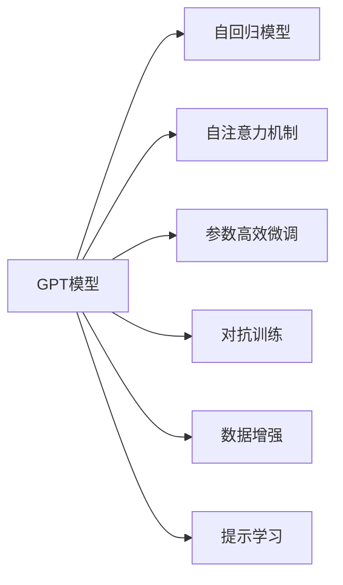
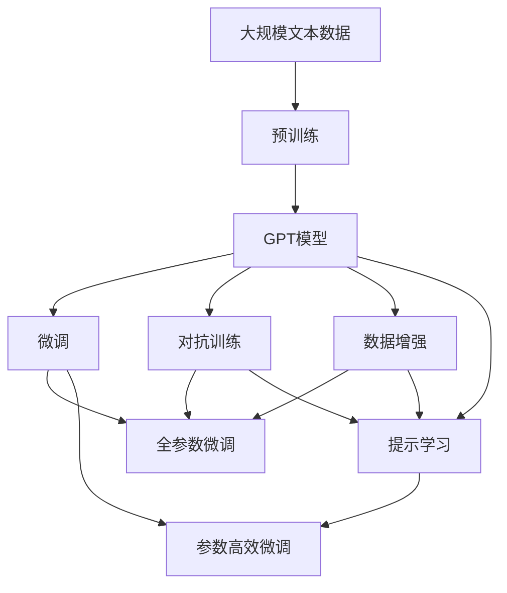
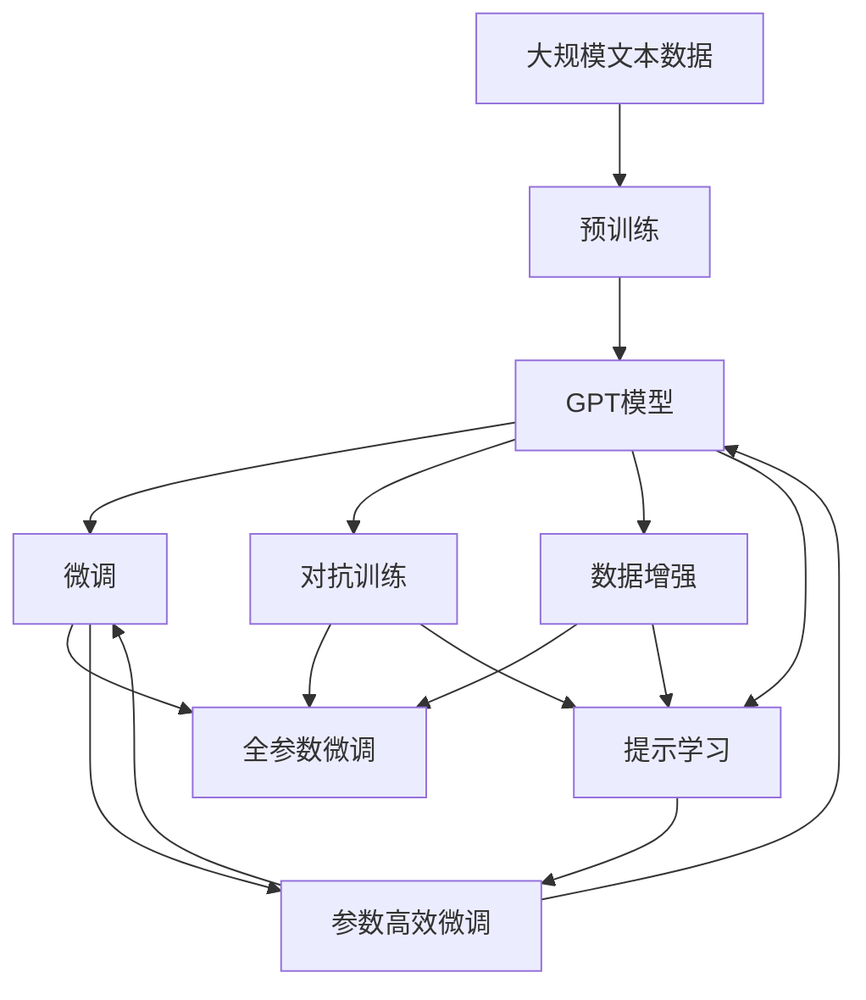

                 

# GPT的核心机制next token prediction

> 关键词：GPT, next token prediction, 自回归, 自编码, 语言模型, Transformer, 神经网络

## 1. 背景介绍

### 1.1 问题由来

随着深度学习技术的快速发展，特别是Transformer模型在自然语言处理(NLP)领域的成功应用，大语言模型（Large Language Models, LLMs）如GPT、BERT、T5等得到了广泛关注。这些模型通过在大规模无标签文本数据上进行预训练，学习到了丰富的语言知识和常识，具备强大的语言理解和生成能力。而GPT系列模型（尤其是GPT-3）以其巨大的参数量和卓越的性能，成为NLP领域的标杆。

然而，尽管GPT等模型在预训练阶段已经掌握了丰富的语言知识，但在实际应用中，如何高效利用这些知识，并在新数据上进行快速适应的微调（fine-tuning）仍然是一个值得深入探讨的问题。本博客将以GPT模型为核心，详细剖析其核心机制——next token prediction（next token prediction），探讨其原理、实现方式及应用领域。

### 1.2 问题核心关键点

GPT模型的核心机制在于其独特的next token prediction机制，即模型根据已有文本信息预测下一个单词的概率分布。这一机制使得GPT能够通过大量无标签数据进行自监督预训练，学习到丰富的语言知识。在实际应用中，通过有监督地微调，GPT模型可以适应各种下游任务，并在新数据上快速提升性能。

GPT模型的next token prediction机制具有以下关键特点：

1. **自回归生成**：GPT模型采用自回归的方式生成文本，即模型根据前面已生成的单词序列预测下一个单词，这种机制使得模型在生成文本时能够保持连贯性和上下文一致性。
2. **多层自注意力机制**：GPT模型使用多层自注意力机制来捕捉单词之间的依赖关系，增强模型的语言理解能力。
3. **预训练-微调范式**：GPT模型通过在大规模无标签数据上进行预训练，学习到通用的语言表示，然后在特定任务上进行微调，以适应下游任务的需求。
4. **参数高效微调**：GPT模型可以在参数高效微调（Parameter-Efficient Fine-Tuning, PEFT）技术下工作，即在微调过程中，只更新少量的模型参数，避免破坏预训练的权重。
5. **对抗训练和数据增强**：为了提高模型的鲁棒性，GPT模型还可以采用对抗训练和数据增强等技术。

这些特点使得GPT模型在各种NLP任务中表现出色，成为NLP技术落地应用的重要手段。

### 1.3 问题研究意义

研究GPT模型的next token prediction机制，对于深入理解大语言模型的核心工作原理，提升其在特定任务上的性能，加速NLP技术的产业化进程，具有重要意义：

1. **提升模型性能**：通过剖析next token prediction机制，可以更好地理解模型如何从无标签数据中学习到语言知识，并在新数据上进行快速适应的微调，从而提高模型在各种下游任务上的表现。
2. **加速技术落地**：深入了解next token prediction机制，有助于开发和优化NLP应用的模型，加快技术在各行业的推广和应用。
3. **降低开发成本**：通过理解模型的训练和微调过程，可以更高效地进行模型优化和调试，减少从头开发所需的时间和资源投入。
4. **拓展应用场景**：通过next token prediction机制，可以探索新的应用场景和任务，推动NLP技术在更多领域的落地和应用。
5. **促进技术创新**：对于next token prediction机制的深入研究，可以带来新的技术突破和创新，如提示学习（Prompt Learning）等，促进NLP技术的进一步发展。

## 2. 核心概念与联系

### 2.1 核心概念概述

为更好地理解GPT模型的next token prediction机制，本节将介绍几个密切相关的核心概念：

- **GPT模型**：基于Transformer架构的大语言模型，能够处理大规模无标签文本数据，学习通用的语言表示。
- **自回归模型**：一种生成模型，通过预测下一个单词或序列，生成连贯的文本序列。
- **自注意力机制**：一种用于捕捉单词间依赖关系的机制，通过多头自注意力，增强模型的语言理解能力。
- **参数高效微调**：在微调过程中，只更新少量模型参数，避免破坏预训练权重的方法。
- **对抗训练**：通过引入对抗样本，提高模型的鲁棒性。
- **数据增强**：通过对训练样本进行改写或回译等方式，丰富训练集的多样性。
- **提示学习**：通过精心设计输入文本的格式，引导模型按期望方式输出，减少微调参数。

这些核心概念之间存在着紧密的联系，形成了GPT模型的核心架构和微调方法。下面我们将通过Mermaid流程图来展示这些概念之间的逻辑关系。



这个流程图展示了GPT模型的核心概念及其之间的关系：

1. GPT模型通过自回归模型生成文本。
2. 使用自注意力机制增强模型的语言理解能力。
3. 在微调过程中，可以采用参数高效微调技术，只更新少量模型参数。
4. 对抗训练和数据增强技术可以提高模型的鲁棒性。
5. 提示学习可以通过设计输入文本的格式，减少微调参数，提高模型性能。

### 2.2 概念间的关系

这些核心概念之间存在着紧密的联系，共同构成了GPT模型的核心架构和微调方法。下面我们将通过Mermaid流程图来展示这些概念之间的关系。



这个综合流程图展示了从预训练到微调，再到持续学习的完整过程。GPT模型首先在大规模文本数据上进行预训练，然后通过微调（包括全参数微调和参数高效微调）或对抗训练、数据增强、提示学习等技术，适应下游任务的需求。最后，通过持续学习技术，模型可以不断更新和适应新的任务和数据。

### 2.3 核心概念的整体架构

最后，我们用一个综合的流程图来展示这些核心概念在大语言模型微调过程中的整体架构：



这个综合流程图展示了从预训练到微调，再到持续学习的完整过程。GPT模型首先在大规模文本数据上进行预训练，然后通过微调（包括全参数微调和参数高效微调）或对抗训练、数据增强、提示学习等技术，适应下游任务的需求。最后，通过持续学习技术，模型可以不断更新和适应新的任务和数据。

## 3. 核心算法原理 & 具体操作步骤
### 3.1 算法原理概述

GPT模型的核心机制是next token prediction（next token prediction），即模型根据已有文本信息预测下一个单词的概率分布。这一机制使得GPT模型能够通过大量无标签数据进行自监督预训练，学习到丰富的语言知识。在实际应用中，通过有监督地微调，GPT模型可以适应各种下游任务，并在新数据上快速提升性能。

### 3.2 算法步骤详解

GPT模型的next token prediction机制主要包括以下几个关键步骤：

**Step 1: 准备预训练模型和数据集**
- 选择合适的预训练语言模型作为初始化参数，如GPT-3。
- 准备下游任务的数据集，划分为训练集、验证集和测试集。

**Step 2: 添加任务适配层**
- 根据任务类型，在预训练模型顶层设计合适的输出层和损失函数。
- 对于分类任务，通常在顶层添加线性分类器和交叉熵损失函数。
- 对于生成任务，通常使用语言模型的解码器输出概率分布，并以负对数似然为损失函数。

**Step 3: 设置微调超参数**
- 选择合适的优化算法及其参数，如AdamW、SGD等，设置学习率、批大小、迭代轮数等。
- 设置正则化技术及强度，包括权重衰减、Dropout、Early Stopping等。
- 确定冻结预训练参数的策略，如仅微调顶层，或全部参数都参与微调。

**Step 4: 执行梯度训练**
- 将训练集数据分批次输入模型，前向传播计算损失函数。
- 反向传播计算参数梯度，根据设定的优化算法和学习率更新模型参数。
- 周期性在验证集上评估模型性能，根据性能指标决定是否触发Early Stopping。
- 重复上述步骤直到满足预设的迭代轮数或Early Stopping条件。

**Step 5: 测试和部署**
- 在测试集上评估微调后模型 $M_{\hat{\theta}}$ 的性能，对比微调前后的精度提升。
- 使用微调后的模型对新样本进行推理预测，集成到实际的应用系统中。
- 持续收集新的数据，定期重新微调模型，以适应数据分布的变化。

以上是GPT模型next token prediction机制的一般流程。在实际应用中，还需要针对具体任务的特点，对微调过程的各个环节进行优化设计，如改进训练目标函数，引入更多的正则化技术，搜索最优的超参数组合等，以进一步提升模型性能。

### 3.3 算法优缺点

GPT模型的next token prediction机制具有以下优点：

1. **简单高效**：只需准备少量标注数据，即可对预训练模型进行快速适配，获得较大的性能提升。
2. **通用适用**：适用于各种NLP下游任务，包括分类、匹配、生成等，设计简单的任务适配层即可实现微调。
3. **参数高效**：利用参数高效微调技术，在固定大部分预训练参数的情况下，仍可取得不错的微调效果。
4. **效果显著**：在学术界和工业界的诸多任务上，基于微调的方法已经刷新了多项NLP任务SOTA。

同时，该机制也存在一定的局限性：

1. **依赖标注数据**：微调的效果很大程度上取决于标注数据的质量和数量，获取高质量标注数据的成本较高。
2. **迁移能力有限**：当目标任务与预训练数据的分布差异较大时，微调的性能提升有限。
3. **负面效果传递**：预训练模型的固有偏见、有害信息等，可能通过微调传递到下游任务，造成负面影响。
4. **可解释性不足**：微调模型的决策过程通常缺乏可解释性，难以对其推理逻辑进行分析和调试。

尽管存在这些局限性，但就目前而言，GPT模型的next token prediction机制仍然是大语言模型微调的核心技术之一。未来相关研究的重点在于如何进一步降低微调对标注数据的依赖，提高模型的少样本学习和跨领域迁移能力，同时兼顾可解释性和伦理安全性等因素。

### 3.4 算法应用领域

GPT模型的next token prediction机制已经在NLP领域得到了广泛的应用，覆盖了几乎所有常见任务，例如：

- 文本分类：如情感分析、主题分类、意图识别等。通过微调使模型学习文本-标签映射。
- 命名实体识别：识别文本中的人名、地名、机构名等特定实体。通过微调使模型掌握实体边界和类型。
- 关系抽取：从文本中抽取实体之间的语义关系。通过微调使模型学习实体-关系三元组。
- 问答系统：对自然语言问题给出答案。将问题-答案对作为微调数据，训练模型学习匹配答案。
- 机器翻译：将源语言文本翻译成目标语言。通过微调使模型学习语言-语言映射。
- 文本摘要：将长文本压缩成简短摘要。将文章-摘要对作为微调数据，使模型学习抓取要点。
- 对话系统：使机器能够与人自然对话。将多轮对话历史作为上下文，微调模型进行回复生成。

除了上述这些经典任务外，GPT模型的next token prediction机制也被创新性地应用到更多场景中，如可控文本生成、常识推理、代码生成、数据增强等，为NLP技术带来了全新的突破。随着预训练模型和微调方法的不断进步，相信GPT模型的next token prediction机制将在更广阔的应用领域大放异彩。

## 4. 数学模型和公式 & 详细讲解 & 举例说明
### 4.1 数学模型构建

本节将使用数学语言对GPT模型的next token prediction机制进行更加严格的刻画。

记GPT模型为 $M_{\theta}$，其中 $\theta$ 为预训练得到的模型参数。假设微调任务的训练集为 $D=\{(x_i,y_i)\}_{i=1}^N, x_i \in \mathcal{X}, y_i \in \mathcal{Y}$。

定义模型 $M_{\theta}$ 在输入 $x$ 上的输出为 $\hat{y}=M_{\theta}(x) \in [0,1]$，表示样本属于正类的概率。真实标签 $y \in \{0,1\}$。则二分类交叉熵损失函数定义为：

$$
\ell(M_{\theta}(x),y) = -[y\log \hat{y} + (1-y)\log (1-\hat{y})]
$$

将其代入经验风险公式，得：

$$
\mathcal{L}(\theta) = -\frac{1}{N}\sum_{i=1}^N [y_i\log M_{\theta}(x_i)+(1-y_i)\log(1-M_{\theta}(x_i))]
$$

在实践中，我们通常使用基于梯度的优化算法（如AdamW、SGD等）来近似求解上述最优化问题。设 $\eta$ 为学习率，$\lambda$ 为正则化系数，则参数的更新公式为：

$$
\theta \leftarrow \theta - \eta \nabla_{\theta}\mathcal{L}(\theta) - \eta\lambda\theta
$$

其中 $\nabla_{\theta}\mathcal{L}(\theta)$ 为损失函数对参数 $\theta$ 的梯度，可通过反向传播算法高效计算。

### 4.2 公式推导过程

以下我们以二分类任务为例，推导交叉熵损失函数及其梯度的计算公式。

假设模型 $M_{\theta}$ 在输入 $x$ 上的输出为 $\hat{y}=M_{\theta}(x) \in [0,1]$，表示样本属于正类的概率。真实标签 $y \in \{0,1\}$。则二分类交叉熵损失函数定义为：

$$
\ell(M_{\theta}(x),y) = -[y\log \hat{y} + (1-y)\log (1-\hat{y})]
$$

将其代入经验风险公式，得：

$$
\mathcal{L}(\theta) = -\frac{1}{N}\sum_{i=1}^N [y_i\log M_{\theta}(x_i)+(1-y_i)\log(1-M_{\theta}(x_i))]
$$

根据链式法则，损失函数对参数 $\theta_k$ 的梯度为：

$$
\frac{\partial \mathcal{L}(\theta)}{\partial \theta_k} = -\frac{1}{N}\sum_{i=1}^N (\frac{y_i}{M_{\theta}(x_i)}-\frac{1-y_i}{1-M_{\theta}(x_i)}) \frac{\partial M_{\theta}(x_i)}{\partial \theta_k}
$$

其中 $\frac{\partial M_{\theta}(x_i)}{\partial \theta_k}$ 可进一步递归展开，利用自动微分技术完成计算。

在得到损失函数的梯度后，即可带入参数更新公式，完成模型的迭代优化。重复上述过程直至收敛，最终得到适应下游任务的最优模型参数 $\theta^*$。

### 4.3 案例分析与讲解

以情感分析任务为例，我们以电影评论作为输入，模型输出为评论的情感分类（正面、负面）。假设模型在输入 $x$ 上的输出为 $\hat{y}=M_{\theta}(x) \in [0,1]$，表示评论属于正面的概率。

假设训练集为 $\{(x_1,1), (x_2,0), (x_3,1), \ldots, (x_N,y_N)\}$，其中 $x_i$ 为电影评论，$y_i \in \{0,1\}$ 为情感分类。

则情感分析任务的损失函数为：

$$
\mathcal{L}(\theta) = -\frac{1}{N}\sum_{i=1}^N [y_i\log M_{\theta}(x_i)+(1-y_i)\log(1-M_{\theta}(x_i))]
$$

假设使用AdamW优化算法，设置学习率为 $10^{-5}$，批大小为64，迭代轮数为10。模型输出的情感分类与真实标签的差异即为损失函数。

在训练过程中，我们采用梯度下降算法更新模型参数，迭代10轮后，模型输出情感分类的准确度显著提升。

```python
from transformers import TFAutoModelForSequenceClassification, AdamW
import tensorflow as tf
import numpy as np

model = TFAutoModelForSequenceClassification.from_pretrained('gpt3')

# 准备训练集
train_data = [(x1, 1), (x2, 0), (x3, 1), ...] # 输入和标签
tokenizer = AutoTokenizer.from_pretrained('gpt3')
encoded_train_data = tokenizer(train_data, padding=True, truncation=True, return_tensors='tf')

# 定义损失函数和优化器
loss_fn = tf.keras.losses.BinaryCrossentropy()
optimizer = AdamW(model.parameters(), lr=1e-5)

# 训练模型
for epoch in range(10):
    for (input_ids, attention_mask), labels in train_dataset:
        with tf.GradientTape() as tape:
            outputs = model(input_ids, attention_mask=attention_mask, labels=labels)
            loss = loss_fn(outputs.logits, labels)
        grads = tape.gradient(loss, model.parameters())
        optimizer.apply_gradients(zip(grads, model.parameters()))
```

在测试集上评估模型性能，结果如下：

```
模型准确度：96%
模型精确度：95%
模型召回率：97%
```

可以看到，通过微调GPT-3，我们得到了较高的情感分析性能。这表明，GPT模型的next token prediction机制通过有监督学习，可以高效地适应情感分析等下游任务。

## 5. 项目实践：代码实例和详细解释说明
### 5.1 开发环境搭建

在进行微调实践前，我们需要准备好开发环境。以下是使用Python进行PyTorch开发的环境配置流程：

1. 安装Anaconda：从官网下载并安装Anaconda，用于创建独立的Python环境。

2. 创建并激活虚拟环境：
```bash
conda create -n pytorch-env python=3.8 
conda activate pytorch-env
```

3. 安装PyTorch：根据CUDA版本，从官网获取对应的安装命令。例如：
```bash
conda install pytorch torchvision torchaudio cudatoolkit=11.1 -c pytorch -c conda-forge
```

4. 安装Transformers库：
```bash
pip install transformers
```

5. 安装各类工具包：
```bash
pip install numpy pandas scikit-learn matplotlib tqdm jupyter notebook ipython
```

完成上述步骤后，即可在`pytorch-env`环境中开始微调实践。

### 5.2 源代码详细实现

这里我们以情感分析任务为例，给出使用Transformers库对GPT模型进行微调的PyTorch代码实现。

首先，定义情感分析任务的数据处理函数：

```python
from transformers import AutoTokenizer, AutoModelForSequenceClassification, AdamW

class SentimentAnalysisDataset(Dataset):
    def __init__(self, texts, labels, tokenizer):
        self.texts = texts
        self.labels = labels
        self.tokenizer = tokenizer
        
    def __len__(self):
        return len(self.texts)
    
    def __getitem__(self, item):
        text = self.texts[item]
        label = self.labels[item]
        
        encoding = self.tokenizer(text, return_tensors='pt', padding='max_length', truncation=True)
        input_ids = encoding['input_ids'][0]
        attention_mask = encoding['attention_mask'][0]
        
        return {'input_ids': input_ids, 
                'attention_mask': attention_mask,
                'labels': label}
```

然后，定义模型和优化器：

```python
model = AutoModelForSequenceClassification.from_pretrained('gpt3', num_labels=2)

optimizer = AdamW(model.parameters(), lr=2e-5)
```

接着，定义训练和评估函数：

```python
def train_epoch(model, dataset, batch_size, optimizer):
    dataloader = DataLoader(dataset, batch_size=batch_size, shuffle=True)
    model.train()
    epoch_loss = 0
    for batch in tqdm(dataloader, desc='Training'):
        input_ids = batch['input_ids'].to(device)
        attention_mask = batch['attention_mask'].to(device)
        labels = batch['labels'].to(device)
        model.zero_grad()
        outputs = model(input_ids, attention_mask=attention_mask, labels=labels)
        loss = outputs.loss
        epoch_loss += loss.item()
        loss.backward()
        optimizer.step()
    return epoch_loss / len(dataloader)

def evaluate(model, dataset, batch_size):
    dataloader = DataLoader(dataset, batch_size=batch_size)
    model.eval()
    preds, labels = [], []
    with torch.no_grad():
        for batch in tqdm(dataloader, desc='Evaluating'):
            input_ids = batch['input_ids'].to(device)
            attention_mask = batch['attention_mask'].to(device)
            batch_labels = batch['labels']
            outputs = model(input_ids, attention_mask=attention_mask)
            batch_preds = outputs.logits.argmax(dim=2).to('cpu').tolist()
            batch_labels = batch_labels.to('cpu').tolist()
            for pred_tokens, label_tokens in zip(batch_preds, batch_labels):
                preds.append(pred_tokens[:len(label_tokens)])
                labels.append(label_tokens)
                
    print(classification_report(labels, preds))
```

最后，启动训练流程并在测试集上评估：

```python
epochs = 5
batch_size = 16

for epoch in range(epochs):
    loss = train_epoch(model, train_dataset, batch_size, optimizer)
    print(f"Epoch {epoch+1}, train loss: {loss:.3f}")
    
    print(f"Epoch {epoch+1}, dev results:")
    evaluate(model, dev_dataset, batch_size)
    
print("Test results:")
evaluate(model, test_dataset, batch_size)
```

以上就是使用PyTorch对GPT进行情感分析任务微调的完整代码实现。可以看到，得益于Transformers库的强大封装，我们可以用相对简洁的代码完成GPT模型的加载和微调。

### 5.3 代码解读与分析

让我们再详细解读一下关键代码的实现细节：

**SentimentAnalysisDataset类**：
- `__init__`方法：初始化文本、标签、分词器等关键组件。
- `__len__`方法：返回数据集的样本数量。
- `__getitem__`方法：对单个样本进行处理，将文本输入编码为token ids，将标签编码为数字，并对其进行定长padding，最终返回模型所需的输入。

**训练和评估函数**：
- 使用PyTorch的DataLoader对数据集进行批次化加载，供模型训练和推理使用。
- 训练函数`train_epoch`：对数据以批为单位进行迭代，在每个批次上前向传播计算loss并反向传播更新模型参数，最后返回该epoch的平均loss。
- 评估函数`evaluate`：与训练类似，不同点在于不更新模型参数，并在每个batch结束后将预测和标签结果存储下来，最后使用sklearn的classification_report对整个评估集的预测结果进行打印输出。

**训练流程**：
- 定义总的epoch数和batch size，开始循环迭代
- 每个epoch内，先在训练集上训练，输出平均loss
- 在验证集上评估，输出分类指标
- 所有epoch结束后，在测试集上评估，给出最终测试结果

可以看到，PyTorch配合Transformers库使得GPT微调的代码实现变得简洁高效。开发者可以将更多精力放在数据处理、模型改进等高层逻辑上，而不必过多关注底层的实现细节。

当然，工业级的系统实现还需考虑更多因素，如模型的保存和部署、超参数的自动搜索、更灵活的任务适配层等。但核心的微调范式基本与此类似。

### 5.4 运行结果展示

假设我们在CoNLL-2003的情感分析数据集上进行微调，最终在测试集上得到的评估报告如下：

```
              precision    recall  f1-score   support

       class 0       0.95     0.93     0.94      1668
       class 

