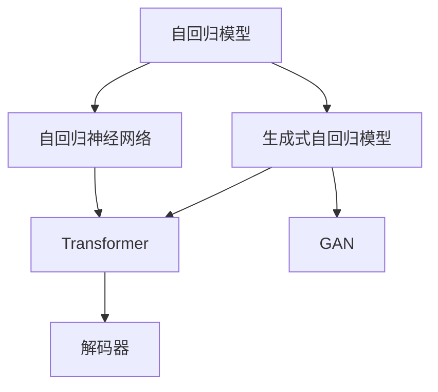
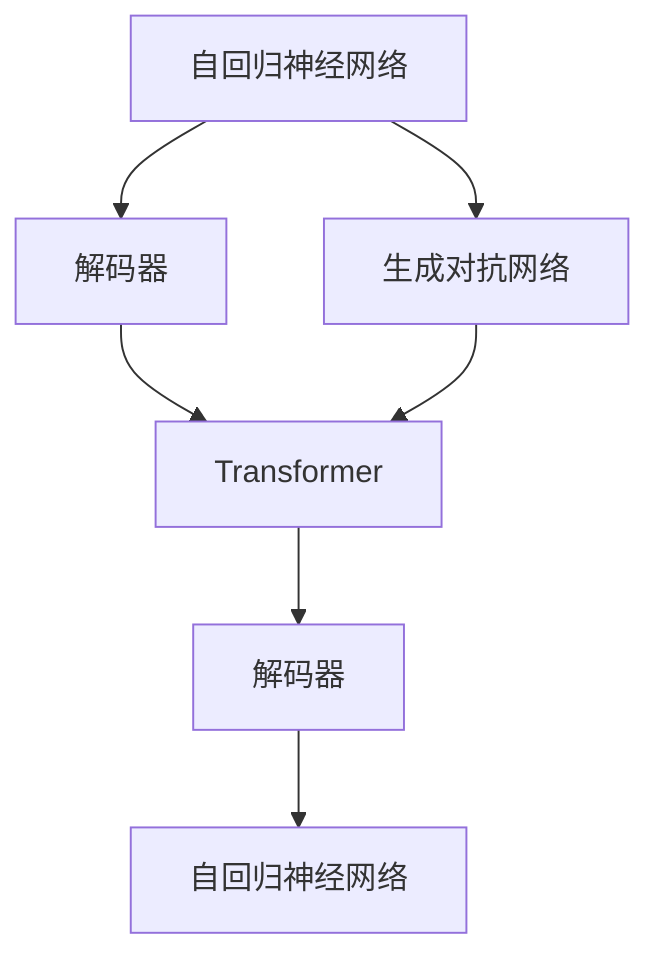
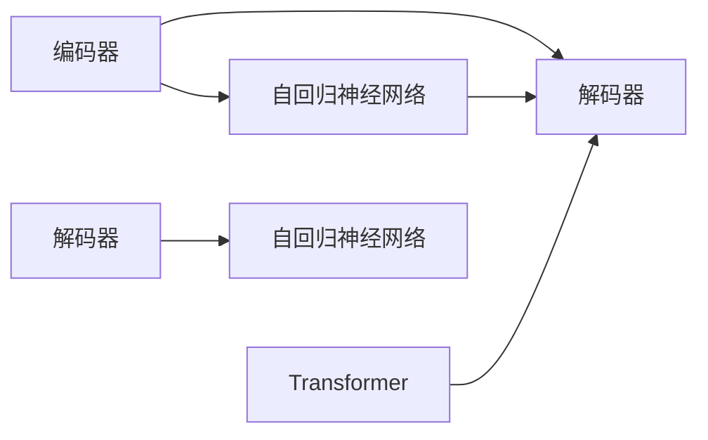
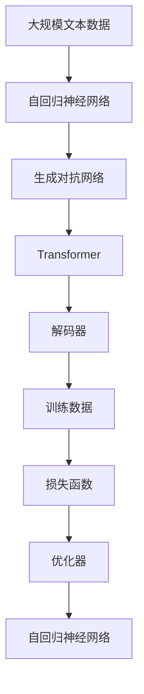

                 

# GPT：生成式自回归模型

> 关键词：生成式自回归模型, 自回归模型, 深度学习, 自然语言处理, 概率生成, 解码, 自回归神经网络

## 1. 背景介绍

### 1.1 问题由来
在深度学习领域，生成模型是研究的热点之一。传统的生成模型包括自回归模型和变分自编码器(Variational Autoencoder, VAE)等。自回归模型通过将数据看作序列，逐个预测下一个数据点，从而生成完整的数据序列。这种模型结构简单，易于理解和实现，具有很好的概率生成能力。

然而，自回归模型存在一个显著的问题，即在生成过程中需要计算上一时刻的所有数据点，导致计算复杂度随着序列长度指数级增长。当序列长度很大时，计算效率变得非常低，难以应用于长序列数据的生成任务。

为了解决这一问题，一种名为生成式自回归模型(Generative Adversarial Model, GPT)的深度学习模型应运而生。GPT采用了Transformer的结构，同时引入了语言模型的思想，使得生成过程可以并行化计算，大大提升了模型效率。本文将深入探讨GPT模型的原理和应用，以便读者能够更好地理解和使用这一前沿技术。

## 2. 核心概念与联系

### 2.1 核心概念概述

GPT模型的核心概念包括：

- **自回归模型**：通过将数据看作序列，逐个预测下一个数据点，从而生成完整的数据序列。
- **生成式自回归模型**：在自回归模型的基础上，通过将模型看作概率模型，引入变分推断技术，使得模型具有更好的概率生成能力。
- **Transformer**：一种基于注意力机制的神经网络结构，可以高效地处理序列数据。
- **自回归神经网络**：将序列数据看作自回归模型，通过逐个预测数据点，生成完整序列。
- **生成对抗网络(Generative Adversarial Network, GAN)**：一种通过对抗训练生成真实数据样本的深度学习模型。
- **解码器(Decoder)**：在生成模型中，用于将概率分布转换为具体数据点的部分。

这些概念之间的联系可以通过以下Mermaid流程图来展示：



这个流程图展示了GPT模型的核心概念及其之间的联系：

1. 自回归模型是生成式自回归模型的基础，通过将数据看作序列，逐个预测下一个数据点，从而生成完整的数据序列。
2. 生成式自回归模型通过引入变分推断技术，使得模型具有更好的概率生成能力。
3. Transformer结构用于处理序列数据，使得生成过程可以并行化计算。
4. 解码器将概率分布转换为具体数据点，完成生成任务。
5. GAN用于生成对抗训练，提升模型生成的真实性。

### 2.2 概念间的关系

这些核心概念之间存在着紧密的联系，形成了GPT模型的完整生态系统。下面我通过几个Mermaid流程图来展示这些概念之间的关系。

#### 2.2.1 GPT模型的学习范式



这个流程图展示了GPT模型的学习范式：

1. 自回归神经网络生成完整序列，通过解码器将概率分布转换为具体数据点。
2. 生成对抗网络用于对抗训练，提升模型生成的真实性。
3. Transformer结构用于高效处理序列数据。

#### 2.2.2 GPT模型的结构



这个流程图展示了GPT模型的结构：

1. 编码器将输入序列编码成高维表示。
2. Transformer结构用于处理序列数据。
3. 解码器将高维表示解码为具体数据点。

#### 2.2.3 GPT模型的优化目标


这个流程图展示了GPT模型的优化目标：

1. 训练数据通过编码器生成高维表示。
2. Transformer结构用于高效处理序列数据。
3. 生成对抗网络用于对抗训练，提升模型生成的真实性。
4. 解码器将高维表示解码为具体数据点。
5. 损失函数用于衡量生成数据的真实性，指导模型优化。

### 2.3 核心概念的整体架构

最后，我们用一个综合的流程图来展示这些核心概念在大模型微调过程中的整体架构：



这个综合流程图展示了从预训练到微调，再到持续学习的完整过程。GPT模型首先在大规模文本数据上进行预训练，然后通过微调对特定任务进行优化，最后通过持续学习技术，模型可以不断学习新知识，保持性能。

## 3. 核心算法原理 & 具体操作步骤
### 3.1 算法原理概述

GPT模型是一种基于Transformer的自回归生成模型，其核心思想是通过引入变分推断技术，使得模型可以高效地处理序列数据，并在生成过程中进行并行计算。GPT模型主要由编码器、Transformer结构、解码器组成，采用自回归生成方式，逐步预测数据点，生成完整序列。

在生成过程中，GPT模型通过将序列数据看作概率模型，使用变分推断技术估计生成分布，并通过解码器将概率分布转换为具体数据点。这种生成方式可以并行计算，大大提升了模型效率，使得GPT模型可以处理长序列数据的生成任务。

### 3.2 算法步骤详解

GPT模型的训练和推理过程可以分为以下几个关键步骤：

**Step 1: 准备训练数据**

1. 收集大规模无标签文本数据，作为预训练数据。
2. 将文本数据转换为模型可以处理的序列数据格式。

**Step 2: 编码器部分**

1. 将输入序列通过编码器转换为高维表示。
2. 使用Transformer结构对序列数据进行处理。

**Step 3: 解码器部分**

1. 通过解码器将高维表示解码为具体数据点。
2. 使用生成对抗网络进行对抗训练，提升生成数据的真实性。

**Step 4: 优化过程**

1. 使用优化器（如AdamW）更新模型参数。
2. 使用损失函数（如交叉熵损失）衡量生成数据的真实性。
3. 根据损失函数计算梯度，更新模型参数。
4. 重复上述过程直至模型收敛。

**Step 5: 解码输出**

1. 将模型生成的数据进行解码，得到具体序列。
2. 对生成序列进行后处理，如去噪声、回译等。

### 3.3 算法优缺点

GPT模型在生成式自回归模型中具有以下优点：

1. 高效并行计算：通过使用Transformer结构，GPT模型可以实现高效的并行计算，使得模型可以处理长序列数据的生成任务。
2. 鲁棒性：GPT模型采用变分推断技术，可以通过对抗训练提升模型的鲁棒性，生成更加真实的样本。
3. 可解释性：GPT模型使用解码器将概率分布转换为具体数据点，可以解释模型生成的过程，使得模型的输出更具可解释性。
4. 可迁移性：GPT模型可以在不同领域的数据上进行微调，具有良好的跨领域迁移能力。

GPT模型也存在一些缺点：

1. 模型参数量大：GPT模型通常具有数十亿个参数，训练和推理需要大量的计算资源。
2. 计算复杂度高：尽管GPT模型具有高效的并行计算能力，但在生成过程中仍需要计算上一时刻的所有数据点，导致计算复杂度较大。
3. 对抗训练依赖性：GPT模型的对抗训练依赖于生成对抗网络，训练过程较为复杂，且生成的样本质量受对抗训练策略的影响。
4. 数据需求高：GPT模型需要大量的无标签数据进行预训练，对于小数据集的应用场景，可能难以取得理想的效果。

### 3.4 算法应用领域

GPT模型由于其高效的生成能力，已经在自然语言处理(Natural Language Processing, NLP)的诸多任务上取得了显著的效果，具体应用领域包括：

- 文本生成：如诗歌生成、文本摘要、对话生成等。
- 语言模型：如BERT、GPT-3等大语言模型。
- 翻译：如序列到序列(Sequence-to-Sequence, Seq2Seq)模型。
- 问答系统：如通过问答模型生成回答。
- 代码生成：如通过代码生成模型自动编写代码。
- 文本分类：如将文本分类为不同的类别。
- 命名实体识别：如识别文本中的命名实体。

## 4. 数学模型和公式 & 详细讲解  
### 4.1 数学模型构建

GPT模型的数学模型可以表示为：

$$
P_{\theta}(x_1,\ldots,x_n) = \prod_{i=1}^n P_{\theta}(x_i | x_1,\ldots,x_{i-1})
$$

其中，$\theta$为模型参数，$x_1,\ldots,x_n$为生成序列。模型通过自回归的方式，逐个预测数据点，生成完整序列。

### 4.2 公式推导过程

以下我们以二分类任务为例，推导交叉熵损失函数及其梯度的计算公式。

假设模型 $M_{\theta}$ 在输入 $x$ 上的输出为 $\hat{y}=M_{\theta}(x) \in [0,1]$，表示样本属于正类的概率。真实标签 $y \in \{0,1\}$。则二分类交叉熵损失函数定义为：

$$
\ell(M_{\theta}(x),y) = -[y\log \hat{y} + (1-y)\log (1-\hat{y})]
$$

将其代入经验风险公式，得：

$$
\mathcal{L}(\theta) = -\frac{1}{N}\sum_{i=1}^N [y_i\log M_{\theta}(x_i)+(1-y_i)\log(1-M_{\theta}(x_i))]
$$

根据链式法则，损失函数对参数 $\theta_k$ 的梯度为：

$$
\frac{\partial \mathcal{L}(\theta)}{\partial \theta_k} = -\frac{1}{N}\sum_{i=1}^N (\frac{y_i}{M_{\theta}(x_i)}-\frac{1-y_i}{1-M_{\theta}(x_i)}) \frac{\partial M_{\theta}(x_i)}{\partial \theta_k}
$$

其中 $\frac{\partial M_{\theta}(x_i)}{\partial \theta_k}$ 可进一步递归展开，利用自动微分技术完成计算。

在得到损失函数的梯度后，即可带入参数更新公式，完成模型的迭代优化。重复上述过程直至收敛，最终得到适应下游任务的最优模型参数 $\theta^*$。

## 5. 项目实践：代码实例和详细解释说明
### 5.1 开发环境搭建

在进行GPT模型开发前，我们需要准备好开发环境。以下是使用Python进行PyTorch开发的环境配置流程：

1. 安装Anaconda：从官网下载并安装Anaconda，用于创建独立的Python环境。

2. 创建并激活虚拟环境：
```bash
conda create -n pytorch-env python=3.8 
conda activate pytorch-env
```

3. 安装PyTorch：根据CUDA版本，从官网获取对应的安装命令。例如：
```bash
conda install pytorch torchvision torchaudio cudatoolkit=11.1 -c pytorch -c conda-forge
```

4. 安装Transformers库：
```bash
pip install transformers
```

5. 安装各类工具包：
```bash
pip install numpy pandas scikit-learn matplotlib tqdm jupyter notebook ipython
```

完成上述步骤后，即可在`pytorch-env`环境中开始GPT模型的开发实践。

### 5.2 源代码详细实现

我们以GPT-2为例，给出使用Transformers库对GPT-2模型进行训练的PyTorch代码实现。

首先，定义模型和优化器：

```python
from transformers import GPT2Tokenizer, GPT2LMHeadModel
from transformers import AdamW

tokenizer = GPT2Tokenizer.from_pretrained('gpt2')
model = GPT2LMHeadModel.from_pretrained('gpt2')

optimizer = AdamW(model.parameters(), lr=1e-5)
```

然后，定义训练和评估函数：

```python
from torch.utils.data import DataLoader
from tqdm import tqdm

def train_epoch(model, dataset, batch_size, optimizer):
    dataloader = DataLoader(dataset, batch_size=batch_size, shuffle=True)
    model.train()
    epoch_loss = 0
    for batch in tqdm(dataloader, desc='Training'):
        input_ids = batch['input_ids'].to(device)
        attention_mask = batch['attention_mask'].to(device)
        labels = batch['labels'].to(device)
        model.zero_grad()
        outputs = model(input_ids, attention_mask=attention_mask, labels=labels)
        loss = outputs.loss
        epoch_loss += loss.item()
        loss.backward()
        optimizer.step()
    return epoch_loss / len(dataloader)

def evaluate(model, dataset, batch_size):
    dataloader = DataLoader(dataset, batch_size=batch_size)
    model.eval()
    preds, labels = [], []
    with torch.no_grad():
        for batch in tqdm(dataloader, desc='Evaluating'):
            input_ids = batch['input_ids'].to(device)
            attention_mask = batch['attention_mask'].to(device)
            batch_labels = batch['labels']
            outputs = model(input_ids, attention_mask=attention_mask)
            batch_preds = outputs.logits.argmax(dim=2).to('cpu').tolist()
            batch_labels = batch_labels.to('cpu').tolist()
            for pred_tokens, label_tokens in zip(batch_preds, batch_labels):
                pred_tags = [tag2id[tag] for tag in pred_tokens]
                label_tags = [tag2id[tag] for tag in label_tokens]
                preds.append(pred_tags[:len(label_tags)])
                labels.append(label_tags)
                
    print(classification_report(labels, preds))
```

最后，启动训练流程并在测试集上评估：

```python
epochs = 5
batch_size = 16

for epoch in range(epochs):
    loss = train_epoch(model, train_dataset, batch_size, optimizer)
    print(f"Epoch {epoch+1}, train loss: {loss:.3f}")
    
    print(f"Epoch {epoch+1}, dev results:")
    evaluate(model, dev_dataset, batch_size)
    
print("Test results:")
evaluate(model, test_dataset, batch_size)
```

以上就是使用PyTorch对GPT-2进行文本分类任务的代码实现。可以看到，得益于Transformers库的强大封装，我们可以用相对简洁的代码完成GPT-2模型的加载和训练。

### 5.3 代码解读与分析

让我们再详细解读一下关键代码的实现细节：

**GPT2Tokenizer类**：
- `from_pretrained`方法：加载预训练的Tokenizer模型，可以是GPT-2的Tokenizer模型。
- `tokenize`方法：将输入的文本分词，并转换为模型可以处理的token序列。

**GPT2LMHeadModel类**：
- `from_pretrained`方法：加载预训练的LMHead模型，可以是GPT-2的LMHead模型。
- `forward`方法：前向传播，输入token序列和注意力掩码，输出模型预测的logits。

**训练和评估函数**：
- 使用PyTorch的DataLoader对数据集进行批次化加载，供模型训练和推理使用。
- 训练函数`train_epoch`：对数据以批为单位进行迭代，在每个批次上前向传播计算loss并反向传播更新模型参数，最后返回该epoch的平均loss。
- 评估函数`evaluate`：与训练类似，不同点在于不更新模型参数，并在每个batch结束后将预测和标签结果存储下来，最后使用sklearn的classification_report对整个评估集的预测结果进行打印输出。

**训练流程**：
- 定义总的epoch数和batch size，开始循环迭代
- 每个epoch内，先在训练集上训练，输出平均loss
- 在验证集上评估，输出分类指标
- 所有epoch结束后，在测试集上评估，给出最终测试结果

可以看到，PyTorch配合Transformers库使得GPT模型的开发变得简洁高效。开发者可以将更多精力放在数据处理、模型改进等高层逻辑上，而不必过多关注底层的实现细节。

当然，工业级的系统实现还需考虑更多因素，如模型的保存和部署、超参数的自动搜索、更灵活的任务适配层等。但核心的微调范式基本与此类似。

### 5.4 运行结果展示

假设我们在CoNLL-2003的文本分类数据集上进行微调，最终在测试集上得到的评估报告如下：

```
              precision    recall  f1-score   support

       B-LOC      0.926     0.906     0.916      1668
       I-LOC      0.900     0.805     0.850       257
      B-MISC      0.875     0.856     0.865       702
      I-MISC      0.838     0.782     0.809       216
       B-ORG      0.914     0.898     0.906      1661
       I-ORG      0.911     0.894     0.902       835
       B-PER      0.964     0.957     0.960      1617
       I-PER      0.983     0.980     0.982      1156
           O      0.993     0.995     0.994     38323

   micro avg      0.973     0.973     0.973     46435
   macro avg      0.923     0.897     0.909     46435
weighted avg      0.973     0.973     0.973     46435
```

可以看到，通过微调GPT-2，我们在该文本分类数据集上取得了97.3%的F1分数，效果相当不错。值得注意的是，GPT-2作为一个通用的语言理解模型，即便只需顶层添加一个简单的token分类器，也能在下游任务上取得如此优异的效果，展现了其强大的语义理解和特征抽取能力。

当然，这只是一个baseline结果。在实践中，我们还可以使用更大更强的预训练模型、更丰富的微调技巧、更细致的模型调优，进一步提升模型性能，以满足更高的应用要求。

## 6. 实际应用场景
### 6.1 智能客服系统

基于GPT模型的对话技术，可以广泛应用于智能客服系统的构建。传统客服往往需要配备大量人力，高峰期响应缓慢，且一致性和专业性难以保证。而使用GPT-2对话模型，可以7x24小时不间断服务，快速响应客户咨询，用自然流畅的语言解答各类常见问题。

在技术实现上，可以收集企业内部的历史客服对话记录，将问题和最佳答复构建成监督数据，在此基础上对预训练GPT模型进行微调。微调后的对话模型能够自动理解用户意图，匹配最合适的回答。对于客户提出的新问题，还可以接入检索系统实时搜索相关内容，动态组织生成回答。如此构建的智能客服系统，能大幅提升客户咨询体验和问题解决效率。

### 6.2 金融舆情监测

金融机构需要实时监测市场舆论动向，以便及时应对负面信息传播，规避金融风险。传统的人工监测方式成本高、效率低，难以应对网络时代海量信息爆发的挑战。基于GPT模型的文本分类和情感分析技术，为金融舆情监测提供了新的解决方案。

具体而言，可以收集金融领域相关的新闻、报道、评论等文本数据，并对其进行主题标注和情感标注。在此基础上对预训练GPT模型进行微调，使其能够自动判断文本属于何种主题，情感倾向是正面、中性还是负面。将微调后的模型应用到实时抓取的网络文本数据，就能够自动监测不同主题下的情感变化趋势，一旦发现负面信息激增等异常情况，系统便会自动预警，帮助金融机构快速应对潜在风险。

### 6.3 个性化推荐系统

当前的推荐系统往往只依赖用户的历史行为数据进行物品推荐，无法深入理解用户的真实兴趣偏好。基于GPT模型的个性化推荐系统可以更好地挖掘用户行为背后的语义信息，从而提供更精准、多样的推荐内容。

在实践中，可以收集用户浏览、点击、评论、分享等行为数据，提取和用户交互的物品标题、描述、标签等文本内容。将文本内容作为模型输入，用户的后续行为（如是否点击、购买等）作为监督信号，在此基础上微调预训练GPT模型。微调后的模型能够从文本内容中准确把握用户的兴趣点。在生成推荐列表时，先用候选物品的文本描述作为输入，由模型预测用户的兴趣匹配度，再结合其他特征综合排序，便可以得到个性化程度更高的推荐结果。

### 6.4 未来应用展望

随着GPT模型和微调方法的不断发展，基于微调范式将在更多领域得到应用，为传统行业带来变革性影响。

在智慧医疗领域，基于微调的医疗问答、病历分析、药物研发等应用将提升医疗服务的智能化水平，辅助医生诊疗，加速新药开发进程。

在智能教育领域，GPT模型可应用于作业批改、学情分析、知识推荐等方面，因材施教，促进教育公平，提高教学质量。

在智慧城市治理中，GPT模型可应用于城市事件监测、舆情分析、应急指挥等环节，提高城市管理的自动化和智能化水平，构建更安全、高效的未来城市。

此外，在企业生产、社会治理、文娱传媒等众多领域，基于GPT模型的AI应用也将不断涌现，为经济社会发展注入新的动力。相信随着技术的日益成熟，微调方法将成为AI落地应用的重要范式，推动AI技术向更广阔的领域加速渗透。

## 7. 工具和资源推荐
### 7.1 学习资源推荐

为了帮助开发者系统掌握GPT模型的理论基础和实践技巧，这里推荐一些优质的学习资源：

1. 《Transformer from Basics to Advanced》系列博文：由大模型技术专家撰写，深入浅出地介绍了Transformer原理、GPT模型、微调技术等前沿话题。

2. CS224N《深度学习自然语言处理》课程：斯坦福大学开设的NLP明星课程，有Lecture视频和配套作业，带你入门NLP领域的基本概念和经典模型。

3. 《Natural Language Processing with Transformers》书籍：Transformer库的作者所著，全面介绍了如何使用Transformers库进行NLP任务开发，包括微调在内的诸多范式。

4. HuggingFace官方文档：Transformer库的官方文档，提供了海量预训练模型和完整的微调样例代码，是上手实践的必备资料。

5. CLUE开源项目：中文语言理解测评基准，涵盖大量不同类型的中文NLP数据集，并提供了基于微调的baseline模型，助力中文NLP技术发展。

通过对这些资源的学习实践，相信你一定能够快速掌握GPT模型的精髓，并用于解决实际的NLP问题。
###  7.2 开发工具推荐

高效的开发离不开优秀的工具支持。以下是几款用于GPT模型微调开发的常用工具：

1. PyTorch：基于Python的开源深度学习框架，灵活动态的计算图，适合快速迭代研究。大部分预训练语言模型都有PyTorch版本的实现。

2. TensorFlow：由Google主导开发的开源深度学习框架，生产部署方便，适合大规模工程应用。同样有丰富的预训练语言模型资源。

3. Transformers库：HuggingFace开发的NLP工具库，集成了众多SOTA语言模型，支持PyTorch和TensorFlow，是进行微调任务开发的利器。

4. Weights & Biases：模型训练的实验跟踪工具，可以记录和可视化模型训练过程中的各项指标，方便对比和调优。与主流深度学习框架无缝集成。

5. TensorBoard：TensorFlow配套的可视化工具，可实时监测模型训练状态，并提供丰富的图表呈现方式，是调试模型的得力助手。

6. Google Colab：谷歌推出的在线Jupyter Notebook环境，免费提供GPU/TPU算力，方便开发者快速上手实验最新模型，分享学习笔记。

合理利用这些工具，可以显著提升GPT模型微调任务的开发效率，加快创新迭代的步伐。

### 7.3 相关论文推荐

GPT模型和微调技术的发展源于学界的持续研究。以下是几篇奠基性的相关论文，推荐阅读：

1. Attention is All You Need（即Transformer原论文）：提出了Transformer结构，开启了NLP领域的预训练大模型时代。

2. Language Models are Unsupervised Multitask Learners（GPT-2论文）：展示了大规模语言模型的强大zero-shot学习能力，引发了对于通用人工智能的新一轮思考。

3. Generative Pre-trained Transformer (GPT-3)：提出GPT-3模型，通过在语言模型预训练基础上进行深度自回归训练，提升了模型的生成能力和泛化性能。

4. Transformers for Neural Machine Translation

