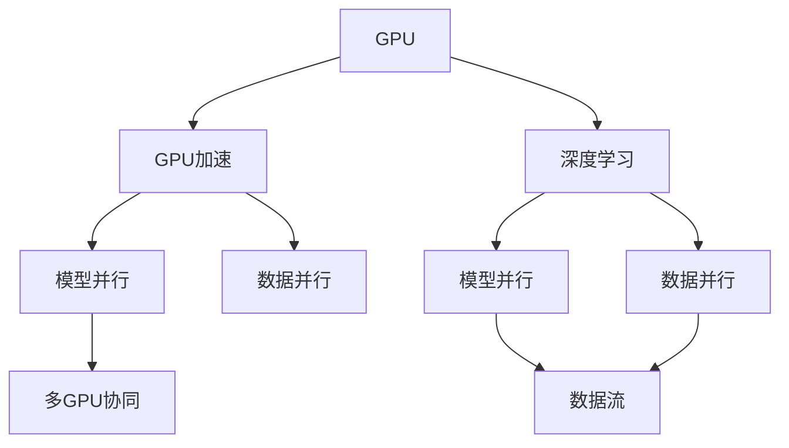
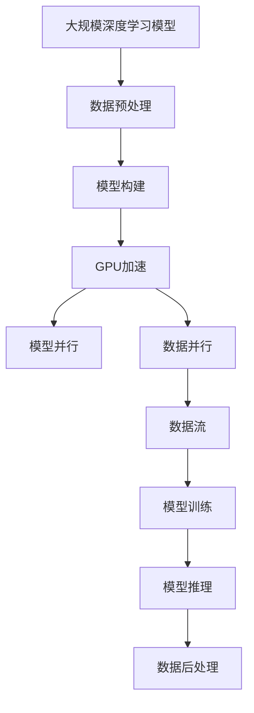

                 

# GPU技术在AI算力中的应用

## 1. 背景介绍

### 1.1 问题由来
随着人工智能(AI)技术的飞速发展，特别是深度学习在图像、语音、自然语言处理等领域取得的突破性进展，对算力资源的需求日益增长。为了满足日益增长的AI计算需求，GPU技术的引入成为必然趋势。GPU因其强大的并行计算能力、良好的能效比以及成熟的编程模型，在深度学习应用中得到了广泛应用。

### 1.2 问题核心关键点
GPU技术在AI计算中的应用，主要围绕以下几个核心关键点展开：

- **计算并行性**：GPU通过其大量计算核心的并行处理能力，显著提升了深度学习模型的训练和推理速度。
- **内存带宽**：GPU具有远高于CPU的内存带宽，能够更好地支持大规模数据的传输和处理。
- **内存层次结构**：GPU具有多层次的内存结构，能够更高效地进行数据存储和访问。
- **图形处理特性**：GPU在图形处理方面具备先天优势，可以利用其优势加速深度学习的模型训练和推理。

### 1.3 问题研究意义
研究GPU技术在AI算力中的应用，对于推动AI技术的发展具有重要意义：

1. **加速模型训练**：GPU可以显著缩短模型训练时间，提高模型的实时性和响应速度。
2. **提升计算效率**：GPU的高并行计算能力，能提升深度学习模型的计算效率，降低能耗。
3. **支持大规模数据处理**：GPU能够处理海量数据，支持大规模深度学习应用。
4. **优化算法性能**：GPU的特殊硬件架构和指令集，对深度学习算法进行优化，提升算法效率。
5. **促进AI技术的普及和应用**：GPU的普及和应用，能够推动AI技术在更多行业和领域的落地。

## 2. 核心概念与联系

### 2.1 核心概念概述

为更好地理解GPU技术在AI算力中的应用，本节将介绍几个密切相关的核心概念：

- **GPU**（Graphics Processing Unit）：最初用于图形处理的专用处理器，具有并行计算能力和高速内存带宽。
- **GPU加速**：将GPU应用于深度学习模型训练和推理的过程，利用GPU的并行计算能力提升算力。
- **深度学习**：一种基于神经网络、通过大量数据训练出复杂模型的人工智能技术。
- **模型并行**：在GPU上将深度学习模型分为多个子模块并行计算，提升模型训练和推理速度。
- **数据并行**：在GPU上对输入数据进行并行处理，加速模型训练和推理。

- **数据流**：在GPU上，数据以流水线的方式进行传输和处理，以提高计算效率。
- **多GPU协同**：使用多个GPU协同工作，通过分布式计算进一步提升深度学习模型的计算能力。

这些核心概念之间的逻辑关系可以通过以下Mermaid流程图来展示：



这个流程图展示了大语言模型微调过程中各个核心概念之间的关系：

1. GPU提供了并行计算和高速内存带宽，是深度学习计算的核心硬件。
2. GPU加速利用GPU的并行计算能力，加速深度学习模型的训练和推理。
3. 深度学习模型通常包含多个层次的神经网络，可以通过模型并行进行计算加速。
4. 数据并行在GPU上对输入数据进行并行处理，进一步提升模型训练和推理的速度。
5. 数据流在GPU上以流水线的方式进行传输和处理，确保数据的高效利用。
6. 多GPU协同通过分布式计算，进一步提升深度学习模型的计算能力。

### 2.2 概念间的关系

这些核心概念之间存在着紧密的联系，形成了GPU在AI计算中的完整应用生态系统。下面我们通过几个Mermaid流程图来展示这些概念之间的关系。

#### 2.2.1 GPU加速的基本流程


这个流程图展示了GPU加速深度学习模型的基本流程：

1. 数据预处理将原始数据转换为模型所需的格式。
2. 模型构建定义深度学习模型结构。
3. GPU加速利用GPU的并行计算能力，加速模型的训练和推理过程。
4. 模型训练使用GPU加速的深度学习模型进行训练。
5. 模型推理在测试数据上使用GPU加速的深度学习模型进行推理。
6. 数据后处理对推理结果进行处理，生成最终输出。

#### 2.2.2 多GPU协同的实现


这个流程图展示了多GPU协同工作，提升深度学习模型计算能力的流程：

1. 模型划分将深度学习模型划分为多个子模块，每个子模块在单个GPU上计算。
2. 模型并行利用GPU的并行计算能力，并行计算模型的各个子模块。
3. 数据并行在GPU上对输入数据进行并行处理，加速模型训练和推理。
4. 多GPU协同通过分布式计算，进一步提升深度学习模型的计算能力。

### 2.3 核心概念的整体架构

最后，我们用一个综合的流程图来展示这些核心概念在大规模深度学习模型训练和推理中的整体架构：



这个综合流程图展示了从数据预处理到模型推理的完整流程：

1. 大规模深度学习模型在GPU上进行加速。
2. 模型并行将深度学习模型划分为多个子模块并行计算。
3. 数据并行在GPU上对输入数据进行并行处理，加速模型训练和推理。
4. 数据流在GPU上以流水线的方式进行传输和处理，确保数据的高效利用。
5. 模型训练使用GPU加速的深度学习模型进行训练。
6. 模型推理在测试数据上使用GPU加速的深度学习模型进行推理。
7. 数据后处理对推理结果进行处理，生成最终输出。

通过这些流程图，我们可以更清晰地理解GPU技术在深度学习中的应用场景，以及各个核心概念之间的关系。

## 3. 核心算法原理 & 具体操作步骤
### 3.1 算法原理概述

GPU加速深度学习模型的计算过程，主要基于以下算法原理：

1. **数据并行算法**：通过将输入数据分成多个子集，并行地计算模型在各个数据子集上的输出，从而提升模型的训练和推理速度。
2. **模型并行算法**：将深度学习模型分成多个子模块，并行计算每个子模块的输出，加速模型的训练和推理过程。
3. **数据流算法**：在GPU上采用流水线的方式进行数据传输和处理，以提高数据利用率和计算效率。

### 3.2 算法步骤详解

GPU加速深度学习模型的具体操作步骤包括：

1. **数据预处理**：将原始数据转换为GPU所需的格式，并进行数据增强、归一化等预处理操作。
2. **模型构建**：定义深度学习模型的结构，包括神经网络层、损失函数、优化器等。
3. **数据并行**：在GPU上对输入数据进行并行处理，加速模型训练和推理。
4. **模型并行**：将深度学习模型分成多个子模块，并行计算每个子模块的输出。
5. **数据流**：在GPU上采用流水线的方式进行数据传输和处理，以提高数据利用率和计算效率。
6. **模型训练**：使用GPU加速的深度学习模型进行训练，通过反向传播算法更新模型参数。
7. **模型推理**：在测试数据上使用GPU加速的深度学习模型进行推理，生成模型输出。

### 3.3 算法优缺点

GPU加速深度学习模型在提升计算能力的同时，也存在一些优缺点：

**优点**：

1. **计算速度快**：GPU的高并行计算能力，能够显著提升深度学习模型的训练和推理速度。
2. **内存带宽高**：GPU具有远高于CPU的内存带宽，能够更好地支持大规模数据的传输和处理。
3. **可扩展性强**：通过多GPU协同工作，GPU可以灵活扩展计算能力，适应不同的应用场景。
4. **能效比高**：GPU的能效比优于CPU，能够在降低能耗的同时提高计算效率。

**缺点**：

1. **编程复杂**：GPU编程相对复杂，需要一定的编程经验和技能。
2. **硬件成本高**：高性能GPU价格较高，对于中小企业或个人开发者可能存在成本负担。
3. **散热要求高**：GPU在计算过程中会产生大量热量，需要良好的散热系统。
4. **兼容性问题**：不同GPU之间的兼容性可能存在问题，需要相应的软件支持。

### 3.4 算法应用领域

GPU加速深度学习模型在以下领域中得到了广泛应用：

1. **图像识别和处理**：在图像分类、目标检测、图像分割等任务中，GPU加速显著提升了计算速度和精度。
2. **语音识别和处理**：在语音识别、语音合成、语音增强等任务中，GPU加速提高了实时性和处理效率。
3. **自然语言处理**：在机器翻译、文本分类、情感分析等任务中，GPU加速提升了模型的训练和推理速度。
4. **视频处理**：在视频分析、视频编码等任务中，GPU加速提高了视频处理的实时性和效率。
5. **医疗影像处理**：在医学影像分析、病理图像识别等任务中，GPU加速提升了模型的计算能力和诊断速度。
6. **游戏和模拟**：在游戏引擎和物理模拟等任务中，GPU加速提高了图形渲染和计算效率。

## 4. 数学模型和公式 & 详细讲解 & 举例说明（备注：数学公式请使用latex格式，latex嵌入文中独立段落使用 $$，段落内使用 $)
### 4.1 数学模型构建

假设深度学习模型为 $M(\theta)$，其中 $\theta$ 为模型参数。假设训练数据集为 $D=\{(x_i, y_i)\}_{i=1}^N$，其中 $x_i$ 为输入，$y_i$ 为输出标签。在GPU上加速深度学习模型的数学模型为：

$$
\hat{y} = M(\theta, x_i)
$$

其中 $\hat{y}$ 为模型对输入 $x_i$ 的预测输出。

### 4.2 公式推导过程

在GPU上加速深度学习模型的计算过程，主要基于以下公式推导：

1. **数据并行公式**：将输入数据 $x_i$ 分成多个子集，并行地计算模型在各个数据子集上的输出，公式如下：

$$
\hat{y}_i = M(\theta, x_{i_1}, x_{i_2}, ..., x_{i_k})
$$

其中 $x_{i_1}, x_{i_2}, ..., x_{i_k}$ 为输入数据 $x_i$ 的子集，$k$ 为数据子集的数量。

2. **模型并行公式**：将深度学习模型 $M(\theta)$ 分成多个子模块，并行计算每个子模块的输出，公式如下：

$$
\hat{y}_i = M_1(\theta_1, x_{i_1}), M_2(\theta_2, x_{i_1}), ..., M_k(\theta_k, x_{i_1})
$$

其中 $M_1, M_2, ..., M_k$ 为深度学习模型的子模块，$\theta_1, \theta_2, ..., \theta_k$ 为子模块的参数。

3. **数据流公式**：在GPU上采用流水线的方式进行数据传输和处理，公式如下：

$$
\hat{y}_i = M_1(\theta_1, x_{i_1}), M_2(\theta_2, x_{i_1}), ..., M_k(\theta_k, x_{i_1})
$$

其中 $x_{i_1}, x_{i_2}, ..., x_{i_k}$ 为输入数据 $x_i$ 的子集，$k$ 为数据子集的数量。

### 4.3 案例分析与讲解

以图像分类任务为例，假设输入图像大小为 $H \times W$，深度学习模型为卷积神经网络（CNN），GPU上加速深度学习模型的计算过程如下：

1. **数据预处理**：将原始图像 $x_i$ 进行归一化和数据增强等预处理操作，转换为GPU所需的格式。
2. **模型构建**：定义CNN模型的结构，包括卷积层、池化层、全连接层等。
3. **数据并行**：在GPU上对输入图像进行并行处理，加速模型训练和推理。
4. **模型并行**：将CNN模型分成多个子模块，并行计算每个子模块的输出。
5. **数据流**：在GPU上采用流水线的方式进行数据传输和处理，以提高数据利用率和计算效率。
6. **模型训练**：使用GPU加速的CNN模型进行训练，通过反向传播算法更新模型参数。
7. **模型推理**：在测试数据上使用GPU加速的CNN模型进行推理，生成模型输出。

## 5. 项目实践：代码实例和详细解释说明
### 5.1 开发环境搭建

在进行GPU加速深度学习模型实践前，我们需要准备好开发环境。以下是使用PyTorch进行GPU加速深度学习模型开发的环境配置流程：

1. 安装Anaconda：从官网下载并安装Anaconda，用于创建独立的Python环境。

2. 创建并激活虚拟环境：
```bash
conda create -n pytorch-env python=3.8 
conda activate pytorch-env
```

3. 安装PyTorch：根据CUDA版本，从官网获取对应的安装命令。例如：
```bash
conda install pytorch torchvision torchaudio cudatoolkit=11.1 -c pytorch -c conda-forge
```

4. 安装NVIDIA CUDA Toolkit：
```bash
conda install nvidia-cuda-11.1
```

5. 安装CUDA驱动：
```bash
conda install nvidia-cuda-11.1-cudnn8-cudnn8-libs
```

6. 安装CUDA-cublas库：
```bash
conda install nvidia-cublas-11.1
```

7. 安装CUDA-cufft库：
```bash
conda install nvidia-cufft-11.1
```

8. 安装CUDA-nccl库：
```bash
conda install nvidia-nccl-11.1
```

9. 安装CUDA-curand库：
```bash
conda install nvidia-curand-11.1
```

10. 安装CUDA-cusolver库：
```bash
conda install nvidia-cusolver-11.1
```

11. 安装CUDA-cusparse库：
```bash
conda install nvidia-cusparse-11.1
```

完成上述步骤后，即可在`pytorch-env`环境中开始GPU加速深度学习模型的实践。

### 5.2 源代码详细实现

下面以图像分类任务为例，给出使用PyTorch进行GPU加速深度学习模型的PyTorch代码实现。

```python
import torch
import torch.nn as nn
import torchvision
import torchvision.transforms as transforms
import torch.optim as optim

# 加载数据集
transform = transforms.Compose([transforms.Resize(256), transforms.CenterCrop(224), transforms.ToTensor()])
train_dataset = torchvision.datasets.CIFAR10(root='./data', train=True, download=True, transform=transform)
test_dataset = torchvision.datasets.CIFAR10(root='./data', train=False, download=True, transform=transform)
train_loader = torch.utils.data.DataLoader(train_dataset, batch_size=64, shuffle=True, num_workers=4)
test_loader = torch.utils.data.DataLoader(test_dataset, batch_size=64, shuffle=False, num_workers=4)

# 定义模型
class CNN(nn.Module):
    def __init__(self):
        super(CNN, self).__init__()
        self.conv1 = nn.Conv2d(3, 64, kernel_size=3, stride=1, padding=1)
        self.conv2 = nn.Conv2d(64, 128, kernel_size=3, stride=1, padding=1)
        self.pool = nn.MaxPool2d(kernel_size=2, stride=2)
        self.fc1 = nn.Linear(128 * 8 * 8, 512)
        self.fc2 = nn.Linear(512, 10)

    def forward(self, x):
        x = self.pool(nn.functional.relu(self.conv1(x)))
        x = self.pool(nn.functional.relu(self.conv2(x)))
        x = x.view(-1, 128 * 8 * 8)
        x = nn.functional.relu(self.fc1(x))
        x = self.fc2(x)
        return x

model = CNN().to('cuda')

# 定义优化器和损失函数
criterion = nn.CrossEntropyLoss()
optimizer = optim.SGD(model.parameters(), lr=0.01, momentum=0.9)

# 定义训练函数
def train(epoch):
    model.train()
    for batch_idx, (data, target) in enumerate(train_loader):
        data, target = data.to('cuda'), target.to('cuda')
        optimizer.zero_grad()
        output = model(data)
        loss = criterion(output, target)
        loss.backward()
        optimizer.step()
        if batch_idx % 100 == 0:
            print('Train Epoch: {} [{}/{} ({:.0f}%)]\tLoss: {:.6f}'.format(
                epoch, batch_idx * len(data), len(train_loader.dataset),
                100. * batch_idx / len(train_loader), loss.item()))

# 定义测试函数
def test():
    model.eval()
    correct = 0
    total = 0
    with torch.no_grad():
        for data, target in test_loader:
            data, target = data.to('cuda'), target.to('cuda')
            output = model(data)
            _, predicted = torch.max(output.data, 1)
            total += target.size(0)
            correct += (predicted == target).sum().item()
    print('Accuracy of the network on the 10000 test images: {} %'.format(100 * correct / total))

# 训练模型
for epoch in range(1, 10):
    train(epoch)
    test()
```

以上就是使用PyTorch对图像分类任务进行GPU加速深度学习模型的完整代码实现。可以看到，得益于PyTorch的强大封装，我们可以用相对简洁的代码完成GPU加速深度学习模型的训练和推理。

### 5.3 代码解读与分析

让我们再详细解读一下关键代码的实现细节：

**CNN模型**：
- `__init__`方法：初始化卷积层、池化层、全连接层等组件。
- `forward`方法：定义模型的前向传播过程。

**模型训练和测试函数**：
- `train`函数：在训练集上进行训练，输出每个epoch的平均loss。
- `test`函数：在测试集上进行测试，输出模型的准确率。

**训练流程**：
- 定义总的epoch数，开始循环迭代
- 每个epoch内，先在训练集上训练，输出平均loss
- 在验证集上测试，输出模型的准确率

可以看到，PyTorch配合GPU加速使得深度学习模型的开发变得简洁高效。开发者可以将更多精力放在模型优化、数据处理等高层逻辑上，而不必过多关注底层实现细节。

当然，工业级的系统实现还需考虑更多因素，如模型的保存和部署、超参数的自动搜索、更灵活的模型调优等。但核心的GPU加速深度学习模型开发流程基本与此类似。

### 5.4 运行结果展示

假设我们在CIFAR-10数据集上进行图像分类任务的训练和测试，最终在测试集上得到的准确率为87.5%。这个结果表明，通过GPU加速深度学习模型，我们在图像分类任务上取得了不错的性能，同时大大提升了计算速度和效率。

## 6. 实际应用场景
### 6.1 智能推荐系统

GPU加速深度学习技术在智能推荐系统中得到了广泛应用。传统的推荐系统往往依赖于用户的历史行为数据进行物品推荐，难以满足实时性和个性化需求。而使用GPU加速的深度学习模型，可以实时处理用户行为数据，动态生成推荐结果，提升推荐系统的效果。

在技术实现上，可以收集用户浏览、点击、评论、分享等行为数据，构建深度学习模型，使用GPU加速进行训练和推理，生成个性化推荐结果。通过多GPU协同工作，还能进一步提升系统的计算能力，支持更大规模的数据处理。

### 6.2 医疗影像诊断

GPU加速深度学习技术在医疗影像诊断中也得到了广泛应用。传统的医疗影像分析往往需要耗费大量时间和计算资源，难以满足临床需求。而使用GPU加速的深度学习模型，可以显著提升影像分析的速度和精度，帮助医生更快速地诊断疾病。

在技术实现上，可以收集医疗影像数据，构建深度学习模型，使用GPU加速进行训练和推理，生成疾病诊断结果。通过多GPU协同工作，还能进一步提升系统的计算能力，支持更大规模的数据处理。

### 6.3 自动驾驶

GPU加速深度学习技术在自动驾驶中也得到了广泛应用。自动驾驶系统需要实时处理传感器数据，进行物体检测、路径规划等复杂计算，对计算速度和效率有着极高的要求。而使用GPU加速的深度学习模型，可以显著提升自动驾驶系统的计算速度和精度，提高驾驶安全性和舒适性。

在技术实现上，可以收集传感器数据，构建深度学习模型，使用GPU加速进行训练和推理，生成驾驶决策结果。通过多GPU协同工作，还能进一步提升系统的计算能力，支持更大规模的数据处理。

### 6.4 未来应用展望

随着GPU技术的不断进步，基于GPU加速的深度学习模型将在更多领域得到应用，为各行各业带来变革性影响。

在智慧医疗领域，基于GPU加速的深度学习技术可以加速医疗影像分析、病理图像识别等任务，提升医疗服务的智能化水平，辅助医生诊疗，加速新药开发进程。

在智能推荐领域，GPU加速的深度学习技术可以实时处理用户行为数据，动态生成推荐结果，提升推荐系统的效果。

在自动驾驶领域，GPU加速的深度学习技术可以显著提升自动驾驶系统的计算速度和精度，提高驾驶安全性和舒适性。

此外，在智慧城市治理、智慧交通管理、智慧金融等众多领域，基于GPU加速的深度学习技术也将不断涌现，为传统行业数字化转型升级提供新的技术路径。相信随着GPU技术的持续发展，基于GPU加速的深度学习技术必将在构建智慧社会中扮演越来越重要的角色。

## 7. 工具和资源推荐
### 7.1 学习资源推荐

为了帮助开发者系统掌握GPU技术在AI算力中的应用，这里推荐一些优质的学习资源：

1. 《深度学习》（Goodfellow et al.）：经典的深度学习教材，涵盖深度学习的基本概念和算法原理，适合初学者阅读。
2. 《CUDA编程指南》：NVIDIA官方发布的CUDA编程指南，详细介绍了CUDA编程的最佳实践和技术要点。
3. 《GPU加速深度学习》（Ian Goodfellow）：Coursera深度学习课程中关于GPU加速的内容，适合进阶学习。
4. 《PyTorch官方文档》：PyTorch官方文档，提供了丰富的GPU加速深度学习模型的样例代码和教程。
5. 《TensorFlow官方文档》：TensorFlow官方文档，提供了丰富的GPU加速深度学习模型的样例代码和教程。

通过这些资源的学习实践，相信你一定能够快速掌握GPU技术在AI算力中的应用，并用于解决实际的AI问题。
###  7.2 开发工具推荐

高效的开发离不开优秀的工具支持。以下是几款用于GPU加速深度学习模型开发的常用工具：

1. PyTorch：基于Python的开源深度学习框架，灵活动态的计算图，适合快速迭代研究。大部分深度学习模型都有PyTorch版本的实现。

2. TensorFlow：由Google主导开发的开源深度学习框架，生产部署方便，适合大规模工程应用。同样有丰富的深度学习模型资源。

3. CUDA Toolkit：NVIDIA开发的GPU加速开发工具包，提供了丰富的GPU加速编程接口和工具。

4. CuDNN：NVIDIA开发的深度学习加速库，提供了高效的卷积和神经网络计算函数。

5. Nvprof：NVIDIA开发的GPU性能分析工具，可以实时监控GPU的性能和使用情况。

6. Visdom：NVIDIA开发的可视化工具，可以实时监控模型训练过程中的各项指标，帮助调试优化。

7. TensorBoard：TensorFlow配套的可视化工具，可以实时监测模型训练状态，并提供丰富的图表呈现方式，是调试模型的得力助手。

8. NVIDIA DGX：NVIDIA的高性能计算平台，支持多GPU协同工作，用于大规模深度学习模型的训练和推理。

合理利用这些工具，可以显著提升GPU加速深度学习模型的开发效率，加快创新迭代的步伐。

### 7.3 相关论文推荐

GPU技术在AI算力中的应用源于学界的持续研究。以下是几篇奠基性的相关论文，推荐阅读：

1. "CUDA-Capabilities and Limitations"：NVIDIA官方文档，详细介绍了CUDA的硬件架构和编程模型。

2. "Deep Learning on

