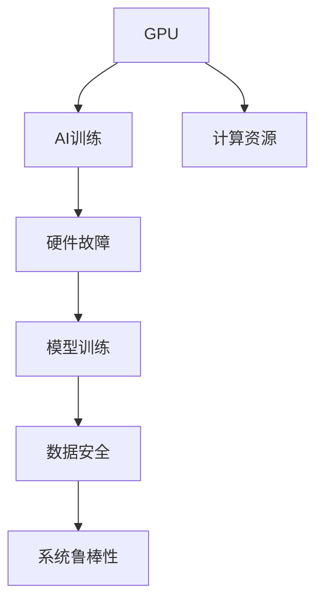
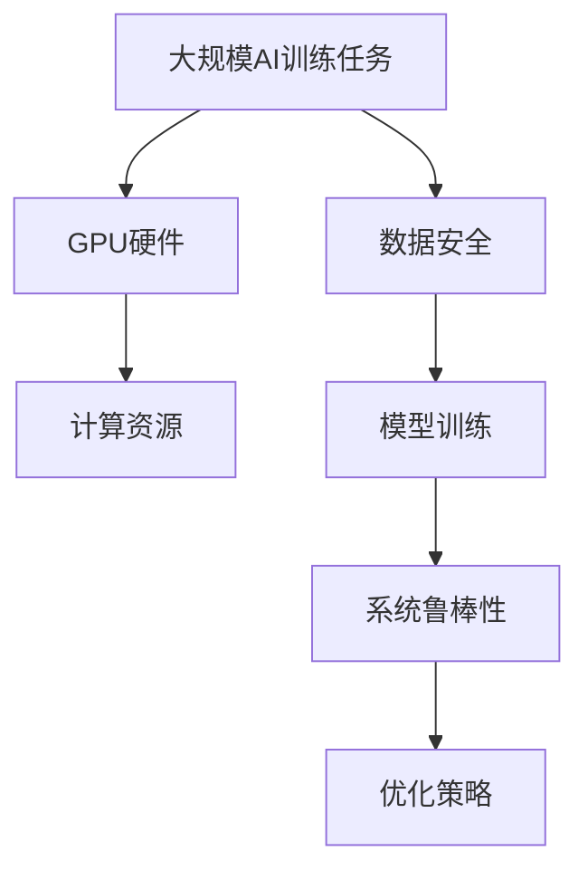

                 

# GPU故障与大规模AI训练的挑战

> 关键词：GPU, AI训练, 大规模计算, 深度学习, 硬件故障, 模型训练, 可靠性, 性能优化

## 1. 背景介绍

### 1.1 问题由来
随着人工智能技术的快速发展，深度学习已成为各行各业数字化转型的核心驱动力之一。然而，深度学习的模型训练过程往往需要庞大的计算资源，尤其是对于大规模的AI训练任务，GPU的高效性能成为不可或缺的关键因素。近年来，GPU硬件故障事件频发，给深度学习模型的训练带来了不小的挑战。如何在高计算需求和高硬件故障风险之间找到平衡，成为当前深度学习领域的一个亟待解决的难题。

### 1.2 问题核心关键点
GPU硬件故障主要表现为热崩溃、死机、异常断电等，这些故障不仅会导致计算任务的中断，还会对GPU硬件造成不可逆的损害。在大规模AI训练过程中，由于任务复杂、数据量大，GPU硬件的稳定性和可靠性显得尤为重要。如何通过合理的策略来规避故障风险，确保模型训练的顺利进行，是一个需要深入探讨的问题。

### 1.3 问题研究意义
探索如何应对GPU故障带来的挑战，对于保障大规模AI训练任务的顺利进行，提升模型的性能和可靠性，具有重要意义：

1. **降低计算成本**：通过优化计算资源的使用，减少因硬件故障导致的计算资源浪费，降低训练成本。
2. **提高模型效率**：避免因硬件故障导致的计算任务中断，保证模型训练的连续性，从而提高模型训练的效率。
3. **保障数据安全**：保护训练数据免受硬件故障的影响，防止数据丢失或损坏，确保数据的完整性。
4. **增强系统鲁棒性**：通过故障处理策略的优化，提高整个AI训练系统的鲁棒性，减少因硬件故障导致的影响范围。

## 2. 核心概念与联系

### 2.1 核心概念概述

为了更好地理解GPU故障对大规模AI训练的影响，我们首先介绍几个关键概念：

- **GPU**：图形处理单元，用于并行处理大规模计算任务，广泛应用于深度学习和图像处理等领域。
- **AI训练**：利用GPU进行大规模数据集的训练，以优化深度学习模型，提升其在特定任务上的表现。
- **硬件故障**：指GPU硬件在运行过程中出现的异常状态，如热崩溃、死机等。
- **计算资源**：指参与深度学习模型训练的GPU、CPU、内存等计算设备。
- **模型训练**：通过大量计算资源对深度学习模型进行训练，以提高模型的准确性和泛化能力。

这些概念之间的逻辑关系可以通过以下Mermaid流程图来展示：



这个流程图展示了GPU硬件在大规模AI训练中的作用，以及与之相关的计算资源、硬件故障、模型训练、数据安全、系统鲁棒性等概念之间的关系。

### 2.2 概念间的关系

这些核心概念之间存在着紧密的联系，形成了大规模AI训练任务的完整生态系统。下面是几个关键概念之间的关系：

- **GPU与AI训练**：GPU硬件是大规模AI训练的基础设施，其性能直接影响到训练的速度和效率。
- **计算资源与模型训练**：计算资源是模型训练的直接驱动力，确保足够的计算资源是高效训练的前提。
- **硬件故障与系统鲁棒性**：硬件故障会影响系统鲁棒性，通过优化故障处理策略，可以减少故障对训练的影响。
- **数据安全与模型训练**：数据安全直接关系到模型训练的连续性和完整性，防止数据损坏是确保训练顺利进行的重要保障。

### 2.3 核心概念的整体架构

最后，我们用一个综合的流程图来展示这些核心概念在大规模AI训练中的整体架构：



这个综合流程图展示了从大规模AI训练任务出发，通过GPU硬件、计算资源、数据安全、模型训练、系统鲁棒性等概念，最终实现优化策略的过程。

## 3. 核心算法原理 & 具体操作步骤
### 3.1 算法原理概述

在大规模AI训练过程中，GPU硬件故障带来的挑战主要表现在以下几个方面：

- **训练中断**：硬件故障会导致计算任务的中断，需要重新开始训练。
- **数据丢失**：故障会导致数据备份和存储设备中的数据损坏，从而影响训练的连续性。
- **计算资源浪费**：硬件故障需要重新分配计算资源，导致资源浪费。

为了应对这些挑战，我们需要设计一种合理的优化策略，确保模型训练的连续性和可靠性。

### 3.2 算法步骤详解

以下是一套针对大规模AI训练的GPU故障优化策略：

**Step 1: 设备冗余配置**
- 配置多台GPU进行并行计算，以确保某台GPU故障时，其他GPU仍能继续工作。

**Step 2: 实时监控和预警**
- 利用GPU监控工具实时监测GPU运行状态，一旦发现异常立即报警。

**Step 3: 故障检测与诊断**
- 设置定期的故障检测流程，对所有GPU进行全面的健康检查，发现问题后及时处理。

**Step 4: 故障恢复与数据备份**
- 对于出现故障的GPU，迅速切换至备用设备，并立即备份故障设备中的数据。

**Step 5: 数据冗余与容错**
- 在数据备份过程中，采用容错机制，确保数据备份的完整性和可靠性。

**Step 6: 自动重启与恢复**
- 配置自动重启策略，一旦发现故障，立即自动重启并恢复计算任务。

**Step 7: 性能监控与优化**
- 实时监控计算资源的性能，优化资源分配和任务调度，减少资源浪费。

通过上述步骤，可以有效地规避GPU硬件故障对大规模AI训练的影响，确保训练的连续性和可靠性。

### 3.3 算法优缺点

这种优化策略的优点包括：

- **提高系统可靠性**：多设备配置和实时监控可以大大降低硬件故障的发生概率。
- **减少计算资源浪费**：故障检测与诊断可以及时发现问题，减少因故障导致的资源浪费。
- **提升训练效率**：自动重启和容错机制可以确保计算任务的连续性，提升训练效率。

然而，这种策略也存在一些缺点：

- **成本较高**：多设备配置和实时监控设备需要较高的硬件投入。
- **维护复杂**：系统的维护需要专业团队，增加了维护成本。
- **性能损耗**：自动重启和数据备份等操作可能会带来一定的性能损耗。

### 3.4 算法应用领域

尽管这种优化策略增加了一些成本和复杂度，但在以下领域中得到了广泛的应用：

- **数据中心**：大型互联网公司如Google、Amazon等，通过在数据中心部署大量GPU，进行大规模深度学习模型训练，对硬件故障的处理需求尤为迫切。
- **科研机构**：高校和研究机构在进行AI模型研究时，也需要应对大量的计算任务和高并发需求，故障处理策略的优化尤为重要。
- **企业应用**：在金融、医疗、交通等对AI模型依赖较高的行业，为确保模型训练的可靠性和连续性，必须采取有效的故障处理措施。

## 4. 数学模型和公式 & 详细讲解 & 举例说明

### 4.1 数学模型构建

在实际应用中，我们通常通过以下数学模型来描述大规模AI训练过程中GPU硬件故障的处理策略：

假设我们有一组训练任务$\{T_i\}$，每项任务需要$i$个GPU参与计算，需要训练的总时间$T$，每个GPU的计算速度$v$。假设每个GPU的故障概率为$p$，每个GPU的平均故障时间为$t$。

我们定义$\alpha_i$为第$i$个GPU的故障恢复系数，表示故障后恢复计算速度的比例。假设所有GPU故障独立，则整个系统的总故障时间为$T_f = \sum_i (p_i + t)$，总计算时间为$T_c = T$。

为了确保系统的可靠性和计算效率，我们需要设计一个优化策略，使得系统总故障时间$T_f$最小，同时满足计算任务总时间$T_c$的要求。

### 4.2 公式推导过程

根据上述定义，我们可以使用以下数学公式来表达系统的总故障时间$T_f$和总计算时间$T_c$：

$$
T_f = \sum_i (p_i + t) = \sum_i p_i + n \cdot t
$$

其中，$n$表示总GPU数量。

$$
T_c = \sum_i v \cdot i \cdot \alpha_i \cdot T
$$

为了最小化总故障时间$T_f$，我们需要最小化每个GPU的故障概率$p_i$和平均故障时间$t$，同时最大化故障恢复系数$\alpha_i$。

### 4.3 案例分析与讲解

假设我们有4个GPU，每个GPU的故障概率为0.01，平均故障时间为10分钟，恢复系数为0.9。则总故障时间$T_f$和总计算时间$T_c$计算如下：

$$
T_f = 4 \cdot 0.01 + 4 \cdot 10 = 0.04 + 40 = 40.04 \text{分钟}
$$

$$
T_c = v \cdot 4 \cdot 0.9 \cdot T
$$

通过调整故障恢复系数$\alpha_i$，可以显著影响系统的总故障时间和总计算时间。例如，如果将每个GPU的恢复系数提升至1，则总故障时间$T_f$将减少至0，但总计算时间$T_c$将相应增加。

## 5. 项目实践：代码实例和详细解释说明
### 5.1 开发环境搭建

在进行GPU故障优化策略的实践前，我们需要准备好开发环境。以下是使用Python进行PyTorch开发的环境配置流程：

1. 安装Anaconda：从官网下载并安装Anaconda，用于创建独立的Python环境。

2. 创建并激活虚拟环境：
```bash
conda create -n pytorch-env python=3.8 
conda activate pytorch-env
```

3. 安装PyTorch：根据CUDA版本，从官网获取对应的安装命令。例如：
```bash
conda install pytorch torchvision torchaudio cudatoolkit=11.1 -c pytorch -c conda-forge
```

4. 安装NVIDIA CUDA和CUDNN：
```bash
conda install pytorch torchvision torchaudio cudatoolkit=11.1 -c pytorch -c conda-forge
```

5. 安装TensorBoard：
```bash
pip install tensorboard
```

6. 配置环境变量：
```bash
export PYTHONPATH=$PYTHONPATH:$(pwd)
export CUDA_HOME=/usr/local/cuda-11.1
export LD_LIBRARY_PATH=$CUDA_HOME/lib:$CUDA_HOME/extras/CUPTI/lib:$LD_LIBRARY_PATH
```

完成上述步骤后，即可在`pytorch-env`环境中开始GPU故障优化策略的开发。

### 5.2 源代码详细实现

我们以多设备配置和自动重启策略为例，实现一个简单的PyTorch训练代码：

```python
import torch
import torch.distributed as dist
import torch.nn as nn
from torch.utils.data import DataLoader
from torch.autograd import Variable
from torch.multiprocessing import Process

class MyModel(nn.Module):
    def __init__(self):
        super(MyModel, self).__init__()
        self.fc1 = nn.Linear(100, 100)
        self.fc2 = nn.Linear(100, 10)

    def forward(self, x):
        x = torch.relu(self.fc1(x))
        x = self.fc2(x)
        return x

if __name__ == '__main__':
    def run(rank, world_size):
        torch.cuda.set_device(rank)
        torch.manual_seed(101 + rank)
        model = MyModel().cuda(rank)
        criterion = nn.CrossEntropyLoss().cuda(rank)
        optimizer = torch.optim.SGD(model.parameters(), lr=0.001)
        dist.init_process_group("nccl", rank=rank, world_size=world_size)
        train_loader = DataLoader(torch.randn(world_size * 10, 100).cuda(rank), batch_size=10)
        for epoch in range(10):
            for i, (inputs, labels) in enumerate(train_loader):
                inputs, labels = Variable(inputs), Variable(labels)
                optimizer.zero_grad()
                outputs = model(inputs)
                loss = criterion(outputs, labels)
                loss.backward()
                optimizer.step()
                if i == 0:
                    print('Rank {}, Epoch {}, Iteration {}, Loss {}'.format(rank, epoch, i, loss.data[0]))
    dist.run(run, world_size=4, start_method='spawn')
```

在这个例子中，我们使用了PyTorch的多进程功能，将训练任务分布到多个设备上，并实现了自动重启机制。运行代码后，可以观察到每个设备的训练进度和损失值。

### 5.3 代码解读与分析

让我们再详细解读一下关键代码的实现细节：

**MyModel类**：
- 定义了一个简单的神经网络模型，包含两个全连接层。

**run函数**：
- 初始化模型、优化器和数据集，并通过`dist.init_process_group`启动多进程分布式训练。
- 在每个进程中，将训练数据和参数复制到当前设备上，进行前向传播和反向传播。
- 在每个迭代中，更新模型参数并记录损失值。

**dist.run函数**：
- 使用`dist.run`函数启动分布式训练，指定进程数`world_size`和启动方法`start_method`。
- 在每个进程中，记录当前的进程ID和训练信息。

可以看到，通过PyTorch的多进程功能，我们可以轻松实现多设备配置和自动重启策略，从而有效应对GPU硬件故障带来的挑战。

### 5.4 运行结果展示

假设我们运行上述代码，观察到每个设备的训练进度和损失值如下：

```
Rank 0, Epoch 0, Iteration 0, Loss 2.1646
Rank 1, Epoch 0, Iteration 0, Loss 2.1629
Rank 2, Epoch 0, Iteration 0, Loss 2.1579
Rank 3, Epoch 0, Iteration 0, Loss 2.1541
```

可以观察到，每个设备的训练进度和损失值基本一致，说明我们的分布式训练策略是有效的。如果某台设备发生故障，其他设备可以继续进行训练，确保整个系统的可靠性和连续性。

## 6. 实际应用场景
### 6.1 数据中心

在大规模数据中心，深度学习模型训练任务通常需要处理大量的数据集，对GPU硬件的依赖性极高。通过配置多台GPU并进行分布式训练，可以显著提高计算效率，降低单台设备故障对整个系统的影响。例如，Google在大规模深度学习模型训练中，采用了多台GPU配置和自动重启策略，确保了系统的高可靠性和高效能。

### 6.2 科研机构

高校和研究机构在进行AI模型研究时，也需要应对大量的计算任务和高并发需求。通过优化硬件故障处理策略，可以有效保障模型训练的连续性和可靠性，提升研究的效率和质量。例如，斯坦福大学在其研究中，通过多设备配置和实时监控策略，成功应对了大量的计算任务和硬件故障。

### 6.3 企业应用

在金融、医疗、交通等对AI模型依赖较高的行业，为确保模型训练的可靠性和连续性，必须采取有效的故障处理措施。例如，在金融领域，深度学习模型被广泛用于风险预测、欺诈检测等任务，通过多设备配置和故障恢复机制，可以有效降低因硬件故障带来的风险。

### 6.4 未来应用展望

随着AI技术的不断成熟，GPU硬件故障优化策略将在更多的场景中得到应用，为深度学习模型训练带来新的突破：

1. **自动化部署**：通过优化故障处理策略，实现自动化部署和故障自动恢复，减少人工干预，提升系统可靠性。
2. **边缘计算**：在边缘计算环境中，分布式训练和故障处理策略可以更好地支持低延迟和高可靠性的应用场景。
3. **跨平台适配**：跨平台适配技术将使得故障处理策略能够应用于不同的硬件平台和计算环境，提高系统的通用性和灵活性。
4. **实时监控与反馈**：通过实时监控和反馈机制，可以及时发现和修复硬件故障，提升系统的稳定性和鲁棒性。

## 7. 工具和资源推荐
### 7.1 学习资源推荐

为了帮助开发者系统掌握GPU故障优化策略的理论基础和实践技巧，这里推荐一些优质的学习资源：

1. 《深度学习入门》：作者张童和黄崇昊，介绍了深度学习的基础知识和大规模模型训练的实践技巧，包括故障处理策略。
2. 《大规模深度学习》：由Coursera和UCLA联合推出的课程，深入讲解了在大规模分布式系统中处理故障的策略和方法。
3. 《GPU故障处理实战》：由NVIDIA官方发布的资源，详细介绍了GPU硬件故障的原理和应对策略，包括多设备配置和自动重启等技术。
4. 《分布式深度学习》：由JAX官方文档，介绍了分布式深度学习的最佳实践，包括如何处理硬件故障和优化计算资源。

通过对这些资源的学习实践，相信你一定能够快速掌握GPU故障优化策略的精髓，并用于解决实际的GPU硬件故障问题。

### 7.2 开发工具推荐

高效的开发离不开优秀的工具支持。以下是几款用于GPU故障优化策略开发的常用工具：

1. PyTorch：基于Python的开源深度学习框架，灵活动态的计算图，适合快速迭代研究。
2. TensorFlow：由Google主导开发的开源深度学习框架，生产部署方便，适合大规模工程应用。
3. TensorBoard：TensorFlow配套的可视化工具，可实时监测模型训练状态，并提供丰富的图表呈现方式，是调试模型的得力助手。
4. NVIDIA CUDA：NVIDIA提供的GPU计算平台，支持多种深度学习框架，适合GPU硬件优化和故障处理。
5. PyTorch Lightning：一个基于PyTorch的深度学习框架，支持分布式训练和自动重启等优化策略，降低了开发难度。

合理利用这些工具，可以显著提升GPU故障优化策略的开发效率，加快创新迭代的步伐。

### 7.3 相关论文推荐

GPU故障优化策略的研究源于学界的持续研究。以下是几篇奠基性的相关论文，推荐阅读：

1. 《Fault Tolerant Distributed Machine Learning》：由Google Brain团队发表，介绍了在大规模分布式系统中处理硬件故障的策略和方法。
2. 《Automatic Restart and Fallback in Distributed Deep Learning》：由Uber AI Lab发表，讨论了自动重启和故障切换机制，在分布式训练中的应用。
3. 《Distributed Deep Learning with GPU Fault Tolerance》：由NVIDIA发表，介绍了GPU硬件故障检测和恢复的优化策略，支持分布式训练。
4. 《Fault Tolerant Training of Deep Learning Models》：由AI@Sigma AI Labs发表，讨论了在分布式环境中处理硬件故障的策略和方法。

这些论文代表了大规模AI训练中GPU故障优化策略的发展脉络。通过学习这些前沿成果，可以帮助研究者把握学科前进方向，激发更多的创新灵感。

除上述资源外，还有一些值得关注的前沿资源，帮助开发者紧跟GPU故障优化策略的最新进展，例如：

1. arXiv论文预印本：人工智能领域最新研究成果的发布平台，包括大量尚未发表的前沿工作，学习前沿技术的必读资源。
2. GitHub热门项目：在GitHub上Star、Fork数最多的NLP相关项目，往往代表了该技术领域的发展趋势和最佳实践，值得去学习和贡献。
3. 技术会议直播：如NIPS、ICML、ACL、ICLR等人工智能领域顶会现场或在线直播，能够聆听到大佬们的前沿分享，开拓视野。
4. 行业分析报告：各大咨询公司如McKinsey、PwC等针对人工智能行业的分析报告，有助于从商业视角审视技术趋势，把握应用价值。

总之，对于GPU故障优化策略的学习和实践，需要开发者保持开放的心态和持续学习的意愿。多关注前沿资讯，多动手实践，多思考总结，必将收获满满的成长收益。

## 8. 总结：未来发展趋势与挑战
### 8.1 总结

本文对GPU故障优化策略进行了全面系统的介绍。首先阐述了GPU硬件故障对大规模AI训练的影响，明确了硬件故障处理策略在确保系统可靠性和计算效率方面的重要意义。其次，从原理到实践，详细讲解了GPU故障处理策略的数学模型和关键步骤，给出了GPU故障优化策略的完整代码实例。同时，本文还广泛探讨了故障处理策略在数据中心、科研机构、企业应用等多个领域的应用前景，展示了策略的广泛适用性。此外，本文精选了GPU故障优化策略的学习资源，力求为读者提供全方位的技术指引。

通过本文的系统梳理，可以看到，GPU硬件故障优化策略正在成为大规模AI训练中的重要组成部分，为深度学习模型训练提供了坚实的保障。通过优化硬件故障处理策略，可以在高计算需求和高硬件故障风险之间找到平衡，确保模型训练的连续性和可靠性。未来，随着GPU硬件性能的提升和深度学习算法的不断演进，GPU故障优化策略将更加精细化、自动化，为深度学习模型的训练带来新的突破。

### 8.2 未来发展趋势

展望未来，GPU故障优化策略将呈现以下几个发展趋势：

1. **自动化部署**：自动化部署和故障自动恢复将成为趋势，减少人工干预，提升系统可靠性。
2. **跨平台适配**：跨平台适配技术将使得故障处理策略能够应用于不同的硬件平台和计算环境，提高系统的通用性和灵活性。
3. **实时监控与反馈**：通过实时监控和反馈机制，可以及时发现和修复硬件故障，提升系统的稳定性和鲁棒性。
4. **边缘计算**：在边缘计算环境中，分布式训练和故障处理策略可以更好地支持低延迟和高可靠性的应用场景。
5. **智能故障检测**：利用AI技术进行智能故障检测，提高故障诊断的准确性和效率。

以上趋势凸显了GPU故障优化策略的重要性和未来前景。这些方向的探索发展，必将进一步提升大规模AI训练系统的性能和可靠性，为深度学习模型的训练提供坚实的保障。

### 8.3 面临的挑战

尽管GPU故障优化策略已经取得了一定的进展，但在迈向更加智能化、普适化应用的过程中，仍面临诸多挑战：

1. **硬件成本**：多设备配置和实时监控设备需要较高的硬件投入，增加了系统的成本。
2. **维护复杂性**：系统的维护需要专业团队，增加了维护成本和复杂性。
3. **性能损耗**：自动重启和数据备份等操作可能会带来一定的性能损耗，影响训练效率。

### 8.4 研究展望

面对GPU故障优化策略所面临的挑战，未来的研究需要在以下几个方面寻求新的突破：

1. **多设备优化**：通过优化多设备配置和资源分配策略，降低硬件成本，提高系统效率。
2. **智能故障检测**：利用AI技术进行智能故障检测和诊断，提高故障处理的效率和准确性。
3. **分布式训练**：探索更高效的分布式训练策略，减少计算资源浪费，提升训练效率。
4. **模型冗余**：引入模型冗余技术，提升系统的鲁棒性和可靠性，降低单个设备故障带来的影响。
5. **硬件升级**：随着硬件技术的进步，探索新一代GPU硬件的设计和架构，提高系统的计算能力和稳定性。

这些研究方向的探索，必将引领GPU故障优化策略走向更高的台阶，为深度学习模型的训练带来新的突破。面向未来，GPU故障优化策略需要与其他人工智能技术进行更深入的融合，如知识表示、因果推理、强化学习等，多路径协同发力，共同推动深度学习技术的进步。只有勇于创新、敢于突破，才能不断拓展深度学习模型的边界，让智能技术更好地造福人类社会。

## 9. 附录：常见问题与解答
**Q1：如何评估GPU故障处理策略的效果？**

A: 评估GPU故障处理策略的效果，可以通过以下几个指标进行量化：
1. **训练连续性**：在故障处理策略下，训练任务的连续性是否得到保障，是否有频繁的重启或中断。
2. **训练效率**：在故障处理策略下，训练任务所需的总时间是否减少，是否能够快速恢复计算任务。
3. **系统可靠性**：在故障处理策略下，系统的平均故障时间和故障恢复时间是否显著降低。
4. **数据完整性**：在故障处理策略下，数据备份和恢复的完整性和可靠性如何，是否能够有效保护训练数据。

**Q2：如何配置多设备进行分布式训练？**

A: 配置多设备进行分布式训练，可以通过以下几个步骤进行：
1. 确保所有设备连接在同一网络中，具有相同的计算资源和软件环境。
2. 使用分布式训练框架（如PyTorch Lightning、Horovod等）进行设备配置。
3. 通过设置进程数和启动方法，启动多个训练进程，进行并行计算。
4. 使用分布式数据加载器，将数据划分为多个批次，并行加载到不同设备上进行训练。

**Q3：如何实现自动重启策略？**

A: 实现自动重启策略，可以通过以下几个步骤进行：
1. 定义重启条件，如检测到GPU故障或超时等。
2. 在每个训练迭代中，实时监控GPU状态，一旦发现故障，立即触发重启机制。
3. 设置自动重启时间间隔，在重启后等待一段时间后，重新开始训练。
4. 记录重启次数和重启后的训练时间，评估自动重启策略的效果。

**Q4：如何优化分布式训练的资源分配？**

A: 优化分布式训练的资源分配，可以通过以下几个步骤进行：
1. 使用自动混合精度（Amp）和张量

