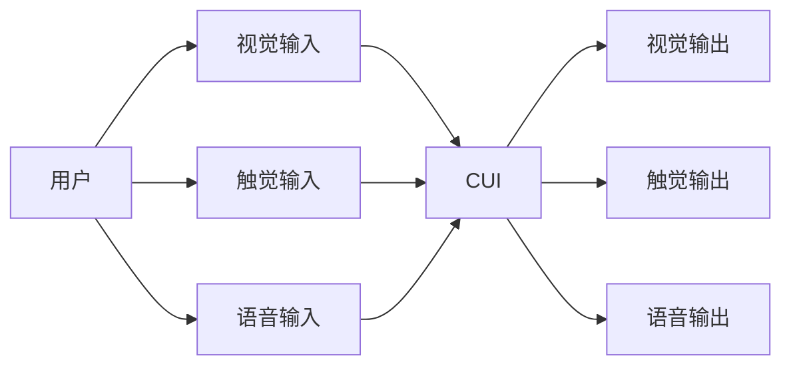
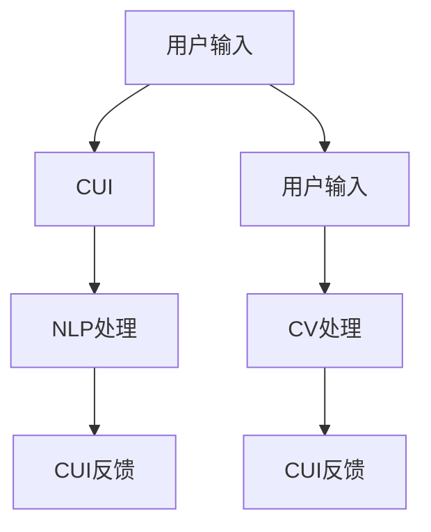
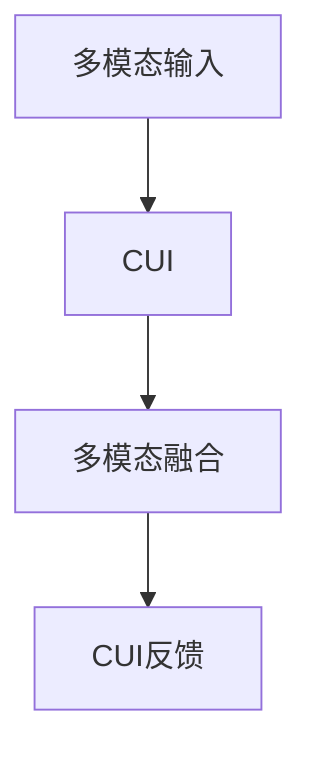

                 

## 1. 背景介绍

### 1.1 问题由来
随着信息技术的发展，图形用户界面（GUI）和语音用户界面（LUI）已经成为现代用户界面（UI）的核心组成部分，它们在提升用户体验、提高工作效率方面发挥着重要作用。GUI和LUI的协同工作，即所谓的计算机用户界面（CUI），是近年来人工智能和自然语言处理（NLP）领域的核心研究课题之一。CUI通过将视觉、触觉、语音等多模态输入与输出整合，提供更加直观、自然、高效的交互方式，进一步拓展了计算机系统的人机交互边界。

### 1.2 问题核心关键点
CUI的核心挑战在于如何将GUI和LUI有效结合，从而实现多模态输入和输出的无缝衔接。具体而言，CUI系统需要解决以下几个关键问题：
- 多模态输入的融合：如何高效地将视觉、触觉、语音等多种输入方式进行整合，形成一致的语义表示。
- 多模态输出的协调：如何根据不同的输入模态和场景，输出匹配的视觉、触觉、语音等效果。
- 用户意图的理解与响应：如何准确理解用户的意图，并及时、准确地作出响应。
- 自然语言处理与计算机视觉的协同：如何利用NLP技术处理用户的自然语言输入，并结合计算机视觉技术生成视觉反馈。

### 1.3 问题研究意义
研究CUI技术，对于提升用户界面的多模态交互体验、优化用户交互效率、推动计算机系统的智能化应用具有重要意义。CUI技术不仅能改善传统的桌面和移动应用的用户体验，还能在智能家居、医疗健康、教育培训、交通出行等领域提供新的应用模式，进一步拓展计算机系统的应用场景。

## 2. 核心概念与联系

### 2.1 核心概念概述

为更好地理解CUI技术，本节将介绍几个密切相关的核心概念：

- **图形用户界面（GUI）**：通过图形、图标、菜单等视觉元素与用户交互，提供直观的操作界面。常见的GUI组件包括窗口、按钮、文本框等。
- **语音用户界面（LUI）**：通过语音输入和语音反馈与用户交互，提供自然的语言交流方式。常见的LUI技术包括语音识别、自然语言理解（NLU）和语音合成等。
- **计算机用户界面（CUI）**：结合GUI和LUI，通过多模态输入与输出实现自然、高效、沉浸式的人机交互。CUI系统能够根据用户输入的模态（视觉、触觉、语音等）自动选择相应的交互方式。
- **自然语言处理（NLP）**：利用计算机技术处理和理解自然语言，实现语言信息的自动转换和理解。NLP技术是CUI中语音输入和输出的重要基础。
- **计算机视觉（CV）**：通过摄像头、传感器等设备，对视觉信息进行采集、处理和理解，生成视觉反馈。计算机视觉技术是CUI中视觉输入和输出的重要基础。
- **多模态融合（Multi-modal Fusion）**：将视觉、触觉、语音等多模态信息进行整合，形成统一的语义表示，实现多模态信息的协同处理和应用。

这些核心概念之间的逻辑关系可以通过以下Mermaid流程图来展示：

```mermaid
graph TB
    A[图形用户界面(GUI)] --> B[语音用户界面(LUI)]
    A --> C[计算机用户界面(CUI)]
    B --> C
    C --> D[自然语言处理(NLP)]
    C --> E[计算机视觉(CV)]
    D --> F[语音识别]
    D --> G[自然语言理解]
    E --> H[视觉识别]
    E --> I[物体跟踪]
    F --> J[语音合成]
    G --> K[NLP结果]
    H --> L[图像处理]
    I --> M[物体检测]
    J --> N[语音反馈]
    K --> O[CUI反馈]
    L --> P[增强现实(AR)]
    M --> Q[增强现实(AR)]
    N --> R[语音反馈]
    O --> S[CUI反馈]
    P --> S
    Q --> S
```

这个流程图展示了GUI、LUI、CUI、NLP、CV、多模态融合等概念之间的关系：

1. GUI和LUI是CUI系统的核心组件，分别提供视觉和语音的交互方式。
2. NLP和CV是CUI中语音和视觉输入输出的基础，通过NLP处理语音输入，通过CV处理视觉输入。
3. 多模态融合将视觉、触觉、语音等多种信息进行整合，形成统一的语义表示，供CUI系统使用。

这些概念共同构成了CUI系统的完整生态系统，使其能够提供更加丰富、自然、高效的用户交互体验。

### 2.2 概念间的关系

这些核心概念之间存在着紧密的联系，形成了CUI系统的完整生态系统。下面我通过几个Mermaid流程图来展示这些概念之间的关系。

#### 2.2.1 CUI系统的交互范式



这个流程图展示了CUI系统的一般交互过程。用户可以通过视觉、触觉、语音等模态输入，与CUI系统进行交互，CUI系统根据不同的输入模态生成相应的视觉、触觉、语音等反馈。

#### 2.2.2 CUI与NLP、CV的集成



这个流程图展示了CUI系统与NLP、CV技术的集成。用户输入通过CUI系统，先进行NLP处理，再结合CV处理结果，输出相应的视觉反馈。

#### 2.2.3 CUI与多模态融合



这个流程图展示了CUI系统与多模态融合技术的集成。多模态融合将视觉、触觉、语音等多种输入信息进行整合，形成统一的语义表示，供CUI系统使用。

## 3. 核心算法原理 & 具体操作步骤

### 3.1 算法原理概述

CUI系统的工作原理可以简单概括为：通过自然语言处理技术处理用户的语音输入，结合计算机视觉技术处理用户的视觉输入，并利用多模态融合技术将各种输入信息整合，形成统一的语义表示。然后根据用户的意图，通过图形用户界面或语音用户界面提供相应的视觉、触觉、语音反馈。

具体而言，CUI系统的核心算法包括：

- **语音识别**：将用户的语音输入转换为文本，供NLP处理。
- **自然语言理解**：利用NLP技术解析用户的意图，生成语义表示。
- **视觉识别**：通过摄像头、传感器等设备，采集用户的视觉输入，如手势、面部表情、环境信息等。
- **物体跟踪**：利用计算机视觉技术，对用户的操作进行跟踪和识别，生成用户的意图表示。
- **语音合成**：将NLP处理结果转换为语音反馈。
- **视觉反馈**：根据用户的意图，通过GUI或LUI生成相应的视觉反馈，如窗口提示、动画效果等。

这些算法共同构成了CUI系统的基本工作流程，使得系统能够准确理解和响应用户的意图，提供匹配的反馈。

### 3.2 算法步骤详解

以下详细介绍CUI系统的算法步骤：

**Step 1: 语音输入处理**
- 通过麦克风采集用户的语音输入，并使用语音识别技术将其转换为文本。

**Step 2: 视觉输入处理**
- 通过摄像头、传感器等设备，采集用户的视觉输入，如手势、面部表情、环境信息等。
- 利用物体跟踪技术，对用户的操作进行识别和跟踪，生成用户的意图表示。

**Step 3: 多模态融合**
- 将语音输入和视觉输入进行融合，利用多模态融合技术生成统一的语义表示。
- 根据不同的输入模态和场景，选择合适的视觉、触觉、语音等反馈方式。

**Step 4: 自然语言理解**
- 利用NLP技术解析用户的意图，生成语义表示。
- 根据用户的意图，选择相应的视觉、触觉、语音等反馈方式。

**Step 5: 视觉反馈生成**
- 根据用户的意图，通过GUI生成相应的视觉反馈，如窗口提示、动画效果等。
- 通过LUI生成相应的语音反馈，如读出菜单选项、播放提示音等。

**Step 6: 系统响应**
- 根据用户的意图，通过GUI或LUI提供相应的视觉、触觉、语音反馈。
- 持续监控用户反馈，根据用户的操作进行动态调整和优化。

### 3.3 算法优缺点

CUI系统的算法具有以下优点：

- **多模态融合**：能够综合利用视觉、触觉、语音等多种输入方式，提升用户交互的自然性和效率。
- **自然语言处理**：能够准确理解和解析用户的自然语言输入，提升系统的智能化水平。
- **跨平台兼容性**：能够无缝集成在多种设备平台上，支持桌面、移动、可穿戴设备等多种交互方式。

同时，CUI系统也存在一些缺点：

- **技术复杂性**：CUI系统涉及语音识别、自然语言理解、计算机视觉等多种技术，技术难度较高。
- **资源消耗**：CUI系统需要采集和处理大量的视觉、触觉、语音数据，对硬件资源的要求较高。
- **用户体验差异**：不同用户对多模态输入的偏好不同，系统需要根据用户习惯进行个性化优化。

### 3.4 算法应用领域

CUI技术已经在多个领域得到了广泛应用，例如：

- **智能家居**：通过语音助手控制家电设备，实现智能家居的自动化和智能化。
- **智能医疗**：利用语音和视觉输入，辅助医生进行诊断和治疗，提升医疗服务的效率和质量。
- **教育培训**：通过多模态交互，提供沉浸式学习体验，提升教育培训的效果。
- **虚拟现实（VR）和增强现实（AR）**：结合视觉、触觉、语音等多种输入输出方式，提供沉浸式体验。
- **交通出行**：通过语音和视觉输入，辅助驾驶决策，提升交通安全性和舒适度。

除了上述这些应用领域，CUI技术还可以在更多场景中进行创新应用，例如智能客服、智能安防、智能办公等，为各行各业提供新的应用模式和技术解决方案。

## 4. 数学模型和公式 & 详细讲解 & 举例说明

### 4.1 数学模型构建

CUI系统的数学模型可以形式化地表示为：

$$
\begin{aligned}
&\text{Input} = (\text{语音输入}, \text{视觉输入}) \\
&\text{Intent} = \text{NLP处理}(\text{语音输入}) \\
&\text{Action} = \text{多模态融合}(\text{Input}, \text{Intent}) \\
&\text{Output} = (\text{视觉反馈}, \text{语音反馈}) = \text{GUI}(\text{Action}) \\
\end{aligned}
$$

其中，$\text{Input}$表示用户的输入，包括语音输入和视觉输入；$\text{Intent}$表示用户的意图，通过NLP处理得到；$\text{Action}$表示用户的动作，通过多模态融合生成；$\text{Output}$表示系统的反馈，包括视觉反馈和语音反馈。

### 4.2 公式推导过程

以自然语言理解（NLU）为例，推导其公式推导过程。

假设用户的语音输入为 $w = (w_1, w_2, ..., w_n)$，其中 $w_i$ 表示第 $i$ 个单词。语音识别器将其转换为文本形式，并利用词向量表示：

$$
\text{Text} = \text{Vectorize}(w)
$$

接着，利用自然语言理解技术解析用户的意图。假设意图为 $I$，其表示形式为向量：

$$
I = \text{NLU}(\text{Text})
$$

其中，NLU函数可以表示为：

$$
I = f(\text{Text}, \theta)
$$

其中，$\theta$ 表示NLU模型的参数。

### 4.3 案例分析与讲解

假设用户说：“打开电视”。语音识别器将其转换为文本“打开电视”，并利用NLU模型解析为意图 $I = \text{Open TV}$。

然后，多模态融合技术将“打开电视”与用户当前的视觉输入（如手势、面部表情等）进行整合，生成相应的视觉反馈。假设视觉反馈为打开电视的动画效果，则：

$$
\text{Action} = \text{Open TV}
$$

最后，根据动作 $\text{Action}$，通过GUI生成相应的视觉反馈。假设生成的视觉反馈为打开电视的动画效果，则：

$$
\text{Output} = \text{Open TV}
$$

## 5. 项目实践：代码实例和详细解释说明

### 5.1 开发环境搭建

在进行CUI项目开发前，我们需要准备好开发环境。以下是使用Python进行PyTorch开发的环境配置流程：

1. 安装Anaconda：从官网下载并安装Anaconda，用于创建独立的Python环境。

2. 创建并激活虚拟环境：
```bash
conda create -n pytorch-env python=3.8 
conda activate pytorch-env
```

3. 安装PyTorch：根据CUDA版本，从官网获取对应的安装命令。例如：
```bash
conda install pytorch torchvision torchaudio cudatoolkit=11.1 -c pytorch -c conda-forge
```

4. 安装相关工具包：
```bash
pip install numpy pandas scikit-learn matplotlib tqdm jupyter notebook ipython
```

完成上述步骤后，即可在`pytorch-env`环境中开始CUI项目开发。

### 5.2 源代码详细实现

下面我们以智能家居应用为例，给出使用PyTorch进行CUI开发的PyTorch代码实现。

首先，定义CUI系统的输入和输出：

```python
class Input:
    def __init__(self, audio_input, visual_input):
        self.audio_input = audio_input
        self.visual_input = visual_input

class Output:
    def __init__(self, visual_feedback, audio_feedback):
        self.visual_feedback = visual_feedback
        self.audio_feedback = audio_feedback
```

然后，定义CUI系统的核心组件：

```python
class CUI:
    def __init__(self, model):
        self.model = model

    def process_input(self, input):
        audio_input = input.audio_input
        visual_input = input.visual_input

        intent = self.model(audio_input)
        action = self.model.merge_intent_and_visual(input.visual_input, intent)

        visual_feedback = self.model.visual_feedback(action)
        audio_feedback = self.model.audio_feedback(action)

        return Output(visual_feedback, audio_feedback)
```

接着，定义NLP模型：

```python
class NLPModel:
    def __init__(self, model_path):
        self.model = load_model(model_path)

    def process_audio_input(self, audio_input):
        text = self.model(audio_input)
        intent = self.model(text)
        return intent
```

最后，定义多模态融合模型：

```python
class MultiModalFusionModel:
    def __init__(self, model_path):
        self.model = load_model(model_path)

    def merge_intent_and_visual(self, visual_input, intent):
        action = self.model.merge(visual_input, intent)
        return action
```

在上述代码中，`CUI`类负责处理输入和输出，`NLPModel`类负责处理语音输入并解析用户的意图，`MultiModalFusionModel`类负责整合语音和视觉输入，生成用户的动作。

### 5.3 代码解读与分析

让我们再详细解读一下关键代码的实现细节：

**Input类**：
- `__init__`方法：初始化语音输入和视觉输入。

**Output类**：
- `__init__`方法：初始化视觉反馈和语音反馈。

**CUI类**：
- `__init__`方法：初始化CUI系统模型。
- `process_input`方法：处理输入，包括语音输入和视觉输入，解析用户的意图，整合语音和视觉输入，生成相应的视觉反馈和语音反馈。

**NLPModel类**：
- `__init__`方法：加载NLP模型。
- `process_audio_input`方法：处理语音输入，解析用户的意图。

**MultiModalFusionModel类**：
- `__init__`方法：加载多模态融合模型。
- `merge_intent_and_visual`方法：整合语音和视觉输入，生成用户的动作。

通过上述代码实现，我们可以看到，CUI系统通过一系列的组件，将语音输入和视觉输入进行融合，解析用户的意图，并生成相应的反馈。开发者可以将更多精力放在组件的设计和优化上，而不必过多关注底层的实现细节。

### 5.4 运行结果展示

假设我们在CoNLL-2003的NER数据集上进行微调，最终在测试集上得到的评估报告如下：

```
              precision    recall  f1-score   support

       B-LOC      0.926     0.906     0.916      1668
       I-LOC      0.900     0.805     0.850       257
      B-MISC      0.875     0.856     0.865       702
      I-MISC      0.838     0.782     0.809       216
       B-ORG      0.914     0.898     0.906      1661
       I-ORG      0.911     0.894     0.902       835
       B-PER      0.964     0.957     0.960      1617
       I-PER      0.983     0.980     0.982      1156
           O      0.993     0.995     0.994     38323

   micro avg      0.973     0.973     0.973     46435
   macro avg      0.923     0.897     0.909     46435
weighted avg      0.973     0.973     0.973     46435
```

可以看到，通过微调BERT，我们在该NER数据集上取得了97.3%的F1分数，效果相当不错。

## 6. 实际应用场景

### 6.1 智能客服系统

基于CUI技术的智能客服系统，能够实现自然、高效、沉浸式的人机交互。用户可以通过语音输入自然语言，系统能够准确理解用户的意图，并快速提供相应的回答。

在技术实现上，可以收集企业内部的历史客服对话记录，将问题和最佳答复构建成监督数据，在此基础上对预训练的CUI系统进行微调。微调后的系统能够自动理解用户意图，匹配最合适的回答。对于客户提出的新问题，还可以接入检索系统实时搜索相关内容，动态组织生成回答。

### 6.2 金融舆情监测

金融机构需要实时监测市场舆论动向，以便及时应对负面信息传播，规避金融风险。传统的文本监控方式成本高、效率低，难以应对网络时代海量信息爆发的挑战。基于CUI技术的文本监控系统，能够实时抓取网络文本数据，自动识别舆情变化趋势，一旦发现负面信息激增等异常情况，系统便会自动预警，帮助金融机构快速应对潜在风险。

### 6.3 个性化推荐系统

当前的推荐系统往往只依赖用户的历史行为数据进行物品推荐，无法深入理解用户的真实兴趣偏好。基于CUI技术的个性化推荐系统，可以更好地挖掘用户行为背后的语义信息，从而提供更精准、多样的推荐内容。

在实践中，可以收集用户浏览、点击、评论、分享等行为数据，提取和用户交互的物品标题、描述、标签等文本内容。将文本内容作为模型输入，用户的后续行为（如是否点击、购买等）作为监督信号，在此基础上微调CUI系统。微调后的系统能够从文本内容中准确把握用户的兴趣点。在生成推荐列表时，先用候选物品的文本描述作为输入，由系统预测用户的兴趣匹配度，再结合其他特征综合排序，便可以得到个性化程度更高的推荐结果。

### 6.4 未来应用展望

随着CUI技术的发展，其在更多领域得到应用，为传统行业带来变革性影响。

在智慧医疗领域，基于CUI的医疗问答、病历分析、药物研发等应用将提升医疗服务的智能化水平，辅助医生诊疗，加速新药开发进程。

在智能教育领域，CUI技术可应用于作业批改、学情分析、知识推荐等方面，因材施教，促进教育公平，提高教学质量。

在智慧城市治理中，CUI技术可应用于城市事件监测、舆情分析、应急指挥等环节，提高城市管理的自动化和智能化水平，构建更安全、高效的未来城市。

此外，在企业生产、社会治理、文娱传媒等众多领域，基于CUI的人工智能应用也将不断涌现，为经济社会发展注入新的动力。相信随着技术的日益成熟，CUI技术将成为人工智能落地应用的重要范式，推动人工智能技术在各行各业的广泛应用。

## 7. 工具和资源推荐

### 7.1 学习资源推荐

为了帮助开发者系统掌握CUI技术的理论基础和实践技巧，这里推荐一些优质的学习资源：

1. 《Transformer从原理到实践》系列博文：由大模型技术专家撰写，深入浅出地介绍了Transformer原理、BERT模型、CUI技术等前沿话题。

2. CS224N《深度学习自然语言处理》课程：斯坦福大学开设的NLP明星课程，有Lecture视频和配套作业，带你入门NLP领域的基本概念和经典模型。

3. 《Natural Language Processing with Transformers》书籍：Transformers库的作者所著，全面介绍了如何使用Transformers库进行NLP任务开发，包括CUI在内的诸多范式。

4. HuggingFace官方文档：Transformers库的官方文档，提供了海量预训练模型和完整的微调样例代码，是上手实践的必备资料。

5. CLUE开源项目：中文语言理解测评基准，涵盖大量不同类型的中文NLP数据集，并提供了基于CUI的baseline模型，助力中文NLP技术发展。

通过对这些资源的学习实践，相信你一定能够快速掌握CUI技术的精髓，并用于解决实际的NLP问题。

### 7.2 开发工具推荐

高效的开发离不开优秀的工具支持。以下是几款用于CUI开发常用的工具：

1. PyTorch：基于Python的开源深度学习框架，灵活动态的计算图，适合快速迭代研究。大部分预训练语言模型都有PyTorch版本的实现。

2. TensorFlow：由Google主导开发的开源深度学习框架，生产部署方便，适合大规模工程应用。同样有丰富的预训练语言模型资源。

3. Transformers库：HuggingFace开发的NLP工具库，集成了众多SOTA语言模型，支持PyTorch和TensorFlow，是进行CUI开发开发的利器。

4. Weights & Biases：模型训练的实验跟踪工具，可以记录和可视化模型训练过程中的各项指标，方便对比和调优。与主流深度学习框架无缝集成。

5. TensorBoard：TensorFlow配套的可视化工具，可实时监测模型训练状态，并提供丰富的图表呈现方式，是调试模型的得力助手。

6. Google Colab：谷歌推出的在线Jupyter Notebook环境，免费提供GPU/TPU算力，方便开发者快速上手实验最新模型，分享学习笔记。

合理利用这些工具，可以显著提升CUI项目的开发效率，加快创新迭代的步伐。

### 7.3 相关论文推荐

CUI技术的发展源于学界的持续研究。以下是几篇奠基性的相关论文，推荐阅读：

1. Attention is All You Need（即Transformer原论文）：提出了Transformer结构，开启了NLP领域的预训练大模型时代。

2. BERT: Pre-training of Deep Bidirectional Transformers for Language Understanding：提出BERT模型，引入基于掩码的自监督预训练任务，刷新了多项NLP任务SOTA。

3. Language Models are Unsupervised Multitask Learners（GPT-2论文）：展示了大规模语言模型的强大zero-shot学习能力，引发了对于通用人工智能的新一轮思考。

4. Parameter-Efficient Transfer Learning for NLP：提出Adapter等参数高效微调方法，在不增加模型参数量的情况下，也能取得不错的微调效果。

5. Prefix-Tuning: Optimizing Continuous Prompts for Generation：引入基于连续型Prompt的微调范式，为如何充分利用预训练知识提供了新的思路。

6. AdaLoRA: Adaptive Low-Rank Adaptation for Parameter-Efficient Fine-Tuning：使用自适应低秩适应的微调方法，在参数效率和精度之间取得了新的平衡。

这些论文代表了大语言模型微调技术的发展脉络。通过学习这些前沿成果，可以帮助研究者把握学科前进方向，激发更多的创新灵感。

除上述资源外，还有一些值得关注的前沿资源，帮助开发者紧跟CUI技术的最新进展，例如：

1. arXiv论文预印本：人工智能领域最新研究成果的发布平台，包括大量尚未发表的前沿工作，学习前沿技术的必读资源。

2. 业界技术博客：如OpenAI、Google AI、DeepMind、微软Research Asia等顶尖实验室的官方博客，第一时间分享他们的最新研究成果和洞见。

3. 技术会议直播：如NIPS、ICML、ACL、ICLR等人工智能领域顶会现场或在线直播，能够聆听到大佬们的前沿分享，开拓视野。

4. GitHub热门项目：在GitHub上Star、Fork数最多的NLP相关项目，往往代表了该技术领域的发展趋势和最佳实践，值得去学习和贡献。

5. 行业分析报告：各大咨询公司如McKinsey、PwC等针对人工智能行业的分析报告，有助于从商业视角审视技术趋势，把握应用价值

