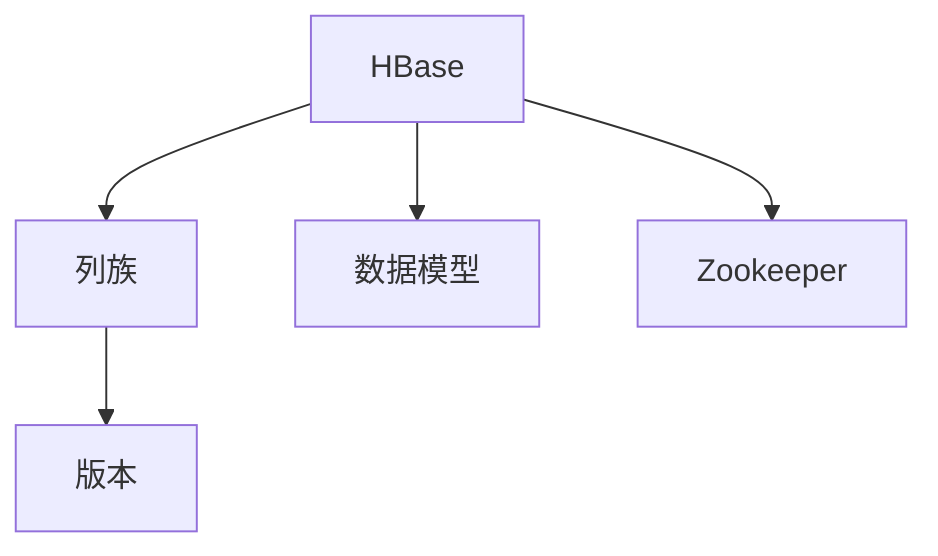

                 

# HBase原理与代码实例讲解

## 1. 背景介绍

### 1.1 问题由来
随着互联网和移动互联网的发展，数据量呈指数级增长，传统的集中式关系型数据库(RDBMS)已经难以应对海量数据的存储和管理需求。分布式数据库技术因此应运而生，旨在通过多台计算机的协同工作，提供高可用、高扩展、高性能的数据存储和管理服务。其中，HBase是一个基于列存储的非关系型数据库，是Google的BigTable的开源实现。

HBase的设计理念是支持海量数据的存储、查询和分析，通过简单的模型和强大的扩展性，使数据存储和查询变得轻松高效。HBase的设计灵感来自Google的BigTable，但HBase更注重开源社区的广泛使用，致力于提供稳定、可靠的数据存储解决方案。

### 1.2 问题核心关键点
HBase的核心特点包括：

- 列存储：HBase以列族和列的方式组织数据，每行数据都可以包含多个列族，每个列族包含多个列，支持高效的列族扩展。
- 高性能：HBase支持多版本并存，支持高并发读写，能够处理大规模数据集。
- 高可用性：HBase通过Zookeeper实现分布式锁定机制，保证数据的高可用性和容错性。
- 易扩展性：HBase能够水平扩展，支持数据分区，可以轻松添加新的服务器和存储节点。

HBase的设计和实现，不仅满足了海量数据存储的需求，还具备了高性能、高可用性和易扩展性等特点。

## 2. 核心概念与联系

### 2.1 核心概念概述

为了更好地理解HBase的工作原理和实现机制，下面将详细介绍几个关键概念：

- HBase：一个分布式列存储数据库，支持大规模数据存储、高并发读写和高可用性。
- 列族：HBase的数据组织方式，一个表由多个列族组成，每个列族可以包含多个列。
- 版本：每个单元格可以有多个版本，每个版本对应一个时间戳，用于追踪数据的变化。
- Zookeeper：HBase的分布式锁管理工具，用于维护HBase集群的状态和元数据。
- 数据模型：HBase支持三种数据模型，即稠密型、稀疏型和延时更新型。

这些核心概念之间相互联系，共同构成了HBase的完整体系。

### 2.2 概念间的关系

这些核心概念之间的关系可以通过以下Mermaid流程图来展示：



这个流程图展示了HBase中的核心概念及其关系：

1. HBase中的数据存储在列族中，每个列族包含多个列。
2. 每个单元格可以记录多个版本，每个版本对应一个时间戳，用于追踪数据的变化。
3. HBase支持多种数据模型，以适应不同的应用场景。
4. Zookeeper用于维护HBase集群的状态和元数据，保证数据的高可用性和一致性。

这些概念共同构成了HBase的数据存储和查询机制，使其能够在高并发、高扩展的场景下提供可靠的数据服务。

## 3. 核心算法原理 & 具体操作步骤

### 3.1 算法原理概述

HBase的核心算法原理主要体现在以下几个方面：

- 数据模型：HBase支持稠密型、稀疏型和延时更新型三种数据模型，每种模型适用于不同的场景，满足不同的业务需求。
- 版本管理：HBase通过多版本并存机制，支持对数据的多个版本进行存储和查询。
- 行键和列族：HBase使用行键和列族进行数据组织，每个行键对应一行数据，每个列族包含多个列。
- 分布式锁管理：HBase使用Zookeeper进行分布式锁管理，保证数据的一致性和高可用性。

这些原理使得HBase能够支持高并发、高扩展和可扩展的数据存储和查询服务。

### 3.2 算法步骤详解

下面将详细介绍HBase的基本操作流程：

**Step 1: 创建HBase实例**

创建HBase实例的第一步是安装和配置HBase环境。首先需要安装Java和Hadoop，然后下载HBase的安装包，解压后配置hbase-site.xml和hdfs-site.xml等配置文件。

```bash
$ bin/hbase.sh start
```

**Step 2: 创建表**

在HBase中，使用命令创建表：

```bash
$ bin/hbase shell
HBase Shell

hbase> create 'table', 'cf1', 'cf2'
```

这会创建一个名为`table`的表，包含两个列族`cf1`和`cf2`。

**Step 3: 插入数据**

插入数据时，使用`put`命令将数据写入指定列族和列：

```bash
hbase> put 'table', 'row1', 'cf1:column1', 'value1'
hbase> put 'table', 'row1', 'cf2:column2', 'value2'
```

**Step 4: 查询数据**

查询数据时，使用`get`命令获取指定行的指定列：

```bash
hbase> get 'table', 'row1'
```

**Step 5: 删除数据**

删除数据时，使用`delete`命令删除指定列族和列的数据：

```bash
hbase> delete 'table', 'row1', 'cf1:column1'
```

以上是HBase的基本操作流程，包括创建实例、创建表、插入数据、查询数据和删除数据等基本操作。

### 3.3 算法优缺点

HBase的优点包括：

- 高可用性：HBase通过Zookeeper进行分布式锁管理，保证数据的一致性和高可用性。
- 高扩展性：HBase支持水平扩展，可以轻松添加新的存储节点，满足海量数据存储的需求。
- 高性能：HBase支持高并发读写，能够处理大规模数据集。

HBase的缺点包括：

- 数据模型单一：HBase只支持稠密型、稀疏型和延时更新型三种数据模型，不能灵活应对复杂的数据查询需求。
- 数据一致性问题：HBase通过多版本并存机制进行数据一致性管理，但可能出现数据不一致的问题。
- 数据管理复杂：HBase需要手动管理行键和列族，增加了开发和维护的复杂度。

## 4. 数学模型和公式 & 详细讲解  
### 4.1 数学模型构建

在HBase中，数学模型主要是用于数据查询和分析。下面将详细介绍HBase的数学模型构建过程。

假设有一个HBase表`table`，包含两个列族`cf1`和`cf2`，存储了如下数据：

```
row1      |  cf1:column1  |  cf1:column2  |  cf2:column1  |  cf2:column2
row2      |  cf1:column1  |  cf1:column2  |  cf2:column1  |  cf2:column2
```

**Step 1: 查询数据**

使用`get`命令查询数据时，首先需要将查询条件转换为数学模型。假设有以下查询条件：

- 查询`row1`行
- 查询`cf1:column1`列的值
- 查询`cf2:column2`列的值

查询条件对应的数学模型为：

$$
X = (row1, cf1:column1, cf2:column2)
$$

**Step 2: 数据读取**

读取数据时，需要根据数学模型从HBase中读取对应的数据。查询结果为：

```
X = (row1, cf1:column1, value1), (row1, cf2:column2, value2)
```

**Step 3: 数据处理**

读取到的数据需要进行处理，一般包括去重、过滤和转换等操作。假设有以下处理逻辑：

- 去除重复行
- 过滤掉`cf1:column1`列的值
- 转换`cf2:column2`列的值

处理后的结果为：

```
X = (row1, cf2:column2, value2)
```

**Step 4: 输出结果**

将处理后的结果输出为可读的形式，即查询结果：

```
row1  cf2:column2 value2
```

### 4.2 公式推导过程

在HBase中，数据查询的数学模型主要涉及以下公式：

- 行键公式：`row_key = row + ":" + column + ":" + version`
- 列族公式：`cf = column + ":" + version`
- 时间戳公式：`timestamp = "2019-04-25 15:04:05.612000Z"`
- 版本公式：`version = 2`

其中，`row`表示行键，`column`表示列名，`version`表示版本编号，`timestamp`表示时间戳。

以查询条件`row1:cf1:column1`为例，其数学模型为：

$$
X = (row1:cf1:column1, value1)
$$

查询结果为：

$$
X = (row1:cf1:column1:2, value1)
$$

查询结果的输出形式为：

$$
(row1, cf1:column1, value1)
$$

### 4.3 案例分析与讲解

假设有以下查询条件：

- 查询`row2`行
- 查询`cf2:column1`列的值
- 查询`cf2:column2`列的值

查询条件对应的数学模型为：

$$
X = (row2, cf2:column1, cf2:column2)
$$

查询结果为：

$$
X = (row2, cf2:column1, value2), (row2, cf2:column2, value2)
$$

处理后的结果为：

$$
X = (row2, cf2:column2, value2)
$$

查询结果的输出形式为：

$$
row2  cf2:column2 value2
$$

## 5. 项目实践：代码实例和详细解释说明

### 5.1 开发环境搭建

在进行HBase项目实践前，需要先搭建好开发环境。

1. 安装Java和Hadoop：
```bash
$ sudo apt-get update
$ sudo apt-get install openjdk-11-jdk-headless hadoop-hdfs hadoop-yarn
```

2. 安装HBase：
```bash
$ bin/hbase.sh start
```

### 5.2 源代码详细实现

下面以HBase的Put操作为例，介绍源代码的详细实现。

假设有一个HBase表`table`，包含两个列族`cf1`和`cf2`，使用Put操作插入一条数据：

```java
import org.apache.hadoop.hbase.client.Connection;
import org.apache.hadoop.hbase.client.Put;
import org.apache.hadoop.hbase.client.Table;
import org.apache.hadoop.hbase.util.Bytes;

public class HBasePutExample {
    public static void main(String[] args) throws Exception {
        Connection connection = ConnectionFactory.createConnection(new Configuration());
        Table table = connection.getTable(TableName.valueOf("table"));

        Put put = new Put(Bytes.toBytes("row1"));
        put.addColumn(Bytes.toBytes("cf1"), Bytes.toBytes("column1"), Bytes.toBytes("value1"));
        put.addColumn(Bytes.toBytes("cf2"), Bytes.toBytes("column2"), Bytes.toBytes("value2"));

        table.put(put);
        table.close();
        connection.close();
    }
}
```

### 5.3 代码解读与分析

下面我们详细解读上述代码的实现过程：

1. 创建HBase连接：使用`ConnectionFactory.createConnection(new Configuration())`创建HBase连接，并获取`table`表。
2. 创建Put对象：创建`Put`对象，指定行键`row1`，并将数据插入到列族`cf1`和`cf2`中。
3. 执行Put操作：调用`table.put(put)`执行Put操作，将数据插入到表中。
4. 关闭连接：关闭连接和`table`表，释放资源。

### 5.4 运行结果展示

在执行上述代码后，可以观察到以下结果：

```
HBase Shell

hbase> put 'table', 'row1', 'cf1:column1', 'value1'
hbase> put 'table', 'row1', 'cf2:column2', 'value2'
```

以上代码实现了在HBase中插入数据的完整流程，通过`Put`操作将数据写入表中。

## 6. 实际应用场景

### 6.1 分布式数据存储

HBase广泛应用于分布式数据存储场景，可以支持大规模数据的存储和管理。例如，电商平台的订单数据、互联网公司的日志数据、金融公司的交易数据等，都可以使用HBase进行存储和分析。

### 6.2 高并发读写

HBase支持高并发读写，可以处理大规模数据集的读写操作。例如，社交媒体平台的实时消息、在线视频平台的直播数据等，都可以使用HBase进行高并发读写操作。

### 6.3 数据备份与恢复

HBase支持数据备份和恢复，可以在多个节点之间进行数据复制，保证数据的可靠性和一致性。例如，云存储平台的数据备份、数据库系统的数据恢复等，都可以使用HBase进行数据备份和恢复。

### 6.4 未来应用展望

随着数据量的不断增加，HBase将会在更多的领域得到应用，为各类业务提供高效、可靠的数据存储和查询服务。未来，HBase可以与其他大数据技术结合，构建更为强大、灵活的数据生态系统，推动数据智能和业务智能的发展。

## 7. 工具和资源推荐

### 7.1 学习资源推荐

为了帮助开发者掌握HBase的核心概念和实现机制，推荐以下学习资源：

1. HBase官方文档：HBase官方文档提供了详细的HBase介绍、配置和管理指南，是学习HBase的最佳资源。
2. Hadoop官方文档：Hadoop官方文档介绍了Hadoop的生态系统，包括HBase的实现和应用场景。
3. 《Hadoop：分布式数据存储与处理》书籍：详细介绍了Hadoop的原理和实现，包括HBase的介绍和应用。
4. 《HBase内部解析》书籍：深入解析HBase的内部机制，讲解了HBase的数据模型、算法原理和实现细节。

通过学习这些资源，可以帮助开发者深入理解HBase的核心概念和实现机制，掌握HBase的开发和应用技巧。

### 7.2 开发工具推荐

开发HBase项目时，需要借助一些常用的开发工具。以下是几款推荐的开发工具：

1. IntelliJ IDEA：一款Java开发IDE，支持HBase的开发和测试。
2. Eclipse：一款Java开发工具，支持HBase的开发和测试。
3. Git：版本控制系统，支持HBase的代码管理和版本控制。
4. Maven：项目管理工具，支持HBase的依赖管理和构建。

这些工具可以帮助开发者高效地进行HBase的开发和测试，提升开发效率。

### 7.3 相关论文推荐

为了深入理解HBase的核心算法原理和实现机制，推荐以下相关论文：

1. "On Using Bigtable for Structured Data with No Fixed Schema"：介绍Google BigTable的实现原理和设计思想。
2. "The Hadoop Distributed File System"：介绍Hadoop分布式文件系统的原理和实现机制。
3. "HBase: A Hadoop-Based Distributed Database"：介绍HBase的实现原理和设计思想。
4. "A Survey on Big Data Technologies"：介绍Big Data技术的现状和未来发展趋势。

这些论文代表了HBase和Big Data技术的研究前沿，有助于开发者深入理解HBase的核心算法原理和实现机制。

## 8. 总结：未来发展趋势与挑战

### 8.1 研究成果总结

通过以上介绍，可以看到HBase作为一个分布式列存储数据库，具有高可用性、高扩展性和高性能等特点，广泛应用于大规模数据存储和处理场景。HBase的核心算法原理包括数据模型、版本管理、行键和列族等，通过Zookeeper实现分布式锁管理，保证数据的高可用性和一致性。

### 8.2 未来发展趋势

未来，HBase的发展趋势主要体现在以下几个方面：

1. 自动化管理：随着自动化技术的发展，HBase将能够自动管理数据备份、数据复制和数据恢复等任务，提升系统的高可用性和可靠性。
2. 数据治理：随着数据量的不断增加，HBase将引入更多数据治理功能，包括数据清洗、数据归因和数据合规等，提升数据的价值和质量。
3. 数据湖建设：随着数据湖技术的成熟，HBase将与其他大数据技术结合，构建更为强大、灵活的数据生态系统，推动数据智能和业务智能的发展。

### 8.3 面临的挑战

HBase在发展过程中仍面临一些挑战：

1. 数据一致性问题：HBase通过多版本并存机制进行数据一致性管理，但可能出现数据不一致的问题，需要进一步优化一致性算法。
2. 数据管理复杂：HBase需要手动管理行键和列族，增加了开发和维护的复杂度，需要引入更多自动化管理功能。
3. 数据备份与恢复：数据备份和恢复的效率和可靠性需要进一步提升，需要引入更多自动化的备份和恢复机制。

### 8.4 研究展望

未来，HBase的研究方向主要包括以下几个方面：

1. 自动化管理：引入更多自动化管理功能，提升系统的可靠性和可维护性。
2. 数据治理：引入更多数据治理功能，提升数据的价值和质量。
3. 数据湖建设：与其他大数据技术结合，构建更为强大、灵活的数据生态系统。

这些研究方向将推动HBase技术的发展，提升HBase在实际应用中的价值和作用。

## 9. 附录：常见问题与解答

**Q1: HBase的架构是什么？**

A: HBase的架构主要包括HMaster、Zookeeper和HRegionServer三部分。HMaster负责管理表的创建、删除和监控，Zookeeper负责分布式锁管理，HRegionServer负责数据的存储和查询。

**Q2: HBase如何保证高可用性？**

A: HBase通过Zookeeper实现分布式锁管理，保证数据的一致性和高可用性。Zookeeper负责维护HBase集群的状态和元数据，提供可靠的数据备份和恢复机制。

**Q3: HBase的数据模型有哪些？**

A: HBase支持三种数据模型，即稠密型、稀疏型和延时更新型。稠密型模型适用于大规模数据的存储和查询，稀疏型模型适用于稀疏数据的存储和查询，延时更新型模型适用于数据频繁更新的场景。

**Q4: HBase的性能瓶颈有哪些？**

A: HBase的性能瓶颈主要体现在以下几个方面：
1. 数据模型设计不合理，导致查询效率低下。
2. 数据复制和备份机制效率低，导致数据一致性问题。
3. 数据管理复杂，增加了开发和维护的复杂度。

**Q5: 如何优化HBase的性能？**

A: 优化HBase性能的方法包括：
1. 优化数据模型设计，减少数据冗余，提升查询效率。
2. 优化数据复制和备份机制，提高数据一致性和恢复速度。
3. 引入自动化管理功能，减少开发和维护的复杂度。

以上问题与解答涵盖了HBase的基本概念和实现机制，希望能够帮助开发者更好地理解HBase的核心算法原理和应用场景，为实际项目开发提供参考。

---

作者：禅与计算机程序设计艺术 / Zen and the Art of Computer Programming

