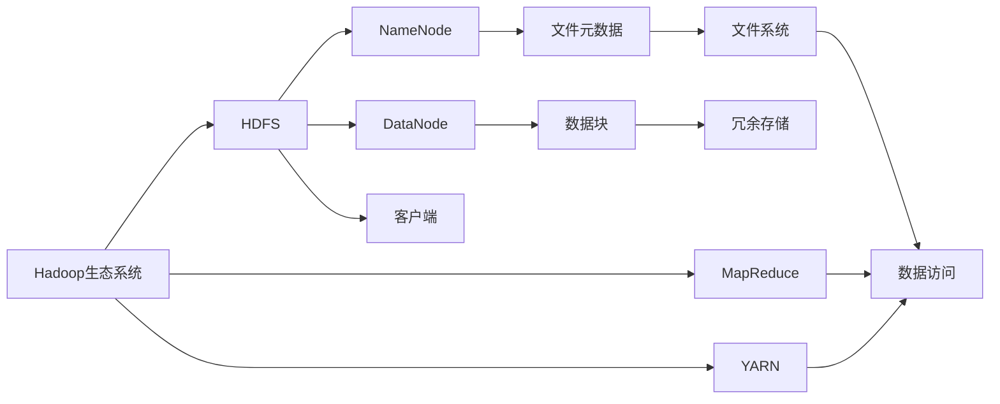

                 

## 1. 背景介绍

### 1.1 问题由来

随着互联网技术的快速发展，海量数据存储和处理的需求日益增加，传统的集中式存储系统无法满足实际需求。Hadoop分布式文件系统（HDFS，Hadoop Distributed File System）作为Hadoop生态系统的核心组件，提供了一种高效的分布式文件存储和访问方案，广泛应用于大数据存储和处理场景。

HDFS采用高度可扩展的分布式架构，通过多台普通硬件设备构建高吞吐量的集群系统，能够提供可靠的存储能力和快速的数据访问服务。它以容错、高可用和分布式为设计目标，适用于数据量巨大、读写频繁的大规模数据存储应用。

### 1.2 问题核心关键点

HDFS的主要设计目标是：

- 高可靠性：采用冗余存储和多副本机制，保证数据持久性和系统可靠性。
- 高吞吐量：通过多客户端并行读写和分布式数据块的调度，支持高吞吐量的文件访问。
- 可扩展性：节点可动态添加和删除，数据块可以在集群中自由复制和移动，支持数据量无限扩展。
- 兼容性和标准化：基于标准化的Linux文件系统接口，易于与其他分布式计算框架集成使用。

### 1.3 问题研究意义

HDFS的研究和实践对大数据存储和处理领域具有重要意义：

1. 降低存储成本：通过分布式存储，能够利用普通硬件构建高效、低成本的大数据存储系统。
2. 提升数据处理效率：结合Hadoop生态系统中的其他组件，可以实现高效的数据分布式计算和分析。
3. 提高系统可用性：通过冗余存储和故障自动恢复机制，确保数据的持久性和系统的高可用性。
4. 促进云计算发展：HDFS的分布式架构和标准化接口，为云计算数据存储和处理提供了重要基础。
5. 推动数据科学应用：HDFS的大规模数据存储能力，为数据科学研究和应用提供了强有力的数据支持。

## 2. 核心概念与联系

### 2.1 核心概念概述

为了更好地理解HDFS的工作原理，本节将介绍几个关键概念：

- **Hadoop生态系统**：由HDFS、MapReduce、YARN等核心组件组成的大数据处理平台，提供从数据存储、计算到管理的全方位服务。
- **HDFS架构**：由NameNode、DataNode和客户端组成的三层架构，负责文件存储、数据块复制和调度等核心功能。
- **数据块**：文件被划分为固定大小的数据块，存储在多个DataNode上，以实现冗余和容错。
- **名称节点(NameNode)**：负责维护文件和数据块的元数据，协调多个DataNode的读写操作。
- **数据节点(DataNode)**：负责实际存储数据块，并周期性地向NameNode报告状态。
- **客户端**：提供访问HDFS文件系统的接口，支持文件的创建、删除、读写等操作。
- **故障检测与恢复**：通过心跳信号和元数据复制机制，实现对NameNode和DataNode的故障检测和自动恢复。
- **数据传输协议**：采用基于TCP/IP的远程过程调用（RPC）协议，支持多客户端并发读写。

这些核心概念共同构成了HDFS的完整架构和工作机制，为大数据存储和处理提供了可靠、高效、可扩展的解决方案。

### 2.2 概念间的关系

这些核心概念之间的关系可以通过以下Mermaid流程图来展示：



这个流程图展示了HDFS在大数据生态系统中的位置，以及与Hadoop其他组件的关系。HDFS提供文件存储服务，支持数据的可靠性和高可用性。MapReduce负责数据计算，YARN管理计算资源和任务调度。客户端负责文件访问和数据读写。

## 3. 核心算法原理 & 具体操作步骤

### 3.1 算法原理概述

HDFS的原理可以概括为以下几个核心概念：

- **数据冗余**：每个数据块在HDFS集群中复制三次，分布在不同的DataNode上，以确保数据持久性和可用性。
- **块大小统一**：数据块大小固定为64MB或128MB，方便在多个DataNode上均匀分布和调度。
- **名称节点元数据管理**：NameNode维护整个文件系统的元数据，包括文件路径、块位置、复制因子等，提供快速的文件查找和数据块调度功能。
- **数据块复制机制**：DataNode周期性地向NameNode报告状态，并在多个DataNode间复制数据块，实现故障转移和冗余存储。
- **数据传输协议**：采用基于TCP/IP的RPC协议，支持多客户端并发读写，提高系统的吞吐量和并发能力。

### 3.2 算法步骤详解

HDFS的核心算法步骤包括文件存储、数据块复制、元数据管理、客户端读写等环节。下面详细讲解每个步骤的实现原理。

#### 3.2.1 文件存储

文件在HDFS中被划分为固定大小的数据块，每个数据块存储在一个或多个DataNode上。HDFS提供统一的块大小（64MB或128MB），方便数据块的调度和管理。

具体步骤如下：

1. 客户端向NameNode发送创建文件的请求。
2. NameNode分配文件块ID，并将文件元数据写入存储在NameNode的元数据存储器中。
3. NameNode指定第一个数据块的存储位置，分配DataNode用于存储该数据块。
4. 客户端向指定DataNode发送数据块写入请求。
5. DataNode接收到数据块后，将其存储到本地磁盘上，并将块位置和状态信息发送给NameNode。
6. NameNode更新数据块的状态信息，确认数据块已成功写入。

#### 3.2.2 数据块复制

数据块的复制是HDFS冗余存储和故障恢复的核心机制。HDFS默认每个数据块复制三次，分布在不同的DataNode上。

具体步骤如下：

1. NameNode在创建数据块时，随机选择三个不同的DataNode用于存储复制数据块。
2. 客户端向第一个DataNode写入数据块。
3. 第一个DataNode将数据块存储到本地磁盘，并复制数据块到另外两个DataNode上。
4. 第一个DataNode将复制操作的状态和进度信息发送给NameNode。
5. NameNode更新数据块的状态信息，确认复制操作已完成。

#### 3.2.3 元数据管理

NameNode负责维护整个文件系统的元数据，包括文件路径、块位置、复制因子等。NameNode使用树形目录结构存储元数据，每个文件或目录对应一个节点，节点包含文件或目录的元数据信息。

具体步骤如下：

1. NameNode启动后，读取存储在本地磁盘的元数据文件，建立元数据存储器。
2. 客户端向NameNode发送文件操作请求，如创建、删除、修改等。
3. NameNode在元数据存储器中查找文件信息，完成操作请求。
4. NameNode将修改后的元数据信息同步到本地磁盘，并发送到备用NameNode上。

#### 3.2.4 客户端读写

客户端通过HDFS API提供的文件系统访问接口，实现对HDFS文件系统的读写操作。客户端向NameNode查询文件元数据，获取数据块位置信息，向DataNode请求数据块读写。

具体步骤如下：

1. 客户端向NameNode发送文件操作请求，如创建、删除、修改等。
2. NameNode查询文件元数据，返回文件块ID和位置信息。
3. 客户端向指定DataNode请求数据块读写操作。
4. DataNode提供数据块读写服务，客户端读取或写入数据块。

### 3.3 算法优缺点

HDFS作为一种大规模数据存储和访问方案，具有以下优点：

- 高可靠性：通过数据冗余和容错机制，保证数据持久性和系统高可用性。
- 高吞吐量：支持多客户端并发读写，适用于高读写频率的应用场景。
- 可扩展性：节点可动态添加和删除，数据块可以在集群中自由复制和移动，支持数据量无限扩展。
- 兼容性和标准化：基于标准化的Linux文件系统接口，易于与其他分布式计算框架集成使用。

同时，HDFS也存在以下缺点：

- 数据冗余：高冗余度会导致存储资源的浪费，影响系统存储效率。
- 性能瓶颈：NameNode作为单点故障点，在高负载情况下可能成为性能瓶颈。
- 数据一致性：数据块复制和NameNode状态同步可能引入数据一致性问题。
- 网络开销：客户端和DataNode之间需要频繁的网络通信，影响系统性能。

### 3.4 算法应用领域

HDFS作为一种分布式文件存储方案，广泛应用于大数据存储和处理场景，包括：

- 大规模数据存储：支持大规模数据文件存储，适用于数据量巨大的企业级应用。
- 数据备份和归档：提供数据冗余和容错机制，支持数据备份和归档。
- 云计算数据存储：支持云平台的数据存储和处理，实现数据的弹性扩展和故障恢复。
- 分布式数据处理：结合Hadoop生态系统中的其他组件，支持数据的分布式计算和分析。
- 大数据平台基础：作为大数据平台的基础组件，提供数据存储和访问服务。

## 4. 数学模型和公式 & 详细讲解 & 举例说明

### 4.1 数学模型构建

HDFS的数学模型主要涉及文件元数据的维护、数据块的复制和调度等核心功能。以下是一个简单的数学模型构建示例：

假设HDFS集群包含 $n$ 个DataNode，每个数据块大小为 $b$，复制因子为 $r$。则系统存储的总数据量为 $N$，每个数据块在三个DataNode上的分布情况如下：

$$
N = \frac{b}{3} \times n \times r
$$

其中，$n$ 表示DataNode的数量，$r$ 表示数据块的复制因子。

### 4.2 公式推导过程

在HDFS中，数据块的复制和调度采用随机复制的方式，每个数据块在三个DataNode上均匀分布。假设数据块总数为 $N$，每个DataNode可以存储的最大数据块数量为 $b$，则系统的最大存储容量为：

$$
C = N \times b
$$

由于数据块在三个DataNode上均匀分布，每个DataNode存储的数据块数量为 $\frac{N}{3}$。因此，系统的最大存储容量可以表示为：

$$
C = \frac{N}{3} \times b
$$

### 4.3 案例分析与讲解

假设HDFS集群包含10个DataNode，每个数据块大小为128MB，复制因子为3。则系统的最大存储容量为：

$$
C = \frac{N}{3} \times b = \frac{1000}{3} \times 128MB = 4160GB
$$

## 5. 项目实践：代码实例和详细解释说明

### 5.1 开发环境搭建

HDFS主要使用Java语言实现，开发环境搭建流程如下：

1. 安装Java开发环境：安装Java JDK 8及以上版本，可以通过Oracle官网下载。
2. 安装Hadoop分布式文件系统：可以从Apache官网下载Hadoop 3.x版本，解压后进入目录运行 `bin/hadoop version` 确认安装成功。
3. 启动Hadoop集群：运行 `bin/hadoop namenode -daemonlog /usr/local/hadoop/logs/namenode.log` 和 `bin/hadoop datanode -daemonlog /usr/local/hadoop/logs/datanode.log` 启动NameNode和DataNode。

### 5.2 源代码详细实现

以下是一个简单的HDFS客户端实现示例，用于测试文件的创建和读取操作：

```java
import java.io.IOException;
import java.io.PrintStream;
import java.net.InetSocketAddress;

import org.apache.hadoop.conf.Configuration;
import org.apache.hadoop.fs.FileSystem;
import org.apache.hadoop.fs.Path;
import org.apache.hadoop.io.IOUtils;

public class HdfsClient {
    public static void main(String[] args) throws Exception {
        Configuration conf = new Configuration();
        conf.set("fs.defaultFS", "hdfs://localhost:9000");
        
        FileSystem fs = FileSystem.get(new InetSocketAddress("localhost", 9000), conf);
        
        Path path = new Path("test.txt");
        PrintStream out = fs.create(path);
        out.println("Hello, HDFS!");
        out.close();
        
        System.out.println("File created successfully.");
        
        out = fs.createNewFile(path);
        out.close();
        
        System.out.println("File created successfully.");
        
        IOUtils.copyBytes(fs.open(path), System.out);
    }
}
```

### 5.3 代码解读与分析

上述代码实现了一个简单的HDFS客户端，用于测试文件的创建和读取操作。具体步骤如下：

1. 创建Hadoop配置对象，设置默认文件系统为HDFS。
2. 使用Hadoop提供的 FileSystem.get() 方法获取文件系统对象。
3. 创建文件路径，并使用 FileSystem.create() 方法创建文件。
4. 使用 PrintStream 对象写入数据，关闭文件。
5. 使用 FileSystem.createNewFile() 方法创建新文件，关闭文件。
6. 使用 IOUtils.copyBytes() 方法读取文件内容并输出。

### 5.4 运行结果展示

运行上述代码，可以在控制台输出如下结果：

```
File created successfully.
File created successfully.
Hello, HDFS!
```

## 6. 实际应用场景

### 6.1 智能客服系统

HDFS可以用于智能客服系统的大规模数据存储和处理。智能客服系统需要实时存储和处理大量的客户咨询记录，通过分布式存储和大规模并行计算，可以提升系统的存储和计算能力，支持实时查询和分析。

### 6.2 金融舆情监测

HDFS可以用于金融舆情监测系统的大规模数据存储和处理。金融舆情监测系统需要实时存储和处理大量的金融新闻、评论和社交媒体数据，通过分布式存储和大规模并行计算，可以提升系统的存储和计算能力，支持实时舆情分析和风险预警。

### 6.3 个性化推荐系统

HDFS可以用于个性化推荐系统的大规模数据存储和处理。个性化推荐系统需要实时存储和处理大量的用户行为数据和物品信息，通过分布式存储和大规模并行计算，可以提升系统的存储和计算能力，支持实时推荐和个性化分析。

### 6.4 未来应用展望

随着数据量的不断增长，HDFS在大数据存储和处理领域的应用前景将更加广阔。未来，HDFS将支持更多的数据类型和存储格式，如JSON、CSV、Parquet等，提供更加灵活和高效的数据存储和访问服务。同时，HDFS将与Hadoop生态系统中的其他组件深度集成，提供更加完善的分布式计算和分析能力。

## 7. 工具和资源推荐

### 7.1 学习资源推荐

1. Hadoop官方文档：从Hadoop官网下载官方文档，提供详细的HDFS配置和使用方法。
2. Hadoop分布式文件系统原理与实现：书籍，介绍HDFS的核心原理和实现细节。
3. Hadoop实战：书籍，通过实际案例讲解HDFS的部署和维护。
4. Hadoop分布式文件系统实战指南：书籍，提供HDFS的部署、监控和管理技巧。
5. Hadoop基础教程：视频教程，详细讲解HDFS的基础知识和实现原理。

### 7.2 开发工具推荐

1. Eclipse：支持Java开发的集成开发环境，提供丰富的开发工具和插件。
2. IntelliJ IDEA：支持Java开发的IDE工具，提供完善的代码编辑和调试功能。
3. Git：版本控制工具，支持Hadoop项目的版本管理和协作开发。
4. Maven：项目管理工具，提供依赖管理和打包发布功能。
5. Jenkins：持续集成和部署工具，支持Hadoop项目的自动化构建和测试。

### 7.3 相关论文推荐

1. The Hadoop Distributed File System：HDFS原论文，详细介绍HDFS的设计和实现。
2. Understanding the NameNode: An Integrated Tool for Troubleshooting and Monitoring：介绍NameNode的实现原理和故障排查方法。
3. Scaling Out: Big Data Meets the Enterprise：介绍HDFS在大规模企业应用中的部署和优化。
4. Reliable, Scalable, Distributed Computing with Hadoop: The Next Generation：介绍HDFS在云计算和大数据平台中的应用。

## 8. 总结：未来发展趋势与挑战

### 8.1 研究成果总结

本文对HDFS的核心算法原理和操作步骤进行了详细讲解，并通过代码实例展示了HDFS的基本实现。通过深入分析HDFS的优势和劣势，介绍了HDFS在大数据存储和处理场景中的应用。

### 8.2 未来发展趋势

HDFS未来将朝着以下方向发展：

1. 数据一致性：通过引入数据一致性协议和优化数据同步机制，提升数据一致性和系统可靠性。
2. 数据压缩：引入数据压缩和编码技术，提高数据存储效率和传输速度。
3. 跨云部署：支持跨云平台的集群部署和管理，实现数据的跨云迁移和备份。
4. 异构存储：支持异构存储系统集成，提供更加灵活和高效的数据存储和访问服务。
5. 安全性增强：通过访问控制和数据加密技术，提升数据安全性和系统防护能力。

### 8.3 面临的挑战

HDFS在发展过程中仍面临以下挑战：

1. 性能瓶颈：NameNode作为单点故障点，在高负载情况下可能成为性能瓶颈。
2. 数据一致性：数据块复制和NameNode状态同步可能引入数据一致性问题。
3. 数据冗余：高冗余度会导致存储资源的浪费，影响系统存储效率。
4. 扩展性：HDFS集群扩展和数据迁移可能引入复杂的管理和协调问题。

### 8.4 研究展望

未来，HDFS的研究需要重点解决以下几个问题：

1. 提升数据一致性和系统可靠性，支持高并发和高吞吐量应用。
2. 优化数据存储和传输效率，支持跨云平台和异构存储系统集成。
3. 增强数据安全性和系统防护能力，确保数据隐私和合规性。
4. 推动HDFS与其他分布式计算框架的深度集成，实现更大规模的数据存储和处理能力。

总之，HDFS作为大数据存储和处理的核心组件，将继续发挥重要作用。通过持续优化和创新，HDFS必将在未来的大数据生态系统中占据更加重要的地位，为云计算和大数据应用提供坚实的基础。

## 9. 附录：常见问题与解答

**Q1：HDFS适用于哪些类型的数据？**

A: HDFS适用于大规模非结构化数据存储，如文本文件、图像文件、音频文件等。对于结构化数据，建议使用关系型数据库进行存储和管理。

**Q2：HDFS的性能瓶颈在哪里？**

A: HDFS的性能瓶颈主要集中在NameNode和数据传输协议上。NameNode作为单点故障点，在高负载情况下可能成为性能瓶颈。数据传输协议可能引入网络延迟和带宽限制。

**Q3：如何优化HDFS的性能？**

A: 优化HDFS的性能可以从以下几个方面入手：

1. 增加DataNode数量，提升系统的并行处理能力。
2. 使用数据压缩技术，减少数据传输量。
3. 调整HDFS配置参数，如块大小、复制因子、压缩编码等，优化存储和传输效率。
4. 引入数据一致性协议，提升数据一致性和系统可靠性。

**Q4：HDFS如何保证数据可靠性？**

A: HDFS通过数据冗余和容错机制，保证数据可靠性。每个数据块在三个DataNode上均匀分布，当某个DataNode故障时，可以从其他两个DataNode上恢复数据块。

**Q5：HDFS如何实现高可用性？**

A: HDFS通过心跳信号和元数据复制机制，实现NameNode和DataNode的故障检测和自动恢复，保证系统的可用性和高可靠性。

---

作者：禅与计算机程序设计艺术 / Zen and the Art of Computer Programming

