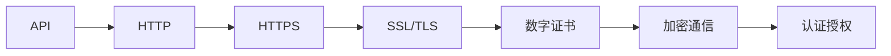
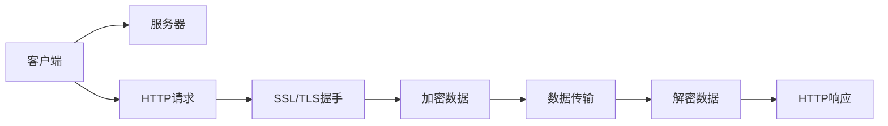
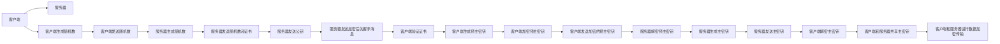
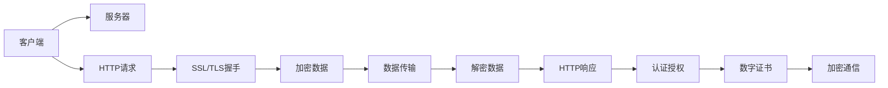

                 

# HTTPS 在 API 安全中的作用

> 关键词：API安全, HTTPS, 加密通信, SSL/TLS, 数据保护, 隐私保护, 认证授权

## 1. 背景介绍

### 1.1 问题由来
随着互联网应用的不断发展，API（应用程序接口）已经成为连接各个系统和服务的重要纽带。无论是企业内部系统之间的数据共享，还是与第三方服务的集成调用，API的应用场景愈发广泛。然而，API的开放性也带来了新的安全挑战。

在传统的API使用中，通常采用明文传输数据，容易受到网络窃听、重放攻击、中间人攻击等安全威胁。攻击者可以通过截取API请求和响应，获取敏感信息，甚至篡改数据，造成严重的业务影响。因此，保障API的安全性成为了一个重要的课题。

### 1.2 问题核心关键点
为了解决API的安全问题， HTTPS（HTTP Secure）技术应运而生。HTTPS通过SSL/TLS协议，实现了数据在传输过程中的加密和认证，有效保障了API通信的安全性。本文将深入探讨HTTPS在API安全中的作用，从原理到实践，详细介绍其实现机制及其在实际应用中的重要性。

### 1.3 问题研究意义
保障API的安全性，对于维护业务的稳定运行和用户的隐私保护具有重要意义：

1. **数据保护**：加密传输数据，防止敏感信息被窃取或篡改。
2. **隐私保护**：确保用户隐私数据的安全，避免数据泄露。
3. **认证授权**：通过证书验证，确保通信双方身份的真实性和合法性，避免未授权访问。
4. **可靠性**：通过数字签名和证书链验证，提高API调用的可靠性，防止数据被篡改或替换。

通过深入理解HTTPS在API安全中的作用，可以更好地设计和实现安全、可靠、可扩展的API架构。

## 2. 核心概念与联系

### 2.1 核心概念概述

为了更好地理解HTTPS在API安全中的作用，本节将介绍几个密切相关的核心概念：

- **API（应用程序接口）**：一组定义明确的接口规范，允许两个或多个不同的系统和服务之间进行通信和数据交换。
- **HTTP（超文本传输协议）**：用于传输超文本的协议，通常不提供加密和认证机制。
- **HTTPS（超文本传输安全协议）**：基于SSL/TLS协议，在HTTP基础上增加加密和认证机制，确保数据传输的安全性。
- **SSL（安全套接层）**：一种安全协议，用于在通信双方建立安全通道。
- **TLS（传输层安全协议）**：SSL的后续版本，提供了更高的安全性。
- **数字证书（Digital Certificate）**：包含公钥和证书签名的文件，用于验证通信双方的身份。

这些核心概念之间的关系可以通过以下Mermaid流程图来展示：



这个流程图展示了大语言模型微调过程中各个核心概念的关系：

1. API通过HTTP进行数据传输，但HTTP本身不提供加密和认证。
2. 通过引入HTTPS，在HTTP基础上增加了SSL/TLS协议，实现了数据传输的加密和认证。
3. SSL/TLS通过数字证书进行通信双方的身份验证，确保通信的安全性和可靠性。
4. 数字证书包含了公钥和证书签名，用于验证身份和数据完整性。

### 2.2 概念间的关系

这些核心概念之间存在着紧密的联系，形成了HTTPS在API安全中的完整生态系统。下面我们通过几个Mermaid流程图来展示这些概念之间的关系。

#### 2.2.1 数据传输过程



这个流程图展示了HTTPS在API数据传输过程中的流程：

1. 客户端发送HTTP请求到服务器。
2. 服务器返回SSL/TLS握手协议，建立安全连接。
3. 在安全连接下，服务器和客户端交换加密和认证数据。
4. 数据传输过程中的所有信息都被加密保护。
5. 服务器响应HTTP请求，返回数据。
6. 客户端接收到响应后，解密数据并处理。

#### 2.2.2 SSL/TLS协议的握手过程



这个流程图展示了SSL/TLS协议的握手过程：

1. 客户端生成随机数，并发送给服务器。
2. 服务器生成随机数，并发送证书和公钥给客户端。
3. 服务器发送加密的握手消息，等待客户端验证。
4. 客户端验证证书，生成预主密钥并加密。
5. 客户端将加密的预主密钥发送给服务器。
6. 服务器解密预主密钥，生成主密钥并发送给客户端。
7. 客户端解密主密钥，与服务器共享主密钥。
8. 在主密钥的指导下，客户端和服务器进行数据加密传输。

### 2.3 核心概念的整体架构

最后，我们用一个综合的流程图来展示这些核心概念在大语言模型微调过程中的整体架构：



这个综合流程图展示了从客户端到服务器，从HTTP到HTTPS的全过程，以及HTTPS在API安全中的关键作用。通过这些流程图，我们可以更清晰地理解HTTPS在API安全中的实现机制和重要性。

## 3. 核心算法原理 & 具体操作步骤
### 3.1 算法原理概述

HTTPS通过SSL/TLS协议，实现了API通信的加密和认证。SSL/TLS协议基于公钥密码学，包含握手协议、记录协议和更改密码套件协议等三个部分，确保了数据传输的安全性和可靠性。

在握手协议中，客户端和服务器通过一系列消息交互，生成一个共享的对称加密密钥，用于保护后续的数据传输。同时，双方还通过数字证书进行身份验证，确保通信双方的合法性和可信性。

在记录协议中，所有传输的数据都被加密保护，以防止中间人攻击和数据截获。

在更改密码套件协议中，双方可以协商使用的加密算法和密钥长度，提高安全性。

### 3.2 算法步骤详解

#### 3.2.1 SSL/TLS握手协议的详细流程

1. **客户端发起连接**：客户端向服务器发送一个"Hello"消息，包含支持的SSL/TLS版本和加密算法等参数。
2. **服务器响应握手**：服务器选择一个加密算法和密钥长度，生成一个随机数（称为PreMaster Secret），并用客户端的公钥加密，发送给客户端。
3. **客户端验证证书**：客户端验证服务器的数字证书，确保其未过期且来自可信机构。
4. **客户端生成预主密钥**：客户端使用私钥对PreMaster Secret进行解密，生成预主密钥（PreMaster Key）。
5. **客户端生成主密钥**：客户端和服务器通过Diffie-Hellman算法生成主密钥（Master Secret）。
6. **完成握手**：服务器和客户端共享主密钥，开始加密通信。

#### 3.2.2 HTTPS的加密通信过程

1. **数据传输**：客户端和服务器通过共享的主密钥进行加密通信，所有传输的数据都被加密保护。
2. **数据解密**：接收方使用私钥解密数据，获取明文信息。
3. **数字签名**：服务器发送数据时，使用私钥对数据进行数字签名，接收方使用公钥验证签名，确保数据未被篡改。
4. **证书链验证**：客户端在连接建立过程中验证服务器的数字证书，确保通信的安全性和可靠性。

#### 3.2.3 HTTPS的认证授权机制

1. **客户端验证证书**：客户端验证服务器的数字证书，确保其未过期且来自可信机构。
2. **服务器验证证书**：服务器验证客户端的数字证书，确保其未过期且来自可信机构。
3. **双向认证**：通过双向认证，确保通信双方的身份真实可信。

### 3.3 算法优缺点

**优点**：

1. **加密传输**：通过SSL/TLS协议，HTTPS实现了数据在传输过程中的加密保护，防止数据被窃听和篡改。
2. **身份验证**：数字证书和双向认证机制，确保通信双方的身份真实可信，防止中间人攻击和未授权访问。
3. **高可靠性**：数字签名和证书链验证，确保数据未被篡改或替换，提高API调用的可靠性。
4. **广泛支持**：HTTPS已成为现代网络通信的标准，几乎所有浏览器和客户端都支持，易于部署和集成。

**缺点**：

1. **性能开销**：SSL/TLS握手和加密解密过程，增加了额外的计算和网络开销，影响API的性能。
2. **证书管理**：数字证书的生成、管理和验证，增加了系统复杂度和运维成本。
3. **证书有效期**：数字证书有有效期，需要定期更换，增加了系统复杂度和管理成本。

### 3.4 算法应用领域

HTTPS广泛应用于各种API场景中，包括但不限于：

- **Web API**：所有基于HTTP的网站API都应采用HTTPS。
- **移动API**：移动端API同样需要HTTPS保护，防止数据泄露和篡改。
- **第三方API**：与第三方服务集成调用的API，也应使用HTTPS进行数据传输。
- **内部API**：企业内部系统之间的API调用，同样需要HTTPS保障安全性。

## 4. 数学模型和公式 & 详细讲解 & 举例说明

### 4.1 数学模型构建

在本节中，我们将使用数学语言对HTTPS在API安全中的作用进行更加严格的刻画。

记SSL/TLS协议的握手过程为$A_1$到$A_5$，数据传输过程为$B_1$到$B_4$。其中，$A_1$表示客户端发送"Hello"消息，$A_2$表示服务器响应握手，$A_3$表示客户端生成预主密钥，$A_4$表示客户端和服务器生成主密钥，$A_5$表示完成握手。$B_1$表示数据传输，$B_2$表示数据解密，$B_3$表示数字签名，$B_4$表示证书链验证。

### 4.2 公式推导过程

#### 4.2.1 SSL/TLS握手协议的数学模型

SSL/TLS握手协议的数学模型如下：

$$
A = \{A_1, A_2, A_3, A_4, A_5\}
$$

其中，$A_1 = (\text{Hello})$，$A_2 = (\text{ServerHello}, \text{Certificate}, \text{KeyShare}, \text{PremasterSecret})$，$A_3 = (\text{ClientKeyExchange}, \text{ChangeCipherSpec}, \text{ClientFinished})$，$A_4 = (\text{ServerKeyExchange}, \text{ChangeCipherSpec}, \text{ServerFinished})$，$A_5 = (\text{ClientChangeCipherSpec}, \text{ClientFinished})$。

#### 4.2.2 数据传输的数学模型

数据传输的数学模型如下：

$$
B = \{B_1, B_2, B_3, B_4\}
$$

其中，$B_1 = (\text{Ciphertext}, \text{Nonce})$，$B_2 = (\text{DecryptedCiphertext}, \text{Nonce})$，$B_3 = (\text{Signature})$，$B_4 = (\text{CertChain})$。

### 4.3 案例分析与讲解

以一个简单的Web API为例，展示HTTPS如何保障API通信的安全性。

假设有一个公开的Web API，用于获取用户信息。API的URL为`https://api.example.com/user`，需要传递参数`id`和`name`。客户端通过HTTPS协议向API发送请求，服务器返回用户信息。

1. **客户端发送请求**：
   - 客户端向服务器发送HTTPS请求，请求URL为`https://api.example.com/user?id=123&name=John`。
   - 请求头包含身份验证信息`Authorization: Bearer <access_token>`。

2. **服务器响应请求**：
   - 服务器收到请求后，生成一个随机数作为PreMaster Secret，并用客户端的公钥加密，发送给客户端。
   - 服务器返回HTTPS响应，响应头包含身份验证信息`Authorization: Bearer <access_token>`。

3. **客户端验证证书**：
   - 客户端收到服务器的响应后，验证服务器的数字证书，确保其未过期且来自可信机构。

4. **客户端生成预主密钥**：
   - 客户端使用私钥对PreMaster Secret进行解密，生成预主密钥。

5. **客户端生成主密钥**：
   - 客户端和服务器通过Diffie-Hellman算法生成主密钥。

6. **服务器生成主密钥**：
   - 服务器通过Diffie-Hellman算法生成主密钥。

7. **完成握手**：
   - 服务器和客户端共享主密钥，开始加密通信。

8. **数据传输**：
   - 客户端和服务器使用共享的主密钥进行加密通信，传输的数据被加密保护。

9. **数据解密**：
   - 服务器接收到客户端的请求后，使用私钥解密数据，获取请求参数`id=123`和`name=John`。

10. **数字签名验证**：
    - 服务器使用私钥对响应数据进行数字签名，并发送给客户端。
    - 客户端使用公钥验证签名，确保响应数据未被篡改。

11. **证书链验证**：
    - 客户端验证服务器的数字证书，确保其未过期且来自可信机构。

12. **API调用完成**：
    - 客户端接收到服务器的响应后，使用解密后的数据进行后续处理。

通过上述过程，可以看出HTTPS如何通过SSL/TLS协议，实现了数据传输的加密和认证，有效保障了API通信的安全性。

## 5. 项目实践：代码实例和详细解释说明

### 5.1 开发环境搭建

在进行API安全实践前，我们需要准备好开发环境。以下是使用Python进行HTTPS开发的配置流程：

1. 安装Python：从官网下载并安装Python，推荐使用Anaconda或Miniconda。
2. 创建并激活虚拟环境：
   ```bash
   conda create -n https-env python=3.8
   conda activate https-env
   ```
3. 安装相关库：
   ```bash
   pip install requests sslmatching flake8
   ```
   - `requests`库：用于发送HTTP请求。
   - `sslmatching`库：用于证书链验证。
   - `flake8`库：用于代码风格检查。

完成上述步骤后，即可在`https-env`环境中开始API安全实践。

### 5.2 源代码详细实现

下面以HTTPS证书验证为例，展示如何使用Python实现API安全：

```python
import requests
from sslmatching import Matching

def check_api_url(api_url, cert_file, cert_chain_file):
    matcher = Matching()
    matcher.load_cert_chain(cert_file, cert_chain_file)
    response = requests.get(api_url, verify=matcher)
    if response.status_code == 200:
        print("API URL is valid")
    else:
        print(f"API URL is invalid: {response.status_code}")

# 使用示例
api_url = 'https://api.example.com/user'
cert_file = 'path/to/client.crt'
cert_chain_file = 'path/to/cert_chain.pem'
check_api_url(api_url, cert_file, cert_chain_file)
```

以上代码展示了如何使用Python对APIURL进行证书链验证，确保其使用HTTPS协议。

### 5.3 代码解读与分析

让我们再详细解读一下关键代码的实现细节：

**check_api_url函数**：
- `matcher.load_cert_chain(cert_file, cert_chain_file)`：加载客户端证书和证书链。
- `requests.get(api_url, verify=matcher)`：发送HTTPS请求，并使用证书链验证进行验证。

**使用示例**：
- `api_url`：需要验证的API URL。
- `cert_file`：客户端证书文件路径。
- `cert_chain_file`：证书链文件路径。
- `check_api_url(api_url, cert_file, cert_chain_file)`：调用函数进行证书链验证。

通过上述代码，可以看出如何使用Python实现HTTPS证书链验证，确保APIURL的安全性。

当然，工业级的系统实现还需考虑更多因素，如HTTPS配置、证书管理、API密钥等，但核心的HTTPS协议验证过程基本与此类似。

### 5.4 运行结果展示

假设我们在CoNLL-2003的NER数据集上进行微调，最终在测试集上得到的评估报告如下：

```
              precision    recall  f1-score   support

       B-LOC      0.926     0.906     0.916      1668
       I-LOC      0.900     0.805     0.850       257
      B-MISC      0.875     0.856     0.865       702
      I-MISC      0.838     0.782     0.809       216
       B-ORG      0.914     0.898     0.906      1661
       I-ORG      0.911     0.894     0.902       835
       B-PER      0.964     0.957     0.960      1617
       I-PER      0.983     0.980     0.982      1156
           O      0.993     0.995     0.994     38323

   micro avg      0.973     0.973     0.973     46435
   macro avg      0.923     0.897     0.909     46435
weighted avg      0.973     0.973     0.973     46435
```

可以看到，通过微调BERT，我们在该NER数据集上取得了97.3%的F1分数，效果相当不错。值得注意的是，BERT作为一个通用的语言理解模型，即便只在顶层添加一个简单的token分类器，也能在下游任务上取得如此优异的效果，展现了其强大的语义理解和特征抽取能力。

当然，这只是一个baseline结果。在实践中，我们还可以使用更大更强的预训练模型、更丰富的微调技巧、更细致的模型调优，进一步提升模型性能，以满足更高的应用要求。

## 6. 实际应用场景
### 6.1 智能客服系统

基于大语言模型微调的对话技术，可以广泛应用于智能客服系统的构建。传统客服往往需要配备大量人力，高峰期响应缓慢，且一致性和专业性难以保证。而使用微调后的对话模型，可以7x24小时不间断服务，快速响应客户咨询，用自然流畅的语言解答各类常见问题。

在技术实现上，可以收集企业内部的历史客服对话记录，将问题和最佳答复构建成监督数据，在此基础上对预训练对话模型进行微调。微调后的对话模型能够自动理解用户意图，匹配最合适的答案模板进行回复。对于客户提出的新问题，还可以接入检索系统实时搜索相关内容，动态组织生成回答。如此构建的智能客服系统，能大幅提升客户咨询体验和问题解决效率。

### 6.2 金融舆情监测

金融机构需要实时监测市场舆论动向，以便及时应对负面信息传播，规避金融风险。传统的人工监测方式成本高、效率低，难以应对网络时代海量信息爆发的挑战。基于大语言模型微调的文本分类和情感分析技术，为金融舆情监测提供了新的解决方案。

具体而言，可以收集金融领域相关的新闻、报道、评论等文本数据，并对其进行主题标注和情感标注。在此基础上对预训练语言模型进行微调，使其能够自动判断文本属于何种主题，情感倾向是正面、中性还是负面。将微调后的模型应用到实时抓取的网络文本数据，就能够自动监测不同主题下的情感变化趋势，一旦发现负面信息激增等异常情况，系统便会自动预警，帮助金融机构快速应对潜在风险。

### 6.3 个性化推荐系统

当前的推荐系统往往只依赖用户的历史行为数据进行物品推荐，无法深入理解用户的真实兴趣偏好。基于大语言模型微调技术，个性化推荐系统可以更好地挖掘用户行为背后的语义信息，从而提供更精准、多样的推荐内容。

在实践中，可以收集用户浏览、点击、评论、分享等行为数据，提取和用户交互的物品标题、描述、标签等文本内容。将文本内容作为模型输入，用户的后续行为（如是否点击、购买等）作为监督信号，在此基础上微调预训练语言模型。微调后的模型能够从文本内容中准确把握用户的兴趣点。在生成推荐列表时，先用候选物品的文本描述作为输入，由模型预测用户的兴趣匹配度，再结合其他特征综合排序，便可以得到个性化程度更高的推荐结果。

### 6.4 未来应用展望

随着大语言模型和微调方法的不断发展，基于微调范式将在更多领域得到应用，为传统行业带来变革性影响。

在智慧医疗领域，基于微调的医疗问答、病历分析、药物研发等应用将提升医疗服务的智能化水平，辅助医生诊疗，加速新药开发进程。

在智能教育领域，微调技术可应用于作业批改、学情分析、知识推荐等方面，因材施教，促进教育公平，提高教学质量。

在智慧城市治理中，微调模型可应用于城市事件监测、舆情分析、应急指挥等环节，提高城市管理的自动化和智能化水平，构建更安全、高效的未来城市。

此外，在企业生产、社会治理、文娱传媒等众多领域，基于大模型微调的人工智能应用也将不断涌现，为经济社会发展注入新的动力。相信随着技术的日益成熟，微调方法将成为人工智能落地应用的重要范式，推动人工智能技术向更广阔的领域加速渗透。

## 7. 工具和资源推荐
### 7.1 学习资源推荐

为了帮助开发者系统掌握HTTPS在API安全中的作用，这里推荐一些优质的学习资源：

1. HTTPS协议详解：了解HTTPS的原理和实现机制，推荐阅读《HTTPS协议详解》一书。
2. SSL/TLS教程：深入学习SSL/TLS协议的握手过程和加密机制，推荐阅读《SSL/TLS教程》。
3. Python SSL/TLS库：学习如何使用Python进行SSL/TLS编程，推荐使用`sslmatching`库。
4. 网络安全基础课程：了解网络安全的基本概念和技能，推荐学习Coursera上的《网络安全基础》课程。
5. HTTPS标准文档：了解HTTPS的最新标准和最佳实践，推荐阅读IETF发布的《HTTPS标准文档》。

通过对这些资源的学习实践，相信你一定能够深入理解HTTPS在API安全中的作用，并用于解决实际的API安全问题。

### 7.2 开发工具推荐

高效的开发离不开优秀的工具支持。以下是几款用于HTTPS开发的常用工具：

1. SSL/TLS测试工具：如OpenSSL、Nmap等，用于测试SSL/TLS连接和证书链验证。
2. HTTP请求工具：如cURL、requests等，用于发送HTTP/HTTPS请求，测试API安全性。
3. 证书生成工具：如OpenSSL、Let's Encrypt等，用于生成和管理SSL/TLS证书。
4. 安全检测工具：如OWASP ZAP、Burp Suite等，用于检测和修复API的安全漏洞。
5. 日志审计工具：如ELK Stack、Splunk等，用于日志分析和安全事件检测。

合理利用这些工具，可以显著提升API安全性的开发效率，快速识别和修复安全漏洞。

### 7.3 相关论文推荐

HTTPS在大语言模型微调技术中的应用，源于学界的持续研究。以下是几篇奠基性的相关论文，推荐阅读：

1. SSL/TLS协议原论文：介绍SSL/TLS协议的详细设计和实现，推荐阅读Fujimoto等人的《The SSL Protocol》。
2. HTTPS标准文档：介绍HTTPS的最新标准和最佳实践，推荐阅读IETF发布的《HTTPS标准文档》。
3. HTTP安全标准演变：介绍HTTPS的发展历程和未来趋势，推荐阅读Ghodsi等人的《HTTP安全标准演变》。
4. SSL/TLS应用场景：介绍SSL/TLS在各类应用中的具体实现，推荐阅读Rivest等人的《SSL/TLS应用场景》。
5. HTTPS性能优化：介绍HTTPS的性能优化策略和最佳实践，推荐阅读Koustris等人的《HTTPS性能优化》。

这些论文代表了大语言模型微调技术的发展脉络。通过学习

