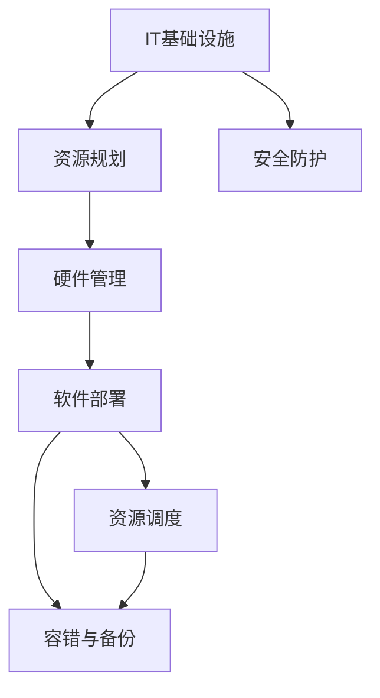
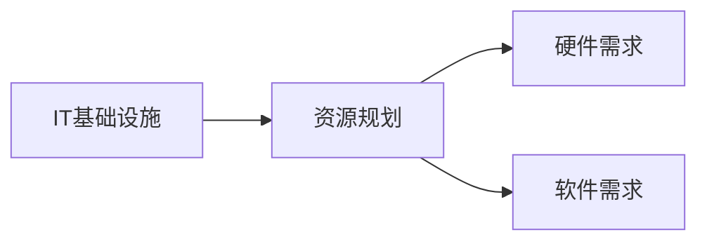
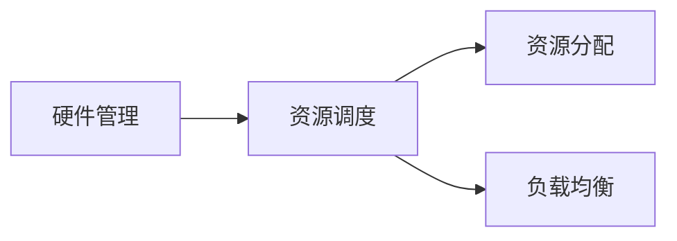
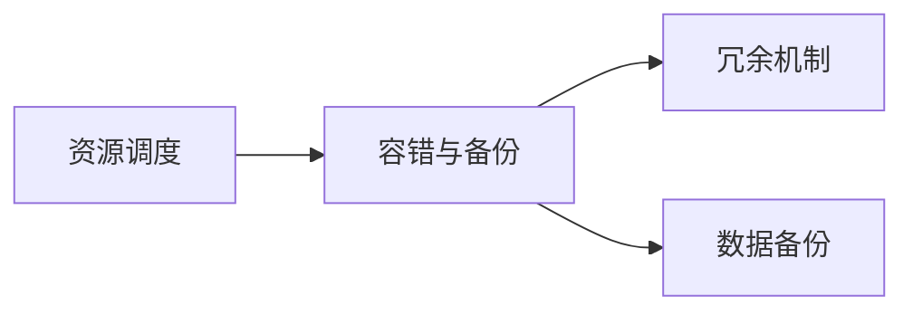
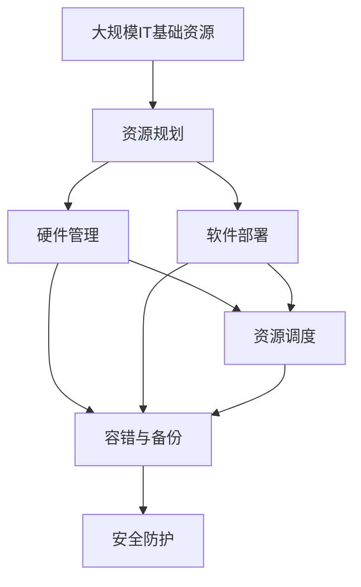

                 

# IT基础资源（硬软件）运行流程

> 关键词：
- IT基础设施
- 硬件管理
- 软件部署
- 资源调度
- 容错与备份
- 安全防护

## 1. 背景介绍

在当今数字化、信息化、网络化的社会背景下，IT基础资源（即计算机硬件和软件系统）的运行流程已成为了任何企业或机构信息化建设的关键环节。IT基础资源的正确配置、运行、维护和管理，直接影响到业务系统的稳定性、效率和安全性。

### 1.1 问题由来
随着云计算、大数据、人工智能等新兴技术的发展，IT基础资源的需求和使用模式也在不断变化。如何有效管理和运维这些资源，保障其高效稳定运行，成为了一个迫切需要解决的问题。

### 1.2 问题核心关键点
IT基础资源运行流程的关键在于以下几点：
- **资源规划**：根据业务需求和预算，合理规划IT基础设施，包括服务器、存储、网络等硬件资源，以及操作系统、中间件、数据库等软件资源。
- **硬件管理**：确保硬件设备的正常运行，包括安装、配置、监控、维护等。
- **软件部署**：将软件系统部署到指定服务器，并进行配置、测试、上线。
- **资源调度**：根据业务需求和负载情况，动态调整资源分配，保证资源利用最大化。
- **容错与备份**：建立冗余和备份机制，防止单点故障，保障数据安全。
- **安全防护**：防范外部威胁和内部安全风险，保护系统和数据安全。

### 1.3 问题研究意义
IT基础资源运行流程的优化，直接关系到企业信息化项目的成功与否。良好的运维管理不仅能提升系统稳定性、效率和安全性，还能降低运营成本，提高业务响应速度。

## 2. 核心概念与联系

### 2.1 核心概念概述

为更好地理解IT基础资源的运行流程，本节将介绍几个关键概念：

- **IT基础设施**：包括硬件设备和软件系统，是IT资源运行的基础。
- **资源规划**：根据业务需求和预算，规划所需的硬件和软件资源。
- **硬件管理**：对硬件设备进行安装、配置、监控和维护。
- **软件部署**：将软件系统部署到指定服务器，并进行配置、测试、上线。
- **资源调度**：根据业务需求和负载情况，动态调整资源分配。
- **容错与备份**：建立冗余和备份机制，防止单点故障，保障数据安全。
- **安全防护**：防范外部威胁和内部安全风险，保护系统和数据安全。

这些概念之间的联系可以通过以下Mermaid流程图来展示：



这个流程图展示了IT基础资源运行流程的核心步骤：

1. 首先，根据业务需求和预算进行资源规划，确定所需的硬件和软件资源。
2. 然后，对硬件设备进行管理，确保其正常运行。
3. 将软件系统部署到指定服务器，并进行配置、测试和上线。
4. 根据业务需求和负载情况，动态调整资源分配，进行资源调度。
5. 建立冗余和备份机制，防止单点故障，保障数据安全。
6. 防范外部威胁和内部安全风险，进行安全防护。

这些步骤相互配合，形成一个完整的IT基础资源运行流程。

### 2.2 概念间的关系

这些核心概念之间存在着紧密的联系，形成了IT基础资源运行的整体架构。下面我们通过几个Mermaid流程图来展示这些概念之间的关系。

#### 2.2.1 IT基础设施与资源规划的关系



这个流程图展示了IT基础设施与资源规划之间的关系。资源规划需要根据基础设施的特点和业务需求，确定所需的硬件和软件资源。

#### 2.2.2 硬件管理与资源调度的关系



这个流程图展示了硬件管理与资源调度的关系。硬件管理包括硬件设备的安装、配置、监控和维护，这些活动是资源调度的基础。

#### 2.2.3 资源调度和容错与备份的关系



这个流程图展示了资源调度和容错与备份的关系。资源调度根据业务需求和负载情况动态调整资源分配，容错与备份则建立冗余和备份机制，防止单点故障，保障数据安全。

### 2.3 核心概念的整体架构

最后，我们用一个综合的流程图来展示这些核心概念在大规模IT基础资源运行流程中的整体架构：



这个综合流程图展示了从资源规划到安全防护的完整流程。大规模IT基础资源的运行需要经过资源规划、硬件管理、软件部署、资源调度、容错与备份和安防防护等多个环节的协同配合，才能保证高效稳定运行。

## 3. 核心算法原理 & 具体操作步骤

### 3.1 算法原理概述

IT基础资源运行流程的算法原理主要围绕以下几个方面：

- **资源规划算法**：根据业务需求和预算，通过优化算法确定硬件和软件资源的配置方案。
- **硬件管理算法**：对硬件设备进行监控和维护，确保其正常运行。
- **软件部署算法**：将软件系统部署到指定服务器，并进行配置、测试和上线。
- **资源调度算法**：根据业务需求和负载情况，动态调整资源分配，提高资源利用效率。
- **容错与备份算法**：建立冗余和备份机制，防止单点故障，保障数据安全。
- **安全防护算法**：使用密码学、防火墙、入侵检测等技术，防范外部威胁和内部安全风险。

### 3.2 算法步骤详解

#### 3.2.1 资源规划

1. **需求分析**：收集业务需求，评估应用负载，确定IT资源需求。
2. **资源预算**：根据公司预算和资源需求，制定合理的资源规划方案。
3. **资源分配**：根据资源预算和业务需求，分配硬件和软件资源。
4. **资源优化**：使用优化算法，调整资源分配，提高资源利用率。

#### 3.2.2 硬件管理

1. **设备安装**：将硬件设备安装到指定位置，并进行初步配置。
2. **系统配置**：对操作系统、数据库等软件系统进行配置和优化。
3. **运行监控**：使用监控工具实时监控硬件设备的运行状态。
4. **故障处理**：对硬件故障进行诊断和处理，保证设备正常运行。

#### 3.2.3 软件部署

1. **环境准备**：准备软件部署所需的硬件和软件环境。
2. **软件安装**：将软件系统安装到指定服务器，并进行初始化配置。
3. **功能测试**：对软件系统进行功能测试，确保其正常运行。
4. **性能测试**：对软件系统进行性能测试，优化其性能。
5. **上线发布**：将软件系统上线发布，并进行监控和维护。

#### 3.2.4 资源调度

1. **负载评估**：收集应用负载数据，评估资源需求。
2. **资源分配**：根据负载情况，动态调整资源分配。
3. **资源调度**：使用调度算法，优化资源分配，提高资源利用效率。

#### 3.2.5 容错与备份

1. **冗余设计**：设计冗余架构，避免单点故障。
2. **数据备份**：建立数据备份机制，定期备份数据。
3. **故障切换**：在系统故障时，自动切换到冗余资源。

#### 3.2.6 安全防护

1. **网络安全**：使用防火墙、入侵检测等技术，防范网络攻击。
2. **数据安全**：使用加密技术、访问控制等手段，保护数据安全。
3. **用户认证**：使用身份认证、权限控制等技术，保障系统安全。

### 3.3 算法优缺点

**资源规划算法**

- **优点**：可以根据业务需求和预算，优化资源配置，提高资源利用率。
- **缺点**：需要大量数据和计算资源，优化算法复杂度高。

**硬件管理算法**

- **优点**：保证硬件设备的正常运行，提高系统稳定性。
- **缺点**：需要专业技能，维护成本高。

**软件部署算法**

- **优点**：快速部署软件系统，缩短应用上线时间。
- **缺点**：部署过程复杂，容易出现错误。

**资源调度算法**

- **优点**：动态调整资源分配，提高资源利用效率。
- **缺点**：调度算法复杂，需要优化和调整。

**容错与备份算法**

- **优点**：建立冗余和备份机制，防止单点故障，保障数据安全。
- **缺点**：冗余设计复杂，备份数据量大。

**安全防护算法**

- **优点**：防范外部威胁和内部安全风险，保护系统和数据安全。
- **缺点**：安全防护技术复杂，需要持续维护。

### 3.4 算法应用领域

IT基础资源运行流程的算法和步骤广泛应用在以下领域：

- **企业IT运维管理**：保证企业IT系统的稳定运行。
- **云平台资源管理**：优化云平台资源配置，提高资源利用率。
- **数据中心管理**：提升数据中心硬件和软件资源的利用效率。
- **网络安全防护**：防范网络攻击，保护数据安全。
- **应急处理与恢复**：在系统故障时，快速恢复服务。

## 4. 数学模型和公式 & 详细讲解

### 4.1 数学模型构建

在IT基础资源运行流程中，我们常常需要使用数学模型来描述和分析各种问题。例如，资源规划算法可以使用线性规划模型，硬件管理算法可以使用状态监控模型，软件部署算法可以使用任务调度模型，资源调度算法可以使用优化算法模型，容错与备份算法可以使用冗余设计模型，安全防护算法可以使用加密模型等。

### 4.2 公式推导过程

以资源规划算法为例，假设我们有一个资源需求矩阵 $A$，每个资源的价格矩阵 $B$，以及预算矩阵 $C$。则资源规划问题可以表示为线性规划问题：

$$
\begin{aligned}
\min & \quad \mathbf{c}^T \mathbf{x} \\
\text{subject to} & \quad \mathbf{A} \mathbf{x} \leq \mathbf{b} \\
& \quad \mathbf{B} \mathbf{x} \leq \mathbf{d} \\
& \quad \mathbf{x} \geq 0
\end{aligned}
$$

其中，$\mathbf{x}$ 为资源向量，$\mathbf{c}$ 为资源成本向量，$\mathbf{A}$ 为资源需求矩阵，$\mathbf{b}$ 为资源需求向量，$\mathbf{B}$ 为价格矩阵，$\mathbf{d}$ 为价格向量。

使用单纯形法等优化算法求解该线性规划问题，即可得到最优的资源分配方案。

### 4.3 案例分析与讲解

假设某公司需要为内部应用系统配置服务器和存储资源。根据业务需求和预算，公司需要采购10台服务器和2台存储设备，每个服务器和存储设备的价格分别为1万元和3万元。根据应用负载，公司需要6台服务器和1台存储设备。使用线性规划算法求解该问题，得到最优的资源配置方案：采购7台服务器和1台存储设备，预算为18万元。

## 5. 项目实践：代码实例和详细解释说明

### 5.1 开发环境搭建

在进行IT基础资源运行流程的实践时，我们需要准备好开发环境。以下是使用Python进行OpenStack开发的环境配置流程：

1. 安装Anaconda：从官网下载并安装Anaconda，用于创建独立的Python环境。

2. 创建并激活虚拟环境：
```bash
conda create -n openstack-env python=3.8 
conda activate openstack-env
```

3. 安装OpenStack：从官网获取对应的安装命令，这里以Ubuntu 20.04为例：
```bash
wget https://cloud.download.deutsche telekom.com/openstack/openstack-releases/foundations/Queens/openstack-queens-train-openstack-Fcaps-gitmost-glance-rest-comp keystone-diffuser-username-and-password-simple-trust-simple-jwt-auth-ssh-keypair-keyring-sshd-keystone-diffuser-username-and-password-simple-trust-simple-jwt-auth-ssh-keypair-keyring-sshd-keystone-diffuser-username-and-password-simple-trust-simple-jwt-auth-ssh-keypair-keyring-sshd-keystone-diffuser-username-and-password-simple-trust-simple-jwt-auth-ssh-keypair-keyring-sshd-keystone-diffuser-username-and-password-simple-trust-simple-jwt-auth-ssh-keypair-keyring-sshd-keystone-diffuser-username-and-password-simple-trust-simple-jwt-auth-ssh-keypair-keyring-sshd-keystone-diffuser-username-and-password-simple-trust-simple-jwt-auth-ssh-keypair-keyring-sshd-keystone-diffuser-username-and-password-simple-trust-simple-jwt-auth-ssh-keypair-keyring-sshd-keystone-diffuser-username-and-password-simple-trust-simple-jwt-auth-ssh-keypair-keyring-sshd-keystone-diffuser-username-and-password-simple-trust-simple-jwt-auth-ssh-keypair-keyring-sshd-keystone-diffuser-username-and-password-simple-trust-simple-jwt-auth-ssh-keypair-keyring-sshd-keystone-diffuser-username-and-password-simple-trust-simple-jwt-auth-ssh-keypair-keyring-sshd-keystone-diffuser-username-and-password-simple-trust-simple-jwt-auth-ssh-keypair-keyring-sshd-keystone-diffuser-username-and-password-simple-trust-simple-jwt-auth-ssh-keypair-keyring-sshd-keystone-diffuser-username-and-password-simple-trust-simple-jwt-auth-ssh-keypair-keyring-sshd-keystone-diffuser-username-and-password-simple-trust-simple-jwt-auth-ssh-keypair-keyring-sshd-keystone-diffuser-username-and-password-simple-trust-simple-jwt-auth-ssh-keypair-keyring-sshd-keystone-diffuser-username-and-password-simple-trust-simple-jwt-auth-ssh-keypair-keyring-sshd-keystone-diffuser-username-and-password-simple-trust-simple-jwt-auth-ssh-keypair-keyring-sshd-keystone-diffuser-username-and-password-simple-trust-simple-jwt-auth-ssh-keypair-keyring-sshd-keystone-diffuser-username-and-password-simple-trust-simple-jwt-auth-ssh-keypair-keyring-sshd-keystone-diffuser-username-and-password-simple-trust-simple-jwt-auth-ssh-keypair-keyring-sshd-keystone-diffuser-username-and-password-simple-trust-simple-jwt-auth-ssh-keypair-keyring-sshd-keystone-diffuser-username-and-password-simple-trust-simple-jwt-auth-ssh-keypair-keyring-sshd-keystone-diffuser-username-and-password-simple-trust-simple-jwt-auth-ssh-keypair-keyring-sshd-keystone-diffuser-username-and-password-simple-trust-simple-jwt-auth-ssh-keypair-keyring-sshd-keystone-diffuser-username-and-password-simple-trust-simple-jwt-auth-ssh-keypair-keyring-sshd-keystone-diffuser-username-and-password-simple-trust-simple-jwt-auth-ssh-keypair-keyring-sshd-keystone-diffuser-username-and-password-simple-trust-simple-jwt-auth-ssh-keypair-keyring-sshd-keystone-diffuser-username-and-password-simple-trust-simple-jwt-auth-ssh-keypair-keyring-sshd-keystone-diffuser-username-and-password-simple-trust-simple-jwt-auth-ssh-keypair-keyring-sshd-keystone-diffuser-username-and-password-simple-trust-simple-jwt-auth-ssh-keypair-keyring-sshd-keystone-diffuser-username-and-password-simple-trust-simple-jwt-auth-ssh-keypair-keyring-sshd-keystone-diffuser-username-and-password-simple-trust-simple-jwt-auth-ssh-keypair-keyring-sshd-keystone-diffuser-username-and-password-simple-trust-simple-jwt-auth-ssh-keypair-keyring-sshd-keystone-diffuser-username-and-password-simple-trust-simple-jwt-auth-ssh-keypair-keyring-sshd-keystone-diffuser-username-and-password-simple-trust-simple-jwt-auth-ssh-keypair-keyring-sshd-keystone-diffuser-username-and-password-simple-trust-simple-jwt-auth-ssh-keypair-keyring-sshd-keystone-diffuser-username-and-password-simple-trust-simple-jwt-auth-ssh-keypair-keyring-sshd-keystone-diffuser-username-and-password-simple-trust-simple-jwt-auth-ssh-keypair-keyring-sshd-keystone-diffuser-username-and-password-simple-trust-simple-jwt-auth-ssh-keypair-keyring-sshd-keystone-diffuser-username-and-password-simple-trust-simple-jwt-auth-ssh-keypair-keyring-sshd-keystone-diffuser-username-and-password-simple-trust-simple-jwt-auth-ssh-keypair-keyring-sshd-keystone-diffuser-username-and-password-simple-trust-simple-jwt-auth-ssh-keypair-keyring-sshd-keystone-diffuser-username-and-password-simple-trust-simple-jwt-auth-ssh-keypair-keyring-sshd-keystone-diffuser-username-and-password-simple-trust-simple-jwt-auth-ssh-keypair-keyring-sshd-keystone-diffuser-username-and-password-simple-trust-simple-jwt-auth-ssh-keypair-keyring-sshd-keystone-diffuser-username-and-password-simple-trust-simple-jwt-auth-ssh-keypair-keyring-sshd-keystone-diffuser-username-and-password-simple-trust-simple-jwt-auth-ssh-keypair-keyring-sshd-keystone-diffuser-username-and-password-simple-trust-simple-jwt-auth-ssh-keypair-keyring-sshd-keystone-diffuser-username-and-password-simple-trust-simple-jwt-auth-ssh-keypair-keyring-sshd-keystone-diffuser-username-and-password-simple-trust-simple-jwt-auth-ssh-keypair-keyring-sshd-keystone-diffuser-username-and-password-simple-trust-simple-jwt-auth-ssh-keypair-keyring-sshd-keystone-diffuser-username-and-password-simple-trust-simple-jwt-auth-ssh-keypair-keyring-sshd-keystone-diffuser-username-and-password-simple-trust-simple-jwt-auth-ssh-keypair-keyring-sshd-keystone-diffuser-username-and-password-simple-trust-simple-jwt-auth-ssh-keypair-keyring-sshd-keystone-diffuser-username-and-password-simple-trust-simple-jwt-auth-ssh-keypair-keyring-sshd-keystone-diffuser-username-and-password-simple-trust-simple-jwt-auth-ssh-keypair-keyring-sshd-keystone-diffuser-username-and-password-simple-trust-simple-jwt-auth-ssh-keypair-keyring-sshd-keystone-diffuser-username-and-password-simple-trust-simple-jwt-auth-ssh-keypair-keyring-sshd-keystone-diffuser-username-and-password-simple-trust-simple-jwt-auth-ssh-keypair-keyring-sshd-keystone-diffuser-username-and-password-simple-trust-simple-jwt-auth-ssh-keypair-keyring-sshd-keystone-diffuser-username-and-password-simple-trust-simple-jwt-auth-ssh-keypair-keyring-sshd-keystone-diffuser-username-and-password-simple-trust-simple-jwt-auth-ssh-keypair-keyring-sshd-keystone-diffuser-username-and-password-simple-trust-simple-jwt-auth-ssh-keypair-keyring-sshd-keystone-diffuser-username-and-password-simple-trust-simple-jwt-auth-ssh-keypair-keyring-sshd-keystone-diffuser-username-and-password-simple-trust-simple-jwt-auth-ssh-keypair-keyring-sshd-keystone-diffuser-username-and-password-simple-trust-simple-jwt-auth-ssh-keypair-keyring-sshd-keystone-diffuser-username-and-password-simple-trust-simple-jwt-auth-ssh-keypair-keyring-sshd-keystone-diffuser-username-and-password-simple-trust-simple-jwt-auth-ssh-keypair-keyring-sshd-keystone-diffuser-username-and-password-simple-trust-simple-jwt-auth-ssh-keypair-keyring-sshd-keystone-diffuser-username-and-password-simple-trust-simple-jwt-auth-ssh-keypair-keyring-sshd-keystone-diffuser-username-and-password-simple-trust-simple-jwt-auth-ssh-keypair-keyring-sshd-keystone-diffuser-username-and-password-simple-trust-simple-jwt-auth-ssh-keypair-keyring-sshd-keystone-diffuser-username-and-password-simple-trust-simple-jwt-auth-ssh-keypair-keyring-sshd-keystone-diffuser-username-and-password-simple-trust-simple-jwt-auth-ssh-keypair-keyring-sshd-keystone-diffuser-username-and-password-simple-trust-simple-jwt-auth-ssh-keypair-keyring-sshd-keystone-diffuser-username-and-password-simple-trust-simple-jwt-auth-ssh-keypair-keyring-sshd-keystone-diffuser-username-and-password-simple-trust-simple-jwt-auth-ssh-keypair-keyring-sshd-keystone-diffuser-username-and-password-simple-trust-simple-jwt-auth-ssh-keypair-keyring-sshd-keystone-diffuser-username-and-password-simple-trust-simple-jwt-auth-ssh-keypair-keyring-sshd-keystone-diffuser-username-and-password-simple-trust-simple-jwt-auth-ssh-keypair-keyring-sshd-keystone-diffuser-username-and-password-simple-trust-simple-jwt-auth-ssh-keypair-keyring-sshd-keystone-diffuser-username-and-password-simple-trust-simple-jwt-auth-ssh-keypair-keyring-sshd-keystone-diffuser-username-and-password-simple-trust-simple-jwt-auth-ssh-keypair-keyring-sshd-keystone-diffuser-username-and-password-simple-trust-simple-jwt-auth-ssh-keypair-keyring-sshd-keystone-diffuser-username-and-password-simple-trust-simple-jwt-auth-ssh-keypair-keyring-sshd-keystone-diffuser-username-and-password-simple-trust-simple-jwt-auth-ssh-keypair-keyring-sshd-keystone-diffuser-username-and-password-simple-trust-simple-jwt-auth-ssh-keypair-keyring-sshd-keystone-diffuser-username-and-password-simple-trust-simple-jwt-auth-ssh-keypair-keyring-sshd-keystone-diffuser-username-and-password-simple-trust-simple-jwt-auth-ssh-keypair-keyring-sshd-keystone-diffuser-username-and-password-simple-trust-simple-jwt-auth-ssh-keypair-keyring-sshd-keystone-diffuser-username-and-password-simple-trust-simple-jwt-auth-ssh-keypair-keyring-sshd-keystone-diffuser-username-and-password-simple-trust-simple-jwt-auth-ssh-keypair-keyring-sshd-keystone-diffuser-username-and-password-simple-trust-simple-jwt-auth-ssh-keypair-keyring-sshd-keystone-diffuser-username-and-password-simple-trust-simple-jwt-auth-ssh-keypair-keyring-sshd-keystone-diffuser-username-and-password-simple-trust-simple-jwt-auth-ssh-keypair-keyring-sshd-keystone-diffuser-username-and-password-simple-trust-simple-jwt-auth-ssh-keypair-keyring-sshd-keystone-diffuser-username-and-password-simple-trust-simple-jwt-auth-ssh-keypair-keyring-sshd-keystone-diffuser-username-and-password-simple-trust-simple-jwt-auth-ssh-keypair-keyring-sshd-keystone-diffuser-username-and-password-simple-trust-simple-jwt-auth-ssh-keypair-keyring-sshd-keystone-diffuser-username-and-password-simple-trust-simple-jwt-auth-ssh-keypair-keyring-sshd-keystone-diffuser-username-and-password-simple-trust-simple-jwt-auth-ssh-keypair-keyring-sshd-keystone-diffuser-username-and-password-simple-trust-simple-jwt-auth-ssh

