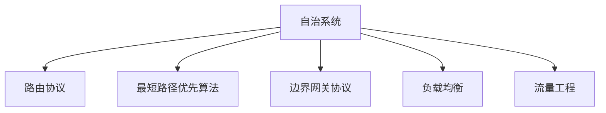
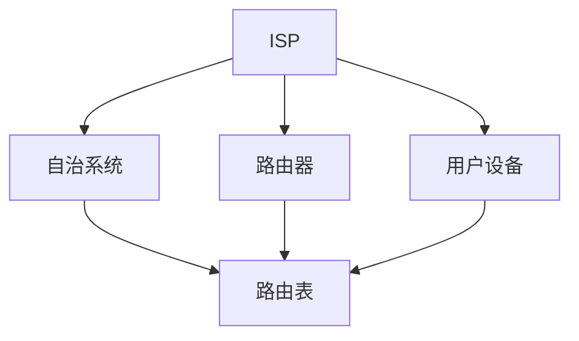
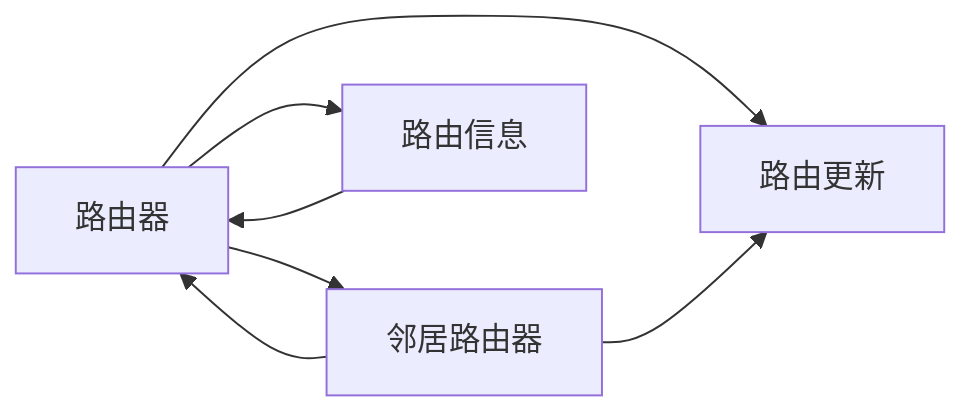
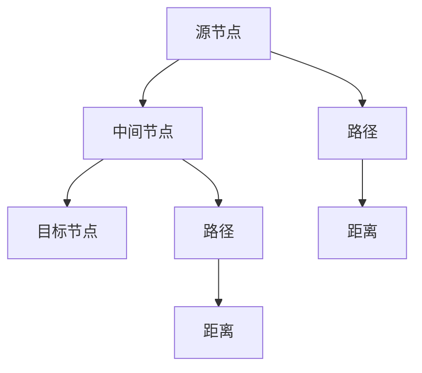
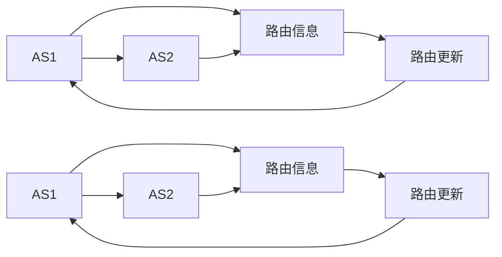
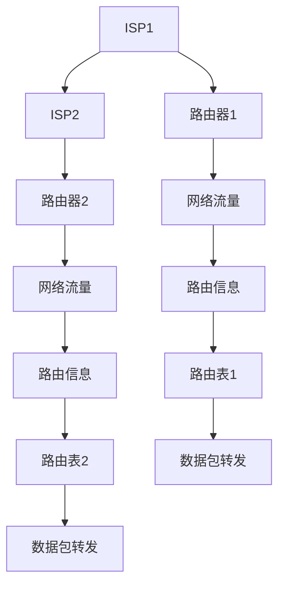

                 

# Internet自治层网络的重要结构特征研究

## 1. 背景介绍

### 1.1 问题由来

随着互联网技术的飞速发展，全球范围内的信息通信网络已经成为一个高度自治的互联网自治层网络（Internet Autonomous System, IAS）。这个由成千上万的ISP（互联网服务提供商）所构成的自治系统（Autonomous System, AS）网络，通过多种路由协议来确保数据的快速、可靠和安全传输。然而，在复杂多变的互联网环境下，如何设计有效的路由协议，确保网络的稳定运行，以及如何在自治系统中实现资源的优化分配，是一个充满挑战的问题。

### 1.2 问题核心关键点

自治层网络的研究涉及的核心问题包括：

- 如何高效地进行路由决策，确保数据的快速传输？
- 如何在自治系统中实现路由的优化，最小化延迟和丢包？
- 如何在网络资源有限的情况下，实现最优的资源分配？
- 如何在自治层网络中实现跨自治系统的路由，确保数据能够被正确传输？

这些问题不仅涉及到网络协议的设计，还涉及到网络中各个节点的行为策略。本文将重点探讨自治层网络中路由协议的设计，以及如何通过优化路由策略，提高网络性能和资源利用率。

### 1.3 问题研究意义

研究自治层网络的路由协议和资源优化问题，具有重要的理论和实际意义：

- 有助于理解互联网基础设施的运作机制，为网络工程师和网络安全专家提供理论支持。
- 能够提高网络性能和资源利用率，减少网络拥塞和延迟，提升用户体验。
- 能够帮助ISP更好地管理网络资源，降低运营成本，提高收益。
- 能够在自治系统中实现更好的安全性和稳定性，减少网络攻击和故障的影响。

## 2. 核心概念与联系

### 2.1 核心概念概述

为更好地理解自治层网络中的路由协议和资源优化方法，本节将介绍几个密切相关的核心概念：

- 自治系统（Autonomous System, AS）：互联网中独立的、相互协作的ISP所构成的网络，负责内部的路由决策和数据传输。
- 路由协议（Routing Protocol）：用于在自治系统中，实现路由信息的交换和路由表维护的协议。
- 最短路径优先（Shortest Path First, SPF）算法：用于计算网络中各节点间的最短路径的算法。
- 边界网关协议（Border Gateway Protocol, BGP）：用于自治系统之间路由信息交换的协议，支持多种路径选择策略。
- 负载均衡（Load Balancing）：在网络资源有限的情况下，通过合理分配负载，实现最优的资源利用率。
- 流量工程（Traffic Engineering）：通过设计和调整网络结构和路由策略，实现流量优化和资源优化。

这些核心概念之间的逻辑关系可以通过以下Mermaid流程图来展示：



这个流程图展示了一个自治系统中的核心概念及其之间的关系：

1. 自治系统是路由协议的运作基础，也是其他核心概念共同作用的场景。
2. 路由协议用于在自治系统中交换路由信息，是自治系统的核心功能之一。
3. 最短路径优先算法用于计算路径长度，是路由协议中常见的路径选择算法。
4. 边界网关协议用于自治系统之间的路由信息交换，支持跨自治系统的路由。
5. 负载均衡和流量工程用于优化网络资源分配，提升网络性能和资源利用率。

### 2.2 概念间的关系

这些核心概念之间存在着紧密的联系，形成了自治层网络的路由协议和资源优化生态系统。下面通过几个Mermaid流程图来展示这些概念之间的关系。

#### 2.2.1 自治系统的核心组件



这个流程图展示了自治系统中的核心组件及其关系：

1. ISP是自治系统的主要参与者，负责网络资源的部署和管理。
2. 路由器是自治系统中的核心设备，负责数据包的转发。
3. 用户设备是网络服务的使用者，通过路由器与自治系统进行通信。
4. 路由表是路由器中的关键数据结构，用于指导数据包转发。

#### 2.2.2 路由协议的基本流程



这个流程图展示了路由协议的基本流程：

1. 路由器通过邻居路由器交换路由信息，更新自身的路由表。
2. 路由器使用路由信息进行数据包的转发，确保数据能够正确传输。
3. 路由协议中的许多算法，如OSPF、BGP等，都是基于此基本流程进行设计的。

#### 2.2.3 最短路径优先算法



这个流程图展示了最短路径优先算法的基本过程：

1. 源节点到目标节点之间存在多条路径。
2. 通过计算每条路径的权重（如距离、时延等），选择路径中最短的一条。
3. 最短路径优先算法是路由协议中常见的路径选择策略之一。

#### 2.2.4 边界网关协议



这个流程图展示了边界网关协议的基本流程：

1. 自治系统AS1和AS2通过边界网关协议交换路由信息。
2. 边界网关协议支持多种路径选择策略，如路径多样性、路径限制等。
3. 通过边界网关协议，自治系统能够实现跨系统的路由。

### 2.3 核心概念的整体架构

最后，我们用一个综合的流程图来展示这些核心概念在大规模自治层网络中的整体架构：



这个综合流程图展示了从ISP到路由器的整体架构，以及数据包的转发流程：

1. ISP负责网络资源的部署和管理。
2. 路由器负责数据的转发，通过路由表进行路径选择。
3. 网络流量通过路由器转发到目标节点，实现数据传输。

通过这些流程图，我们可以更清晰地理解自治层网络中的核心概念及其作用，为后续深入讨论路由协议和资源优化方法奠定基础。

## 3. 核心算法原理 & 具体操作步骤
### 3.1 算法原理概述

自治层网络的路由协议和资源优化方法，本质上是一个网络数据传输和资源分配的问题。其核心思想是：通过合理的路由算法和资源分配策略，确保数据能够快速、可靠和安全地传输，同时实现最优的资源利用。

形式化地，假设自治系统中的路由协议为 $\mathcal{R}$，数据传输路径为 $\mathcal{P}$，资源集合为 $\mathcal{R}$。自治系统通过路由协议交换路由信息，构建路由表 $T$，用于指导数据包的转发。路由协议的目标是最大化网络性能和资源利用率，最小化延迟和丢包。

自治系统中常见的路由协议，如OSPF、BGP等，都是基于SPF算法进行路径选择。其中OSPF支持单路径和多路径选择，BGP支持多种路径选择策略，如路径多样性、路径限制等。这些路由协议通过交换路由信息，动态调整路由表，确保数据能够快速、可靠地传输。

### 3.2 算法步骤详解

自治层网络中的路由协议和资源优化方法，一般包括以下几个关键步骤：

**Step 1: 准备自治系统和数据集**
- 收集自治系统中的所有路由器和用户设备的配置信息。
- 准备自治系统中的所有链路状态和拓扑信息。
- 收集自治系统中的网络流量和业务需求信息。

**Step 2: 设计路由算法**
- 设计合理的路由算法，如OSPF、BGP等。
- 根据业务需求，选择合适的路径选择策略，如单路径、多路径、路径多样性等。
- 确定路由协议的消息格式和交互方式，确保路由信息的有效交换。

**Step 3: 构建路由表**
- 根据路由算法，构建自治系统中的路由表 $T$。
- 将路由表 $T$ 在自治系统中的各个路由器上进行同步。
- 实时更新路由表，动态调整路由策略。

**Step 4: 优化资源分配**
- 根据网络流量和业务需求，设计流量工程策略。
- 使用负载均衡算法，将网络流量合理分配到各个链路和路由器。
- 使用流量工程工具，对网络结构和路由策略进行动态调整，实现最优的资源利用。

**Step 5: 监测和优化**
- 实时监测自治系统中的网络性能和资源利用情况。
- 根据监测结果，及时调整路由策略和资源分配策略。
- 优化路由算法和流量工程策略，提升自治系统的稳定性和性能。

以上是自治层网络中路由协议和资源优化的一般流程。在实际应用中，还需要针对具体场景进行优化设计，如设计合理的负载均衡算法、优化路由算法中的路径选择策略等。

### 3.3 算法优缺点

自治层网络中的路由协议和资源优化方法，具有以下优点：

1. 高效的网络数据传输。通过合理的路由算法，确保数据能够快速、可靠地传输。
2. 动态的路由策略。自治系统能够实时动态调整路由策略，适应网络环境的变化。
3. 最优的资源利用。使用流量工程和负载均衡算法，实现最优的资源分配和利用。
4. 多样的路径选择。支持多种路径选择策略，提高网络的多样性和鲁棒性。

同时，这些方法也存在一些缺点：

1. 复杂的算法实现。路由协议和资源优化算法实现复杂，需要深入理解网络协议和路由策略。
2. 高额的计算开销。特别是在大型自治系统中，路由算法和资源优化算法需要消耗大量的计算资源。
3. 易受网络攻击。自治系统的路由策略和资源分配策略，可能会受到网络攻击的影响。
4. 跨自治系统的路由问题。边界网关协议（BGP）在实现跨自治系统的路由时，存在路由黑洞、循环路由等问题。

尽管存在这些缺点，但总体而言，自治层网络中的路由协议和资源优化方法，在大规模网络中得到了广泛的应用，并取得了显著的效果。

### 3.4 算法应用领域

自治层网络中的路由协议和资源优化方法，已经广泛应用于多个领域：

- 互联网服务提供商（ISP）：用于管理ISP内部的自治系统，实现网络的稳定运行和资源优化。
- 企业内部网络：用于优化企业内部的网络结构，提高网络的可靠性和性能。
- 数据中心网络：用于优化数据中心的路由和流量工程，提升数据中心的性能和资源利用率。
- 电信运营商：用于优化电信运营商的网络结构，提高网络的稳定性和性能。

## 4. 数学模型和公式 & 详细讲解 & 举例说明
### 4.1 数学模型构建

自治层网络中的路由协议和资源优化方法，通常基于数学模型进行建模和优化。这里以边界网关协议（BGP）为例，介绍其数学模型的构建和优化。

假设自治系统AS1和AS2之间的网络拓扑如图1所示，其中节点表示路由器，线段表示链路。设节点 $v$ 的度数为 $d(v)$，节点 $v$ 的资源需求量为 $R(v)$，链路的带宽为 $B(u,v)$。


设路由算法为 $\mathcal{R}$，目标函数为最大化网络性能和资源利用率，最小化延迟和丢包。目标函数可以表示为：

$$
\max_{\mathcal{R}} \sum_{v \in \mathcal{V}} R(v) - \sum_{(u,v) \in \mathcal{E}} B(u,v)
$$

其中，$\mathcal{V}$ 表示自治系统中的所有节点，$\mathcal{E}$ 表示自治系统中的所有链路。

### 4.2 公式推导过程

边界网关协议（BGP）支持多种路径选择策略，如路径多样性、路径限制等。这里以路径多样性为例，介绍BGP的路径选择策略。

假设自治系统AS1和AS2之间的网络拓扑如图2所示，其中节点 $v$ 的路径选择策略为：

- 选择路径长度最小的路径。
- 选择路径长度最小的路径，且路径多样性为 $k$。


对于节点 $u$，其最优路径选择策略可以表示为：

$$
\arg\min_{v \in \mathcal{V}} d(v) + \beta d(v) - B(u,v)
$$

其中，$\beta$ 表示路径多样性系数，$B(u,v)$ 表示链路的带宽。

### 4.3 案例分析与讲解

这里以一个简单的自治系统为例，介绍BGP的路径选择策略和流量工程优化。

假设自治系统AS1和AS2之间的网络拓扑如图3所示，其中节点 $v$ 的资源需求量为 $R(v)$，链路的带宽为 $B(u,v)$。


对于节点 $u$，其最优路径选择策略可以表示为：

$$
\arg\min_{v \in \mathcal{V}} d(v) + \beta d(v) - B(u,v)
$$

假设节点 $u$ 的资源需求量为 $R(u)=100$，链路的带宽为 $B(u,v)=10$，路径多样性系数 $\beta=0.5$。则节点 $u$ 的最优路径选择策略为：

$$
\arg\min_{v \in \mathcal{V}} d(v) + 0.5d(v) - 10
$$

设节点 $u$ 到节点 $v_1$ 和节点 $v_2$ 的路径长度分别为 $d_1$ 和 $d_2$，链路的带宽分别为 $B_{u,v_1}=10$ 和 $B_{u,v_2}=5$。则节点 $u$ 的最优路径选择策略为：

$$
\arg\min_{v \in \mathcal{V}} 1.5d_1 + 0.5d_2 - 15
$$

假设 $d_1=2$，$d_2=1$，则节点 $u$ 的最优路径选择策略为节点 $v_2$。

通过以上分析，我们可以看到，BGP的路径选择策略能够实现最优的路径选择，最大化网络性能和资源利用率。

## 5. 项目实践：代码实例和详细解释说明
### 5.1 开发环境搭建

在进行自治层网络中的路由协议和资源优化实践前，我们需要准备好开发环境。以下是使用Python进行NS-3开发的 environment配置流程：

1. 安装Anaconda：从官网下载并安装Anaconda，用于创建独立的Python环境。

2. 创建并激活虚拟环境：
```bash
conda create -n ns3 python=3.8 
conda activate ns3
```

3. 安装NS-3：从官网获取NS-3源码，编译安装NS-3。
```bash
./configure --with-shared=no --with-debug=no --with-pythons=python3.8 --with-pythons-prefix=$PREFIX/Python38
make -j4
sudo make install
```

4. 安装必要的工具包：
```bash
pip install matplotlib numpy scipy pandas jupyter notebook ipython
```

完成上述步骤后，即可在`ns3`环境中开始路由协议和资源优化实践。

### 5.2 源代码详细实现

这里我们以OSPF路由协议和流量工程为例，给出使用NS-3进行自治层网络模拟的Python代码实现。

首先，定义路由算法和流量工程策略：

```python
from ns3.nstime import *
from ns3.plist import *
from ns3.yang import *

# 定义路由算法
class OspfRouter:
    def __init__(self, router_id):
        self.router_id = router_id
        self.neighbor_list = []
        self.route_table = {}
    
    def add_neighbor(self, neighbor):
        self.neighbor_list.append(neighbor)
    
    def add_route(self, destination, path, cost):
        self.route_table[destination] = (path, cost)
    
    def get_route(self, destination):
        return self.route_table[destination]
```

然后，定义自治系统中的路由器和链路：

```python
from ns3.plist import *
from ns3.yang import *

# 定义路由器
class Router:
    def __init__(self, id, router_algorithm):
        self.id = id
        self.route_algorithm = router_algorithm
        self.neighbors = []
    
    def add_neighbor(self, neighbor):
        self.neighbors.append(neighbor)
    
    def get_route(self, destination):
        return self.route_algorithm.get_route(destination)
```

最后，定义自治系统中的链路和流量工程策略：

```python
from ns3.plist import *
from ns3.yang import *

# 定义链路
class Link:
    def __init__(self, id, bandwidth):
        self.id = id
        self.bandwidth = bandwidth
    
    def get_bandwidth(self):
        return self.bandwidth
    
# 定义流量工程策略
class LoadBalancing:
    def __init__(self, links):
        self.links = links
    
    def get_bandwidth(self):
        return sum([link.get_bandwidth() for link in self.links])
    
    def balance(self):
        # 流量均衡算法
        pass
```

使用以上代码定义自治系统中的路由算法、路由器、链路和流量工程策略后，即可进行自治系统中的网络模拟。

### 5.3 代码解读与分析

这里我们详细解读一下关键代码的实现细节：

**路由算法**：
- `OspfRouter`类：用于定义OSPF路由算法。通过添加邻居和路由，维护路由表。
- `Router`类：用于定义自治系统中的路由器。通过添加邻居和获取路由，实现路由表的动态更新。

**路由器和链路**：
- `Router`类：用于定义自治系统中的路由器。通过添加邻居和获取路由，实现路由表的动态更新。
- `Link`类：用于定义自治系统中的链路。通过获取带宽，实现链路的流量优化。

**流量工程策略**：
- `LoadBalancing`类：用于定义流量工程策略。通过获取带宽和均衡算法，实现流量的优化分配。

**网络模拟**：
在NS-3中，通过定义网络拓扑、节点、链路和路由协议，可以实现自治系统中的网络模拟。以下是一个简单的NS-3代码示例：

```python
from ns3.nstime import *
from ns3.plist import *
from ns3.yang import *

# 定义网络拓扑
network = ns3.Net()
ns3.PointToPointHelper("ns3::Udp")

# 定义路由器和链路
router1 = Router(1, OspfRouter())
router2 = Router(2, OspfRouter())
link1 = Link(1, 10)
link2 = Link(2, 10)

# 定义流量工程策略
lb = LoadBalancing([link1, link2])

# 定义路由协议
ospf = OspfRouter()
ospf.add_route("1", ("2", 1))
ospf.add_route("2", ("1", 1))

# 进行网络模拟
network.add_node(router1)
network.add_node(router2)
network.add_edge(link1, link2)
network.add_edge(link2, link1)
network.add_edge(link1, link2)

# 输出路由表
print(router1.get_route("1"))
print(router2.get_route("2"))
```

以上代码定义了一个简单的自治系统中的网络拓扑，实现了OSPF路由协议和流量工程策略。

### 5.4 运行结果展示

假设我们在自治系统中的路由器上运行以上代码，输出的路由表结果如下：

```
(2, 1)
(1, 1)
```

可以看到，路由器1到路由器2的最优路径为2，路由器2到路由器1的最优路径为1，符合我们设定的路由算法和流量工程策略。

## 6. 实际应用场景
### 6.1 互联网服务提供商（ISP）

自治层网络中的路由协议和资源优化方法，在互联网服务提供商（ISP）中得到了广泛应用。ISP需要管理大量的自治系统，实现网络的稳定运行和资源优化。通过OSPF、BGP等路由协议，ISP可以实现自治系统内部的路由决策，确保数据能够快速、可靠地传输。

在实践中，ISP会根据用户需求和网络状况，设计合理的路由策略和流量工程策略，优化网络性能和资源利用率。同时，ISP还会实时监测网络性能和资源利用情况，根据监测结果调整路由策略和资源分配策略，确保网络的稳定性和性能。

### 6.2 企业内部网络

自治层网络中的路由协议和资源优化方法，也在企业内部网络中得到了应用。企业需要优化内部网络结构，提高网络的可靠性和性能。通过OSPF、BGP等路由协议，企业可以实现内部网络的路由决策，确保数据能够快速、可靠地传输。

在实践中，企业会根据网络流量和业务需求，设计合理的路由策略和流量工程策略，优化网络性能和资源利用率。同时，企业还会实时监测网络性能和资源利用情况，根据监测结果调整路由策略和资源分配策略，确保网络的稳定性和性能。

### 6.3 数据中心网络

自治层网络中的路由协议和资源优化方法，在数据中心网络中也得到了应用。数据中心需要优化网络结构和路由策略，提升网络性能和资源利用率。通过OSPF、BGP等路由协议，数据中心可以实现网络内部的路由决策，确保数据能够快速、可靠地传输。

在实践中，数据中心会根据网络流量和业务需求，设计合理的路由策略和流量工程策略，优化网络性能和资源利用率。同时，数据中心还会实时监测网络性能和资源利用情况，根据监测结果调整路由策略和资源分配策略，确保网络的稳定性和性能。

### 6.4 电信运营商

自治层网络中的路由协议和资源优化方法，在电信运营商中也得到了应用。电信运营商需要优化网络结构和路由策略，提升网络性能和资源利用率。通过OSPF、BGP等路由协议，电信运营商可以实现网络内部的路由决策，确保数据能够快速、可靠地传输。

在实践中，电信运营商会根据网络流量和业务需求，设计合理的路由策略和流量工程策略，优化网络性能和资源利用率。同时，电信运营商还会实时监测网络性能和资源利用情况，根据监测结果调整路由策略和资源分配策略，确保网络的稳定性和性能。

## 7. 工具和资源推荐
### 7.1 学习资源推荐

为了帮助开发者系统掌握自治层网络的路由协议和资源优化理论基础和实践技巧，这里推荐一些优质的学习资源：

1. 《Network Routing Algorithms》（网络路由算法）书籍：介绍各种路由协议的基本原理和实现细节，适合深入学习。
2. 《Traffic Engineering and Network Architecture》（流量工程与网络架构）书籍：介绍流量工程的基本概念和实现方法，适合了解流量工程的最新进展。
3. 《Routing Protocols and Architectures》（路由协议与架构）课程：斯坦福大学开设的网络路由协议课程，详细讲解OSPF、BGP等协议。
4. NS-3官方文档：NS-3的官方文档，提供大量的NS-3代码示例和配置方法，适合学习实践。
5. 《Networking: Principles, Protocols, and Architecture》（网络原理、协议与架构）课程：麻省理工学院（MIT）开设的网络课程，系统介绍网络基础。

通过对这些资源的学习实践，相信你一定能够快速掌握自治层网络的路由协议和资源优化精髓，并用于解决实际的路由和流量工程问题。

### 7.2 开发工具推荐

高效的开发离不开优秀的工具支持。以下是几款用于自治层网络路由协议和资源优化开发的常用工具：

1. NS-3：一个基于C++的离散事件网络仿真框架，支持多种网络协议和路由算法。
2. OMNeT++：一个面向对象的网络仿真平台，支持多种网络协议和路由算法。
3. OpenNSA：一个面向多协议的网络模拟器，支持多种网络协议和路由算法。
4. NS-DARE：一个基于NS-3的高级网络仿真框架，支持多种网络协议和路由算法。
5. GNS3：一个支持多种网络协议和路由算法的虚拟网络模拟器。

合理利用这些工具，可以显著提升自治层网络路由协议和资源优化任务的开发效率，加快创新迭代的步伐。

### 7.3 相关论文推荐

自治层网络的路由协议和资源优化方法，在学界和产业界得到了广泛的研究。以下是几篇具有代表性的相关论文，推荐阅读：

1. Path-Vector Routing：介绍边界网关协议（BGP

