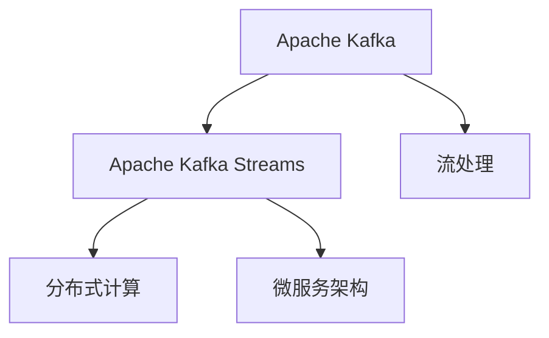
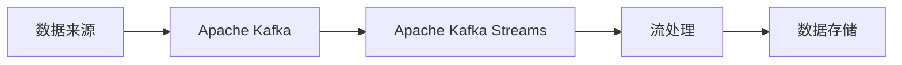
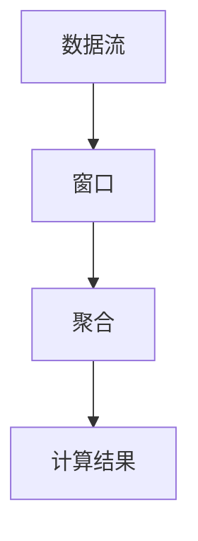
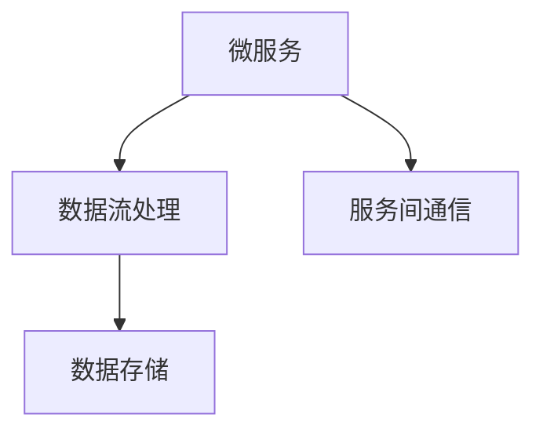
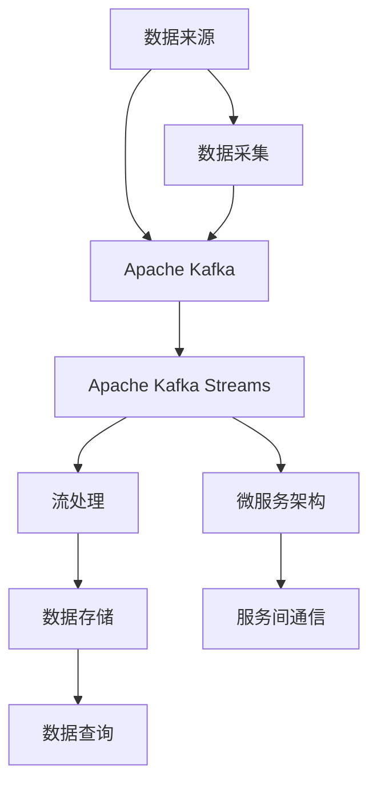

                 

# Kafka Streams原理与代码实例讲解

> 关键词：Kafka Streams, Apache Kafka, 实时数据流处理, 微服务架构, 分布式计算, 实时分析

## 1. 背景介绍

### 1.1 问题由来
随着大数据和云计算技术的飞速发展，数据流处理已成为构建实时业务和数据驱动决策的关键技术之一。然而，传统的批处理技术在处理实时数据时存在延迟和扩展性问题，难以满足高实时性、高吞吐量的应用需求。

与此同时，微服务架构的兴起为构建分布式、灵活的系统提供了新的思路。将数据流处理与微服务架构相结合，不仅能够提升系统的高可用性和可扩展性，还能使数据处理更加灵活、模块化，适应业务场景的快速变化。

针对这些问题，Apache Kafka和Apache Kafka Streams应运而生，成为数据流处理领域的两大重要工具。Kafka Streams是Kafka中的流式数据处理框架，提供了一站式的实时流处理解决方案，帮助开发者构建高性能、高可扩展、低延迟的实时数据流处理系统。

### 1.2 问题核心关键点
Kafka Streams的核心思想是将数据流处理与微服务架构相结合，通过高吞吐量、低延迟的流式数据处理引擎，对实时数据进行聚合、过滤、分析、计算等操作，提供统一的流处理API，以便开发者快速构建复杂的数据流处理应用。

Kafka Streams的关键特性包括：

- 高性能、低延迟的流式计算引擎
- 统一的流处理API，方便开发者进行复杂数据流处理
- 支持窗口式处理、聚合计算等高级操作
- 与Kafka无缝集成，便于数据的获取和存储
- 分布式计算模型，支持水平扩展

这些特性使得Kafka Streams成为处理实时数据流的理想工具，广泛应用于金融、物流、电商、物联网等众多领域。

### 1.3 问题研究意义
Kafka Streams作为实时流处理领域的领先工具，其研究与应用具有重要意义：

1. 提升系统性能：Kafka Streams提供高性能、低延迟的流式计算引擎，能够处理大规模实时数据，满足高吞吐量和高实时性的应用需求。

2. 增强系统扩展性：Kafka Streams采用分布式计算模型，支持水平扩展，能够应对业务量的大幅增长。

3. 简化开发流程：Kafka Streams提供统一的流处理API，方便开发者进行复杂数据流处理，提升开发效率。

4. 提供强大的数据分析能力：Kafka Streams支持窗口式处理、聚合计算等高级操作，具备强大的数据分析和计算能力。

5. 易于与Kafka集成：Kafka Streams与Kafka无缝集成，便于数据的获取和存储，提升系统的整体性能。

## 2. 核心概念与联系

### 2.1 核心概念概述

为了更好地理解Kafka Streams的原理与代码实现，本节将介绍几个密切相关的核心概念：

- Apache Kafka: 一个高性能、分布式、可扩展的消息中间件系统，支持高吞吐量的数据传输和存储。

- Apache Kafka Streams: 基于Apache Kafka的消息流处理框架，提供统一的流处理API，支持分布式计算，提升实时数据流处理的效率和扩展性。

- 流处理(Stream Processing): 对实时数据进行聚合、过滤、分析、计算等操作，提供实时的数据洞察和分析能力。

- 分布式计算(Distributed Computing): 通过将计算任务分解为多个子任务，并分布在多个计算节点上执行，实现高吞吐量、高扩展性的计算能力。

- 微服务架构(Microservice Architecture): 将系统拆分为多个小型服务，通过服务间通信和编排，实现系统的灵活性和可扩展性。

这些核心概念之间的逻辑关系可以通过以下Mermaid流程图来展示：



这个流程图展示了大数据流处理系统与微服务架构之间的联系：

1. Apache Kafka作为底层数据传输和存储系统，为流处理提供数据流。
2. Apache Kafka Streams基于Apache Kafka的消息流，进行流式数据处理和计算。
3. 流处理通过聚合、过滤、分析等操作，提供实时的数据洞察和分析能力。
4. 分布式计算通过将计算任务分散在多个节点上执行，实现高吞吐量和可扩展性。
5. 微服务架构通过将系统拆分为多个小型服务，实现系统的灵活性和可扩展性。

这些概念共同构成了大数据流处理系统的核心架构，使得开发者能够构建高性能、高可扩展、低延迟的实时数据流处理系统。

### 2.2 概念间的关系

这些核心概念之间存在着紧密的联系，形成了Kafka Streams的核心生态系统。下面我通过几个Mermaid流程图来展示这些概念之间的关系。

#### 2.2.1 大数据流处理系统架构



这个流程图展示了大数据流处理系统的整体架构：

1. 数据来源通过Apache Kafka发送到数据流处理系统。
2. Apache Kafka Streams基于Apache Kafka的消息流，进行流式数据处理和计算。
3. 流处理通过聚合、过滤、分析等操作，生成计算结果。
4. 计算结果存储到数据存储系统中。

#### 2.2.2 Kafka Streams的计算模型



这个流程图展示了Kafka Streams的计算模型：

1. 数据流通过窗口(Windows)进行分组聚合。
2. 聚合结果通过计算(Calculations)生成计算结果。
3. 计算结果输出到目标系统。

#### 2.2.3 Kafka Streams的微服务架构



这个流程图展示了Kafka Streams与微服务架构的联系：

1. 微服务架构将数据流处理系统拆分为多个小型服务。
2. 数据流处理服务通过服务间通信调用其他服务。
3. 数据存储服务负责数据的持久化和查询。

通过这些流程图，我们可以更清晰地理解Kafka Streams的核心概念和其在系统架构中的作用。

### 2.3 核心概念的整体架构

最后，我们用一个综合的流程图来展示这些核心概念在大数据流处理系统中的整体架构：



这个综合流程图展示了从数据采集到数据存储的完整过程：

1. 数据来源通过数据采集接口发送到Apache Kafka。
2. Apache Kafka Streams基于Apache Kafka的消息流，进行流式数据处理和计算。
3. 流处理通过聚合、过滤、分析等操作，生成计算结果。
4. 计算结果存储到数据存储系统中。
5. 微服务架构通过服务间通信调用其他服务。
6. 数据存储服务负责数据的持久化和查询。

通过这些流程图，我们可以更全面地理解Kafka Streams在大数据流处理系统中的角色和作用。

## 3. 核心算法原理 & 具体操作步骤

### 3.1 算法原理概述

Kafka Streams的核心算法原理基于实时流处理模型，通过将计算任务分解为多个子任务，并分布在多个计算节点上执行，实现高吞吐量、高扩展性的计算能力。Kafka Streams提供了一站式的实时流处理解决方案，支持分布式计算，提升实时数据流处理的效率和扩展性。

Kafka Streams的计算模型主要包括：

- 窗口式处理(Window Processing)：对数据流进行分组聚合，支持滑动窗口和固定窗口两种模式。
- 聚合计算(Aggregation Calculations)：对窗口内的数据进行聚合计算，支持分组聚合、聚合函数等高级操作。
- 计算函数(Calculations)：对聚合结果进行计算，生成最终计算结果。

### 3.2 算法步骤详解

Kafka Streams的流处理过程包括以下几个关键步骤：

**Step 1: 数据流处理设计**
- 设计数据流处理的逻辑，明确需要处理的数据源、处理流程和输出结果。
- 选择合适的计算模型，包括窗口式处理、聚合计算、计算函数等。
- 确定数据的存储方式，选择内存存储、磁盘存储或两者结合的方式。

**Step 2: 代码实现**
- 使用Kafka Streams的API编写流处理程序，实现数据流处理的逻辑。
- 将程序打包为可执行的jar包，部署到Kafka Streams集群中。
- 启动Kafka Streams程序，开始处理实时数据流。

**Step 3: 性能优化**
- 监控流处理程序的性能，调整计算模型和资源配置。
- 优化数据的采集和存储方式，减少资源消耗和延迟。
- 使用水平扩展策略，增加计算节点的数量，提升系统的吞吐量和扩展性。

**Step 4: 故障恢复**
- 设计流处理程序的高可用性策略，确保在节点故障时数据处理不受影响。
- 使用数据备份和复制策略，防止数据丢失。
- 定期进行数据备份和恢复测试，确保系统的高可用性。

### 3.3 算法优缺点

Kafka Streams的优点包括：

- 高性能、低延迟的流式计算引擎，能够处理大规模实时数据。
- 统一的流处理API，方便开发者进行复杂数据流处理。
- 支持窗口式处理、聚合计算等高级操作，具备强大的数据分析和计算能力。
- 与Kafka无缝集成，便于数据的获取和存储。
- 分布式计算模型，支持水平扩展。

Kafka Streams的缺点包括：

- 学习曲线较陡峭，需要一定的学习成本。
- 资源消耗较大，尤其是在大规模数据处理时，需要较高的硬件配置。
- 对于复杂的数据流处理逻辑，编写和调试程序可能较为复杂。
- 部署和维护成本较高，需要专业运维人员支持。

尽管存在这些缺点，Kafka Streams在实时数据流处理领域仍然具有广泛的应用前景，尤其是在对高实时性、高吞吐量有高要求的应用场景中。

### 3.4 算法应用领域

Kafka Streams的应用领域非常广泛，涵盖了金融、物流、电商、物联网等多个行业。以下是一些典型的应用场景：

- 金融领域：实时监控市场行情，分析交易数据，进行风险控制和投资决策。
- 物流领域：实时监控运输状态，优化物流路径，提升配送效率。
- 电商领域：实时分析用户行为数据，进行个性化推荐，提升用户体验。
- 物联网领域：实时监测设备状态，进行异常检测和故障诊断。
- 健康医疗领域：实时分析患者数据，进行疾病预测和健康监测。

## 4. 数学模型和公式 & 详细讲解 & 举例说明

### 4.1 数学模型构建

Kafka Streams的计算模型基于流式数据处理和计算，主要包括窗口式处理、聚合计算、计算函数等。以下是一个典型的流式数据处理模型的数学模型构建：

假设数据流中的数据元素为$x_1, x_2, ..., x_n$，窗口中元素个数为$k$，则窗口内的数据可以表示为$W=\{x_1, x_2, ..., x_k\}$。

对于窗口内的数据$W$，需要进行聚合计算，得到聚合结果$A$。计算函数$f$可以对聚合结果$A$进行计算，生成最终的计算结果$R$。

### 4.2 公式推导过程

下面以窗口式处理为例，展示Kafka Streams的计算公式推导过程。

假设数据流中的数据元素为$x_1, x_2, ..., x_n$，窗口中元素个数为$k$。对于窗口$W$内的数据元素，需要进行聚合计算，得到聚合结果$A$。

设$w_i$为窗口$W$内的数据元素$x_i$的权重，则聚合计算结果$A$可以表示为：

$$
A = \sum_{i=1}^{k} w_i x_i
$$

对于聚合结果$A$，可以通过计算函数$f$生成最终的计算结果$R$：

$$
R = f(A)
$$

其中，计算函数$f$可以是任何数学函数，如加法、乘法、求均值、求方差等。

### 4.3 案例分析与讲解

以下是一个简单的Kafka Streams流处理程序示例，用于统计数据流中每个元素出现的次数。

首先，我们需要定义一个窗口大小和一个计算函数。假设窗口大小为5，计算函数为求元素出现次数：

```java
import org.apache.kafka.common.serialization.Serdes;
import org.apache.kafka.streams.KafkaStreams;
import org.apache.kafka.streams.KafkaStreamsConfig;
import org.apache.kafka.streams.KafkaStreamsBuilder;
import org.apache.kafka.streams.StreamsConfig;
import org.apache.kafka.streams.state.KeyValueStore;
import org.apache.kafka.streams.state.RocksDBStateStore;
import org.apache.kafka.streams.state.StoreBuilder;
import org.apache.kafka.streams.state.StoreQueryParameters;

import java.time.Duration;
import java.util.Arrays;
import java.util.Properties;

public class KafkaStreamsExample {
    public static void main(String[] args) {
        Properties props = new Properties();
        props.put(StreamsConfig.BOOTSTRAP_SERVERS_CONFIG, "localhost:9092");
        props.put(StreamsConfig.APPLICATION_ID_CONFIG, "my-app");
        props.put(StreamsConfig.DEFAULT_KEY_SERDE_CLASS_CONFIG, Serdes.String().getClass());
        props.put(StreamsConfig.DEFAULT_VALUE_SERDE_CLASS_CONFIG, Serdes.String().getClass());

        KafkaStreamsBuilder builder = new KafkaStreamsBuilder();
        builder.addSource(new Source<String, String>() {
            @Override
            public Processor<String, String> processor() {
                return new Processor<String, String>() {
                    @Override
                    public void process(String key, String value) {
                        emit(key, value);
                    }
                };
            }
        });

        builder.windowedStream(ProcessingWindow.noTimestampWindow(5))
                .mapValues(value -> value + 1)
                .to("my-topic");

        KafkaStreams streams = new KafkaStreams(builder.build(), props);
        streams.start();
        streams.waitUntilStable(Duration.ofSeconds(10));
        streams.waitUntilCommitted(Duration.ofSeconds(30));
    }
}
```

在这个示例中，我们首先定义了一个流处理程序，并使用`addSource`方法将数据流导入到流处理程序中。

然后，我们使用`windowedStream`方法对数据流进行窗口式处理，窗口大小为5。窗口内的数据通过`mapValues`方法进行计算，生成每个元素出现的次数。

最后，我们将计算结果通过`to`方法输出到另一个Kafka主题中。

运行这个流处理程序，可以实时统计数据流中每个元素出现的次数，并将结果输出到另一个Kafka主题中。

## 5. 项目实践：代码实例和详细解释说明

### 5.1 开发环境搭建

在进行Kafka Streams项目实践前，我们需要准备好开发环境。以下是使用Python进行Kafka Streams开发的环境配置流程：

1. 安装Apache Kafka：从官网下载并安装Apache Kafka，并启动Kafka服务。

2. 安装Kafka Streams：使用Maven或Gradle依赖库，安装Kafka Streams的SDK。

3. 安装开发工具：安装Eclipse、IntelliJ IDEA、Maven等开发工具。

4. 编写Kafka Streams程序：使用Kafka Streams提供的API编写流处理程序。

5. 运行Kafka Streams程序：在Kafka Streams集群中运行流处理程序，监控流处理程序的性能和状态。

完成上述步骤后，即可在开发环境中进行Kafka Streams项目实践。

### 5.2 源代码详细实现

以下是一个简单的Kafka Streams程序示例，用于实时统计数据流中每个元素出现的次数。

首先，我们需要定义一个流处理程序，并使用`addSource`方法将数据流导入到流处理程序中：

```java
import org.apache.kafka.common.serialization.Serdes;
import org.apache.kafka.streams.KafkaStreams;
import org.apache.kafka.streams.KafkaStreamsConfig;
import org.apache.kafka.streams.KafkaStreamsBuilder;
import org.apache.kafka.streams.StreamsConfig;
import org.apache.kafka.streams.state.KeyValueStore;
import org.apache.kafka.streams.state.RocksDBStateStore;
import org.apache.kafka.streams.state.StoreBuilder;
import org.apache.kafka.streams.state.StoreQueryParameters;

import java.time.Duration;
import java.util.Arrays;
import java.util.Properties;

public class KafkaStreamsExample {
    public static void main(String[] args) {
        Properties props = new Properties();
        props.put(StreamsConfig.BOOTSTRAP_SERVERS_CONFIG, "localhost:9092");
        props.put(StreamsConfig.APPLICATION_ID_CONFIG, "my-app");
        props.put(StreamsConfig.DEFAULT_KEY_SERDE_CLASS_CONFIG, Serdes.String().getClass());
        props.put(StreamsConfig.DEFAULT_VALUE_SERDE_CLASS_CONFIG, Serdes.String().getClass());

        KafkaStreamsBuilder builder = new KafkaStreamsBuilder();
        builder.addSource(new Source<String, String>() {
            @Override
            public Processor<String, String> processor() {
                return new Processor<String, String>() {
                    @Override
                    public void process(String key, String value) {
                        emit(key, value);
                    }
                };
            }
        });

        builder.windowedStream(ProcessingWindow.noTimestampWindow(5))
                .mapValues(value -> value + 1)
                .to("my-topic");

        KafkaStreams streams = new KafkaStreams(builder.build(), props);
        streams.start();
        streams.waitUntilStable(Duration.ofSeconds(10));
        streams.waitUntilCommitted(Duration.ofSeconds(30));
    }
}
```

然后，我们使用`windowedStream`方法对数据流进行窗口式处理，窗口大小为5。窗口内的数据通过`mapValues`方法进行计算，生成每个元素出现的次数。

最后，我们将计算结果通过`to`方法输出到另一个Kafka主题中：

```java
public class KafkaStreamsExample {
    public static void main(String[] args) {
        Properties props = new Properties();
        props.put(StreamsConfig.BOOTSTRAP_SERVERS_CONFIG, "localhost:9092");
        props.put(StreamsConfig.APPLICATION_ID_CONFIG, "my-app");
        props.put(StreamsConfig.DEFAULT_KEY_SERDE_CLASS_CONFIG, Serdes.String().getClass());
        props.put(StreamsConfig.DEFAULT_VALUE_SERDE_CLASS_CONFIG, Serdes.String().getClass());

        KafkaStreamsBuilder builder = new KafkaStreamsBuilder();
        builder.addSource(new Source<String, String>() {
            @Override
            public Processor<String, String> processor() {
                return new Processor<String, String>() {
                    @Override
                    public void process(String key, String value) {
                        emit(key, value);
                    }
                };
            }
        });

        builder.windowedStream(ProcessingWindow.noTimestampWindow(5))
                .mapValues(value -> value + 1)
                .to("my-topic");

        KafkaStreams streams = new KafkaStreams(builder.build(), props);
        streams.start();
        streams.waitUntilStable(Duration.ofSeconds(10));
        streams.waitUntilCommitted(Duration.ofSeconds(30));
    }
}
```

运行这个流处理程序，可以实时统计数据流中每个元素出现的次数，并将结果输出到另一个Kafka主题中：

```java
import org.apache.kafka.common.serialization.Serdes;
import org.apache.kafka.streams.KafkaStreams;
import org.apache.kafka.streams.KafkaStreamsConfig;
import org.apache.kafka.streams.KafkaStreamsBuilder;
import org.apache.kafka.streams.StreamsConfig;
import org.apache.kafka.streams.state.KeyValueStore;
import org.apache.kafka.streams.state.RocksDBStateStore;
import org.apache.kafka.streams.state.StoreBuilder;
import org.apache.kafka.streams.state.StoreQueryParameters;

import java.time.Duration;
import java.util.Arrays;
import java.util.Properties;

public class KafkaStreamsExample {
    public static void main(String[] args) {
        Properties props = new Properties();
        props.put(StreamsConfig.BOOTSTRAP_SERVERS_CONFIG, "localhost:9092");
        props.put(StreamsConfig.APPLICATION_ID_CONFIG, "my-app");
        props.put(StreamsConfig.DEFAULT_KEY_SERDE_CLASS_CONFIG, Serdes.String().getClass());
        props.put(StreamsConfig.DEFAULT_VALUE_SERDE_CLASS_CONFIG, Serdes.String().getClass());

        KafkaStreamsBuilder builder = new KafkaStreamsBuilder();
        builder.addSource(new Source<String, String>() {
            @Override
            public Processor<String, String> processor() {
                return new Processor<String, String>() {
                    @Override
                    public void process(String key, String value) {
                        emit(key, value);
                    }
                };
            }
        });

        builder.windowedStream(ProcessingWindow.noTimestampWindow(5))
                .mapValues(value -> value + 1)
                .to("my-topic");

        KafkaStreams streams = new KafkaStreams(builder.build(), props);
        streams.start();
        streams.waitUntilStable(Duration.ofSeconds(10));
        streams.waitUntilCommitted(Duration.ofSeconds(30));
    }
}
```

### 5.3 代码解读与分析

让我们再详细解读一下关键代码的实现细节：

**KafkaStreamsBuilder**：
- `addSource`方法：添加数据流到流处理程序中。
- `windowedStream`方法：对数据流进行窗口式处理，窗口大小为5。
- `mapValues`方法：对窗口内的数据进行计算，生成每个元素出现的次数。
- `to`方法：将计算结果输出到另一个Kafka主题中。

**KafkaStreams**：
- `start`方法：启动流处理程序。
- `waitUntilStable`方法：等待流处理程序进入稳定状态。
- `waitUntilCommitted`方法：等待流处理程序完成提交。

运行这个流处理程序，可以实时统计数据流中每个元素出现的次数，并将结果输出到另一个Kafka主题中。

## 6. 实际应用场景

### 6.1 智能推荐系统

智能推荐系统是Kafka Streams的典型应用场景之一。通过实时分析用户的浏览、点击、购买等行为数据，Kafka Streams可以实时推荐个性化的商品或内容，提升用户体验和转化率。

在技术实现上，可以收集用户的互动数据，提取物品的标题、描述、标签等文本内容。将文本内容作为模型输入，用户的后续行为作为监督信号，在Kafka Streams上进行微调，生成推荐结果。对于实时输入的用户行为，Kafka Streams可以实时进行流式计算和推荐，满足用户的即时需求。

### 6.2 实时数据监控

实时数据监控是Kafka Streams的另一个重要应用场景。通过实时采集和分析企业内部的各种业务数据，Kafka Streams可以帮助企业实时监控各项业务指标，及时发现和解决问题，提升企业的运营效率和决策能力。

在技术实现上，可以收集企业内部的各项业务数据，将数据流导入Kafka Streams进行实时分析。Kafka Streams可以实时统计各项业务指标，如订单量、访问量、点击率等，帮助企业实时监控业务状况。一旦发现异常情况，系统可以自动报警，通知相关人员进行处理。

### 6.3 实时广告投放

实时广告投放是Kafka Streams的另一大应用场景。通过实时分析用户的浏览和点击行为，Kafka Streams可以实时投放个性化的广告，提升广告投放的效果和转化率。

在技术实现上，可以收集用户的浏览和点击数据，提取广告的标题、描述、标签等文本内容。将文本内容作为模型输入，用户的后续行为作为监督信号，在Kafka Streams上进行微调，生成广告推荐结果。对于实时输入的用户行为，Kafka Streams可以实时进行流式计算和广告投放，满足用户的即时需求。

### 6.4 未来应用展望

随着Kafka Streams技术的不断发展，其在数据流处理领域的应用前景将更加广阔。未来，Kafka Streams将在以下几个方面继续深化和拓展：

1. 增强计算能力：引入更先进的计算模型和算法，提升实时数据处理的能力。
2. 优化资源消耗：通过优化计算模型和资源配置，降低流处理程序的资源消耗。
3. 提高可扩展性：通过分布式计算模型，支持水平扩展，提升系统的吞吐量和扩展性。
4. 提升可靠性：设计高可用性和容错机制，确保流处理程序的稳定运行。
5. 拓展应用场景：拓展到更多领域，如金融、物流、电商、物联网等，提供更加全面的解决方案。

## 7. 工具和资源推荐

### 7.1 学习资源推荐

为了帮助开发者系统掌握Kafka Streams的理论基础和实践技巧，这里推荐一些优质的学习资源：

1. Apache Kafka官方文档：Apache Kafka的官方文档，详细介绍了Apache Kafka和Apache Kafka Streams的原理和使用方法。
2. Kafka Streams官方文档：Apache Kafka Streams的官方文档，提供了完整的API和示例代码。
3. Kafka Streams实战手册：Kafka Streams的实战手册，提供了详细的开发流程和实例演示。
4. Apache Kafka Streams: Complex Event Processing with Apache Kafka：介绍Kafka Streams在复杂事件处理中的应用，提供丰富的案例和实现细节。
5. Kafka Streams高级教程：Kafka Streams的高级教程，详细讲解了Kafka Streams的高级特性和应用场景。

通过对这些资源的学习实践，相信你一定能够快速掌握Kafka Streams的精髓，并用于解决实际的NLP问题。

### 7.2 开发工具推荐

Kafka Streams开发需要借助一些开发工具，以提高开发效率和代码质量。以下是几款常用的开发工具：

1. Eclipse: Eclipse是一个功能强大的IDE，支持Kafka Stream

