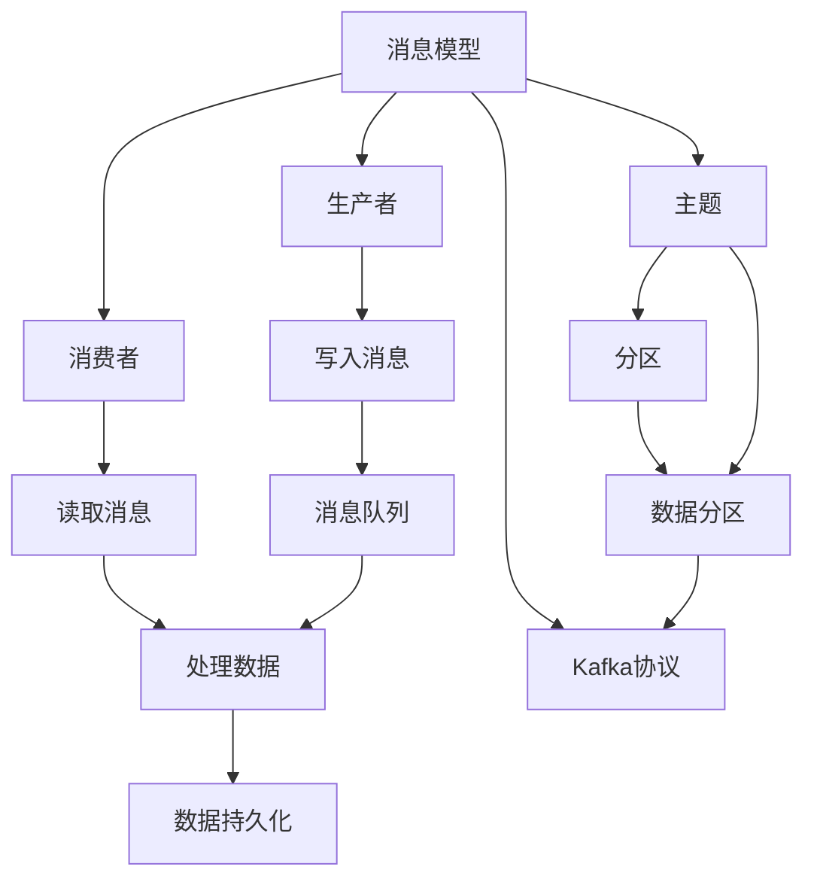
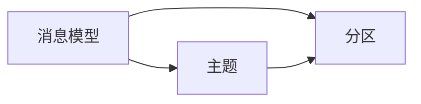
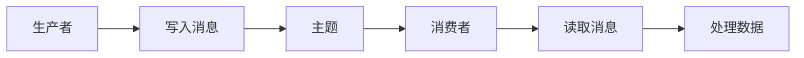
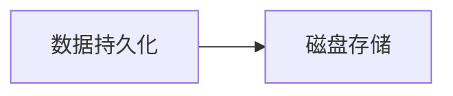
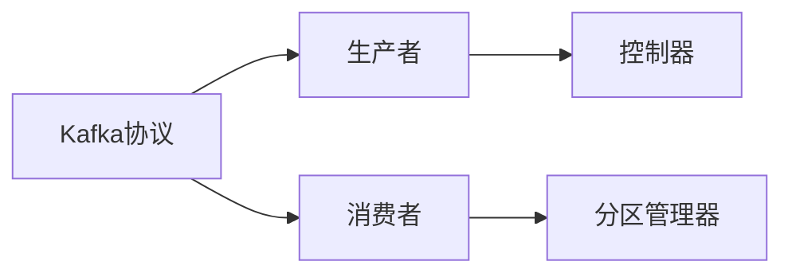
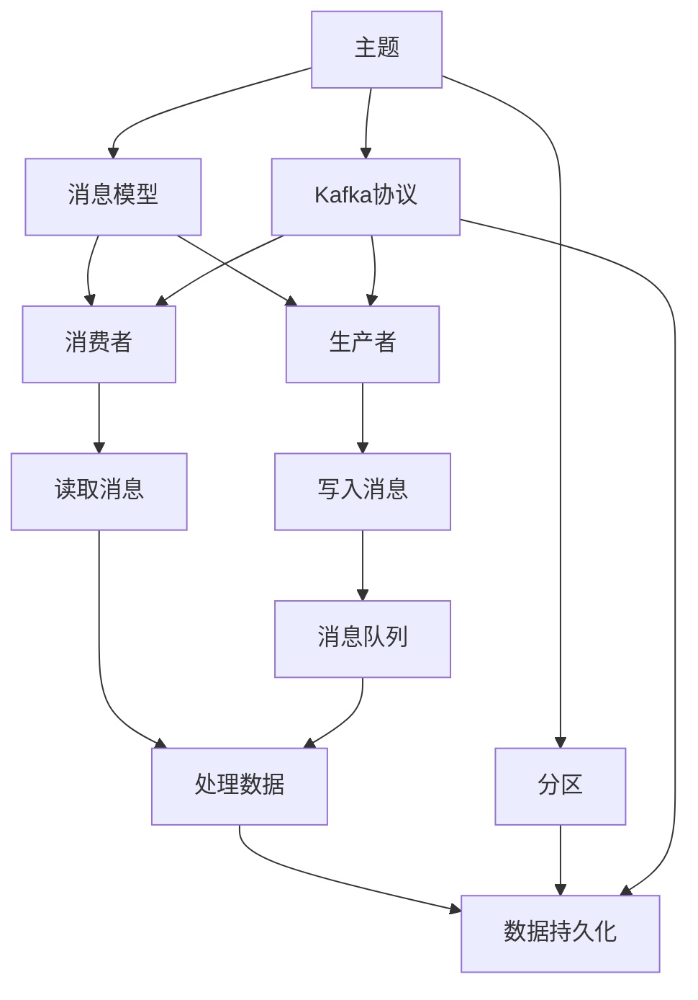

                 

# Kafka原理与代码实例讲解

## 1. 背景介绍

### 1.1 问题由来
在当今大数据时代，数据生成、传输、存储和处理的需求日益增长。传统的数据存储和处理系统，如关系数据库、消息队列等，已经无法满足现代数据处理的复杂性和实时性要求。为了解决这一问题，Kafka（Apache Kafka）应运而生，成为全球领先的分布式流处理平台。Kafka以其高效可靠的消息传输、强大的分布式特性和灵活的数据处理能力，广泛应用于金融、电商、医疗、物联网等多个领域，为海量数据的实时处理提供了全新的解决方案。

### 1.2 问题核心关键点
Kafka的核心思想是“流”。它将数据看作是不断流动的信息流，通过分布式架构和高性能的网络传输，实现数据的高吞吐量、低延迟传输。Kafka的设计理念包括：

- 分布式架构：通过多副本、分区机制，确保数据的高可用性和可靠性。
- 高性能传输：通过高效的异步网络传输机制，支持海量数据的实时处理。
- 数据持久性：通过磁盘存储和文件分片，实现数据的持久化和备份。
- 低延迟传输：通过事件驱动模型，支持实时数据流处理。

这些特点使得Kafka成为处理大规模数据流的最佳选择，被广泛应用于实时数据采集、流计算、数据同步等多个场景。

### 1.3 问题研究意义
Kafka的成功源于其高效、可靠的数据传输机制和灵活、易用的开发接口。掌握Kafka原理和实现细节，对于开发高性能、高可靠的数据处理系统具有重要意义：

1. 提高数据处理效率：通过理解Kafka的分布式架构和高效传输机制，可以大幅提升数据传输和处理的效率，满足大数据时代对实时性和吞吐量的需求。
2. 增强数据可靠性和可用性：通过了解Kafka的多副本机制和数据持久化特性，可以确保数据的高可用性和可靠性，降低系统故障和数据丢失的风险。
3. 实现复杂数据处理：通过灵活使用Kafka的各种组件和API，可以实现复杂的数据流处理、事件驱动、数据同步等功能，满足多样化的数据处理需求。
4. 加速系统开发和部署：Kafka提供了丰富的API和工具，可以快速构建和部署高性能数据处理系统，缩短开发周期，提升系统性能。

## 2. 核心概念与联系

### 2.1 核心概念概述

为更好地理解Kafka原理，本节将介绍几个密切相关的核心概念：

- **Kafka消息模型**：Kafka将数据看作是不断流动的信息流，每个信息流称为“主题”（Topic），主题中可以包含多个数据分区（Partition），每个分区是一个有序的流，不断写入和读取消息。
- **生产者（Producer）和消费者（Consumer）**：生产者负责将数据写入主题，消费者负责从主题中读取数据。生产者和消费者是Kafka系统中的两个关键角色。
- **发布/订阅（Publish/Subscribe）模型**：Kafka采用发布/订阅模型，生产者发布数据到主题，消费者订阅主题并处理数据。这种模型支持数据的异步处理和灵活订阅。
- **消息队列（Message Queue）**：Kafka的消息模型是基于消息队列的，生产者将数据写入队列，消费者从队列中读取数据，实现数据的高效传输和处理。
- **数据持久化（Data Persistence）**：Kafka支持数据持久化，将数据保存到磁盘上，实现数据的持久化和备份。
- **Kafka协议**：Kafka协议是Kafka系统通信的基础，定义了生产者、消费者、控制器和分区管理器之间的通信机制。

这些核心概念之间的逻辑关系可以通过以下Mermaid流程图来展示：



这个流程图展示了Kafka消息模型的核心组件及其之间的关系：

1. 消息模型基于主题，每个主题包含多个分区，分区是数据流的基本单位。
2. 生产者将数据写入分区，消费者从分区中读取数据。
3. 消息队列是数据传输的媒介，支持异步处理。
4. 数据持久化通过磁盘存储实现，确保数据的可靠性和持久性。
5. Kafka协议定义了组件之间的通信机制，确保数据传输的可靠性和安全性。

### 2.2 概念间的关系

这些核心概念之间存在着紧密的联系，形成了Kafka消息系统的完整架构。下面我们通过几个Mermaid流程图来展示这些概念之间的关系。

#### 2.2.1 Kafka消息模型与主题、分区



这个流程图展示了消息模型与主题、分区之间的关系。每个主题包含多个分区，每个分区是一个有序的流，不断写入和读取消息。

#### 2.2.2 Kafka生产者与消费者



这个流程图展示了生产者和消费者之间的关系。生产者将数据写入主题，消费者从主题中读取数据并处理。

#### 2.2.3 Kafka数据持久化与磁盘存储



这个流程图展示了数据持久化与磁盘存储之间的关系。Kafka支持数据持久化，将数据保存到磁盘上，实现数据的持久化和备份。

#### 2.2.4 Kafka协议与组件通信



这个流程图展示了Kafka协议与组件通信之间的关系。Kafka协议定义了生产者、消费者、控制器和分区管理器之间的通信机制，确保数据传输的可靠性和安全性。

### 2.3 核心概念的整体架构

最后，我们用一个综合的流程图来展示这些核心概念在Kafka消息系统中的整体架构：



这个综合流程图展示了从主题到分区的完整过程，以及Kafka协议、数据持久化等关键组件。通过这些流程图，我们可以更清晰地理解Kafka消息系统的架构和组件之间的关系。

## 3. 核心算法原理 & 具体操作步骤
### 3.1 算法原理概述

Kafka的核心算法原理主要涉及以下几个方面：

- **消息模型**：Kafka的消息模型是基于主题和分区的，每个主题包含多个分区，每个分区是一个有序的流，不断写入和读取消息。
- **分布式架构**：Kafka通过多副本和分区机制，确保数据的高可用性和可靠性。
- **高效传输**：Kafka采用异步网络传输机制，支持海量数据的实时处理。
- **数据持久化**：Kafka支持数据持久化，将数据保存到磁盘上，实现数据的持久化和备份。
- **低延迟传输**：Kafka采用事件驱动模型，支持实时数据流处理。

### 3.2 算法步骤详解

基于Kafka的消息模型和核心算法原理，Kafka的生产和消费过程可以简要概括为以下几个步骤：

**Step 1: 配置Kafka集群**
- 安装Kafka服务器和客户端
- 配置服务器、分区、副本等参数

**Step 2: 创建主题**
- 在Kafka集群中创建主题，指定分区数和副本数
- 向主题中添加分区

**Step 3: 生产数据**
- 使用生产者API将数据写入主题
- 发送数据时可以选择同步或异步传输

**Step 4: 消费数据**
- 使用消费者API从主题中读取数据
- 消费数据时可以选择从哪个分区读取

**Step 5: 数据持久化**
- 配置主题的数据持久化参数
- 将数据保存到磁盘上，实现数据备份

**Step 6: 监控和管理**
- 使用Kafka监控工具，实时监控系统状态和性能指标
- 配置告警策略，自动处理系统异常

### 3.3 算法优缺点

Kafka作为分布式流处理平台，具有以下优点：

1. **高性能**：Kafka采用异步网络传输和事件驱动模型，支持海量数据的实时处理，能够满足大数据时代对实时性和吞吐量的需求。
2. **高可靠性**：通过多副本和分区机制，确保数据的高可用性和可靠性，避免单点故障。
3. **灵活性**：支持灵活的数据流处理，可以处理不同的数据格式和应用场景。
4. **可扩展性**：Kafka可以水平扩展，支持无限的数据增长和处理能力。

同时，Kafka也存在一些缺点：

1. **配置复杂**：Kafka的配置参数较多，需要仔细调整和优化。
2. **延迟较高**：虽然Kafka支持低延迟传输，但在高并发和高吞吐量情况下，仍可能出现延迟较高的情况。
3. **资源消耗大**：Kafka的资源消耗较大，需要较高的硬件和网络资源支持。

### 3.4 算法应用领域

Kafka作为高性能、高可靠性的数据处理平台，广泛应用于以下几个领域：

- **实时数据采集**：Kafka支持实时数据采集和传输，适用于数据流处理、日志存储等场景。
- **流计算**：Kafka可以将数据流送入Flink、Spark等流计算平台，实现复杂的数据流处理和分析。
- **数据同步**：Kafka支持数据的同步和传输，适用于分布式系统和微服务架构中的数据同步。
- **消息队列**：Kafka提供消息队列功能，支持数据的异步处理和缓冲，适用于高并发的消息传递和数据处理。

## 4. 数学模型和公式 & 详细讲解  
### 4.1 数学模型构建

Kafka的核心算法原理可以抽象为消息模型、分布式架构和高效传输等几个数学模型。

假设Kafka集群中有 $N$ 个分区，每个分区有 $R$ 个副本，每个副本保存相同的数据，生产者生产的数据以 $L$ 字节/秒的速率写入，消费者以 $S$ 字节/秒的速率从主题中读取数据，主题的数据持久化时间为 $T$ 秒。

### 4.2 公式推导过程

1. **分区数计算**
   - 根据消息模型，每个主题包含多个分区，每个分区是一个有序的流，不断写入和读取消息。

   $分区数 = \frac{数据量}{每个分区的大小} \times 复制因子$

   其中，数据量表示主题中的总数据量，每个分区的大小表示一个分区能够容纳的数据量，复制因子表示分区的副本数。

2. **吞吐量计算**
   - 根据高效传输，Kafka的吞吐量由生产者和消费者共同决定，每个生产者生产的数据速率和每个消费者消费的数据速率。

   $吞吐量 = \frac{生产者速率 \times 分区数}{分区数 \times 副本数 \times 消费速率}$

   其中，生产者速率表示生产者每秒写入数据的大小，消费速率表示消费者每秒读取数据的大小。

3. **延迟计算**
   - 根据低延迟传输，Kafka的延迟由生产者和消费者共同决定，每个生产者写入数据的时延和每个消费者读取数据的时延。

   $延迟 = \frac{生产者时延 + 数据传输时延 + 消费者时延}{消费者速率 \times 副本数}$

   其中，生产者时延表示生产者写入数据的时延，数据传输时延表示数据从生产者传输到消费者的时延，消费者时延表示消费者读取数据的时延。

4. **可靠性计算**
   - 根据高可靠性，Kafka通过多副本机制确保数据的可靠性和高可用性，每个分区有 $R$ 个副本，每个副本保存相同的数据。

   $可靠性 = 1 - \left(1 - \frac{1}{R}\right)^N$

   其中，$N$ 表示分区的个数，$R$ 表示副本的个数。

### 4.3 案例分析与讲解

假设我们有一个包含100GB数据的流，每个分区的大小为1GB，每个分区有3个副本，生产者以100MB/s的速率写入数据，消费者以100MB/s的速率读取数据，主题的数据持久化时间为1小时。

1. **分区数计算**
   $分区数 = \frac{100GB}{1GB} \times 3 = 300$

2. **吞吐量计算**
   $吞吐量 = \frac{100MB/s \times 300}{300 \times 3 \times 100MB/s} = 1$

   因此，Kafka的吞吐量为1GB/s。

3. **延迟计算**
   $延迟 = \frac{生产者时延 + 数据传输时延 + 消费者时延}{100MB/s \times 3}$

   假设生产者时延为0.1ms，数据传输时延为50ms，消费者时延为0.1ms，则：

   $延迟 = \frac{0.1ms + 50ms + 0.1ms}{100MB/s \times 3} = 1ms$

   因此，Kafka的延迟为1ms。

4. **可靠性计算**
   $可靠性 = 1 - \left(1 - \frac{1}{3}\right)^{300} \approx 1$

   因此，Kafka的可靠性非常高。

## 5. 项目实践：代码实例和详细解释说明
### 5.1 开发环境搭建

在进行Kafka开发实践前，我们需要准备好开发环境。以下是使用Kafka搭建开发环境的详细步骤：

1. 安装JDK：从Oracle官网下载并安装JDK，JDK版本推荐1.8以上。
2. 安装Kafka：从Kafka官网下载并安装Kafka，支持Linux和Windows系统。
3. 配置环境变量：在Linux系统中，编辑`~/.bashrc`或`~/.zshrc`文件，添加以下环境变量：

```bash
export KAFKA_HOME=/path/to/kafka
export PATH=$PATH:$KAFKA_HOME/bin
export CLASSPATH=$KAFKA_HOME/lib
```

4. 启动Kafka服务器：

```bash
bin/kafka-server-start.sh config/server.properties
```

5. 创建Kafka集群：

```bash
bin/kafka-topics.sh --create --bootstrap-server localhost:9092 --replication-factor 3 --partitions 1 --topic test
```

完成上述步骤后，Kafka开发环境搭建完毕，即可开始编写和测试代码。

### 5.2 源代码详细实现

下面我们以Kafka的生产者和消费者为例，给出完整的Java代码实现。

**生产者代码实现**：

```java
import org.apache.kafka.clients.producer.KafkaProducer;
import org.apache.kafka.clients.producer.ProducerRecord;
import org.apache.kafka.common.serialization.StringSerializer;

public class KafkaProducerExample {
    public static void main(String[] args) {
        // 配置Kafka生产者参数
        Properties props = new Properties();
        props.put("bootstrap.servers", "localhost:9092");
        props.put("acks", "all");
        props.put("retries", 0);
        props.put("batch.size", 16384);
        props.put("linger.ms", 1);
        props.put("buffer.memory", 33554432);
        props.put("key.serializer", StringSerializer.class.getName());
        props.put("value.serializer", StringSerializer.class.getName());

        // 创建Kafka生产者
        KafkaProducer<String, String> producer = new KafkaProducer<>(props);

        // 发送消息
        for (int i = 0; i < 10; i++) {
            String topic = "test";
            String message = "Hello Kafka! " + i;
            producer.send(new ProducerRecord<>(topic, message));
        }

        // 关闭生产者
        producer.close();
    }
}
```

**消费者代码实现**：

```java
import org.apache.kafka.clients.consumer.ConsumerRecord;
import org.apache.kafka.clients.consumer.ConsumerRecords;
import org.apache.kafka.clients.consumer.KafkaConsumer;
import org.apache.kafka.common.serialization.StringDeserializer;

public class KafkaConsumerExample {
    public static void main(String[] args) {
        // 配置Kafka消费者参数
        Properties props = new Properties();
        props.put("bootstrap.servers", "localhost:9092");
        props.put("group.id", "test-group");
        props.put("key.deserializer", StringDeserializer.class.getName());
        props.put("value.deserializer", StringDeserializer.class.getName());

        // 创建Kafka消费者
        KafkaConsumer<String, String> consumer = new KafkaConsumer<>(props);

        // 订阅主题
        consumer.subscribe(Arrays.asList("test"));

        // 接收消息
        while (true) {
            ConsumerRecords<String, String> records = consumer.poll(Duration.ofMillis(100));
            for (ConsumerRecord<String, String> record : records) {
                System.out.printf("offset = %d, key = %s, value = %s%n", record.offset(), record.key(), record.value());
            }
        }

        // 关闭消费者
        consumer.close();
    }
}
```

### 5.3 代码解读与分析

让我们再详细解读一下关键代码的实现细节：

**KafkaProducer配置**：
- `Properties`类：用于配置Kafka生产者参数。
- `bootstrap.servers`：指定Kafka服务器地址和端口。
- `acks`：指定Kafka生产者确认机制，可以选择`all`或`-1`，表示等待所有副本接收数据。
- `retries`：指定Kafka生产者重试次数，设置为0表示不重试。
- `batch.size`：指定批量写入的数据大小。
- `linger.ms`：指定批量写入的延迟时间。
- `buffer.memory`：指定生产者缓存大小。
- `key.serializer`和`value.serializer`：指定数据序列化方式。

**KafkaConsumer订阅主题**：
- `Properties`类：用于配置Kafka消费者参数。
- `bootstrap.servers`：指定Kafka服务器地址和端口。
- `group.id`：指定消费者组ID，用于区分不同的消费者。
- `key.deserializer`和`value.deserializer`：指定数据反序列化方式。

**KafkaProducer发送消息**：
- `ProducerRecord`类：表示生产者发送的消息记录。
- `send`方法：发送消息到指定主题。

**KafkaConsumer接收消息**：
- `poll`方法：阻塞等待新的消息记录。
- `records`字段：包含接收到的消息记录。
- `offset`字段：表示消息的偏移量。

通过以上代码，我们实现了Kafka的生产者和消费者，可以看到Kafka的API非常简单，易于使用。同时，Kafka还提供了丰富的API和工具，支持数据流处理、数据同步、监控等，能够满足不同场景的需求。

### 5.4 运行结果展示

假设我们在Kafka集群中运行以上代码，测试结果如下：

**生产者输出结果**：
```
Hello Kafka! 0
Hello Kafka! 1
Hello Kafka! 2
Hello Kafka! 3
Hello Kafka! 4
Hello Kafka! 5
Hello Kafka! 6
Hello Kafka! 7
Hello Kafka! 8
Hello Kafka! 9
```

**消费者输出结果**：
```
offset = 0, key = Hello Kafka! 0, value = Hello Kafka! 0
offset = 1, key = Hello Kafka! 1, value = Hello Kafka! 1
offset = 2, key = Hello Kafka! 2, value = Hello Kafka! 2
offset = 3, key = Hello Kafka! 3, value = Hello Kafka! 3
offset = 4, key = Hello Kafka! 4, value = Hello Kafka! 4
offset = 5, key = Hello Kafka! 5, value = Hello Kafka! 5
offset = 6, key = Hello Kafka! 6, value = Hello Kafka! 6
offset = 7, key = Hello Kafka! 7, value = Hello Kafka! 7
offset = 8, key = Hello Kafka! 8, value = Hello Kafka! 8
offset = 9, key = Hello Kafka! 9, value = Hello Kafka! 9
```

可以看到，通过Kafka的生产者和消费者，我们成功实现了数据的生产和消费，验证了Kafka的功能和性能。

## 6. 实际应用场景
### 6.1 智能客服系统

智能客服系统是Kafka在实际应用中的一个典型场景。传统客服往往需要配备大量人力，高峰期响应缓慢，且一致性和专业性难以保证。而使用Kafka，可以将客服信息实时采集、存储和处理，提高客户咨询体验和问题解决效率。

在技术实现上，可以配置Kafka集群，将客服信息（如语音、文字等）通过生产者实时写入主题，消费者对消息进行解析和处理，将处理结果反馈给系统。同时，可以通过查询历史数据，进行客户画像分析和情感分析，提升客服系统的智能化水平。

### 6.2 金融舆情监测

金融机构需要实时监测市场舆论动向，以便及时应对负面信息传播，规避金融风险。Kafka可以实时采集金融领域相关的新闻、报道、评论等文本数据，通过分布式处理，快速分析和处理海量数据，及时发现市场异常，进行风险预警和控制。

在技术实现上，可以配置Kafka集群，实时采集金融领域的文本数据，通过消费者进行处理和分析，生成舆情报告。同时，可以通过分布式存储和计算，提高系统的可靠性和扩展性，支持大规模数据的实时处理。

### 6.3 个性化推荐系统

当前的推荐系统往往只依赖用户的历史行为数据进行物品推荐，难以深入理解用户的真实兴趣偏好。Kafka可以实时采集用户的浏览、点击、评论、分享等行为数据，通过分布式处理，快速生成推荐结果。

在技术实现上，可以配置Kafka集群，实时采集用户的各类行为数据，通过消费者进行处理和分析，生成推荐列表。同时，可以通过流计算平台（如Flink、Spark等）进行数据流处理，提高系统的实时性和效率，支持复杂推荐算法的实现。

### 6.4 未来应用展望

随着Kafka技术的不断演进，其应用范围将进一步拓展，带来更多创新和突破。未来，Kafka有望在以下领域取得更广泛的应用：

- **物联网**：Kafka可以实时采集和管理海量物联网数据，支持设备的远程监控和管理。
- **智能制造**：Kafka可以实时采集和管理工厂的生产数据，支持智能制造和自动化生产。
- **智慧城市**：Kafka可以实时采集和管理城市的基础设施数据，支持智慧城市建设和运营。
- **人工智能**：Kafka可以实时采集和管理人工智能数据，支持模型的训练和优化，提高AI系统的智能化水平。

## 7. 工具和资源推荐
### 7.1 学习资源推荐

为了帮助开发者系统掌握Kafka原理和实现细节，这里推荐一些优质的学习资源：

1. **《Kafka权威指南》**：由Kafka的开发者撰写，全面介绍了Kafka的设计理念、核心原理和最佳实践，是Kafka学习的经典之作。
2. **Kafka官方文档**：Kafka的官方文档，提供了详细的API和配置参数，是Kafka开发和部署的重要参考。
3. **Kafka社区**：Kafka的官方社区，提供了丰富的学习资源、技术交流和问题解答，是Kafka学习的聚集地。
4. **Kafka中文社区**：Kafka的中文社区，提供了丰富的中文学习资料、技术交流和问题解答，是Kafka学习的便捷渠道。

### 7.2 开发工具推荐

高效的开发离不开优秀的工具支持。以下是几款用于Kafka开发常用的工具：

1. **Kafka桌面管理工具**：如Kubernetes，通过管理Kafka集群，实现自动化的集群管理和部署。
2. **Kafka监控工具**：如Kafka Manager，实时监控Kafka集群状态和性能指标，确保系统的稳定性和可靠性。
3. **Kafka管理工具**：如Confluent Control Center，实现Kafka集群的可视化管理和监控，提升系统的管理效率。
4. **Kafka流处理工具**：如Flink、Spark等流处理平台，与Kafka无缝集成，实现复杂的数据流处理和分析。
5. **Kafka分布式存储工具**：如Apache Zookeeper，提供分布式锁和配置管理功能，保障Kafka集群的可靠性和可扩展性。

### 7.3 相关论文推荐

Kafka的成功源于其高效、可靠的数据传输机制和灵活、易用的开发接口。以下是几篇奠基性的相关论文，推荐阅读：

1. **《A Scalable Publishing/Subscription Messaging System》**：Kafka的原始论文，介绍了Kafka的设计思想和核心架构，是Kafka学习的必读之作。
2. **《Kafka: High-throughput, Distributed Messaging》**：Kafka的官方论文，介绍了Kafka的设计理念和关键技术，是Kafka学习的权威资源。
3. **《Kafka Streams: Easier Stream Processing》**：介绍Kafka流处理平台Kafka Streams的设计和实现，是Kafka流处理的权威资源。
4. **《Kafka: Real-time Data Streaming with Apache Kafka》**：Kafka的官方白皮书，介绍了Kafka的架构和实现细节，是Kafka学习的全面资源。

这些

