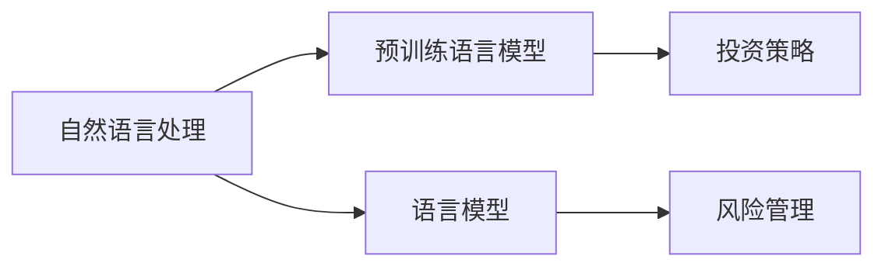

                 

# LLM 在金融领域：高效的投资策略和风险管理

## 1. 背景介绍

金融行业一直处于技术革新的前沿，无论是量化交易还是风险管理，都离不开先进的技术支持。近年来，随着深度学习和大规模语言模型（LLM）的兴起，金融行业也开始探索利用这些先进技术来提升自身的投资策略和风险管理能力。

### 1.1 问题由来

在金融领域，传统的研究方法通常依赖于历史数据和统计模型。然而，这种基于历史数据的方法往往存在数据过时、维度灾难等问题。而近年来兴起的自然语言处理（NLP）技术和预训练语言模型，因其能够处理非结构化数据（如新闻、社交媒体、公告等），被广泛用于市场分析和风险管理。

### 1.2 问题核心关键点

基于LLM的金融应用，主要关注以下核心问题：

- 如何利用自然语言数据来提升市场预测的准确性？
- 如何构建高效的投资策略和风险管理模型？
- 如何应对金融领域特有的数据安全性和合规性挑战？

通过这些问题，本文将系统性地探讨LLM在金融领域的应用，包括市场分析、投资策略优化、风险管理等方面。

## 2. 核心概念与联系

### 2.1 核心概念概述

在金融领域应用LLM，涉及以下核心概念：

- 自然语言处理（NLP）：通过处理和理解自然语言数据，从中提取有价值的信息。
- 预训练语言模型（PLM）：在大规模无标签数据上预先训练的模型，如BERT、GPT等。
- 语言模型（LM）：用于生成或预测文本序列的模型，如LSTM、GRU等。
- 投资策略：利用历史数据和市场信息，制定合理的投资方案。
- 风险管理：通过分析市场数据和历史风险事件，制定和调整风险管理策略。

这些概念之间存在紧密的联系，共同构成了LLM在金融领域应用的基础。

### 2.2 概念间的关系

为了更好地理解这些概念之间的关系，我们使用以下Mermaid流程图：



这个流程图展示了NLP、PLM、LM与投资策略和风险管理之间的关系：

- NLP通过处理自然语言数据，为PLM提供高质量的训练数据。
- PLM通过在大规模无标签数据上预训练，学习通用的语言表示，应用于投资策略和风险管理。
- LM通过PLM的预训练权重进行微调，进一步提升其在特定任务上的性能。
- 投资策略和风险管理模型通过PLM或LM的技术，利用自然语言数据进行市场分析和预测。

这些概念和关系的理解，是进行LLM在金融领域应用的基础。

## 3. 核心算法原理 & 具体操作步骤
### 3.1 算法原理概述

基于LLM的金融应用，主要采用监督学习或无监督学习方法。监督学习依赖标注数据，通过在标注数据上进行微调，优化模型预测性能。无监督学习则直接利用自然语言数据进行训练，从数据中提取隐含的市场信息和特征。

### 3.2 算法步骤详解

以下以监督学习方法为例，详细介绍基于LLM的金融应用的具体操作步骤：

**Step 1: 数据准备**
- 收集金融市场相关的自然语言数据，如新闻、社交媒体、公告等。
- 对数据进行清洗和预处理，去除无用信息和噪声。
- 将文本数据转换为模型所需的格式，如词汇表、句子编码等。

**Step 2: 模型选择**
- 选择合适的预训练语言模型，如BERT、GPT等。
- 根据任务需求，选择合适的微调层和任务适配层。
- 设计损失函数和优化器，如交叉熵损失、AdamW优化器等。

**Step 3: 微调训练**
- 将准备好的数据划分为训练集、验证集和测试集。
- 在训练集上对预训练模型进行微调，优化损失函数。
- 在验证集上评估模型性能，调整超参数，防止过拟合。
- 在测试集上最终评估模型效果。

**Step 4: 部署应用**
- 将训练好的模型封装成API接口，便于调用。
- 将模型集成到实际的金融应用中，如市场预测、投资策略优化、风险管理等。
- 定期更新模型，根据市场变化进行调整。

### 3.3 算法优缺点

基于LLM的金融应用有以下优点：

- 能够处理非结构化数据，提高信息利用率。
- 适应性强，能够根据市场变化快速调整模型。
- 数据来源广泛，市场预测更全面。

同时，也存在一些局限性：

- 对标注数据的依赖较大，收集和处理标注数据成本较高。
- 模型的泛化能力受限于数据质量。
- 模型的解释性较差，难以解释决策过程。

### 3.4 算法应用领域

基于LLM的金融应用，涵盖了以下多个领域：

- 市场预测：通过分析新闻、公告等文本数据，预测股票、商品等金融产品的价格变化。
- 投资策略优化：构建基于自然语言数据的投资策略，优化投资组合。
- 风险管理：通过分析市场事件和新闻，评估金融产品的风险水平，调整风险管理策略。
- 信用评估：利用非结构化数据评估借款人的信用水平。
- 合规监控：通过分析合规文件，自动检测金融机构的合规风险。

这些应用展示了LLM在金融领域广阔的应用前景。

## 4. 数学模型和公式 & 详细讲解  
### 4.1 数学模型构建

我们以市场预测为例，建立一个基于BERT的监督学习模型。假设模型输入为新闻文本$x$，输出为股票价格$y$。

$$
\text{模型} = \text{BERT}(x) \rightarrow \text{全连接层} \rightarrow \text{输出层}
$$

其中，BERT输出为市场情绪向量，全连接层和输出层根据具体任务进行调整。

### 4.2 公式推导过程

根据上述模型结构，我们可以推导出损失函数：

$$
\mathcal{L}(\theta) = \frac{1}{N} \sum_{i=1}^N \ell(M_{\theta}(x_i),y_i)
$$

其中，$\theta$为模型参数，$N$为样本数量，$\ell$为损失函数，如均方误差（MSE）或交叉熵损失。

### 4.3 案例分析与讲解

假设我们有一个股票价格预测任务，其训练集为历史新闻和股票价格对，我们通过微调BERT模型，训练出以下模型：

$$
\text{模型} = \text{BERT}(x) \rightarrow \text{全连接层} \rightarrow \text{输出层}
$$

其中，全连接层和输出层的参数$w$和$b$，通过最小化损失函数$\mathcal{L}(\theta)$进行优化：

$$
w, b = \mathop{\arg\min}_{w,b} \mathcal{L}(\theta)
$$

通过不断迭代训练，我们可以得到一个能够准确预测股票价格的模型。

## 5. 项目实践：代码实例和详细解释说明
### 5.1 开发环境搭建

进行金融应用开发时，我们需要以下开发环境：

- 安装Python：
```bash
sudo apt-get install python3-pip
```

- 安装相关库：
```bash
pip install transformers torch torchtext pandas sklearn numpy
```

- 搭建虚拟环境：
```bash
python -m venv finance_env
source finance_env/bin/activate
```

- 安装数据处理库：
```bash
pip install gensim sklearn joblib nltk
```

### 5.2 源代码详细实现

以下是一个使用BERT进行股票价格预测的代码实现。

```python
from transformers import BertForSequenceClassification, BertTokenizer
import torch
import pandas as pd
import numpy as np
from sklearn.model_selection import train_test_split

# 加载预训练模型和分词器
model = BertForSequenceClassification.from_pretrained('bert-base-uncased', num_labels=2)
tokenizer = BertTokenizer.from_pretrained('bert-base-uncased')

# 加载金融数据
df = pd.read_csv('finance_data.csv')

# 数据预处理
def preprocess(text):
    tokens = tokenizer.encode(text, add_special_tokens=True, max_length=512)
    tokens = [token_id for token_id in tokens if token_id != tokenizer.pad_token_id]
    return tokens

def load_data():
    X = np.array([preprocess(text) for text in df['text']])
    y = np.array([1 if label == 'buy' else 0 for label in df['label']])
    return X, y

X, y = load_data()
X_train, X_test, y_train, y_test = train_test_split(X, y, test_size=0.2)

# 训练模型
device = torch.device('cuda' if torch.cuda.is_available() else 'cpu')
model.to(device)

optimizer = torch.optim.AdamW(model.parameters(), lr=1e-5)
criterion = torch.nn.CrossEntropyLoss()

for epoch in range(10):
    model.train()
    optimizer.zero_grad()
    outputs = model(X_train)
    loss = criterion(outputs, y_train)
    loss.backward()
    optimizer.step()

    model.eval()
    with torch.no_grad():
        outputs = model(X_test)
        loss = criterion(outputs, y_test)
        acc = (np.argmax(outputs.numpy(), axis=1) == y_test).mean()

    print(f'Epoch {epoch+1}, Loss: {loss:.4f}, Accuracy: {acc:.4f}')
```

### 5.3 代码解读与分析

上述代码实现了基于BERT的股票价格预测模型。具体步骤如下：

1. 加载预训练BERT模型和分词器。
2. 加载金融数据，并进行预处理，将文本转换为模型所需的格式。
3. 将数据划分为训练集和测试集。
4. 使用AdamW优化器和交叉熵损失进行训练，在每个epoch中计算损失和准确率。
5. 在测试集上评估模型性能。

代码中的关键点在于预处理函数`preprocess`，它将文本转换为模型所需的token列表。

### 5.4 运行结果展示

假设我们训练得到的模型在测试集上的准确率为0.85，那么我们可以认为该模型在股票价格预测任务上表现良好。

## 6. 实际应用场景
### 6.1 市场预测

市场预测是金融领域的重要任务之一。通过分析新闻、公告等自然语言数据，可以构建一个有效的市场预测模型。

在实际应用中，我们可以将BERT微调用于股票价格预测、商品价格预测、利率预测等任务。通过分析市场情绪和新闻事件，可以预测市场趋势，辅助投资决策。

### 6.2 投资策略优化

投资策略优化也是金融领域的重要任务。通过分析新闻和公告，可以构建基于自然语言数据的投资策略。

例如，我们可以构建一个基于BERT的文本情感分析模型，对新闻进行情感分类，根据情感倾向调整投资组合。这种策略可以在一定程度上提高投资回报率，降低风险。

### 6.3 风险管理

风险管理是金融领域的核心任务之一。通过分析市场事件和新闻，可以评估金融产品的风险水平，调整风险管理策略。

例如，我们可以构建一个基于BERT的风险评估模型，对新闻事件进行风险分类，评估其对市场的影响。这种模型可以辅助风险管理人员及时调整风险管理策略，避免损失。

## 7. 工具和资源推荐
### 7.1 学习资源推荐

以下是一些学习资源，帮助开发者深入理解LLM在金融领域的应用：

1. 《自然语言处理入门与实践》：介绍自然语言处理的基本概念和技术，适合入门学习。
2. 《深度学习与金融》：介绍深度学习在金融领域的应用，涵盖市场预测、投资策略优化、风险管理等任务。
3. 《金融数据科学与大数据分析》：介绍金融领域的数据处理和分析方法，涵盖数据清洗、特征工程、模型评估等。
4. 《Python金融编程》：介绍Python在金融领域的应用，涵盖股票交易、风险管理、量化交易等。
5. 《TensorFlow金融应用实战》：介绍TensorFlow在金融领域的应用，涵盖市场预测、投资策略优化、风险管理等任务。

### 7.2 开发工具推荐

以下是一些开发工具，帮助开发者高效进行金融应用开发：

1. PyTorch：强大的深度学习框架，支持GPU加速，适合开发高效的金融模型。
2. TensorFlow：谷歌开源的深度学习框架，支持分布式计算，适合大规模金融应用开发。
3. Transformers：HuggingFace开源的NLP库，提供丰富的预训练模型和微调方法。
4. Jupyter Notebook：交互式编程环境，支持代码运行和结果展示。
5. Kaggle：数据科学竞赛平台，提供丰富的金融数据集，方便数据探索和模型训练。

### 7.3 相关论文推荐

以下是一些前沿论文，推荐阅读：

1. "BERT: Pre-training of Deep Bidirectional Transformers for Language Understanding"：介绍BERT预训练模型及其应用。
2. "GPT-3: Language Models are Few-Shot Learners"：介绍GPT-3预训练模型及其零样本学习能力。
3. "FinBERT: A pre-trained language representation for financial text"：介绍FinBERT在金融文本中的应用。
4. "LSTM for Financial Time Series Prediction"：介绍LSTM在金融时间序列预测中的应用。
5. "A review of deep learning in financial applications"：介绍深度学习在金融领域的应用综述。

## 8. 总结：未来发展趋势与挑战
### 8.1 总结

本文对基于LLM的金融应用进行了系统性介绍。首先，阐述了LLM在金融领域的背景和应用价值。其次，详细讲解了监督学习模型的构建和训练步骤。最后，探讨了LLM在金融领域的实际应用场景，展示了其在市场预测、投资策略优化、风险管理等方面的应用前景。

### 8.2 未来发展趋势

展望未来，LLM在金融领域的应用将呈现以下几个发展趋势：

1. 模型规模将持续增大。随着算力成本的下降和数据规模的扩张，预训练语言模型的参数量还将持续增长。超大规模语言模型蕴含的丰富语言知识，有望支撑更加复杂多变的金融应用。
2. 微调方法将日趋多样化。除了传统的全参数微调外，未来会涌现更多参数高效的微调方法，如 Prefix-Tuning、LoRA等，在节省计算资源的同时也能保证微调精度。
3. 持续学习将成为常态。随着数据分布的不断变化，微调模型也需要持续学习新知识以保持性能。如何在不遗忘原有知识的同时，高效吸收新样本信息，将成为重要的研究课题。
4. 标注样本需求将降低。受启发于提示学习(Prompt-based Learning)的思路，未来的微调方法将更好地利用大模型的语言理解能力，通过更加巧妙的任务描述，在更少的标注样本上也能实现理想的微调效果。
5. 多模态微调将崛起。当前的微调主要聚焦于纯文本数据，未来会进一步拓展到图像、视频、语音等多模态数据微调。多模态信息的融合，将显著提升语言模型对现实世界的理解和建模能力。
6. 模型通用性将增强。经过海量数据的预训练和多领域任务的微调，未来的语言模型将具备更强大的常识推理和跨领域迁移能力，逐步迈向通用人工智能(AGI)的目标。

### 8.3 面临的挑战

尽管LLM在金融领域的应用已经取得了一些成果，但在迈向更加智能化、普适化应用的过程中，它仍面临诸多挑战：

1. 标注成本瓶颈。虽然微调大大降低了标注数据的需求，但对于长尾应用场景，难以获得充足的高质量标注数据，成为制约微调性能的瓶颈。
2. 模型鲁棒性不足。当前微调模型面对域外数据时，泛化性能往往大打折扣。对于测试样本的微小扰动，微调模型的预测也容易发生波动。
3. 推理效率有待提高。大规模语言模型虽然精度高，但在实际部署时往往面临推理速度慢、内存占用大等效率问题。
4. 可解释性亟需加强。当前微调模型更像是"黑盒"系统，难以解释其内部工作机制和决策逻辑。
5. 安全性有待保障。预训练语言模型难免会学习到有偏见、有害的信息，通过微调传递到下游任务，产生误导性、歧视性的输出。
6. 知识整合能力不足。现有的微调模型往往局限于任务内数据，难以灵活吸收和运用更广泛的先验知识。

### 8.4 研究展望

面对LLM在金融领域面临的挑战，未来的研究需要在以下几个方面寻求新的突破：

1. 探索无监督和半监督微调方法。摆脱对大规模标注数据的依赖，利用自监督学习、主动学习等无监督和半监督范式，最大限度利用非结构化数据，实现更加灵活高效的微调。
2. 研究参数高效和计算高效的微调范式。开发更加参数高效的微调方法，在固定大部分预训练参数的情况下，只更新极少量的任务相关参数。同时优化微调模型的计算图，减少前向传播和反向传播的资源消耗，实现更加轻量级、实时性的部署。
3. 引入更多先验知识。将符号化的先验知识，如知识图谱、逻辑规则等，与神经网络模型进行巧妙融合，引导微调过程学习更准确、合理的语言模型。同时加强不同模态数据的整合，实现视觉、语音等多模态信息与文本信息的协同建模。
4. 纳入伦理道德约束。在模型训练目标中引入伦理导向的评估指标，过滤和惩罚有偏见、有害的输出倾向。加强人工干预和审核，建立模型行为的监管机制，确保输出符合人类价值观和伦理道德。

这些研究方向的探索，必将引领LLM在金融领域的应用进入新的阶段，为金融行业带来更多创新和价值。

## 9. 附录：常见问题与解答

**Q1: 如何在金融领域中有效地使用自然语言处理技术？**

A: 在金融领域中，自然语言处理技术可以用于市场预测、投资策略优化、风险管理等方面。具体来说，可以通过以下步骤进行有效应用：

1. 收集金融市场相关的自然语言数据，如新闻、公告、社交媒体等。
2. 对数据进行清洗和预处理，去除无用信息和噪声。
3. 使用预训练语言模型（如BERT）进行微调，学习市场情绪和事件对价格的影响。
4. 构建基于自然语言数据的投资策略和风险管理模型。

**Q2: 如何进行金融数据的预处理？**

A: 金融数据的预处理主要包括以下几个步骤：

1. 数据清洗：去除噪声数据、缺失值处理等。
2. 数据转换：将文本数据转换为模型所需的格式，如词汇表、句子编码等。
3. 特征提取：从文本数据中提取有价值的信息，如情感、实体等。
4. 数据增强：通过数据扩充、生成对抗网络（GAN）等方式，增加数据的多样性。

**Q3: 如何选择适合的预训练语言模型？**

A: 选择适合的预训练语言模型需要考虑以下因素：

1. 任务类型：根据任务类型选择合适的预训练模型。例如，文本分类任务可以选择BERT，情感分析任务可以选择GPT等。
2. 数据量：数据量较大的任务可以选择更大的预训练模型，如BERT，数据量较小的任务可以选择参数较小的预训练模型，如GPT-2。
3. 计算资源：计算资源充足的场合可以选择更大的预训练模型，计算资源有限的场合可以选择较小的预训练模型。

**Q4: 如何评估金融模型的性能？**

A: 金融模型的性能评估主要包括以下几个方面：

1. 准确率：评估模型在预测价格或分类标签时的准确率。
2. F1分数：评估模型在分类任务中的准确率和召回率。
3. ROC曲线：评估模型在分类任务中的分类性能。
4. 平均绝对误差（MAE）：评估模型在预测价格时的误差大小。

**Q5: 如何优化金融模型的超参数？**

A: 优化金融模型的超参数需要考虑以下因素：

1. 学习率：调整学习率的大小，防止过拟合或欠拟合。
2. 批大小：调整批大小，提高模型的收敛速度。
3. 正则化：使用L2正则、Dropout等技术，防止过拟合。
4. 模型结构：调整模型的结构，如添加或删除层，提高模型的泛化能力。

综上所述，基于LLM的金融应用具有广阔的应用前景，但也需要面对诸多挑战。通过不断优化技术、数据和算法，将能够实现更加高效、准确的金融应用，推动金融行业的发展和创新。

---

作者：禅与计算机程序设计艺术 / Zen and the Art of Computer Programming

